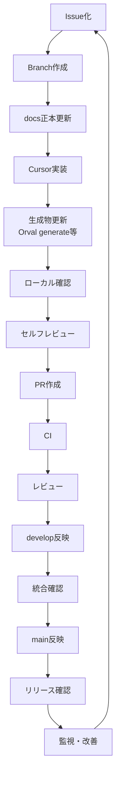
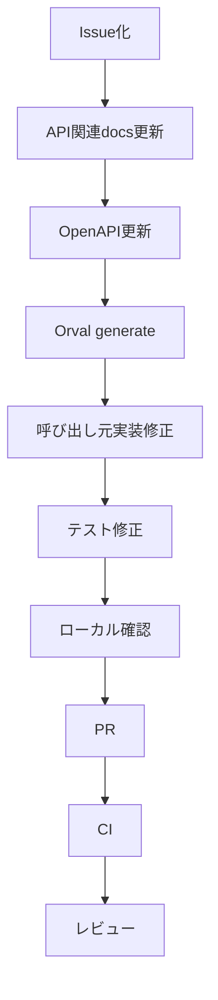
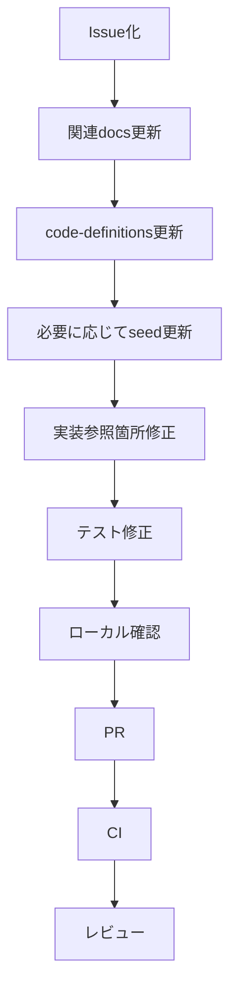

# DevOps方針書

## 1. 目的

## 1. 目的

**個人開発 × AIエージェント（Cursor中心）前提で持続可能に推進するDevOps方針**

として定義するものである。

本プロジェクトは、設計成果物を repo 内 `docs/` に正本として管理し、GitHub / Cursor / GitHub Actions を中心に、設計・実装・テスト・リリースを一貫して運用する。

本方針書の目的は以下である。

```text
- 開発を成立させる
- 開発スピードを最大化する
- 品質を破綻させない
- docs正本と実装コードの整合性を維持する
- API契約とAPIクライアントの整合性を維持する
- AIエージェントを制御可能な形で活用する
- 将来のチーム開発へ拡張可能な運用構造を維持する
```

---

## 2. 本ドキュメントの位置づけ

本方針書は、開発・運用プロセス全体の上位方針を定義する。

| 成果物                             | 役割                                                                                        |
| ---------------------------------- | ------------------------------------------------------------------------------------------- |
| DevOps方針書                       | 設計、開発、テスト、リリース、運用、AI活用、Issue / Branch / PR運用の上位方針を定義する     |
| CI・CD方針書                       | GitHub Actionsを中心に、CI/CDのトリガー、ジョブ構成、デプロイ制御、環境別反映方針を定義する |
| テスト方針書                       | テスト全体の思想、重視する品質、対象範囲、優先度を定義する                                  |
| テスト定義書                       | テストレベル、テスト種別、テスト観点、対象範囲を定義する                                    |
| 全体テスト計画書                   | 各テストフェーズの順序、開始条件、終了条件、品質ゲートを定義する                            |
| プロジェクトディレクトリ構成定義書 | repo内のコード、docs、tests、db、CI/CD資材の配置方針を定義する                              |

| 項目                | 内容                                            |
| ------------------- | ----------------------------------------------- |
| 開発体制            | 個人開発                                        |
| 設計主体            | ChatGPT / Cursor による補助、人間による最終判断 |
| 実装主体            | Cursor中心                                      |
| 正本                | repo内 `docs/`                                  |
| 副本                | Notion                                          |
| 開発方針            | MVP高速開発                                     |
| システム構成        | web / api / reco / batch 分離                   |
| API契約             | OpenAPIで管理                                   |
| APIクライアント生成 | Orvalにより自動生成                             |
| コード定義          | `packages/code-definitions/` で管理             |
| CI/CD               | GitHub Actions                                  |
| タスク管理          | GitHub Issues / GitHub Projects                 |
| 非機能              | Observability設計済                             |

---

## 3. 前提

| 項目               | 内容                                                                                           |
| ------------------ | ---------------------------------------------------------------------------------------------- |
| 開発体制           | 個人開発を基本とする                                                                           |
| 開発支援           | Cursorを主たる実装支援、ChatGPTを設計レビュー・整理支援として活用する                          |
| 最終判断           | 人間が行う                                                                                     |
| Repository         | monorepo構成                                                                                   |
| 正本               | repo内docs                                                                                     |
| 副本               | Notion                                                                                         |
| 実装コンポーネント | web / api / reco / batch                                                                       |
| 共通ロジック       | packages/shared-logic                                                                          |
| DB                 | PostgreSQL / pgvector を前提                                                                   |
| Batch実行          | GitHub Actions                                                                                 |
| CI/CD              | GitHub Actions中心                                                                             |
| ブランチ           | main / develop / feature / fix / hotfix                                                        |
| テスト体系         | 技術検証、単体、モジュール結合、コンポーネント結合、システム、非機能、レコメンド品質評価、受入 |
| Observability      | MVPから品質ゲートに含める                                                                      |

### 3.1 基本原則

| 原則                         | 内容                                                           |
| ---------------------------- | -------------------------------------------------------------- |
| 開発速度を優先する           | MVPでは過剰な統制より、実装・検証サイクルを重視する            |
| 壊れない最小構成を維持する   | 個人開発で運用可能な範囲に自動化を絞る                         |
| docs正本を中心にする         | 実装判断の前提は repo 内 `docs/` とする                        |
| AIを主開発補助として活用する | Cursorを中心に設計参照・実装・レビューを行う                   |
| 人間が最終判断する           | 仕様判断、設計判断、リリース判断は人間が行う                   |
| 作業を仕組み化する           | 手作業の再現性が低い部分はテンプレート・CI・workflowで補助する |
| 生成物は生成元から再生成する | Orval生成コードなどは手修正せず、OpenAPIから再生成する         |

---

## 5. DevOps全体プロセス

#### 事実

```text
- 個人開発では工程分業が難しい
- AIは高速だが、設計整合性を自動保証しない
- 実装設計以降は複数ドキュメント間の整合が重要になる
- API仕様とAPIクライアントの手動同期は不整合を生みやすい
- Feature / Semantic / status / error_code などのコード定義は複数コンポーネントで横断利用される
```

#### 推論

```text
repo内docs正本
  ×
OpenAPIによるAPI契約管理
  ×
OrvalによるAPIクライアント自動生成
  ×
code-definitionsによるコード定義管理
  ×
AIエージェント横断参照
```

を前提としたDevOpsが必要である。

---

## 4. 開発プロセス全体像

本プロジェクトの基本開発フローは以下とする。



### 6.2 repo内docs正本方針

## 5. 開発プロセス方針

### 5.1 Issue化

作業は原則として Issue を起点にする。

| 項目         | 方針                                            |
| ------------ | ----------------------------------------------- |
| 作業単位     | 1 Issue = 1目的                                 |
| 起票対象     | 設計、実装、テスト、修正、調査、改善            |
| 必須情報     | 目的、背景、作業内容、参照docs、完了条件        |
| docs連携     | 設計変更を伴うIssueでは、更新対象docsを明示する |
| Projects連携 | GitHub Projectsで状態・予定・期限を管理する     |

### 6.3 Notionとの関係

### 5.2 Branch作成

Issueに対応する作業Branchを作成する。

| 項目          | 方針                      |
| ------------- | ------------------------- |
| branch起点    | Issue                     |
| branch粒度    | 1 Issueに対応する作業単位 |
| branch命名    | GitHub運用ルールに従う    |
| main直作業    | 禁止                      |
| develop直作業 | 原則禁止                  |

---

### 5.3 docs正本更新

実装前に、必要なdocsを更新する。

| 項目           | 方針                           |
| -------------- | ------------------------------ |
| 正本           | repo内 `docs/`                 |
| 副本           | Notion                         |
| 実装前提       | Cursorはdocsを参照して実装する |
| 設計変更       | docs更新を必須とする           |
| 暗黙仕様       | 禁止                           |
| docs未更新実装 | 原則禁止                       |

設計変更を伴う作業では、以下を満たしてから実装へ進む。

```text
- 変更対象docsが明確である
- 更新後の設計内容が実装可能な粒度である
- 関連docsとの矛盾がない
- API契約やコード定義に影響する場合、その更新要否を確認済みである
```

### 7.3 Issue必須項目

### 5.4 Cursor実装

Cursorを主実装手段として利用する。

| 項目       | 方針                                     |
| ---------- | ---------------------------------------- |
| 実装主体   | Cursor                                   |
| 入力       | Issue、参照docs、AGENTS.md、Cursor Rules |
| 人間の役割 | 方針判断、レビュー、最終承認             |
| 実装単位   | 小さく分ける                             |
| 仕様判断   | AI任せにしない                           |
| 設計外実装 | 禁止                                     |

Cursorへの実装依頼では、原則として以下を明示する。

```text
- 対象Issue
- 参照すべきdocs
- 変更対象ディレクトリ
- 実装範囲
- 変更してよい範囲
- 変更してはいけない範囲
- テスト観点
```

### 7.4 Issueとdocsの紐づけ

設計・実装・テストに関わるIssueでは、関連するdocsを明示する。

### 5.5 生成物更新

OpenAPIやコード定義の更新に伴い、生成物が必要な場合は再生成する。

| 対象                 | 生成元                                              | 生成物                                |
| -------------------- | --------------------------------------------------- | ------------------------------------- |
| web → api API client | `packages/contracts/openapi/public-api.yaml`        | `apps/web/src/generated/api/`         |
| api → reco client    | `packages/contracts/openapi/internal-reco-api.yaml` | `apps/api/src/generated/reco-client/` |
| TypeScript型         | OpenAPI / code-definitions                          | 生成または同期対象                    |
| DB seed              | code-definitions / master定義                       | `db/seeds/` 配下のseed                |

---

### 5.6 ローカル確認

PR作成前に、ローカルで最低限の確認を行う。

| 観点           | 内容                                   |
| -------------- | -------------------------------------- |
| build          | 対象コンポーネントがbuildできること    |
| test           | 対象テストが通ること                   |
| typecheck      | TypeScript型検証が通ること             |
| API client生成 | OpenAPI更新時にOrval生成が成功すること |
| runtime        | 主要処理がローカルで実行できること     |
| docs           | docsと実装の前提が矛盾していないこと   |

| ブランチ    | 役割                   |
| ----------- | ---------------------- |
| main        | 本番反映対象           |
| develop     | 統合確認対象           |
| feature/\*  | 機能追加               |
| fix/\*      | 不具合修正             |
| docs/\*     | ドキュメント更新       |
| refactor/\* | 内部改善               |
| chore/\*    | 設定・CI・開発環境整備 |
| test/\*     | テスト追加・修正       |
| hotfix/\*   | 緊急修正               |

### 5.7 Pull Request

変更はPRでレビュー可能な状態にする。

| 項目       | 方針                                              |
| ---------- | ------------------------------------------------- |
| PR単位     | 1目的                                             |
| PR本文     | Issue、変更内容、参照docs、確認結果を記載         |
| docs変更   | 設計変更がある場合は同一PRに含める                |
| 生成物変更 | Orval生成物がある場合は生成元変更とセットで含める |
| レビュー   | 人間レビューを必須とする                          |
| CI         | 必須ゲートとする                                  |

例:

## 6. docs正本運用方針

### 6.1 正本管理

| 項目       | 方針                         |
| ---------- | ---------------------------- |
| 正本       | repo内 `docs/`               |
| 副本       | Notion                       |
| 更新単位   | PR                           |
| 反映順序   | docs更新 → 実装更新          |
| Notion反映 | 必要に応じてrepo正本から転記 |
| 判断基準   | repo内docsを優先する         |

---

### 6.2 docs更新ルール

以下に該当する場合、docs更新を必須とする。

```text
- API仕様が変わる
- DB構造が変わる
- バッチ仕様が変わる
- ディレクトリ構成が変わる
- テスト方針が変わる
- CI/CD運用が変わる
- Feature / Semantic / code definitions が変わる
- エラーコード、状態コード、mode等のコード定義が変わる
- 運用フローが変わる
```

PRは、変更内容・テスト結果・docs整合・リリース影響を確認するための品質ゲートである。

## 7. API契約・Orval運用方針

### 7.1 OpenAPIの位置づけ

OpenAPIは、API契約の機械可読な定義として管理する。

| 対象              | 配置                                                | 用途                 |
| ----------------- | --------------------------------------------------- | -------------------- |
| Public API        | `packages/contracts/openapi/public-api.yaml`        | web → api のAPI契約  |
| Internal Reco API | `packages/contracts/openapi/internal-reco-api.yaml` | api → reco のAPI契約 |

OpenAPIは、API一覧やインターフェース一覧の内容を実装可能な契約定義へ落とし込むための成果物である。

### 9.3 PR品質ゲート

### 7.2 Orvalの位置づけ

Orvalは、OpenAPIからTypeScript APIクライアントを自動生成するために利用する。

```text
OpenAPI
  ↓
Orval
  ↓
Generated API Client
```

| 生成対象            | 方針                                          |
| ------------------- | --------------------------------------------- |
| web → api client    | MVPで利用する                                 |
| api → reco client   | 必要に応じて利用する                          |
| External API client | 原則対象外。専用clientまたは公式SDKを利用する |

---

### 7.3 生成物管理ルール

| ルール                         | 内容                                          |
| ------------------------------ | --------------------------------------------- |
| 生成物は手動編集しない         | `generated/` 配下はOpenAPIから再生成する      |
| 生成元を修正する               | API仕様変更時はOpenAPIを修正する              |
| 生成物はPRに含める             | OpenAPI変更に伴う生成結果をレビュー可能にする |
| CIで検証する                   | Orval generate、差分確認、typecheckを行う     |
| 生成物に業務ロジックを書かない | wrapperやadapterは別ディレクトリに配置する    |

### 10.1 基本方針

### 7.4 API仕様変更時の運用フロー

API仕様を変更する場合は、以下の順序で作業する。



凡例:

## 8. コード定義運用方針

### 8.1 code-definitionsの位置づけ

`packages/code-definitions/` は、設計・実装・DB・API・ログ・テストで共通利用する識別子体系を管理する。

対象は、プログラム言語上のenumだけではなく、サービス内で意味を持つコード値全般とする。

```text
- Feature code
- Semantic concept code
- Semantic rule code
- Feature rule code
- Recommendation mode
- Recommendation run status
- Recommendation run phase
- Batch run status
- Batch phase
- Batch job type
- Error code
```

Cursorは、repo内docsとcodeを横断参照できる実装支援エージェントとして利用する。

### 8.2 Feature / Semantic の扱い

Feature / Semantic は単なるenumではなく、レコメンドロジックの意味空間を構成する意味定義マスタとして扱う。

| 項目         | 方針                                  |
| ------------ | ------------------------------------- |
| 設計上の定義 | docs配下のFeature定義・Semantic定義   |
| 機械可読定義 | `packages/code-definitions/semantic/` |
| DB投入       | `db/seeds/masters/`                   |
| 実装参照     | `packages/shared-logic/` 等           |
| テスト参照   | `packages/test-fixtures/` / `tests/`  |

### 10.3 ChatGPT活用方針

### 8.3 コード定義変更時の運用フロー

コード定義を変更する場合は、以下の順序で作業する。



---

## 9. AI活用方針

### 9.1 基本原則

| 原則                   | 内容                                     |
| ---------------------- | ---------------------------------------- |
| AIは作業補助である     | AIに判断責任は持たせない                 |
| docsを入力にする       | AIにはrepo内docsを参照させる             |
| AGENTS.mdを前提にする  | 実装・レビュー時はAGENTS.mdを参照する    |
| Cursor Rulesを活用する | 共通ルールを `.cursor/rules/` に定義する |
| promptsを活用する      | 再利用するAI指示は `prompts/` に管理する |
| 人間がレビューする     | PRマージ判断は人間が行う                 |

---

### 9.2 役割分担

| 領域           | ChatGPT | Cursor | 人間 |
| -------------- | ------: | -----: | ---: |
| 方針整理       |       ◎ |      ○ |    ◎ |
| 設計書作成     |       ◎ |      ○ |    ◎ |
| 設計書レビュー |       ◎ |      ○ |    ◎ |
| 実装           |       △ |      ◎ |    ◎ |
| テスト作成     |       ○ |      ◎ |    ◎ |
| コードレビュー |       ○ |      ◎ |    ◎ |
| リリース判断   |       × |      × |    ◎ |
| 仕様判断       |       × |      × |    ◎ |

---

### 9.3 AI利用ルール

```text
- docs未参照で実装させない
- 関連ファイルを横断参照させる
- 生成範囲を明示する
- 不明点を勝手に補完させない
- 仕様判断は人間が行う
- 生成コードと手書きコードを混同しない
- generated配下を手修正させない
```

---

## 10. 手動 / 自動化方針

### 10.1 手動で行うもの

| 対象                 | 理由                         |
| -------------------- | ---------------------------- |
| 仕様判断             | 文脈判断が必要なため         |
| 設計判断             | 事業・将来拡張に関わるため   |
| PR最終承認           | 品質責任を人間が持つため     |
| リリース判断         | 影響判断が必要なため         |
| 本番障害時の初動判断 | 状況に応じた判断が必要なため |

| ゲート          | タイミング           | 通過条件                                                             |
| --------------- | -------------------- | -------------------------------------------------------------------- |
| G1 技術検証完了 | 設計確定前〜開発初期 | 外部API・外部AI API・pgvector・性能に致命的な方式リスクがない        |
| G2 PR作成前     | PR作成前             | ローカル確認、単体テスト、docs更新確認が完了している                 |
| G3 PR CI        | PR作成・更新時       | build、lint、typecheck、unit test、必要なcontract testが成功している |
| G4 develop統合  | developマージ前      | PRレビュー、CI成功、docs整合確認が完了している                       |
| G5 staging確認  | main反映前           | システムテスト、非機能確認、レコメンド品質確認が許容範囲             |
| G6 release判断  | main反映・本番反映前 | Critical / High不具合が0件で、受入確認が完了している                 |
| G7 post release | 本番反映後           | ログ、メトリクス、trace_id、主要導線の確認が完了している             |

### 10.2 自動化するもの

| 対象              | 手段                   |
| ----------------- | ---------------------- |
| lint              | GitHub Actions         |
| test              | GitHub Actions         |
| build             | GitHub Actions         |
| typecheck         | GitHub Actions         |
| OpenAPI検証       | GitHub Actions         |
| Orval generate    | GitHub Actions         |
| generated差分確認 | GitHub Actions         |
| バッチ定期実行    | GitHub Actions         |
| PR通知            | GitHub Actions + Slack |
| Projects遅延通知  | GitHub Actions + Slack |

---

## 11. 品質保証方針

### 11.1 品質保証の考え方

MVPでは、全件・全観点の重厚な品質保証ではなく、以下を重視する。

```text
- 中核ロジックを壊さない
- API契約を壊さない
- 生成コードと手書きコードの整合性を保つ
- データ正本を壊さない
- ログ・メトリクスで追跡可能にする
- 障害時に原因調査できる
```

---

### 11.2 必須ゲート

| ゲート            | 内容                            |
| ----------------- | ------------------------------- |
| build             | 対象コンポーネントがbuildできる |
| test              | 対象テストが通る                |
| typecheck         | 型検証が通る                    |
| OpenAPI検証       | API契約定義が不正でない         |
| Orval生成         | API client生成に失敗しない      |
| generated差分確認 | OpenAPIと生成物が乖離していない |
| API確認           | 主要APIが動作する               |
| runId追跡         | 推薦実行を追跡できる            |
| error log         | エラー内容を追跡できる          |
| metrics           | 必要なメトリクスが出力される    |

---

## 12. リリース方針

### 12.1 リリース基本方針

| 方針                            | 内容                                         |
| ------------------------------- | -------------------------------------------- |
| 小さく頻繁にリリースする        | 変更単位を小さくし、問題切り分けを容易にする |
| developで統合確認する           | main反映前に統合確認を行う                   |
| mainは安定状態を保つ            | mainは本番相当として扱う                     |
| リリース後確認を行う            | 反映後に最低限の疎通・ログ確認を行う         |
| Observability確認後に完了とする | 動くだけでなく追跡可能であることを確認する   |

---

### 12.2 リリース前チェック

```text
- CIが成功している
- 対象Issueの完了条件を満たしている
- docs更新が必要な場合、更新済みである
- OpenAPI変更時、Orval生成物が更新済みである
- generated配下を手修正していない
- DB変更時、migration確認済みである
- 主要APIの疎通確認が済んでいる
- 主要ログが確認できる
- rollbackまたは復旧方針が明確である
```

---

## 13. 運用方針

### 13.1 MVP運用方針

MVPでは、軽量運用を前提とする。

| 項目           | 方針                               |
| -------------- | ---------------------------------- |
| 監視           | 重要ログ・メトリクス中心           |
| 障害対応       | Issue化して原因・対応を記録        |
| 改善管理       | GitHub Issues / Projectsで管理     |
| バッチ監視     | GitHub Actions結果とDBログで確認   |
| API契約管理    | OpenAPI変更をPRでレビュー          |
| 生成物管理     | Orval生成結果をCIで検証            |
| コード定義管理 | code-definitions変更をPRでレビュー |

---

### 13.2 監視レイヤ

| レイヤ      | 内容                               |
| ----------- | ---------------------------------- |
| System      | 稼働状態、エラー、レスポンスタイム |
| Application | APIエラー、バッチ失敗、DBエラー    |
| Business    | リクエスト数、Feedback数、利用傾向 |
| Model       | Feature分布、推薦品質、評価結果    |

```text
- secretはrepoにコミットしない
- .env.exampleには環境変数名のみ記載する
- API Key、DB接続文字列、Service Role Keyはログに出力しない
- GitHub Actions secretsを利用する
- Public APIレスポンスに内部情報を出さない
- stack traceは本番レスポンスに出さない
```

## 14. GitHub運用方針

### 14.1 GitHub利用範囲

| 領域              | 用途                        |
| ----------------- | --------------------------- |
| Issues            | タスク・課題管理            |
| Projects          | 進捗・予定・状態管理        |
| Pull Requests     | レビュー・変更管理          |
| Actions           | CI/CD、バッチ、通知、自動化 |
| Branch Protection | main / develop保護          |
| Labels            | 種別・領域・状態分類        |

### 20.3 禁止事項

### 14.2 GitHub Actions方針

GitHub Actionsは以下に利用する。

```text
- CI
- CD
- Batch実行
- PR自動化
- Slack通知
- OpenAPI検証
- Orval生成検証
- Projects遅延通知
```

workflowファイルは、GitHub Actionsの仕様に従い、`.github/workflows/` 直下に配置する。

---

### 14.3 GitHub関連スクリプト方針

GitHub Actions、Issue、PR、Projects、Slack通知に閉じた補助スクリプトは、`.github/scripts/` 配下に配置する。

一方で、開発・DB・Batch・運用補助などGitHubに依存しないスクリプトは、rootの `scripts/` 配下に配置する。

| 配置               | 用途                                 |
| ------------------ | ------------------------------------ |
| `.github/scripts/` | GitHub運用に閉じた補助スクリプト     |
| `scripts/`         | GitHubに依存しない汎用補助スクリプト |

---

## 15. 開発ルール

### 15.1 基本ルール

```text
- 1変更1目的
- Issue起点で作業する
- Branchを切って作業する
- docs正本を更新してから実装する
- 設計書とコードの乖離を禁止する
- 参照設計書をPRに明示する
- generated配下を手動編集しない
- Secretをcommitしない
- main直commitは禁止する
```

---

### 15.2 API変更時のルール

```text
- API仕様変更時はOpenAPIを更新する
- web → api の変更ではOrval生成clientを更新する
- 必要に応じてapi → recoの生成clientを更新する
- 生成物は手動編集しない
- CIでOpenAPI検証とOrval生成検証を行う
- 呼び出し側のtypecheckを通す
```

---

### 15.3 コード定義変更時のルール

```text
- Feature / Semantic / status / error_code等の変更はcode-definitionsを更新する
- DB投入が必要なものはseedを更新する
- shared_logicやAPI型への影響を確認する
- テストfixtureへの影響を確認する
- docs上の定義と矛盾させない
```

---

## 16. 将来拡張方針

MVP後、必要に応じて以下を拡張する。

| 領域          | 拡張候補                                 |
| ------------- | ---------------------------------------- |
| AI活用        | Cursor Rules拡張、AIレビュー強化         |
| docs          | docs整合性自動チェック                   |
| API契約       | OpenAPI lint強化、breaking change検知    |
| 生成物        | API client生成範囲拡張                   |
| CI/CD         | 環境別deploy自動化                       |
| Observability | Sentry / Grafana / BI導入                |
| バッチ        | 専用Workflow Engine導入                  |
| チーム開発    | CODEOWNERS、レビュー担当、承認ルール追加 |

---

## 17. 結論

本プロジェクトのDevOps方針は、以下である。

```text
Cursor主導
  ×
docs正本
  ×
OpenAPI契約管理
  ×
Orval API client自動生成
  ×
code-definitions管理
  ×
GitHub中心運用
```

これにより、個人開発でも以下を実現する。

```text
- 高速に実装できる
- 設計と実装の乖離を抑えられる
- API契約とAPI clientの不整合を抑えられる
- AIエージェントを制御しやすくなる
- 将来のチーム開発へ移行しやすくなる
```

---

## 18. 一言まとめ

```text
AIに任せるのではなく、正本を読ませ、契約を生成物に変換し、CIで検証するDevOps。
```
