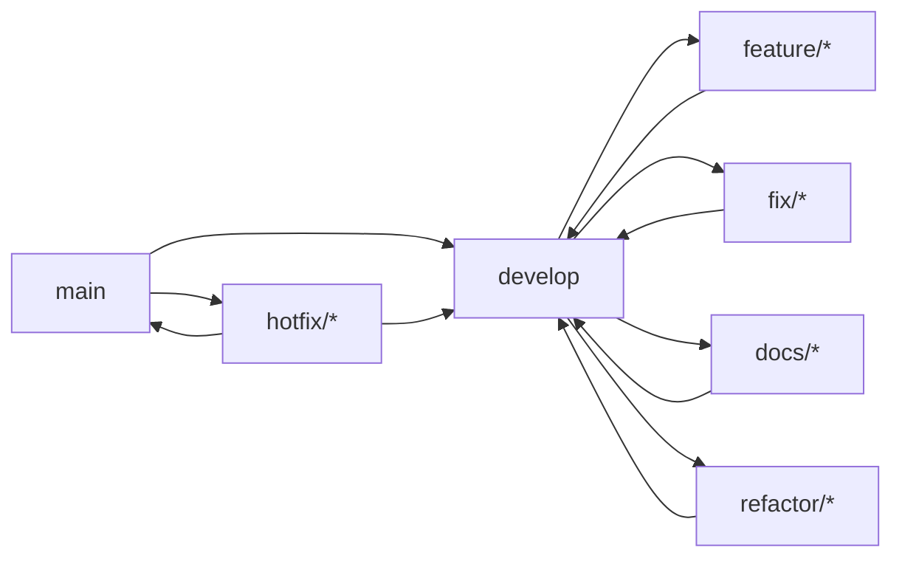
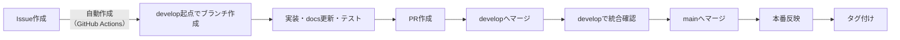
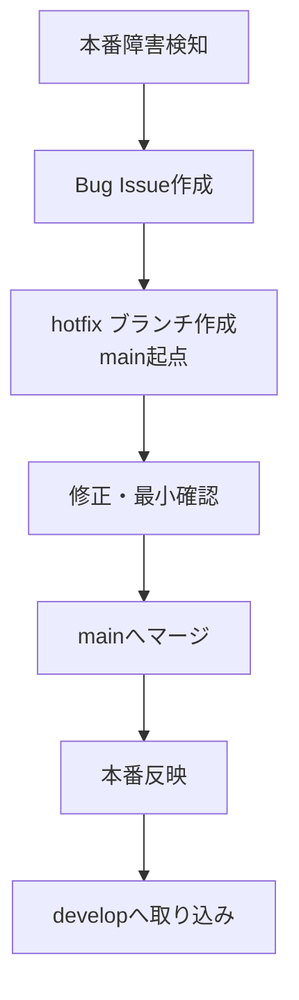

## 1. 目的

本設計書は、Gift Recommendation Service の開発を継続可能かつ安全に進めるために、Gitブランチの運用方針を定義するものである。

本設計書で定義する対象は以下である。

- 採用するブランチモデル
- 各ブランチの役割
- ブランチ命名規則
- Issue / PR との関係
- マージ戦略
- リリースフロー
- 緊急修正（hotfix）運用
- docs正本運用との整合

本設計の目的は、単にブランチ名を決めることではなく、以下を成立させることである。

- 個人開発でも履歴を崩さず開発できること
- Issue → Branch → PR → CI/CD の流れを明確にすること
- 設計変更と実装変更を同時に管理できること
- 将来のチーム開発へ拡張可能であること
- MVP高速開発と品質維持を両立すること

---

## 2. 前提

| 項目           | 内容                             |
| -------------- | -------------------------------- |
| 開発体制       | 個人開発                         |
| 設計主体       | ChatGPT                          |
| 実装主体       | Cursor                           |
| リポジトリ戦略 | monorepo                         |
| docs           | 設計書の正本                     |
| Notion         | 副本（共有・閲覧用途）           |
| 課題管理       | GitHub Issues                    |
| 開発方針       | MVP高速開発                      |
| 将来方針       | チーム開発へ拡張可能な構成を維持 |

---

## 3. ブランチ戦略の結論

本プロジェクトでは、**軽量Git Flow + Issue起点運用** を採用する。

具体的には、以下を採用する。

- 永続ブランチは `main` と `develop`
- 日常開発は Issue 起点の feature系ブランチで行う
- リリース前は `develop` で統合確認する
- 本番反映は `main` を基準とする
- 緊急修正は hotfix ブランチで対応する

---

## 4. なぜこの戦略を採用するか

## 4.1 事実

本プロジェクトには以下の特徴がある。

- 個人開発である
- ただし、Web / API / Reco / Batch / docs の複数領域をまたぐ変更が多い
- docs が正本であり、設計差分もコード差分と同時に管理する必要がある
- MVPでは変更頻度が高く、仕様調整も継続的に発生する
- 一方で、本番反映の安全性も最低限確保したい

---

## 4.2 推論

この条件では、以下の両極端は適さない。

### 単純すぎる trunk-based のみ

- 高速ではあるが、統合前の検証場所が弱い
- 設計変更と複数機能変更が重なると履歴管理が荒れやすい

### 重すぎる厳格Git Flow

- 個人開発には運用負荷が高い
- release branch を毎回切るとオーバーヘッドが大きい

したがって、

**main / develop を持ちつつ、feature中心で回す軽量型** が最適である。

---

## 5. 採用ブランチモデル



---

## 6. 各ブランチの役割

## 6.1 main

### 役割

- 本番反映済み、または本番反映対象の安定ブランチ
- 常に「本番に出せる状態」を維持する

### 方針

- 日常開発は直接入れない
- 原則として `develop` からの反映のみ受け付ける
- 緊急時のみ hotfix から直接反映する

### 重要ルール

- main への直接コミットは禁止
- main 反映前に最低限の統合確認を行う
- タグ付け対象は main とする

---

## 6.2 develop

### 役割

- 日常開発の統合先ブランチ
- 次回リリース候補を表すブランチ

### 方針

- feature / fix / docs / refactor ブランチは、原則 develop にマージする
- 開発完了後、結合確認・簡易リリース確認を develop 上で行う
- リリース確定後に main に反映する

### 重要ルール

- develop は「壊れてよい」ブランチではない
- 常に最低限動く状態を維持する
- 中途半端な大型変更を長期間滞留させない

---

## 7. 作業ブランチ種別

本プロジェクトでは、用途別に以下の作業ブランチを使い分ける。

| 種別        | 用途                       |
| ----------- | -------------------------- |
| feature/\*  | 新機能追加                 |
| fix/\*      | 通常不具合修正             |
| hotfix/\*   | 本番緊急修正               |
| docs/\*     | docs中心の変更             |
| refactor/\* | 振る舞いを変えない内部改善 |
| chore/\*    | 設定・依存更新・雑務系変更 |

---

## 8. ブランチ命名規則

## 8.1 基本形式

以下を基本とする。

```
<type>/issue-<番号>-<要約>
```

例：

```
feature/issue-123-add-top-k
fix/issue-205-fix-score-rounding
docs/issue-301-update-devops-policy
refactor/issue-410-split-api-usecase
chore/issue-512-update-eslint-config
hotfix/issue-601-fix-prod-timeout
```

---

## 8.2 命名ルール

- type は英小文字
- Issue番号を必須とする
- 要約は英語の kebab-case を基本とする
- 要約は短く、責務が分かるものにする

---

## 8.3 なぜ Issue番号を必須にするか

### 事実

- GitHub Issues を課題管理の中心に置く
- docs変更とコード変更を同一の作業単位で管理する必要がある

### 推論

- Branch に Issue番号を含めることで、
  「なぜこの変更をしたか」を履歴から追いやすくなる
- 個人開発でも、後から差分理由を追跡しやすくなる

---

## 9. Issue起点運用

## 9.1 基本原則

- すべての変更は原則 Issue 起点で行う
- 「思いつきコミット」を避ける
- 小さくても、設計 / 実装 / 不具合 / 技術負債 は Issue 化する

---

## 9.2 Issue とブランチの関係

| 項目     | 方針         |
| -------- | ------------ |
| 1 Issue  | 1責務        |
| 1 Branch | 原則1 Issue  |
| 1 PR     | 原則1 Branch |

---

## 9.3 例外

以下の場合のみ、1 Issue に複数コミットが入ってよい。

- 実装 + docs更新
- 実装 + テスト追加
- 実装 + OpenAPI更新
- 設定変更 + 関連修正

ただし、責務は1つに保つ。

---

## 10. docs正本運用との整合

## 10.1 基本原則

docs は正本であるため、設計変更を伴う実装では **必ず同一ブランチで docs も更新** する。

---

## 10.2 対象例

以下の変更では docs 更新を必須とする。

- API仕様変更
- モジュール責務変更
- データ構造変更
- バッチ処理方針変更
- 監視 / 運用フロー変更
- ブランチ / DevOps / CI/CD ルール変更

---

## 10.3 推論

これにより、以下が成立する。

- 設計とコードの乖離を防げる
- PRレビュー単位で仕様差分を確認できる
- Cursor が常に最新設計を参照できる

---

## 11. マージ戦略

## 11.1 基本方針

- 作業ブランチは develop にマージする
- develop は main にマージする
- hotfix は main にマージし、その後 develop にも取り込む

---

## 11.2 マージ方法

本プロジェクトでは、原則として **Squash Merge** を採用する。

### 理由（事実）

- 個人開発では細かい途中コミットが多くなりやすい
- AI支援実装では試行錯誤コミットが増えやすい

### 推論

- featureブランチ内の細かい履歴はブランチ内で保持しつつ、
- develop / main には意味のある単位で履歴を残す方が管理しやすい

---

## 11.3 マージ時のコミットメッセージ

以下の形式を推奨する。

```
<type>: <summary> (#<issue番号>)
```

例：

```
feat: add top_k parameter to recommendation api (#123)
fix: correct symbolic score normalization (#205)
docs: update repository strategy and docs source-of-truth rule (#301)
refactor: split recommendation usecase orchestration (#410)
```

---

## 12. リリースフロー

## 12.1 基本フロー



---

## 12.2 リリース単位

MVPでは以下を基本とする。

- 小さい単位で頻繁にリリースする
- 大きな機能を長期間抱え込まない
- develop 上で統合確認できたものから main へ上げる

---

## 12.3 release ブランチを常設しない理由

### 事実

- 現時点では個人開発であり、開発体制が軽い
- リリース前の調整コストより、運用簡素化の価値が高い

### 推論

- 毎回 release ブランチを切るのは現時点では過剰
- MVP段階では `develop → main` の直接昇格で十分

---

## 12.4 将来の拡張

将来、以下の条件になった場合は release/\* ブランチ導入を検討する。

- 複数人開発になった
- リリース判定に時間差が生まれた
- QA / ステージング調整が必要になった
- 本番反映前の修正を独立管理したくなった

---

## 13. hotfix運用

## 13.1 対象

hotfix は、本番障害または本番影響が極めて大きい不具合に限定する。

例：

- APIが応答しない
- 主要画面が表示不能
- DB更新に重大不整合が発生
- 推薦結果が明らかに壊れている
- 認証 / セキュリティ上の重大不具合

---

## 13.2 フロー



---

## 13.3 ルール

- hotfix は `main` から切る
- 修正範囲は最小化する
- 本番反映後、必ず develop に取り込む
- 後続で恒久対策 Issue を別途起票してよい

---

## 14. docs-only変更の扱い

## 14.1 docsブランチを使う場合

以下のように、コードへ影響しない docs 変更は `docs/*` を使ってよい。

- 表現修正
- 誤字修正
- 説明追記
- 開発手順書更新
- ルール明文化

---

## 14.2 ただし注意

設計変更そのものを伴う場合は、docs-only と見なさない。

その場合は、関連実装 Issue と同一の作業単位で管理する。

---

## 15. refactorブランチの扱い

## 15.1 定義

refactor は、**外部仕様を変えずに内部構造を改善する変更** とする。

例：

- 関数分割
- 責務整理
- ファイル分割
- 重複削減
- ディレクトリ再整理

---

## 15.2 ルール

- 仕様変更と混ぜない
- 大規模 refactor は小分けにする
- docs影響がある場合は docs も更新する

---

## 16. choreブランチの扱い

## 16.1 定義

chore は、開発補助・設定・依存更新など、機能追加でも不具合修正でもない変更に用いる。

例：

- ESLint更新
- CI設定調整
- package更新
- スクリプト調整
- .cursor ルール更新

---

## 16.2 注意

- chore と言いながら大きな仕様変更を含めない
- 開発基盤変更でも影響が大きい場合は Issue 上で明示する

---

## 17. developを汚さないための運用ルール

develop は統合ブランチであるため、以下を守る。

- 未完成の途中状態を長期間マージしない
- 複数Issueを1つのPRに混ぜない
- コンフリクト解消だけの巨大PRを作らない
- 途中で方針転換した場合は、一度 Issue を整理し直す

---

## 18. mainを守るための運用ルール

main は本番相当であるため、以下を守る。

- 直接push禁止
- develop 経由を原則とする
- hotfix は本番影響大の場合のみ
- main マージ時には最低限の確認を必須とする

確認例：

- CI成功
- 主要導線確認
- 必要docs更新確認
- 環境変数差分確認
- DB差分確認

---

## 19. コミット戦略

## 19.1 基本方針

- 作業中のコミットは細かくてよい
- マージ後の履歴は意味単位で残す
- ブランチ内での実験コミットを恐れない
- ただし、最終PRでは変更意図が分かるように整理する

---

## 19.2 推奨コミット種別

```
feat:
fix:
docs:
refactor:
test:
chore:
```

---

## 20. PR運用ルール

## 20.1 PRに必ず記載するもの

- 対応Issue番号
- 変更目的
- 変更対象（web/api/reco/batch/docsなど）
- docs更新有無
- 動作確認内容
- 影響範囲

---

## 20.2 PRサイズ方針

- 小さく保つ
- 1PR 1責務
- できるだけレビューしやすい単位に分ける

---

## 21. 推奨運用例

### 例1: APIに top_k を追加する

- Issue作成
- `feature/issue-123-add-top-k`
- API実装
- OpenAPI更新
- docs更新
- PR
- developへマージ
- 統合確認後、mainへ

### 例2: 本番障害で score 計算を即修正

- Bug Issue作成
- `hotfix/issue-601-fix-prod-score-bug`
- main起点で修正
- 最小確認
- mainへ反映
- developへ反映

### 例3: リポジトリ戦略書の追記のみ

- Issue作成
- `docs/issue-301-update-repository-strategy`
- docs修正
- developへマージ

---

## 22. 将来拡張方針

将来的に以下を必要に応じて導入可能とする。

- release/\* ブランチ
- environment別ブランチ運用
- 複数人レビュー前提の保護ルール強化
- CODEOWNERS による責務分担
- 自動リリースブランチ生成

ただし、MVP段階では導入しない。

---

## 23. 本設計の結論

本プロジェクトのブランチ戦略は、以下を採用する。

- **main / develop の2本を永続ブランチとする**
- **Issue起点で feature/fix/docs/refactor/chore/hotfix を切る**
- **日常開発は develop に統合する**
- **本番反映は main を基準に行う**
- **docs正本運用と同一ブランチで管理する**
- **Squash Merge を基本として履歴を整理する**

---

## 24. 一言まとめ

本ブランチ戦略は、

**「個人開発でも履歴を崩さず、設計・実装・運用を一体で回せる軽量ブランチ運用」**

を採用するものである。
