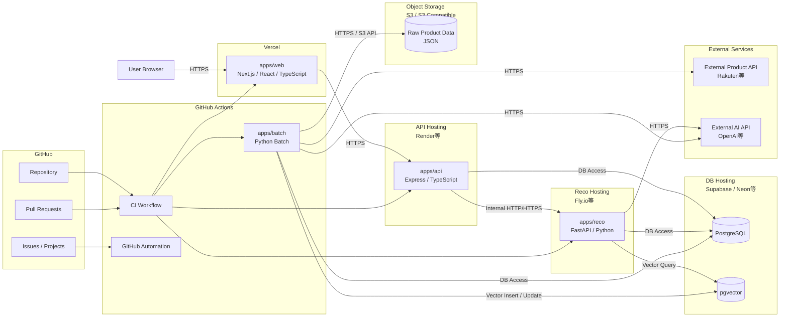
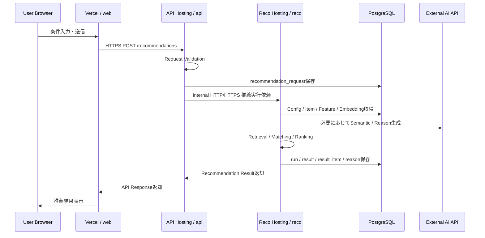
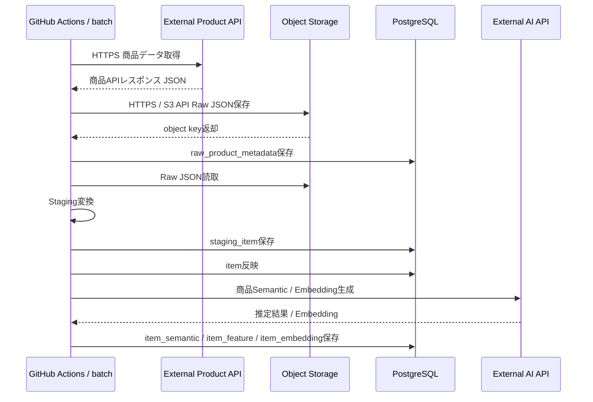
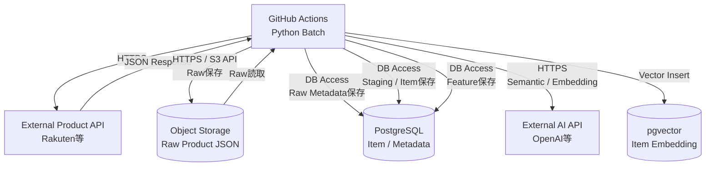
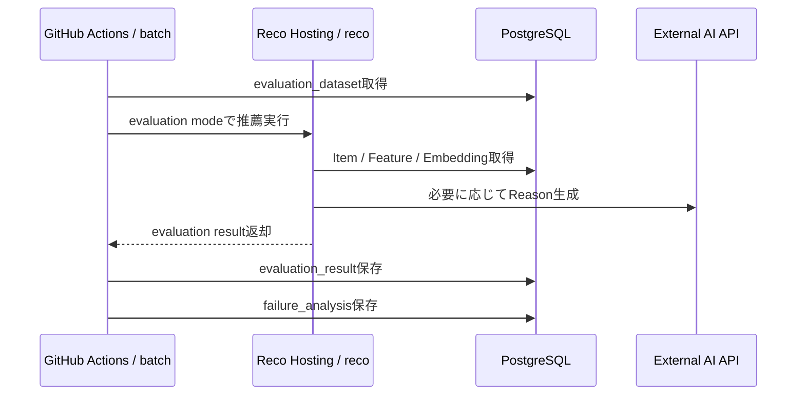
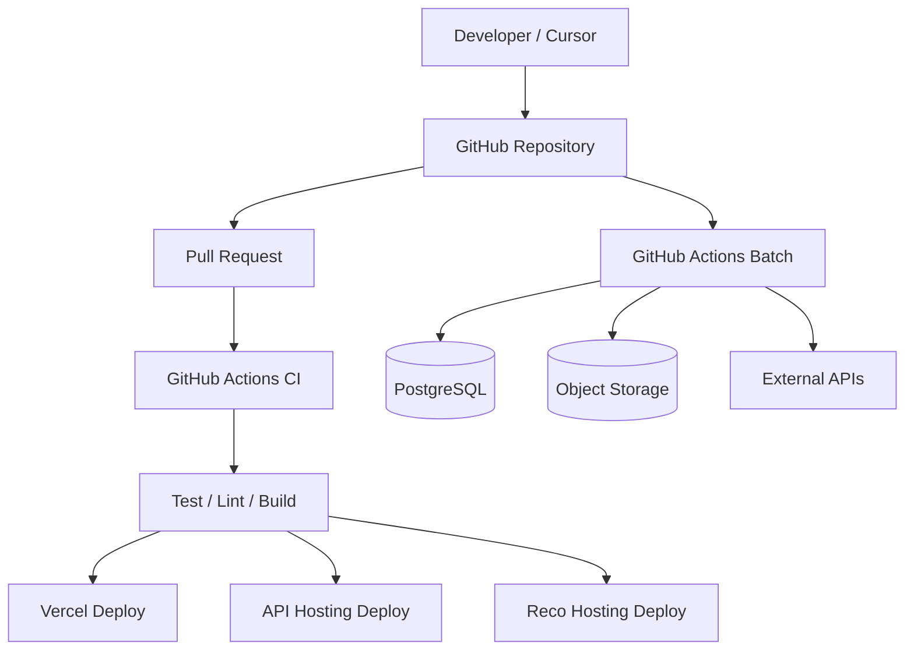
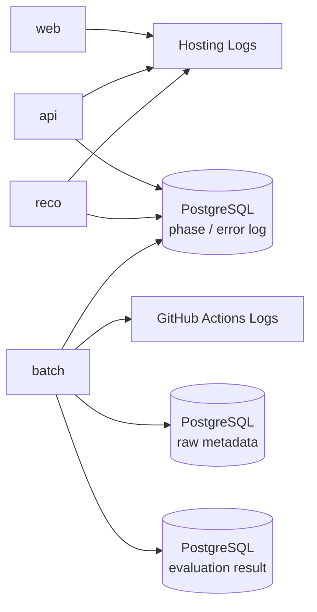

# システム物理構成図

## 1. 概要

### 1.1 目的

本ドキュメントは、Gift Recommendation Service MVPにおけるシステムの物理構成を定義する。

`システム論理構成図` で定義した以下の論理コンポーネントを、具体的な実行環境・ホスティングサービス・通信経路・Secret管理単位へ割り当てる。

```text
web
api
reco
batch
database
object storage
external product api
external ai api
devops
observability
```

---

### 1.2 本ドキュメントの位置づけ

| 成果物                   | 本ドキュメントとの関係                                         |
| ------------------------ | -------------------------------------------------------------- |
| システム論理構成図       | 論理コンポーネントの責務を物理配置へ落とす                     |
| 利用技術スタック整理表   | 採用技術を実行環境へ割り当てる                                 |
| 処理フロー概要図         | Online / Batch / Evaluationの通信経路を整理する                |
| API設計方針書            | web / api / reco間の通信方式の前提になる                       |
| バッチ設計方針書         | GitHub Actions / DB / Object Storage / 外部API連携の前提になる |
| 外部商品データ連携設計書 | 外部商品API取得、Raw保存、Staging変換の物理構成前提になる      |
| 環境設計書               | dev / stage / prod、環境変数、Secret管理の前提になる           |
| CI/CD方針書              | GitHub Actionsから各実行環境への接続前提になる                 |
| インターフェース一覧     | 物理的な接続先・通信方式を整理する前提になる                   |

---

## 2. 基本方針

### 2.1 物理構成の基本方針

| 方針                                    | 内容                                                                      |
| --------------------------------------- | ------------------------------------------------------------------------- |
| MVPでは運用負荷を抑える                 | 個人開発で管理可能なホスティング構成を優先する                            |
| 論理分離は維持する                      | web / api / reco / batch / database / object storage の責務境界は維持する |
| 過剰なマイクロサービス化はしない        | 物理的に分ける場合も、MVPでは最小限の運用単位に留める                     |
| Online処理とBatch処理を分ける           | ユーザー同期処理と商品データ準備処理を分離する                            |
| Rawデータ本体はObject Storageへ保存する | DB容量を抑え、外部APIレスポンスの再処理可能性を維持する                   |
| DBは構造化データの中心とする            | Request / Result / Item / Feature / Embedding / Feedback / Logを保持する  |
| Secretは各実行環境で管理する            | API KeyやDB接続情報をGitに置かない                                        |
| 通信は本番ではHTTPSを前提にする         | 外部公開通信・外部API通信はHTTPSを前提とする                              |
| 将来移行可能な構成にする                | MVP後に専用Worker、Queue、監視基盤へ移行できる余地を残す                  |

---

### 2.2 MVP物理構成の前提

MVPでは、以下の構成を標準案とする。

| 論理コンポーネント   | 物理配置候補                    | 補足                              |
| -------------------- | ------------------------------- | --------------------------------- |
| web                  | Vercel                          | Next.jsアプリのホスティング       |
| api                  | Render等                        | Express APIのホスティング         |
| reco                 | Fly.io等                        | FastAPI推薦APIのホスティング      |
| batch                | GitHub Actions                  | 定期バッチ・手動バッチ実行        |
| database             | Supabase / Neon等               | PostgreSQL + pgvector対応環境     |
| object storage       | S3 / S3互換Object Storage       | Raw商品データ保存                 |
| external product api | 楽天API等                       | 商品データ取得元                  |
| external ai api      | OpenAI API等                    | Embedding / Semantic / Reason生成 |
| devops               | GitHub                          | Issue / PR / Projects / Actions   |
| documentation        | GitHub Markdown + Notion mirror | 成果物管理                        |

---

## 3. 全体物理構成図

### 3.1 MVP物理構成



---

## 4. 物理コンポーネント一覧

### 4.1 コンポーネント対応表

| 論理コンポーネント   | 物理コンポーネント          | 技術                           | 主な責務                                                       |
| -------------------- | --------------------------- | ------------------------------ | -------------------------------------------------------------- |
| web                  | Vercel上のNext.jsアプリ     | Next.js / React / TypeScript   | 入力画面、結果表示、Feedback UI                                |
| api                  | API Hosting上のExpress API  | Node.js / Express / TypeScript | API受付、Validation、DB保存、reco呼び出し                      |
| reco                 | Reco Hosting上のFastAPI API | Python / FastAPI               | Semantic / Feature / Retrieval / Matching / Ranking / Reason   |
| batch                | GitHub Actions Runner       | Python                         | 商品データ取得、Raw保存、Staging変換、Embedding生成、評価      |
| database             | PostgreSQL Hosting          | PostgreSQL / pgvector          | アプリデータ、商品データ、Feature、Embedding、Result、Feedback |
| object storage       | S3 / S3互換Storage          | S3 API                         | 外部商品APIレスポンスRaw JSON保存                              |
| external product api | 楽天API等                   | HTTPS API                      | 商品データ取得元                                               |
| external ai api      | OpenAI API等                | HTTPS API                      | Embedding、Semantic抽出、Reason生成                            |
| devops               | GitHub / GitHub Actions     | GitHub                         | Issue、PR、CI/CD、自動化                                       |
| documentation        | GitHub Markdown / Notion    | Markdown                       | 成果物管理                                                     |

---

## 5. Online処理の物理構成

### 5.1 レコメンド実行フロー



---

### 5.2 Online処理の通信一覧

| From         | To              | 通信方式            | 内容                                    |
| ------------ | --------------- | ------------------- | --------------------------------------- |
| User Browser | web             | HTTPS               | 画面アクセス                            |
| web          | api             | HTTPS               | レコメンド実行、結果取得、Feedback登録  |
| api          | reco            | Internal HTTP/HTTPS | 推薦実行依頼                            |
| api          | database        | DB Access           | Request / Feedback / Master保存・取得   |
| reco         | database        | DB Access           | Item / Feature / Result / Log取得・保存 |
| reco         | database        | Vector Query        | pgvectorによるEmbedding検索             |
| reco         | external ai api | HTTPS               | Semantic抽出、Reason生成                |

---

### 5.3 Online処理の責務境界

| コンポーネント | やること                                  | やらないこと                             |
| -------------- | ----------------------------------------- | ---------------------------------------- |
| web            | 入力・表示・Feedback UI                   | 推薦計算、DB直接操作、外部AI API呼び出し |
| api            | API受付、Validation、DB保存、reco呼び出し | Matching / Ranking計算、外部商品API取得  |
| reco           | 推薦パイプライン実行                      | UI表示、商品Raw取得、GitHub運用          |
| database       | 構造化データ保存                          | 業務ロジック、Raw JSON本体保存           |

---

## 6. Batch処理の物理構成

### 6.1 商品データ取得・保存フロー



---

### 6.2 商品データ取得・意味推定構成



---

### 6.3 Batch処理の通信一覧

| From                 | To                   | 通信方式               | 内容                                        |
| -------------------- | -------------------- | ---------------------- | ------------------------------------------- |
| GitHub Actions batch | external product api | HTTPS                  | 商品データ取得                              |
| GitHub Actions batch | object storage       | HTTPS / S3 API         | Raw JSON保存・読取                          |
| GitHub Actions batch | database             | DB Access              | Raw Metadata / Staging / Item / Feature保存 |
| GitHub Actions batch | database / pgvector  | Vector Insert / Update | item_embedding保存                          |
| GitHub Actions batch | external ai api      | HTTPS                  | 商品Semantic / Embedding生成                |

---

### 6.4 Batch処理の責務境界

| コンポーネント       | やること                                                  | やらないこと           |
| -------------------- | --------------------------------------------------------- | ---------------------- |
| batch                | 外部API取得、Raw保存、変換、商品反映、Embedding生成、評価 | ユーザー同期レスポンス |
| object storage       | Raw JSON本体保存                                          | 構造化検索、推薦計算   |
| database             | Raw Metadata、Item、Feature、Embedding保存                | Raw JSON本体保存       |
| external product api | 商品情報提供                                              | アプリ内正本管理       |
| external ai api      | Embedding / 推定結果提供                                  | アプリ内状態管理       |

---

## 7. Evaluation処理の物理構成

### 7.1 オフライン評価フロー



---

### 7.2 Evaluationの実行方式

| 項目           | 方針                                                  |
| -------------- | ----------------------------------------------------- |
| 実行環境       | GitHub Actions                                        |
| 実行タイミング | 手動実行または定期実行                                |
| 推薦実行       | reco APIをevaluation modeで呼び出す                   |
| 評価データ     | DBのevaluation_datasetを利用                          |
| 評価結果       | DBのevaluation_resultへ保存                           |
| 改善反映       | 自動反映せず、人間が確認してRule / Config / Model更新 |

---

## 8. データ保存先設計

### 8.1 データ保存先一覧

| データ                     | 保存先                | 理由                                  |
| -------------------------- | --------------------- | ------------------------------------- |
| recommendation_request     | PostgreSQL            | ユーザー入力正本                      |
| recommendation_run         | PostgreSQL            | 推薦実行単位                          |
| recommendation_result      | PostgreSQL            | 推薦結果正本                          |
| recommendation_result_item | PostgreSQL            | 推薦結果明細                          |
| recommendation_reason      | PostgreSQL            | 推薦理由                              |
| recommendation_feedback    | PostgreSQL            | ユーザー反応                          |
| item                       | PostgreSQL            | アプリ内商品正本                      |
| item_feature               | PostgreSQL            | Matchingで利用                        |
| item_embedding             | PostgreSQL / pgvector | Vector Retrievalで利用                |
| raw_product_data           | Object Storage        | 大容量Raw JSON本体                    |
| raw_product_metadata       | PostgreSQL            | object key / hash / import status管理 |
| evaluation_dataset         | PostgreSQL            | 評価入力データ                        |
| evaluation_result          | PostgreSQL            | 評価結果                              |
| phase_log / error_log      | PostgreSQL            | 処理追跡・障害解析                    |
| GitHub Issue / PR          | GitHub                | 開発・運用タスク管理                  |
| 成果物Markdown             | GitHub Repository     | 成果物正本                            |
| Notion文書                 | Notion                | 閲覧・整理用の副本                    |

---

### 8.2 Rawデータ保存方針

RawデータはDBではなくObject Storageへ保存する。

```text
External Product API
↓
batch
↓
Object Storage: Raw JSON本体
↓
Database: Raw Metadata
```

| 項目                | 保存先         | 内容                    |
| ------------------- | -------------- | ----------------------- |
| Raw JSON本体        | Object Storage | 外部APIレスポンス原本   |
| object key          | PostgreSQL     | Raw JSONの参照先        |
| content hash        | PostgreSQL     | 重複排除・差分検知      |
| fetched_at          | PostgreSQL     | 取得日時                |
| source_api          | PostgreSQL     | 取得元API               |
| request_params_hash | PostgreSQL     | APIリクエスト条件の識別 |
| import_status       | PostgreSQL     | 取込状態                |
| error_message       | PostgreSQL     | 取込失敗時の理由        |

---

### 8.3 Object Key方針

Object Storage上のRawデータは、日付・API種別・hashを含むkeyで管理する。

```text
raw/product/{source_api}/{yyyy}/{mm}/{dd}/{request_hash}.json
```

例：

```text
raw/product/rakuten_item_search/2026/05/08/abc123.json
```

MVPでは、以下を満たせばよい。

| 観点       | 方針                                         |
| ---------- | -------------------------------------------- |
| 一意性     | request_hashまたはcontent_hashで識別する     |
| 追跡性     | source_apiと取得日を含める                   |
| 再処理性   | DBのmetadataからobject keyを引けるようにする |
| 削除容易性 | 日付単位で整理できるようにする               |

---

## 9. 環境構成

### 9.1 環境一覧

MVPでは、最初から過剰に環境を増やさず、以下の段階構成とする。

| 環境  | 用途         | 方針                     |
| ----- | ------------ | ------------------------ |
| local | ローカル開発 | 各アプリを手元で起動     |
| dev   | 開発確認     | 個人開発中の疎通・検証用 |
| prod  | MVP公開      | 実ユーザー検証用         |

stage環境は、MVP初期では必須ではない。  
本番前確認が必要になった段階で追加する。

---

### 9.2 環境別配置

| コンポーネント       | local                   | dev                | prod                |
| -------------------- | ----------------------- | ------------------ | ------------------- |
| web                  | localhost               | Vercel Preview等   | Vercel Production   |
| api                  | localhost               | API Hosting dev    | API Hosting prod    |
| reco                 | localhost               | Reco Hosting dev   | Reco Hosting prod   |
| batch                | 手動実行                | GitHub Actions dev | GitHub Actions prod |
| database             | local DB / dev DB       | dev DB             | prod DB             |
| object storage       | local mock / dev bucket | dev bucket         | prod bucket         |
| external product api | sandbox / real API      | real API           | real API            |
| external ai api      | real API                | real API           | real API            |

---

### 9.3 環境分離方針

| 対象           | 分離方針                                     |
| -------------- | -------------------------------------------- |
| DB             | dev / prodで分離する                         |
| Object Storage | dev / prodでbucketまたはprefixを分ける       |
| API Key        | dev / prodでSecretを分ける                   |
| URL            | API_BASE_URL / RECO_BASE_URLを環境別に持つ   |
| Batch          | dev / prodで実行対象DB・bucketを分ける       |
| Logs           | 少なくともenvをログに含める                  |
| GitHub Actions | branchまたはworkflow inputで環境を切り替える |

---

## 10. Secret / 環境変数管理

### 10.1 Secret配置方針

| Secret                 | 利用元             | 配置先                                                            |
| ---------------------- | ------------------ | ----------------------------------------------------------------- |
| `DATABASE_URL`         | api / reco / batch | API Hosting Secret / Reco Hosting Secret / GitHub Actions Secrets |
| `OPENAI_API_KEY`       | reco / batch       | Reco Hosting Secret / GitHub Actions Secrets                      |
| `RAKUTEN_APP_ID`       | batch              | GitHub Actions Secrets                                            |
| `S3_BUCKET_NAME`       | batch              | GitHub Actions Variables / Secrets                                |
| `S3_ENDPOINT_URL`      | batch              | GitHub Actions Variables / Secrets                                |
| `S3_ACCESS_KEY_ID`     | batch              | GitHub Actions Secrets                                            |
| `S3_SECRET_ACCESS_KEY` | batch              | GitHub Actions Secrets                                            |
| `API_BASE_URL`         | web                | Vercel Environment Variables                                      |
| `RECO_BASE_URL`        | api                | API Hosting Secret / Environment Variables                        |
| `APP_ENV`              | all                | 各実行環境のEnvironment Variables                                 |

---

### 10.2 Secret管理ルール

| ルール                           | 内容                                       |
| -------------------------------- | ------------------------------------------ |
| SecretをGit管理しない            | `.env`、API Key、DB URLをcommitしない      |
| `.env.example` を用意する        | 必要な変数名だけ記載する                   |
| webに機密情報を置かない          | 外部API KeyやDB URLはserver側のみ          |
| GitHub Actions Secretsを利用する | batch / CIで必要なSecretを管理する         |
| 環境ごとにSecretを分ける         | dev / prodの誤接続を防ぐ                   |
| 最小権限にする                   | Object StorageやDB権限を必要範囲に限定する |

---

## 11. ネットワーク・通信方式

### 11.1 通信方式一覧

| From           | To                   | 通信方式            | 本番方針           |
| -------------- | -------------------- | ------------------- | ------------------ |
| User Browser   | web                  | HTTPS               | 必須               |
| web            | api                  | HTTPS               | 必須               |
| api            | reco                 | Internal HTTP/HTTPS | 物理配置により確定 |
| api            | database             | DB Access           | SSL接続推奨        |
| reco           | database             | DB Access           | SSL接続推奨        |
| reco           | external ai api      | HTTPS               | 必須               |
| batch          | external product api | HTTPS               | 必須               |
| batch          | object storage       | HTTPS / S3 API      | 必須               |
| batch          | database             | DB Access           | SSL接続推奨        |
| batch          | external ai api      | HTTPS               | 必須               |
| GitHub Actions | hosting              | HTTPS / CLI         | 必須               |
| GitHub Actions | database             | DB Access           | SSL接続推奨        |
| GitHub Actions | object storage       | HTTPS / S3 API      | 必須               |

---

### 11.2 api → reco通信の扱い

`api → reco` は、物理配置により通信方式が変わる。

| 配置              | 通信方式       |
| ----------------- | -------------- |
| 同一プロセス      | 関数呼び出し   |
| 同一ホスト内      | localhost HTTP |
| Private Network内 | Internal HTTP  |
| 別ホスティング間  | HTTPS          |
| 公開URL経由       | HTTPS必須      |

MVPでは、`api` と `reco` を別ホスティングに配置する可能性があるため、設計上は `Internal HTTP/HTTPS` と表記する。  
本番で公開URL経由になる場合は、HTTPSを必須とする。

---

## 12. CI/CD・GitHub Actions構成

### 12.1 GitHub Actionsの役割

| Workflow          | 目的                                    |
| ----------------- | --------------------------------------- |
| CI Workflow       | lint / test / build                     |
| Branch Automation | Issue起票時のbranch自動作成             |
| Label Automation  | Issue本文からlabel自動付与              |
| PR Workflow       | PR作成・更新時のチェック                |
| Batch Workflow    | 商品データ取得・Embedding生成・評価実行 |
| Deploy Workflow   | web / api / recoのデプロイ補助          |

---

### 12.2 CI/CD物理構成



---

### 12.3 Branchと環境の対応

| Branch                | 主な用途        | デプロイ先                            |
| --------------------- | --------------- | ------------------------------------- |
| feature / task branch | 作業単位        | 原則デプロイなし、必要に応じてPreview |
| develop               | 統合開発        | dev環境                               |
| main                  | MVP公開・安定版 | prod環境                              |

---

## 13. Observability物理構成

### 13.1 MVPログ構成

MVPでは、高度な外部監視基盤よりも、DBと実行環境ログを中心にする。

| ログ種別          | 保存先             | 内容                            |
| ----------------- | ------------------ | ------------------------------- |
| web runtime log   | Hosting log        | 画面エラー、API呼び出し失敗     |
| api runtime log   | API Hosting log    | APIエラー、Validation失敗       |
| reco runtime log  | Reco Hosting log   | 推薦処理エラー                  |
| batch runtime log | GitHub Actions log | Batch実行ログ                   |
| phase log         | PostgreSQL         | recommendation_runのphase別状態 |
| error log         | PostgreSQL         | 処理失敗・外部API失敗           |
| raw metadata log  | PostgreSQL         | Raw保存状態、object key、hash   |
| evaluation result | PostgreSQL         | 評価結果・失敗分類              |

---

### 13.2 Observability構成図



---

### 13.3 MVP監視対象

| 対象               | 確認方法                          |
| ------------------ | --------------------------------- |
| API成功率          | API Hosting log / DB error log    |
| Reco成功率         | phase log                         |
| Batch成功率        | GitHub Actions log / batch log    |
| Raw保存成功率      | raw metadata                      |
| Retrieval候補数    | phase log / result debug          |
| Result生成成功率   | recommendation_result             |
| Reason生成成功率   | recommendation_reason / phase log |
| Feedback件数       | recommendation_feedback           |
| External API失敗率 | error log                         |
| OpenAI API失敗率   | error log                         |

---

## 14. セキュリティ物理構成

### 14.1 セキュリティ境界

| 境界                           | 方針                                  |
| ------------------------------ | ------------------------------------- |
| Browser → web                  | HTTPS                                 |
| web → api                      | HTTPS                                 |
| api → reco                     | 本番ではHTTPSまたはPrivate Network    |
| server → DB                    | 接続情報はSecret管理                  |
| batch → Object Storage         | 最小権限のAccess Keyを利用            |
| batch → external product api   | API KeyをGitHub Actions Secretsで管理 |
| reco / batch → external ai api | API KeyをSecretで管理                 |
| web                            | 機密情報を持たない                    |
| GitHub                         | SecretsとRepository権限を分離する     |

---

### 14.2 最小権限方針

| 対象                   | 最小権限の考え方                                            |
| ---------------------- | ----------------------------------------------------------- |
| DB User for api        | Request / Result / Feedback / Masterに必要な権限            |
| DB User for reco       | Item / Feature / Result / Logに必要な権限                   |
| DB User for batch      | Raw Metadata / Staging / Item / Feature / Embedding更新権限 |
| Object Storage Key     | Raw保存・読取に必要なbucket/prefixのみ                      |
| GitHub Actions Secrets | 必要なworkflowだけが使う                                    |
| OpenAI API Key         | reco / batchのみ                                            |
| Product API Key        | batchのみ                                                   |

---

## 15. 障害・Fallback観点

### 15.1 主要障害パターン

| 障害箇所                 | 影響                                    | MVPでの対応                           |
| ------------------------ | --------------------------------------- | ------------------------------------- |
| web停止                  | ユーザーが画面を利用できない            | Hosting log確認、再デプロイ           |
| api停止                  | レコメンド実行不可                      | API Hosting再起動・ログ確認           |
| reco停止                 | 推薦ロジック実行不可                    | Reco Hosting再起動・api側でエラー返却 |
| DB停止                   | ほぼ全機能停止                          | DB Hosting復旧待ち                    |
| Object Storage障害       | Raw保存・再処理不可                     | Batchを失敗扱い、後で再実行           |
| external product api障害 | 商品データ更新不可                      | 既存商品データでOnlineは継続          |
| external ai api障害      | Semantic / Reason / Embedding生成に影響 | FallbackまたはBatch再実行             |
| GitHub Actions障害       | CI / Batch実行不可                      | 復旧後に再実行                        |

---

### 15.2 Online継続性

| 障害                     | Online推薦への影響                                  |
| ------------------------ | --------------------------------------------------- |
| 商品データ取得Batch失敗  | 既存Item / Feature / Embeddingで継続可能            |
| Object Storage障害       | Online推薦には直接影響しない                        |
| external product api障害 | Online推薦には直接影響しない                        |
| external ai api障害      | Online Reason生成やSemantic抽出に影響する可能性あり |
| DB障害                   | Online推薦は原則不可                                |
| reco障害                 | Online推薦は不可                                    |
| api障害                  | Online推薦は不可                                    |

---

## 16. MVP対象外の物理構成

MVPでは、以下の物理構成は採用しない。

| 対象外                   | 理由                             |
| ------------------------ | -------------------------------- |
| Kubernetes               | 個人開発MVPでは運用負荷が高い    |
| 専用Workflow Engine      | GitHub Actionsで開始可能         |
| Dedicated Queue / Worker | 初期はBatch中心で十分            |
| 専用Vector DB            | pgvectorで開始する               |
| Data Warehouse           | 初期分析には過剰                 |
| Real-time Streaming      | MVPでは不要                      |
| 高度なAPM                | 初期はHosting log + DB logで十分 |
| Multi-region構成         | MVPでは不要                      |
| 高可用性クラスタ         | MVPでは不要                      |
| CDN詳細設計              | Vercel等の標準機能に委ねる       |
| WAF高度設定              | 商用化時に検討                   |

---

## 17. 後続成果物への引き継ぎ

### 17.1 API設計方針書への引き継ぎ

| 項目            | 引き継ぎ内容                   |
| --------------- | ------------------------------ |
| web → api       | HTTPS公開API                   |
| api → reco      | Internal HTTP/HTTPS            |
| API Gateway有無 | MVPでは専用Gatewayなし         |
| 認証            | MVPでは最小限、将来拡張        |
| Error形式       | apiで統一                      |
| OpenAPI         | web / api / recoのIF整理に利用 |

---

### 17.2 バッチ設計方針書への引き継ぎ

| 項目             | 引き継ぎ内容                       |
| ---------------- | ---------------------------------- |
| 実行環境         | GitHub Actions                     |
| 外部商品API通信  | HTTPS                              |
| Raw保存          | Object Storage                     |
| Raw Metadata保存 | PostgreSQL                         |
| Staging変換      | batch内で実施                      |
| Embedding生成    | batchからexternal ai apiを呼び出す |
| 定期実行         | GitHub Actions cron                |
| 手動実行         | workflow_dispatch                  |

---

### 17.3 外部商品データ連携設計書への引き継ぎ

| 項目           | 引き継ぎ内容                   |
| -------------- | ------------------------------ |
| 取得元         | External Product API           |
| Raw保存先      | Object Storage                 |
| Metadata保存先 | PostgreSQL                     |
| Object Key     | source_api / date / hashベース |
| 再処理         | metadataからobject keyを参照   |
| 重複排除       | content_hash / request_hash    |
| 失敗管理       | import_status / error_message  |

---

### 17.4 環境設計書への引き継ぎ

| 項目           | 引き継ぎ内容                       |
| -------------- | ---------------------------------- |
| 環境           | local / dev / prod                 |
| Secret         | 各hosting / GitHub Actions Secrets |
| URL            | API_BASE_URL / RECO_BASE_URL       |
| DB             | dev / prod分離                     |
| Object Storage | dev / prod分離                     |
| Branch         | develop / mainで環境対応           |

---

### 17.5 CI/CD方針書への引き継ぎ

| 項目       | 引き継ぎ内容                        |
| ---------- | ----------------------------------- |
| CI実行     | GitHub Actions                      |
| Branch運用 | feature → develop → main            |
| Deploy     | Vercel / API Hosting / Reco Hosting |
| Batch      | GitHub Actions                      |
| Secrets    | GitHub Actions Secrets              |
| PR Checks  | lint / test / build                 |
| 自動化     | Issue / Label / Branch / PR連携     |

---

## 18. レビュー観点

| 観点                 | 確認内容                                                                              |
| -------------------- | ------------------------------------------------------------------------------------- |
| 論理構成との整合     | web / api / reco / batch / DB / Object Storageが物理配置されているか                  |
| 技術スタックとの整合 | Next.js / Express / FastAPI / Python / PostgreSQL / pgvector / S3系が反映されているか |
| Online / Batch分離   | ユーザー同期処理と商品データ準備処理が分かれているか                                  |
| Raw保存方針          | Raw JSON本体がDBではなくObject Storageに保存されているか                              |
| DB責務               | DBが構造化データ・Feature・Embedding・Result・Feedbackを保持しているか                |
| 通信方式             | 外部公開通信・外部API通信がHTTPS前提になっているか                                    |
| Secret管理           | API Key / DB URL / S3 KeyがGit管理外になっているか                                    |
| MVP妥当性            | 個人開発で運用可能な構成になっているか                                                |
| 将来拡張性           | Queue / Worker / 監視基盤 / 専用Vector DBへ移行可能か                                 |
| 後続成果物接続       | API設計、Batch設計、環境設計、CI/CD設計へ展開できるか                                 |

---

## 19. まとめ

Gift Recommendation Service MVPの物理構成は、以下を基本とする。

```text
User Browser
↓ HTTPS
Vercel / web
↓ HTTPS
API Hosting / api
↓ Internal HTTP/HTTPS
Reco Hosting / reco
↓ DB Access / Vector Query
PostgreSQL / pgvector
```

商品データ取得・前処理は、以下を基本とする。

```text
GitHub Actions / batch
↓ HTTPS
External Product API
↓
batch
↓ HTTPS / S3 API
Object Storage / Raw Product Data
↓
Database / Raw Metadata
↓
Database / Item / Feature / Embedding
```

MVPでは、以下を重視する。

```text
- web / api / reco / batch の責務分離
- DBには構造化データを保存
- Raw JSON本体はObject Storageに保存
- Online処理は外部商品APIに依存しない
- GitHub ActionsでCIとBatchを実行
- Secretは各実行環境で管理
- 本番通信はHTTPSを前提にする
```

本ドキュメントをもとに、次工程では `API設計方針書`、`バッチ設計方針書`、`外部商品データ連携設計書`、`環境設計書`、`CI/CD方針書` を具体化する。
