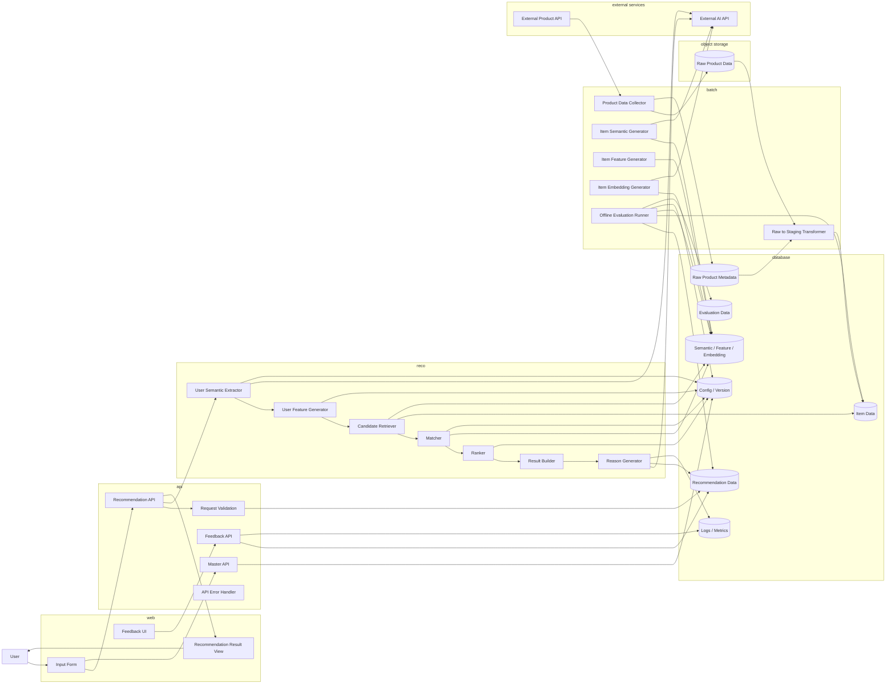
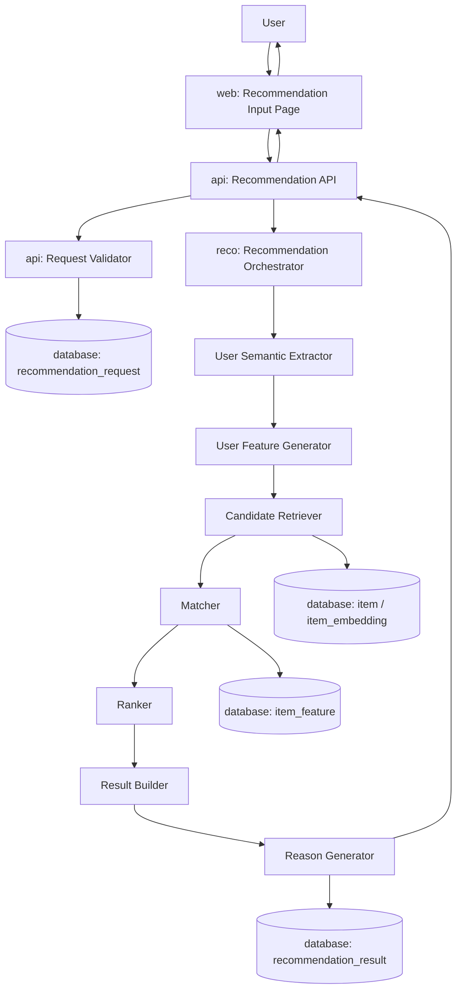
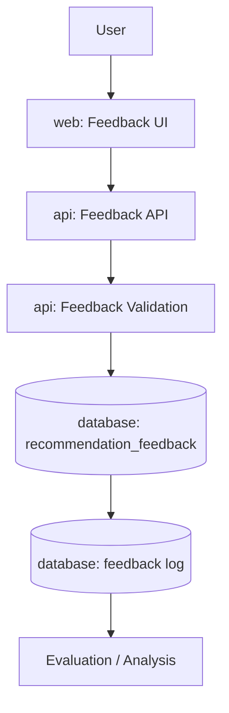
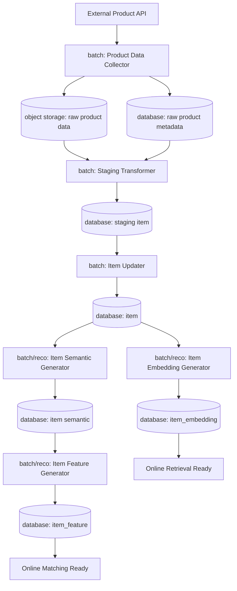
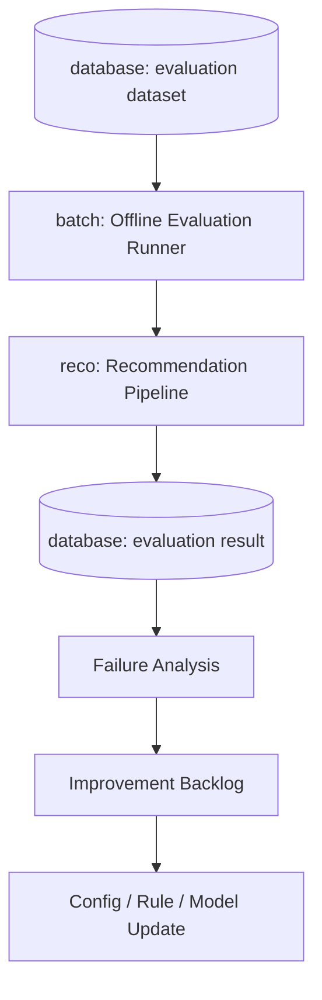
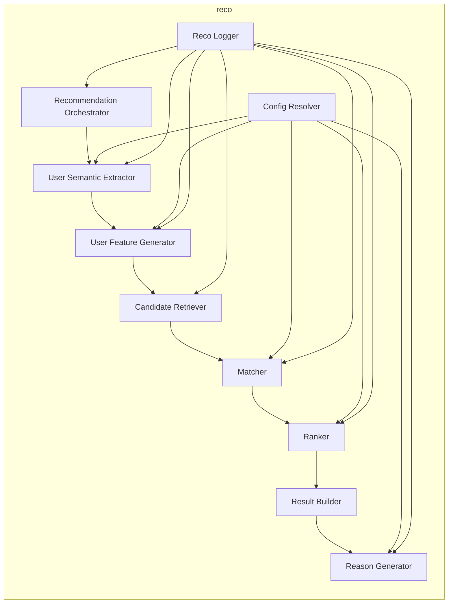

# システム論理構成図

## 1. 概要

### 1.1 目的

本ドキュメントは、Gift Recommendation Service MVPにおけるシステムの論理構成を定義する。

`処理フロー概要図` で整理した以下の処理を、アプリケーション上の論理コンポーネントへ割り当てることを目的とする。

```text
User Input
→ Recommendation Request
→ Semantic Extraction
→ Feature Generation
→ Retrieval
→ Matching
→ Ranking
→ Recommendation Result
→ Reason Generation
→ Feedback / Evaluation
```

また、外部商品データ取得においては、DB容量節約と再処理可能性を両立するため、外部APIレスポンスのRawデータ本体はS3/Object Storageに保存し、DBにはRawデータの参照・管理に必要なメタデータのみを保存する。

---

### 1.2 本ドキュメントの位置づけ

| 成果物                    | 本ドキュメントとの関係                                           |
| ------------------------- | ---------------------------------------------------------------- |
| 処理フロー概要図          | 本ドキュメントの主なインプット                                   |
| 機能一覧                  | 論理コンポーネント単位で機能を整理する                           |
| モジュール一覧            | 各コンポーネント内の実装責務へ分解する                           |
| API一覧                   | web / api / reco 間の呼び出しをAPIとして整理する                 |
| バッチ一覧                | batchコンポーネントの処理を一覧化する                            |
| 外部商品データ連携設計書  | 外部API取得、Raw保存、Staging変換、Item反映の詳細を整理する      |
| インターフェース一覧      | 外部API、DB、内部API、Object Storage、ファイル連携を横断整理する |
| ログ・Observability設計書 | 各コンポーネントのログ・メトリクス出力責務を定義する             |
| システム物理構成図        | 論理構成を具体的なホスティング・外部サービス配置に落とす         |

---

## 2. 基本方針

### 2.1 論理構成の基本方針

| 方針                                    | 内容                                                                                   |
| --------------------------------------- | -------------------------------------------------------------------------------------- |
| 論理責務で分割する                      | web / api / reco / batch / database / object storage / external service に責務を分ける |
| MVPでは過剰分散しない                   | マイクロサービス前提ではなく、論理分割されたモノレポ構成を基本とする                   |
| OnlineとBatchを分ける                   | ユーザー操作に同期する処理と、事前準備・評価処理を分離する                             |
| 推薦ロジックをrecoに集約する            | Semantic / Feature / Retrieval / Matching / Ranking / Reasonをreco側責務とする         |
| 外部商品データ連携はbatch中心にする     | 外部EC APIをOnline検索エンジンとして直接利用しない                                     |
| Rawデータ本体はObject Storageに保存する | DB容量節約と再処理可能性のため、外部APIレスポンス原本はS3/Object Storageに保存する     |
| DBにはRawメタデータを保存する           | object key、hash、取得日時、取得元API、取込状態などをDBで管理する                      |
| DBを状態・正本・ログの中心にする        | Request / Run / Result / Item / Feature / Embedding / Logを保持する                    |
| 再現性を重視する                        | request、version、score、reason、feedback、raw object keyを追跡可能にする              |

---

### 2.2 論理コンポーネント一覧

| コンポーネント         | 役割                                                                                  |
| ---------------------- | ------------------------------------------------------------------------------------- |
| `web`                  | ユーザー入力、推薦結果表示、フィードバック入力を担当する                              |
| `api`                  | 外部公開API、入力検証、認証認可、DB保存、reco呼び出しを担当する                       |
| `reco`                 | 推薦ロジック本体を担当する                                                            |
| `batch`                | 商品データ取得、商品意味推定、Embedding生成、オフライン評価を担当する                 |
| `database`             | アプリケーションデータ、商品データ、推薦結果、ログ、評価結果、Rawメタデータを保持する |
| `object storage`       | 外部APIから取得したRawデータ、ファイル形式データ、再処理用原本を保持する              |
| `external product api` | 楽天等の商品データソース                                                              |
| `external ai api`      | Semantic抽出、Embedding生成、Reason生成等で利用する外部AI API                         |
| `observability`        | ログ、メトリクス、評価結果、改善分析を扱う論理領域                                    |

---

## 3. システム論理構成図

### 3.1 全体論理構成



---

## 4. 論理コンポーネント定義

## 4.1 web

### 4.1.1 役割

`web` は、ユーザーとの接点を担当するフロントエンドコンポーネントである。

| 責務               | 内容                                                               |
| ------------------ | ------------------------------------------------------------------ |
| 入力UI             | relationship、occasion、予算、好み、避けたい条件、NG条件を入力する |
| 推薦結果表示       | 商品、価格、画像、推薦理由、補足情報を表示する                     |
| フィードバック入力 | 良い/微妙、理由が納得できたか、コメント等を入力する                |
| Master表示         | Relationship / Occasion等の選択肢を表示する                        |
| API呼び出し        | apiコンポーネントへHTTPリクエストを送信する                        |

---

### 4.1.2 webが持たない責務

| 対象外                  | 理由                         |
| ----------------------- | ---------------------------- |
| 推薦ロジック            | recoの責務                   |
| Feature計算             | recoの責務                   |
| Ranking計算             | recoの責務                   |
| 商品データ取得          | batchの責務                  |
| DB直接操作              | api経由に統一する            |
| Object Storage直接操作  | batch / server側の責務       |
| 外部AI API直接呼び出し  | api/reco/batch経由に統一する |
| 外部商品API直接呼び出し | batch経由に統一する          |

---

### 4.1.3 web内の論理要素

| 要素                         | 内容                              |
| ---------------------------- | --------------------------------- |
| `Recommendation Input Page`  | レコメンド条件入力画面            |
| `Recommendation Result Page` | 推薦結果表示画面                  |
| `Feedback Component`         | 推薦結果への反応入力UI            |
| `Master Select Component`    | Relationship / Occasion等の選択UI |
| `API Client`                 | api呼び出し共通処理               |

---

## 4.2 api

### 4.2.1 役割

`api` は、webとreco/databaseの間に立つアプリケーションAPI層である。

| 責務               | 内容                                        |
| ------------------ | ------------------------------------------- |
| API Endpoint提供   | webから呼び出されるHTTP APIを提供する       |
| Request Validation | 入力形式、必須項目、値域、矛盾を検証する    |
| Request保存        | recommendation_requestをDBに保存する        |
| Reco呼び出し       | recoへ推薦実行を依頼する                    |
| Result返却         | recoの結果をweb向けレスポンスへ整形する     |
| Feedback保存       | ユーザーフィードバックをDBに保存する        |
| Master提供         | Relationship / Occasion等の選択肢を返却する |
| Error Handling     | API共通エラー形式へ変換する                 |
| 認証認可           | MVPでは最小限。将来拡張前提で境界を持つ     |

---

### 4.2.2 apiが持たない責務

| 対象外             | 理由                                 |
| ------------------ | ------------------------------------ |
| Semantic抽出       | recoの責務                           |
| User Feature生成   | recoの責務                           |
| Retrieval          | recoの責務                           |
| Matching / Ranking | recoの責務                           |
| 商品データ収集     | batchの責務                          |
| 外部商品API接続    | batchの責務                          |
| Rawデータ本体保存  | batchがObject Storageへ保存する      |
| 高度な分析処理     | evaluation / observability領域の責務 |

---

### 4.2.3 api内の論理要素

| 要素                        | 内容                               |
| --------------------------- | ---------------------------------- |
| `Recommendation Controller` | レコメンド実行API                  |
| `Feedback Controller`       | フィードバック登録API              |
| `Master Controller`         | Relationship / Occasion等の取得API |
| `Request Validator`         | 入力バリデーション                 |
| `Reco Client`               | reco呼び出し用内部クライアント     |
| `Repository`                | DBアクセス                         |
| `Error Handler`             | 共通エラー変換                     |
| `Response Mapper`           | web向けレスポンス整形              |

---

## 4.3 reco

### 4.3.1 役割

`reco` は、ギフト推薦ロジックの中核を担当するコンポーネントである。

| 責務                    | 内容                                                                 |
| ----------------------- | -------------------------------------------------------------------- |
| Semantic Extraction     | ユーザー入力からSemantic Conceptを抽出する                           |
| User Feature Generation | Relationship / Occasion / Semantic ConceptからUser Featureを生成する |
| Retrieval               | 候補商品を取得する                                                   |
| Matching                | User FeatureとItem Featureの意味一致度を計算する                     |
| Ranking                 | context_score、popularity、risk、diversityから最終順位を決める       |
| Result Build            | 推薦結果・推薦結果明細を生成する                                     |
| Reason Generation       | 推薦理由を生成する                                                   |
| Version利用             | semantic_config_version / model_versionを利用する                    |
| Phase Log出力           | 各処理段階の状態・結果を記録する                                     |

---

### 4.3.2 recoが持たない責務

| 対象外                       | 理由                         |
| ---------------------------- | ---------------------------- |
| ユーザー画面表示             | webの責務                    |
| HTTP公開API制御              | apiの責務                    |
| 商品データの定期取得         | batchの責務                  |
| 外部商品APIレスポンスRaw保存 | batch / object storageの責務 |
| DBスキーマ管理               | database / migrationの責務   |
| UI向け状態管理               | webの責務                    |
| GitHub運用・CI/CD            | DevOps領域の責務             |

---

### 4.3.3 reco内の論理要素

| 要素                          | 内容                                          |
| ----------------------------- | --------------------------------------------- |
| `Recommendation Orchestrator` | 推薦パイプライン全体の制御                    |
| `User Semantic Extractor`     | 入力文からSemantic Conceptを抽出              |
| `User Feature Generator`      | User Featureを生成                            |
| `Candidate Retriever`         | 候補商品を取得                                |
| `Hard Filter`                 | 予算・NG条件等で除外                          |
| `Matcher`                     | context_scoreを計算                           |
| `Ranker`                      | final_scoreとrankを計算                       |
| `Result Builder`              | Recommendation Resultを構築                   |
| `Reason Generator`            | 推薦理由を生成                                |
| `Config Resolver`             | semantic_config_version / model_versionを解決 |
| `Reco Logger`                 | phase log / score detailを記録                |

---

## 4.4 batch

### 4.4.1 役割

`batch` は、Online推薦処理の前提となる商品データ・評価データを準備するコンポーネントである。

| 責務              | 内容                                                             |
| ----------------- | ---------------------------------------------------------------- |
| 商品データ取得    | 外部商品APIから商品情報を取得する                                |
| Raw保存           | 外部APIレスポンスの生データをS3/Object Storageへ保存する         |
| Rawメタデータ保存 | S3 object key、hash、取得日時、取得元API、取込状態をDBへ保存する |
| Staging変換       | S3上のRawデータを読み込み、内部形式へ変換する                    |
| 商品データ反映    | item系データへ反映する                                           |
| 商品意味推定      | 商品情報からSemantic Conceptを抽出する                           |
| 商品Feature生成   | Item Featureを生成する                                           |
| 商品Embedding生成 | Vector Retrieval用Embeddingを生成する                            |
| 商品有効/無効更新 | active状態を更新する                                             |
| オフライン評価    | 評価データセットで推薦品質を検証する                             |

---

### 4.4.2 batchが持たない責務

| 対象外                 | 理由                                                    |
| ---------------------- | ------------------------------------------------------- |
| ユーザー同期レスポンス | Online処理ではないため                                  |
| 画面表示               | webの責務                                               |
| API入力受付            | apiの責務                                               |
| 最終表示順位の即時返却 | recoのOnline処理の責務                                  |
| ユーザー入力UI         | webの責務                                               |
| Rawデータの構造化検索  | Raw本体は再処理原本であり、検索・推薦にはitem正本を使う |

---

### 4.4.3 batch内の論理要素

| 要素                        | 内容                                                      |
| --------------------------- | --------------------------------------------------------- |
| `Product Data Collector`    | 外部APIから商品データ取得                                 |
| `Raw Data Writer`           | RawデータをS3/Object Storageへ保存                        |
| `Raw Metadata Writer`       | Rawデータのobject key、hash、取得日時、取込状態をDBへ保存 |
| `Staging Transformer`       | S3上のRawデータを読み込み、内部形式へ変換                 |
| `Item Updater`              | item系データ反映                                          |
| `Item Semantic Generator`   | 商品Semantic生成                                          |
| `Item Feature Generator`    | Item Feature生成                                          |
| `Item Embedding Generator`  | Item Embedding生成                                        |
| `Item Active Finalizer`     | 商品有効状態更新                                          |
| `Offline Evaluation Runner` | オフライン評価実行                                        |
| `Batch Logger`              | 実行ログ・エラーログ記録                                  |

---

## 4.5 database

### 4.5.1 役割

`database` は、アプリケーションで扱う正本データ・派生データ・ログ・評価データを保持する。

ただし、外部APIレスポンスの生データ本体はDBには保存せず、S3/Object Storageに保存する。  
DBには、Rawデータを参照・再処理するためのメタデータのみを保持する。

| データ群             | 内容                                                            |
| -------------------- | --------------------------------------------------------------- |
| Recommendation Data  | request / run / result / result_item / reason / feedback        |
| Item Data            | item / price / category / tag / shop等の商品情報                |
| Raw Product Metadata | raw object key / hash / fetched_at / source_api / import_status |
| Semantic Data        | semantic concept / extraction result                            |
| Feature Data         | user feature / item feature / normalization stats               |
| Embedding Data       | item embedding / query embedding                                |
| Config Data          | semantic_config_version / model_version / rule version          |
| Log Data             | run_event_log / phase_log / error_log                           |
| Evaluation Data      | eval_dataset / eval_case / eval_result / human_eval             |

---

### 4.5.2 databaseが持たない責務

| 対象外           | 理由                         |
| ---------------- | ---------------------------- |
| 業務ロジック     | api / reco / batchで実装する |
| 推薦スコア計算   | recoの責務                   |
| 外部API呼び出し  | batch等の責務                |
| Raw JSON本体保存 | S3/Object Storageの責務      |
| UI表示           | webの責務                    |

---

## 4.6 object storage

### 4.6.1 役割

`object storage` は、外部商品APIから取得したRawデータを保存する論理コンポーネントである。

MVPでは、S3またはS3互換Object Storageを想定する。

| 責務             | 内容                                                           |
| ---------------- | -------------------------------------------------------------- |
| Rawデータ保存    | 外部APIレスポンスJSONをそのまま保存する                        |
| 再処理用原本保持 | Staging変換や再取込時に参照できるようにする                    |
| DB容量削減       | 大容量JSONをDBに保存しないことでDB肥大化を防ぐ                 |
| 取得履歴保持     | 日付・API種別・hash単位でRawデータを保持する                   |
| 重複排除補助     | hashを用いて同一レスポンス・同一商品データの重複保存を抑制する |

---

### 4.6.2 保存対象

| 保存対象                | 内容                           |
| ----------------------- | ------------------------------ |
| 商品検索APIレスポンス   | 商品一覧・商品詳細のRaw JSON   |
| ジャンルAPIレスポンス   | ジャンル情報のRaw JSON         |
| ランキングAPIレスポンス | ランキング情報のRaw JSON       |
| タグ・属性系レスポンス  | 取得可能な場合のタグ・属性情報 |
| APIエラーレスポンス     | 必要に応じて調査用に保存する   |

---

### 4.6.3 DBとの責務分担

| 対象          | 保存先            | 理由                                |
| ------------- | ----------------- | ----------------------------------- |
| Raw JSON本体  | S3/Object Storage | 大容量・再処理用原本のため          |
| object key    | database          | 後続処理からRawデータを参照するため |
| content hash  | database          | 重複排除・差分検知のため            |
| fetched_at    | database          | 取得日時管理のため                  |
| source_api    | database          | 取得元API管理のため                 |
| import_status | database          | 取込状態管理のため                  |
| item正本      | database          | アプリ検索・推薦で利用するため      |

---

### 4.6.4 Object Key設計方針

Rawデータは、再処理・重複排除・追跡をしやすい単位で保存する。

```text
raw/product/{source_api}/{yyyy}/{mm}/{dd}/{request_hash}.json
```

例：

```text
raw/product/rakuten_item_search/2026/05/08/abc123.json
```

MVPでは厳密な命名規則は後続の外部商品データ連携設計書で詳細化する。

---

## 4.7 external services

### 4.7.1 外部商品API

| 項目        | 内容                                                            |
| ----------- | --------------------------------------------------------------- |
| 役割        | 商品情報、価格、画像、URL、レビュー等を取得する                 |
| 主な利用元  | batch                                                           |
| Online利用  | MVPでは原則しない                                               |
| Raw保存方針 | 取得レスポンス本体はS3/Object Storageへ保存する                 |
| DB保存方針  | object key、hash、取得日時、取得元API、取込状態のみDBへ保存する |

---

### 4.7.2 外部AI API

| 項目       | 内容                                                   |
| ---------- | ------------------------------------------------------ |
| 役割       | Semantic抽出、Embedding生成、Reason生成等に利用する    |
| 主な利用元 | reco / batch                                           |
| 注意点     | コスト、レイテンシ、再現性、モデルバージョン管理が必要 |
| 保存方針   | 入出力、model_version、根拠情報を可能な範囲で保持する  |

---

## 5. Online処理の論理構成

### 5.1 レコメンド実行



---

### 5.2 フィードバック登録



---

## 6. Batch処理の論理構成

### 6.1 商品データ取得・意味推定



---

### 6.2 オフライン評価



---

## 7. コンポーネント間インターフェース

### 7.1 主要インターフェース一覧

### 7.1 主要インターフェース一覧

| From       | To                   | IF種別              | 内容                                                                  |
| ---------- | -------------------- | ------------------- | --------------------------------------------------------------------- |
| web        | api                  | HTTPS               | レコメンド実行、結果取得、Feedback登録                                |
| api        | reco                 | Internal HTTP/HTTPS | 推薦実行依頼                                                          |
| api        | database             | DB Access           | Request / Feedback / Master取得・保存                                 |
| reco       | database             | DB Access           | Config / Item / Feature / Result / Log取得・保存                      |
| reco       | external ai api      | HTTPS               | Semantic抽出、Reason生成                                              |
| batch      | external product api | HTTPS               | 商品データ取得                                                        |
| batch      | object storage       | HTTPS / S3 API      | 外部APIレスポンスRawデータ保存・読取                                  |
| batch      | external ai api      | HTTPS               | 商品Semantic抽出、Embedding生成                                       |
| batch      | database             | DB Access           | Rawメタデータ / Staging / Item / Feature / Embedding / Evaluation保存 |
| evaluation | database             | DB Access           | 評価データ・評価結果取得保存                                          |

---

### 7.2 同期/非同期の方針

| 処理              | 方針           | 理由                                       |
| ----------------- | -------------- | ------------------------------------------ |
| レコメンド実行    | 同期           | ユーザーが画面で即時結果を期待するため     |
| Feedback登録      | 同期           | 入力完了をユーザーに返すため               |
| 商品データ取得    | 非同期 / Batch | 外部API依存で時間がかかるため              |
| Rawデータ保存     | 非同期 / Batch | 外部商品データ取得処理の一部として扱うため |
| Staging変換       | 非同期 / Batch | Rawデータから内部形式へ変換する処理のため  |
| 商品Feature生成   | 非同期 / Batch | 事前準備可能な処理のため                   |
| 商品Embedding生成 | 非同期 / Batch | コスト・時間がかかるため                   |
| オフライン評価    | 非同期 / Batch | ユーザー操作に同期しないため               |
| 改善分析          | 非同期 / 運用  | 定期的に確認すればよいため                 |

---

## 8. データの流れ

### 8.1 Recommendation系データフロー

```text
web input
↓
api request validation
↓
recommendation_request
↓
recommendation_run
↓
semantic_extraction_result
↓
user_feature
↓
retrieval_candidate
↓
matching_result
↓
ranking_result
↓
recommendation_result
↓
recommendation_reason
↓
recommendation_feedback
```

---

### 8.2 Item系データフロー

```text
external product api
↓
raw_product_data in object storage
↓
raw_product_metadata in database
↓
staging_item
↓
item
↓
item_semantic
↓
item_feature
↓
item_embedding
↓
retrieval / matching / ranking
```

---

### 8.3 Evaluation系データフロー

```text
evaluation_dataset
↓
evaluation_request
↓
recommendation_pipeline
↓
evaluation_result
↓
failure_analysis
↓
improvement_backlog
↓
rule / config / model update
```

---

## 9. Online / Batch責務分離

### 9.1 OL処理

| 処理         | コンポーネント | 内容                 |
| ------------ | -------------- | -------------------- |
| 入力表示     | web            | 推薦条件入力画面     |
| Request受付  | api            | レコメンド実行API    |
| Request検証  | api            | 入力バリデーション   |
| 推薦実行     | reco           | 推薦パイプライン実行 |
| 結果表示     | web            | 推薦結果表示         |
| Feedback登録 | api            | Feedback保存         |

---

### 9.2 BT処理

| 処理              | コンポーネント         | 内容                                                  |
| ----------------- | ---------------------- | ----------------------------------------------------- |
| 商品データ取得    | batch                  | 外部APIから商品取得                                   |
| Raw本体保存       | batch / object storage | 外部レスポンス本体をS3/Object Storageへ保存           |
| Rawメタデータ保存 | batch / database       | object key、hash、取得日時、取得元API、取込状態を保存 |
| Staging変換       | batch                  | Rawデータを内部形式へ変換                             |
| Item反映          | batch                  | 商品正本へ反映                                        |
| 商品意味推定      | batch / reco           | 商品Semantic抽出                                      |
| 商品Feature生成   | batch / reco           | item_feature生成                                      |
| 商品Embedding生成 | batch / reco           | item_embedding生成                                    |
| オフライン評価    | batch / reco           | 評価データセットで推薦実行                            |
| 評価集計          | batch                  | 指標集計・保存                                        |

---

### 9.3 OL/BTの境界

| 境界                                          | 方針                                                   |
| --------------------------------------------- | ------------------------------------------------------ |
| Onlineは事前準備済み商品データを使う          | 外部商品APIを直接叩かない                              |
| Rawデータ取得・保存はBatchで行う              | Online処理の遅延と外部API依存を避ける                  |
| Raw本体はObject Storageに保存する             | DB容量を抑え、再処理可能性を維持する                   |
| RawメタデータはDBで管理する                   | object key、hash、取得状態を検索・追跡できるようにする |
| 商品Feature/EmbeddingはBatchで生成する        | Online処理の遅延を避ける                               |
| Requestに対するUser FeatureはOnlineで生成する | ユーザー入力に依存するため                             |
| Offline EvaluationはBatchで実行する           | 評価はユーザー操作に同期しない                         |
| Feedback登録はOnlineで保存する                | ユーザー操作として即時保存する                         |

---

## 10. 推薦パイプラインの論理責務

### 10.1 reco内部責務

| 処理                    | 主責務               | 入力                              | 出力                       |
| ----------------------- | -------------------- | --------------------------------- | -------------------------- |
| Semantic Extraction     | 入力文の意味概念抽出 | request text                      | semantic_extraction_result |
| User Feature Generation | User Feature生成     | relationship / occasion / concept | user_feature               |
| Retrieval               | 候補商品抽出         | request / query / item data       | candidate_set              |
| Matching                | 意味一致計算         | user_feature / item_feature       | context_score              |
| Ranking                 | 最終順位決定         | context_score / popularity / risk | ranked_items               |
| Result Build            | 結果構築             | ranked_items                      | recommendation_result      |
| Reason Generation       | 推薦理由生成         | result / score / evidence         | recommendation_reason      |

---

### 10.2 reco内部構成図



---

## 11. DB論理領域

### 11.1 DB領域分類

| 領域               | 主なデータ                                                                  | 役割                            |
| ------------------ | --------------------------------------------------------------------------- | ------------------------------- |
| Master / Config    | relationship, occasion, semantic_config_version, model_version              | 推薦処理の設定・マスタ          |
| Raw Metadata       | raw_product_object_key, content_hash, fetched_at, source_api, import_status | S3上のRawデータを参照・管理する |
| Item               | item, item_category, item_tag, item_price                                   | 商品正本                        |
| Semantic / Feature | item_semantic, item_feature, user_feature, normalization_stats              | 意味・特徴量                    |
| Embedding          | item_embedding, query_embedding                                             | Vector Retrieval                |
| Recommendation     | recommendation_request, run, result, result_item, reason                    | 推薦実行・結果                  |
| Feedback           | recommendation_feedback                                                     | ユーザー反応                    |
| Log                | run_event_log, phase_log, error_log                                         | トレース・障害解析              |
| Evaluation         | eval_dataset, eval_case, eval_result, human_eval                            | 評価・改善                      |

---

### 11.2 正本・派生の考え方

| データ                 | 分類             | 理由                                                            |
| ---------------------- | ---------------- | --------------------------------------------------------------- |
| recommendation_request | 正本             | ユーザー入力の正本                                              |
| recommendation_result  | 正本             | 推薦結果の正本                                                  |
| item                   | 正本             | アプリ内の商品正本                                              |
| raw_product_data       | 外部取得原本     | S3/Object Storageに保存する。外部APIレスポンスの再処理用原本    |
| raw_product_metadata   | 管理メタデータ   | DBに保存する。S3 object key、hash、取得日時、取込状態を管理する |
| item_feature           | 派生だが保存     | 再計算コスト・評価再現性のため                                  |
| item_embedding         | 派生だが保存     | 外部AI APIコスト・再現性のため                                  |
| user_feature           | 派生だが保存推奨 | 推薦結果の説明・評価に必要                                      |
| retrieval_candidate    | 派生だが保存推奨 | 候補漏れ分析に必要                                              |
| phase_log              | ログ             | 処理状態・障害解析用                                            |
| evaluation_result      | 評価結果         | 改善判断用                                                      |

---

## 12. ログ・Observability論理構成

### 12.1 ログ出力元

| コンポーネント | ログ内容                                                           |
| -------------- | ------------------------------------------------------------------ |
| web            | 画面操作、API呼び出し失敗、表示エラー                              |
| api            | request受付、validation結果、APIエラー、レスポンス時間             |
| reco           | phase log、score detail、fallback、reason生成結果                  |
| batch          | batch実行開始/終了、取得件数、失敗件数、外部APIエラー、Raw保存結果 |
| object storage | Rawデータ保存成否、object key、容量、参照エラー                    |
| database       | 必要に応じたクエリ・データ品質確認                                 |
| evaluation     | 評価結果、失敗分類、改善候補                                       |

---

### 12.2 Observability対象

| 対象                    | 内容                                     |
| ----------------------- | ---------------------------------------- |
| 推薦成功率              | recommendation runが成功した割合         |
| phase別失敗率           | semantic / retrieval / ranking等の失敗率 |
| candidate_count         | Retrieval候補数                          |
| fallback_rate           | Fallback発生率                           |
| score分布               | context_score / final_score等の分布      |
| Feature分布             | user_feature / item_featureの分布        |
| feedback傾向            | 良い/微妙/条件不一致等の比率             |
| batch成功率             | 商品データ取得・Feature生成等の成功率    |
| raw_save_success_rate   | Rawデータ保存成功率                      |
| raw_import_success_rate | RawデータからStaging変換できた割合       |
| external_api_error_rate | 商品API / AI APIの失敗率                 |

---

## 13. セキュリティ・認証認可の論理位置づけ

### 13.1 MVP方針

MVPでは、認証・ユーザー管理は対象外または最小限とする。

ただし、論理構成上は `api` に認証認可の境界を持たせる。

| 項目                       | MVP方針                                 |
| -------------------------- | --------------------------------------- |
| ユーザー認証               | 原則対象外                              |
| 管理者認証                 | 必要に応じて簡易対応                    |
| API Key / Secret管理       | 環境変数で管理                          |
| 外部APIキー                | webには出さず、server側で管理           |
| S3/Object Storage権限      | batchからの書込・読取権限を最小限にする |
| DB直接アクセス             | webから直接行わない                     |
| Object Storage直接アクセス | webから直接行わない                     |
| 入力バリデーション         | apiで実施                               |
| Rate Limit                 | MVPでは簡易または対象外                 |

---

### 13.2 将来拡張

| 拡張                             | 内容                                            |
| -------------------------------- | ----------------------------------------------- |
| ユーザー認証                     | 履歴・パーソナライズ導入時に追加                |
| 管理画面                         | 商品・評価・ログ確認用                          |
| 権限管理                         | admin / operator / user等                       |
| API Rate Limit                   | 商用化時に検討                                  |
| 監査ログ                         | 管理操作導入時に検討                            |
| Object Storageライフサイクル管理 | Rawデータの保持期間・アーカイブ・削除管理を追加 |

---

## 14. MVP対象範囲

### 14.1 MVP対象コンポーネント

| コンポーネント       | MVP対象 | 方針                                                   |
| -------------------- | ------: | ------------------------------------------------------ |
| web                  |       ○ | 入力・結果表示・簡易Feedback                           |
| api                  |       ○ | レコメンド実行・Feedback登録・Master取得               |
| reco                 |       ○ | 推薦パイプライン本体                                   |
| batch                |       ○ | 商品取得・意味推定・Embedding生成・評価                |
| database             |       ○ | 推薦・商品・Feature・Embedding・Rawメタデータ・Log保存 |
| object storage       |       ○ | 外部商品APIレスポンスRawデータ保存                     |
| external product api |       ○ | 商品データ取得元                                       |
| external ai api      |       ○ | Semantic / Embedding / Reasonで利用                    |
| observability        |       △ | MVPでは最低限のログ・評価中心                          |

---

### 14.2 MVP対象外

| 項目                                   | 理由                                |
| -------------------------------------- | ----------------------------------- |
| 独立したマイクロサービス運用           | 個人開発・MVPでは運用負荷が高い     |
| 個別サービススケーリング               | 初期ユーザー数では不要              |
| リアルタイム外部EC検索                 | 応答速度・再現性・外部依存が大きい  |
| ユーザー認証・履歴管理                 | MVPスコープ外                       |
| オンライン学習                         | 評価データ蓄積後でよい              |
| A/Bテスト基盤                          | 初期トラフィック不足                |
| 高度な監視基盤                         | MVPではログ・評価データ中心で十分   |
| 高度なObject Storageライフサイクル制御 | MVPでは必要最低限の保存・参照で十分 |

---

## 15. 後続成果物への引き継ぎ

### 15.1 利用技術スタック整理表への引き継ぎ

本論理構成をもとに、各コンポーネントへ技術を割り当てる。

| 論理コンポーネント   | 技術候補                                    |
| -------------------- | ------------------------------------------- |
| web                  | Next.js / React / TypeScript                |
| api                  | Express / TypeScript                        |
| reco                 | FastAPI / Python                            |
| batch                | Python                                      |
| database             | PostgreSQL / pgvector                       |
| object storage       | S3 / S3互換Object Storage                   |
| external product api | 楽天API等                                   |
| external ai api      | OpenAI API等                                |
| hosting              | Vercel / Render / Fly.io / GitHub Actions等 |

---

### 15.2 システム物理構成図への引き継ぎ

本ドキュメントでは論理責務を定義した。  
システム物理構成図では、以下を具体化する。

| 項目               | 具体化内容                              |
| ------------------ | --------------------------------------- |
| web配置            | Vercel等                                |
| api配置            | Render等                                |
| reco配置           | Fly.io等                                |
| batch実行環境      | GitHub Actions等                        |
| DB配置             | Supabase / Neon等                       |
| Object Storage配置 | S3 / Cloudflare R2 / Supabase Storage等 |
| Secret管理         | 各ホスティング環境変数                  |
| 外部API接続        | 通信経路・認証方式                      |
| デプロイ単位       | MVPでの実運用単位                       |

---

### 15.3 機能一覧への引き継ぎ

| コンポーネント | 主な機能候補                                                                                     |
| -------------- | ------------------------------------------------------------------------------------------------ |
| web            | 条件入力、結果表示、Feedback入力                                                                 |
| api            | レコメンド実行、結果取得、Feedback登録、Master取得                                               |
| reco           | 入力解析、Feature生成、候補抽出、Matching、Ranking、Reason生成                                   |
| batch          | 商品取得、Raw保存、Rawメタデータ保存、商品正規化、商品Feature生成、Embedding生成、オフライン評価 |
| database       | データ永続化、検索、ログ保存、Rawメタデータ管理                                                  |
| object storage | Rawデータ保存・参照                                                                              |

---

### 15.4 モジュール一覧への引き継ぎ

| コンポーネント | モジュール化対象                                                                                     |
| -------------- | ---------------------------------------------------------------------------------------------------- |
| web            | page / component / api client / form validation                                                      |
| api            | controller / validator / service / repository / error handler                                        |
| reco           | orchestrator / extractor / generator / retriever / matcher / ranker / reason                         |
| batch          | collector / raw writer / metadata writer / transformer / updater / embedding generator / eval runner |
| database       | schema / table / index / migration                                                                   |
| object storage | bucket / object key / lifecycle / raw data layout                                                    |

---

## 16. レビュー観点

| 観点               | 確認内容                                                                     |
| ------------------ | ---------------------------------------------------------------------------- |
| 処理フローとの整合 | 処理フロー概要図の各処理が論理コンポーネントに割り当てられているか           |
| 責務分離           | web / api / reco / batch / database / object storageの責務が混ざっていないか |
| OL/BT分離          | Online処理とBatch処理が分離されているか                                      |
| 推薦ロジック集約   | Semantic / Feature / Retrieval / Matching / Rankingがrecoに集約されているか  |
| 商品データ前処理   | 商品取得・意味推定・Embedding生成がbatch側に配置されているか                 |
| Raw保存方針        | Rawデータ本体がDBではなくObject Storageに保存されているか                    |
| Rawメタデータ方針  | object key、hash、取得日時、取込状態がDBで管理されるか                       |
| DB責務             | 正本・派生・ログ・評価データ・Rawメタデータを保持できる構成か                |
| 外部API境界        | webから外部APIキーやAI APIを直接扱わない構成か                               |
| MVP妥当性          | 過剰なマイクロサービス化や高度監視に寄っていないか                           |
| 後続設計接続       | 技術スタック、物理構成、機能一覧、モジュール一覧に展開できるか               |

---

## 17. まとめ

本サービスの論理構成は、以下を基本とする。

```text
web
= ユーザー接点

api
= 外部公開API・入力検証・DB保存・reco呼び出し

reco
= 推薦ロジック本体

batch
= 商品データ準備・Raw保存・意味推定・Embedding生成・評価

database
= 正本・派生・Rawメタデータ・ログ・評価データの保持

object storage
= 外部APIレスポンスRawデータ本体の保持

external services
= 商品データソース・AI API
```

MVPでは、論理的には `web / api / reco / batch / database / object storage` を分離するが、独立したマイクロサービスとして過度に運用分離することは目的としない。

重要なのは、以下の責務境界である。

```text
webは推薦計算をしない
apiは推薦ロジックを持たない
recoは商品データ取得バッチを持たない
batchはユーザー同期レスポンスを返さない
databaseは業務ロジックを持たない
databaseはRaw JSON本体を保持しない
object storageは構造化検索・推薦ロジックを持たない
```

外部商品データの保存方針は、以下で統一する。

```text
Rawデータ本体
= S3/Object Storage

Rawデータ管理情報
= database

アプリで使う商品データ
= database

検索・推薦で使うFeature / Embedding
= database
```

この論理構成をもとに、次工程では `利用技術スタック整理表` を作成し、各論理コンポーネントを具体的な技術・実行環境へ接続する。
