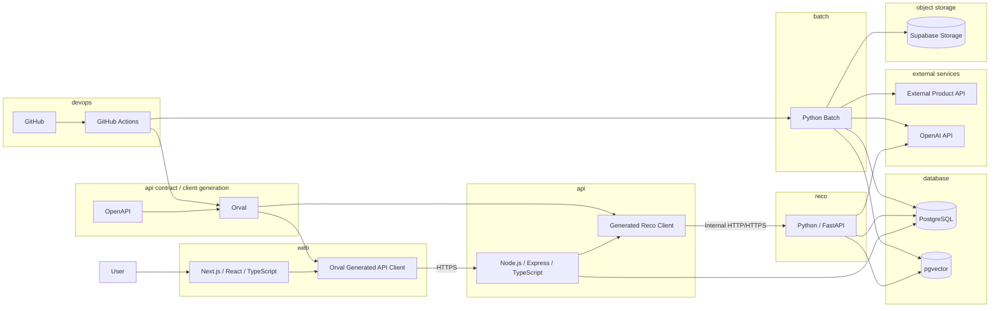

# 利用技術スタック整理表

## 1. 概要

### 1.1 目的

本ドキュメントは、Gift Recommendation Service MVPにおける利用技術スタックを整理する。

`システム論理構成図` で定義した以下の論理コンポーネントに対して、MVP開発で利用する技術候補・採用方針・責務範囲を明確化する。

```text
web
api
reco
batch
database
object storage
external services
api contract / client generation
observability
devops
```

本ドキュメントは、後続の `システム物理構成図`、`プロジェクトディレクトリ構成定義書`、`API設計方針書`、`バッチ設計方針書`、`CI/CD方針書` の前提となる。

---

### 1.2 本ドキュメントの位置づけ

| 成果物                             | 本ドキュメントとの関係                                    |
| ---------------------------------- | --------------------------------------------------------- |
| システム論理構成図                 | 論理コンポーネントごとの技術割当の前提                    |
| システム物理構成図                 | 技術スタックを具体的な実行環境・ホスティングへ配置する    |
| プロジェクトディレクトリ構成定義書 | monorepo構成・ディレクトリ設計の前提                      |
| API設計方針書                      | api / reco間、web / api間の技術前提                       |
| バッチ設計方針書                   | batch処理の技術前提                                       |
| 外部商品データ連携設計書           | 外部API、Raw保存、Staging変換の技術前提                   |
| DB設計方針書                       | PostgreSQL / pgvector / migrationの前提                   |
| DevOps方針書                       | GitHub Actions、CI/CD、環境変数管理、生成コード運用の前提 |
| CI/CD方針書                        | lint / test / build / OpenAPI検証 / Orval生成検証の前提   |

---

## 2. 技術選定の基本方針

### 2.1 技術選定方針

| 方針                        | 内容                                                                     |
| --------------------------- | ------------------------------------------------------------------------ |
| MVP開発速度を優先する       | 個人開発で実装・検証しやすい技術を選ぶ                                   |
| 学習コストを抑える          | 既に利用・検討済みの技術を中心に採用する                                 |
| 論理分離を保つ              | web / api / reco / batch の責務分離を技術構成にも反映する                |
| 過剰な分散を避ける          | MVPではマイクロサービス運用を目的化しない                                |
| 将来拡張可能性を残す        | MVP後にスケール・運用改善できる構成にする                                |
| AI・Embedding処理に対応する | OpenAI API、ベクトル検索、Feature生成を扱える構成にする                  |
| DB容量を意識する            | Rawデータ本体はObject Storageへ保存し、DBには構造化データを保存する      |
| 仕様駆動開発を支える        | OpenAPIをAPI契約として管理し、OrvalによりAPIクライアント生成を自動化する |
| GitHub中心で運用する        | Issue / Projects / Actions / PRを開発運用の中心にする                    |

---

### 2.2 MVPで重視する観点

| 観点             | 優先度 | 内容                                                                       |
| ---------------- | -----: | -------------------------------------------------------------------------- |
| 開発速度         |     高 | 個人開発で進めやすいこと                                                   |
| 実装容易性       |     高 | フレームワーク・ライブラリが扱いやすいこと                                 |
| デバッグ容易性   |     高 | ローカルで動作確認しやすいこと                                             |
| コスト           |     高 | MVP段階では無料枠・低コストを重視する                                      |
| 再現性           |     高 | Request / Run / Result / Versionを追跡できること                           |
| API契約の一貫性  |     高 | OpenAPIをもとにAPIクライアントを生成し、web / api 間の型不整合を減らすこと |
| AI連携           |     高 | Embedding / Semantic抽出 / Reason生成に対応できること                      |
| スケーラビリティ |     中 | 初期は過剰対応しないが、将来移行可能にする                                 |
| 高可用性         |     低 | MVPでは対象外                                                              |
| 高度監視         |     低 | MVPでは最低限のログ・評価中心                                              |

---

## 3. 全体技術スタック

### 3.1 技術スタック概要

| 論理コンポーネント    | 採用技術・候補                 | 採用区分    | 主な用途                                                      |
| --------------------- | ------------------------------ | ----------- | ------------------------------------------------------------- |
| web                   | Next.js / React / TypeScript   | MVP採用     | 画面、フォーム、結果表示                                      |
| api                   | Node.js / Express / TypeScript | MVP採用     | 外部公開API、Validation、DB保存、reco呼び出し                 |
| reco                  | Python / FastAPI               | MVP採用     | 推薦ロジック、Semantic、Feature、Retrieval、Matching、Ranking |
| batch                 | Python                         | MVP採用     | 商品データ取得、Raw保存、Staging変換、Embedding生成、評価     |
| database              | PostgreSQL                     | MVP採用     | アプリケーションデータ保存                                    |
| vector search         | pgvector                       | MVP採用     | 商品Embedding検索                                             |
| object storage        | Supabase Storage      | MVP採用方針 | 外部商品API Rawデータ保存                                     |
| external product api  | 楽天API等                      | MVP採用候補 | 商品データ取得                                                |
| external ai api       | OpenAI API                     | MVP採用候補 | Embedding、Semantic抽出、Reason生成                           |
| api specification     | OpenAPI                        | MVP採用方針 | Public API / Internal API の契約定義                          |
| api client generation | Orval                          | MVP採用方針 | OpenAPIからTypeScript APIクライアントを自動生成               |
| code definitions      | YAML / JSON等                  | MVP採用方針 | Feature、Semantic、mode、status、error_code等のコード定義管理 |
| CI/CD                 | GitHub Actions                 | MVP採用     | CI、バッチ実行、デプロイ補助、OpenAPI / Orval検証             |
| hosting               | Vercel / Render / Fly.io 等    | 候補        | web / api / reco のホスティング                               |
| package manager       | pnpm                           | MVP採用     | monorepo管理                                                  |
| repository            | GitHub                         | MVP採用     | ソース管理、Issue、PR、Projects                               |
| documentation         | Markdown / Notion              | MVP採用     | 成果物管理、ドキュメント管理                                  |

---

### 3.2 論理構成と技術対応



---

## 4. web技術スタック

### 4.1 採用技術

| 項目                | 技術                    | 採用区分    | 用途                                      |
| ------------------- | ----------------------- | ----------- | ----------------------------------------- |
| フレームワーク      | Next.js                 | MVP採用     | Webアプリケーション構築                   |
| UIライブラリ        | React                   | MVP採用     | 画面コンポーネント構築                    |
| 言語                | TypeScript              | MVP採用     | 型安全なフロントエンド開発                |
| パッケージ管理      | pnpm                    | MVP採用     | monorepo内の依存管理                      |
| CSS                 | Tailwind CSS            | MVP採用     | UIスタイリング（`apps/web/src/styles/**`） |
| API仕様             | OpenAPI                 | 採用方針    | web → api のAPI契約管理                   |
| APIクライアント生成 | Orval                   | MVP採用方針 | OpenAPIからweb用APIクライアントを自動生成 |
| API通信             | Orval生成client / fetch | 採用方針    | api呼び出し                               |
| フォーム管理        | React Hook Form等       | 候補        | 入力フォーム管理                          |
| バリデーション      | Zod等                   | 候補        | フロント側入力補助チェック                |

---

### 4.2 webの担当範囲

| 責務         | 内容                                                                        |
| ------------ | --------------------------------------------------------------------------- |
| 入力画面     | relationship / occasion / budget / preferred / non_preferred / ng条件の入力 |
| 結果表示     | 推薦商品、価格、画像、推薦理由、スコア補足の表示                            |
| Feedback入力 | 商品・理由・結果への簡易Feedback入力                                        |
| API呼び出し  | Orval生成clientを利用してapiへHTTPS通信する                                 |
| 表示制御     | loading / error / empty result / fallback messageの表示                     |

---

### 4.3 webで扱わないもの

| 対象外                      | 理由                                      |
| --------------------------- | ----------------------------------------- |
| 推薦ロジック                | recoの責務                                |
| Ranking計算                 | recoの責務                                |
| 商品データ取得              | batchの責務                               |
| DB直接接続                  | api経由に統一する                         |
| 外部AI API直接呼び出し      | API Keyをwebに出さないため                |
| Object Storage直接操作      | Rawデータはserver側で管理するため         |
| APIクライアントの手書き実装 | OpenAPI / Orvalによる生成を基本とするため |

---

## 5. api技術スタック

### 5.1 採用技術

| 項目                | 技術                          | 採用区分 | 用途                                                |
| ------------------- | ----------------------------- | -------- | --------------------------------------------------- |
| ランタイム          | Node.js                       | MVP採用  | APIサーバ実行基盤                                   |
| フレームワーク      | Express                       | MVP採用  | HTTP API実装                                        |
| 言語                | TypeScript                    | MVP採用  | 型安全なAPI実装                                     |
| バリデーション      | Zod等                         | 候補     | Request Validation                                  |
| DB接続              | node-postgres / Prisma等      | 候補     | PostgreSQL接続                                      |
| API仕様             | OpenAPI                       | 採用方針 | Public API / Internal API仕様管理                   |
| APIクライアント生成 | Orval                         | 採用方針 | api → reco のInternal APIクライアント生成に利用可能 |
| エラーハンドリング  | 共通Error Middleware          | 採用方針 | APIエラー形式統一                                   |
| 内部通信            | Orval生成client / HTTP Client | 採用方針 | reco呼び出し                                        |

---

### 5.2 apiの担当範囲

| 責務               | 内容                                    |
| ------------------ | --------------------------------------- |
| Recommendation API | レコメンド実行リクエストを受け付ける    |
| Feedback API       | Feedback登録を受け付ける                |
| Master API         | Relationship / Occasion等の選択肢を返す |
| Request Validation | 入力形式、必須、値域、矛盾チェック      |
| DB保存             | Request / Result / Feedback等の保存     |
| reco呼び出し       | 推薦処理本体をrecoへ依頼                |
| Response整形       | web向けレスポンスに整形                 |
| Error Handling     | エラーコード・レスポンス形式を統一      |

---

### 5.3 apiで扱わないもの

| 対象外                         | 理由                               |
| ------------------------------ | ---------------------------------- |
| Semantic抽出                   | recoの責務                         |
| Feature生成                    | recoの責務                         |
| Retrieval / Matching / Ranking | recoの責務                         |
| 商品データ定期取得             | batchの責務                        |
| Rawデータ保存                  | batch / object storageの責務       |
| 外部商品API直接連携            | Online処理に外部依存を入れないため |

---

### 5.4 Orval利用方針

MVPでは、まず `web → api` のPublic APIクライアント生成を優先する。

`api → reco` については、Internal API契約をOpenAPIとして管理し、必要に応じてOrvalによるTypeScript client生成を導入する。

```text
Public API:
packages/contracts/openapi/public-api.yaml
  ↓
Orval
  ↓
apps/web/src/generated/api/

Internal Reco API:
packages/contracts/openapi/internal-reco-api.yaml
  ↓
Orval
  ↓
apps/api/src/generated/reco-client/
```

生成されたAPIクライアントは手動編集しない。

---

## 6. reco技術スタック

### 6.1 採用技術

| 項目           | 技術                      | 採用区分 | 用途                      |
| -------------- | ------------------------- | -------- | ------------------------- |
| 言語           | Python                    | MVP採用  | 推薦ロジック実装          |
| フレームワーク | FastAPI                   | MVP採用  | reco API実装              |
| ASGIサーバ     | Uvicorn                   | MVP採用  | FastAPI実行               |
| 数値計算       | NumPy                     | 候補     | Feature / score計算       |
| データ処理     | pandas                    | 候補     | 評価・分析補助            |
| DB接続         | psycopg等                 | 候補     | PostgreSQL接続            |
| HTTP Client    | httpx等                   | 候補     | OpenAI API等の呼び出し    |
| Embedding      | OpenAI Embeddings         | 候補     | User / Item embedding生成 |
| Vector Search  | pgvector                  | 採用方針 | 類似商品検索              |
| API仕様        | OpenAPI / FastAPI自動生成 | 採用方針 | reco内部API確認           |

---

### 6.2 recoの担当範囲

| 責務                         | 内容                                          |
| ---------------------------- | --------------------------------------------- |
| Recommendation Orchestration | 推薦パイプライン全体制御                      |
| Semantic Extraction          | 入力文からSemantic Conceptを抽出              |
| User Feature Generation      | User Featureを生成                            |
| Retrieval                    | 候補商品を抽出                                |
| Matching                     | User FeatureとItem Featureの意味一致計算      |
| Ranking                      | final_scoreとrankを決定                       |
| Reason Generation            | 推薦理由を生成                                |
| Config Resolution            | semantic_config_version / model_versionを解決 |
| Score Logging                | score_breakdown / phase logを出力             |

---

### 6.3 recoで扱わないもの

| 対象外                 | 理由                    |
| ---------------------- | ----------------------- |
| 画面表示               | webの責務               |
| 外部公開APIの入口      | apiの責務               |
| 商品Raw取得            | batchの責務             |
| Rawデータ保存          | object storageの責務    |
| GitHub Actions実行制御 | DevOpsの責務            |
| DBマイグレーション管理 | DB設計・migrationの責務 |

---

## 7. batch技術スタック

### 7.1 採用技術

| 項目                  | 技術                   | 採用区分 | 用途                     |
| --------------------- | ---------------------- | -------- | ------------------------ |
| 言語                  | Python                 | MVP採用  | バッチ処理実装           |
| HTTP Client           | httpx / requests       | 候補     | 外部商品API呼び出し      |
| データ処理            | pandas                 | 候補     | 変換・検証・評価         |
| DB接続                | psycopg等              | 候補     | PostgreSQL保存           |
| Object Storage Client | S3 互換 HTTP（httpx / SigV4） | **採用**（接続方針 A / #1612） | Raw JSON 保存・読取。製品は Supabase Storage |
| スケジューラ          | GitHub Actions         | MVP採用  | 定期バッチ実行           |
| ログ                  | Python logging         | 採用方針 | バッチ実行ログ           |
| 環境変数管理          | GitHub Actions Secrets | 採用方針 | API Key / DB接続情報管理 |

---

### 7.2 batchの担当範囲

| 責務               | 内容                                                     |
| ------------------ | -------------------------------------------------------- |
| 商品データ取得     | 外部商品APIから商品情報を取得                            |
| Rawデータ保存      | 外部APIレスポンス本体をObject Storageへ保存              |
| Rawメタデータ保存  | object key / hash / fetched_at / import_statusをDBへ保存 |
| Staging変換        | Rawデータを内部形式へ変換                                |
| Item反映           | item正本へ反映                                           |
| Item Semantic抽出  | 商品情報からSemantic Conceptを抽出                       |
| Item Feature生成   | 商品Featureを生成                                        |
| Item Embedding生成 | Vector Search用Embeddingを生成                           |
| Active制御         | 商品の有効・無効状態を更新                               |
| Offline Evaluation | 評価データセットで推薦品質を検証                         |

---

### 7.3 batchで扱わないもの

| 対象外                              | 理由                        |
| ----------------------------------- | --------------------------- |
| ユーザー同期レスポンス              | Online処理ではないため      |
| UI表示                              | webの責務                   |
| 公開API                             | apiの責務                   |
| ユーザー入力に対する即時Feature生成 | recoのOnline処理            |
| 本番高頻度ジョブ基盤                | MVPではGitHub Actionsで十分 |
| OrvalによるAPIクライアント生成      | batchの主要責務ではないため |

---

## 8. database技術スタック

### 8.1 採用技術

| 項目         | 技術                           | 採用区分 | 用途                       |
| ------------ | ------------------------------ | -------- | -------------------------- |
| RDBMS        | PostgreSQL                     | MVP採用  | アプリケーションDB         |
| Vector拡張   | pgvector                       | MVP採用  | Embedding検索              |
| Migration    | SQL migration / migration tool | 採用方針 | DDL管理                    |
| 接続方式     | DB Connection                  | 採用方針 | api / reco / batchから接続 |
| ホスティング | Supabase                     | MVP採用  | PostgreSQL + Storage ホスティング |
| SQLファイル  | `.sql`                         | 採用方針 | DDL / migration定義        |

---

### 8.2 databaseの担当範囲

| データ領域         | 内容                                                              |
| ------------------ | ----------------------------------------------------------------- |
| Master / Config    | relationship / occasion / semantic_config_version / model_version |
| Recommendation     | request / run / result / result_item / reason / feedback          |
| Item               | item / price / category / tag / shop                              |
| Raw Metadata       | object key / hash / source_api / fetched_at / import_status       |
| Semantic / Feature | semantic result / user_feature / item_feature                     |
| Embedding          | item_embedding / query_embedding                                  |
| Log                | phase log / error log / metrics                                   |
| Evaluation         | eval_dataset / eval_result / human_eval                           |

---

### 8.3 databaseで扱わないもの

| 対象外               | 理由                                  |
| -------------------- | ------------------------------------- |
| 外部API Raw JSON本体 | Object Storageへ保存するため          |
| 画像ファイル本体     | 外部URLまたはObject Storageで扱うため |
| 業務ロジック         | api / reco / batchで実装する          |
| 推薦計算             | recoの責務                            |
| 大容量非構造データ   | DB容量肥大化を避けるため              |

---

## 9. object storage技術スタック

### 9.1 採用技術

| 項目           | 技術                      | 採用区分    | 用途                        |
| -------------- | ------------------------- | ----------- | --------------------------- |
| Object Storage | Supabase Storage | MVP採用方針 | Rawデータ保存               |
| API            | S3 互換 REST（SigV4）     | **採用**（接続方針 A） | batchから保存・読取。製品は Supabase Storage |
| Client         | boto3等                   | 候補        | Python batchから操作        |
| Object Key設計 | 日付・API種別・hashベース | 採用方針    | 再処理・重複排除            |
| ライフサイクル | 将来検討                  | MVP後       | Raw保持期間・アーカイブ管理 |

---

### 9.2 保存対象

| 保存対象                | 内容                            |
| ----------------------- | ------------------------------- |
| 商品検索APIレスポンス   | 外部商品APIから取得したRaw JSON |
| ジャンルAPIレスポンス   | ジャンル情報Raw JSON            |
| ランキングAPIレスポンス | ランキングRaw JSON              |
| タグ・属性系レスポンス  | 取得可能な場合の属性Raw JSON    |
| APIエラーレスポンス     | 必要に応じた調査用Raw           |

---

### 9.3 保存しないもの

| 対象外                | 理由                         |
| --------------------- | ---------------------------- |
| item正本              | DBで構造化管理するため       |
| item_feature          | DBで検索・評価に利用するため |
| item_embedding        | pgvectorで検索するため       |
| recommendation_result | DBで正本管理するため         |
| feedback              | DBで分析するため             |

---

## 10. 外部サービス技術スタック

### 10.1 外部商品API

| 項目             | 技術・候補     | 用途                           |
| ---------------- | -------------- | ------------------------------ |
| 商品データソース | 楽天API等      | 商品情報取得                   |
| 通信方式         | HTTPS          | 外部API通信                    |
| 利用元           | batch          | 商品データ取得                 |
| Online利用       | 原則なし       | 応答速度・再現性・外部依存回避 |
| Raw保存          | Object Storage | レスポンス原本保存             |
| Metadata保存     | PostgreSQL     | object key / hash / status管理 |

---

### 10.2 外部AI API

| 項目          | 技術・候補                       | 用途                      |
| ------------- | -------------------------------- | ------------------------- |
| AI API        | OpenAI API                       | Semantic抽出 / Reason生成 |
| Embedding API | OpenAI Embeddings                | 商品・クエリEmbedding生成 |
| 通信方式      | HTTPS                            | 外部API通信               |
| 利用元        | reco / batch                     | Online推論・Batch前処理   |
| 管理対象      | model_version / prompt_version   | 再現性確保                |
| 注意点        | コスト / レイテンシ / レート制限 | MVP運用時に監視           |

---

## 11. API契約・クライアント生成技術スタック

### 11.1 採用技術

| 項目                | 技術                             | 採用区分    | 用途                                        |
| ------------------- | -------------------------------- | ----------- | ------------------------------------------- |
| API仕様記述         | OpenAPI                          | MVP採用方針 | Public API / Internal APIの契約定義         |
| APIクライアント生成 | Orval                            | MVP採用方針 | OpenAPIからTypeScript APIクライアントを生成 |
| 型生成              | Orval                            | MVP採用方針 | Request / Response型を生成                  |
| Mock生成            | Orval / MSW等                    | 候補        | API mock生成・フロント開発補助              |
| API仕様検証         | OpenAPI lint / schema validation | 採用方針    | API仕様の構文・整合性確認                   |
| 生成物検証          | TypeScript typecheck             | 採用方針    | 生成clientの型検証                          |

---

### 11.2 Orval利用範囲

| 対象                           | 利用方針   | 内容                                                            |
| ------------------------------ | ---------- | --------------------------------------------------------------- |
| web → api                      | MVP採用    | Public APIのクライアントを生成する                              |
| api → reco                     | 採用候補   | Internal APIのTypeScript client生成に利用可能                   |
| batch → external product api   | 原則対象外 | 外部API仕様の揺れや必要endpoint限定のため、専用clientを実装する |
| reco / batch → external ai api | 原則対象外 | SDKまたは専用clientを利用する                                   |

---

### 11.3 Orval導入理由

| 理由                           | 内容                                                                        |
| ------------------------------ | --------------------------------------------------------------------------- |
| API契約と実装の乖離を減らす    | OpenAPIをもとにclientと型を生成するため、手書きAPI clientの不整合を減らせる |
| フロントエンド実装効率を上げる | Request / Response型、API呼び出し関数を自動生成できる                       |
| 仕様駆動開発と相性がよい       | 設計されたAPI契約を実装資材へ反映しやすい                                   |
| CIで検証しやすい               | OpenAPI lint、Orval generate、typecheckをCIに組み込める                     |
| 将来のAPI変更に強くなる        | API変更時に型エラーとして影響箇所を検知しやすい                             |

---

### 11.4 生成物管理方針

| 方針                               | 内容                                                            |
| ---------------------------------- | --------------------------------------------------------------- |
| 生成物は手動編集しない             | API仕様変更時はOpenAPIを更新し、Orvalで再生成する               |
| 呼び出し元コンポーネント配下に置く | web用clientは`apps/web`、api用reco clientは`apps/api`に配置する |
| CIで生成検証する                   | Orval generate、差分確認、typecheckをCI観点に含める             |
| 外部APIには無理に適用しない        | 楽天API・OpenAI API等には必要に応じて専用clientを実装する       |

---

## 12. DevOps技術スタック

### 12.1 ソース管理・タスク管理

| 項目               | 技術            | 採用区分    | 用途                             |
| ------------------ | --------------- | ----------- | -------------------------------- |
| ソース管理         | Git             | MVP採用     | バージョン管理                   |
| リモートリポジトリ | GitHub          | MVP採用     | ソース管理・PR                   |
| タスク管理         | GitHub Issues   | MVP採用     | 作業単位管理                     |
| プロジェクト管理   | GitHub Projects | MVP採用     | Roadmap / WBS管理                |
| ブランチ管理       | GitHub Branch   | MVP採用     | feature / task branch管理        |
| Pull Request       | GitHub PR       | MVP採用     | レビュー・マージ                 |
| 自動化             | GitHub Actions  | MVP採用     | CI / branch自動作成 / batch実行  |
| API client生成     | Orval           | MVP採用方針 | OpenAPIからAPIクライアントを生成 |

---

### 12.2 CI/CD

| 項目               | 技術                             | 採用区分    | 用途                                        |
| ------------------ | -------------------------------- | ----------- | ------------------------------------------- |
| CI                 | GitHub Actions                   | MVP採用     | lint / test / build                         |
| CD                 | GitHub Actions + Hosting連携     | 候補        | デプロイ自動化                              |
| Batch Schedule     | GitHub Actions cron              | MVP採用候補 | 定期バッチ実行                              |
| Secrets            | GitHub Actions Secrets           | MVP採用     | API Key / DB URL管理                        |
| Branch Protection  | GitHub                           | 採用方針    | main / develop保護                          |
| PR Checks          | GitHub Actions                   | 採用方針    | PR品質チェック                              |
| OpenAPI検証        | OpenAPI lint / schema validation | 採用方針    | API契約の構文・整合性チェック               |
| API client生成検証 | Orval generate                   | 採用方針    | OpenAPIからAPI clientを生成できることを確認 |
| 生成client型検証   | TypeScript typecheck             | 採用方針    | 生成client利用箇所の型整合性を確認          |

---

### 12.3 GitHub運用との対応

| 運用要素           | 技術                                   |
| ------------------ | -------------------------------------- |
| Issueテンプレート  | GitHub Issue Forms                     |
| Label自動付与      | GitHub Actions                         |
| Branch自動作成     | GitHub Actions                         |
| PR作成補助         | GitHub Actions / GitHub CLI            |
| CI実行             | GitHub Actions                         |
| API client生成検証 | GitHub Actions + Orval                 |
| Roadmap管理        | GitHub Projects                        |
| Milestone管理      | GitHub Milestones                      |
| ドキュメント管理   | Markdown in repository + Notion mirror |

---

## 13. ホスティング・実行環境候補

### 13.1 MVP候補

| コンポーネント | 候補               | 用途                | 備考                      |
| -------------- | ------------------ | ------------------- | ------------------------- |
| web            | Vercel             | Next.js hosting     | Next.jsとの相性が良い     |
| api            | Render等           | Express API hosting | MVPでは低コスト重視       |
| reco           | Fly.io等           | FastAPI hosting     | Python API実行            |
| batch          | GitHub Actions     | 定期バッチ実行      | MVPでは十分               |
| database       | Supabase           | PostgreSQL + Storage | pgvector 対応（Supabase PostgreSQL） |
| object storage | Supabase Storage   | Rawデータ保存        | DB容量節約                           |
| secret管理     | 各hosting secrets  | 環境変数管理        | API Keyをコードに置かない |

---

### 13.2 物理構成で確定する項目

本ドキュメントでは、利用技術の論理割当までを定義する。  
以下は `システム物理構成図` で確定する。

| 項目                     | 確定先                            |
| ------------------------ | --------------------------------- |
| webの具体的なデプロイ先  | システム物理構成図                |
| apiの具体的なデプロイ先  | システム物理構成図                |
| recoの具体的なデプロイ先 | システム物理構成図                |
| DBホスティング           | システム物理構成図                |
| Object Storageサービス   | システム物理構成図                |
| ネットワーク経路         | システム物理構成図                |
| Secret配置               | システム物理構成図 / DevOps方針書 |
| 本番・開発環境分離       | 環境設計書 / DevOps方針書         |

---

## 14. 通信方式

### 14.1 コンポーネント間通信

| From           | To                                  | 通信方式                | 内容                                                     |
| -------------- | ----------------------------------- | ----------------------- | -------------------------------------------------------- |
| web            | api                                 | HTTPS                   | レコメンド実行、結果取得、Feedback登録、マスタ取得       |
| api            | reco                                | Internal HTTP/HTTPS     | 推薦実行依頼                                             |
| api            | database                            | DB Access               | Request / Feedback / Master取得・保存                    |
| reco           | database                            | DB Access               | Config / Item / Feature / Result / Log取得・保存         |
| reco           | external ai api                     | HTTPS                   | Semantic抽出、Reason生成                                 |
| batch          | external product api                | HTTPS                   | 商品データ取得                                           |
| batch          | Supabase Storage                    | HTTPS / Storage API     | Rawデータ保存・読取                                      |
| batch          | external ai api                     | HTTPS                   | 商品Semantic抽出、Embedding生成                          |
| batch          | database                            | DB Access               | Rawメタデータ / Staging / Item / Feature / Embedding保存 |
| GitHub Actions | hosting / database / object storage | HTTPS / CLI / DB Access | CI/CD、バッチ実行                                        |
| GitHub Actions | Orval                               | Local command           | OpenAPIからAPI clientを生成                              |

---

### 14.2 通信方針

| 方針                             | 内容                                           |
| -------------------------------- | ---------------------------------------------- |
| 外部公開通信はHTTPS              | web → api、外部API通信はHTTPS前提              |
| 内部通信は物理構成で確定         | api → recoは配置によりInternal HTTPまたはHTTPS |
| DB接続は直接HTTPと区別する       | DB Accessとして扱う                            |
| Object StorageはSupabase Storage の **S3 互換 API** として扱う | 実体は HTTPS（SigV4）。接続方針 A |
| ローカル開発のみHTTPを許容       | localhostではHTTP利用可                        |
| API clientはOpenAPIから生成する  | web → api はOrval生成client利用を基本とする    |

---

## 15. 開発環境

### 15.1 ローカル開発技術

| 項目                 | 技術              | 用途                        |
| -------------------- | ----------------- | --------------------------- |
| OS                   | Windows / WSL候補 | 開発環境                    |
| Editor               | Cursor            | コード編集・AI支援          |
| Node.js              | Node.js 24 LTS    | web / api実行               |
| Python               | Python 3.14       | reco / batch実行            |
| Package Manager      | pnpm              | monorepo依存管理            |
| API client generator | Orval             | OpenAPIからAPI clientを生成 |
| Git                  | Git               | バージョン管理              |
| DB Client            | psql / GUI Tool等 | PostgreSQL確認              |
| API確認              | curl / Postman等  | API疎通確認                 |
| Markdown             | Markdown          | 成果物作成                  |

**バージョン pin 正本（repo ファイル）**

| 項目    | バージョン     | 正本ファイル                                                                                  |
| ------- | -------------- | --------------------------------------------------------------------------------------------- |
| Node.js | 24 LTS         | `.nvmrc` / `.node-version` / `package.json#engines` / `.github/workflows/ci-contract.yml` |
| Python  | 3.14           | `.python-version`                                                                             |

---

### 15.2 monorepo構成方針

```text
apps/
  web/
  api/
  reco/
  batch/

packages/
  shared-logic/
  contracts/
  code-definitions/
  shared-types/
  test-fixtures/

db/
  migrations/
  seeds/
  ddl/
  queries/

docs/
  00_共通
  01_事業構想
  02_ドメイン探索
  03_ドメイン要件定義
  04_ドメインモデル設計
  05_アプリケーション設計
  06_実装設計
  07_開発・単体テスト
  08_モジュール結合テスト
  09_コンポーネント結合テスト
  10_システムテスト
  11_非機能テスト
  12_レコメンド品質評価テスト
  13_受入テスト
  14_リリース
  15_運用改善
  90_PoC
```

| ディレクトリ                | 技術                                   | 内容                     |
| --------------------------- | -------------------------------------- | ------------------------ |
| `apps/web`                  | Next.js / TypeScript / Orval生成client | フロントエンド           |
| `apps/api`                  | Express / TypeScript                   | API                      |
| `apps/reco`                 | FastAPI / Python                       | 推薦ロジック             |
| `apps/batch`                | Python                                 | バッチ                   |
| `packages/contracts`        | OpenAPI / schema                       | API契約                  |
| `packages/code-definitions` | YAML / JSON等                          | コード定義               |
| `packages/shared-logic`     | Python                                 | reco / batch共通ロジック |
| `docs`                      | Markdown                               | 成果物ドキュメント       |

---

## 16. 環境変数・Secret管理

### 16.1 主な環境変数

| 環境変数               | 利用元             | 内容                          |
| ---------------------- | ------------------ | ----------------------------- |
| `DATABASE_URL`         | api / reco / batch | PostgreSQL接続URL             |
| `OPENAI_API_KEY`       | reco / batch       | OpenAI API Key                |
| `RAKUTEN_APP_ID`       | batch              | 楽天API Key等                 |
| `SUPABASE_URL`              | batch / api 等     | Supabase プロジェクト URL（DB 等）。Storage S3 互換 endpoint とは別 |
| `SUPABASE_SERVICE_ROLE_KEY` | api / batch 等     | server 専用 DB / 管理操作。**Raw Storage 主認証には使わない**（案 A） |
| `OBJECT_STORAGE_BUCKET`     | batch              | Raw JSON 保存バケット名（例: `raw-products`）。旧名 `STORAGE_BUCKET_RAW` は参照のみ |
| `OBJECT_STORAGE_ENDPOINT` / `ACCESS_KEY` / `SECRET_KEY` | batch | Supabase Storage **S3 互換** 接続（接続方針 A） |
| `API_BASE_URL`         | web                | api接続先                     |
| `RECO_BASE_URL`        | api                | reco接続先                    |
| `APP_ENV`              | all                | dev / stage / prod識別        |

---

### 16.2 Secret管理方針

| 方針                         | 内容                                         |
| ---------------------------- | -------------------------------------------- |
| SecretをGit管理しない        | `.env` やAPI Keyをcommitしない               |
| hosting環境変数に保存        | Vercel / Render / Fly.io等のSecret機能を利用 |
| GitHub Actions Secretsを利用 | CI・batch実行時のSecret管理                  |
| webに秘密情報を置かない      | 外部API Keyはserver側のみ                    |
| 環境ごとに分離               | dev / stage / prodでSecretを分ける           |
| `.env.example` を用意        | 必要な環境変数名だけ共有する                 |

---

## 17. Observability / Logging技術方針

### 17.1 MVPでのログ方針

| 項目          | 技術・方針              | 内容                         |
| ------------- | ----------------------- | ---------------------------- |
| アプリログ    | 標準logging             | api / reco / batchのログ出力 |
| phase log     | DB保存                  | 推薦処理の各段階を記録       |
| error log     | DB保存 + runtime log    | 障害解析用                   |
| metrics       | DB / 集計クエリ         | MVPでは簡易集計              |
| batch log     | GitHub Actions log + DB | バッチ実行結果確認           |
| 外部APIエラー | DB / log                | API失敗率確認                |
| Raw保存ログ   | DB metadata             | object key / save status管理 |

---

### 17.2 将来候補

| 項目      | 候補                 | 導入タイミング     |
| --------- | -------------------- | ------------------ |
| APM       | Sentry等             | 商用化前後         |
| Log基盤   | Cloud Logging等      | ログ量増加時       |
| Dashboard | Metabase / Grafana等 | 評価・監視高度化時 |
| Alert     | 各種監視サービス     | 本番運用開始時     |
| BI        | BigQuery等           | 分析データ増加時   |

MVPでは、外部監視基盤の導入よりも、DBに必要なログ・評価データを残すことを優先する。

---

## 18. テスト技術方針

### 18.1 テスト技術候補

| 対象                  | 技術候補                              | 用途                     |
| --------------------- | ------------------------------------- | ------------------------ |
| web                   | Vitest / React Testing Library等      | UI・コンポーネントテスト |
| api                   | Vitest / Jest等                       | APIロジックテスト        |
| reco                  | pytest                                | 推薦ロジックテスト       |
| batch                 | pytest                                | バッチ処理テスト         |
| DB                    | SQL test / migration check            | DDL・制約確認            |
| API                   | OpenAPI / curl / Postman等            | API疎通確認              |
| API contract          | OpenAPI lint / schema validation      | API契約検証              |
| API client generation | Orval generate / TypeScript typecheck | API client生成・型検証   |
| E2E                   | Playwright等                          | 将来の画面操作テスト     |
| CI                    | GitHub Actions                        | 自動テスト実行           |

---

### 18.2 MVPテスト優先度

| テスト対象         | 優先度 | 理由                                          |
| ------------------ | -----: | --------------------------------------------- |
| Request Validation |     高 | 入力不備を防ぐため                            |
| API契約            |     高 | web / api 間の不整合を防ぐため                |
| Orval生成client    |     高 | API仕様からclient生成できることを保証するため |
| Retrieval          |     高 | 候補抽出品質に直結                            |
| Matching           |     高 | 意味一致の中核                                |
| Ranking            |     高 | 最終結果品質に直結                            |
| Reason生成         |     中 | 表示品質に影響                                |
| Batch変換          |     高 | 商品データ品質に直結                          |
| DB migration       |     高 | データ構造の安定性に直結                      |
| UI見た目           |     中 | MVPでは過剰に作り込まない                     |

---

## 19. 採用保留・将来検討技術

### 19.1 MVPでは採用しない技術

| 技術・領域                  | 理由                        |
| --------------------------- | --------------------------- |
| Kubernetes                  | MVPでは運用負荷が高い       |
| 専用Workflow Engine         | GitHub Actionsで十分        |
| 高度なFeature Store         | 初期データ量では過剰        |
| 専用Vector DB               | pgvectorで開始可能          |
| Data Warehouse              | 初期分析には過剰            |
| Real-time Stream Processing | MVPでは不要                 |
| Online Learning基盤         | Feedback量が不足する        |
| A/B Test Platform           | 初期トラフィック不足        |
| 大規模監視基盤              | MVPではログ・評価中心で十分 |

---

### 19.2 将来導入候補

| 技術・領域           | 導入条件                                 |
| -------------------- | ---------------------------------------- |
| 専用Vector DB        | pgvectorで性能不足になった場合           |
| Data Warehouse       | 評価・ログデータが増えた場合             |
| BI Dashboard         | 定常的な評価・改善運用が必要になった場合 |
| APM / Error Tracking | 本番ユーザーが増えた場合                 |
| Feature Store        | Feature数・生成経路が複雑化した場合      |
| Queue / Worker       | 非同期処理が増えた場合                   |
| User Auth            | 履歴・パーソナライズ導入時               |
| A/B Test             | トラフィックが十分に増えた場合           |

---

## 20. 技術スタック一覧表

### 20.1 MVP採用スタック

| 分類                  | 技術           | 採用理由                                     |
| --------------------- | -------------- | -------------------------------------------- |
| Frontend              | Next.js        | ReactベースでWebアプリを構築しやすい         |
| Frontend Library      | React          | UIコンポーネントを構築しやすい               |
| Frontend Language     | TypeScript     | 型安全に画面・API型を扱える                  |
| Backend API           | Express        | 軽量でAPI実装しやすい                        |
| API Language          | TypeScript     | webと型・開発体験を揃えやすい                |
| Reco API              | FastAPI        | Pythonで推薦ロジックAPIを実装しやすい        |
| Reco Language         | Python         | 数値計算・AI連携・バッチ処理と相性が良い     |
| Batch                 | Python         | 外部API取得・変換・Embedding処理に向いている |
| Database              | PostgreSQL     | 構造化データ・トランザクション管理に適する   |
| Vector Search         | pgvector       | PostgreSQL内でEmbedding検索できる            |
| Object Storage        | Supabase Storage | Raw JSON保存に適する                         |
| AI API                | OpenAI API     | Embedding・Semantic・Reason生成に利用        |
| API Specification     | OpenAPI        | API契約を機械可読に管理できる                |
| API Client Generation | Orval          | OpenAPIからTypeScript API clientを生成できる |
| Code Definitions      | YAML / JSON等  | コード定義を機械可読に管理できる             |
| CI/CD                 | GitHub Actions | GitHub運用と統合しやすい                     |
| Repo                  | GitHub         | Issue / PR / Projectsと連携できる            |
| Package Manager       | pnpm           | monorepo管理に向いている                     |
| Documentation         | Markdown       | GitHub管理・Notion転記がしやすい             |

---

### 20.2 技術責務対応表

| 技術           | 主な責務                      | 主な配置                                                                              |
| -------------- | ----------------------------- | ------------------------------------------------------------------------------------- |
| Next.js        | 画面・ルーティング            | `apps/web`                                                                            |
| React          | UIコンポーネント              | `apps/web`                                                                            |
| TypeScript     | web / api型安全性             | `apps/web`, `apps/api`                                                                |
| Express        | API endpoint                  | `apps/api`                                                                            |
| FastAPI        | reco内部API                   | `apps/reco`                                                                           |
| Python         | 推薦・バッチ処理              | `apps/reco`, `apps/batch`                                                             |
| PostgreSQL     | データ永続化                  | database                                                                              |
| pgvector       | Embedding検索                 | database                                                                              |
| Supabase Storage（S3 互換 API） | Rawデータ保存          | `OBJECT_STORAGE_*` / #1612 client                                                     |
| OpenAI API     | Embedding / Reason / Semantic | external ai api                                                                       |
| OpenAPI        | API契約定義                   | `packages/contracts/openapi`                                                          |
| Orval          | API client生成                | `orval.config.ts`, `apps/web/src/generated/api`, `apps/api/src/generated/reco-client` |
| YAML / JSON    | コード定義管理                | `packages/code-definitions`                                                           |
| GitHub Actions | CI / batch / automation       | `.github/workflows`                                                                   |
| Markdown       | 成果物管理                    | `docs`                                                                                |

---

## 21. レビュー観点

| 観点               | 確認内容                                                                         |
| ------------------ | -------------------------------------------------------------------------------- |
| 論理構成との整合   | web / api / reco / batch / database / object storageに技術が対応しているか       |
| MVP妥当性          | 個人開発で実装・運用できる技術に収まっているか                                   |
| 責務分離           | webが推薦計算を持たず、recoに集約されているか                                    |
| Online / Batch分離 | ユーザー同期処理と事前処理が分かれているか                                       |
| Raw保存方針        | Rawデータ本体をObject Storageに保存する前提になっているか                        |
| Embedding対応      | pgvector / OpenAI APIの利用前提が整理されているか                                |
| API契約管理        | OpenAPIでAPI仕様を管理する前提になっているか                                     |
| API client生成     | OrvalによるAPI client生成方針が整理されているか                                  |
| コード定義管理     | Feature / Semantic / status / error_code等を機械可読に管理する前提になっているか |
| GitHub運用連携     | Issue / PR / Actions / Projectsに接続できるか                                    |
| Secret管理         | API KeyやDB URLをコードに置かない方針になっているか                              |
| 後続設計接続       | 物理構成図、API設計、バッチ設計、DB設計、CI/CD設計へ展開できるか                 |

---

## 22. まとめ

Gift Recommendation Service MVPの技術スタックは、以下を基本とする。

```text
web
= Next.js / React / TypeScript

api
= Express / TypeScript

reco
= FastAPI / Python

batch
= Python

database
= Supabase PostgreSQL / pgvector

object storage
= Supabase Storage

external ai api
= OpenAI API

external product api
= 楽天API等

api specification
= OpenAPI

api client generation
= Orval

code definitions
= YAML / JSON等

devops
= GitHub / GitHub Actions / GitHub Projects
```

MVPでは、過剰な分散基盤・高度な監視基盤・専用Vector DB・Data Warehouseは導入しない。

まずは、以下を優先する。

```text
- 意味ベース推薦を動かせること
- 商品データを取得・保存・再処理できること
- Feature / Embedding / Rankingを検証できること
- API契約をOpenAPIで管理できること
- Orvalによりweb → api のAPI clientを自動生成できること
- Result / Feedback / Evaluationを蓄積できること
- GitHub中心で開発運用できること
```

本ドキュメントをもとに、次工程では `システム物理構成図` を作成し、各技術スタックを具体的な実行環境・ホスティング・通信経路へ配置する。
