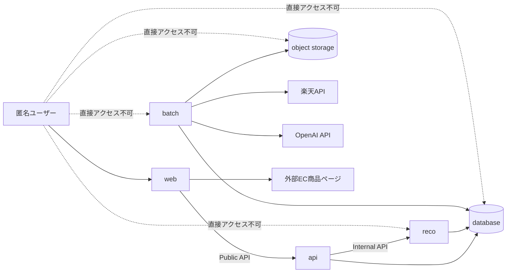

# 認証・認可設計書

## 1. 概要

### 1.1 目的

本ドキュメントは、Gift Recommendation Service MVP における認証・認可方針を定義する。

初回MVPでは、会員登録・ログイン・ユーザー別履歴管理を対象外とする。  
ただし、認証機能を持たないことは、すべての処理を無制限に公開することを意味しない。

本ドキュメントでは、以下を明確にする。

```text
- 初回MVPでユーザー認証を持たない範囲
- 匿名ユーザーに許可する操作
- 匿名ユーザーに許可しない操作
- web / api / reco / batch / DB のアクセス境界
- 内部APIの保護方針
- Batch / 運用系処理の権限方針
- 将来の認証機能追加に向けた拡張余地
```

---

### 1.2 本ドキュメントの位置づけ

本ドキュメントは、アプリケーション設計工程における横断設計成果物である。

後続の以下成果物の前提となる。

```text
認証・認可設計書
↓
API設計方針書
↓
API一覧
↓
インターフェース一覧
↓
テーブル一覧 再作成
↓
API仕様書
↓
テーブル定義書
↓
物理ER図
↓
DDL
```

---

## 2. 利用したインプット成果物

利用したインプット成果物は以下です。

- MVPスコープ定義書.md
- 制約・対象外一覧.md
- リソース一覧.md
- リソース責務定義表.md
- 正本定義表.md
- 論理ER図.md
- 状態遷移設計書.md
- テーブル一覧.md
- 処理構成定義書.md
- システム論理構成図.md
- システム物理構成図.md
- 画面一覧.md
- 画面遷移図.md
- 機能一覧.md
- モジュール一覧.md
- 機能×モジュール対応表.md
- 外部商品データ連携設計書.md
- RecommendationRequest定義書.md
- RecommendationResult定義書.md
- RecommendationFeedback定義書.md
- Reason生成定義書.md

---

## 3. 用語定義

| 用語            | 意味                                                                   |
| --------------- | ---------------------------------------------------------------------- |
| 認証            | 利用者やシステムが「誰であるか」「どのシステムであるか」を確認すること |
| 認可            | 認証済み、または匿名の主体に対して「何をしてよいか」を制御すること     |
| 匿名ユーザー    | ログインせずにサービスを利用する一般ユーザー                           |
| Public API      | web画面から匿名ユーザーが利用できるAPI                                 |
| Internal API    | api / reco / batch など、システム内部コンポーネント間で利用するAPI     |
| Service Account | batchやserverがDBや内部APIへアクセスするためのシステム権限             |
| Secret          | APIキー、DB接続情報、外部APIキーなどの秘密情報                         |

---

## 4. MVPにおける基本方針

### 4.1 基本方針

| 項目               | 方針                                       |
| ------------------ | ------------------------------------------ |
| ユーザー認証       | 初回MVPでは実装しない                      |
| 会員登録           | 初回MVPでは実装しない                      |
| ログイン           | 初回MVPでは実装しない                      |
| ユーザー別履歴     | 初回MVPでは実装しない                      |
| レコメンド履歴画面 | 初回MVPでは構築対象外                      |
| Feedback           | 匿名Feedbackとして受け付ける               |
| 管理画面           | 初回MVPでは構築対象外                      |
| 購入・決済・配送   | 外部EC側の責務とし、本サービスでは扱わない |
| 内部API            | 匿名ユーザーから直接呼び出せないようにする |
| Batch処理          | 一般ユーザーから起動できないようにする     |
| DB更新             | webから直接実行させない                    |
| Supabase Auth      | MVPではアプリから未接続（ローカル CLI のみ起動可） |

---

### 4.3 Supabase Auth（MVP 未接続）

| 項目 | 方針 |
| ---- | ---- |
| Supabase Auth | MVP アプリ（web / api）は **接続しない** |
| DB 窓口 | **api**（および batch の `service_role`）が PostgreSQL へアクセスする |
| ローカル開発 | Supabase CLI は Auth サービスを起動するが、認証フローは未実装 |
| 将来 | 会員登録・ログイン導入時に Supabase Auth 接続を別 Task で設計する |

[マイグレーション方針書](../../06_実装設計/database/マイグレーション方針書.md) §9.1 と整合させる。

---

### 4.2 重要な考え方

MVPではユーザー認証を持たない。  
ただし、以下の制御は必要である。

```text
- 匿名ユーザーが使ってよいAPIだけを公開する
- reco内部APIを外部公開しない
- batch処理を外部公開しない
- DBのService Role Keyをwebへ渡さない
- 楽天APIキーやOpenAI APIキーをwebへ渡さない
- Feedbackの不正連投を一定程度抑制する
- CORSで許可するフロントエンドOriginを制限する
- Request / Feedbackの入力値をValidationする
```

---

## 5. 認証・認可対象の分類

### 5.1 主体一覧

| 主体            | 説明                     | 認証方式                  | 主な権限                                       |
| --------------- | ------------------------ | ------------------------- | ---------------------------------------------- |
| 匿名ユーザー    | ログインなしの一般利用者 | なし                      | 推薦条件入力、推薦実行、結果閲覧、Feedback送信 |
| web             | Next.jsフロントエンド    | なし / 公開クライアント   | Public API呼び出し                             |
| api             | Express API              | サーバー実行環境          | Request保存、Feedback保存、reco呼び出し        |
| reco            | FastAPI推薦サービス      | Internal API Key等        | 推薦実行、Result生成、Reason生成               |
| batch           | Python Batch             | Service Account / Secrets | 楽天API取得、Raw保存、Item更新、Feature生成    |
| database        | Supabase PostgreSQL      | DB接続権限（api / batch） | データ永続化                                   |
| object storage  | Raw JSON保存先           | Storage接続権限           | Raw JSON本体保存                               |
| 外部EC          | 楽天市場商品ページ       | 外部サービス側            | 商品購入導線                                   |
| 開発者 / 運用者 | 開発・運用担当           | GitHub / Cloud Console等  | Deploy、Batch実行、Secret管理                  |

---

### 5.2 コンポーネント境界



---

## 6. 匿名ユーザーに許可する操作

### 6.1 許可する操作

| 操作                 | 許可 | 理由                                             |
| -------------------- | ---- | ------------------------------------------------ |
| トップ画面表示       | ○    | 公開サービスとして利用可能にするため             |
| レコメンド条件入力   | ○    | MVPの主要価値検証のため                          |
| レコメンド実行       | ○    | MVPの主要機能のため                              |
| レコメンド結果表示   | ○    | 推薦結果をユーザーへ提示するため                 |
| 推薦理由詳細表示     | ○    | 意味レコメンドの説明性を検証するため             |
| 商品詳細表示         | ○    | 推薦商品の理解を補助するため                     |
| 外部EC商品ページ遷移 | ○    | 購入は外部EC側で行うため                         |
| Feedback送信         | ○    | MVPの改善サイクルに必要なため                    |
| 再検索               | ○    | ユーザーが条件を変えて再試行できるようにするため |

---

### 6.2 許可しない操作

| 操作                      | 許可 | 理由                           |
| ------------------------- | ---- | ------------------------------ |
| ログイン                  | ×    | 初回MVP対象外                  |
| 会員登録                  | ×    | 初回MVP対象外                  |
| ユーザー別履歴閲覧        | ×    | 認証機能がないため             |
| 他ユーザーの推薦結果閲覧  | ×    | ユーザー概念を持たないため     |
| 管理ダッシュボード閲覧    | ×    | 初回MVP対象外                  |
| 商品データ更新            | ×    | Batch責務のため                |
| 楽天API取得Batch起動      | ×    | 運用・Batch責務のため          |
| Item Feature生成Batch起動 | ×    | 運用・Batch責務のため          |
| DB直接更新                | ×    | セキュリティ・整合性確保のため |
| reco内部API直接呼び出し   | ×    | api経由に限定するため          |

---

## 7. API公開方針

### 7.1 API分類

| API分類                   | 公開範囲                 | 認証要否         | 認可方針                               |
| ------------------------- | ------------------------ | ---------------- | -------------------------------------- |
| Public API                | webから利用              | ユーザー認証なし | 入力Validation、CORS、Rate Limitで制御 |
| Internal API              | api / reco間             | システム認証あり | Internal API Key等で制御               |
| Batch API / Batch Command | 運用・CIから実行         | 運用者 / CI認証  | 一般公開しない                         |
| DB API                    | server / batchから利用   | DB接続権限       | webへService Roleを公開しない          |
| 外部API                   | batchから楽天API等へ接続 | 外部API Key      | server-side secretとして管理           |

---

### 7.2 Public API候補

| API                                          | 匿名利用 | 主な認可制御                                          |
| -------------------------------------------- | -------- | ----------------------------------------------------- |
| `GET /api/v1/masters/relationships`                        | ○        | 公開参照のみ                                             |
| `GET /api/v1/masters/occasions`                            | ○        | 公開参照のみ                                             |
| `GET /api/v1/masters/semantic-configs`                     | ○        | 公開参照のみ                                             |
| `GET /api/v1/masters/feature-rules`                        | ○        | 公開参照のみ                                             |
| `POST /api/v1/recommendations`                             | ○        | 入力Validation、Rate Limit                            |
| `POST /api/v1/recommendation-results/{resultId}/feedback` | ○        | 対象Result検証、重複抑制、Rate Limit                  |
| `GET /api/v1/items/{itemId}`                             | △        | MVPで必要な場合のみ。公開表示情報に限定               |
| `GET /api/v1/recommendation-results/{resultId}`            | △        | 初回MVPでは原則不要。導入する場合は推測困難ID等で制御 |

---

### 7.3 Internal API候補

| API                                  | 呼び出し元       | 呼び出し先 | 認可方針                                     |
| ------------------------------------ | ---------------- | ---------- | -------------------------------------------- |
| `POST /internal/reco/v1/recommendations/run` | api              | reco       | Internal API Key必須                         |
| `GET /internal/reco/v1/health`               | api / monitoring | reco       | 内部ネットワークまたはKey制御                |
| `POST /internal/batch/...`           | CI / 運用        | batch      | 原則HTTP公開しない。GitHub Actions等から実行 |

---

### 7.4 公開しないAPI

以下は、匿名ユーザーに公開しない。

```text
- Item登録・更新API
- Item Image登録・更新API
- Item Feature更新API
- Item Embedding更新API
- Raw Product Metadata更新API
- Batch起動API
- Fetch Cursor更新API
- External Genre更新API
- Semantic Config更新API
- Model Version更新API
- Ranking Config更新API
- Reason Template更新API
```

---

## 8. 認可マトリクス

| リソース / 操作              | 匿名ユーザー | web     | api      | reco | batch | 運用者 |
| ---------------------------- | ------------ | ------- | -------- | ---- | ----- | ------ |
| Recommendation Request 作成  | ○            | api経由 | ○        | 参照 | ×     | 参照   |
| Recommendation Request 更新  | ×            | ×       | 原則×    | ×    | ×     | 原則×  |
| Recommendation Run 作成      | ×            | ×       | 起動依頼 | ○    | ×     | 参照   |
| Recommendation Result 作成   | ×            | ×       | ×        | ○    | ×     | 参照   |
| Recommendation Result 表示   | ○            | ○       | ○        | 参照 | ×     | 参照   |
| Recommendation Feedback 作成 | ○            | api経由 | ○        | ×    | ×     | 参照   |
| Item 参照                    | ○            | ○       | ○        | ○    | ○     | ○      |
| Item 更新                    | ×            | ×       | ×        | ×    | ○     | △      |
| Item Image 更新              | ×            | ×       | ×        | ×    | ○     | △      |
| Item Feature 更新            | ×            | ×       | ×        | ×    | ○     | △      |
| Item Embedding 更新          | ×            | ×       | ×        | ×    | ○     | △      |
| Raw Product Metadata 作成    | ×            | ×       | ×        | ×    | ○     | 参照   |
| Raw Product Object 作成      | ×            | ×       | ×        | ×    | ○     | 参照   |
| Fetch Cursor 更新            | ×            | ×       | ×        | ×    | ○     | △      |
| Semantic Config 更新         | ×            | ×       | ×        | ×    | ×     | ○      |
| Model Version 更新           | ×            | ×       | ×        | ×    | ×     | ○      |
| Batch Run 起動               | ×            | ×       | ×        | ×    | ○     | ○      |
| Error Log 参照               | ×            | ×       | △        | △    | △     | ○      |
| Phase Log 参照               | ×            | ×       | △        | △    | △     | ○      |

凡例。

```text
○ = 許可
△ = 制限付き許可
× = 不許可
```

---

## 9. データアクセス方針

### 9.1 webのDBアクセス方針

webはDBへ直接アクセスしない。

```text
web
↓
api
↓
database
```

理由は以下。

```text
- DBのService Role Keyをブラウザへ公開しないため
- Request / FeedbackのValidationをapiで統一するため
- 認可制御をapiに集約するため
- 将来の認証追加時にapi側で拡張しやすくするため
```

---

### 9.2 apiのDBアクセス方針

apiは、以下のデータを作成・参照する。

| 操作 | 対象                       |
| ---- | -------------------------- |
| 作成 | recommendation_request     |
| 作成 | recommendation_feedback    |
| 参照 | relationship_master        |
| 参照 | occasion_master            |
| 参照 | recommendation_result      |
| 参照 | recommendation_result_item |
| 参照 | recommendation_reason      |
| 参照 | item / item_image          |
| 参照 | item_review_summary        |

apiは、以下を原則更新しない。

```text
- item
- item_image
- item_feature
- item_embedding
- raw_product_metadata
- fetch_cursor
- batch_run_log
```

---

### 9.3 recoのDBアクセス方針

recoは、推薦実行に必要なデータを参照し、推薦結果を生成する。

| 操作        | 対象                                        |
| ----------- | ------------------------------------------- |
| 作成 / 更新 | recommendation_run                          |
| 作成        | recommendation_result                       |
| 作成        | recommendation_result_item                  |
| 作成        | recommendation_reason                       |
| 作成        | user_semantic / user_feature / user_meaning |
| 参照        | recommendation_request                      |
| 参照        | item                                        |
| 参照        | item_image                                  |
| 参照        | item_feature                                |
| 参照        | item_embedding                              |
| 参照        | item_popularity_signal                      |
| 参照        | semantic_config_version                     |
| 参照        | model_version                               |
| 参照        | ranking_config                              |
| 参照        | reason_template                             |

recoは、以下を更新しない。

```text
- item
- item_image
- item_feature
- item_embedding
- item_popularity_signal
- raw_product_metadata
- staging系テーブル
```

---

### 9.4 batchのDBアクセス方針

batchは、商品データ連携と商品意味生成を担当する。

| 操作        | 対象                   |
| ----------- | ---------------------- |
| 作成 / 更新 | item                   |
| 作成 / 更新 | item_image             |
| 作成 / 更新 | item_review_summary    |
| 作成 / 更新 | item_popularity_signal |
| 作成 / 更新 | item_generation_queue  |
| 作成 / 更新 | item_semantic          |
| 作成 / 更新 | item_feature           |
| 作成 / 更新 | item_embedding         |
| 作成 / 更新 | raw_product_metadata   |
| 作成 / 更新 | staging系テーブル      |
| 作成 / 更新 | fetch_cursor           |
| 作成        | batch_run_log          |
| 作成        | api_call_log           |
| 作成        | item_import_summary    |
| 作成        | error_log              |

batchは、Recommendation Request / Result / Feedbackを原則更新しない。

---

## 10. Secret管理方針

### 10.1 Secret一覧

| Secret                      | 利用主体                   | web公開 | 用途                                |
| --------------------------- | -------------------------- | ------- | ----------------------------------- |
| `DATABASE_URL`              | api / reco / batch         | ×       | DB接続                              |
| `SUPABASE_SERVICE_ROLE_KEY` | api / batch等のserver-side | ×       | 管理権限DB操作                      |
| `SUPABASE_ANON_KEY`         | 必要に応じてweb            | △       | 直接DBアクセスしないならwebでは不要 |
| `OPENAI_API_KEY`            | reco / batch               | ×       | LLM / Embedding                     |
| `RAKUTEN_APPLICATION_ID`    | batch                      | ×       | 楽天API呼び出し                     |
| `RECO_INTERNAL_API_KEY`     | api / reco                 | ×       | api→reco内部API認証                 |
| `BATCH_INTERNAL_TOKEN`      | CI / batch                 | ×       | Batch起動制御                       |
| `OBJECT_STORAGE_ACCESS_KEY` | batch                      | ×       | Raw保存                             |
| `OBJECT_STORAGE_SECRET_KEY` | batch                      | ×       | Raw保存                             |

---

### 10.2 Secret管理ルール

```text
- SecretはGit管理しない
- .envファイルはローカル開発専用とし、リポジトリへコミットしない
- 本番SecretはホスティングサービスまたはGitHub Secretsで管理する
- webへService Role Keyを渡さない
- 楽天APIキー、OpenAI APIキーをブラウザへ渡さない
- ログにSecretを出力しない
- Error Logにリクエストヘッダ全体を保存しない
```

---

## 11. 入力Validation方針

### 11.1 Public APIのValidation

Public APIでは、認証がない代わりに入力Validationを厳格に行う。

| API                                          | Validation観点                                               |
| -------------------------------------------- | ------------------------------------------------------------ |
| `POST /api/v1/recommendations`                             | budget範囲、relationship、occasion、文字数、NG条件、必須項目 |
| `POST /api/v1/recommendation-results/{resultId}/feedback` | resultId存在確認、対象item確認、rating範囲、comment文字数   |
| `GET /api/v1/masters/relationships`                        | 原則なし                                                     |
| `GET /api/v1/masters/occasions`                            | 原則なし                                                     |
| `GET /api/v1/masters/semantic-configs`                     | 原則なし                                                     |
| `GET /api/v1/masters/feature-rules`                        | 原則なし                                                     |

---

### 11.2 自由入力項目の制御

推薦条件やFeedbackには自由入力が含まれるため、以下を行う。

```text
- 最大文字数を制限する
- 空文字や極端に長い入力を拒否する
- 制御文字を除去または拒否する
- HTMLをそのまま描画しない
- SQLを文字列結合で組み立てない
- LLM / Embeddingへ渡す前に不要な情報を除去する
```

---

## 12. Rate Limit / Abuse対策方針

### 12.1 対象

初回MVPは匿名利用を許可するため、以下の濫用対策が必要である。

| 対象                    | リスク                            |
| ----------------------- | --------------------------------- |
| `POST /api/v1/recommendations`                             | 大量実行によるreco / LLM / DB負荷 |
| `POST /api/v1/recommendation-results/{resultId}/feedback` | Feedbackスパム                    |
| `GET /api/v1/masters/relationships` 等（masters系GET）     | 過剰アクセス                      |
| 外部EC遷移              | 本サービス側では基本制御対象外    |

---

### 12.2 MVPでの対策

| 対策                  | 内容                            | MVP適用                  |
| --------------------- | ------------------------------- | ------------------------ |
| IP単位Rate Limit      | 短時間の連続実行を制限          | ○                        |
| request body size制限 | 大きすぎる入力を拒否            | ○                        |
| Feedback重複抑制      | 同一result / itemへの連投を抑制 | ○                        |
| CORS allowlist        | 許可OriginのみAPI利用可能       | ○                        |
| timeout設定           | reco / API処理の長時間化を防ぐ  | ○                        |
| idempotency key       | 二重送信抑制                    | △                        |
| CAPTCHA               | Bot対策                         | MVP初期では任意          |
| WAF                   | 攻撃対策                        | 本番公開規模に応じて検討 |

---

## 13. CORS / CSRF 方針

### 13.1 CORS

apiは、許可したweb Originからのアクセスのみを許可する。

| 環境       | 許可Origin例            |
| ---------- | ----------------------- |
| local      | `http://localhost:3000` |
| preview    | Vercel Preview URL等    |
| production | 本番web URL             |

MVPでは、任意OriginからのAPI呼び出しを許可しない。

---

### 13.2 CSRF

MVPでは、ログインCookieベースの認証を使わない前提である。  
そのため、典型的なCookieセッション前提のCSRFリスクは限定的である。

ただし、将来Cookieベース認証を導入する場合は、以下を検討する。

```text
- SameSite Cookie
- CSRF Token
- Origin / Referer検証
- state parameter
```

---

## 14. 匿名Feedback方針

### 14.1 基本方針

MVPでは、Feedbackは匿名Feedbackとして扱う。

```text
ログインユーザー
= 持たない

Feedback
= recommendation_result / recommendation_result_item に紐づける

user_id
= 持たない
```

---

### 14.2 Feedbackの紐づけ

| Feedback対象             | 紐づけ先                                           |
| ------------------------ | -------------------------------------------------- |
| 推薦結果全体へのFeedback | recommendation_result                              |
| 推薦商品単位のFeedback   | recommendation_result_item                         |
| 推薦理由へのFeedback     | recommendation_result_item / recommendation_reason |

---

### 14.3 Feedback不正対策

| 対策                 | 内容                                         |
| -------------------- | -------------------------------------------- |
| result_id存在確認    | 存在しないResultへのFeedbackを拒否           |
| item_id整合確認      | Resultに含まれないItemへのFeedbackを拒否     |
| rating範囲確認       | 定義外ratingを拒否                           |
| comment文字数制限    | 過大入力を拒否                               |
| 同一対象への連投抑制 | IP / session相当 / idempotency keyで制御検討 |

---

## 15. 推薦結果表示の認可方針

### 15.1 基本方針

初回MVPでは、推薦結果はレコメンド実行直後の画面表示を主とする。  
ユーザー別履歴管理は行わない。

そのため、以下を基本とする。

```text
- 推薦結果はPOST /api/v1/recommendations のレスポンスで返す
- レコメンド履歴画面は作らない
- 過去結果をユーザー別に一覧表示しない
```

---

### 15.2 GETによるResult再取得を行う場合

将来またはMVP内で `GET /api/v1/recommendation-results/{resultId}` を実装する場合は、以下を検討する。

| 観点      | 方針                                      |
| --------- | ----------------------------------------- |
| result_id | 推測困難なIDを利用する                    |
| 表示範囲  | 公開して問題ないSnapshot情報に限定する    |
| 個人情報  | Request自由入力の詳細を返さない           |
| 有効期限  | 必要に応じて結果閲覧期限を設ける          |
| 将来認証  | 認証導入後はuser_id紐づけへ移行可能にする |

MVPでは、過去結果再取得APIは必須ではない。

---

## 16. 内部API保護方針

### 16.1 api → reco

apiからrecoを呼び出す内部APIは、匿名ユーザーから直接呼び出せないようにする。

推奨方針は以下。

```text
- reco APIはpublic frontendから直接呼ばない
- apiがrecoを呼ぶ
- api → reco の呼び出しにInternal API Keyを付与する
- reco側でInternal API Keyを検証する
- 可能であればネットワーク的にも公開範囲を制限する
```

---

### 16.2 batch

Batch処理は、一般ユーザーから起動できないようにする。

| 起動方式       | 方針                                         |
| -------------- | -------------------------------------------- |
| GitHub Actions | GitHub権限とSecretsで制御                    |
| 手動CLI        | 開発者・運用者のローカルまたは運用環境で実行 |
| HTTP API起動   | MVPでは原則避ける                            |
| Scheduler起動  | 運用環境のSecretで制御                       |

---

## 17. DB権限方針

### 17.1 基本方針

MVPでは、アプリケーションレイヤーで認可を制御する。  
DBの権限は、少なくとも以下を分離する。

| 権限              | 利用主体               | 方針                            |
| ----------------- | ---------------------- | ------------------------------- |
| read-only相当     | 必要に応じてreco / api | 参照中心                        |
| write application | api / reco             | Request / Result / Feedbackなど |
| write batch       | batch                  | Item / Raw / Staging更新        |
| admin / migration | 開発者 / CI            | DDL / migration                 |
| service role      | server-sideのみ        | webへ公開禁止                   |

---

### 17.2 webに渡してはいけない権限

以下はwebへ渡さない。

```text
- SUPABASE_SERVICE_ROLE_KEY
- DATABASE_URL
- OpenAI API Key
- 楽天API Key
- Object Storage Secret
- Internal API Key
```

---

## 18. ログ・監査方針

### 18.1 認証・認可に関係するログ

| ログ               | 記録内容                                  |
| ------------------ | ----------------------------------------- |
| API Call Log       | 外部API呼び出し状況                       |
| Error Log          | 認可失敗、Validation失敗、内部API認証失敗 |
| Phase Log          | Run / Batchの処理フェーズ                 |
| Recommendation Run | 推薦実行の状態                            |
| Batch Run Log      | Batch実行状態                             |

---

### 18.2 ログに出してはいけない情報

```text
- Secret
- API Key
- Authorization Header
- DB接続文字列
- Object Storage Secret
- 過度に詳細なユーザー自由入力
- 個人を識別できる可能性がある情報
```

自由入力をログに残す場合は、以下のいずれかを検討する。

```text
- 文字数制限
- マスキング
- hash化
- 要約のみ保存
- Debug環境限定
```

---

## 19. 将来の認証機能追加方針

### 19.1 将来追加候補

初回MVP後に、以下の認証・認可機能を追加する可能性がある。

| 機能                    | 目的                       |
| ----------------------- | -------------------------- |
| ユーザー登録 / ログイン | ユーザー別履歴管理         |
| Recommendation History  | 過去の推薦結果閲覧         |
| User Profile            | 好み・予算・贈答傾向の保存 |
| Favorite / Bookmark     | 気になった商品の保存       |
| Admin Role              | 管理ダッシュボード         |
| Evaluator Role          | 人手評価タスク管理         |
| Organization / Tenant   | B2B / SaaS化               |

---

### 19.2 将来拡張を見据えた設計注意点

MVPではuser_idを持たないが、将来拡張しやすいように以下を意識する。

| 対象                    | MVP方針          | 将来拡張                         |
| ----------------------- | ---------------- | -------------------------------- |
| recommendation_request  | user_idなし      | nullable user_id追加             |
| recommendation_result   | user_idなし      | request経由または直接user_id追加 |
| recommendation_feedback | user_idなし      | nullable user_id追加             |
| recommendation_history  | 作らない         | user_id単位で追加                |
| result再取得            | 原則作らない     | 認証後にuser_idで制御            |
| feedback重複制御        | IP / session相当 | user_id単位で制御                |
| 管理画面                | 作らない         | admin role追加                   |

---

## 20. MVP対象外

初回MVPでは以下を対象外とする。

| 対象           | 理由                                  |
| -------------- | ------------------------------------- |
| 会員登録       | 価値検証の優先度が低いため            |
| ログイン       | 初回MVPでは匿名利用を優先するため     |
| パスワード管理 | ログイン対象外のため                  |
| OAuthログイン  | ログイン対象外のため                  |
| ユーザー別履歴 | 認証が前提になるため                  |
| お気に入り     | user_idが必要になるため               |
| 管理画面       | MVP初期では運用者向けUIを作らないため |
| RBAC           | 管理画面・複数ロールが未対象のため    |
| 決済認可       | 決済は外部EC側の責務のため            |
| 購入履歴       | 購入は外部EC側の責務のため            |

---

## 21. 後続成果物への引き継ぎ

### 21.1 API設計方針書への引き継ぎ

API設計方針書では、以下を反映する。

```text
- Public APIとInternal APIを分ける
- Public APIは匿名利用可能だがValidationとRate Limitを行う
- Internal APIはInternal API Key等で保護する
- webからrecoを直接呼ばない
- webからDBを直接更新しない
- Batch起動APIは匿名公開しない
```

---

### 21.2 API一覧への引き継ぎ

API一覧では、各APIに以下の列を追加することを推奨する。

| 列             | 内容                                                     |
| -------------- | -------------------------------------------------------- |
| API公開区分    | public / internal / batch / admin                        |
| 認証要否       | none / internal_key / service_account / future_user_auth |
| 認可対象       | anonymous / api / reco / batch / operator                |
| Rate Limit要否 | 要 / 不要                                                |
| 備考           | 認可上の注意点                                           |

---

### 21.3 インターフェース一覧への引き継ぎ

インターフェース一覧では、以下の境界を明示する。

```text
- web → api
- api → reco
- api → database
- reco → database
- batch → database
- batch → object storage
- batch → 楽天API
- reco / batch → OpenAI API
- web → 外部EC商品ページ
```

---

### 21.4 テーブル一覧への引き継ぎ

テーブル一覧再作成時には、以下を反映する。

```text
- 初回MVPでは user_account / login_session / user_profile を作らない
- recommendation_request に user_id を必須で持たせない
- recommendation_feedback に user_id を必須で持たせない
- 管理画面用role / permissionテーブルは作らない
- 将来拡張として nullable user_id 追加余地を残す
- Secretや認証情報をDBテーブルへ保存しない
```

---

## 22. レビュー観点

| 観点         | 確認内容                                                                 |
| ------------ | ------------------------------------------------------------------------ |
| MVP整合性    | 認証・会員・履歴管理が初回MVPに混入していないか                          |
| 匿名利用     | 匿名ユーザーが使える機能範囲が明確か                                     |
| Public API   | 匿名公開してよいAPIだけがPublicになっているか                            |
| Internal API | recoやbatchが匿名ユーザーから直接呼べない設計か                          |
| Secret管理   | Service Role Keyや外部API Keyをwebへ渡さない設計か                       |
| DBアクセス   | webがDBを直接更新しない設計か                                            |
| Feedback     | 匿名Feedbackの保存・重複抑制・対象検証が考慮されているか                 |
| Rate Limit   | レコメンド実行やFeedback送信の濫用対策があるか                           |
| CORS         | 許可Originを制限する方針になっているか                                   |
| ログ         | Secretや過度な自由入力をログに出さない方針になっているか                 |
| 将来拡張     | user_id追加、履歴機能、管理者権限へ拡張できるか                          |
| 後続接続     | API設計方針書、API一覧、インターフェース一覧、テーブル一覧へ反映できるか |

---

## 23. まとめ

本サービスの初回MVPでは、ユーザー認証は実装しない。

```text
初回MVP
= ログインなし
= 会員登録なし
= ユーザー別履歴なし
= 匿名Feedback
```

ただし、認証なしであっても、以下の認可・保護は必要である。

```text
- 匿名ユーザーが利用できるPublic APIを限定する
- reco内部APIを外部公開しない
- batch処理を匿名ユーザーから起動できないようにする
- webからDBを直接更新しない
- Service Role Keyや外部API Keyをwebへ渡さない
- Recommendation Request / Feedbackの入力Validationを行う
- レコメンド実行やFeedback送信にRate Limitを設ける
- CORS allowlistで許可Originを制限する
- ログにSecretや過度な自由入力を出さない
```

今後、認証機能を追加する場合は、以下を拡張する。

```text
- user_account
- login_session
- user_profile
- recommendation_history
- favorite / bookmark
- admin role
- evaluator role
- organization / tenant
```

MVPでは、認証機能を作らず、**意味でギフトを選べるか**の価値検証を優先する。  
一方で、api / reco / batch / DB の境界は明確に分離し、将来の認証・認可追加に耐えられる構造にしておく。
