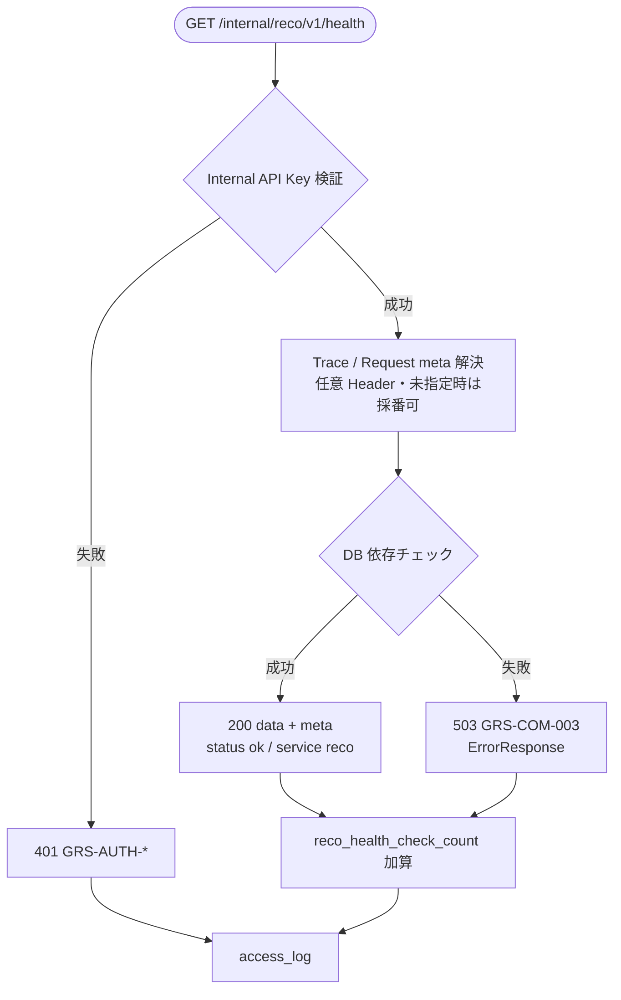

# Recoヘルスチェック API実装仕様書

> 本書は **API-INT-001** の **実装面** 正本である。
> 契約面（Request / Response / Error / Validation の定義）は `API-INT-001_RecoヘルスチェックAPI契約仕様書.md` を正とし、本書では再掲しない。
> OpenAPI 正本は `packages/contracts/openapi/internal-reco-api.yaml`（#414 / PR #415 develop merge 済み）。generated / Orval / apps 実装の変更は本 Task の out of scope。

## 1. ドキュメント情報

| 項目           | 内容                                      |
| -------------- | ----------------------------------------- |
| ドキュメントID | `API-INT-001-IMPLEMENTATION`              |
| ドキュメント名 | Recoヘルスチェック API実装仕様書          |
| 対象システム   | Gift Recommendation Service MVP（Internal） |
| MVP対象        | `○`                                       |
| 作成日         | 2026-07-12                                |
| 更新日         | 2026-07-12                                |

---

## 2. 前提契約

| 項目 | 内容 |
| ---- | ---- |
| 対象API ID | `API-INT-001` |
| API名 | Recoヘルスチェック |
| Method / Endpoint | `GET` `/internal/reco/v1/health` |
| API契約仕様書 | `docs/06_実装設計/api/API-INT-001_RecoヘルスチェックAPI契約仕様書.md` |
| OpenAPI定義 | `packages/contracts/openapi/internal-reco-api.yaml`（`operationId: getRecoHealth`） |
| Contract Gate | **契約仕様書確定済み**（#392 / PR #396 Epic Branch merge 済み）。OpenAPI 断片反映済み（#414 / PR #415 develop merge 済み） |

> 契約面の Request / Response schema、Validation ルール、Error 一覧は契約仕様書を参照する。本書では実装判断に必要なマッピング・接続・責務境界のみ記載する。

---

## 3. 実装方針

### 3.1 全体方針

| 観点 | 方針 |
| ---- | ---- |
| Provider | `apps/reco` エンドポイント層（`apps/reco/src/reco/api/**`） |
| Consumer | `apps/api`（MOD-API-005 Reco Client 等。本 Task では実装しない） |
| Web フレームワーク | **FastAPI**（Internal API。API設計方針書 §4.3 に整合） |
| 責務分離 | HTTP I/F（認証・Header 処理・依存チェック・Response 組立）をエンドポイント層に集約。**推薦パイプライン（MOD-RECO-001 等）は呼び出さない** |
| 契約との関係 | 成功時 Response / Error の外形は契約仕様書・OpenAPI 準拠 |
| 冪等性 | 副作用なし。同一 Request の繰り返し可 |
| 軽量性 | タイムアウト・依存チェックは最小。推薦計算・Embedding・Redis 必須チェックは行わない |

### 3.2 エンドポイント層の配置

API-INT-002 実装仕様書 §3.2 と同一ツリーを前提とし、health 専用 route を追加する。

```text
apps/reco/src/reco/api/
├── main.py                 # FastAPI app / lifespan（health router を include）
├── dependencies.py         # DI（health では Orchestrator 不要）
├── middleware/
│   └── trace_context.py    # X-Trace-Id / X-Request-Id をログコンテキストへ
├── routes/
│   ├── health.py           # GET .../health（本 API）
│   └── recommendations.py  # POST .../recommendations/run（API-INT-002）
├── schemas/                # Pydantic（契約準拠）
├── auth/
│   └── internal_api_key.py # X-Internal-Api-Key 検証
└── exception_handlers/
    └── reco_errors.py      # RecoError → HTTP + GRS-*
```

**レーン 0b 参照（事実）:** develop 上に `apps/reco/src/reco/api/routes/health.py` の最小実装が存在する（#1135 / PR #1136）。本 Task はその差分を変更しない。後続実装 Task で契約・OpenAPI・本書とのギャップを埋める。

### 3.3 DI / Composition 接続方針

| 項目 | 方針 |
| ---- | ---- |
| Orchestrator | **接続しない**（ヘルスチェックは推薦パイプライン外） |
| Composition | health ハンドラは `build_production_ports` / `RecommendationOrchestrator` を必須としない |
| DB セッション | 依存チェック用に DB connectivity probe のみ利用（接続文字列の実値はログ・Response に出さない） |
| Settings | `load_reco_settings()` 等で `DATABASE_URL` の有無を判定。未設定時の扱いは §4.2 |

### 3.4 認証（実装面）

| 項目 | 方針 |
| ---- | ---- |
| 方式 | `X-Internal-Api-Key` Header と環境変数 **`RECO_INTERNAL_API_KEY`** の **定数時間比較**（api / reco 同一値。API-INT-002 実装仕様書 §3.4 と同一） |
| 配置 | FastAPI `Depends(require_internal_api_key)`。route handler より前段 |
| 失敗 | 401 + `GRS-AUTH-001`（不正）/ `GRS-AUTH-004`（未指定）。Secret 非出力 |
| 403 | MVP reco 側では Key の有無・一致のみ。403（`GRS-AUTH-002`）は api 側事前検証または将来拡張 |

詳細は認証・認可方針書 §7.3、契約仕様書 §6.1・§8.2。

### 3.5 依存チェック（実装面）

契約仕様書 §7.3.1 の依存表を実装面で具体化する。

| 依存 | MVP | 実装方針 | 失敗時 |
| ---- | --- | -------- | ------ |
| DB | 必須 | `DATABASE_URL` 設定時は Postgres connectivity probe。未設定時はプロセス稼働のみ確認する scaffold probe（ローカル最小） | §4.2 の unavailable / 503 方針 |
| Redis | 任意 | チェックしてもよいが **結果に影響させない** | 無視 |
| Embedding | 対象外 | 呼び出さない | - |

---

## 4. 処理概要

### 4.1 処理フロー



### 4.2 処理詳細

1. **認証:** `X-Internal-Api-Key` を検証。失敗時は即 401。認証情報をログに出さない。
2. **meta 解決:** `X-Trace-Id` / `X-Request-Id` は任意。指定時は Response `meta` へ反映。未指定時はサーバ側で採番してよい（契約仕様書 §6.1・§6.6。API-INT-002 の必須 Header とは異なる）。
3. **依存チェック:** DB connectivity を確認（§3.5）。Redis / Embedding は必須としない。
4. **成功 Response:** `data.status: ok`、`data.service: reco`、任意で `version` / `checkedAt`。`meta.generatedAt` を付与可。
5. **失敗（依存不全）:** OpenAPI 準拠で **HTTP 503 + ErrorResponse**（`error.code: GRS-COM-003`）。Secret・接続文字列は出さない。
6. **想定外:** 500 + `GRS-COM-999` または `GRS-REC-002`（契約仕様書 §8.2）。
7. **メトリクス:** 処理完了時に `reco_health_check_count` を加算（成功 / 失敗を含む。実装詳細は §8）。
8. **access_log:** Request / Response の要約を記録（Key 実値は出さない）。

**503 の外形（OpenAPI 正）:** `packages/contracts/openapi/internal-reco-api.yaml` は 503 を `ErrorResponse` としている。契約仕様書 §7.3.1 の `data.status: unavailable` 記述との差分は §11 未決事項および Human Review 観点とする。後続実装 Task は **OpenAPI（ErrorResponse）を優先**する。

---

## 5. データ項目マッピング

### 5.1 Request Mapping

| Request項目 | 内部項目 / DTO | 変換内容 | 備考 |
| ----------- | -------------- | -------- | ---- |
| `X-Internal-Api-Key` | auth dependency 入力 | 定数時間比較 | Body なし |
| `X-Trace-Id`（任意） | `meta.traceId` / ログ context | 指定時は一致。未指定時は採番可 | API-INT-002 と異なり任意 |
| `X-Request-Id`（任意） | `meta.requestId` / ログ context | 同上 | 同上 |
| Path / Query / Body | - | なし | GET ヘルスチェック |

### 5.2 Response Mapping

| 内部項目 / DTO | Response項目 | 変換内容 | 備考 |
| -------------- | ------------ | -------- | ---- |
| 固定値 | `data.service` | `"reco"` | 必須 |
| DB probe 成功 | `data.status` | `"ok"` | HTTP 200 |
| app version 設定 | `data.version` | 文字列 | 任意。未設定可 |
| サーバ時刻 | `data.checkedAt` | ISO 8601 | 任意 |
| Trace meta | `meta.traceId` / `meta.requestId` | Header または採番値 | - |
| サーバ時刻 | `meta.generatedAt` | ISO 8601 | 任意 |
| DB probe 失敗 | `error.code` | `GRS-COM-003` | HTTP 503 ErrorResponse（OpenAPI） |
| auth 失敗 | `error.code` | `GRS-AUTH-001` / `GRS-AUTH-004` | HTTP 401 |

---

## 6. generated client 利用方針

| 項目 | 内容 |
| ---- | ---- |
| generated出力先 | `apps/api/src/generated/reco-client/` |
| client wrapper | `apps/api/src/infrastructure/reco-client/`（手書き wrapper） |
| 再生成コマンド | リポジトリ正本 `orval.config.ts` に従う |
| 検証コマンド | `apps/api` の typecheck（後続 Task） |

| 観点 | 方針 |
| ---- | ---- |
| reco 側 | FastAPI + Pydantic。generated は **使用しない**（Provider） |
| api 側 | Orval 生成の `getRecoHealth`（仮）を wrapper 経由で呼ぶ（Consumer）。generated 手動編集禁止 |
| 本 Task | OpenAPI / Orval / generated **変更なし** |
| 呼び出しタイミング | api 起動時・定期監視・レコメンド実行前の疎通確認（契約仕様書 §5）。Public API-PUB-001 とは別 I/F |

---

## 7. provider / consumer 実装影響

### 7.1 provider（apps/reco）

| 項目     | 内容                                  |
| -------- | ------------------------------------- |
| provider | `apps/reco` エンドポイント層          |
| 責務     | Internal HTTP 受付、認証、依存チェック、Response / Error 組立、trace 伝播、メトリクス |
| 影響有無 | `○`（エンドポイント層）               |
| 必要対応 | `GET /internal/reco/v1/health` ハンドラ、auth Depends、DB probe、Error mapper |

- `apps/reco/src/reco/application/**` は **変更しない**（親 Epic `forbidden_paths`）
- 推薦 Orchestrator を health 経路から呼び出さない
- レーン 0b 最小実装がある場合、後続実装 Task で契約・OpenAPI・本書との差分を解消する

### 7.2 consumer（apps/api）

| 項目     | 内容                                  |
| -------- | ------------------------------------- |
| consumer | `apps/api`（MOD-API-005 Reco Client） |
| 責務     | reco health の呼び出し、接続失敗の検知、後続処理（API-INT-002 等）の抑制判断 |
| 影響有無 | `○`（Phase4b 後続 Task。本 Task 外）  |
| 必要対応 | generated + wrapper 経由の GET、timeout、401/503 の内部ログ保持 |

- Public 向けにエラーを再整形する場合は API-PUB-* 実装仕様書側で扱う
- Internal の `GRS-*` は api 内部ログに保持する（契約仕様書 §8.2）

---

## 8. ログ・監視

| 種別 | 内容 | 出力タイミング | 備考 |
| ---- | ---- | -------------- | ---- |
| API access log | method / path / status / latency / traceId / requestId | Request 完了時 | Key 実値・接続文字列は出さない |
| error log | auth 失敗・依存不全・想定外 | 4xx/5xx 時 | `GRS-*` コードを記録 |
| audit log | なし（MVP ヘルスチェック） | - | - |
| metric | `reco_health_check_count` | ハンドラ完了時（成功・失敗） | API一覧の metric 対象。カウンタ加算の実装詳細は後続実装 Task |

| 項目 | 方針 |
| ---- | ---- |
| phase_log | **記録しない**（推薦 Run 外） |
| recommendation_run | **作成しない** |

---

## 9. 実装テスト観点

|  No | 観点 | 確認内容 | 種別 |
| --: | ---- | -------- | ---- |
| 1 | 正常系（結合） | 有効 Key + DB OK で 200、`data.status: ok`、`data.service: reco` | integration |
| 2 | auth error | Key 欠落・不正で 401（`GRS-AUTH-004` / `GRS-AUTH-001`） | integration |
| 3 | 依存失敗 | DB NG で 503 + `GRS-COM-003`（ErrorResponse） | integration |
| 4 | trace 伝播 | `X-Trace-Id` 指定時に `meta.traceId` 一致 | integration |
| 5 | 任意 Header | Trace/Request 未指定でも 200 可（採番） | integration |
| 6 | generated client | Orval 後、api 側型が Response と一致 | typecheck |
| 7 | provider / consumer | api wrapper が timeout・503 を安全に扱う | manual |
| 8 | 非機能 | ハンドラが Orchestrator / Embedding を呼ばないこと | unit |

> 契約面の単体テスト観点は契約仕様書 §12 を正とする。

---

## 10. 変更履歴

| 日付 | 変更内容 | 関連Issue / PR |
| ---- | -------- | -------------- |
| 2026-07-12 | 初版（実装面のみ。Phase4b 1/3） | #1148 |

---

## 11. 未決事項

|  No | 論点 | 判断が必要な理由 | 判断者 | 期限 | 備考 |
| --: | ---- | ---------------- | ------ | ---- | ---- |
| 1 | 503 時の外形（`data.status: unavailable` vs ErrorResponse） | 契約仕様書 §7.3.1 と OpenAPI 503=`ErrorResponse` に差がある | Human | 後続実装 Task 前 | 本書は OpenAPI 優先を推奨 |
| 2 | `DATABASE_URL` 未設定時の scaffold probe を本番相当環境で許可するか | ローカル最小と本番の差分 | Human | 後続実装 Task 前 | レーン 0b 最小実装に存在 |
| 3 | apps/api からの定期 health 呼び出し実装タイミング | MOD-API-005 実装 Task との順序 | Human | Phase4b 縦串中 | 本 Task 外 |

---

## 12. 関連資料

| 種別 | パス / URL | 用途 |
| ---- | ---------- | ---- |
| 契約仕様書 | `docs/06_実装設計/api/API-INT-001_RecoヘルスチェックAPI契約仕様書.md` | 前提契約 |
| 実装仕様書（参考） | `docs/06_実装設計/api/API-INT-002_Reco推薦実行API実装仕様書.md` | Internal API 実装スタイル |
| OpenAPI | `packages/contracts/openapi/internal-reco-api.yaml` | 機械可読契約 |
| API一覧 | `docs/05_アプリケーション設計/アプリ/api/API一覧.md` | endpoint / metric |
| エラーコード定義書 | `docs/05_アプリケーション設計/アプリ/エラーコード定義書.md` | GRS-* |
| ログ・Observability設計書 | `docs/05_アプリケーション設計/アプリ/ログ・Observability設計書.md` | access / metric |
| 認証・認可方針書 | `docs/05_アプリケーション設計/基盤/認証・認可方針書.md` | Internal Key |
| レーン 0b 最小実装（参照） | `apps/reco/src/reco/api/routes/health.py` | 現状ランタイム（本 Task では変更しない） |

---

## 13. レビュー観点

- 確定済みAPI契約（契約仕様書 / OpenAPI）と実装方針が整合している
- 処理フロー・内部DTOマッピングが明確である（推薦パイプライン非呼び出し）
- generated client を手動編集せず wrapper 経由で利用する方針である
- provider / consumer の実装影響が整理されている
- ログ・監視（`reco_health_check_count`）・結合テスト観点が整理されている
- secret や `.env` 実値が含まれていない
- 親 Epic `epic_scope`（`docs/06_実装設計/api/API-INT-001_*`、apps 実装なし）と差分が整合している

### Human Reviewで確認してほしいこと

1. 503 を OpenAPI どおり ErrorResponse（`GRS-COM-003`）とする方針でよいか（契約 §7.3.1 の `unavailable` 表記追随要否）
2. レーン 0b 最小実装を後続実装 Task で契約準拠へ寄せる範囲
3. apps/api 側 health 呼び出し（MOD-API-005）の実装タイミング

---

## 14. 備考

- 本 Task は Phase4b 縦串の **実装仕様書（1/3）**。後続は reco エンドポイント実装 Task → 単体テスト Task → Epic PR → develop（**PUB-001 より先**に merge）。
- develop merge 順は実装フェーズ並列計画（レーン 2）に従い、INT-001 → PUB-001 とする。
- レーン 0b（#1135）の最小 health はローカル疎通用であり、識別子 Epic 縦串の正本は本書および契約・OpenAPI とする。
