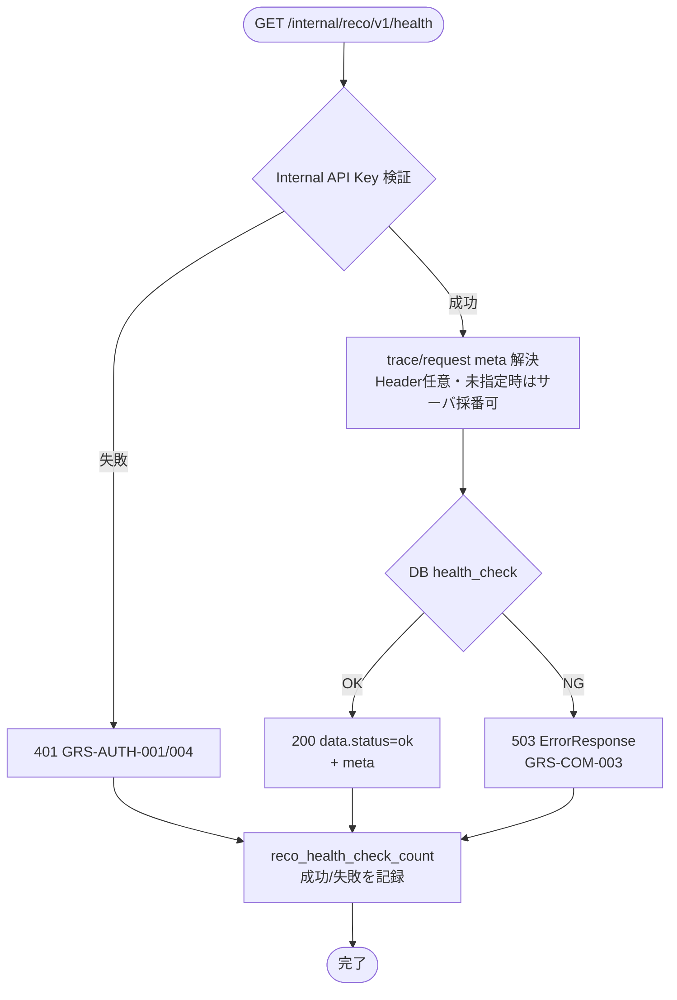

# Recoヘルスチェック API実装仕様書

> 本書は **API-INT-001** の **実装面** 正本である。
> 契約面（Request / Response / Error / Validation の定義）は `API-INT-001_RecoヘルスチェックAPI契約仕様書.md` を正とし、本書では再掲しない。
> OpenAPI 正本は `packages/contracts/openapi/internal-reco-api.yaml`（#414 / PR #415 develop 反映済み）。generated / Orval / apps 実装の本格整備は後続 Task。本書は docs のみ。

## 1. ドキュメント情報

| 項目           | 内容                                        |
| -------------- | ------------------------------------------- |
| ドキュメントID | `API-INT-001-IMPLEMENTATION`                |
| ドキュメント名 | Recoヘルスチェック API実装仕様書            |
| 対象システム   | Gift Recommendation Service MVP（Internal） |
| MVP対象        | `○`                                         |
| 作成日         | 2026-07-12                                  |
| 更新日         | 2026-07-12（Human Review 判断反映）         |

---

## 2. 前提契約

| 項目 | 内容 |
| ---- | ---- |
| 対象API ID | `API-INT-001` |
| API名 | Recoヘルスチェック |
| Method / Endpoint | `GET` `/internal/reco/v1/health` |
| API契約仕様書 | `docs/06_実装設計/api/API-INT-001_RecoヘルスチェックAPI契約仕様書.md` |
| OpenAPI定義 | `packages/contracts/openapi/internal-reco-api.yaml`（`operationId: getRecoHealth`） |
| Contract Gate | **契約仕様書確定済み**（#392 / PR #396）。**OpenAPI 断片反映済み**（#414 / PR #415 develop merge）。Orval / generated の全面追随は consumer 側 Task で確認 |

> 契約面の Request / Response schema、Validation、Error 一覧は契約仕様書を参照する。本書では実装判断に必要な処理フロー・マッピング・probe / 認証境界のみ記載する。

---

## 3. 実装方針

### 3.1 全体方針

| 観点 | 方針 |
| ---- | ---- |
| Provider | `apps/reco` エンドポイント層（`apps/reco/src/reco/api/**`） |
| Consumer | `apps/api`（MOD-API-005 Reco Client 等。本 Task では実装しない） |
| Web フレームワーク | **FastAPI** |
| 責務分離 | HTTP I/F（認証・Header 解決・DB probe・Response / Error 組立）のみ。推薦パイプライン（`application/**`）は呼び出さない |
| 冪等性 | 副作用なし。同一 Request の繰り返し可 |
| 軽量性 | タイムアウト短め・同期 probe のみ。Embedding / Redis / LLM はチェック対象外（契約仕様書 §7.3.1） |

### 3.2 エンドポイント層の配置

後続実装 Task の配置目安（#1135 で最小骨格が存在する。本仕様書を正として契約準拠へ揃える）:

```text
apps/reco/src/reco/api/
├── main.py                 # FastAPI app / router mount
├── auth/
│   └── internal_api_key.py # X-Internal-Api-Key 検証
├── middleware/
│   └── trace_context.py    # Header 定数（Trace / Request）
├── routes/
│   └── health.py           # GET .../health
├── schemas/                # 任意: Pydantic（成功 Response）
├── errors.py               # GRS-* → HTTP
└── exception_handlers/     # RecoApiError → ErrorResponse
```

`apps/reco/src/reco/application/**` および推薦ロジックは **変更しない**（親 Epic `forbidden_paths`）。

### 3.3 DI / 依存

| 項目 | 方針 |
| ---- | ---- |
| DB session | `PostgresDatabaseSession`（`DATABASE_URL` 設定時）。probe 専用の `health_check()` を呼ぶ |
| Settings | `load_reco_settings()` 等の既存 loader。Secret をログ・Response に出さない |
| Orchestrator / Composition | **使用しない**（ヘルスチェックは推薦実行外） |
| Redis / Embedding | **チェックしない**（契約上、結果に影響させない） |

### 3.4 認証（実装面）

| 項目 | 方針 |
| ---- | ---- |
| 方式 | `X-Internal-Api-Key` と環境変数 **`RECO_INTERNAL_API_KEY`** の **定数時間比較**（`hmac.compare_digest`） |
| 配置 | FastAPI `Depends(require_internal_api_key)`。handler より前段 |
| 未指定 / 環境変数未設定 | 401 + `GRS-AUTH-004` |
| 不正 | 401 + `GRS-AUTH-001` |
| Secret | ログ・error_log・Response に Key 実値を出さない |

詳細は認証・認可方針書、契約仕様書 §6.1・§8.2。API-INT-002 実装仕様書 §3.4 と同型。

### 3.5 DB probe（実装面）

| 条件 | 方針 |
| ---- | ---- |
| `DATABASE_URL` 設定あり | Postgres へ軽量 probe（例: `SELECT 1` 相当）。成功 → `ok`、失敗 → 503 |
| `DATABASE_URL` 未設定 | **本番 / staging では不可**（起動失敗または 503）。**local-dev のみ** scaffold probe を許容（#1135 互換。§11 判断確定） |
| Redis | 任意。結果に影響させない |
| probe タイムアウト | 短時間（目安 1s 以内）。実装 Task で定数化 |

**MVP 二値運用（契約確定）:** DB OK かつプロセス応答可 → `data.status: ok`（HTTP 200）。DB NG またはプロセス NG → HTTP **503**（下記 §7.3）。`degraded` は MVP では使用しない。

---

## 4. 処理概要

### 4.1 処理フロー



### 4.2 処理詳細

1. **認証:** `X-Internal-Api-Key` を検証。失敗時は即 401。Key をログに出さない。
2. **meta 解決:** `X-Trace-Id` / `X-Request-Id` は **任意**（契約・API一覧）。指定時は Response `meta` へ **一致反映**。未指定時はサーバ側で採番してよい（#1135 先行実装と同型。INT-002 の必須 Header とは異なる）。
3. **DB probe:** §3.5 に従い依存確認。Redis / Embedding はスキップ。
4. **成功 Response:** `data`（`status` / `service` / `version` / `checkedAt`）+ `meta`（`traceId` / `requestId` / `generatedAt`）。`service` は固定 `reco`。
5. **失敗 Response（依存不全）:** HTTP 503 + `ErrorResponse`（`error.code: GRS-COM-003`）。OpenAPI 正本に従う（§7.3）。
6. **想定外:** 500 + `GRS-COM-999` または `GRS-REC-002`。stack trace は Response に含めない。
7. **metric:** 処理完了時（成功・失敗とも）`reco_health_check_count` をインクリメント可能な形で記録（§8）。

---

## 5. データ項目マッピング

### 5.1 Request Mapping

| Request項目 | 内部項目 / DTO | 変換内容 | 備考 |
| ----------- | -------------- | -------- | ---- |
| （Body） | — | なし | GET。Body 不使用 |
| `X-Internal-Api-Key` | auth 検証入力 | Header → 定数時間比較 | 必須 |
| `X-Trace-Id` | `meta.trace_id` | 任意。未指定時サーバ採番可 | Response と一致 |
| `X-Request-Id` | `meta.request_id` | 任意。未指定時サーバ採番可 | Response と一致 |
| `Accept` | — | `application/json` 想定 | 厳密検証は実装 Task 任意 |

### 5.2 Response Mapping（成功・200）

| 内部項目 / DTO | Response項目 | 変換内容 | 備考 |
| -------------- | ------------ | -------- | ---- |
| 固定 | `data.status` | `"ok"` | MVP 成功時のみ |
| 固定 | `data.service` | `"reco"` | — |
| アプリ version | `data.version` | string | 未設定可 |
| probe 完了時刻 | `data.checkedAt` | ISO 8601 | reco 側生成 |
| trace | `meta.traceId` | Header または採番 | — |
| request | `meta.requestId` | Header または採番 | — |
| 生成時刻 | `meta.generatedAt` | ISO 8601 | 任意 |

### 5.3 Response Mapping（503・依存不全）

| 内部項目 | Response | 備考 |
| -------- | -------- | ---- |
| probe NG | HTTP 503 + `error.code: GRS-COM-003` + `error.message`（安全文）+ `meta` | OpenAPI `ErrorResponse` |
| — | `data` は **返さない** | 契約仕様書 §8.1 形式 |

---

## 6. generated client 利用方針

| 項目 | 内容 |
| ---- | ---- |
| generated出力先 | `apps/api/src/generated/reco-client/` |
| client wrapper | `apps/api/src/infrastructure/reco-client/` / `apps/api/src/lib/reco-client/` |
| 再生成コマンド | リポジトリ正本 `orval.config.ts` に従う |
| 検証コマンド | `apps/api` の typecheck / contract test |

| 観点 | 方針 |
| ---- | ---- |
| reco 側 | FastAPI。generated **不使用**（Provider） |
| api 側 | Orval 生成の `getRecoHealth` 相当を wrapper 経由で呼ぶ（Consumer）。手動編集禁止 |
| 本 Task | OpenAPI / Orval / generated **変更なし** |
| consumer 実装 | 本 Epic の後続または別 Task。Epic `allowed_paths` に reco-client は含まれるが、本 docs Task では触らない |

---

## 7. provider / consumer 実装影響

### 7.1 provider（apps/reco）

| 項目     | 内容 |
| -------- | ---- |
| provider | `apps/reco` エンドポイント層 |
| 責務     | GET health 受付、認証、DB probe、Response / Error 組立、trace 伝播、metric |
| 影響有無 | `○`（#1135 最小実装あり → 契約準拠への整備） |
| 必要対応 | `routes/health.py` の契約・OpenAPI 整合、metric 配線、local-dev scaffold / 本番 DB 必須の環境分岐 |

- `GET /internal/reco/v1/health` ハンドラ（既存最小実装を本仕様に追随）
- `require_internal_api_key` 再利用（INT-002 と同型）
- `application/**` は変更しない

### 7.2 consumer（apps/api）

| 項目     | 内容 |
| -------- | ---- |
| consumer | `apps/api`（MOD-API-005 Reco Client） |
| 責務     | 起動時・定期・レコメンド前の reco 疎通確認 |
| 影響有無 | `△`（呼び出し実装は **後続 Task**。本 Epic の reco エンドポイント実装 Task には含めない） |
| 必要対応 | generated `getRecoHealth` + wrapper、timeout、エラーの内部ログ保持（別 Task） |

- **scope 分割（§11 判断確定）:** reco エンドポイント実装 Task を先行し、apps/api consumer 配線は同一 Epic の後続 Task または別 Task とする
- api → reco の HTTP timeout は短め（health 用途）。具体値は apps/api 実装 Task
- Internal `GRS-AUTH-*` を Public へそのまま露出しない（必要なら Public 側でマスク）

### 7.3 エラーマップ・trace 伝播

#### 7.3.1 例外 → HTTP（reco エンドポイント層）

| 発生元 | 条件 | HTTP | `error.code` | Response |
| ------ | ---- | ---- | ------------ | -------- |
| auth | Key 不正 | 401 | `GRS-AUTH-001` | `{ error, meta }` |
| auth | Key 未指定 / 環境変数未設定 | 401 | `GRS-AUTH-004` | 同上 |
| DB probe | 接続不可 | 503 | `GRS-COM-003` | 同上（OpenAPI） |
| 想定外 | 捕捉不能例外 | 500 | `GRS-COM-999` / `GRS-REC-002` | stack trace 非露出 |
| **成功** | DB OK | **200** | — | `{ data, meta }`（error ではない） |

#### 7.3.2 503 の Response 形式（実装正）

| 正本 | 記載 | 実装への適用 |
| ---- | ---- | ------------ |
| OpenAPI（#414） | 503 → `ErrorResponse` | **実装はこれに従う** |
| 契約仕様書 §7.2 本文 | 「503 と `data.status: unavailable`」 | 散文上の表現。機械可読正本（OpenAPI）および §8（error 時は `data` なし）と併読し、**503 は ErrorResponse** とする |
| #1135 先行実装 | `raise reco_error_from_code("GRS-COM-003")` | OpenAPI 整合。後続実装 Task で維持 |

**Human Review 判断（§11）:** 503 の正本は **OpenAPI `ErrorResponse`** とする。契約 §7.2 の「`data.status: unavailable`」は散文上の表現であり、実装・UT は OpenAPI / §8（error 時は `data` なし）に従う。契約散文の追随は別 docs Task とする。

#### 7.3.3 trace_id / request_id 伝播

```text
（任意）api または呼び出し元が X-Trace-Id / X-Request-Id を付与
  → reco Header 受信（未指定時はサーバ採番可）
  → 構造化ログへバインド
  → Response meta.traceId / meta.requestId
```

| 観点 | 方針 |
| ---- | ---- |
| 指定時の一致 | Header 値と `meta` が異なる Response は bug |
| 未指定時 | サーバ採番して `meta` に載せてよい（INT-002 必須 Header とは異なる） |
| error 時 | 可能な範囲で `meta.traceId` / `meta.requestId` を付与 |
| Secret | Internal API Key をログに含めない |

---

## 8. ログ・監視

| 種別 | 内容 | 出力タイミング | 備考 |
| ---- | ---- | -------------- | ---- |
| API access log | reco health 受付・応答 | Request / Response | `trace_id`, `request_id`, HTTP status。Secret 除外 |
| error log | 認証失敗・probe 失敗・想定外 | 失敗時 | `service=reco`, `error_code=GRS-*` |
| audit log | MVP 対象外 | — | — |
| metric | **`reco_health_check_count`**（API一覧） | 処理完了時（成功・失敗） | ラベルに HTTP status または result（ok / auth_error / unavailable）を付与可能な設計とする |

phase_log（推薦パイプライン用）は **記録しない**。

---

## 9. 非機能（タイムアウト・リトライ）

| 項目 | 方針 |
| ---- | ---- |
| DB probe timeout | 短時間（目安 ≤ 1s）。実装 Task で定数化 |
| エンドポイント全体 | 軽量。推薦 hard timeout（4,000ms）とは別枠 |
| reco 側 retry | **行わない** |
| api 側 retry | 監視用途でのリトライは呼び出し側ポリシー。無限リトライ禁止 |
| 副作用 | なし（冪等） |

---

## 10. 実装テスト観点

|  No | 観点 | 確認内容 | 種別 |
| --: | ---- | -------- | ---- |
| 1 | 正常系 | 有効 Key + DB OK → 200、`data.status=ok`、`data.service=reco` | unit / integration |
| 2 | auth 欠落 | Key なし → 401 `GRS-AUTH-004` | unit |
| 3 | auth 不正 | Key 不一致 → 401 `GRS-AUTH-001` | unit |
| 4 | DB NG | probe 失敗 → 503 `GRS-COM-003`、`ErrorResponse`、`data` なし | unit / integration |
| 5 | trace 伝播 | `X-Trace-Id` 指定時に `meta.traceId` 一致 | unit |
| 6 | 冪等 | 連続呼び出しで副作用なし | unit |
| 7 | metric | 成功・失敗で `reco_health_check_count` が記録される（または記録境界のモック検証） | unit |
| 8 | Secret | ログ・Response に Key / `DATABASE_URL` 実値なし | manual / unit |
| 9 | generated client | Orval 後、api 側型が Response と一致（consumer Task） | typecheck |

> 契約面の schema 観点は契約仕様書 §12。本書は実装結合・unit 観点に限定する。

---

## 11. Human Review 判断事項

Human Review（PR #1150）にて推奨案を採用し、以下を **実装面の判断確定** とする。

|  No | 論点 | Human Review 判断 | 実装への適用 |
| --: | ---- | ----------------- | ------------ |
| 1 | `DATABASE_URL` 未設定時の scaffold probe 許容 | **本番 / staging は DB 必須**（未設定時は起動失敗または 503）。**local-dev のみ** scaffold probe を許容（#1135 互換） | §3.5 / §7.1。環境判定で probe 実装を分岐 |
| 2 | 契約 §7.2「`data.status: unavailable`」と OpenAPI 503 ErrorResponse の表現差 | **OpenAPI / §8 に合わせ `ErrorResponse` を正** とする。契約散文の追随は別 docs Task | §7.3.2。503 は `{ error, meta }` のみ。`data` は返さない |
| 3 | apps/api からの health 呼び出しを本 Epic 実装に含めるか | **reco エンドポイント実装を先行**し、apps/api consumer 配線は **後続 Task**（同一 Epic 内の別 Task 可） | §7.2 / §6。本 Epic の reco 実装 Task scope 外 |

---

## 12. 関連資料

| 種別 | パス / URL | 用途 |
| ---- | ---------- | ---- |
| 契約仕様書 | `docs/06_実装設計/api/API-INT-001_RecoヘルスチェックAPI契約仕様書.md` | 前提契約 |
| OpenAPI | `packages/contracts/openapi/internal-reco-api.yaml` | 機械可読契約 |
| API一覧 | `docs/05_アプリケーション設計/アプリ/api/API一覧.md` | endpoint / metric |
| エラーコード定義書 | `docs/05_アプリケーション設計/アプリ/エラーコード定義書.md` | GRS-* |
| ログ・Observability設計書 | `docs/05_アプリケーション設計/アプリ/ログ・Observability設計書.md` | access / metric |
| 認証・認可方針書 | `docs/05_アプリケーション設計/基盤/認証・認可方針書.md` | Internal Key |
| 参考実装仕様書 | `docs/06_実装設計/api/API-INT-002_Reco推薦実行API実装仕様書.md` | 同型 Internal 実装 |
| 先行実装 | `apps/reco/src/reco/api/routes/health.py`（#1135） | ギャップ確認用 |

---

## 13. レビュー観点

- 実装面に限定され、契約面の再掲が混入していない
- 契約仕様書・OpenAPI と矛盾しない（503 形式は OpenAPI 優先を明示）
- FastAPI / Internal API Key / DB probe 境界が明確
- `#1135` 先行実装とのギャップが Human Review 判断事項（§11）に明示されている
- provider / consumer 影響が整理されている
- `reco_health_check_count` の記録境界がある
- secret / `.env` 実値が含まれていない
- 後続 reco エンドポイント実装 Task / UT Task の入力として十分

---

## 14. 備考

- 本 Task は docs のみ。apps / OpenAPI / generated は変更しない。
- develop merge 順: **INT-001 Epic PR → PUB-001 Epic PR**（実装フェーズ並列計画）。
- 後続縦串: 実装 Task → 単体テスト Task → Epic PR → develop。
- Task Definition: `prompts/definitions/tasks/api-int-001-reco-health-check/api-implementation-spec.yaml`
- 関連 Issue: #1149 / 親 Epic #391

---

## 15. 変更履歴

| 日付 | 変更内容 | 関連Issue / PR |
| ---- | -------- | -------------- |
| 2026-07-12 | 初版（実装面のみ。Phase4b 1/3） | #1149 |
| 2026-07-12 | Human Review 判断反映（§11 推奨案確定、Mermaid 可読性改善） | #1149 / PR #1150 |
