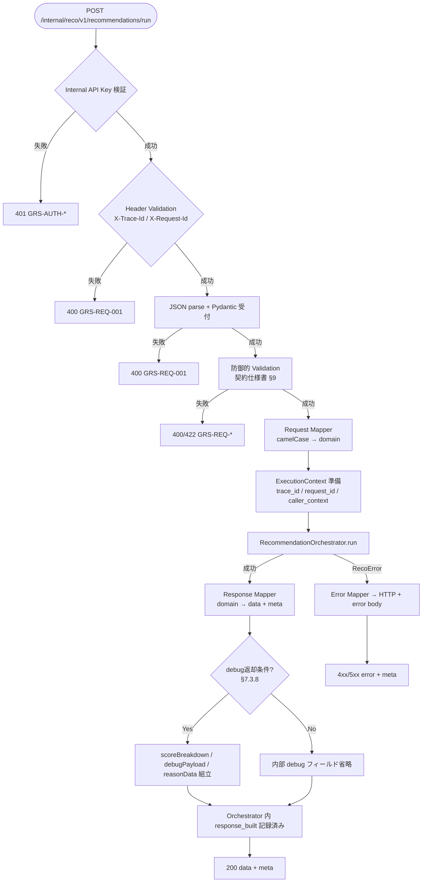

# Reco推薦実行 API実装仕様書

> 本書は **API-INT-002** の **実装面** 正本である。
> 契約面（Request / Response / Error / Validation の定義）は `API-INT-002_Reco推薦実行API契約仕様書.md` を正とし、本書では再掲しない。
> OpenAPI 正本は `packages/contracts/openapi/internal-reco-api.yaml`（別 Contract Task）。generated / Orval / apps 実装は本 Task の out of scope。

## 1. ドキュメント情報

| 項目           | 内容                                      |
| -------------- | ----------------------------------------- |
| ドキュメントID | `API-INT-002-IMPLEMENTATION`              |
| ドキュメント名 | Reco推薦実行 API実装仕様書                |
| 対象システム   | Gift Recommendation Service MVP（Internal） |
| MVP対象        | `○`                                       |
| 作成日         | 2026-07-09                                |
| 更新日         | 2026-07-09                                |

---

## 2. 前提契約

| 項目 | 内容 |
| ---- | ---- |
| 対象API ID | `API-INT-002` |
| API名 | Reco推薦実行 |
| Method / Endpoint | `POST` `/internal/reco/v1/recommendations/run` |
| API契約仕様書 | `docs/06_実装設計/api/API-INT-002_Reco推薦実行API契約仕様書.md` |
| OpenAPI定義 | `packages/contracts/openapi/internal-reco-api.yaml` |
| Contract Gate | **契約仕様書確定済み**（#368 / PR #372 Epic Branch merge 済み）。§14 spike（#373〜#376）および #764 Reason fallback 整合は契約仕様書に反映済み。OpenAPI への機械可読反映は **未完了**（別 Contract Task） |

> 契約面の Request / Response schema、Validation ルール、Error 一覧、§14 確定事項は契約仕様書を参照する。本書では実装判断に必要なマッピング・接続・責務境界のみ記載する。

---

## 3. 実装方針

### 3.1 全体方針

| 観点 | 方針 |
| ---- | ---- |
| Provider | `apps/reco` エンドポイント層（**新規** `apps/reco/src/reco/api/**`） |
| Consumer | `apps/api`（MOD-API-005 Reco Client 等。本 Task では実装しない） |
| Web フレームワーク | **FastAPI**（Internal API。API設計方針書 §4.3、Recoモジュール一覧に整合） |
| 責務分離 | HTTP I/F（認証・Validation・DTO 変換・Response 組立）をエンドポイント層に集約。推薦パイプライン制御は **MOD-RECO-001** に委譲 |
| 契約との関係 | Response / Error の **外形** は契約仕様書準拠。内部は domain 型（snake_case）→ API DTO（camelCase）で変換 |
| 非冪等性 | 同一 `recommendationRequestId` の再 POST は新規 Run として扱う（契約仕様書 §4） |

### 3.2 エンドポイント層の配置（新規）

現状 `apps/reco/src/reco/api/**` および FastAPI エントリポイントは **未実装**。後続 reco エンドポイント実装 Task の配置目安:

```text
apps/reco/src/reco/api/
├── main.py                 # FastAPI app / lifespan
├── dependencies.py         # DI: Orchestrator, composition, auth
├── middleware/
│   └── trace_context.py    # X-Trace-Id / X-Request-Id をログコンテキストへ
├── routes/
│   └── recommendations.py  # POST .../recommendations/run
├── schemas/                # Pydantic（契約準拠。OpenAPI 追従は別 Task）
├── mappers/
│   ├── request_mapper.py   # API DTO → domain RecommendationRequest
│   └── response_mapper.py  # domain RecommendationResult → API Response
├── auth/
│   └── internal_api_key.py # X-Internal-Api-Key 検証
└── exception_handlers/
    └── reco_errors.py      # RecoError / Validation → HTTP + GRS-*
```

### 3.3 DI / Composition 接続方針

| 項目 | 方針 |
| ---- | ---- |
| Composition 正本 | `apps/reco/src/reco/composition/`（`builder.py`, `config.py`） |
| 本番 DI 関数 | `build_production_ports()` — Postgres 観測系（Run Recorder / Phase Log / Error Log / Metric Logger Tier 1）を配線 |
| モード選択 | `build_composition_ports(CompositionMode.PRODUCTION)` を **固定**（本番 / staging / ローカル docker compose 含む） |
| 開発・単体 | `CompositionMode.DEFAULT`（`build_default_stub_ports()`）は **Orchestrator 単体テストおよび DI 明示注入時のみ**。環境変数でのランタイム切替は MVP では導入しない（Human Review #1091 確定） |
| Orchestrator | `RecommendationOrchestrator(ports=...)` を lifespan で 1 インスタンス生成し、リクエストごとに `run()` を呼び出す |
| DB URL | `resolve_database_url()`（環境変数 `DATABASE_URL`）。Secret はログ・Response に出力しない |

**根拠:** MOD-RECO-001 §8.4.4、Composition Epic #1076（PR #1088 develop merge 済み）。MVP オンライン推薦は Postgres 観測（phase_log / error_log / recommendation_run）が前提。

### 3.4 認証（実装面）

| 項目 | 方針 |
| ---- | ---- |
| 方式 | `X-Internal-Api-Key` Header と環境変数 **`RECO_INTERNAL_API_KEY`** の **定数時間比較**（api / reco 同一値。Human Review #1091 確定） |
| 配置 | FastAPI `Depends` または middleware。route handler より前段 |
| 失敗 | 401 + `GRS-AUTH-001`（不正）/ `GRS-AUTH-004`（未指定）。`error_log` に記録（Secret 非出力） |
| 403 | MVP reco 側では Key の有無のみ。403（`GRS-AUTH-002` 等）は api 側事前検証または将来拡張。reco は Key 不一致を 401 に集約 |

詳細は認証・認可方針書 §7.3、契約仕様書 §6.1・§8.2.1。

---

## 4. 処理概要

### 4.1 処理フロー



### 4.2 処理詳細

1. **認証:** `X-Internal-Api-Key` を検証。失敗時は即 401。認証情報をログに出さない。
2. **Header 検証:** `X-Trace-Id` / `X-Request-Id` 必須・非空。`Content-Type` / `Accept` が `application/json` であることを確認。
3. **Body 受付:** JSON パース。ルート `recommendationRequestId` + `recommendationRequest` を Pydantic schema で受ける。
4. **防御的 Validation:** api 正規化済みを前提に、契約仕様書 §9 の必須・値域・`configName`/`versionLabel` セット整合を reco 側で再確認。
5. **Request マッピング:** camelCase API DTO → `RecommendationRequest`（domain, snake_case）。`recommendationRequestId` は domain `request_id` へ。
6. **Orchestrator 呼び出し:** `RecommendationOrchestrator.run(recommendation_request, trace_id=..., caller_context={request_id, ...})`。composition は `CompositionMode.PRODUCTION`。
7. **Outcome 分岐:** `OrchestratorOutcome.success=true` なら Response 組立。`reco_error` ありなら Error Mapper へ。
8. **Response 組立:** domain `RecommendationResult` および ExecutionContext 付帯情報から `data` + `meta` を生成。0 件時は `resultStatus: completed`、`resultItemCount: 0`、`meta.resultCode: GRS-REC-001`。
9. **debug 露出:** `execution.mode=evaluation` OR `includeDebugInfo=true` のときのみ `scoreBreakdown` / `metadata.debugPayload` / `reasonData` を組立（推奨。欠落時も 200）。
10. **phase_log:** `request_received` 〜 `reason_generated` および **`response_built` は Orchestrator 終了時に記録**（エンドポイント層では二重記録しない）。HTTP 受付・応答は access log。
11. **trace 反映:** Response `meta.traceId` / `meta.requestId` を Request Header と **完全一致** させる。

---

## 5. データ項目マッピング

### 5.1 Request Mapping

| Request項目（API / camelCase） | 内部項目 / DTO（domain / snake_case） | 変換内容 | 備考 |
| ------------------------------ | ------------------------------------- | -------- | ---- |
| `recommendationRequestId` | `RecommendationRequest.request_id` | 文字列そのまま | Body ルート。domain 集約 ID |
| `recommendationRequest.relationship.*` | `relationship: RelationshipCondition` | ネストオブジェクト → dataclass | `relationshipCode` → `relationship_code` |
| `recommendationRequest.occasion.*` | `occasion: OccasionCondition` | 同上 | `occasionCode` → `occasion_code` |
| `recommendationRequest.budget.*` | `budget: BudgetCondition` | 同上 | `budgetMin` → `budget_min` 等 |
| `recommendationRequest.preferredCondition.*` | `preferred_condition` | 同上 | keywords は `tuple[str, ...]` |
| `recommendationRequest.nonPreferredCondition.*` | `non_preferred_condition` | 同上 | - |
| `recommendationRequest.ngCondition.*` | `ng_condition` | 同上 | - |
| `recommendationRequest.freeText` | `free_text` | 文字列 | - |
| `recommendationRequest.execution.mode` | `execution.mode` → `ExecutionMode` | enum 変換 | `ui` / `evaluation` / `batch` |
| `recommendationRequest.execution.topK` | `execution.top_k` | integer | 未指定時 ui デフォルト 10 |
| `recommendationRequest.execution.candidateLimit` | `execution.candidate_limit` | integer | 未指定時 ui デフォルト 50 |
| `recommendationRequest.execution.includeReason` | `execution.include_reason` | boolean | - |
| `recommendationRequest.execution.includeDebugInfo` | `execution.include_debug_info` | boolean | debug返却条件の入力 |
| `recommendationRequest.execution.evalCaseId` | `execution.eval_case_id` | string | evaluation mode |
| `recommendationRequest.execution.configName` | `execution.config_name` | string | MOD-RECO-003 入力（composite） |
| `recommendationRequest.execution.versionLabel` | `execution.version_label` | string | 同上 |
| `recommendationRequest.execution.modelVersionId` | `execution.model_version_id` | string | 評価・再現用 |
| `X-Trace-Id` | `ExecutionContext.trace_id` / Orchestrator `trace_id` 引数 | Header → context | Response `meta` と一致必須 |
| `X-Request-Id` | `caller_context["request_id"]` | Header → context | ログバインド用 |

正本: Recommendation Request 定義書 §6、契約仕様書 §6.4.2。

### 5.2 Response Mapping

| 内部項目 / DTO（domain / 中間） | Response項目（API / camelCase） | 変換内容 | 備考 |
| ------------------------------- | ------------------------------- | -------- | ---- |
| `RecommendationResult.run_id` | `data.recommendationRunId` | string | MOD-RECO-002 生成 |
| `RecommendationResult.result_id`（または同等） | `data.recommendationResultId` | string | Result Builder 出力 |
| `RecommendationRequest.request_id` | `data.recommendationRequestId` | string | Request と一致 |
| `RecommendationResult.result_status` | `data.resultStatus` | enum → string | `completed` / `partial` / `completed_with_fallback`。0 件も `completed` |
| `execution.top_k` | `data.topK` | integer | Request 反映 |
| `len(items)` | `data.resultItemCount` | integer | 0 件時 `0` |
| fallback 有無 | `data.fallbackUsed` | boolean | Ranking / Reason fallback 集約 |
| 候補数（ExecutionContext） | `data.candidateCounts.*` | object | `retrievalCount` / `matchingCount` / `rankingCount` |
| パイプライン警告 | `data.warnings[]` | `WarningItem[]` | 内部コード → 契約 `code`（§7.3.7） |
| Metric 集計 | `data.metricSummary` | object | §7.3.5 |
| Reason 詳細（Run 単位） | `data.reasonData` | object | debug返却条件時推奨 |
| Item 配列 | `data.resultItems[]` | array | **契約上 `resultItems`**（OpenAPI `items` との差は §6 参照） |
| `RecommendationResultItem.*` | `resultItems[].*` | Item 単位 camelCase | snapshot / score / reason 各フィールド |
| `score_breakdown` | `resultItems[].scoreBreakdown` | object | debug返却条件時推奨 |
| `debug_payload` | `data.metadata.debugPayload` | object | Run 単位 open object |
| `execution.mode` | `data.metadata.mode` | string | - |
| Header `X-Trace-Id` | `meta.traceId` | そのまま | 必須 |
| Header `X-Request-Id` | `meta.requestId` | そのまま | 必須 |
| 0 件判定 | `meta.resultCode` | `GRS-REC-001` | HTTP 200 正常系 |
| 生成時刻 | `meta.generatedAt` | ISO 8601 | 任意 |

**Reason fallback（MOD-RECO-001 §10.3）:** Orchestrator が注入した汎用 Reason は `reasonSummary`（非空）、`reasonStatus: completed`、`isFallback: true` として Item にマッピングする。

**OpenAPI 差分:** 現行 `internal-reco-api.yaml` は成功 Response の Item 配列を `data.items` と定義している。実装および api consumer は **契約仕様書の `data.resultItems`** を正とする（§6）。

---

## 6. generated client 利用方針

| 項目 | 内容 |
| ---- | ---- |
| generated出力先 | `apps/api/src/generated/reco-client/` |
| client wrapper | `apps/api/src/infrastructure/reco-client/`（手書き wrapper。現状 `ScaffoldRecoClient` は Phase4a placeholder） |
| 再生成コマンド | リポジトリ正本 `orval.config.ts` に従う（例: `pnpm exec orval --config orval.config.ts`） |
| 検証コマンド | `apps/api` の typecheck / contract test（OpenAPI Contract Task 完了後） |

| 観点 | 方針 |
| ---- | ---- |
| reco 側 | FastAPI + Pydantic。generated は **使用しない**（Provider） |
| api 側 | Orval 生成関数を wrapper 経由で呼ぶ（Consumer）。generated 手動編集禁止 |
| 本 Task | OpenAPI / Orval / generated **変更なし**。wrapper 実装は apps/api 実装 Task |
| 次 Task | **#1091 merge 後**、reco エンドポイント実装 Task **直前**に OpenAPI Contract Task を Epic Branch 上で実施（Human Review #1091 確定。引継ぎ: `ai-logs/cross-cutting/2026-07-09-api-int-002-openapi-contract-task-handover.md`） |

**既知の OpenAPI ↔ 契約差分（Contract Task で解消予定）**

| 項目 | 契約仕様書（正） | OpenAPI（現状） | 対応 |
| ---- | ---------------- | --------------- | ---- |
| Item 配列キー | `data.resultItems` | `data.items` | Contract Task で YAML 更新。暫定は wrapper でマッピング |
| `warnings` | `WarningItem[]` | `string[]` | 同上 |
| `resultStatus` 0件 | `completed` | enum に `empty` あり | 実装は `completed` + `resultItemCount: 0` |

---

## 7. provider / consumer 実装影響

### 7.1 provider（apps/reco）

| 項目     | 内容                                  |
| -------- | ------------------------------------- |
| provider | `apps/reco` エンドポイント層          |
| 責務     | Internal HTTP 受付、認証、Validation、DTO↔domain 変換、Orchestrator 起動、Response / Error 組立、trace 伝播 |
| 影響有無 | `○`（**新規実装**）                   |
| 必要対応 | FastAPI app 新規、route / mapper / auth / exception handler、composition PRODUCTION 接続 |

- `POST /internal/reco/v1/recommendations/run` ハンドラ新規
- `RecommendationOrchestrator` + `build_composition_ports(PRODUCTION)` DI
- 契約仕様書 §7.3.8 debug返却条件に基づく Response フィルタ
- `SCORE_BREAKDOWN_MISSING` 相当の内部ログ（欠落時 200 維持）
- 既存 `application/**` / `composition/**` は **変更しない**（エンドポイント層から呼び出すのみ）

### 7.2 consumer（apps/api）

| 項目     | 内容                                  |
| -------- | ------------------------------------- |
| consumer | `apps/api`（MOD-API-005 Reco Client） |
| 責務     | Public API 受付後、正規化済み Request を reco へ POST。Internal Response を Public 形式へ変換 |
| 影響有無 | `○`（Phase4b 後続 Task）              |
| 必要対応 | `ScaffoldRecoClient` → generated + wrapper 置換、Header 付与、Public フィルタ、§8.2.1 認証エラーマップ |

- Internal Response から Public 非表面化: `scoreBreakdown`, `contextScore`, `finalScore`, `reasonData`, `metadata.debugPayload`, `warnings`, `metricSummary` 等（API設計方針書 §21.3）
- reco からの `GRS-AUTH-*` → Public **500 + `GRS-REC-002`**（契約仕様書 §8.2.1）
- api 側 timeout は reco hard timeout（8,000ms）以上を確保

### 7.3 エラーマップ・trace 伝播

#### 7.3.1 ドメイン例外 → HTTP（reco エンドポイント層）

| 発生元 | 条件 | HTTP | `error.code` | Response |
| ------ | ---- | ---- | ------------ | -------- |
| auth | Key 不正 | 401 | `GRS-AUTH-001` | `{ error, meta }` |
| auth | Key 未指定 | 401 | `GRS-AUTH-004` | 同上 |
| Validation | 契約 §9 違反 | 400 | `GRS-REQ-001` | 同上 |
| Validation | 未対応条件 | 422 | `GRS-REQ-002` / `GRS-REQ-006` | 同上 |
| Orchestrator | `RecoError`（パイプライン失敗） | 500 / 502 / 504 / 409 / 503 | `GRS-REC-*` / `GRS-DB-*` / `GRS-LLM-*` / `GRS-COM-003` | エラーコード定義書に従い HTTP を決定 |
| Orchestrator | hard timeout | 504 | `GRS-REC-101` | MOD-RECO-001 §13.2（8,000ms） |
| 想定外 | 捕捉不能例外 | 500 | `GRS-REC-999` | stack trace は Response に含めない |
| **正常 0件** | 候補 0 | **200** | —（`meta.resultCode: GRS-REC-001`） | **error ではない** |

`RecoError` → HTTP Status の対応表の正本はエラーコード定義書および契約仕様書 §8.1。実装は `GRS-REC-002`〜`013` を module / phase から引き継ぐ。

#### 7.3.2 trace_id / request_id 伝播

```text
api 生成 X-Trace-Id / X-Request-Id
  → reco Header 受信
  → 構造化ログ（trace_id, request_id 必須バインド）
  → ExecutionContext / Orchestrator
  → phase_log / error_log / metric（025）
  → Response meta.traceId / meta.requestId（Header と一致）
```

| 観点 | 方針 |
| ---- | ---- |
| 不一致 | Header と `meta` が異なる Response は **bug**（結合テストで検証） |
| error 時 | 失敗 Response でも `meta.traceId` / `meta.requestId` は必須 |
| Secret | Internal API Key は trace ログ・error_log に含めない |

---

## 8. ログ・監視

| 種別           | 内容                   | 出力タイミング                | 備考                        |
| -------------- | ---------------------- | ----------------------------- | --------------------------- |
| API access log | reco エンドポイント受付・応答（構造化） | Request 受信 / Response 返却 | `trace_id`, `request_id`, `recommendation_run_id`, HTTP status。Secret 除外 |
| error log      | 認証失敗・Validation・`RecoError` | 失敗時 | `MOD-RECO-029` 経由。`service=reco`, `error_code=GRS-*` |
| audit log      | MVP 対象外 | — | Internal API はシステム間通信 |
| metric         | `recommendation_latency_ms`, phase duration, 候補数系列 | Run 完了時 | `MOD-RECO-025` + Response Transient `metricSummary` |

### 8.1 phase_log 書き込み境界

| phase_name | 責務 | 記録主体 |
| ---------- | ---- | -------- |
| `request_received` | リクエスト受付 | Orchestrator 開始時（既存） |
| `config_resolved` 〜 `reason_generated` | パイプライン各フェーズ | 各 MOD-RECO-* / Orchestrator（既存） |
| `response_built` | パイプライン完了（Response 生成完了） | **Orchestrator 終了時のみ**（エンドポイント層では記録しない。Human Review #1091 確定） |

Phase 名一覧の正本: ログ・Observability設計書 §10.3。

### 8.2 MVP `warnings` 発火閾値（実装面）

契約仕様書 §7.3.6 のコードに対する MVP 初期閾値（Human Review #1091 確定）。定数は実装 Task でモジュール集約し、C4 reco-quality 後に調整可。

| code | 発火条件（MVP） |
| ---- | --------------- |
| `LOW_CANDIDATES_AFTER_MATCHING` | `matchingCount >= 1` **かつ** `matchingCount < min(topK, 5)`（`topK` は Request `execution.topK`、未指定時 ui デフォルト 10） |
| `FEATURE_DISTRIBUTION_SKEW` | `metricSummary.featureDistribution` の **いずれか 1 次元**で `mean > 0.85` **または** `mean < 0.15` |

`NO_CANDIDATES_AFTER_RETRIEVAL` は Retrieval 後 0 件（契約 §7.4.2）。閾値不要。

### 8.3 debug 欠落時の内部記録

| 条件 | 記録 | HTTP |
| ---- | ---- | ---- |
| debug返却条件を満たすが `scoreBreakdown` / `debugPayload` 欠落 | `SCORE_BREAKDOWN_MISSING` 相当を phase_log / error_log | **200 維持** |
| `warnings[]` | **載せない** | 契約仕様書 §7.3.8（#375 確定） |

---

## 9. 非機能（タイムアウト・リトライ）

| 項目 | 方針 |
| ---- | ---- |
| reco パイプライン hard timeout | **8,000ms**（MOD-RECO-001 §13.2 本番主経路 / #1748 → `GRS-REC-101` / HTTP 504） |
| api → reco HTTP timeout | reco hard timeout **以上**（既定 9,000ms。`DEFAULT_RECO_REQUEST_TIMEOUT_MS`） |
| reco エンドポイント retry | **行わない**（同一 Request の再 POST は新規 Run） |
| api 側 retry | 安易な自動再実行禁止。冪等でないためユーザー操作または明示ポリシーのみ |
| 同時実行 | MVP では Run 単位独立。`GRS-REC-201` は状態競合時のみ |

---

## 10. 実装テスト観点

|  No | 観点                | 確認内容                          | 種別        |
| --: | ------------------- | --------------------------------- | ----------- |
|   1 | 正常系（結合）      | 必須 Header + Body → 200、`resultItems` ≥1、内部スコア項目あり、Orchestrator 実パイプライン（PRODUCTION composition） | integration |
|   2 | 0件正常系           | 200、`resultItems: []`、`resultItemCount: 0`、`meta.resultCode: GRS-REC-001`、`warnings` に `NO_CANDIDATES_AFTER_RETRIEVAL` 可 | integration |
|   3 | unexpected error    | パイプライン致命失敗 → 500 系 + `error.code`、Response に stack trace なし | integration |
|   4 | 外部依存失敗        | LLM / DB 障害シミュレーション → 502/503/504 + 適切 `GRS-*` | integration |
|   5 | generated client    | OpenAPI Contract Task 完了後、api reco-client 型と Request/Response 一致 | typecheck   |
|   6 | provider / consumer | trace Header ↔ `meta` 一致、api Public 非表面化、§8.2.1 認証マップ | manual / e2e |
|   7 | auth                | Key 欠落・不正 → 401 `GRS-AUTH-*` | integration |
|   8 | Validation          | 必須欠落 → 400 `GRS-REQ-001` | integration |
|   9 | debug返却条件       | evaluation / includeDebugInfo=true で scoreBreakdown 推奨。欠落時 200、`warnings` 非追加 | integration |
|  10 | Reason fallback     | Reason のみ失敗 → Item 存続、`reasonSummary` 非空、`isFallback: true`、`reasonStatus: completed` | integration |
|  11 | Composition DI      | PRODUCTION mode で Postgres 観測（phase_log 等）が記録される | integration |

> 契約面の単体テスト観点（validation / auth / Request・Response schema）は契約仕様書 §12 を参照。

---

## 11. 変更履歴

| 日付 | 変更内容 | 関連Issue / PR |
| ---- | -------- | -------------- |
| 2026-07-09 | 初版（実装面のみ。契約仕様書 #368 / Composition #1076 を前提） | #1091 |
| 2026-07-09 | Human Review 確定：§12 未決事項 5 件を確定（§3.3 / §3.4 / §8.1 / §8.2 反映） | #1091 |

---

## 12. 未決事項

本節の論点は Human Review（#1091）で確定済み。判断記録の正本は `ai-logs/human-decisions/2026-07-09-api-int-002-implementation-spec-human-review-decisions.md`。

### 12.1 確定済み（本書へ反映済み）

| No | 論点 | 確定内容 | 反映箇所 |
| --: | ---- | -------- | -------- |
| 1 | デフォルト `CompositionMode` | **PRODUCTION 固定**。環境変数切替は MVP 非導入。`DEFAULT` は単体テスト DI のみ | §3.3 |
| 2 | `response_built` 記録主体 | **Orchestrator 終了時に一本化**。エンドポイント層は access log のみ | §4.1 / §4.2 / §8.1 |
| 3 | Internal API Key 環境変数名 | **`RECO_INTERNAL_API_KEY` 確定**（Header `X-Internal-Api-Key`） | §3.4 |
| 4 | OpenAPI 差分修正タイミング | **#1091 merge 後**、reco エンドポイント実装 Task **直前**に Contract Task 実施 | §6、引継ぎメモ（cross-cutting） |
| 5 | `warnings` 発火閾値 | `LOW_CANDIDATES`: `matchingCount >= 1` かつ `< min(topK, 5)` / `SKEW`: feature `mean > 0.85` or `< 0.15` | §8.2 |

### 12.2 未決（人間判断待ち）

（現時点、未決事項なし）

---

## 13. 関連資料

| 種別 | パス / URL | 用途 |
| ---- | ---------- | ---- |
| 契約仕様書 | `docs/06_実装設計/api/API-INT-002_Reco推薦実行API契約仕様書.md` | 前提契約 |
| Orchestrator | `docs/06_実装設計/reco/MOD-RECO-001_Recommendation Orchestratorモジュール仕様書.md` | 呼び出し I/F・Reason fallback |
| API設計方針 | `docs/05_アプリケーション設計/アプリ/api/API設計方針書.md` | Internal API パターン |
| エラーコード | `docs/05_アプリケーション設計/アプリ/エラーコード定義書.md` | GRS-* マップ |
| Observability | `docs/05_アプリケーション設計/アプリ/ログ・Observability設計書.md` | trace / phase_log / metric |
| 認証 | `docs/05_アプリケーション設計/基盤/認証・認可方針書.md` | Internal API Key |
| Request 定義 | `docs/04_ドメインモデル設計/RecommendationRequest定義書.md` | domain マッピング |
| Result 定義 | `docs/04_ドメインモデル設計/RecommendationResult定義書.md` | Response マッピング |
| Composition 実装 | `apps/reco/src/reco/composition/builder.py` | `build_production_ports` |
| Orchestrator 実装 | `apps/reco/src/reco/application/recommendation-orchestrator/` | `RecommendationOrchestrator.run` |
| OpenAPI | `packages/contracts/openapi/internal-reco-api.yaml` | generated 入力（差分あり） |
| Human 判断 | `ai-logs/human-decisions/2026-06-05-api-int-002-internal-401-public-map-policy.md` | Public 認証マップ |
| Human 判断 | `ai-logs/human-decisions/2026-06-05-api-int-002-score-breakdown-debug-return-policy.md` | debug 返却条件 |
| Human 判断 | `ai-logs/human-decisions/2026-07-09-api-int-002-implementation-spec-human-review-decisions.md` | 本書 §12 確定事項 |
| 引継ぎ | `ai-logs/cross-cutting/2026-07-09-api-int-002-openapi-contract-task-handover.md` | OpenAPI Contract Task（#1091 後続） |

---

## 14. レビュー観点

- 契約仕様書を前提とし、契約面（Request/Response/Error の再掲）が混入していないか
- エンドポイント層と MOD-RECO-001 の責務境界が明確か
- `build_composition_ports` / `build_production_ports` / `CompositionMode.PRODUCTION` 接続方針が明確か
- Request / Response の domain ↔ API マッピングが後続実装 Task の入力として十分か
- エラーマップ・trace 伝播がエラーコード定義書・ログ設計書と整合しているか
- debug返却条件・Reason fallback・0 件正常系の実装方針が契約仕様書 §7.3 / §7.4 と一致しているか
- provider（apps/reco）/ consumer（apps/api）の実装影響が整理されているか
- OpenAPI 差分が明示され、本 Task で YAML 変更していないことが明確か
- §12 確定事項が §3 / §8 と矛盾していないか
- secret、API キー、`.env` 実値が含まれていないか

---

## 15. 備考

- 本書は Phase4b 縦串（実装仕様書 → reco エンドポイント実装 → 単体テスト）の **1/3** である。
- 親 Epic Issue #366 / Branch `feature/epic-366-api-int-002-reco-recommendation-run`。Task PR は親 Epic Branch を target とする。
- reco エンドポイント層は現時点 **未実装**。MOD-RECO-001 Composition（#1076 / PR #1088）完了により Orchestrator 側の配線は利用可能。
- domain `RecommendationResult`（`apps/reco/src/reco/domain/recommendation/result.py`）は Phase4a scaffold。実 Response マッピングは Result Builder（MOD-RECO-021）出力構造を正とし、実装 Task で domain 拡張との整合を確認する。
