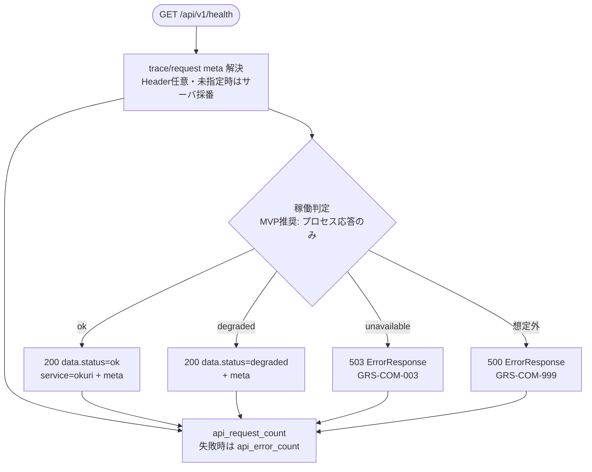

# APIヘルスチェック API実装仕様書

> 本書は **API-PUB-001** の **実装面** 正本である。
> 契約面（Request / Response / Error / Validation の定義）は `API-PUB-001_APIヘルスチェックAPI契約仕様書.md` を正とし、本書では再掲しない。
> OpenAPI 正本は `packages/contracts/openapi/public-api.yaml`（#412 / PR #413 develop 反映済み）。generated / Orval / apps 実装の本格整備は後続 Task。本書は docs のみ。

## 1. ドキュメント情報

| 項目           | 内容                                      |
| -------------- | ----------------------------------------- |
| ドキュメントID | `API-PUB-001-IMPLEMENTATION`              |
| ドキュメント名 | APIヘルスチェック API実装仕様書           |
| 対象システム   | Gift Recommendation Service MVP（Public） |
| MVP対象        | `○`                                       |
| 作成日         | 2026-07-12                                |
| 更新日         | 2026-07-12                                |

---

## 2. 前提契約

| 項目 | 内容 |
| ---- | ---- |
| 対象API ID | `API-PUB-001` |
| API名 | APIヘルスチェック |
| Method / Endpoint | `GET` `/api/v1/health` |
| API契約仕様書 | `docs/06_実装設計/api/API-PUB-001_APIヘルスチェックAPI契約仕様書.md` |
| OpenAPI定義 | `packages/contracts/openapi/public-api.yaml`（`operationId: getApiHealth`） |
| Contract Gate | **契約仕様書確定済み**（#395 / PR #398）。**OpenAPI 断片反映済み**（#412 / PR #413 develop merge）。Orval / generated の全面追随は consumer 側 Task で確認 |

> 契約面の Request / Response schema、Validation、Error 一覧は契約仕様書を参照する。本書では実装判断に必要な処理フロー・マッピング・稼働判定境界のみ記載する。

---

## 3. 実装方針

### 3.1 全体方針

| 観点 | 方針 |
| ---- | ---- |
| Provider | `apps/api`（`apps/api/src/app/health/**`） |
| Consumer | `apps/web` / 運用確認（監視・疎通確認）。本 Task では実装しない |
| Web フレームワーク | **Express**（`apps/api` 既存スタック） |
| 責務分離 | HTTP I/F（meta 解決・稼働判定・Response / Error 組立）のみ。推薦パイプライン（MOD-API-001〜006）は呼び出さない |
| 認証 | **MVP は非認証**（契約仕様書 §4）。`Authorization` 検証なし |
| 冪等性 | 副作用なし。同一 Request の繰り返し可 |
| 軽量性 | 監視・LB 向け。タイムアウト短め。Embedding / LLM / 推薦実行は対象外 |
| 契約上の表面 | 集約 `data.status`（`ok` / `degraded` / `unavailable`）のみ。DB / reco の個別チェック結果は **Response に載せない**（契約 §7.3.1 Human Review 確定） |

### 3.2 エンドポイント層の配置

後続実装 Task の配置目安（#1135 / PR #1136 で最小骨格が develop に存在する。本仕様書を正として契約準拠へ揃える）:

```text
apps/api/src/app/health/
└── routes.ts                 # createHealthRouter(): GET /health

apps/api/src/
├── middlewares/
│   └── request-meta.ts       # X-Trace-Id / X-Request-Id 解決
├── app/                      # Router mount（/api/v1）
└── ...
```

モジュール一覧に health 専用 `MOD-API-*` は無い。本 API は **軽量 Router** として `apps/api/src/app/health/**` に閉じる（親 Epic `allowed_paths` と整合）。

`apps/reco/**` / `apps/batch/**` / `apps/web/src/app/**` は **変更しない**（親 Epic `forbidden_paths`）。

### 3.3 DI / 依存

| 項目 | 方針 |
| ---- | ---- |
| request-meta | 既存 `resolveRequestMeta` を再利用。Header 任意・未指定時はサーバ採番 |
| DB / reco probe | **MVP 推奨: プロセス稼働確認のみ**（内部依存チェックなし）。実施する場合も結果は集約 `status` にのみ反映し、個別結果は表面化しない（§3.5・§11） |
| Settings | 環境変数名のみ参照可。Secret / 接続文字列実値をログ・Response に出さない |
| Reco Client / Recommendation | **使用しない** |

### 3.4 認証（実装面）

| 項目 | 方針 |
| ---- | ---- |
| MVP | 非認証。認証 middleware を health 経路に掛けない |
| 将来 | Authorization 追加は契約変更 + Contract Task。本仕様書の範囲外 |

### 3.5 集約 status 判定（実装面）

契約上の HTTP 対応（確定済み）:

| `data.status` | 意味 | HTTP |
| ------------- | ---- | ---- |
| `ok` | api プロセスが正常応答可能 | 200 |
| `degraded` | api は応答するが一部依存に劣化あり | **200 固定** |
| `unavailable` | api が正常な Health を返せない | **503**（ErrorResponse。§7.3） |

**MVP 推奨運用（Human Review 論点 §11）:**

| 方針 | 内容 |
| ---- | ---- |
| A（推奨） | **プロセス応答可能なら常に `ok`（200）**。DB / reco の内部 probe は行わない。監視は「プロセス生存」に寄せる |
| B | 内部で DB / reco を短時間 probe し、劣化時は `degraded`（200）、全滅時は 503。個別結果は Response に含めない |

#1135 先行実装は方針 A 相当（常に `ok`）。方針 B を採る場合は probe タイムアウト・閾値を実装 Task で定数化する。

---

## 4. 処理概要

### 4.1 処理フロー



### 4.2 処理詳細

1. **meta 解決:** `X-Trace-Id` / `X-Request-Id` は **任意**（契約・API一覧）。指定時は Response `meta` へ **一致反映**。未指定時はサーバ側で採番してよい（#1135 先行実装と同型）。
2. **稼働判定:** §3.5 に従う。MVP 推奨はプロセス応答のみで `ok`。
3. **成功 Response（200）:** `data`（`status` / `service` / `apiVersion` / `checkedAt`）+ `meta`（`traceId` / `requestId` / `generatedAt`）。`service` は固定 **`okuri`**。`apiVersion` は **`v1`**。
4. **degraded（200）:** 方針 B 採用時のみ。`data.status: degraded`。HTTP は 200 固定。
5. **unavailable / 依存不全:** HTTP **503** + `ErrorResponse`（`error.code: GRS-COM-003`）。`data` は返さない（契約 §8.1）。
6. **想定外:** 500 + `GRS-COM-999`。stack trace は Response に含めない。
7. **タイムアウト:** 内部処理がタイムアウトする場合 504 + `GRS-COM-002`（契約 §8.2）。MVP 方針 A では通常発生しない。
8. **metric:** 処理完了時に `api_request_count`。失敗時は `api_error_count` も記録可能な設計とする（§8）。

---

## 5. データ項目マッピング

### 5.1 Request Mapping

| Request項目 | 内部項目 / DTO | 変換内容 | 備考 |
| ----------- | -------------- | -------- | ---- |
| （Body） | — | なし | GET。Body 不使用 |
| `X-Trace-Id` | `meta.trace_id` | 任意。未指定時サーバ採番可 | Response と一致 |
| `X-Request-Id` | `meta.request_id` | 任意。未指定時サーバ採番可 | Response と一致 |
| `Accept` | — | `application/json` 想定 | 厳密検証は実装 Task 任意 |
| Path / Query | — | 本 API ではパラメータなし | 未知 Query は無視を推奨（契約 §9） |

### 5.2 Response Mapping（成功・200）

| 内部項目 / DTO | Response項目 | 変換内容 | 備考 |
| -------------- | ------------ | -------- | ---- |
| 判定結果 | `data.status` | `ok` または `degraded` | MVP 推奨は常に `ok` |
| 固定 | `data.service` | `"okuri"` | Human Review 確定 |
| 固定 | `data.apiVersion` | `"v1"` | URL パスと整合 |
| 判定完了時刻 | `data.checkedAt` | ISO 8601 | api 側生成。任意 |
| trace | `meta.traceId` | Header または採番 | — |
| request | `meta.requestId` | Header または採番 | — |
| 生成時刻 | `meta.generatedAt` | ISO 8601 | 任意。`checkedAt` と揃えてよい |

### 5.3 Response Mapping（503・unavailable）

| 内部項目 | Response | 備考 |
| -------- | -------- | ---- |
| unavailable | HTTP 503 + `error.code: GRS-COM-003` + 安全文 + `meta` | OpenAPI `ErrorResponse` |
| — | `data` は **返さない** | 契約仕様書 §8.1 |

---

## 6. generated client 利用方針

| 項目 | 内容 |
| ---- | ---- |
| generated出力先 | `apps/web/src/generated/api/` |
| client wrapper | web 側の既存 API client 方針に従う（手書き wrapper がある場合は経由） |
| 再生成コマンド | リポジトリ正本 `orval.config.ts` に従う |
| 検証コマンド | `apps/web` の typecheck / contract test |

| 観点 | 方針 |
| ---- | ---- |
| api 側 | Express。generated **不使用**（Provider） |
| web 側 | Orval 生成の `getApiHealth` 相当を利用（Consumer・任意疎通）。手動編集禁止 |
| 本 Task | OpenAPI / Orval / generated **変更なし** |
| consumer 実装 | 本 Epic の後続または別 Task。本 docs Task では触らない |

---

## 7. provider / consumer 実装影響

### 7.1 provider（apps/api）

| 項目     | 内容 |
| -------- | ---- |
| provider | `apps/api`（`apps/api/src/app/health/**`） |
| 責務     | GET health 受付、meta 解決、稼働判定、Response / Error 組立、trace 伝播、metric |
| 影響有無 | `○`（#1135 最小実装あり → 契約準拠への整備） |
| 必要対応 | `routes.ts` の契約・OpenAPI 整合（`status` enum・`degraded` / 503）、metric 配線、Epic Branch への develop 取込 |

- `GET /api/v1/health` ハンドラ（既存最小実装を本仕様に追随）
- `resolveRequestMeta` 再利用
- 推薦系 MOD-API / reco-client は呼び出さない

### 7.2 consumer（apps/web / 運用確認）

| 項目     | 内容 |
| -------- | ---- |
| consumer | `apps/web`（任意疎通）/ 監視・LB |
| 責務     | 起動時・定期の API 疎通確認 |
| 影響有無 | `△`（呼び出し実装は後続・任意） |
| 必要対応 | generated `getApiHealth`、timeout、200/`ok` を正常、503/5xx を異常として扱う |

- 監視は HTTP status と `data.status` の両方を閾値にできる（`degraded` は 200）
- Public Error の `message` はユーザー向け安全文のみ

### 7.3 エラーマップ・trace 伝播

#### 7.3.1 例外 → HTTP（api health）

| 発生元 | 条件 | HTTP | `error.code` | Response |
| ------ | ---- | ---- | ------------ | -------- |
| 稼働判定 | unavailable | 503 | `GRS-COM-003` | `{ error, meta }` |
| タイムアウト | 内部 timeout | 504 | `GRS-COM-002` | 同上 |
| 想定外 | 捕捉不能例外 | 500 | `GRS-COM-999` | stack trace 非露出 |
| **成功** | ok / degraded | **200** | — | `{ data, meta }` |
| ルーティング | 非 GET | 405 等 | 本契約 Error 一覧外 | 実装 Task で統一 |

#### 7.3.2 503 の Response 形式（実装正）

| 正本 | 記載 | 実装への適用 |
| ---- | ---- | ------------ |
| OpenAPI（#412） | 503 → `ErrorResponse` | **実装はこれに従う** |
| 契約仕様書 §7.2 | `unavailable` → 503 | 成功時 `data` と error 時を混在させない。503 は ErrorResponse |
| #1135 先行実装 | 常に 200 / `ok` | ギャップ。後続実装 Task で 503 経路を整備（方針 B 時）または方針 A 維持を確定 |

#### 7.3.3 trace_id / request_id 伝播

```text
（任意）呼び出し元が X-Trace-Id / X-Request-Id を付与
  → api Header 受信（未指定時はサーバ採番可）
  → 構造化ログへバインド
  → Response meta.traceId / meta.requestId
```

| 観点 | 方針 |
| ---- | ---- |
| 指定時の一致 | Header 値と `meta` が異なる Response は bug |
| 未指定時 | サーバ採番して `meta` に載せてよい |
| error 時 | 可能な範囲で `meta.traceId` / `meta.requestId` を付与 |
| Secret | `.env` 実値・接続文字列をログに含めない |

---

## 8. ログ・監視

| 種別 | 内容 | 出力タイミング | 備考 |
| ---- | ---- | -------------- | ---- |
| API access log | api health 受付・応答 | Request / Response | `trace_id`, `request_id`, HTTP status。Secret 除外 |
| error log | 503 / 500 / 504 | 失敗時 | `service=okuri`（または api）, `error_code=GRS-*` |
| audit log | MVP 対象外 | — | — |
| metric | **`api_request_count`** / **`api_error_count`**（API一覧） | 処理完了時 | ラベルに path=`/api/v1/health`、HTTP status、`data.status`（成功時）を付与可能な設計とする |

phase_log（推薦パイプライン用）は **記録しない**。

---

## 9. 非機能（タイムアウト・リトライ）

| 項目 | 方針 |
| ---- | ---- |
| エンドポイント全体 | 軽量。推薦 hard timeout とは別枠。目安数百 ms 以内 |
| 内部 probe（方針 B 時） | 短時間（目安 ≤ 1s）。実装 Task で定数化 |
| api 側 retry | **行わない**（監視側のリトライポリシーに委譲） |
| 監視側 retry | 無限リトライ禁止 |
| 副作用 | なし（冪等） |

---

## 10. 実装テスト観点

|  No | 観点 | 確認内容 | 種別 |
| --: | ---- | -------- | ---- |
| 1 | 正常系 | → 200、`data.status=ok`、`data.service=okuri`、`data.apiVersion=v1` | unit / integration |
| 2 | degraded | 方針 B 時: → 200、`data.status=degraded` | unit |
| 3 | unavailable | → 503 `GRS-COM-003`、`ErrorResponse`、`data` なし | unit |
| 4 | 想定外 | → 500 `GRS-COM-999`、stack 非露出 | unit |
| 5 | trace 伝播 | `X-Trace-Id` 指定時に `meta.traceId` 一致 | unit |
| 6 | 冪等 | 連続呼び出しで副作用なし | unit |
| 7 | metric | 成功で `api_request_count`、失敗で `api_error_count`（または境界モック） | unit |
| 8 | Secret | ログ・Response に `.env` / 接続文字列実値なし | manual / unit |
| 9 | generated client | Orval 後、web 側型が Response と一致（consumer Task） | typecheck |
| 10 | 非 GET | POST 等 → 405 等（ルーティング層） | unit |

> 契約面の schema 観点は契約仕様書。本書は実装結合・unit 観点に限定する。

---

## 11. 未決事項

|  No | 論点 | 判断が必要な理由 | 判断者 | 期限 | 備考 |
| --: | ---- | ---------------- | ------ | ---- | ---- |
| 1 | MVP で内部依存 probe（DB / reco）を実施するか | 契約は集約 status のみ。#1135 はプロセスのみ。方針 A/B で実装量が変わる | Human | 実装 Task 前 | **推奨: 方針 A（プロセスのみ）**。依存監視は INT-001 / インフラへ分離 |
| 2 | 方針 B 採用時の degraded 閾値・タイムアウト | 実装定数の確定が必要 | Human | 方針 B 採択時 | 推奨: probe ≤ 1s。片方 NG で degraded、両方 NG で 503 等 |
| 3 | Epic Branch への develop 取込タイミング | Epic は develop から乖離。#1135 health コードが Epic 上に無い | Human | 実装 Task 前 | **推奨: 実装 Task 開始前に develop 取込 PR**。本 docs Task は契約 docs のみで完了可 |

---

## 12. 関連資料

| 種別 | パス / URL | 用途 |
| ---- | ---------- | ---- |
| 契約仕様書 | `docs/06_実装設計/api/API-PUB-001_APIヘルスチェックAPI契約仕様書.md` | 前提契約 |
| OpenAPI | `packages/contracts/openapi/public-api.yaml` | 機械可読契約 |
| API一覧 | `docs/05_アプリケーション設計/アプリ/api/API一覧.md` | endpoint / metric |
| エラーコード定義書 | `docs/05_アプリケーション設計/アプリ/エラーコード定義書.md` | GRS-* |
| ログ・Observability設計書 | `docs/05_アプリケーション設計/アプリ/ログ・Observability設計書.md` | access / metric |
| モジュール一覧 | `docs/05_アプリケーション設計/アプリ/モジュール一覧.md` | api 境界 |
| 参考実装仕様書 | `docs/06_実装設計/api/API-INT-001_RecoヘルスチェックAPI実装仕様書.md` | 同一 Health 系スタイル（存在時） |
| 先行実装 | `apps/api/src/app/health/routes.ts`（#1135 / develop） | ギャップ確認用 |

---

## 13. レビュー観点

- 実装面に限定され、契約面の再掲が混入していない
- 契約仕様書・OpenAPI と矛盾しない（503 は ErrorResponse、`degraded` は 200）
- Express / request-meta / 集約 status 境界が明確
- 依存個別結果を Response に載せない方針が契約と整合している
- `#1135` 先行実装とのギャップが未決事項に明示されている
- provider / consumer 影響が整理されている
- `api_request_count` / `api_error_count` の記録境界がある
- secret / `.env` 実値が含まれていない
- 後続 apps/api health 実装 Task / UT Task の入力として十分
- develop merge が INT-001 より後であることが備考に明示されている

---

## 14. 備考

- 本 Task は docs のみ。apps / OpenAPI / generated は変更しない。
- develop merge 順: **INT-001 Epic PR → PUB-001 Epic PR**（実装フェーズ並列計画 Human 判断）。
- 後続縦串: 実装 Task → 単体テスト Task → Epic PR → develop。
- Task Definition: `prompts/definitions/tasks/api-pub-001-api-health-check/api-implementation-spec.yaml`
- 関連 Issue: #1155 / 親 Epic #384

---

## 15. 変更履歴

| 日付 | 変更内容 | 関連Issue / PR |
| ---- | -------- | -------------- |
| 2026-07-12 | 初版（実装面のみ。Phase4b 1/3） | #1155 |
