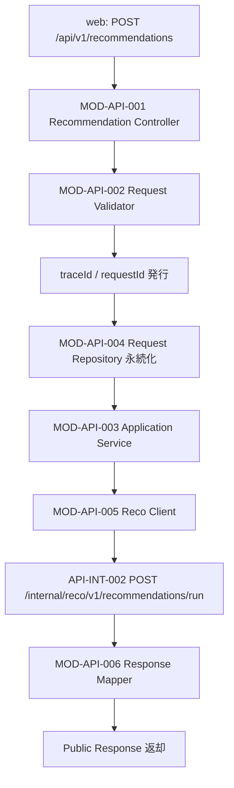

# レコメンド実行 API実装仕様書

> 本書は **API-PUB-002** の実装面正本である。
> Request / Response / Error / Validation の契約は [`API-PUB-002_レコメンド実行API契約仕様書.md`](./API-PUB-002_レコメンド実行API契約仕様書.md) を正とし、本書では再掲しない。
> OpenAPI 正本は `packages/contracts/openapi/public-api.yaml`（別 Contract Task）。

## 1. ドキュメント情報

| 項目 | 内容 |
| ---- | ---- |
| ドキュメントID | `API-PUB-002-IMPLEMENTATION` |
| ドキュメント名 | レコメンド実行 API実装仕様書 |
| 対象システム | Gift Recommendation Service MVP（apps/api / apps/web） |
| MVP対象 | `○` |
| 作成日 | 2026-06-04 |
| 更新日 | 2026-06-04 |

---

## 2. 前提契約

| 項目 | 内容 |
| ---- | ---- |
| 対象API ID | `API-PUB-002` |
| API名 | レコメンド実行 |
| Method / Endpoint | `POST` `/api/v1/recommendations` |
| API契約仕様書 | `docs/06_実装設計/api/API-PUB-002_レコメンド実行API契約仕様書.md` |
| OpenAPI定義 | 未作成（`packages/contracts/openapi/public-api.yaml`） |
| Contract Gate | 契約仕様書 Human Review 済み（PR #359）。OpenAPI Task 前 |

---

## 3. 実装方針

- apps/api の MOD-API-001〜006 が責務分担する（モジュール一覧準拠）
- 契約仕様書の camelCase Public I/F を受け、内部では Recommendation Request / Result ドメイン構造へマッピングする
- API-INT-002（`POST /internal/reco/v1/recommendations/run`）を同期呼び出しし、Internal Response を契約仕様書の `data` / `meta` へ整形する
- 0 件は HTTP 200 + `resultStatus: empty` + `meta.resultCode: GRS-REC-001`（契約仕様書 §7.4.2）
- Public Response では内部スコア・`scoreBreakdown` を返却しない（Response Mapper の責務）

---

## 4. 処理概要

### 4.1 処理フロー

API一覧 §連携フロー（ステップ 1〜11）のうち、ステップ 1〜4・10〜11 を apps/api が担当する。

### 4.2 処理詳細

| Step | モジュール | 処理 |
| ---: | ---------- | ---- |
| 1 | MOD-API-001 | Routing・Content-Type 検証・Controller 入口 |
| 2 | MOD-API-002 | 契約仕様書 §9 に基づく Validation（maxLength・enum・予算整合） |
| 3 | MOD-API-001 / 共通 | `X-Trace-Id` / `X-Request-Id` の引継ぎまたは UUID 生成 |
| 4 | MOD-API-004 | `recommendation_request` 永続化（Request DTO 変換） |
| 5 | MOD-API-003 | 実行オーケストレーション・トランザクション境界 |
| 6 | MOD-API-005 | API-INT-002 呼び出し（タイムアウト・エラー変換） |
| 7 | MOD-API-006 | Internal Result → Public `data` / `meta` マッピング（スコア除外） |
| 8 | 共通 | access_log / phase_log / error_log / metric 出力 |

---

## 5. データ項目マッピング

### 5.1 Request Mapping

| Request（契約） | 内部 DTO / ドメイン | 変換 | 備考 |
| --------------- | ------------------- | ---- | ---- |
| `relationship.*` | GiftContextCondition | コード・ラベル | マスタ検証は Validator |
| `occasion.*` | 同上 | 同上 | - |
| `budget.*` | BudgetCondition | 数値・通貨・税込 | optional |
| `preferredCondition` | PreferenceCondition | preferredText | max 500 |
| `nonPreferredCondition` | NonPreferredCondition | nonPreferredText | max 500 |
| `ngCondition` | NgCondition | ngText | max 300 |
| `freeText` | FreeTextCondition | そのまま | max 800 |
| `execution.*` | ExecutionCondition | mode / topK 等 | ui のみ MVP 画面 |

### 5.2 Response Mapping

| 内部（Reco / DB） | Response（契約） | 変換 | 備考 |
| ----------------- | ---------------- | ---- | ---- |
| recommendation_result_id | `data.recommendationResultId` | 文字列 | - |
| recommendation_request_id | `data.recommendationRequestId` | 文字列 | - |
| recommendation_run_id | `data.recommendationRunId` | 文字列 | - |
| run / result 状態 | `data.resultStatus` | enum 変換 | empty / completed / partial |
| result items | `data.items[]` | Snapshot 項目のみ | スコア系は除外 |
| reason（内部） | `data.items[].reasonSummary` | 短文化 | includeReason 時 |
| trace / request | `meta.traceId` / `meta.requestId` | 必須 | - |
| 0 件業務コード | `meta.resultCode` | `GRS-REC-001` | HTTP 200 |

---

## 6. API-INT-002 連携

| 項目 | 内容 |
| ---- | ---- |
| 内部 Endpoint | `POST /internal/reco/v1/recommendations/run` |
| 呼び出し元 | MOD-API-005 Reco Client |
| 入力 | 正規化済み Recommendation Request + traceId + requestId + execution 条件 |
| 出力 | recommendationRunId / recommendationResultId / resultItems / warnings 等 |
| 仕様正本 | `docs/06_実装設計/api/API-INT-002_Reco推薦実行API仕様書.md`（未作成時は API一覧 §API-INT-002） |

**責務境界:** Reco パイプライン（Semantic / Retrieval / Matching / Ranking / Reason 生成）の詳細は Reco 側。api は I/F 変換・永続化・Public 整形・エラー HTTP 化を担当する。

---

## 7. generated client 利用方針

| 項目 | 内容 |
| ---- | ---- |
| web generated | `apps/web/src/generated/api/`（Orval、Contract Task 後） |
| api reco-client | `apps/api/src/generated/reco-client/`（Internal API 用、別 Contract Task） |
| 手書き wrapper | `apps/web/src/lib/**` |
| 再生成 | Contract Task 完了後にリポジトリ標準コマンドで実行（具体コマンドは Contract Task で記載） |

generated は手動編集しない。

---

## 8. provider / consumer 実装影響

### 8.1 provider（apps/api）

| 項目 | 内容 |
| ---- | ---- |
| 影響 | あり（後続 Implementation Task） |
| 配置 | `apps/api/src/app/recommendations/**`（Epic scope） |
| 主要コンポーネント | Controller / Validator / ApplicationService / Repository / RecoClient / ResponseMapper |

### 8.2 consumer（apps/web）

| 項目 | 内容 |
| ---- | ---- |
| 影響 | あり（api-client 利用 Task） |
| 画面 | SCR-002 系（レコメンド条件入力・実行中表示・結果一覧・0 件・エラー） |
| 呼び出し | generated + wrapper 経由で契約仕様書どおりの Request Body を送信 |

---

## 9. ログ・監視

| 種別 | 内容 | タイミング | 備考 |
| ---- | ---- | ---------- | ---- |
| access_log | method / path / status / latency_ms | リクエスト終了 | API一覧: access |
| phase_log | validate / save_request / reco_call / map_response | 各フェーズ | API一覧: phase |
| error_log | GRS コード・traceId・retryable | エラー時 | エラーコード定義書 |
| metric | recommendation_run_count / recommendation_empty_rate / recommendation_latency_ms / candidate_count | 成功・0 件・失敗 | API一覧 |

0 件成功も `recommendation_empty_rate` の分母に含める。

---

## 10. エラー・障害時の実装方針

| 区分 | 方針 |
| ---- | ---- |
| Validation 失敗 | 400 / 422 + 契約 Error 形式。Handler で `GRS-REQ-*` を設定 |
| Reco タイムアウト | 504 + `GRS-REC-101`。error_log に内部詳細 |
| Reco 5xx | 502 + `GRS-REC-002` 等（マッピング表は実装 Task で詳細化） |
| DB 障害 | 503 + `GRS-DB-001` |
| 予期しない例外 | 500 + 汎用メッセージ。stack は error_log のみ |

---

## 11. セキュリティ・非機能

| 項目 | 方針 |
| ---- | ---- |
| 認証 | MVP 非認証。Middleware は将来拡張用に差し込み可能な構成 |
| PII | Request に個人名・住所等を載せない |
| タイムアウト | Reco 呼び出し上限は実装 Task で数値確定（要 Human Review） |
| 冪等性 | 再 POST は新規 Request / Run（重複実行防止は MVP 対象外） |

---

## 12. 実装テスト観点

| No | 観点 | 確認内容 | 種別 |
| --: | ---- | -------- | ---- |
| 1 | Validator | 契約 §9 の maxLength / 必須 / 予算矛盾 | unit |
| 2 | Mapper | スコア非返却・0 件 meta.resultCode | unit |
| 3 | Reco Client 失敗 | 502/504 変換 | integration（モック） |
| 4 | E2E | web→api→reco スタブで 200 / 0 件 | e2e（後続） |
| 5 | contract | OpenAPI 生成後の型一致 | typecheck（Contract 後） |

---

## 13. 変更履歴

| 日付 | 変更内容 | 関連Issue / PR |
| ---- | -------- | -------------- |
| 2026-06-04 | 初版（契約仕様書 #359 完了後の実装面） | #364 |

---

## 14. 未決事項

| No | 論点 | 理由 | 判断者 |
| --: | ---- | ---- | ------ |
| 1 | Reco Client タイムアウト秒数 | 非機能要件・Reco SLA 未数値化 | Human |
| 2 | API-INT-002 未作成時のモック I/F | 並行開発のブロック回避 | Human |

---

## 15. 関連資料

| 種別 | パス |
| ---- | ---- |
| 契約正本 | `docs/06_実装設計/api/API-PUB-002_レコメンド実行API契約仕様書.md` |
| モジュール | `docs/05_アプリケーション設計/アプリ/モジュール一覧.md` |
| ログ | `docs/05_アプリケーション設計/アプリ/ログ・Observability設計書.md` |
| Epic | `prompts/definitions/epics/api-pub-002-recommendation-run/epic.yaml` |

---

## 16. レビュー観点

- 契約仕様書と矛盾する I/F 再定義がないか
- MOD-API-001〜006 の責務が処理フローと一致しているか
- apps/reco 実装が混入していないか
- OpenAPI / generated の実ファイル変更が混入していないか

---

## 17. Human Review で確認してほしい事項

1. 実装面の粒度が Phase4 着手前の設計として十分か
2. API-INT-002 仕様書との並行開発順序
3. Reco Client タイムアウト・リトライの初期値方針

---

## 18. 備考

- 本書は `prompts/templates/docs/api-implementation-spec.md` に準拠する
- Phase1 ①（1a）契約仕様書（#358 / PR #359）の後続成果物である
