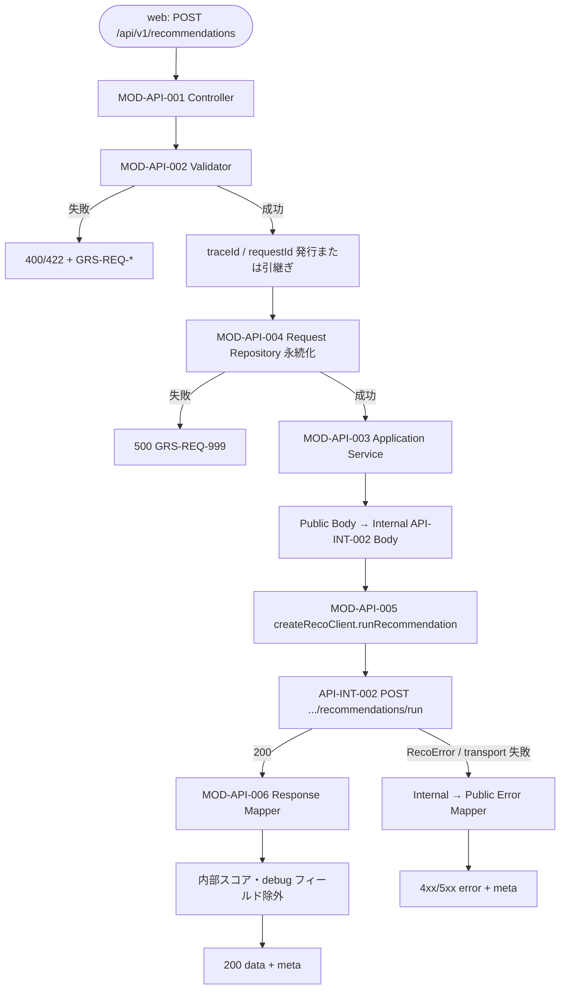

# レコメンド実行 API実装仕様書

> 本書は **API-PUB-002** の **実装面** 正本である。
> 契約面（Request / Response / Error / Validation）は [`API-PUB-002_レコメンド実行API契約仕様書.md`](./API-PUB-002_レコメンド実行API契約仕様書.md)（#358 / develop 正本）を正とし、本書では再掲しない。
> api→reco 間の Internal I/F は [`API-INT-002_Reco推薦実行API実装仕様書.md`](./API-INT-002_Reco推薦実行API実装仕様書.md) を正とする。
> OpenAPI 正本は `packages/contracts/openapi/public-api.yaml`（別 Contract Task）。本 Task では OpenAPI / Orval / generated / apps 実装は対象外。

## 1. ドキュメント情報

| 項目           | 内容                                      |
| -------------- | ----------------------------------------- |
| ドキュメントID | `API-PUB-002-IMPLEMENTATION`              |
| ドキュメント名 | レコメンド実行 API実装仕様書              |
| 対象システム   | Gift Recommendation Service MVP（Public） |
| MVP対象        | `○`                                       |
| 作成日         | 2026-07-09                                |
| 更新日         | 2026-07-09                                |

---

## 2. 前提契約

| 項目 | 内容 |
| ---- | ---- |
| 対象API ID | `API-PUB-002` |
| API名 | レコメンド実行 |
| Method / Endpoint | `POST` `/api/v1/recommendations` |
| API契約仕様書 | `docs/06_実装設計/api/API-PUB-002_レコメンド実行API契約仕様書.md` |
| 内部 API 実装仕様書 | `docs/06_実装設計/api/API-INT-002_Reco推薦実行API実装仕様書.md` |
| OpenAPI定義 | `packages/contracts/openapi/public-api.yaml`（**未完了**。Contract Task 前） |
| Contract Gate | **Public 契約仕様書確定済み**（#358 / PR #359 develop merge 済み）。OpenAPI 機械可読反映は未完了 |
| reco-client | `createRecoClient` / `GeneratedRecoClient`（#1112 / #1118 develop merge 済み。Phase1 NodeNext 整合） |

---

## 3. 実装方針

### 3.1 全体方針

| 観点 | 方針 |
| ---- | ---- |
| Provider | `apps/api`（MOD-API-001〜006） |
| Consumer | `apps/web`（SCR-002 系。generated api-client 利用は別 Task） |
| 責務分離 | Public HTTP 受付・Validation・Request 永続化・reco 呼び出し・Public Response 整形を api に集約。推薦パイプラインは reco（API-INT-002） |
| 契約との関係 | Public I/F は契約仕様書準拠。Internal 呼び出しは API-INT-002 実装仕様書準拠 |
| 非冪等性 | 同一条件の再 POST は新規 Run（契約仕様書 §4） |
| MVP 認証 | Public API は非認証。Internal 呼び出しのみ `X-Internal-Api-Key`（reco-client が付与） |

### 3.2 MOD-API モジュール配置（apps/api）

| モジュール | 責務（本 API に関わる範囲） |
| ---------- | --------------------------- |
| MOD-API-001 Recommendation Controller | Routing、`Content-Type` 検証、Controller 入口 |
| MOD-API-002 Recommendation Request Validator | 契約仕様書 §9 に基づく Validation |
| MOD-API-003 Recommendation Application Service | 実行オーケストレーション（永続化 → reco 呼び出し → Response 返却） |
| MOD-API-004 Recommendation Request Repository | `recommendation_request` 永続化 |
| MOD-API-005 Reco Client | `createRecoClient()` 経由で API-INT-002 呼び出し |
| MOD-API-006 Recommendation Response Mapper | Internal Result → Public `data` / `meta`（スコア系除外） |

配置目安（後続 Implementation Task）:

```text
apps/api/src/app/recommendations/
├── routes.ts              # POST /api/v1/recommendations
├── controller.ts
├── validator.ts
├── application-service.ts
├── request-repository.ts
├── response-mapper.ts
└── types.ts
```

`MOD-API-005` の実装正本は `apps/api/src/infrastructure/reco-client/` + `apps/api/src/lib/reco-client/factory.ts`（`createRecoClient`）。

### 3.3 reco-client 利用方針（Phase1 反映済み）

| 項目 | 方針 |
| ---- | ---- |
| ファクトリ | `createRecoClient({ mode: "generated" })`（本番デフォルト）。テストは `mode: "scaffold"` 可 |
| 実装 | `GeneratedRecoClient.runRecommendation()` → `transport.runRecoRecommendation()`（Orval 生成関数） |
| 設定 | `RECO_BASE_URL` / `RECO_INTERNAL_API_KEY` / timeout（`resolveRecoClientConfig`） |
| Header 付与 | `orval-mutator.ts` が `X-Internal-Api-Key` / `X-Trace-Id` / `X-Request-Id` を付与 |
| generated | `apps/api/src/generated/reco-client/` — **手動編集禁止** |
| 正本 README | `apps/api/src/infrastructure/reco-client/README.md` |

domain / route 層は **wrapper 経由のみ** reco を呼び出す（直接 generated import 禁止）。

---

## 4. 処理概要

### 4.1 処理フロー



API一覧の連携フロー（ステップ 1〜4・10〜11）のうち、**ステップ 1〜4・10〜11** を apps/api が担当する（ステップ 5〜9 は reco）。

### 4.2 処理詳細

1. **受付:** `Content-Type` / `Accept` が `application/json` であることを確認。
2. **Validation:** 契約仕様書 §9（必須項目・maxLength・`execution.mode=ui`・予算整合・`candidateLimit >= topK`）。
3. **trace 発行:** `X-Trace-Id` / `X-Request-Id` を Header から引き継ぎ、未指定時は api 側で UUID 生成。以降のログ・reco 呼び出し・Response `meta` で一貫。
4. **永続化:** Validator 通過後の Request を `recommendation_request` として保存。`recommendation_request_id` を発行。
5. **Internal Body 組立:** Public camelCase → API-INT-002 Request（§5.1）。ルート `recommendationRequestId` に永続化 ID を設定。
6. **reco 呼び出し:** `createRecoClient().runRecommendation({ body, traceId, requestId })`。timeout は reco hard timeout（8,000ms）**以上**（API設計方針書）。
7. **Response 整形:** Internal `data.resultItems` → Public `data.items[]`。内部スコア・`scoreBreakdown`・`warnings`・`metricSummary`・`reasonData`・`debugPayload` は Public に載せない（契約仕様書 §7.3.2）。
8. **0 件:** HTTP **200**。`data.resultStatus: "empty"`、`data.resultItemCount: 0`、`meta.resultCode: GRS-REC-001`（契約仕様書 §7.4.2）。
9. **Reason:** `includeReason=true` 時、Item ごとに `reasonSummary`（非空）と `isFallback` をマッピング（API-INT-002 §7.3.2.1 / MOD-RECO-001 §10.3）。

---

## 5. データ項目マッピング

### 5.1 Request Mapping（Public → Internal API-INT-002）

| Public Request（契約 / camelCase） | Internal API-INT-002 Body | 変換 | 備考 |
| ---------------------------------- | ------------------------- | ---- | ---- |
| （永続化後 ID） | `recommendationRequestId`（ルート） | Repository 発行 ID | Internal 契約のルート必須項目 |
| `relationship.*` | `recommendationRequest.relationship.*` | ネストそのまま | マスタ検証は api Validator |
| `occasion.*` | `recommendationRequest.occasion.*` | 同上 | - |
| `budget.*` | `recommendationRequest.budget.*` | 同上 | optional |
| `preferredCondition` | `recommendationRequest.preferredCondition` | 同上 | - |
| `nonPreferredCondition` | `recommendationRequest.nonPreferredCondition` | 同上 | - |
| `ngCondition` | `recommendationRequest.ngCondition` | 同上 | - |
| `freeText` | `recommendationRequest.freeText` | 同上 | - |
| `execution.mode` | `recommendationRequest.execution.mode` | **`ui` 固定**（Public MVP） | Public から `evaluation` / `batch` は送信しない |
| `execution.topK` 等 | `recommendationRequest.execution.*` | 数値・boolean そのまま | デフォルトは契約仕様書 §6.4 |
| `X-Trace-Id` | reco 呼び出し Header | mutator 付与 | Response `meta.traceId` と一致 |
| `X-Request-Id` | reco 呼び出し Header | mutator 付与 | Response `meta.requestId` と一致 |

正本: Recommendation Request 定義書、API-INT-002 実装仕様書 §5.1。

### 5.2 Response Mapping（Internal API-INT-002 → Public）

| Internal（API-INT-002 `data`） | Public Response（契約） | 変換 | 備考 |
| ------------------------------ | ----------------------- | ---- | ---- |
| `recommendationResultId` | `data.recommendationResultId` | 文字列 | - |
| `recommendationRequestId` | `data.recommendationRequestId` | 文字列 | 永続化 ID と一致 |
| `recommendationRunId` | `data.recommendationRunId` | 文字列 | - |
| `resultStatus` / 件数 | `data.resultStatus` | Internal `completed` + 0件 → Public **`empty`** | 契約 §7.4.2 |
| `topK` | `data.topK` | integer | - |
| `resultItemCount` | `data.resultItemCount` | integer | 0 件時 `0` |
| `fallbackUsed` | `data.fallbackUsed` | boolean | - |
| （Mapper 生成） | `data.displayMessage` | 0 件時の画面文案 | 契約 Example 参照 |
| `resultItems[]` | `data.items[]` | **キー名変換** | Internal 正: `resultItems`（契約仕様書）。OpenAPI 差分は Contract Task |
| `resultItems[].itemId` 等 Snapshot | `items[].itemName` / `itemPrice` / `itemUrl` 等 | Snapshot 項目のみ | API-PUB-003 連携 |
| `resultItems[].reasonSummary` | `items[].reasonSummary` | 非空（includeReason 時） | Reason fallback 時 `isFallback: true` |
| `resultItems[].isFallback` | `items[].isFallback` | boolean | - |
| **除外** | — | `finalScore`, `contextScore`, `scoreBreakdown`, `reasonData`, `warnings`, `metricSummary`, `metadata.debugPayload` 等 | API設計方針書 §21.3 |
| `meta.traceId` / `meta.requestId` | `meta.traceId` / `meta.requestId` | そのまま | Header と一致必須 |
| 0 件 | `meta.resultCode` | `GRS-REC-001` | HTTP 200 |
| `meta.generatedAt` | `meta.generatedAt` | ISO 8601 | 任意 |

---

## 6. generated client 利用方針

| 項目 | 内容 |
| ---- | ---- |
| web（Consumer） | `apps/web/src/generated/api/` — `public-api.yaml` から Orval 生成（**Contract Task 後**） |
| api → reco（本書の重点） | `apps/api/src/generated/reco-client/` + `createRecoClient` wrapper |
| 再生成コマンド | `orval.config.ts` 正本に従う（例: `pnpm exec orval --config orval.config.ts`） |
| 本 Task | OpenAPI / Orval / generated **変更なし** |

| 観点 | 方針 |
| ---- | ---- |
| web | Orval 生成 + 手書き wrapper（`apps/web/src/lib/**`） |
| api（reco） | `GeneratedRecoClient` が generated endpoint を呼ぶ。手動編集禁止 |
| 既知差分 | Internal OpenAPI の `data.items` vs 契約 `data.resultItems` — wrapper / Contract Task で解消（API-INT-002 実装仕様書 §6） |

---

## 7. provider / consumer 実装影響

### 7.1 provider（apps/api）

| 項目 | 内容 |
| ---- | ---- |
| 影響 | `○`（後続 Implementation Task） |
| 新規実装 | Controller / Validator / ApplicationService / Repository / ResponseMapper |
| reco 連携 | 既存 `createRecoClient` + `GeneratedRecoClient` を **本番利用**（scaffold からの置換） |
| エラー | §7.3 の Public Error Mapper |
| DB | Request 永続化（MOD-API-004）。schema は別 Task |

### 7.2 consumer（apps/web）

| 項目 | 内容 |
| ---- | ---- |
| 影響 | `○`（api-client 利用 Task） |
| 画面 | SCR-002（条件入力・実行中・結果・0 件・エラー） |
| 呼び出し | generated Public client + wrapper。契約仕様書 §6.5 Example 準拠 |

### 7.3 エラーマップ・trace 伝播

#### 7.3.1 api Validation → Public

契約仕様書 §8.2 のとおり。Validator が `GRS-REQ-*` を直接返す（reco 未到達）。

#### 7.3.2 reco / transport 失敗 → Public

| Internal 由来 | 条件 | Public HTTP | Public `error.code` | 備考 |
| ------------- | ---- | ----------- | ------------------- | ---- |
| `GRS-AUTH-*` | reco 401（Key 不正等） | **500** | **`GRS-REC-002`** | Public へ認証詳細を漏らさない（API-INT-002 実装仕様書 §7.2） |
| `GRS-REQ-*` | reco 400/422（防御的 Validation） | 400/422 | 同一コード引継ぎ可 | 通常は api 側で事前検証 |
| `GRS-REC-*` / `GRS-DB-*` / `GRS-LLM-*` | パイプライン失敗 | 契約 §8.2 に準拠 | 同一系列 | `RecoError` / `error-mapper.ts` 経由 |
| `GRS-REC-101` | reco タイムアウト | **504** | `GRS-REC-101` | api timeout ≥ 8,000ms |
| transport / network | reco 到達不可 | **502** または **500** | `GRS-REC-002` | 実装 Task で `RecoError` 分類を確定 |
| **正常 0 件** | `resultItemCount: 0` | **200** | —（`meta.resultCode: GRS-REC-001`） | エラーではない |

`error-mapper.ts`（infrastructure/reco-client）が Internal `error.code` を `RecoError` に変換。Application Service が Public HTTP へ最終マップ。

#### 7.3.3 trace 伝播

```text
web（任意 Header）→ api 発行/引継ぎ
  → access_log（api）
  → createRecoClient mutator（X-Trace-Id / X-Request-Id）
  → API-INT-002 → reco phase_log / error_log
  → Public Response meta（Header と一致必須）
```

---

## 8. ログ・監視

| 種別 | 責務 | 備考 |
| ---- | ---- | ---- |
| API access log | api Public エンドポイント | `trace_id`, `request_id`, `recommendation_request_id`, HTTP status |
| phase_log | reco 側（API-INT-002 経由） | api は **二重記録しない**（INT-002 実装仕様書 §8.1） |
| error_log | api Validation 失敗 + reco エラー伝播 | `GRS-*`、Secret 除外 |
| metric | Run 完了系 | reco `metricSummary` は Public 非露出。api 側集計は Implementation Task |

---

## 9. 非機能（タイムアウト・リトライ）

| 項目 | 方針 |
| ---- | ---- |
| reco hard timeout | 8,000ms（MOD-RECO-001 §13.2 本番主経路 / #1748 → `GRS-REC-101`） |
| api → reco HTTP timeout | **≥ 8,000ms**（既定 9,000ms。`DEFAULT_RECO_REQUEST_TIMEOUT_MS`） |
| api 側 retry | **自動 retry 禁止**（非冪等）。ユーザー再実行のみ |
| 同時実行 | Run 単位独立 |

---

## 10. 実装テスト観点

| No | 観点 | 確認内容 | 種別 |
| --: | ---- | -------- | ---- |
| 1 | 正常系 | Validator → Repository → `runRecommendation` 呼び出し → Public `data.items` ≥1 | integration |
| 2 | 0 件正常系 | 200、`resultStatus: empty`、`items: []`、`meta.resultCode: GRS-REC-001` | integration |
| 3 | Validation | 必須欠落 → 400 `GRS-REQ-004` / `005`（reco 未呼び出し） | unit / integration |
| 4 | reco 認証失敗 | Internal 401 → Public 500 `GRS-REC-002` | integration |
| 5 | タイムアウト | 504 `GRS-REC-101` | integration |
| 6 | Public フィルタ | Response に `scoreBreakdown` / `finalScore` / `warnings` が **含まれない** | unit |
| 7 | trace 一致 | Header `X-Trace-Id` = `meta.traceId` | integration |
| 8 | createRecoClient | `mode: "generated"` で `runRecoRecommendation` が呼ばれる | unit |
| 9 | Reason fallback | `isFallback: true` 時も Item 存続・`reasonSummary` 非空 | integration |

---

## 11. 未決事項・Human Review 観点

| No | 項目 | 現状 | 判断依頼 |
| --: | ---- | ---- | -------- |
| 1 | `GRS-REQ-006`（条件厳しすぎ）の api 側判定ルール | 契約 §9 は実装仕様書 Task へ委譲 | preferred/NG 競合時の 422 化条件 |
| 2 | transport 失敗時 502 vs 500 | 推奨 502 | 最終 HTTP の確定 |
| 3 | `displayMessage` 0 件文案 | 契約 Example あり | 固定文案 vs 動的生成 |
| 4 | Public OpenAPI Contract Task タイミング | 本書完了後 | Epic #357 縦串 2/4 |
| 5 | 契約仕様書 §5.4 の API-INT-002 参照パス | 「未作成」表記残存 | **別 docs Task** で契約仕様書の参照パス更新を推奨（本 Task scope 外） |

---

## 12. 変更履歴

| 日付 | 版 | 変更概要 |
| ---- | -- | -------- |
| 2026-07-09 | 1.0 | 初版（#364 作業やり直し。API-INT-002 実装仕様書・reco-client Phase1 前提を反映） |
