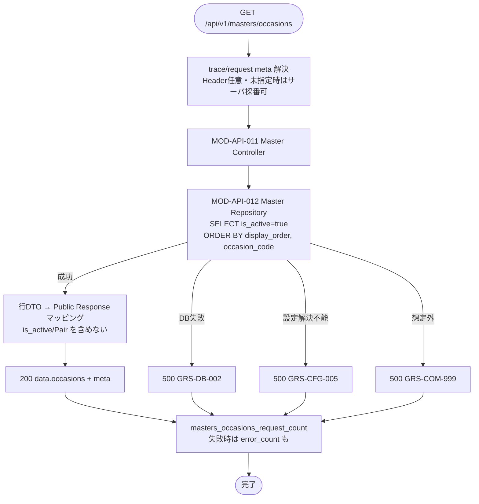

# Occasionマスタ取得 API実装仕様書

> 本書は **API-PUB-006** の **実装面** 正本である。
> 契約面（Request / Response / Error / Validation の定義）は `API-PUB-006_Occasionマスタ取得API契約仕様書.md` を正とし、本書では再掲しない。
> OpenAPI 正本は `packages/contracts/openapi/public-api.yaml`（#424 / PR #425 develop 反映済み）。generated / Orval / apps 実装の本格整備は後続 Task。本書は docs のみ。

## 1. ドキュメント情報

| 項目           | 内容                                      |
| -------------- | ----------------------------------------- |
| ドキュメントID | `API-PUB-006-IMPLEMENTATION`              |
| ドキュメント名 | Occasionマスタ取得 API実装仕様書          |
| 対象システム   | Gift Recommendation Service MVP（Public） |
| MVP対象        | `○`                                       |
| 作成日         | 2026-07-12                                |
| 更新日         | 2026-07-12                                |

---

## 2. 前提契約

| 項目 | 内容 |
| ---- | ---- |
| 対象API ID | `API-PUB-006` |
| API名 | Occasionマスタ取得 |
| Method / Endpoint | `GET` `/api/v1/masters/occasions` |
| API契約仕様書 | `docs/06_実装設計/api/API-PUB-006_Occasionマスタ取得API契約仕様書.md` |
| OpenAPI定義 | `packages/contracts/openapi/public-api.yaml`（`operationId: getMastersOccasions`） |
| テーブル定義 | `docs/06_実装設計/database/occasion_master_テーブル定義書.md`（#445 / PR #448） |
| Contract Gate | **契約仕様書確定済み**（#402 / PR #410）。**OpenAPI 断片反映済み**（#424 / PR #425 develop merge）。Orval / generated の全面追随は consumer（SCR-002）側 Task で確認 |

> 契約面の Request / Response schema、Validation、Error 一覧は契約仕様書を参照する。本書では実装判断に必要な処理フロー・MOD 責務・DB マッピング・エラー境界のみ記載する。

---

## 3. 実装方針

### 3.1 全体方針

| 観点 | 方針 |
| ---- | ---- |
| Provider | `apps/api`（`apps/api/src/app/masters/**`） |
| Consumer | `apps/web`（SCR-002 レコメンド条件入力画面）。本 Task では実装しない |
| Web フレームワーク | **Express**（`apps/api` 既存スタック） |
| 担当モジュール | **MOD-API-011** Master Controller / **MOD-API-012** Master Repository |
| 責務分離 | HTTP I/F（meta 解決・マスタ読取・Response / Error 組立）のみ。推薦パイプライン（MOD-API-001〜006）は呼び出さない |
| 認証 | **MVP は非認証**（契約仕様書 §4）。`Authorization` 検証なし |
| 冪等性 | 副作用なし。同一 Request の繰り返し可（SELECT のみ） |
| Pair 情報 | **Public Response に含めない**（`pair_master` は参照しない） |
| キャッシュ | **MVP 既定: 都度 SELECT**（プロセス内キャッシュ導入は §11 未決） |

### 3.2 エンドポイント層の配置

後続実装 Task の配置目安（現状 `apps/api/src/app/masters/**` は未作成。本仕様書を正として新規追加する）:

```text
apps/api/src/app/masters/
├── routes.ts                   # createMastersRouter(): GET /occasions 等
├── controllers/
│   └── occasionController.ts   # MOD-API-011（本 API 受付・Response 組立）
├── repositories/
│   └── occasionRepository.ts   # MOD-API-012（occasion_master 読取）
└── types.ts                    # 内部 DTO（任意）

apps/api/src/
├── middlewares/                # request-meta / error 等（既存再利用）
├── infrastructure/db/          # DB client（既存）
└── ...
```

| モジュール | 責務（本 API） |
| ---------- | -------------- |
| MOD-API-011 Master Controller | `GET /occasions` 受付、meta 解決、Repository 呼び出し、成功 / 失敗 Response 組立、metric 境界 |
| MOD-API-012 Master Repository | `occasion_master` から `is_active = true` の行を `ORDER BY display_order, occasion_code` で取得。内部行 DTO を返却 |

**共通化メモ（推奨・未確定）:** PUB-005 / PUB-007 / PUB-008 も同一 `masters` Router 配下を想定する。Repository の共通基底は後続で検討可。本仕様書は **Occasion 読取に閉じる**（§11）。

`apps/reco/**` / `apps/batch/**` / `apps/web/src/app/**` / `apps/web/src/features/**` は **変更しない**（親 Epic `forbidden_paths`）。

### 3.3 DI / 依存

| 項目 | 方針 |
| ---- | ---- |
| request-meta | 既存の Trace / Request ID 解決を再利用。Header 任意・未指定時はサーバ採番可 |
| DB | Postgres の `occasion_master` を SELECT。接続文字列実値をログ・Response に出さない |
| Reco Client / Recommendation | **使用しない** |
| pair_master | **参照しない**（Public 非公開） |

### 3.4 認証（実装面）

| 項目 | 方針 |
| ---- | ---- |
| 方式 | MVP 非認証。認証 middleware を本ルートに適用しない |
| `Authorization` | 無視（検証しない） |
| 後続 | 認証追加時は契約・OpenAPI 変更を伴う別 Task |

### 3.5 DB 読取（実装面）

| 項目 | 方針 |
| ---- | ---- |
| テーブル | `occasion_master` |
| フィルタ | `is_active = true` のみ |
| 並び順 | `ORDER BY display_order ASC, occasion_code ASC`（テーブル定義書・契約と一致） |
| 投影列 | `occasion_code`, `occasion_label`, `display_order`（`is_active` はフィルタ専用で Response に載せない） |
| Index 利用 | `idx_occasion_master_active_order`（`is_active`, `display_order`, `occasion_code`）を想定 |
| 0 件 | **HTTP 200** + `data.occasions: []` + `meta.count: 0`（契約確定） |
| 参照不能 | DB 接続失敗・クエリ失敗・設定解決不能 → §5.3。空配列とは区別する |

**空配列と `GRS-CFG-005` の境界（実装判定）:**

| 状況 | HTTP / Code | 備考 |
| ---- | ----------- | ---- |
| DB 到達可・クエリ成功・有効行 0 件 | 200 / 空配列 | seed 未投入でも「読取成功」ならこちら（契約・Human Review #410） |
| DB 到達不可・タイムアウト・クエリ例外 | 500 `GRS-DB-002` 等 | 参照処理不能 |
| 設定解決不能（接続設定欠落等でマスタ参照不可） | 500 `GRS-CFG-005` | 「空」ではなく「取得不能」 |

---

## 4. 処理概要

### 4.1 処理フロー



### 4.2 処理詳細

1. **meta 解決:** `X-Trace-Id` / `X-Request-Id` は任意。指定時は Response `meta` へ一致反映。未指定時はサーバ採番可。
2. **Controller（MOD-API-011）:** 認証なし。Body / Path / Query は使用しない。未知 Query は無視（契約）。
3. **Repository（MOD-API-012）:** `occasion_master` を §3.5 の条件で SELECT。Pair テーブルは触らない。
4. **成功 Response:** `data.occasions[]`（`occasionCode` / `occasionLabel` / optional `displayOrder`）+ `meta`（`traceId` / `requestId` / `generatedAt` / `count`）。`count` は配列長と一致。
5. **失敗 Response:** 契約仕様書の Error 形式。stack trace・SQL・接続文字列を Response / ログ本文に出さない。
6. **metric:** 処理完了時に `masters_occasions_request_count` を記録。エラー時は `masters_occasions_error_count` も記録（§8）。
7. **HTTP Method:** `GET` 以外はルーティング層で拒否（405 等。実装 Task で Express 既定に合わせる）。

---

## 5. データ項目マッピング

### 5.1 Request Mapping

| Request項目 | 内部項目 / DTO | 変換内容 | 備考 |
| ----------- | -------------- | -------- | ---- |
| （Body） | — | なし | GET。Body 不使用 |
| `X-Trace-Id` | `meta.trace_id` | 任意。未指定時サーバ採番可 | Response と一致 |
| `X-Request-Id` | `meta.request_id` | 任意。未指定時サーバ採番可 | Response と一致 |
| `Accept` | — | `application/json` 想定 | 厳密検証は実装 Task 任意 |
| Path / Query | — | なし | 未知 Query は無視 |

### 5.2 Response Mapping（成功・200）

| 内部項目 / DTO | Response項目 | 変換内容 | 備考 |
| -------------- | ------------ | -------- | ---- |
| `occasion_code` | `data.occasions[].occasionCode` | snake → camel | PK。必須 |
| `occasion_label` | `data.occasions[].occasionLabel` | そのまま | 必須。UI 表示名 |
| `display_order` | `data.occasions[].displayOrder` | integer | optional 可。DB は NOT NULL DEFAULT 0 |
| （フィルタ専用）`is_active` | — | **Response に含めない** | `true` 行のみ取得 |
| — | `meta.traceId` | meta から | 任意 Header と一致 |
| — | `meta.requestId` | meta から | 任意 Header と一致 |
| サーバ時刻 | `meta.generatedAt` | ISO 8601 | — |
| 配列長 | `meta.count` | `occasions.length` | 0 可 |
| `pair_master` 等 | — | **含めない** | Public 非公開 |

### 5.3 Error Mapping（実装面）

| 内部状況 | HTTP | Error Code | 備考 |
| -------- | ---: | ---------- | ---- |
| DB 読取失敗 | 500 | `GRS-DB-002` | 接続・クエリ失敗 |
| マスタ設定解決不能 | 500 | `GRS-CFG-005` | 空配列と区別 |
| 設定系想定外 | 500 | `GRS-CFG-999` | — |
| 想定外内部エラー | 500 | `GRS-COM-999` | stack 非公開 |
| 一時的利用不可 | 503 | `GRS-COM-003` | インフラ停止等 |
| タイムアウト | 504 | `GRS-COM-002` | DB / 処理タイムアウト |

詳細メッセージ・ユーザー向け表示は契約仕様書・エラーコード定義書を正とする。

---

## 6. generated client 利用方針

| 項目 | 内容 |
| ---- | ---- |
| generated出力先 | `apps/web/src/generated/api/`（Orval。本 Task では再生成しない） |
| operationId | `getMastersOccasions` |
| client wrapper | `apps/web/src/lib/**` 配下の手書き wrapper（SCR-002 実装 Task で利用。本 Task では変更しない） |
| 再生成コマンド | プロジェクト標準の Orval 再生成（本 Task では実行しない） |
| 検証コマンド | typecheck / contract test（本 Task では実行しない） |

generated ファイルは手動編集しない。利用側は wrapper を介して generated client を呼ぶ。

---

## 7. provider / consumer 実装影響

### 7.1 provider

| 項目     | 内容 |
| -------- | ---- |
| provider | `apps/api` |
| 責務     | Public masters Occasion 一覧 API の提供 |
| 影響有無 | `あり`（後続実装 Task） |
| 必要対応 | `apps/api/src/app/masters/**` 新規、Router mount、DB 読取、metric / error 配線 |

- MOD-API-011 / MOD-API-012 の実装
- `/api/v1/masters` 配下への Router 登録
- `occasion_master` SELECT（§3.5）
- Error / meta / metric の既存共通部品との整合

### 7.2 consumer

| 項目     | 内容 |
| -------- | ---- |
| consumer | `apps/web`（SCR-002） |
| 責務     | レコメンド条件入力の Occasion 選択肢表示 |
| 影響有無 | `あり`（SCR-002 実装 Task。本 Task では対象外） |
| 必要対応 | generated client 経由で本 API を呼び、選択肢を UI に反映 |

- Pair 情報を本 API から期待しない
- 他マスタ API（PUB-005 / 007 / 008）と並列 GET 可（API一覧）

---

## 8. ログ・監視

| 種別 | 内容 | 出力タイミング | 備考 |
| ---- | ---- | -------------- | ---- |
| API access log | method / path / status / latency / trace_id | リクエスト完了時 | 個人情報・secret を含めない |
| error log | error.code / message（ユーザー向け以外の内部要約） / trace_id | 5xx 発生時 | SQL・接続文字列実値を出さない |
| audit log | なし | — | 参照のみ・非認証のため MVP では不要 |
| metric | `masters_occasions_request_count` | 成功・失敗とも処理完了時 | API一覧 |
| metric | `masters_occasions_error_count` | エラー応答時 | API一覧 |

---

## 9. 実装テスト観点

|  No | 観点 | 確認内容 | 種別 |
| --: | ---- | -------- | ---- |
| 1 | 正常系（複数件） | `is_active=true` のみが `display_order` / `occasion_code` 順で返る | integration |
| 2 | 正常系（0 件） | 有効行 0 件で 200 + 空配列 + `count=0` | integration |
| 3 | 非公開列 | Response に `isActive` / Pair が含まれない | integration |
| 4 | DB 失敗 | 接続・クエリ失敗で 500 `GRS-DB-002` | integration |
| 5 | 設定解決不能 | 参照不能時に 500 `GRS-CFG-005`（空配列と区別） | integration |
| 6 | meta 伝播 | `X-Trace-Id` / `X-Request-Id` 指定時に Response meta と一致 | integration |
| 7 | metric | request_count / error_count が記録境界どおり動く | unit / integration |
| 8 | generated client | `getMastersOccasions` 型と契約の整合（consumer Task） | typecheck |
| 9 | provider / consumer | SCR-002 が選択肢表示に利用できること（画面 Task） | manual |

> 契約面の単体テスト観点（validation / auth / Request・Response schema）は契約仕様書を正とする。本 Task ではテストコードを追加しない。

---

## 10. 変更履歴

| 日付 | 変更内容 | 関連Issue / PR |
| ---- | -------- | -------------- |
| 2026-07-12 | 初版作成 | #1171 |

---

## 11. 未決事項

|  No | 論点 | 判断が必要な理由 | 判断者 | 期限 | 備考 |
| --: | ---- | ---------------- | ------ | ---- | ---- |
| 1 | MOD-API-012 を Occasion 専用にするか、PUB-005 等と共通 Repository にするか | ディレクトリ・DI 設計に影響 | Human | 実装 Task 開始前 | 本仕様書は Occasion 読取に閉じ、共通化は推奨のみ |
| 2 | プロセス内キャッシュ（TTL）を MVP で導入するか | 性能・鮮度・実装コスト | Human | 実装 Task 開始前 | 既定案: 都度 SELECT |
| 3 | `displayOrder` 欠落時のコード側フォールバック要否 | DB は NOT NULL DEFAULT 0 のため通常不要 | Human | 任意 | 契約はフォールバック可と記載。DB 正本ならコード補完不要 |

---

## 12. 関連資料

| 種別 | パス / URL | 用途 |
| ---- | ---------- | ---- |
| 契約仕様書 | `docs/06_実装設計/api/API-PUB-006_Occasionマスタ取得API契約仕様書.md` | 前提契約 |
| テーブル定義 | `docs/06_実装設計/database/occasion_master_テーブル定義書.md` | 読取条件・列 |
| OpenAPI | `packages/contracts/openapi/public-api.yaml` | `getMastersOccasions` |
| API一覧 | `docs/05_アプリケーション設計/アプリ/api/API一覧.md` | metric / Pair 非公開 |
| モジュール一覧 | `docs/05_アプリケーション設計/アプリ/モジュール一覧.md` | MOD-API-011 / 012 |
| エラーコード定義書 | `docs/05_アプリケーション設計/アプリ/エラーコード定義書.md` | Error マップ |
| ログ設計書 | `docs/05_アプリケーション設計/アプリ/ログ・Observability設計書.md` | trace / metric |
| Task Definition | `prompts/definitions/tasks/api-pub-006-occasion-masters/api-implementation-spec.yaml` | 本 Task 条件 |
| 親 Epic | #388 | 作業管理 |

---

## 13. レビュー観点

- 確定済み API 契約（契約仕様書 / OpenAPI）と実装方針が整合している
- 処理フロー・MOD-API-011 / 012・内部 DTO マッピングが明確である
- `is_active` 非公開・Pair 非公開・0 件空配列 / `GRS-CFG-005` 境界が契約と一致している
- generated client を手動編集せず、本 Task ではファイル変更していない
- provider / consumer の実装影響が整理されている
- ログ・監視・結合テスト観点が整理されている
- secret や `.env` 実値が含まれていない
- Human Review で確認してほしい事項（§11）が明示されている

---

## 14. 備考

- 本 Task は Phase4b 縦串の 1/3（実装面仕様書）。後続は apps/api 実装 → 単体テスト → Epic PR → develop。
- Task PR target は親 Epic Branch `feature/epic-388-pub-006-occasion-masters`。
- PUB-005 実装仕様書をスタイル参考にした（Repository 共通化は各 Task / Human 判断）。
