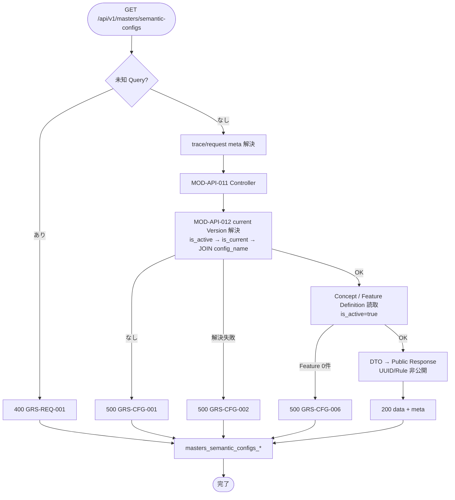

# Semantic設定取得 API実装仕様書

> 本書は **API-PUB-007** の **実装面** 正本である。
> 契約面（Request / Response / Error / Validation の定義）は `API-PUB-007_Semantic設定取得API契約仕様書.md` を正とし、本書では再掲しない。
> OpenAPI 正本は `packages/contracts/openapi/public-api.yaml`（#426 / PR #427 develop 反映済み）。generated / Orval / apps 実装の本格整備は後続 Task。本書は docs のみ。

## 1. ドキュメント情報

| 項目           | 内容                                      |
| -------------- | ----------------------------------------- |
| ドキュメントID | `API-PUB-007-IMPLEMENTATION`              |
| ドキュメント名 | Semantic設定取得 API実装仕様書            |
| 対象システム   | Gift Recommendation Service MVP（Public） |
| MVP対象        | `○`                                       |
| 作成日         | 2026-07-12                                |
| 更新日         | 2026-07-12                                |

---

## 2. 前提契約

| 項目 | 内容 |
| ---- | ---- |
| 対象API ID | `API-PUB-007` |
| API名 | Semantic設定取得 |
| Method / Endpoint | `GET` `/api/v1/masters/semantic-configs` |
| API契約仕様書 | `docs/06_実装設計/api/API-PUB-007_Semantic設定取得API契約仕様書.md` |
| OpenAPI定義 | `packages/contracts/openapi/public-api.yaml`（`operationId: getSemanticConfigMasters`） |
| テーブル定義 | `semantic_config`（#462）/ `semantic_config_version`（#463）/ `semantic_concept`（#471）/ `feature_definition`（#470） |
| Contract Gate | **契約仕様書確定済み**（#403 / PR #407）。**OpenAPI 断片反映済み**（#426 / PR #427 develop merge）。Orval / generated の全面追随は consumer（SCR-002）側 Task で確認 |

> 契約面の Request / Response schema、Validation、Error 一覧は契約仕様書を参照する。本書では実装判断に必要な処理フロー・MOD 責務・DB マッピング・エラー境界のみ記載する。

---

## 3. 実装方針

### 3.1 全体方針

| 観点 | 方針 |
| ---- | ---- |
| Provider | `apps/api`（既存 `apps/api/src/app/masters/**` を拡張） |
| Consumer | `apps/web`（SCR-002）。本 Task では実装しない |
| Web フレームワーク | **Express**（`apps/api` 既存スタック） |
| 担当モジュール | **MOD-API-011** Master Controller / **MOD-API-012** Master Repository |
| 責務分離 | HTTP I/F（meta・current Version 解決・Concept/Feature 読取・Response / Error 組立）のみ。推薦パイプラインは呼び出さない |
| 認証 | **MVP は非認証**（契約仕様書 §4） |
| 冪等性 | 副作用なし。同一 Request の繰り返し可（SELECT のみ） |
| Public 識別 | **`configName` + `versionLabel` composite**。内部 UUID は非公開 |
| 非公開 | `semantic_rule` / `pair_rule` / 正規化パラメータ詳細 / 内部 PK |
| キャッシュ | **MVP 既定: 都度 SELECT**（§11） |

### 3.2 エンドポイント層の配置

PUB-005 / PUB-006 で `createMastersRouter` が存在する。本 API は同一 Router に `GET /semantic-configs` を追加する。

```text
apps/api/src/app/masters/
├── routes.ts                         # GET /semantic-configs を追加
├── semantic-config-controller.ts     # MOD-API-011（本 API 受付・組立）※新規
├── semantic-config-repository.ts     # MOD-API-012（Version 解決 + Concept/Feature 読取）※新規
├── relationship-repository.ts        # PUB-005（変更しない）
├── occasion-controller.ts            # PUB-006（変更しない）
├── occasion-repository.ts            # PUB-006（変更しない）
├── constants.ts / types.ts           # 本 API 用定数・DTO を追記可
└── index.ts
```

| モジュール | 責務（本 API） |
| ---------- | -------------- |
| MOD-API-011 Master Controller | `GET /semantic-configs` 受付、未知 Query 検査、meta 解決、Repository 呼び出し、成功 / 失敗 Response、metric |
| MOD-API-012 Master Repository | current Version 解決（親 `is_active` → 子 `is_current` → JOIN `config_name`）、Concept / Feature Definition の active 行取得 |

**共通化メモ（推奨・未確定）:** PUB-008 も同一 current Version 解決を使う。本仕様書は **PUB-007 読取に閉じ**、共通 Repository 抽出は後続 Task / Human 判断（§11）。

`apps/reco/**` / `apps/batch/**` / `apps/web/src/app/**` / `apps/web/src/features/**` は **変更しない**。

### 3.3 DI / 依存

| 項目 | 方針 |
| ---- | ---- |
| request-meta | 既存 Trace / Request ID 解決を再利用。Header 任意・未指定時はサーバ採番可（現行 middleware は requestId を採番） |
| DB | Postgres。接続文字列実値をログ・Response に出さない |
| Reco Client | **使用しない** |
| DATABASE_URL 未設定 | 設定解決不能として `GRS-CFG-001` または `GRS-CFG-005` 相当で失敗（実装 Task で PUB-005/006 の既定と揃える。推奨: current 解決不能と同様に **`GRS-CFG-001`**） |

### 3.4 認証（実装面）

| 項目 | 方針 |
| ---- | ---- |
| 方式 | MVP 非認証。本ルートに認証 middleware を適用しない |
| `Authorization` | 無視 |

### 3.5 DB 読取（実装面）

#### 3.5.1 current Version 解決

| 手順 | 内容 |
| ---- | ---- |
| 1 | `semantic_config` で `is_active = true` の系列を対象 |
| 2 | 当該 `semantic_config_id` の `semantic_config_version` で `is_current = true` を解決 |
| 3 | アプリ層 JOIN で `config_name` を取得 |
| 4 | 解決 0 件 → **`GRS-CFG-001`**。解決過程の想定外失敗 → **`GRS-CFG-002`** |

参考 SQL（実装イメージ。正本はテーブル定義書）:

```sql
SELECT scv.semantic_config_version_id, sc.config_name, scv.version_label
FROM semantic_config_version scv
INNER JOIN semantic_config sc
  ON sc.semantic_config_id = scv.semantic_config_id
WHERE sc.is_active = true
  AND scv.is_current = true;
```

MVP では系列あたり current 1 件を想定（部分 UNIQUE）。複数行が返った場合は **`GRS-CFG-002`**（解決不能）として扱い、勝手に 1 件を選ばない。

#### 3.5.2 Semantic Concept

| 項目 | 方針 |
| ---- | ---- |
| テーブル | `semantic_concept` |
| フィルタ | 解決した `semantic_config_version_id` かつ `is_active = true` |
| 並び | `ORDER BY concept_code ASC`（Index 方針に整合） |
| 投影 | `concept_code`, `concept_label`, `concept_description`, `is_active` |
| 0 件 | **HTTP 200** + `semanticConcepts: []`（契約確定） |

#### 3.5.3 Feature Definition

| 項目 | 方針 |
| ---- | ---- |
| テーブル | `feature_definition` |
| フィルタ | 同一 `semantic_config_version_id` かつ `is_active = true` |
| 並び | `ORDER BY display_order ASC, feature_code ASC` |
| 投影 | `feature_code`, `feature_label`, `feature_group`, `display_order`, `is_active` |
| 0 件 | **HTTP 500** + **`GRS-CFG-006`**（契約確定。Concept 0 件とは非対称） |

#### 3.5.4 エラー境界まとめ

| 状況 | HTTP / Code |
| ---- | ----------- |
| current Version なし | 500 `GRS-CFG-001` |
| Version 解決失敗（複数 current 等） | 500 `GRS-CFG-002` |
| Version あり・Concept 0 件・Feature ≥1 | 200（Concept 空配列） |
| Version あり・有効 Feature 0 件 | 500 `GRS-CFG-006` |
| DB 読取失敗 | 500 `GRS-DB-002`（一時不可は 503 `GRS-DB-001`） |
| 未知 Query | 400 `GRS-REQ-001` |
| 接続設定欠落等 | 500 `GRS-CFG-001`（推奨）または既存 masters と揃えた設定エラー |

---

## 4. 処理概要

### 4.1 処理フロー



### 4.2 処理詳細

1. **Query 検査:** MVP では未定義 Query を受け付けない。存在すれば 400 `GRS-REQ-001`（契約 §9）。
2. **meta 解決:** `X-Trace-Id` は任意で一致反映。`requestId` は現行 middleware 採番を利用。
3. **Controller:** 認証なし。Body なし。
4. **Repository:** §3.5 に従い Version → Concept / Feature を読取。
5. **成功 Response:** `data`（`configName` / `versionLabel` / `semanticConcepts` / `featureDefinitions`）+ `meta`。
6. **失敗 Response:** 契約 §8。stack / SQL / 接続文字列 / 内部 UUID を Response に出さない。
7. **metric:** 完了時に `masters_semantic_configs_request_count`。エラー時は `masters_semantic_configs_error_count` も。

---

## 5. データ項目マッピング

### 5.1 Request Mapping

| Request項目 | 内部項目 / DTO | 変換内容 | 備考 |
| ----------- | -------------- | -------- | ---- |
| （Body） | — | なし | GET |
| Query | — | 未知は 400 | 契約 §9 |
| `X-Trace-Id` | `meta.trace_id` | 任意 | Response と一致 |
| `X-Request-Id` | — | 現行は採番 | 共通 middleware 方針 |

### 5.2 Response Mapping（成功・200）

| 内部項目 / DTO | Response項目 | 変換内容 | 備考 |
| -------------- | ------------ | -------- | ---- |
| `semantic_config.config_name` | `data.configName` | JOIN 結果 | 必須 |
| `semantic_config_version.version_label` | `data.versionLabel` | そのまま | 必須 |
| `concept_code` | `semanticConcepts[].conceptCode` | snake → camel | — |
| `concept_label` | `semanticConcepts[].conceptLabel` | そのまま | — |
| `concept_description` | `semanticConcepts[].conceptDescription` | NULL 可 | optional |
| `is_active`（Concept） | `semanticConcepts[].isActive` | 応答行は `true` | 契約どおり表面化 |
| `feature_code` | `featureDefinitions[].featureCode` | — | MVP 8 軸 |
| `feature_label` | `featureDefinitions[].featureLabel` | — | — |
| `feature_group` | `featureDefinitions[].featureGroup` | `social` / `symbolic` | — |
| `display_order` | `featureDefinitions[].displayOrder` | 1 始まり | optional 可 |
| `is_active`（Feature） | `featureDefinitions[].isActive` | 応答行は `true` | — |
| `semantic_config_version_id` 等 UUID | — | **含めない** | Public 非公開 |
| `semantic_rule` / `pair_rule` | — | **含めない** | — |

### 5.3 Error Mapping（実装面）

| 内部状況 | HTTP | Error Code |
| -------- | ---: | ---------- |
| 未知 Query | 400 | `GRS-REQ-001` |
| current なし | 500 | `GRS-CFG-001` |
| Version 解決失敗 | 500 | `GRS-CFG-002` |
| Feature 0 件 | 500 | `GRS-CFG-006` |
| DB 読取失敗 | 500 | `GRS-DB-002` |
| DB 一時不可 | 503 | `GRS-DB-001` |
| 設定系想定外 | 500 | `GRS-CFG-999` |
| 想定外 | 500 | `GRS-COM-999` |

ユーザー向け表示文言は契約仕様書 §8・エラーコード定義書を正とする。

---

## 6. generated client 利用方針

| 項目 | 内容 |
| ---- | ---- |
| generated出力先 | `apps/web/src/generated/api/`（本 Task では再生成しない） |
| operationId | `getSemanticConfigMasters` |
| client wrapper | SCR-002 実装 Task で利用。本 Task では変更しない |

generated は手動編集しない。

---

## 7. provider / consumer 実装影響

### 7.1 provider

| 項目 | 内容 |
| ---- | ---- |
| provider | `apps/api` |
| 影響有無 | `あり`（後続実装 Task） |
| 必要対応 | `createMastersRouter` に `GET /semantic-configs` 追加、Repository / Controller 新規、metric / error 配線 |

### 7.2 consumer

| 項目 | 内容 |
| ---- | ---- |
| consumer | `apps/web`（SCR-002） |
| 影響有無 | `あり`（画面実装 Task。本 Task 対象外） |
| 必要対応 | generated client 経由でスナップショット取得。`configName` + `versionLabel` を API-PUB-008 と一致利用 |

---

## 8. ログ・監視

| 種別 | 内容 | 出力タイミング | 備考 |
| ---- | ---- | -------------- | ---- |
| API access log | method / path / status / latency / trace_id | 完了時 | secret 非出力 |
| error log | code / 内部要約 / trace_id | 4xx/5xx | SQL・接続文字列・UUID 過剰出力を避ける |
| audit log | なし | — | 参照のみ |
| metric | `masters_semantic_configs_request_count` | 成功・失敗とも | API一覧 |
| metric | `masters_semantic_configs_error_count` | エラー時 | API一覧 |

---

## 9. 実装テスト観点

|  No | 観点 | 確認内容 | 種別 |
| --: | ---- | -------- | ---- |
| 1 | 正常系 | current 解決 + Concept/Feature が契約外形で返る | integration |
| 2 | Concept 0 件 | Version あり・Feature ≥1 で 200 + 空 Concept | integration |
| 3 | current なし | 500 `GRS-CFG-001` | integration |
| 4 | Feature 0 件 | 500 `GRS-CFG-006` | integration |
| 5 | 非公開 | Response に内部 UUID / Rule 詳細がない | integration |
| 6 | 未知 Query | 400 `GRS-REQ-001` | unit / integration |
| 7 | meta / metric | Trace 伝播・request/error count | unit |
| 8 | generated client | `getSemanticConfigMasters` 型整合 | typecheck（consumer） |
| 9 | provider / consumer | SCR-002 利用 | manual |

> 本 Task ではテストコードを追加しない。

---

## 10. 変更履歴

| 日付 | 変更内容 | 関連Issue / PR |
| ---- | -------- | -------------- |
| 2026-07-12 | 初版作成 | #1188 |

---

## 11. 未決事項

|  No | 論点 | 判断が必要な理由 | 判断者 | 期限 | 備考 |
| --: | ---- | ---------------- | ------ | ---- | ---- |
| 1 | Version 解決 Repository を PUB-008 と共通化するか | 重複実装 vs 早期共通化 | Human | 実装 Task 開始前 | 本仕様書は PUB-007 専用を推奨 |
| 2 | プロセス内キャッシュ | 性能 vs 鮮度 | Human | 任意 | 既定: 都度 SELECT |
| 3 | DATABASE_URL 未設定時の Error Code | PUB-005/006 は `GRS-CFG-005`。本 API は current 不足が `GRS-CFG-001` | Human | 実装時 | 推奨: 本 API は `GRS-CFG-001` に寄せる |

---

## 12. 関連資料

| 種別 | パス / URL | 用途 |
| ---- | ---------- | ---- |
| 契約仕様書 | `docs/06_実装設計/api/API-PUB-007_Semantic設定取得API契約仕様書.md` | 前提契約 |
| テーブル定義 | `semantic_config` / `semantic_config_version` / `semantic_concept` / `feature_definition` | 読取条件 |
| OpenAPI | `packages/contracts/openapi/public-api.yaml` | `getSemanticConfigMasters` |
| 参考実装仕様書 | `API-PUB-006_Occasionマスタ取得API実装仕様書.md` | masters 群スタイル |
| 既存実装 | `apps/api/src/app/masters/**` | Router 拡張起点 |
| 親 Epic | #389 | 作業管理 |

---

## 13. レビュー観点

- 契約仕様書と実装方針が整合している（特に Concept 0 件と Feature 0 件の非対称）
- current Version 解決手順がテーブル定義書と一致している
- 内部 UUID / Rule 非公開が明確である
- 既存 masters Router 拡張方針が後続実装 Task の入力として十分である
- OpenAPI / apps 実装変更を本 Task に含めていない
- secret / `.env` 実値が含まれていない

---

## 14. 備考

- 本 Task は Phase4b 縦串の 1/3。後続は apps/api 実装 → 単体テスト → Epic PR → develop。
- Task PR target は親 Epic Branch `feature/epic-389-pub-007-semantic-config-masters`。
- `feature_definition` テーブル定義書に残る旧 Public 表記（`semanticConfigVersionId`）は契約・本書の **composite 正本**を優先する（テーブル定義書の表記追随は別 Task 候補）。
