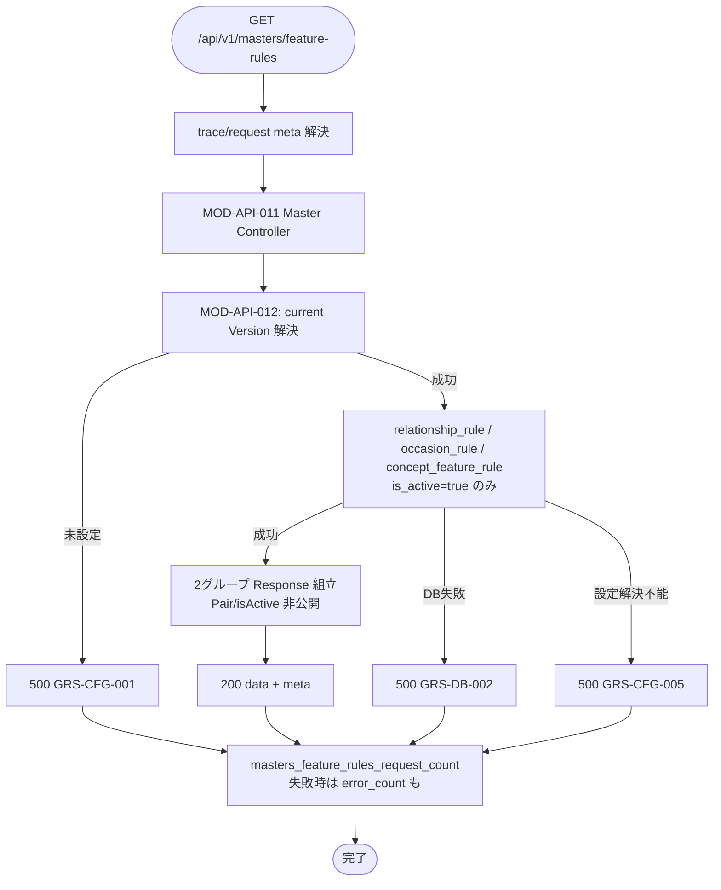

# Featureルール取得 API実装仕様書

> 本書は **API-PUB-008** の **実装面** 正本である。
> 契約面（Request / Response / Error / Validation の定義）は `API-PUB-008_Featureルール取得API契約仕様書.md` を正とし、本書では再掲しない。
> OpenAPI 正本は `packages/contracts/openapi/public-api.yaml`（#428 / PR #429 develop 反映済み）。generated / Orval / apps 実装の本格整備は後続 Task。本書は docs のみ。

## 1. ドキュメント情報

| 項目           | 内容                                      |
| -------------- | ----------------------------------------- |
| ドキュメントID | `API-PUB-008-IMPLEMENTATION`              |
| ドキュメント名 | Featureルール取得 API実装仕様書           |
| 対象システム   | Gift Recommendation Service MVP（Public） |
| MVP対象        | `○`                                       |
| 作成日         | 2026-07-12                                |
| 更新日         | 2026-07-12（AI Review 指摘反映）          |

---

## 2. 前提契約

| 項目 | 内容 |
| ---- | ---- |
| 対象API ID | `API-PUB-008` |
| API名 | Featureルール取得 |
| Method / Endpoint | `GET` `/api/v1/masters/feature-rules` |
| API契約仕様書 | `docs/06_実装設計/api/API-PUB-008_Featureルール取得API契約仕様書.md` |
| OpenAPI定義 | `packages/contracts/openapi/public-api.yaml`（`operationId: getFeatureRuleMasters`） |
| テーブル定義 | `relationship_rule` / `occasion_rule` / `concept_feature_rule` / `semantic_config_version`（各テーブル定義書） |
| Contract Gate | **契約仕様書確定済み**（#404 / PR #408）。**OpenAPI 断片反映済み**（#428 / PR #429）。Orval / generated の全面追随は consumer（SCR-002）側 Task で確認 |

> 契約面の Request / Response schema、Validation、Error 一覧は契約仕様書を参照する。本書では実装判断に必要な処理フロー・MOD 責務・DB マッピング・エラー境界のみ記載する。

---

## 3. 実装方針

### 3.1 全体方針

| 観点 | 方針 |
| ---- | ---- |
| Provider | `apps/api`（`apps/api/src/app/masters/**`） |
| Consumer | `apps/web`（SCR-002）。本 Task では実装しない |
| Web フレームワーク | **Express**（`apps/api` 既存スタック） |
| 担当モジュール | **MOD-API-011** Master Controller / **MOD-API-012** Master Repository |
| 責務分離 | HTTP I/F（meta 解決・Version 解決・Rule 読取・Response 組立）のみ。推薦パイプラインは呼び出さない |
| 認証 | **MVP は非認証**。`Authorization` 検証なし |
| 冪等性 | 副作用なし（SELECT のみ） |
| Pair / normalization | **Public Response に含めない** |
| キャッシュ | **MVP 既定: 都度 SELECT**（§11 未決） |

### 3.2 エンドポイント層の配置

PUB-005 / PUB-006 により `createMastersRouter()` は既に `/api/v1/masters` へ mount 済み。本 API は同一 Router へ `GET /feature-rules` を追加する。

```text
apps/api/src/app/masters/
├── routes.ts                         # createMastersRouter(): + GET /feature-rules
├── feature-rules-controller.ts       # MOD-API-011（本 API 受付・Response 組立）※ファイル名は実装 Task で調整可
├── feature-rule-repository.ts        # MOD-API-012（Version + Rule 読取）
├── relationship-repository.ts        # 既存（PUB-005）
├── occasion-repository.ts            # 既存（PUB-006）
└── ...
```

| モジュール | 責務（本 API） |
| ---------- | -------------- |
| MOD-API-011 Master Controller | `GET /feature-rules` 受付、meta 解決、Repository 呼び出し、成功 / 失敗 Response 組立、metric 境界 |
| MOD-API-012 Master Repository | current Semantic Config Version 解決後、active な `relationship_rule` / `occasion_rule` / `concept_feature_rule` を読取り、内部 DTO を返却 |

**共通化メモ（推奨・未確定）:** Version 解決は API-PUB-007 と重複しうる。本仕様書は Feature Rule 読取に閉じ、共通モジュール化は §11。

### 3.3 DI / 依存

| 項目 | 方針 |
| ---- | ---- |
| request-meta | 既存 Trace / Request ID 解決を再利用 |
| DB | Postgres。接続文字列実値をログ・Response に出さない |
| Reco Client | **使用しない** |
| pair_rule / normalization | **参照しない**（Public 非公開） |

### 3.4 認証（実装面）

| 項目 | 方針 |
| ---- | ---- |
| 方式 | MVP 非認証。認証 middleware を本ルートに適用しない |

### 3.5 DB 読取（実装面）

#### 3.5.1 current Version 解決

| 項目 | 方針 |
| ---- | ---- |
| 正本テーブル | `semantic_config_version` + 親 `semantic_config`（`semantic_config_version_テーブル定義書` §5.2 / §5.3.1） |
| 解決階層（2 段階） | **第 1 層**: 親 `semantic_config.is_active = true` の系列のみ対象。**第 2 層**: 対象系列内で `semantic_config_version.is_current = true` の version 行を解決 |
| `configName` | 本テーブルに保持しない。`semantic_config_version` と `semantic_config` を `semantic_config_id` で **アプリ層 JOIN** し、親 `semantic_config.config_name` を取得する |
| `versionLabel` | `semantic_config_version.version_label` をそのまま Response へ |
| 成功時 | `configName` / `versionLabel` を Response `data` に載せる（API-PUB-007 と一致する composite 参照） |
| 未設定 | **HTTP 500 `GRS-CFG-001`**（空配列とは区別。契約確定） |

**参照クエリ例（api・概念）:**

```sql
SELECT scv.*, sc.config_name
FROM semantic_config_version scv
INNER JOIN semantic_config sc ON sc.semantic_config_id = scv.semantic_config_id
WHERE sc.is_active = true
  AND scv.is_current = true;
```

> 系列が `is_active = false` の場合、その系列に属する version は解決対象外とする。`semantic_config_version_id`（UUID）は内部参照専用で Public Response に含めない。

#### 3.5.2 Rule 読取

| ソース | Response 配置 | フィルタ | 投影（概要） |
| ---- | ---- | ---- | ---- |
| `relationship_rule` | `baseValueRules`（`ruleType: relationship`） | current Version 紐づき・`is_active=true` | relationshipCode / featureCode / featureBaseValue |
| `occasion_rule` | `baseValueRules`（`ruleType: occasion`） | 同上 | occasionCode / featureCode / featureBaseValue |
| `concept_feature_rule` | `conceptFeatureRules` | 同上 | conceptCode / featureCode / featureDelta / polarity(optional) |

| 項目 | 方針 |
| ---- | ---- |
| inactive | Response に含めない（`isActive` フィールドも出さない） |
| 各配列 0 件 | **HTTP 200** + 空配列（Version 解決成功が前提） |
| Pair 等 | `pair_rule` / `input_type_rule` / `feature_integration_rule` は読まない |

**空配列 / `GRS-CFG-001` / `GRS-CFG-005` 境界:**

| 状況 | HTTP / Code |
| ---- | ----------- |
| current Version 解決成功・各 Rule 0 件 | 200 / 空配列 |
| current Version 未設定 | 500 `GRS-CFG-001` |
| DB 到達不可・クエリ失敗 | 500 `GRS-DB-002` 等 |
| Version はあるが Rule 参照処理が設定不備で継続不能 | 500 `GRS-CFG-005` |

---

## 4. 処理概要

### 4.1 処理フロー



### 4.2 処理詳細

1. **meta 解決:** `X-Trace-Id` / `X-Request-Id` は任意（現行 middleware の採番方針に従う）。
2. **Controller:** 認証なし。Body / Path / Query なし。未知 Query は契約どおり扱える範囲で無視または `GRS-REQ-001`（契約 §7.2）。
3. **Version 解決:** current が無ければ `GRS-CFG-001` で終了。
4. **Rule 読取:** 3 テーブルから active 行のみ取得し、`baseValueRules` / `conceptFeatureRules` にマッピング。
5. **成功 Response:** `data.configName` / `versionLabel` / 2 配列 + `meta`。
6. **metric:** `masters_feature_rules_request_count`（完了時）。エラー時は `masters_feature_rules_error_count` も。

---

## 5. データ項目マッピング

### 5.1 Request Mapping

| Request項目 | 内部項目 / DTO | 変換内容 | 備考 |
| ----------- | -------------- | -------- | ---- |
| （Body） | — | なし | GET |
| `X-Trace-Id` | `meta.trace_id` | 任意 | Response と一致 |
| `X-Request-Id` | `meta.request_id` | 任意 | 現行 middleware 方針に従う |
| Path / Query | — | なし | — |

### 5.2 Response Mapping（成功・200）

| 内部項目 / DTO | Response項目 | 変換内容 | 備考 |
| -------------- | ------------ | -------- | ---- |
| 親 `semantic_config.config_name` | `data.configName` | JOIN 後そのまま | §3.5.1。API-PUB-007 整合 |
| `semantic_config_version.version_label` | `data.versionLabel` | そのまま | 例: `v1.0.0` |
| `relationship_rule.relationship_code` | `data.baseValueRules[].relationshipCode` | snake → camel | `ruleType=relationship` 時必須 |
| `relationship_rule.feature_code` | `data.baseValueRules[].featureCode` | snake → camel | MVP 8 軸 |
| `relationship_rule.feature_base_value` | `data.baseValueRules[].featureBaseValue` | numeric | 0.0〜1.0 |
| `occasion_rule.occasion_code` | `data.baseValueRules[].occasionCode` | snake → camel | `ruleType=occasion` 時必須 |
| `occasion_rule.feature_code` | `data.baseValueRules[].featureCode` | snake → camel | MVP 8 軸 |
| `occasion_rule.feature_base_value` | `data.baseValueRules[].featureBaseValue` | numeric | 0.0〜1.0 |
| （派生）`ruleType` | `data.baseValueRules[].ruleType` | `relationship` / `occasion` | DB 列ではなく読取元テーブルで決定 |
| `semantic_concept.concept_code`（`semantic_concept_id` JOIN） | `data.conceptFeatureRules[].conceptCode` | JOIN 後 snake → camel | concept_feature_rule テーブル定義書 §8.1 |
| `concept_feature_rule.feature_code` | `data.conceptFeatureRules[].featureCode` | snake → camel | MVP 8 軸 |
| `concept_feature_rule.feature_delta` | `data.conceptFeatureRules[].featureDelta` | numeric | 0.0〜1.0 |
| `concept_feature_rule.polarity` | `data.conceptFeatureRules[].polarity` | そのまま | optional |
| （フィルタ専用）`is_active` | — | **Response に含めない** | 3 Rule テーブル共通 |
| pair_rule 等 | — | **含めない** | Public 非公開 |
| — | `meta.traceId` / `requestId` / `generatedAt` | meta から | — |

### 5.3 Error Mapping（実装面）

| 内部状況 | HTTP | Error Code | 備考 |
| -------- | ---: | ---------- | ---- |
| current Version 未設定 | 500 | `GRS-CFG-001` | 空配列と区別 |
| マスタ設定解決不能 | 500 | `GRS-CFG-005` | Rule 参照処理が継続不能 |
| DB 接続失敗 | 500 | `GRS-DB-001` | エラーコード定義書 §19 正本。契約 Error 表 §8.2 と一致 |
| DB 読取失敗 | 500 | `GRS-DB-002` | 接続成功後のクエリ失敗 |
| DB 一時不可 | 503 | `GRS-DB-001` | 契約 Error 表 §8.2。同一 code で HTTP のみ 503 に分岐 |
| 設定系想定外 | 500 | `GRS-CFG-999` | — |
| 想定外 | 500 | `GRS-COM-999` | — |

> **`GRS-DB-001` の HTTP 分岐:** エラーコード定義書は接続失敗を **500** とする。契約仕様書 §8.2 は接続失敗 **500** と一時不可 **503** の両方に `GRS-DB-001` を割り当てる。実装では障害種別（接続失敗 vs 一時不可）に応じて HTTP を切り分ける。本 Task では契約・エラーコード定義書を正とし、OpenAPI / Contract 変更は行わない。

詳細メッセージは契約仕様書・エラーコード定義書を正とする。

---

## 6. generated client 利用方針

| 項目 | 内容 |
| ---- | ---- |
| generated出力先 | `apps/web/src/generated/api/`（本 Task では再生成しない） |
| operationId | `getFeatureRuleMasters` |
| client wrapper | `apps/web/src/lib/**`（SCR-002 実装 Task） |
| 再生成 / 検証 | 本 Task では実行しない |

---

## 7. provider / consumer 実装影響

### 7.1 provider

| 項目 | 内容 |
| ---- | ---- |
| provider | `apps/api` |
| 影響有無 | `あり`（後続実装 Task） |
| 必要対応 | `createMastersRouter` へ `/feature-rules` 追加、Feature Rule Repository、Version 解決、metric / error 配線 |

### 7.2 consumer

| 項目 | 内容 |
| ---- | ---- |
| consumer | `apps/web`（SCR-002） |
| 影響有無 | `あり`（SCR-002 実装 Task。本 Task 対象外） |
| 必要対応 | generated client 経由で並列 GET（PUB-005〜008） |

---

## 8. ログ・監視

| 種別 | 内容 | 出力タイミング | 備考 |
| ---- | ---- | -------------- | ---- |
| API access log | method / path / status / latency / trace_id | 完了時 | secret 非含有 |
| error log | error.code / 内部要約 / trace_id | 5xx | SQL・接続文字列非公開 |
| audit log | なし | — | 参照のみ・非認証 |
| metric | `masters_feature_rules_request_count` | 完了時 | API一覧 |
| metric | `masters_feature_rules_error_count` | エラー時 | API一覧 |

---

## 9. 実装テスト観点

|  No | 観点 | 確認内容 | 種別 |
| --: | ---- | -------- | ---- |
| 1 | 正常系 | Version + 2 グループが契約外形どおり | integration |
| 2 | 空配列 | Version 成功・各配列 0 件で 200 | integration |
| 3 | inactive / Pair 非公開 | Response に含まれない | integration |
| 4 | Version 未設定 | 500 `GRS-CFG-001` | integration |
| 5 | DB 失敗 | 500 `GRS-DB-002` | integration |
| 6 | 設定解決不能 | 500 `GRS-CFG-005` | integration |
| 7 | meta / metric | trace 伝播・request/error_count | unit / integration |
| 8 | generated client | consumer Task | typecheck |
| 9 | SCR-002 | 画面 Task | manual |

> 本 Task ではテストコードを追加しない。

---

## 10. 変更履歴

| 日付 | 変更内容 | 関連Issue / PR |
| ---- | -------- | -------------- |
| 2026-07-12 | 初版作成 | #1190 |
| 2026-07-12 | AI Review 指摘反映（§3.5.1 Version 2 段階解決・configName JOIN、§5.2 DB snake 列名、§5.3 `GRS-DB-001` HTTP 整合） | #1190 / PR #1191 |

---

## 11. 未決事項

|  No | 論点 | 判断が必要な理由 | 判断者 | 期限 | 備考 |
| --: | ---- | ---------------- | ------ | ---- | ---- |
| 1 | Version 解決を PUB-007 と共通モジュールにするか | 重複実装・依存方向 | Human | 実装 Task 開始前 | 本仕様書は Feature Rule に閉じる |
| 2 | Feature Rule Repository の分割粒度（1 class vs テーブル別） | DI・UT しやすさ | Human | 実装 Task 開始前 | 推奨: 1 Repository 内で 3 読取 |
| 3 | プロセス内キャッシュ導入 | 性能・鮮度 | Human | 実装 Task 開始前 | 既定: 都度 SELECT |
| 4 | `baseValueRules` 並び順 | UI 安定性 | Human | 任意 | 推奨: ruleType → code → featureCode |

---

## 12. 関連資料

| 種別 | パス / URL | 用途 |
| ---- | ---------- | ---- |
| 契約仕様書 | `docs/06_実装設計/api/API-PUB-008_Featureルール取得API契約仕様書.md` | 前提契約 |
| テーブル定義 | `relationship_rule` / `occasion_rule` / `concept_feature_rule` / `semantic_config_version` | 読取条件 |
| OpenAPI | `packages/contracts/openapi/public-api.yaml` | `getFeatureRuleMasters` |
| API一覧 | `docs/05_アプリケーション設計/アプリ/api/API一覧.md` | metric / Pair 非公開 |
| モジュール一覧 | `docs/05_アプリケーション設計/アプリ/モジュール一覧.md` | MOD-API-011 / 012 |
| Task Definition | `prompts/definitions/tasks/api-pub-008-feature-rule-masters/api-implementation-spec.yaml` | 本 Task 条件 |
| 親 Epic | #390 | 作業管理 |

---

## 13. レビュー観点

- 確定済み契約 / OpenAPI と実装方針が整合している
- current Version 解決と Rule 読取・2 グループ組立が明確である
- 空配列 / `GRS-CFG-001` / `GRS-CFG-005` 境界が契約と一致している
- Pair / isActive 非公開が明記されている
- OpenAPI / apps 実装変更を本 Task に含めていない
- secret / `.env` 実値が含まれていない
- §11 未決事項が明示されている

---

## 14. 備考

- Phase4b 縦串 1/3。後続は apps/api 実装 → 単体テスト → Epic PR → develop。
- Task PR target は親 Epic Branch `feature/epic-390-pub-008-feature-rule-masters`。
- スタイル参考: API-PUB-005 / API-PUB-006 実装仕様書。既存 masters Router への追加を前提とする。
