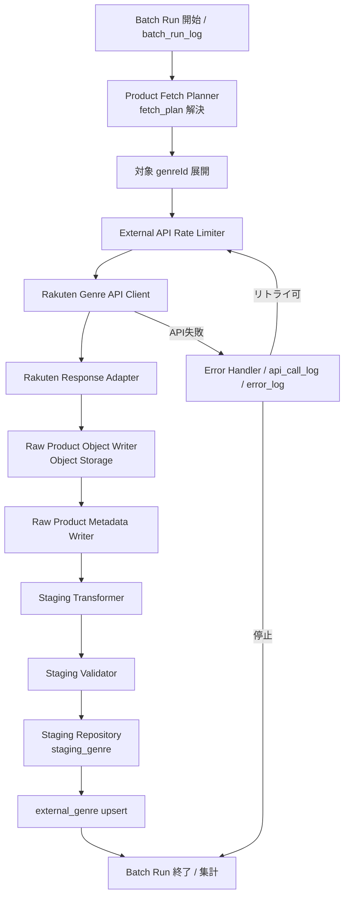

# BATCH-001 楽天ジャンル同期バッチ仕様書

## 1. ドキュメント情報

| 項目           | 内容                                 |
| -------------- | ------------------------------------ |
| ドキュメントID | `BATCH-001`                          |
| ドキュメント名 | 楽天ジャンル同期バッチ仕様書         |
| 対象システム   | Gift Recommendation Service / batch  |
| MVP対象        | `○`                                  |
| 作成日         | 2026-07-12                           |
| 更新日         | 2026-07-12                           |

---

## 2. 概要

BATCH-001（楽天ジャンル同期Batch）は、楽天ジャンル検索APIからジャンル階層・ジャンル参照情報を取得し、外部ジャンルマスタ（`external_genre`）および関連する Raw / Staging データとして保存する Batch である。

本 Batch は Phase4b Fetch レーン（B1）の起点であり、BATCH-002（ランキング）および BATCH-003（商品疑似差分取得）が参照するジャンル解決の前提を提供する。

---

## 3. 目的

| No | 目的 |
| -: | ---- |
| 1 | 楽天市場のジャンル階層を外部参照マスタとして同期する |
| 2 | 取得対象ジャンルの名称解決・親子関係把握を可能にする |
| 3 | BATCH-002 / BATCH-003 のジャンル指定・取得計画（fetch_plan）の前提を整備する |
| 4 | Raw JSON / Raw Metadata / Staging / external_genre への反映方針を実装可能な粒度で定義する |

---

## 4. バッチ基本情報

| 項目           | 内容 |
| -------------- | ---- |
| Batch ID       | `BATCH-001` |
| Batch名        | 楽天ジャンル同期Batch |
| 処理種別       | 外部マスタ同期 / Fetch |
| 実行基盤       | GitHub Actions workflow（`batch-rakuten-genre-sync.yml`） |
| 実装言語       | Python（`apps/batch`） |
| 起動方式       | `schedule` / `workflow_dispatch` |
| 実行頻度       | 週次または手動 |
| 想定実行時間   | 最大 30 分（スケジュール設計書の子 workflow 想定） |
| 冪等キー       | `source + external_genre_id` / `object_key` / `content_hash` |
| 先行Batch      | なし |
| 後続Batch      | `BATCH-002` / `BATCH-003`（必須依存の供給元）。`BATCH-005` は Raw 保存後の Staging 変換で本 Batch 出力を利用しうる |
| MVP対象        | `○` |

`Batch ID` は `BATCH-*` を使用する。処理構成上の分類IDである `BT-*` を Task / Issue / 成果物名の識別子として使用しない。

正本区分: 外部参照マスタ / Raw参照情報

---

## 5. 実行条件

### 5.1 トリガー

| トリガー | 利用有無 | 条件 | 備考 |
| -------- | -------- | ---- | ---- |
| schedule | `true` | 週次オーケストレータ（`batch-weekly-orchestrator.yml`）から子 workflow 起動 | バッチ実行スケジュール設計書 |
| workflow_dispatch | `true` | 手動実行（対象ジャンル指定可） | 失敗時の再実行・部分同期に利用 |
| 先行Batch完了 | `false` | 先行 Batch なし | Fetch チェーン起点 |
| retry-failed | `false` | MVP では workflow_dispatch による再実行を基本とする | 部分失敗時は対象 genreId を絞って再実行 |

### 5.2 実行前提

- Phase4a `batch-foundation`（#734）の infrastructure / application / config 骨格が利用可能であること
- 楽天ジャンル検索API用の認証情報（環境変数名のみ。実値は GitHub Secrets）が設定されていること
- Object Storage（Raw JSON 保存先）および Database（Metadata / Staging / external_genre / ログ）へ接続可能であること
- 取得対象ジャンルID一覧（fetch_plan / 設定）が定義されていること（MVP はギフト推薦に必要なジャンルから段階的に拡張）

---

## 6. 入力

### 6.1 入力データ

| 入力 | 種別 | 取得元 | 必須 | 用途 | 備考 |
| ---- | ---- | ------ | ---- | ---- | ---- |
| `fetch_plan` | 設定 / 計画 | Batch config / Product Fetch Planner | `true` | 取得対象 genreId・階層展開方針を決定する | MVP対象ジャンルを限定 |
| `target_genre_ids` | 設定 | fetch_plan / workflow_dispatch 入力 | `true` | 起点ジャンルIDの集合 | root は楽天仕様上 `0` |
| 楽天ジャンル検索APIレスポンス | 外部API | 楽天ジャンル検索API | `true` | ジャンル階層・名称・属性の取得 | formatVersion=`2` |

### 6.2 外部API

| API | 利用有無 | 用途 | Rate Limit / 制約 | 備考 |
| --- | -------- | ---- | ----------------- | ---- |
| 楽天ジャンル検索API | `true` | ジャンル階層・参照情報取得 | External API Rate Limiter で制御。`GRS-EXT-102` 時は pause / 再実行 | `genreId` / `format=json` / `formatVersion=2` |
| 楽天属性検索API | `false`（MVP） | ジャンル属性の詳細取得 | - | MVP 必須ではない。商品検索側の attribute を優先 |

#### 6.2.1 楽天ジャンル検索API 主なパラメータ

| パラメータ | 用途 | MVP方針 |
| ---------- | ---- | ------- |
| `applicationId` | 楽天API利用アプリID | 必須（secret） |
| `accessKey` | アクセスキー | 必須（secret） |
| `genreId` | 起点ジャンルID | 必須。root は `0` |
| `format` | レスポンス形式 | `json` |
| `formatVersion` | JSON構造 | `2` |

#### 6.2.2 主なレスポンス項目と内部扱い

| 出力項目 | 内容 | 本サービスでの扱い |
| -------- | ---- | ------------------ |
| `ancestors` | 親ジャンル群 | ジャンル階層管理 |
| `genre` | 現在ジャンル | ジャンル正本参照（`external_genre`） |
| `siblings` | 兄弟ジャンル | ジャンル探索補助 |
| `children` | 子ジャンル群 | バッチ対象ジャンル展開 |
| `attributes` | 属性情報 | 商品属性管理・Semantic 補助（必要範囲のみ） |
| `genreId` | ジャンルID | `external_genre_id` |
| `jaName` | 日本語ジャンル名 | 表示・管理・取得計画 |
| `level` | ジャンル階層 | 取得対象範囲の制御 |

### 6.3 環境変数

環境変数は名称のみ記載し、値は記載しない。

| 環境変数名 | 必須 | 用途 | secret区分 | 設定先 |
| ---------- | ---- | ---- | ---------- | ------ |
| `RAKUTEN_APPLICATION_ID` | `true` | 楽天API applicationId | secret | GitHub Secrets / local `.env`（commit禁止） |
| `RAKUTEN_ACCESS_KEY` | `true` | 楽天API accessKey | secret | GitHub Secrets / local `.env`（commit禁止） |
| `DATABASE_URL` | `true` | DB接続 | secret | GitHub Secrets / local `.env`（commit禁止） |
| `BATCH_OBJECT_STORAGE_*` | `true` | Raw JSON 保存先 | secret（接続情報） | GitHub Secrets / local `.env`（commit禁止） |
| `BATCH_FETCH_PLAN_PATH` 等 | `false` | fetch_plan 設定パス | 非secret | config / workflow input |

※ 実環境の変数名は `apps/batch` config 実装に合わせて確定する。本仕様では用途と secret 区分のみを固定する。

---

## 7. 出力

### 7.1 出力データ

| 出力 | 種別 | 出力先 | 正本区分 | 用途 | 備考 |
| ---- | ---- | ------ | -------- | ---- | ---- |
| `raw_product_metadata` | Metadata | DB | Raw参照情報 | Raw 保存状態・hash・object_key 管理 | `source_api=genre` |
| Raw JSON（ジャンルレスポンス） | Object | Object Storage | Raw本体 | 再処理・監査 | path 方針は §10.2 |
| `staging_genre` | Staging | DB | 中間データ | 階層変換・検証結果 | BATCH-005 でも利用しうる |
| `external_genre` | 外部参照マスタ | DB | 外部参照マスタ | ジャンル名称・階層の正本参照 | BATCH-002/003 の必須前提 |

### 7.2 更新リソース

| リソース | 操作 | 更新条件 | 冪等性 | 備考 |
| -------- | ---- | -------- | ------ | ---- |
| `raw_product_metadata` | insert / update | API呼出成功・Raw保存後 | `object_key` / `content_hash` | `import_status` を更新 |
| Object Storage Raw | put | API呼出成功時 | `object_key` | 同一 key は上書きまたは skip 方針を実装で固定 |
| `staging_genre` | upsert | Staging 変換・検証成功時 | `source + external_genre_id` | Validator 通過後 |
| `external_genre` | upsert | Staging 反映成功時 | `source + external_genre_id` | 外部参照マスタの差分反映 |
| `batch_run_log` | insert / update | Run 開始・終了 | `batch_run_id` | 集計値更新 |
| `phase_log` | insert | Phase 境界 | `batch_run_id + phase` | |
| `api_call_log` | insert | 外部API呼出ごと | `api_call_log_id` | Rate Limit / 失敗記録 |
| `error_log` | insert | 失敗時 | - | secret 非含有 |
| `item_import_summary` | 集計対象 | BATCH-017 等が参照 | - | 本 Batch は件数をログへ残す |

---

## 8. 処理フロー

### 8.1 全体フロー

### 8.2 処理ステップ

|  No | Phase | 処理 | 入力 | 出力 | 失敗時の扱い |
| --: | ----- | ---- | ---- | ---- | ------------ |
| 1 | `plan` | fetch_plan / target genre を解決する | config / workflow input | 取得対象 genreId 一覧 | `GRS-BAT-*` で Run 失敗。設定見直し |
| 2 | `fetch` | 楽天ジャンル検索APIを呼び出す | genreId / secrets | APIレスポンス / api_call_log | Rate Limit は待機・再試行。タイムアウトはリトライ後に部分失敗または停止 |
| 3 | `adapt` | レスポンスを内部形式へ変換する | Rawレスポンス | 正規化ジャンル構造 | 形式不正は `GRS-EXT-103`。Raw保存可否を判断 |
| 4 | `raw_save` | Object Storage へ Raw JSON を保存し Metadata を書く | 正規化前/後レスポンス | object_key / raw_product_metadata | `GRS-RAW-001` / `GRS-RAW-002`。Run 失敗または部分失敗 |
| 5 | `stage` | Staging 変換・検証 | Raw / Metadata | staging_genre | `GRS-VAL-*` / `GRS-BAT-*`。失敗 genre は skip または Run 部分失敗 |
| 6 | `upsert` | external_genre へ upsert | staging_genre | external_genre | `GRS-DB-*`。ロールバックせず失敗記録 |
| 7 | `finalize` | 集計・batch_run_log 更新 | 各 Phase 結果 | run_status / counts | 部分成功は `GRS-BAT-002` |

---

## 9. データ変換・マッピング

| 入力項目 | 内部項目 | 出力項目 | 変換内容 | 備考 |
| -------- | -------- | -------- | -------- | ---- |
| `genreId` | `external_genre_id` | `external_genre.external_genre_id` | 文字列化して保存 | バッチ設計方針書 §8.6 |
| `jaName` / genreName | `genre_name` | `external_genre.genre_name` | 表示・取得計画用 | |
| parent genreId | `parent_external_genre_id` | `external_genre.parent_external_genre_id` | 階層管理 | ancestors / children から解決 |
| `level` | `genre_level` | `external_genre.genre_level` | 取得対象範囲制御 | |
| レスポンス全体 | Raw JSON | Object Storage object | そのまま保存（秘密情報は含めない） | Adapter 前の取得レスポンスを監査用に保持 |
| 正規化ジャンル行 | Staging row | `staging_genre` | Validator 通過後 | BATCH-005 でも再利用しうる中間形 |

---

## 10. DB / Storage更新仕様

### 10.1 DB更新

| テーブル | 操作 | 主キー / 一意キー | 更新項目 | 競合時の扱い | 備考 |
| -------- | ---- | ----------------- | -------- | ------------ | ---- |
| `external_genre` | upsert | `source + external_genre_id` | name / parent / level / 更新日時 等 | 同一キーは上書き（差分反映） | 外部参照マスタ |
| `staging_genre` | upsert | `source + external_genre_id`（Staging 単位） | 変換後属性・検証結果 | 再実行時は上書き | 中間データ |
| `raw_product_metadata` | insert / update | `raw_metadata_id` / `object_key` | hash / status / timestamps | 同一 object_key は status 更新 | `source_api=genre` |
| `batch_run_log` | insert / update | `batch_run_id` | status / counts | Run 単位で一意 | |
| `phase_log` | insert | `batch_run_id + phase` | status / duration | 追記 | |
| `api_call_log` | insert | `api_call_log_id` | status / latency | 追記 | 認証情報は保存しない |
| `error_log` | insert | - | code / summary | 追記 | secret / 個人情報を含めない |

### 10.2 Object Storage

| オブジェクト | 操作 | path / key 方針 | 保持方針 | 備考 |
| ------------ | ---- | --------------- | -------- | ---- |
| ジャンル Raw JSON | put | `raw/rakuten/genre/dt={yyyy-mm-dd}/batch_run_id={batch_run_id}/{api_call_log_id}.json` | Retention はログ・Observability / 運用方針に従う | バッチ設計方針書 §9.3 |

---

## 11. 冪等性・再実行性

| 観点 | 方針 |
| ---- | ---- |
| 冪等キー | `source + external_genre_id`（マスタ） / `object_key` / `content_hash`（Raw） |
| 重複実行時の扱い | 同一キーは upsert。Raw は同一 `content_hash` なら Metadata 更新のみ（本体再保存は実装判断で skip 可） |
| 部分失敗時の再実行 | 失敗した genreId のみを workflow_dispatch で再実行。成功済み genre は upsert で安全に再適用 |
| 成功済みデータの skip条件 | `content_hash` 一致かつ `import_status` が成功系の場合、Raw再取得を skip してよい（MVP 実装で選択） |
| rollback方針 | 分散更新のため自動 rollback しない。失敗は `error_log` / `import_status=failed` で追跡し、再実行で収束させる |

---

## 12. 状態管理

| 対象 | 状態値 | 遷移条件 | 記録先 | 備考 |
| ---- | ------ | -------- | ------ | ---- |
| Batch Run | `running` → `succeeded` / `partially_succeeded` / `failed` | finalize | `batch_run_log` | `GRS-BAT-001` / `GRS-BAT-002` |
| API Call | `succeeded` / `failed` / `rate_limited` 等 | 呼出結果 | `api_call_log` | |
| Raw Metadata | `raw_saved` →（後続）`staged` / `imported` / `skipped` / `failed` | Raw保存・後続処理 | `raw_product_metadata.import_status` | 本 Batch 内では少なくとも `raw_saved` まで |
| Phase | phase ごとの成功/失敗 | Phase 境界 | `phase_log` | |

---

## 13. エラー・リトライ仕様

| エラー種別 | Error Code | 発生条件 | リトライ | 停止条件 | 備考 |
| ---------- | ---------- | -------- | -------- | -------- | ---- |
| 外部API失敗 | `GRS-EXT-100` | 楽天APIエラー | 有（回数上限あり） | 上限超過で当該 genre 失敗 | api_call_log 記録 |
| 外部APIタイムアウト | `GRS-EXT-101` | タイムアウト | 有 | 上限超過で部分失敗/停止 | |
| Rate Limit | `GRS-EXT-102` | 429 | 待機後リトライ | 長時間継続時は Run 部分失敗 | Rate Limiter |
| レスポンス形式不正 | `GRS-EXT-103` | JSON/必須項目不正 | 無（設定見直し） | 当該 genre 失敗 | Raw保存可否判断 |
| リクエスト条件不正 | `GRS-EXT-105` | パラメータ不正 | 無 | 当該 genre 失敗 | fetch_plan 見直し |
| Raw保存失敗 | `GRS-RAW-001` | Object Storage 失敗 | 有 | 上限超過で失敗 | |
| Raw Metadata失敗 | `GRS-RAW-002` | DB書き込み失敗 | 有 | 上限超過で失敗 | |
| 検証失敗 | `GRS-VAL-*` | Staging Validator | 無 | 当該 genre skip/失敗 | |
| DB更新失敗 | `GRS-DB-*` | upsert 失敗 | 有 | 上限超過で失敗 | |
| Batch全体失敗 | `GRS-BAT-001` | 致命的失敗 | 手動再実行 | Run failed | |
| 部分成功 | `GRS-BAT-002` | 一部 genre のみ失敗 | 失敗分を再実行 | Run partially_succeeded | |
| 多重起動 | `GRS-BAT-003` | 同一Batch多重起動 | 無 | 起動拒否 | |

---

## 14. ログ・監視

| 種別 | 記録内容 | 出力タイミング | 保存先 | 備考 |
| ---- | -------- | -------------- | ------ | ---- |
| batch_run_log | Run全体の開始終了・件数・status | 開始/終了 | DB | |
| phase_log | Phase単位の結果 | Phase境界 | DB | |
| api_call_log | 外部API呼出の成否・latency | 呼出ごと | DB | Authorization / secret を記録しない |
| error_log | エラーコード・概要 | 失敗時 | DB | 個人情報・secret 非含有 |
| raw_product_metadata | object_key / hash / import_status | Raw保存時 | DB | |
| item_import_summary | 集計入力 | 後続 BATCH-017 | DB | 本 Batch は集計可能な件数を残す |

### 14.1 メトリクス

| Metric | 内容 | 集計単位 | 用途 |
| ------ | ---- | -------- | ---- |
| `genre_fetch_count` | API取得試行数 | batch_run | 進捗・コスト |
| `genre_upsert_success_count` | external_genre 成功件数 | batch_run | 品質 |
| `genre_upsert_failed_count` | 失敗件数 | batch_run | アラート |
| `api_rate_limit_count` | Rate Limit 発生回数 | batch_run | スロットリング調整 |

---

## 15. セキュリティ・外部サービス利用

| 観点 | 方針 |
| ---- | ---- |
| secret取り扱い | 楽天APIキー・DB接続情報は GitHub Secrets / local `.env` のみ。docs・ログ・PR・fixture に実値を書かない |
| 外部API key | server側（batch / GHA）のみで利用。client 公開禁止 |
| ログ出力制限 | request header・accessKey・Authorization・接続文字列をログに出さない |
| 個人情報・機微情報 | ジャンルマスタ同期では個人情報を扱わない。レスポンスに不要フィールドがあっても保存・ログしない |
| GitHub Actions permissions | contents / 必要最小の secrets 参照に限定。`write-all` 禁止 |
| コスト・Rate Limit | External API Rate Limiter 必須。週次スケジュールと手動再実行の同時多発を避ける |

---

## 16. テスト観点

|  No | 観点 | 確認内容 | 種別 |
| --: | ---- | -------- | ---- |
| 1 | 正常系 | 対象 genreId を取得し Raw / Staging / external_genre が更新される | unit / integration（fixture） |
| 2 | 階層展開 | children / ancestors から親子が正しくマッピングされる | unit |
| 3 | 冪等性 | 同一 Run 条件の再実行で重複行が増えない（upsert） | unit / integration |
| 4 | Rate Limit | 429 時に待機・再試行し、ログに `GRS-EXT-102` が残る | unit（mock） |
| 5 | API失敗 | 外部API失敗時に api_call_log / error_log が記録され、部分失敗方針に従う | unit（mock） |
| 6 | Raw失敗 | Object Storage 失敗で `GRS-RAW-001` となり Run が失敗または部分失敗になる | unit（mock） |
| 7 | secret非含有 | ログ・fixture・docs に APIキー実値が含まれない | review / unit |

---

## 17. 変更管理

### 17.1 変更履歴

| 日付 | 変更内容 | 関連Issue / PR |
| ---- | -------- | -------------- |
| 2026-07-12 | 初版作成 | #1162 |

---

## 18. 未決事項

|  No | 論点 | 判断が必要な理由 | 判断者 | 期限 | 備考 |
| --: | ---- | ---------------- | ------ | ---- | ---- |
| 1 | MVP初期の取得対象ジャンルID一覧 | 運用コストと推薦カバレッジのバランス | Human | 実装 Task 着手前 | 外部商品データ連携設計書の対象ジャンル方針に従う |
| 2 | BATCH-001 内で Staging→external_genre まで完結するか、Staging のみ行い BATCH-005 に委譲するか | 処理一覧上は本 Batch 出力に staging_genre / external_genre を含む。実装分割はモジュール責務と合わせる | Human | 実装 Task 設計時 | 本仕様は一覧どおり本 Batch 内完結を基本案とする |
| 3 | `content_hash` 一致時の Raw 再保存 skip の採用 | コスト削減と監査要件のトレードオフ | Human | 実装時 | §11 で許容 |

---

## 19. 関連資料

| 種別 | パス / URL | 用途 |
| ---- | ---------- | ---- |
| 正本一覧 | `docs/05_アプリケーション設計/アプリ/batch/バッチ処理一覧.md` | Batch ID・入出力・依存 |
| 設計方針 | `docs/05_アプリケーション設計/アプリ/batch/バッチ設計方針書.md` | Raw/Staging・冪等・モジュール |
| 依存関係 | `docs/05_アプリケーション設計/アプリ/batch/バッチ依存関係図.md` | BATCH-002/003 必須依存 |
| スケジュール | `docs/05_アプリケーション設計/アプリ/batch/バッチ実行スケジュール設計書.md` | workflow・週次 |
| 外部連携 | `docs/05_アプリケーション設計/アプリ/外部商品データ連携設計書.md` | 楽天ジャンル検索API |
| エラー | `docs/05_アプリケーション設計/アプリ/エラーコード定義書.md` | GRS-EXT/RAW/BAT/DB/VAL |
| テンプレート | `prompts/templates/docs/batch-spec.md` | 章構成 |
| Task Definition | `prompts/definitions/tasks/batch-001-rakuten-genre-sync/batch-spec.yaml` | 本成果物の作業条件 |
| Epic | #1161 `[Epic]BATCH-001:楽天ジャンル同期Batch` | 親 Epic |

---

## 20. レビュー観点

- `BATCH-001` の識別子とバッチ処理一覧が一致している
- 入力、出力、更新リソース、冪等キーが明確である
- 外部API、DB、Object Storage、ログの責務が明確である
- 後続 BATCH-002 / BATCH-003 への必須依存（`external_genre`）が明記されている
- 再実行時に重複登録や不整合が起きない方針になっている
- secretや`.env`実値が含まれていない
- `BT-*` を識別子として使用していない

---

## 21. 備考

- 本仕様書は実装・単体テスト Task の入力正本とする
- workflow YAML（`batch-rakuten-genre-sync.yml`）本体の作成は実装 Task 側で扱う（本 Task の out_of_scope）
- Contract Gate は不要（Batch は HTTP API 化しない）
- 編集領域の競合回避: `apps/batch/src/batch/infrastructure/**` の同一 submodule を他 Batch Epic と同時編集しない
