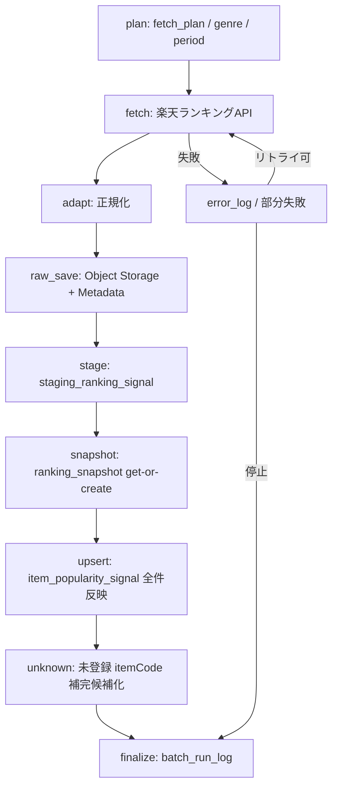

# BATCH-002 楽天ランキングスナップショット取得バッチ仕様書

## 1. ドキュメント情報

| 項目           | 内容                                           |
| -------------- | ---------------------------------------------- |
| ドキュメントID | `BATCH-002`                                    |
| ドキュメント名 | 楽天ランキングスナップショット取得バッチ仕様書 |
| 対象システム   | Gift Recommendation Service / batch            |
| MVP対象        | `○`                                            |
| 作成日         | 2026-07-13                                     |
| 更新日         | 2026-07-13                                     |

---

## 2. 概要

BATCH-002（楽天ランキングスナップショット取得Batch）は、楽天商品ランキングAPIからジャンル別ランキング結果を取得し、`ranking_snapshot` 単位で順位明細を全件反映する Batch である。

本 Batch は Phase4b Fetch レーン（B1）の第2段であり、先行 BATCH-001 が同期した `external_genre` を前提に target genre を解決する。未登録 `itemCode` は Item 正本を作らず補完候補として残し、BATCH-003（商品疑似差分取得）へ引き継ぐ。

正本区分: 外部観測正本 / スナップショット

---

## 3. 目的

| No | 目的 |
| -: | ---- |
| 1 | ジャンル別ランキングを再現可能な Snapshot（ヘッダ）として保存する |
| 2 | 順位明細を `item_popularity_signal` として全件反映し、popularity 補助シグナルを提供する |
| 3 | Raw JSON / Raw Metadata / Staging（`staging_ranking_signal`）への反映方針を実装可能な粒度で定義する |
| 4 | 未登録 `itemCode` を Fetch Candidate 化し、BATCH-003 の補完入力とする |
| 5 | Item 正本（名称・価格・画像等）はランキングAPIレスポンスから作らない境界を明示する |

---

## 4. バッチ基本情報

| 項目           | 内容 |
| -------------- | ---- |
| Batch ID       | `BATCH-002` |
| Batch名        | 楽天ランキングスナップショット取得Batch |
| 処理種別       | 外部観測取得 / Snapshot 反映 / Fetch |
| 実行基盤       | GitHub Actions workflow（`batch-rakuten-ranking-snapshot.yml`） |
| 実装言語       | Python（`apps/batch`） |
| 起動方式       | `schedule` / `workflow_dispatch` |
| 実行頻度       | 日次または手動（週次オーケストレータでは日次相当として実行しうる） |
| 想定実行時間   | 最大 30〜60 分（対象ジャンル数・ページ数に依存） |
| 冪等キー       | `ranking_snapshot`: `source + external_genre_id + period + last_build_date` `item_popularity_signal`: `ranking_snapshot_id + rank` Raw: `object_key` / `content_hash` |
| 先行Batch      | `BATCH-001`（ジャンル同期。target_genre 解決の前提） |
| 後続Batch      | `BATCH-003`（未登録 itemCode 補完）/ `BATCH-017`（Import Summary）。`BATCH-005` は Raw 保存後の Staging 変換で本 Batch 出力を利用しうる |
| MVP対象        | `○` |

`Batch ID` は `BATCH-*` を使用する。処理構成上の分類IDである `BT-*` を Task / Issue / 成果物名の識別子として使用しない。

---

## 5. 実行条件

### 5.1 トリガー

| トリガー | 利用有無 | 条件 | 備考 |
| -------- | -------- | ---- | ---- |
| schedule | `true` | 日次 / 週次オーケストレータから子 workflow 起動 | バッチ実行スケジュール設計書（`batch-rakuten-ranking-snapshot.yml`） |
| workflow_dispatch | `true` | 手動実行（対象 genre / period 指定可） | 失敗時の再実行・部分同期に利用 |
| 先行Batch完了 | `true`（運用推奨） | 週次では `genre_sync` 成功後に起動しうる | 日次単独起動も可。ジャンル未同期時は設定済み genreId のみ |
| retry-failed | `false` | MVP では workflow_dispatch による再実行を基本とする | 失敗 genre / page を絞って再実行 |

### 5.2 実行前提

- Phase4a `batch-foundation`（#734）の infrastructure / application / config 骨格が利用可能であること
- 先行 BATCH-001 により取得対象ジャンルが `external_genre` に存在する、または fetch_plan に明示ジャンルIDがあること
- 楽天商品ランキングAPI用の認証情報（環境変数名のみ。実値は GitHub Secrets）が設定されていること
- Object Storage（Raw JSON）および Database（Metadata / Staging / ranking_snapshot / item_popularity_signal / ログ）へ接続可能であること
- `period` / 取得ページ上限 / 対象ジャンル一覧が設定されていること

---

## 6. 入力

### 6.1 入力データ

| 入力 | 種別 | 取得元 | 必須 | 用途 | 備考 |
| ---- | ---- | ------ | ---- | ---- | ---- |
| `fetch_plan` | 設定 / 計画 | Batch config / Product Fetch Planner | `true` | 対象 genre / period / ページ上限を決定する | MVP対象ジャンルを限定 |
| `target_genre_ids` | 設定 | fetch_plan / workflow_dispatch / `external_genre` | `true` | ランキング取得対象ジャンル | BATCH-001 同期済みを優先 |
| `period` | 設定 | fetch_plan / workflow_dispatch | `true` | ランキング期間 | 楽天API `period` に対応。未指定時の既定値は実装 Task で設定 |
| 楽天ランキングAPIレスポンス | 外部API | 楽天商品ランキングAPI | `true` | rank / itemCode / lastBuildDate 等 | formatVersion=`2` |

### 6.2 外部API

| API | 利用有無 | 用途 | Rate Limit / 制約 | 備考 |
| --- | -------- | ---- | ----------------- | ---- |
| 楽天商品ランキングAPI | `true` | ジャンル別ランキング取得 | External API Rate Limiter で制御。`GRS-EXT-102` 時は pause / 再実行 | `genreId` / `period` / `page` / `format=json` / `formatVersion=2` |
| 楽天商品検索API | `false`（本 Batch） | Item 正本取得 | - | 未登録 itemCode は BATCH-003 側で itemCode 指定取得 |

#### 6.2.1 楽天商品ランキングAPI 主なパラメータ

| パラメータ | 用途 | MVP方針 |
| ---------- | ---- | ------- |
| `applicationId` | 楽天API利用アプリID | 必須（secret） |
| `accessKey` | アクセスキー | 必須（secret） |
| `format` | レスポンス形式 | `json` |
| `formatVersion` | JSON構造 | `2` |
| `genreId` | ジャンル別ランキング | MVPで利用 |
| `period` | ランキング期間 | 必要に応じて利用（設定必須化は実装時判断） |
| `page` | ページ番号 | 取得上限内で制御 |
| `elements` | 取得項目制御 | 必要項目に絞る |
| `age` / `sex` | 年齢・性別 | MVP 対象外（後続検討） |
| `carrier` | PC / mobile | 原則 PC |

#### 6.2.2 本サービスで利用する主な出力項目

| 出力項目 | 本サービスでの扱い |
| -------- | ------------------ |
| `rank` | `item_popularity_signal` の順位 |
| `lastBuildDate` | Snapshot 観測キー・鮮度 |
| `itemCode` | 外部商品コード。Item 突合キー / 未登録時は補完候補 |

#### 6.2.3 ランキングAPIでは正本反映しない項目

`itemName` / `catchcopy` / `itemCaption` / `itemPrice` / `itemUrl` / 画像URL / `availability` / `reviewAverage` / `reviewCount` 等は **Item / Item Image 正本に反映しない**。商品検索API（BATCH-003 以降）由来を正とする（外部商品データ連携設計書 §4.3.4）。

---

## 7. 出力

### 7.1 出力データ

| 出力 | 種別 | 保存先 | 必須 | 用途 | 備考 |
| ---- | ---- | ------ | ---- | ---- | ---- |
| Raw JSON | Object | Object Storage | `true` | 監査・再変換 | `source_api=item_ranking` |
| `raw_product_metadata` | DB | database | `true` | Raw 参照・import_status | |
| `staging_ranking_signal` | DB | database | `true`（本 Batch 内完結案） | Staging 中間 | BATCH-005 経路と併記可。§18 |
| `ranking_snapshot` | DB | database | `true` | 観測ヘッダ | 冪等キー §11 |
| `item_popularity_signal` | DB | database | `true` | 順位明細 | `ranking_snapshot_id + rank` |
| 未登録 itemCode 補完候補 | DB / キュー / ログ集計 | database / fetch_cursor 等 | `true` | BATCH-003 入力 | Item は作らない |
| `batch_run_log` / `phase_log` / `api_call_log` / `error_log` | DB | database | `true` | 運用・再実行 | |

### 7.2 後続への引き渡し

| 後続 | 引き渡し内容 | 条件 |
| ---- | ------------ | ---- |
| BATCH-003 | 未登録 `itemCode` 補完候補 | ランキングに出現し Item 未解決 |
| BATCH-005 | Raw / Metadata（および Staging 未完了分） | Raw 保存後の Staging 変換が分離される場合 |
| BATCH-017 | Run 集計入力（件数・status） | Import Summary |
| reco | 最新 Snapshot 経由の人気補助 | Online は全履歴を直接参照しない |

---

## 8. 処理フロー

### 8.1 概要フロー

### 8.2 処理ステップ

|  No | Phase | 処理 | 入力 | 出力 | 失敗時の扱い |
| --: | ----- | ---- | ---- | ---- | ------------ |
| 1 | `plan` | fetch_plan / target genre / period / page 上限を解決する | config / workflow input / external_genre | 取得計画 | `GRS-BAT-*` で Run 失敗 |
| 2 | `fetch` | 楽天ランキングAPIを呼び出す（genre × page） | genreId / period / secrets | APIレスポンス / api_call_log | Rate Limit は待機・再試行。タイムアウトはリトライ後に部分失敗または停止 |
| 3 | `adapt` | レスポンスを内部形式へ変換する | Rawレスポンス | 正規化 ranking rows | 形式不正は `GRS-EXT-103` |
| 4 | `raw_save` | Object Storage へ Raw JSON を保存し Metadata を書く | レスポンス | object_key / raw_product_metadata | `GRS-RAW-001` / `GRS-RAW-002` |
| 5 | `stage` | Staging 変換・検証 | Raw / Metadata | staging_ranking_signal | `GRS-VAL-*`。失敗 genre は skip または部分失敗 |
| 6 | `snapshot` | ranking_snapshot を get-or-create | 観測キー | ranking_snapshot_id | `GRS-DB-*` |
| 7 | `upsert` | item_popularity_signal を全件冪等反映 | staging / 正規化行 | item_popularity_signal | `GRS-DB-*`。ロールバックせず失敗記録 |
| 8 | `unknown` | 未登録 itemCode を補完候補化 | itemCode × item 突合 | Fetch Candidate / 候補リスト | Item は作らない |
| 9 | `finalize` | 集計・batch_run_log 更新 | 各 Phase 結果 | run_status / counts | 部分成功は `GRS-BAT-002` |

---

## 9. データ変換・マッピング

| 入力項目 | 内部項目 | 出力項目 | 変換内容 | 備考 |
| -------- | -------- | -------- | -------- | ---- |
| `genreId` | `external_genre_id` | `ranking_snapshot.external_genre_id` | 文字列化 | |
| `period` | `period` | `ranking_snapshot.period` | 観測キー構成 | |
| `lastBuildDate` | `last_build_date` | `ranking_snapshot.last_build_date` | 鮮度・冪等キー | |
| `rank` | `rank` | `item_popularity_signal.rank` | 整数 | |
| `itemCode` | `external_item_code` | `item_popularity_signal.external_item_code` | Item 突合。未解決時は NULL item_id 許容方針に従う | テーブル定義書 |
| レスポンス全体 | Raw JSON | Object Storage object | そのまま保存（秘密情報は含めない） | path は §10.2 |
| 正規化行 | Staging row | `staging_ranking_signal` | Validator 通過後 | BATCH-005 でも再利用しうる |

---

## 10. DB / Storage更新仕様

### 10.1 DB更新

| テーブル | 操作 | 主キー / 一意キー | 更新項目 | 競合時の扱い | 備考 |
| -------- | ---- | ----------------- | -------- | ------------ | ---- |
| `ranking_snapshot` | get-or-create / upsert | `source + external_genre_id + period + last_build_date` | 観測ヘッダ | 同一キーは既存 ID 再利用 | Snapshot 正本 |
| `item_popularity_signal` | upsert | `ranking_snapshot_id + rank` | item 紐づけ / external_item_code / 補助列 | 同一キーは上書き | 明細全件反映 |
| `staging_ranking_signal` | upsert | Staging 単位キー（source + 外部ID等） | 変換後属性・検証結果 | 再実行時は上書き | 中間データ |
| `raw_product_metadata` | insert / update | `raw_metadata_id` / `object_key` | hash / status / timestamps | 同一 object_key は status 更新 | `source_api=item_ranking` |
| `batch_run_log` | insert / update | `batch_run_id` | status / counts | Run 単位で一意 | |
| `phase_log` | insert | `batch_run_id + phase` | status / duration | 追記 | |
| `api_call_log` | insert | `api_call_log_id` | status / latency | 追記 | 認証情報は保存しない |
| `error_log` | insert | - | code / summary | 追記 | secret / 個人情報を含めない |

### 10.2 Object Storage

| オブジェクト | 操作 | path / key 方針 | 保持方針 | 備考 |
| ------------ | ---- | --------------- | -------- | ---- |
| ランキング Raw JSON | put | `raw/rakuten/item_ranking/dt={yyyy-mm-dd}/batch_run_id={batch_run_id}/{api_call_log_id}.json` | Retention は運用方針に従う | 外部商品データ連携設計書 §9 系 |

---

## 11. 冪等性・再実行性

| 観点 | 方針 |
| ---- | ---- |
| 冪等キー | Snapshot: `source + external_genre_id + period + last_build_date` 明細: `ranking_snapshot_id + rank` Raw: `object_key` / `content_hash` |
| 重複実行時の扱い | 同一観測キーは既存 Snapshot を再利用し、明細を全件冪等反映 |
| 部分失敗時の再実行 | 失敗 genre / page のみを workflow_dispatch で再実行 |
| 成功済みデータの skip条件 | `content_hash` 一致かつ `import_status` が成功系の場合、Raw再取得を skip してよい（MVP 実装で選択） |
| rollback方針 | 分散更新のため自動 rollback しない。失敗は `error_log` で追跡し、再実行で収束させる |

---

## 12. 状態管理

| 対象 | 状態値 | 遷移条件 | 記録先 | 備考 |
| ---- | ------ | -------- | ------ | ---- |
| Batch Run | `running` → `succeeded` / `partially_succeeded` / `failed` | finalize | `batch_run_log` | `GRS-BAT-001` / `GRS-BAT-002` |
| API Call | `succeeded` / `failed` / `rate_limited` 等 | 呼出結果 | `api_call_log` | |
| Raw Metadata | `raw_saved` →（後続）`staged` / `imported` / `skipped` / `failed` | Raw保存・後続処理 | `raw_product_metadata.import_status` | |
| Ranking Snapshot | 作成 / 再利用 | get-or-create | `ranking_snapshot` | |
| Phase | phase ごとの成功/失敗 | Phase 境界 | `phase_log` | |

---

## 13. エラー・リトライ仕様

| エラー種別 | Error Code | 発生条件 | リトライ | 停止条件 | 備考 |
| ---------- | ---------- | -------- | -------- | -------- | ---- |
| 外部API失敗 | `GRS-EXT-100` | 楽天APIエラー | 有（回数上限あり） | 上限超過で当該 genre/page 失敗 | api_call_log 記録 |
| 外部APIタイムアウト | `GRS-EXT-101` | タイムアウト | 有 | 上限超過で部分失敗/停止 | |
| Rate Limit | `GRS-EXT-102` | 429 | 待機後リトライ | 長時間継続時は Run 部分失敗 | Rate Limiter |
| レスポンス形式不正 | `GRS-EXT-103` | JSON/必須項目不正 | 無（設定見直し） | 当該単位失敗 | Raw保存可否判断 |
| リクエスト条件不正 | `GRS-EXT-105` | パラメータ不正 | 無 | 当該単位失敗 | fetch_plan 見直し |
| Raw保存失敗 | `GRS-RAW-001` | Object Storage 失敗 | 有 | 上限超過で失敗 | |
| Raw Metadata失敗 | `GRS-RAW-002` | DB書き込み失敗 | 有 | 上限超過で失敗 | |
| 検証失敗 | `GRS-VAL-*` | Staging Validator | 無 | 当該単位 skip/失敗 | |
| DB更新失敗 | `GRS-DB-*` | Snapshot / signal upsert 失敗 | 有 | 上限超過で失敗 | |
| Batch全体失敗 | `GRS-BAT-001` | 致命的失敗 | 手動再実行 | Run failed | |
| 部分成功 | `GRS-BAT-002` | 一部 genre/page のみ失敗 | 失敗分を再実行 | Run partially_succeeded | |
| 多重起動 | `GRS-BAT-003` | 同一Batch多重起動 | 無 | 起動拒否 | |

---

## 14. ログ・監視

| 種別 | 記録内容 | 出力タイミング | 保存先 | 備考 |
| ---- | -------- | -------------- | ------ | ---- |
| batch_run_log | Run全体の開始終了・件数・status | 開始/終了 | DB | |
| phase_log | Phase単位の結果 | Phase境界 | DB | |
| api_call_log | 外部API呼出の成否・latency | 呼出ごと | DB | Authorization / secret を記録しない |
| error_log | エラーコード・概要 | 失敗時 | DB | 個人情報・secret 非含有 |
| raw_product_metadata | object_key / hash / import_status | Raw保存時 | DB | |
| item_import_summary | 集計入力 | 後続 BATCH-017 | DB | 本 Batch は集計可能な件数を残す |

### 14.1 メトリクス

| Metric | 内容 | 集計単位 | 用途 |
| ------ | ---- | -------- | ---- |
| `ranking_fetch_count` | API取得試行数 | batch_run | 進捗・コスト |
| `ranking_snapshot_success_count` | Snapshot 成功件数 | batch_run | 品質 |
| `popularity_signal_upsert_count` | 明細反映件数 | batch_run | 品質 |
| `unknown_item_code_count` | 未登録 itemCode 件数 | batch_run | BATCH-003 補完量 |
| `api_rate_limit_count` | Rate Limit 発生回数 | batch_run | スロットリング調整 |

---

## 15. セキュリティ・外部サービス利用

| 観点 | 方針 |
| ---- | ---- |
| secret取り扱い | 楽天APIキー・DB接続情報は GitHub Secrets / local `.env` のみ。docs・ログ・PR・fixture に実値を書かない |
| 外部API key | server側（batch / GHA）のみで利用。client 公開禁止 |
| ログ出力制限 | request header・accessKey・Authorization・接続文字列をログに出さない |
| 個人情報・機微情報 | ランキング観測では個人情報を扱わない。不要フィールドは保存・ログしない |
| GitHub Actions permissions | contents / 必要最小の secrets 参照に限定。`write-all` 禁止 |
| コスト・Rate Limit | External API Rate Limiter 必須。日次スケジュールと手動再実行の同時多発を避ける |

---

## 16. テスト観点

|  No | 観点 | 確認内容 | 種別 |
| --: | ---- | -------- | ---- |
| 1 | 正常系 | 対象 genre のランキングを取得し Raw / Staging / ranking_snapshot / item_popularity_signal が更新される | unit / integration（fixture） |
| 2 | Snapshot冪等 | 同一観測キー再実行で Snapshot 行が増えない | unit |
| 3 | 明細冪等 | 同一 `ranking_snapshot_id + rank` 再実行で重複しない | unit |
| 4 | 未登録 itemCode | Item 未解決でも signal を保存し、補完候補が残る（Item 正本は作らない） | unit |
| 5 | Rate Limit | 429 時に待機・再試行し、ログに `GRS-EXT-102` が残る | unit（mock） |
| 6 | API失敗 | 外部API失敗時に api_call_log / error_log が記録され、部分失敗方針に従う | unit（mock） |
| 7 | Raw失敗 | Object Storage 失敗で `GRS-RAW-001` となり Run が失敗または部分失敗になる | unit（mock） |
| 8 | secret非含有 | ログ・fixture・docs に APIキー実値が含まれない | review / unit |

---

## 17. 変更管理

### 17.1 変更履歴

| 日付 | 変更内容 | 関連Issue / PR |
| ---- | -------- | -------------- |
| 2026-07-13 | 初版作成 | #1193 |

---

## 18. 未決事項

|  No | 論点 | 判断が必要な理由 | 判断者 | 期限 | 備考 |
| --: | ---- | ---------------- | ------ | ---- | ---- |
| 1 | MVP初期の取得対象ジャンルID / period / ページ上限 | コストとカバレッジのバランス | Human | 実装 Task 着手前 | BATCH-001 のジャンル方針と整合 |
| 2 | Staging→Snapshot を本 Batch 内完結するか、Staging のみ行い BATCH-005 に委譲するか | 処理一覧上は本 Batch 出力に staging / ranking_snapshot / signal を含む | Human | 実装 Task 設計時 | 本仕様は一覧どおり本 Batch 内完結を基本案とする（テーブル定義書の BATCH-002 / IF-DB-BATCH-008 経路と整合） |
| 3 | 未登録 itemCode 補完候補の物理保存先（専用テーブル / fetch_cursor / ログ集計） | BATCH-003 との I/F | Human | 実装時 | Ranking Unknown Item Collector の永続化先 |

---

## 19. 関連資料

| 種別 | パス / URL | 用途 |
| ---- | ---------- | ---- |
| 正本一覧 | `docs/05_アプリケーション設計/アプリ/batch/バッチ処理一覧.md` | Batch ID・入出力・依存 |
| 設計方針 | `docs/05_アプリケーション設計/アプリ/batch/バッチ設計方針書.md` | Raw/Staging・冪等・モジュール |
| スケジュール | `docs/05_アプリケーション設計/アプリ/batch/バッチ実行スケジュール設計書.md` | 子 workflow 起動 |
| 外部連携 | `docs/05_アプリケーション設計/アプリ/外部商品データ連携設計書.md` | ランキングAPI・正本境界 |
| テーブル | `docs/06_実装設計/database/ranking_snapshot_テーブル定義書.md` | Snapshot 冪等・昇格 |
| テーブル | `docs/06_実装設計/database/staging_ranking_signal_テーブル定義書.md` | Staging |
| 先行仕様 | `docs/06_実装設計/batch/BATCH-001_楽天ジャンル同期バッチ仕様書.md` | Fetch 起点 |
| エラー | `docs/05_アプリケーション設計/アプリ/エラーコード定義書.md` | GRS-EXT/RAW/BAT/DB/VAL |

---

## 20. 実装・運用メモ

- 本仕様書は実装・単体テスト Task の入力正本とする
- 子 workflow は親オーケストレータから `workflow_call` 起動を基本とし、単独 schedule の要否はスケジュール設計書に従う
- Contract Gate 不要（Batch は HTTP API 化しない）
- 実楽天 API / 実 DB 検証は integration。unit は fixture / mock 正
