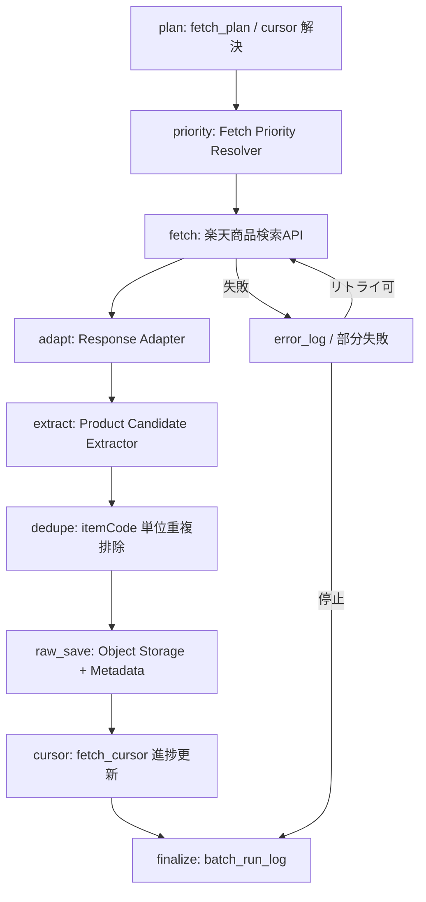

# BATCH-003 楽天商品疑似差分取得バッチ仕様書

## 1. ドキュメント情報

| 項目           | 内容                                 |
| -------------- | ------------------------------------ |
| ドキュメントID | `BATCH-003`                          |
| ドキュメント名 | 楽天商品疑似差分取得バッチ仕様書     |
| 対象システム   | Gift Recommendation Service / batch  |
| MVP対象        | `○`                                  |
| 作成日         | 2026-07-13                           |
| 更新日         | 2026-07-13                           |

---

## 2. 概要

BATCH-003（楽天商品疑似差分取得Batch）は、楽天商品検索APIから商品候補を取得し、`raw_product_json`（Object Storage）および `raw_product_metadata` を保存する Fetch バッチである。

本 Batch は Phase4b Fetch レーン（B1）の第3段である。先行 BATCH-001（`external_genre`）と BATCH-002（未登録 `itemCode` の `fetch_cursor` / `ranking_supplement`）を入力に、更新順・ジャンル別・キーワード・ランキング補完候補の複数ルートで「差分候補」を収集する。

本 Batch 時点では差分確定（new / updated / unchanged）を行わない。差分確定は後続 BATCH-005 / BATCH-006（`normalized_hash`）の責務である。本 Batch の正本区分は Raw 本体 / Raw 参照情報である。

---

## 3. 目的

| No | 目的 |
| -: | ---- |
| 1 | 疑似差分取得ルート（更新順 / ジャンル / キーワード / ランキング補完）で商品候補を収集する |
| 2 | 楽天商品検索APIレスポンスを Raw JSON として Object Storage に保存する |
| 3 | `raw_product_metadata` と `api_call_log` / `fetch_cursor` を更新し、走査状態を再実行可能にする |
| 4 | Item / Staging / Ranking Snapshot を本 Batch で作らない境界を明示する |
| 5 | 後続 BATCH-005 が Raw を読める粒度で metadata / object_key / content_hash を残す |

---

## 4. バッチ基本情報

| 項目           | 内容 |
| -------------- | ---- |
| Batch ID       | `BATCH-003` |
| Batch名        | 楽天商品疑似差分取得Batch |
| 処理種別       | 外部商品候補取得 / Raw 保存 / Fetch |
| 実行基盤       | GitHub Actions workflow（`batch-rakuten-item-pseudo-diff.yml`。独立子 workflow。§18.1） |
| 実装言語       | Python（`apps/batch`） |
| 起動方式       | `schedule` / `workflow_dispatch` / BATCH-002 後続（運用上） |
| 実行頻度       | 日次または手動 |
| 想定実行時間   | 最大 30〜90 分（カーソル数・ページ上限・補完候補数に依存） |
| 冪等キー       | Raw: `object_key` / `content_hash` `api_call_log_id` `fetch_cursor`: `source + source_api + cursor_type + target_external_genre_id + cursor_scope_fingerprint` |
| 先行Batch      | `BATCH-001`（ジャンル）/ `BATCH-002`（ランキング補完候補） |
| 後続Batch      | `BATCH-005`（Raw取込・Staging変換）/ `BATCH-017`（Import Summary） |
| MVP対象        | `○` |

`Batch ID` は `BATCH-*` を使用する。処理構成上の分類IDである `BT-*`（例: `BT-EXT-003`）を Task / Issue / 成果物名の識別子として使用しない。

---

## 5. 実行条件

### 5.1 トリガー

| トリガー | 利用有無 | 条件 | 備考 |
| -------- | -------- | ---- | ---- |
| schedule | `true` | 日次 / 週次オーケストレータから子 workflow 起動 | バッチ実行スケジュール設計書。親 `batch-rakuten-item-import.yml` からの呼び出しも想定しうるが、本 Epic では独立 YAML を正とする（§18.1） |
| workflow_dispatch | `true` | 手動実行（cursor_type / genre / keyword / page 上限指定可） | 失敗時の再実行・部分走査に利用 |
| 先行Batch完了 | `true`（運用推奨） | BATCH-002 成功後に ranking_supplement を優先消化しうる | 日次単独起動も可。ジャンル未同期時は設定済み genreId のみ |
| retry-failed | `false` | MVP では workflow_dispatch による再実行を基本とする | 失敗カーソル / page を絞って再実行 |

### 5.2 実行前提

- Phase4a `batch-foundation`（#734）の infrastructure / application / config 骨格が利用可能であること
- 先行 BATCH-001 により取得対象ジャンルが `external_genre` に存在する、または fetch_plan に明示ジャンルIDがあること
- 先行 BATCH-002 により `fetch_cursor`（`cursor_type=ranking_supplement`）が生産されていること（補完ルートを実行する場合）
- 楽天商品検索API用の認証情報（環境変数名のみ。実値は GitHub Secrets）が設定されていること
- Object Storage（Raw JSON）および Database（Metadata / fetch_cursor / ログ）へ接続可能であること
- `fetch_plan`（対象ジャンル・ページ上限・hits・優先ルート）が設定されていること

---

## 6. 入力

### 6.1 入力データ

| 入力 | 種別 | 取得元 | 必須 | 用途 | 備考 |
| ---- | ---- | ------ | ---- | ---- | ---- |
| `fetch_plan` | 設定 / 計画 | Batch config / Product Fetch Planner | `true` | 対象 genre / keyword / ページ上限 / ルート優先度を決定する | MVP対象ジャンルを限定 |
| `fetch_cursor` | DB | database | `true` | 走査条件・進捗位置 | `cursor_type` ∈ `genre` / `keyword` / `update_sort` / `ranking_supplement`（本 Batch）。`recheck` は BATCH-004 |
| `external_genre` | DB | database | 条件付き | ジャンル別走査の target | BATCH-001 同期済みを優先 |
| `ranking_supplement` 候補 | DB | `fetch_cursor`（`cursor_type=ranking_supplement`） | 条件付き | 未登録 itemCode の itemCode 指定取得 | BATCH-002 生産。1 itemCode = 1 カーソル |
| 楽天商品検索APIレスポンス | 外部API | 楽天商品検索API | `true` | 商品候補 Raw | formatVersion=`2` |

### 6.2 外部API

| API | 利用有無 | 用途 | Rate Limit / 制約 | 備考 |
| --- | -------- | ---- | ----------------- | ---- |
| 楽天商品検索API | `true` | 商品候補・itemCode 指定詳細取得 | External API Rate Limiter。`GRS-EXT-102` 時は pause / 再実行。1回最大30件、最大100ページ | `source_api=item_search` |
| 楽天ジャンル検索API | `false`（本 Batch） | ジャンル同期 | - | BATCH-001 |
| 楽天ランキングAPI | `false`（本 Batch） | ランキング取得 | - | BATCH-002。本 Batch は補完候補を消費するのみ |

#### 6.2.1 楽天商品検索API 主なパラメータ

| パラメータ | 用途 | MVP方針 |
| ---------- | ---- | ------- |
| `applicationId` | 楽天API利用アプリID | 必須（secret） |
| `accessKey` | アクセスキー | 必須（secret） |
| `format` | レスポンス形式 | `json` |
| `formatVersion` | JSON構造 | `2` |
| `genreId` | ジャンル指定 | `cursor_type=genre` / 一部 `update_sort` で利用 |
| `keyword` | キーワード検索 | `cursor_type=keyword` |
| `itemCode` | 商品コード指定 | `cursor_type=ranking_supplement`（および BATCH-004 `recheck`） |
| `hits` | 1ページ件数 | 最大 30。MVP 既定 30 |
| `page` | ページ番号 | 1〜100。カーソル `position.page` で管理 |
| `sort` | ソート | 更新順は `-updateTimestamp`。ジャンル別も同ソートを既定としうる |
| `availability` | 販売可能条件 | 原則 `1`（補完候補は条件を緩めうる） |
| `imageFlag` | 画像有無 | 原則 `1` |
| `attributeFlag` | 属性情報 | 必要に応じて `1` |
| `elements` | 取得項目制御 | 必要項目に絞る |
| `minPrice` / `maxPrice` / `NGKeyword` | 任意フィルタ | MVP 初期は原則未使用 |

#### 6.2.2 本サービスで利用する主な出力項目

| 出力項目 | 本サービスでの扱い |
| -------- | ------------------ |
| `itemCode` | 外部商品コード。後続 Item 突合キー |
| `itemName` / `catchcopy` / `itemCaption` | Item 正本候補（本 Batch では Raw 保存のみ） |
| `itemPrice` / `itemUrl` / `affiliateUrl` | 同上 |
| `smallImageUrls` / `mediumImageUrls` | Item Image 正本候補（本 Batch では Raw 保存のみ） |
| `availability` | 有効状態候補 |
| `reviewAverage` / `reviewCount` | popularity 補助候補 |
| `genreId` / `attributeIds` / `shopCode` / `shopName` | カテゴリ・属性・ショップ参照 |

本 Batch は上記を **Item / Staging に反映しない**。反映は BATCH-005 以降。

#### 6.2.3 endpoint（現行）

| 項目 | 値 |
| ---- | -- |
| 現行 base | `https://openapi.rakuten.co.jp/ichibams/api/IchibaItem/Search/20260701` |
| 旧 endpoint | `https://app.rakuten.co.jp/services/api/IchibaItem/Search/...`（**非推奨**） |
| 実装 | `HttpRakutenApiClient.fetch_item_search_raw` |

### 6.3 環境変数

環境変数は名称のみ記載し、値は記載しない。

| 環境変数名 | 必須 | 用途 | secret区分 | 設定先 |
| ---------- | ---- | ---- | ---------- | ------ |
| `RAKUTEN_APPLICATION_ID` | `true` | 楽天API applicationId | secret | GitHub Secrets / local `.env`（commit禁止） |
| `RAKUTEN_ACCESS_KEY` | `true` | 楽天API accessKey | secret | GitHub Secrets / local `.env`（commit禁止） |
| `DATABASE_URL` | `true` | DB 接続 | secret | GitHub Secrets / local `.env`（commit禁止） |
| `OBJECT_STORAGE_*` | `true` | Raw Object Storage 接続（Supabase Storage / S3 互換・接続方針 A） | secret | GitHub Secrets / local `.env`（commit禁止） |
| `BATCH_FETCH_MAX_PAGES` 等 | `false` | ページ上限・ルート別上限 | 非secret可 | config / workflow input |

---

## 7. 出力

### 7.1 出力データ

| 出力 | 種別 | 保存先 | 必須 | 用途 | 備考 |
| ---- | ---- | ------ | ---- | ---- | ---- |
| Raw JSON（`raw_product_json`） | Object | Object Storage | `true` | 監査・再変換 | `source_api=item_search` |
| `raw_product_metadata` | DB | database | `true` | Raw 参照・import_status | |
| `fetch_cursor` | DB | database | `true` | 走査位置・status 更新 | 消費・進捗更新。新規 genre/keyword カーソルの get-or-create も含む |
| `batch_run_log` / `phase_log` / `api_call_log` / `error_log` | DB | database | `true` | 運用・再実行 | `api_call_log.fetch_cursor_id` は通常 NOT NULL（§10.1） |
| `staging_item` / `item` | - | - | `false` | 本 Batch では出力しない | BATCH-005 / BATCH-007 |
| `ranking_snapshot` / `item_popularity_signal` | - | - | `false` | 本 Batch では出力しない | BATCH-002 |

### 7.2 後続への引き渡し

| 後続 | 引き渡し内容 | 条件 |
| ---- | ------------ | ---- |
| BATCH-005 | `raw_product_metadata` / Raw JSON（object_key） | Raw 保存成功（`import_status` が後続処理可能な状態） |
| BATCH-017 | Run 集計入力（件数・status） | Import Summary |
| BATCH-004 | （直接引き渡しなし） | 既存商品再確認は別 Batch。本 Batch の `recheck` 消費はしない |

### 7.3 更新リソース

| リソース | 操作 | 更新条件 | 冪等性 | 備考 |
| -------- | ---- | -------- | ------ | ---- |
| Object Storage Raw | put | API 成功レスポンスごと | `object_key` / `content_hash` | 同一 hash は skip 可 |
| `raw_product_metadata` | insert / update | Raw 保存時 | `object_key` | |
| `fetch_cursor` | get-or-create / update | plan / fetch 成功後 | UNIQUE スコープキー | `last_fetched_at` / `cursor_value.position` / `cursor_status` |
| `api_call_log` | insert | API 呼出ごと | `api_call_log_id` | `fetch_cursor_id` 紐づけ |
| `batch_run_log` / `phase_log` / `error_log` | insert / update | Run / Phase / 失敗時 | Run 単位 | |

---

## 8. 処理フロー

### 8.1 概要フロー

### 8.2 処理ステップ

|  No | Phase | 処理 | 入力 | 出力 | 失敗時の扱い |
| --: | ----- | ---- | ---- | ---- | ------------ |
| 1 | `plan` | fetch_plan と active `fetch_cursor` を解決し、本 Run の走査キューを作る | config / workflow input / fetch_cursor / external_genre | 取得計画（ルート×カーソル） | `GRS-BAT-*` で Run 失敗 |
| 2 | `priority` | ルート優先度を解決する（補完候補優先等） | fetch_plan / cursor_type | 実行順付きキュー | 設定不正は `GRS-EXT-105` 相当で計画失敗 |
| 3 | `fetch` | 楽天商品検索APIを呼び出す（カーソル×page） | cursor / secrets | APIレスポンス / api_call_log | Rate Limit は待機・再試行。タイムアウトはリトライ後に部分失敗または停止 |
| 4 | `adapt` | レスポンスを内部形式へ変換する | Rawレスポンス | 正規化候補 rows | 形式不正は `GRS-EXT-103` |
| 5 | `extract` | Product Candidate を抽出する | 正規化 rows | candidates | 必須項目欠落は当該件 skip + 記録 |
| 6 | `dedupe` | Run 内および近傍取得での itemCode 重複を排除する | candidates | unique candidates | 重複は Raw 多重保存を避ける |
| 7 | `raw_save` | Object Storage へ Raw JSON を保存し Metadata を書く | レスポンス / candidates | object_key / raw_product_metadata | `GRS-RAW-001` / `GRS-RAW-002` |
| 8 | `cursor` | `fetch_cursor` の position / last_fetched_at / status を更新する | api_call_log / 成功結果 | fetch_cursor | `GRS-DB-*`。API 成功後に更新（テーブル定義書 §5.3） |
| 9 | `finalize` | 集計・batch_run_log 更新 | 各 Phase 結果 | run_status / counts | 部分成功は `GRS-BAT-002` |

### 8.3 疑似差分ルート（本 Batch が扱う範囲）

| ルート | `cursor_type` | API 条件 | 目的 | 備考 |
| ------ | ------------- | -------- | ---- | ---- |
| ジャンル別取得 | `genre` | `genreId` + ページング（既定 sort `-updateTimestamp`） | 新規・通常候補 | `target_external_genre_id` 必須 |
| キーワード取得 | `keyword` | `keyword` + ページング | 補助候補 | MVP では fetch_plan 指定時のみ |
| 更新日時順取得 | `update_sort` | `sort=-updateTimestamp`（必要に応じ genre 限定） | 直近更新の捕捉 | |
| ランキング補完 | `ranking_supplement` | `itemCode` 指定 | BATCH-002 未登録 itemCode の商品検索正本取得 | Item は本 Batch で作らない。Raw のみ |
| 既存商品再確認 | `recheck` | - | **本 Batch 対象外** | BATCH-004 |

外部連携設計書の「差分確定」（hash 比較）は BATCH-005 / BATCH-006 で実施する。本 Batch は候補収集と Raw 保存に閉じる。

---

## 9. データ変換・マッピング

| 入力項目 | 内部項目 | 出力項目 | 変換内容 | 備考 |
| -------- | -------- | -------- | -------- | ---- |
| レスポンス全体 | Raw JSON | Object Storage object | そのまま保存（秘密情報は含めない） | path は §10.2 |
| `itemCode` | `external_item_code` | metadata / 候補抽出キー | 文字列正規化 | dedupe キー |
| `genreId` | `external_genre_id` | metadata 補助 | 文字列/数値化方針は Adapter に従う | |
| API 呼出条件 | request summary | `api_call_log` | secret を除く | accessKey 非記録 |
| `fetch_cursor_id` | - | `api_call_log.fetch_cursor_id` | 紐づけ必須（通常） | テーブル定義書 §5.2 |
| cursor position | `cursor_value.position` | `fetch_cursor.cursor_value` | page / last_item 等 | |

Staging / Item へのマッピングは本仕様書の範囲外（BATCH-005 以降）。

---

## 10. DB / Storage更新仕様

### 10.1 DB更新

| テーブル | 操作 | 主キー / 一意キー | 更新項目 | 競合時の扱い | 備考 |
| -------- | ---- | ----------------- | -------- | ------------ | ---- |
| `fetch_cursor` | get-or-create / update | `source + source_api + cursor_type + target_external_genre_id + cursor_scope_fingerprint` | position / last_fetched_at / cursor_status | 同一スコープは既存行再利用 | `source_api=item_search` 固定 |
| `raw_product_metadata` | insert / update | `raw_metadata_id` / `object_key` | hash / status / timestamps / source_api | 同一 object_key は status 更新 | `source_api=item_search` |
| `api_call_log` | insert | `api_call_log_id` | status / latency / fetch_cursor_id | 追記 | 認証情報は保存しない |
| `batch_run_log` | insert / update | `batch_run_id` | status / counts | Run 単位で一意 | |
| `phase_log` | insert | `batch_run_id + phase` | status / duration | 追記 | |
| `error_log` | insert | - | code / summary | 追記 | secret / 個人情報を含めない |
| `staging_*` / `item` / `ranking_snapshot` | - | - | - | - | **本 Batch では更新しない** |

### 10.2 Object Storage

| オブジェクト | 操作 | path / key 方針 | 保持方針 | 備考 |
| ------------ | ---- | --------------- | -------- | ---- |
| 商品検索 Raw JSON | put | `raw/rakuten/item_search/dt={yyyy-mm-dd}/batch_run_id={batch_run_id}/{api_call_log_id}.json` | Retention は運用方針に従う | 外部商品データ連携設計書 §9 系 |

---

## 11. 冪等性・再実行性

| 観点 | 方針 |
| ---- | ---- |
| 冪等キー | Raw: `object_key` / `content_hash` Cursor: UNIQUE スコープキー API: `api_call_log_id`（呼出単位の監査） |
| 重複実行時の扱い | 同一 `content_hash` の Raw は再 put を skip してよい。cursor は page 進捗を上書き更新 |
| 部分失敗時の再実行 | 失敗 `cursor_type` / genre / page / itemCode のみを workflow_dispatch で再実行 |
| 成功済みデータの skip条件 | `content_hash` 一致かつ `import_status` が成功系の場合、同一レスポンスの Raw 再保存を skip 可（MVP 実装で選択） |
| ranking_supplement 再実行 | 同一 `external_item_code` カーソルを再消費。Raw は hash 冪等。cursor_status 完了後は再 active 化が必要な場合のみ |
| rollback方針 | 分散更新のため自動 rollback しない。失敗は `error_log` で追跡し、再実行で収束させる |

---

## 12. 状態管理

| 対象 | 状態値 | 遷移条件 | 記録先 | 備考 |
| ---- | ------ | -------- | ------ | ---- |
| Batch Run | `running` → `succeeded` / `partially_succeeded` / `failed` | finalize | `batch_run_log` | `GRS-BAT-001` / `GRS-BAT-002` |
| API Call | `succeeded` / `failed` / `rate_limited` 等 | 呼出結果 | `api_call_log` | |
| Raw Metadata | `raw_saved` →（後続）`staged` / `imported` / `skipped` / `failed` | Raw保存・後続処理 | `raw_product_metadata.import_status` | 本 Batch 終端は主に `raw_saved` |
| Fetch Cursor | `active` / `paused` / `completed` / `failed` 等 | 走査進捗 | `fetch_cursor.cursor_status` | enum 正本に従う |
| Phase | phase ごとの成功/失敗 | Phase 境界 | `phase_log` | |

---

## 13. エラー・リトライ仕様

| エラー種別 | Error Code | 発生条件 | リトライ | 停止条件 | 備考 |
| ---------- | ---------- | -------- | -------- | -------- | ---- |
| 外部API失敗 | `GRS-EXT-100` | 楽天APIエラー | 有（回数上限あり） | 上限超過で当該カーソル/page 失敗 | api_call_log 記録 |
| 外部APIタイムアウト | `GRS-EXT-101` | タイムアウト | 有 | 上限超過で部分失敗/停止 | |
| Rate Limit | `GRS-EXT-102` | 429 | 待機後リトライ | 長時間継続時は Run 部分失敗 | Rate Limiter |
| レスポンス形式不正 | `GRS-EXT-103` | JSON/必須項目不正 | 無（設定見直し） | 当該単位失敗 | Raw保存可否判断 |
| リクエスト条件不正 | `GRS-EXT-105` | パラメータ不正 | 無 | 当該単位失敗 | fetch_plan / cursor 見直し |
| Raw保存失敗 | `GRS-RAW-001` | Object Storage 失敗 | 有 | 上限超過で失敗 | |
| Raw Metadata失敗 | `GRS-RAW-002` | DB書き込み失敗 | 有 | 上限超過で失敗 | |
| DB更新失敗 | `GRS-DB-*` | fetch_cursor 等更新失敗 | 有 | 上限超過で失敗 | |
| Batch全体失敗 | `GRS-BAT-001` | 致命的失敗 | 手動再実行 | Run failed | |
| 部分成功 | `GRS-BAT-002` | 一部カーソル/page のみ失敗 | 失敗分を再実行 | Run partially_succeeded | |
| 多重起動 | `GRS-BAT-003` | 同一Batch多重起動 | 無 | 起動拒否 | |

---

## 14. ログ・監視

| 種別 | 記録内容 | 出力タイミング | 保存先 | 備考 |
| ---- | -------- | -------------- | ------ | ---- |
| batch_run_log | Run全体の開始終了・件数・status | 開始/終了 | DB | |
| phase_log | Phase単位の結果 | Phase境界 | DB | |
| api_call_log | 外部API呼出の成否・latency・fetch_cursor_id | 呼出ごと | DB | Authorization / secret を記録しない |
| error_log | エラーコード・概要 | 失敗時 | DB | 個人情報・secret 非含有 |
| raw_product_metadata | object_key / hash / import_status | Raw保存時 | DB | |
| fetch_cursor | position / status / last_fetched_at | 走査更新時 | DB | |

### 14.1 メトリクス

| Metric | 内容 | 集計単位 | 用途 |
| ------ | ---- | -------- | ---- |
| `item_search_fetch_count` | API取得試行数 | batch_run | 進捗・コスト |
| `raw_save_success_count` | Raw 保存成功件数 | batch_run | 品質 |
| `candidate_item_code_count` | 抽出 itemCode ユニーク数 | batch_run | 母集団規模 |
| `ranking_supplement_consumed_count` | 補完カーソル消化数 | batch_run | BATCH-002 連携 |
| `api_rate_limit_count` | Rate Limit 発生回数 | batch_run | スロットリング調整 |

---

## 15. セキュリティ・外部サービス利用

| 観点 | 方針 |
| ---- | ---- |
| secret取り扱い | 楽天APIキー・DB接続情報は GitHub Secrets / local `.env` のみ。docs・ログ・PR・fixture に実値を書かない |
| 外部API key | server側（batch / GHA）のみで利用。client 公開禁止 |
| ログ出力制限 | request header・accessKey・Authorization・接続文字列をログに出さない |
| 個人情報・機微情報 | 商品公開情報のみ扱う。不要フィールドは保存・ログしない |
| GitHub Actions permissions | contents / 必要最小の secrets 参照に限定。`write-all` 禁止 |
| コスト・Rate Limit | External API Rate Limiter 必須。日次スケジュールと手動再実行の同時多発を避ける |

---

## 16. テスト観点

|  No | 観点 | 確認内容 | 種別 |
| --: | ---- | -------- | ---- |
| 1 | 正常系（genre） | ジャンル走査で Raw / Metadata が保存され fetch_cursor が進む | unit / integration（fixture） |
| 2 | 正常系（ranking_supplement） | itemCode 指定取得で Raw が保存され、Item が作られない | unit |
| 3 | Raw 冪等 | 同一 content_hash 再実行で不要な多重 put が増えない | unit |
| 4 | dedupe | 同一 Run 内の重複 itemCode が Raw 多重化しない | unit |
| 5 | Rate Limit | 429 時に待機・再試行し、ログに `GRS-EXT-102` が残る | unit（mock） |
| 6 | API失敗 | 外部API失敗時に api_call_log / error_log が記録され、部分失敗方針に従う | unit（mock） |
| 7 | cursor 更新 | API 成功後にのみ fetch_cursor が更新される | unit |
| 8 | secret非含有 | ログ・fixture・docs に APIキー実値が含まれない | review / unit |
| 9 | 境界 | `recheck` / Staging / Item / ranking_snapshot を更新しない | unit |

---

## 17. 変更管理

### 17.1 変更履歴

| 日付 | 変更内容 | 関連Issue / PR |
| ---- | -------- | -------------- |
| 2026-07-13 | 初版作成 | #1208 |
| 2026-07-13 | §18.2 推奨案（ルート優先度 / keyword 必須度 / ページ上限）を決定事項へ昇格 | #1208 |
| 2026-07-25 | 現行 openapi Item Search endpoint を明記 | #1606 |

---

## 18. 未決事項・決定事項

### 18.1 決定事項（本仕様書での採用方針）

|  No | 論点 | 決定内容 | 判断者 | 決定日 | 備考 |
| --: | ---- | -------- | ------ | ------ | ---- |
| 1 | 子 workflow 配置 | **独立 YAML** `batch-rakuten-item-pseudo-diff.yml` を正とする。親 `batch-rakuten-item-import.yml` 全体改修は本 Epic では行わない | Epic定義 / 本仕様 | 2026-07-13 | 競合回避。Human Review で異議があれば変更 |
| 2 | ランキング補完入力 I/F | **`fetch_cursor`（`cursor_type=ranking_supplement`）**。`scope.external_item_code` 必須。1 itemCode = 1 カーソル | Human（BATCH-002 §18.1） | 2026-07-13 | BATCH-002 決定を継承 |
| 3 | 本 Batch の終端 | **Raw 保存 + cursor 更新まで**。Staging / Item / 差分確定は後続 | バッチ処理一覧 | - | BATCH-005 / 006 |
| 4 | `recheck` ルート | **BATCH-004 専任**。本 Batch は消費しない | バッチ処理一覧 / fetch_cursor 定義 | - | |
| 5 | MVP 初期のルート優先度 | **(A) 補完最優先**。`ranking_supplement` の未消化 backlog がある場合は常に最優先で消化する | Human | 2026-07-13 | fetch_plan 比率配分は採用しない |
| 6 | keyword ルートの MVP 必須度 | **(A) 任意**。`fetch_plan` で keyword が指定された場合のみ実行する | Human | 2026-07-13 | 必須キーワード集合は持たない |
| 7 | ページ上限の既定値（genre / update_sort） | **仕様上は `fetch_plan` で指定**。数値既定は実装 Task で config 化する | Human | 2026-07-13 | Rate Limit と実装 Task で調整 |

### 18.2 残未決事項

本仕様書時点で、Human 判断待ちの残未決事項はない。

---

## 19. 関連資料

| 種別 | パス / URL | 用途 |
| ---- | ---------- | ---- |
| 正本一覧 | `docs/05_アプリケーション設計/アプリ/batch/バッチ処理一覧.md` | Batch ID・入出力・依存 |
| 設計方針 | `docs/05_アプリケーション設計/アプリ/batch/バッチ設計方針書.md` | Raw/Staging・冪等・モジュール |
| スケジュール | `docs/05_アプリケーション設計/アプリ/batch/バッチ実行スケジュール設計書.md` | item-import 系との関係 |
| 外部連携 | `docs/05_アプリケーション設計/アプリ/外部商品データ連携設計書.md` | 疑似差分・商品検索API |
| テーブル | `docs/06_実装設計/database/fetch_cursor_テーブル定義書.md` | cursor_type / ranking_supplement |
| 先行仕様 | `docs/06_実装設計/batch/BATCH-001_楽天ジャンル同期バッチ仕様書.md` | Fetch 起点 |
| 先行仕様 | `docs/06_実装設計/batch/BATCH-002_楽天ランキングスナップショット取得バッチ仕様書.md` | 補完候補生産 |
| エラー | `docs/05_アプリケーション設計/アプリ/エラーコード定義書.md` | GRS-EXT/RAW/BAT/DB |

---

## 20. 実装・運用メモ

- 本仕様書は実装・単体テスト Task の入力正本とする
- 実装パス想定: `apps/batch/src/batch/application/item_pseudo_diff/**`
- 子 workflow は `workflow_call` / `workflow_dispatch` を基本とし、単独 schedule の要否はスケジュール設計書に従う
- Contract Gate 不要（Batch は HTTP API 化しない）
- 実楽天 API / 実 DB 検証は integration。unit は fixture / mock 正
- `genre_sync/**` / `ranking_snapshot/**` は本 Epic の forbidden_paths（参照のみ）
