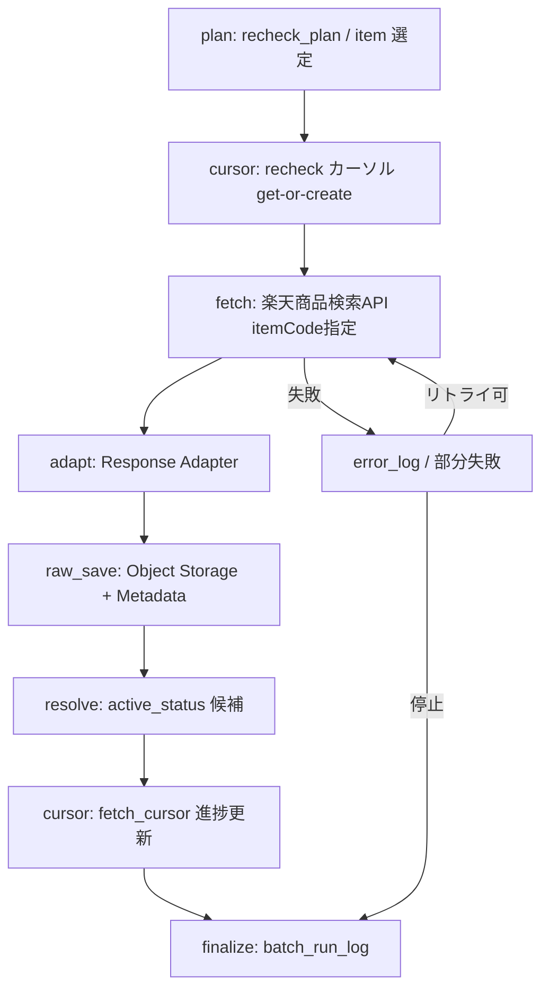

# BATCH-004 楽天既存商品再確認バッチ仕様書

## 1. ドキュメント情報

| 項目           | 内容                                   |
| -------------- | -------------------------------------- |
| ドキュメントID | `BATCH-004`                            |
| ドキュメント名 | 楽天既存商品再確認バッチ仕様書         |
| 対象システム   | Gift Recommendation Service / batch    |
| MVP対象        | `○`                                    |
| 作成日         | 2026-07-14                             |
| 更新日         | 2026-07-15                             |

---

## 2. 概要

BATCH-004（楽天既存商品再確認Batch）は、登録済み Item の `external_item_code` を対象に、楽天商品検索APIを **itemCode 指定**で呼び出し、現在の価格・販売状態・画像URL・レビュー要約等を再確認し、`raw_product_json`（Object Storage）および `raw_product_metadata` を保存する Fetch バッチである。あわせて **active_status 候補**を解決・記録するが、`item.active_status` の本更新は行わない（BATCH-008）。

本 Batch は Phase4b Fetch レーン（B1）の第4段である。`fetch_cursor`（`cursor_type=recheck`）の生産・消費は本 Batch 専任である。BATCH-003 は `recheck` を消費せず、本 Batch は `genre` / `keyword` / `update_sort` / `ranking_supplement` を消費しない。

本 Batch 時点では差分確定（new / updated / unchanged）および Staging / Item 正本更新を行わない。差分確定・反映は後続 BATCH-005 / BATCH-006 / BATCH-007 の責務である。本 Batch の正本区分は Raw 本体 / Raw 参照情報である。

---

## 3. 目的

| No | 目的 |
| -: | ---- |
| 1 | 登録済み Item を週次（または手動）で再確認し、価格・販売状態・画像URL等の現在値を捕捉する |
| 2 | `fetch_cursor`（`cursor_type=recheck`）で 1 商品単位の走査進捗を再実行可能にする |
| 3 | 楽天商品検索APIレスポンスを Raw JSON として Object Storage に保存し、`raw_product_metadata` / `api_call_log` を更新する |
| 4 | availability / 取得不能等から **active_status 候補**を解決し、後続 BATCH-008 が参照できる形で残す |
| 5 | Item 正本・Staging・BATCH-003 ルートを本 Batch で触らない境界を明示する |

---

## 4. バッチ基本情報

| 項目           | 内容 |
| -------------- | ---- |
| Batch ID       | `BATCH-004` |
| Batch名        | 楽天既存商品再確認Batch |
| 処理種別       | 既存商品再確認 / Raw 保存 / Fetch |
| 実行基盤       | GitHub Actions workflow（`batch-rakuten-existing-item-recheck.yml` の独立子として BATCH-004 のみを実装。§18.1） |
| 実装言語       | Python（`apps/batch`） |
| 起動方式       | `schedule` / `workflow_dispatch` |
| 実行頻度       | 週次または手動 |
| 想定実行時間 | 対象商品数・Rate Limit に依存（親チェーン全体の想定は 90〜120 分。本 Batch 単体はそれ以下） |
| 冪等キー       | Raw: `object_key` / `content_hash`<br>再確認単位: `source + external_item_code + fetched_at`（一覧正本）<br>`fetch_cursor`: `source + source_api + cursor_type + target_external_genre_id + cursor_scope_fingerprint` |
| 先行Batch      | なし（一覧正本）。運用上は Item 正本が存在する前提（BATCH-007 等の結果） |
| 後続Batch      | `BATCH-005`（Raw取込・Staging変換）/ `BATCH-008`（商品有効状態更新。候補参照） |
| MVP対象        | `○` |

`Batch ID` は `BATCH-*` を使用する。処理構成上の分類IDである `BT-*`（例: `BT-EXT-004`）を Task / Issue / 成果物名の識別子として使用しない。

---

## 5. 実行条件

### 5.1 トリガー

| トリガー | 利用有無 | 条件 | 備考 |
| -------- | -------- | ---- | ---- |
| schedule | `true` | 週次オーケストレータから子 workflow 起動 | バッチ実行スケジュール設計書。親 `batch-rakuten-existing-item-recheck.yml` からの呼び出しも想定しうるが、本 Epic では独立 YAML（BATCH-004 専用）を正とする（§18.1） |
| workflow_dispatch | `true` | 手動実行（対象 scope / 件数上限 / 特定 `external_item_code` 指定可） | 失敗時の再実行・部分集合再確認に利用 |
| 先行Batch完了 | `false`（必須依存なし） | 一覧上の先行 Batch はなし | 週次独立起動。日次 item-import 完了後に親から呼ぶ運用はスケジュール設計書側 |
| retry-failed | `false` | MVP では workflow_dispatch による再実行を基本とする | 失敗 `external_item_code` / cursor を絞って再実行 |

### 5.2 実行前提

- Phase4a `batch-foundation`（#734）の infrastructure / application / config 骨格が利用可能であること
- 再確認対象となる `item` 行が DB に存在し、`external_item_code` が設定されていること
- 楽天商品検索API用の認証情報（環境変数名のみ。実値は GitHub Secrets）が設定されていること
- Object Storage（Raw JSON）および Database（Metadata / fetch_cursor / ログ）へ接続可能であること
- 再確認対象選定方針（優先度付き部分集合 + 件数上限）が config / workflow input で解決できること（§18.1 No.6）

---

## 6. 入力

### 6.1 入力データ

| 入力 | 種別 | 取得元 | 必須 | 用途 | 備考 |
| ---- | ---- | ------ | ---- | ---- | ---- |
| `item` | DB | database | `true` | 再確認対象の選定・`external_item_code` 解決 | 本 Batch は Item を更新しない。優先度付き部分集合で絞り込む |
| `external_item_code` | 属性 | `item.external_item_code` | `true` | 楽天 `itemCode` 指定取得キー | 1 商品 = 1 カーソル |
| `fetch_cursor` | DB | database | `true` | 走査条件・進捗 | `cursor_type=recheck` のみ。本 Batch が get-or-create / 消費 |
| `recheck_plan` | 設定 / 計画 | Batch config / workflow input | `true` | 対象 scope・件数上限・優先度 | §18.1 No.6 / §9.2 の選定方針に従う |
| 楽天商品検索APIレスポンス | 外部API | 楽天商品検索API | `true` | 商品現在値 Raw | formatVersion=`2`。`itemCode` 指定 |

### 6.2 外部API

| API | 利用有無 | 用途 | Rate Limit / 制約 | 備考 |
| --- | -------- | ---- | ----------------- | ---- |
| 楽天商品検索API | `true` | 既存商品の現在値取得（itemCode 指定） | External API Rate Limiter。`GRS-EXT-102` 時は pause / 再実行 | `source_api=item_search` |
| 楽天ジャンル検索API | `false`（本 Batch） | ジャンル同期 | - | BATCH-001 |
| 楽天ランキングAPI | `false`（本 Batch） | ランキング取得 | - | BATCH-002 |

#### 6.2.1 楽天商品検索API 主なパラメータ（本 Batch）

| パラメータ | 用途 | MVP方針 |
| ---------- | ---- | ------- |
| `applicationId` | 楽天API利用アプリID | 必須（secret） |
| `accessKey` | アクセスキー | 必須（secret） |
| `format` | レスポンス形式 | `json` |
| `formatVersion` | JSON構造 | `2` |
| `itemCode` | 商品コード指定 | **本 Batch の主条件**。`scope.external_item_code` |
| `hits` | 1ページ件数 | itemCode 指定時は通常 1 件想定。最大 30 |
| `page` | ページ番号 | 原則 `1` |
| `availability` | 販売可能条件 | 再確認では原則緩和（販売不可検知のため未指定または緩和を許容） |
| `imageFlag` / `attributeFlag` / `elements` | 取得項目制御 | 価格・販売状態・画像・レビュー要約に必要な範囲 |

ジャンル・キーワード・更新順・ランキング補完ルートは **本 Batch 対象外**（BATCH-003）。

#### 6.2.2 本サービスで利用する主な出力項目

| 出力項目 | 本サービスでの扱い |
| -------- | ------------------ |
| `itemCode` | `external_item_code`。カーソル・突合キー |
| `itemName` / `catchcopy` / `itemCaption` | Item 正本候補（本 Batch では Raw 保存のみ） |
| `itemPrice` / `itemUrl` / `affiliateUrl` | 同上 |
| `smallImageUrls` / `mediumImageUrls` | Item Image 正本候補（本 Batch では Raw 保存のみ） |
| `availability` | **active_status 候補**の主入力 |
| `reviewAverage` / `reviewCount` | popularity / レビュー要約補助候補 |
| （空ヒット / 取得不能） | 取得不能疑い。active_status 候補（BATCH-008） |

本 Batch は上記を **Item / Staging に反映しない**。反映は BATCH-005 以降。`active_status` 本更新は BATCH-008。

### 6.3 環境変数

環境変数は名称のみ記載し、値は記載しない。

| 環境変数名 | 必須 | 用途 | secret区分 | 設定先 |
| ---------- | ---- | ---- | ---------- | ------ |
| `RAKUTEN_APPLICATION_ID` | `true` | 楽天API applicationId | secret | GitHub Secrets / local `.env`（commit禁止） |
| `RAKUTEN_ACCESS_KEY` | `true` | 楽天API accessKey | secret | GitHub Secrets / local `.env`（commit禁止） |
| `DATABASE_URL` | `true` | DB 接続 | secret | GitHub Secrets / local `.env`（commit禁止） |
| `RAW_OBJECT_STORAGE_*`（実装命名に従う） | `true` | Raw Object Storage 接続 | secret | GitHub Secrets / local `.env`（commit禁止） |
| `BATCH_RECHECK_MAX_ITEMS` 等 | `false` | 件数上限・scope | 非secret可 | config / workflow input |

---

## 7. 出力

### 7.1 出力データ

| 出力 | 種別 | 保存先 | 必須 | 用途 | 備考 |
| ---- | ---- | ------ | ---- | ---- | ---- |
| Raw JSON（`raw_product_json`） | Object | Object Storage | `true` | 監査・再変換 | `source_api=item_search` |
| `raw_product_metadata` | DB | database | `true` | Raw 参照・import_status | |
| `active_status` 候補 | 処理結果 | `item_active_status_candidate`（§18.1 No.7） | `true` | BATCH-008 入力候補 | **Item 本更新はしない** |
| `fetch_cursor` | DB | database | `true` | `recheck` 進捗更新 | 1 `external_item_code` = 1 カーソル |
| `batch_run_log` / `phase_log` / `api_call_log` / `error_log` | DB | database | `true` | 運用・再実行 | `api_call_log.fetch_cursor_id` は通常 NOT NULL |
| `staging_item` / `item` / `item.active_status` | - | - | `false` | 本 Batch では出力・更新しない | BATCH-005 / 007 / 008 |

### 7.2 後続への引き渡し

| 後続 | 引き渡し内容 | 条件 |
| ---- | ------------ | ---- |
| BATCH-005 | `raw_product_metadata` / Raw JSON（object_key） | Raw 保存成功（後続処理可能な `import_status`） |
| BATCH-008 | `item_active_status_candidate` の未適用行（§18.1 No.7） | 再確認で availability / 取得不能等が解決され候補が記録された場合 |
| BATCH-017 | Run 集計入力（件数・status） | Import Summary（親チェーン経由時） |

### 7.3 更新リソース

| リソース | 操作 | 更新条件 | 冪等性 | 備考 |
| -------- | ---- | -------- | ------ | ---- |
| Object Storage Raw | put | API 成功（または取得不能証跡方針に従う空レスポンス記録）ごと | `object_key` / `content_hash` | 同一 hash は skip 可 |
| `raw_product_metadata` | insert / update | Raw 保存時 | `object_key` | |
| `fetch_cursor` | get-or-create / update | plan / fetch 成功後 | UNIQUE スコープキー | `cursor_type=recheck` |
| `item_active_status_candidate` | insert / upsert | Resolver 成功時 | `batch_run_id` + `source` + `external_item_code` | §18.1 No.7。Item 非更新。IF-DB-BATCH-020 |
| `api_call_log` | insert | API 呼出ごと | `api_call_log_id` | `fetch_cursor_id` 紐づけ |
| `batch_run_log` / `phase_log` / `error_log` | insert / update | Run / Phase / 失敗時 | Run 単位 | |
| `item` / `staging_*` | - | - | - | **更新しない** |

---

## 8. 処理フロー

### 8.1 概要フロー



### 8.2 処理ステップ

|  No | Phase | 処理 | 入力 | 出力 | 失敗時の扱い |
| --: | ----- | ---- | ---- | ---- | ------------ |
| 1 | `plan` | `recheck_plan` と `item` から本 Run の再確認対象キューを作る。優先度付き部分集合（最終確認日・popularity 等）で絞り込み、件数上限を適用 | config / workflow input / item | 対象 `external_item_code` 一覧 | `GRS-BAT-*` で Run 失敗 |
| 2 | `cursor` | 各対象について `fetch_cursor`（`recheck`）を get-or-create | item / external_item_code | fetch_cursor 行 | DB 失敗は `GRS-DB-*` |
| 3 | `fetch` | 楽天商品検索APIを itemCode 指定で呼ぶ | cursor / secrets | APIレスポンス / api_call_log | Rate Limit は待機・再試行。空ヒットは「取得不能」候補へ |
| 4 | `adapt` | レスポンスを内部形式へ変換する | Rawレスポンス | 正規化候補 | 形式不正は `GRS-EXT-103` |
| 5 | `raw_save` | Object Storage へ Raw JSON を保存し Metadata を書く | レスポンス | object_key / raw_product_metadata | `GRS-RAW-001` / `GRS-RAW-002` |
| 6 | `resolve` | availability / 空ヒット / 販売可能から active_status 候補を解決し `item_active_status_candidate` へ記録する（IF-DB-BATCH-020） | 適応結果 / item | 候補行（`candidate_status=detected`。§18.1 No.7） | Resolver 失敗は当該件失敗として記録。Item は更新しない |
| 7 | `cursor_update` | `fetch_cursor` の last_fetched_at / status を更新する | api_call_log / 成功結果 | fetch_cursor | API 成功後に更新（テーブル定義書 §5.3）。完了時は `exhausted` 等 |
| 8 | `finalize` | 集計・batch_run_log 更新 | 各 Phase 結果 | run_status / counts | 部分成功は `GRS-BAT-002` |

### 8.3 本 Batch が扱う走査範囲

| ルート | `cursor_type` | API 条件 | 目的 | 備考 |
| ------ | ------------- | -------- | ---- | ---- |
| 既存商品再確認 | `recheck` | `itemCode` 指定 | 登録済み商品の現在値確認 | **本 Batch 専任**。1 商品 = 1 カーソル（fetch_cursor 定義書 §17.1 No.4） |
| genre / keyword / update_sort / ranking_supplement | - | - | **対象外** | BATCH-003 |

---

## 9. データ変換・マッピング

| 入力項目 | 内部項目 | 出力項目 | 変換内容 | 備考 |
| -------- | -------- | -------- | -------- | ---- |
| レスポンス全体 | Raw JSON | Object Storage object | そのまま保存（秘密情報は含めない） | path は §10.2 |
| `itemCode` | `external_item_code` | cursor scope / metadata キー | 文字列正規化 | |
| `availability` / 空ヒット / 販売可能 | active_status 候補 | `item_active_status_candidate` | Resolver ルールで候補化して upsert（IF-DB-BATCH-020）。写像は §9.3 | 本更新は BATCH-008。Raw metadata には載せない |
| API 呼出条件 | request summary | `api_call_log` | secret を除く | accessKey 非記録 |
| `fetch_cursor_id` | - | `api_call_log.fetch_cursor_id` | 紐づけ必須（通常） | |
| `scope.external_item_code` | `cursor_value.scope` | `fetch_cursor.cursor_value` | 必須 | fingerprint 対象 |

Staging / Item へのマッピングは本仕様書の範囲外（BATCH-005 以降）。

### 9.1 `recheck` の `cursor_value`（確定）

fetch_cursor テーブル定義書 §17.1 No.4 に従う。

```json
{
  "scope": {
    "external_item_code": "shop:123456"
  },
  "position": {}
}
```

- `scope.external_item_code` のみ必須
- バッチ単位キューは MVP では持たない
- `target_external_genre_id` は `NULL`

### 9.2 `recheck_plan` 選定ロジック（§18.1 No.6）

本 Batch は**優先度付き部分集合**で再確認対象を選定する。

| 項目 | 方針 |
| ---- | ---- |
| 基本条件 | `item.active_status = 'active'` かつ `item.external_item_code IS NOT NULL` |
| 優先度条件 | 最終確認日（古いものを優先）、popularity（低いものを優先）等で順序付け |
| 件数上限 | config で上限を設定し、週次 Rate Limit 枠を超過しないようにする（例: 1000 件/週） |
| 除外条件 | 最近再確認済み（例: 直近7日以内に `fetch_cursor.last_fetched_at` が更新済み）の商品は除外してもよい |
| 明示リスト | workflow input で特定の `external_item_code` 一覧を渡すことで、優先度を上書き可能（§18.1 No.6 の補助手段） |

具体的な SQL / ロジックは実装 Task で詳細化する。

### 9.3 active_status 候補の Resolver 写像（MVP）

正本: `item_active_status_candidate` テーブル定義書 §6.1。本 Batch Writer は次を最小セットとする。

| `detection_basis` | 典型 `reason_code` | 典型 `candidate_active_status` | 意味 |
| ----------------- | ------------------ | ------------------------------ | ---- |
| `availability` | `availability_zero` | `unavailable` | 楽天 `availability=0` |
| `empty_hit` | `empty_hit` | `unavailable` | itemCode 指定で 0 件 |
| `api_success` | `available` | `active` | 取得成功かつ販売可能（復帰候補。§18.1.1） |

`reason_code` / `detection_basis` の拡張はテーブル定義書に従う。Item 本更新は行わない。

---

## 10. DB / Storage更新仕様

### 10.1 DB更新

| テーブル | 操作 | 主キー / 一意キー | 更新項目 | 競合時の扱い | 備考 |
| -------- | ---- | ----------------- | -------- | ------------ | ---- |
| `fetch_cursor` | get-or-create / update | `source + source_api + cursor_type + target_external_genre_id + cursor_scope_fingerprint` | last_fetched_at / cursor_status / cursor_value | 同一スコープは既存行再利用 | `cursor_type=recheck` / `source_api=item_search` |
| `raw_product_metadata` | insert / update | `raw_metadata_id` / `object_key` | hash / status / timestamps / source_api | 同一 object_key は status 更新 | IF-DB-BATCH-004 |
| `item_active_status_candidate` | insert / upsert | `batch_run_id` + `source` + `external_item_code`（§18.1 No.7） | `candidate_active_status` / `reason_code` / `detection_basis` / `candidate_status`（`detected`） / `detected_at` / 任意で `item_id`・`raw_metadata_id`・`api_call_log_id` | 同一冪等キーは upsert。ON CONFLICT 時は業務列を更新し `candidate_status='detected'`・`applied_at=NULL` 等で未適用を再確立（テーブル定義書 §12.2） | **IF-DB-BATCH-020**。Item 非更新。`raw_product_metadata` には候補を書かない |
| `api_call_log` | insert | `api_call_log_id` | status / latency / fetch_cursor_id | 追記 | 認証情報は保存しない |
| `batch_run_log` | insert / update | `batch_run_id` | status / counts | Run 単位で一意 | |
| `phase_log` | insert | `batch_run_id + phase` | status / duration | 追記 | |
| `error_log` | insert | - | code / summary | 追記 | secret / 個人情報を含めない |
| `item` / `staging_*` | - | - | - | - | **本 Batch では更新しない** |

### 10.2 Object Storage

| オブジェクト | 操作 | path / key 方針 | 保持方針 | 備考 |
| ------------ | ---- | --------------- | -------- | ---- |
| 商品検索 Raw JSON | put | `raw/rakuten/item_search/dt={yyyy-mm-dd}/batch_run_id={batch_run_id}/{api_call_log_id}.json` | Retention は運用方針に従う | BATCH-003 と同系。source_api 共通 |

---

## 11. 冪等性・再実行性

| 観点 | 方針 |
| ---- | ---- |
| 冪等キー | Raw: `object_key` / `content_hash`<br>Cursor: UNIQUE スコープキー（`recheck` + `external_item_code`）<br>一覧: `source + external_item_code + fetched_at`<br>候補: `batch_run_id` + `source` + `external_item_code`（§18.1 No.7） |
| 重複実行時の扱い | 同一 `content_hash` の Raw は再 put を skip してよい。cursor は再 active 化後に再消費。候補は同一冪等キーで upsert |
| 部分失敗時の再実行 | 失敗 `external_item_code` / cursor のみを workflow_dispatch で再実行。未適用候補は専用テーブルから BATCH-008 が再消費可能 |
| 成功済みデータの skip条件 | `content_hash` 一致かつ `import_status` が成功系の場合、同一レスポンスの Raw 再保存を skip 可（MVP 実装で選択） |
| rollback方針 | 分散更新のため自動 rollback しない。失敗は `error_log` で追跡し、再実行で収束させる |

---

## 12. 状態管理

| 対象 | 状態値 | 遷移条件 | 記録先 | 備考 |
| ---- | ------ | -------- | ------ | ---- |
| Batch Run | `running` → `succeeded` / `partially_succeeded` / `failed` | finalize | `batch_run_log` | `GRS-BAT-001` / `GRS-BAT-002` |
| API Call | `succeeded` / `failed` / `rate_limited` 等 | 呼出結果 | `api_call_log` | |
| Raw Metadata | `raw_saved` →（後続）`staged` / `imported` / `skipped` / `failed` | Raw保存・後続処理 | `raw_product_metadata.import_status` | 本 Batch 終端は主に `raw_saved` |
| Fetch Cursor | `active` / `paused` / `exhausted` / `failed` 等 | 走査進捗 | `fetch_cursor.cursor_status` | 正常完了後は `exhausted`（ranking_supplement と同型） |
| Active Status Candidate | `detected`（本 Batch 終端）→（BATCH-008）`applied` / `superseded` / `discarded` | Resolver 成功時に `detected` で記録 | `item_active_status_candidate.candidate_status` | Writer は IF-DB-BATCH-020。終端 status 更新は BATCH-008（IF-DB-BATCH-021） |
| Phase | phase ごとの成功/失敗 | Phase 境界 | `phase_log` | |

---

## 13. エラー・リトライ仕様

| エラー種別 | Error Code | 発生条件 | リトライ | 停止条件 | 備考 |
| ---------- | ---------- | -------- | -------- | -------- | ---- |
| 外部API失敗 | `GRS-EXT-100` | 楽天APIエラー | 有（回数上限あり） | 上限超過で当該商品失敗 | api_call_log 記録 |
| 外部APIタイムアウト | `GRS-EXT-101` | タイムアウト | 有 | 上限超過で部分失敗/停止 | |
| Rate Limit | `GRS-EXT-102` | 429 | 待機後リトライ | 長時間継続時は Run 部分失敗 | Rate Limiter。cursor は `paused` |
| レスポンス形式不正 | `GRS-EXT-103` | JSON/必須項目不正 | 無（設定見直し） | 当該単位失敗 | |
| リクエスト条件不正 | `GRS-EXT-105` | パラメータ不正 | 無 | 当該単位失敗 | recheck_plan / cursor 見直し |
| 取得不能（空ヒット） | （候補解決） | itemCode で 0 件 | 無（証跡として候補化） | 当該件は候補記録へ | Item は更新しない |
| Raw保存失敗 | `GRS-RAW-001` | Object Storage 失敗 | 有 | 上限超過で失敗 | |
| Raw Metadata失敗 | `GRS-RAW-002` | DB書き込み失敗 | 有 | 上限超過で失敗 | |
| DB更新失敗 | `GRS-DB-*` | fetch_cursor 等更新失敗 | 有 | 上限超過で失敗 | |
| Batch全体失敗 | `GRS-BAT-001` | 致命的失敗 | 手動再実行 | Run failed | |
| 部分成功 | `GRS-BAT-002` | 一部商品のみ失敗 | 失敗分を再実行 | Run partially_succeeded | |
| 多重起動 | `GRS-BAT-003` | 同一Batch多重起動 | 無 | 起動拒否 | |

---

## 14. ログ・監視

| 種別 | 記録内容 | 出力タイミング | 保存先 | 備考 |
| ---- | -------- | -------------- | ------ | ---- |
| batch_run_log | Run全体の開始終了・件数・status | 開始/終了 | DB | |
| phase_log | Phase単位の結果 | Phase境界 | DB | |
| api_call_log | 外部API呼出の成否・latency・fetch_cursor_id | 呼出ごと | DB | Authorization / secret を記録しない |
| error_log | エラーコード・概要 | 失敗時 | DB | 個人情報・secret 非含有 |
| raw_product_metadata | object_key / hash / import_status | Raw保存時 | DB | |
| fetch_cursor | status / last_fetched_at | 走査更新時 | DB | `recheck` のみ |
| `item_active_status_candidate` | `candidate_active_status` / `reason_code` / `detection_basis` / `candidate_status` | Resolver 時（IF-DB-BATCH-020） | §18.1 No.7 | |

### 14.1 メトリクス

| Metric | 内容 | 集計単位 | 用途 |
| ------ | ---- | -------- | ---- |
| `recheck_target_count` | 再確認対象件数 | batch_run | 進捗 |
| `recheck_fetch_count` | API取得試行数 | batch_run | コスト |
| `raw_save_success_count` | Raw 保存成功件数 | batch_run | 品質 |
| `active_status_candidate_count` | 候補解決件数 | batch_run | BATCH-008 連携 |
| `unavailable_or_empty_hit_count` | 取得不能 / 空ヒット件数 | batch_run | ヘルス |
| `api_rate_limit_count` | Rate Limit 発生回数 | batch_run | スロットリング調整 |

---

## 15. セキュリティ・外部サービス利用

| 観点 | 方針 |
| ---- | ---- |
| secret取り扱い | 楽天APIキー・DB接続情報は GitHub Secrets / local `.env` のみ。docs・ログ・PR・fixture に実値を書かない |
| 外部API key | server側（batch / GHA）のみで利用。client 公開禁止 |
| ログ出力制限 | request header・accessKey・Authorization・接続文字列をログに出さない |
| 個人情報・機微情報 | 商品公開情報のみ扱う。不要フィールドは保存・ログしない |
| GitHub Actions permissions | contents / 必要最小の secrets 参照に限定。`write-all` 禁止 |
| コスト・Rate Limit | External API Rate Limiter 必須。週次スケジュールと手動再実行の同時多発を避ける |

---

## 16. テスト観点

|  No | 観点 | 確認内容 | 種別 |
| --: | ---- | -------- | ---- |
| 1 | 正常系（recheck） | itemCode 指定で Raw / Metadata が保存され fetch_cursor（recheck）が進む | unit / integration（fixture） |
| 2 | カーソル単位 | 1 `external_item_code` = 1 カーソルで get-or-create される | unit |
| 3 | Raw 冪等 | 同一 content_hash 再実行で不要な多重 put が増えない | unit |
| 4 | active_status 候補 | availability / 空ヒット / 販売可能で `item_active_status_candidate` へ upsert され、`item.active_status` と `raw_product_metadata` 候補カラムは変わらない | unit |
| 5 | Rate Limit | 429 時に待機・再試行し、ログに `GRS-EXT-102`、cursor が `paused` | unit（mock） |
| 6 | API失敗 | 外部API失敗時に api_call_log / error_log が記録され、部分失敗方針に従う | unit（mock） |
| 7 | cursor 更新 | API 成功後にのみ fetch_cursor が更新される | unit |
| 8 | secret非含有 | ログ・fixture・docs に APIキー実値が含まれない | review / unit |
| 9 | 境界 | genre/keyword/update_sort/ranking_supplement / Staging / Item 本更新をしない | unit |

---

## 17. 変更管理

### 17.1 変更履歴

| 日付 | 変更内容 | 関連Issue / PR |
| ---- | -------- | -------------- |
| 2026-07-14 | 初版作成 | #1224 |
| 2026-07-14 | §18.1 No.6: 再確認対象の選定を **(B) 優先度付き部分集合** に決定。§18.2 No.2 を決定事項へ移管 | #1224 |
| 2026-07-14 | §18.1 No.7: active_status 候補の保存先を **(C) 専用候補テーブル** に決定。§18.2 を解消 | #1224 |
| 2026-07-14 | §18.1.1: 物理名 / UNIQUE、BATCH-008 入力競合（制限側優先）、Retention（未適用保持・適用後 14 日）を Human 確定 | #1224 |
| 2026-07-15 | Epic #1227 完了後の追随: IF-DB-BATCH-020、Writer 列名、§9.3 Resolver 写像、§12 `candidate_status`、§18/§19/§20 陳腐化解消 | #1282 |

---

## 18. 未決事項・決定事項

### 18.1 決定事項（本仕様書での採用方針）

|  No | 論点 | 決定内容 | 判断者 | 決定日 | 備考 |
| --: | ---- | -------- | ------ | ------ | ---- |
| 1 | 子 workflow 配置 | **独立 YAML** で BATCH-004 実装を正とする。親 `batch-rakuten-existing-item-recheck.yml`（004〜008/017 チェーン）全体改修は本 Epic では行わない。ファイル名はスケジュール設計書上の `batch-rakuten-existing-item-recheck.yml` と整合する独立実装、または `batch-rakuten-existing-item-recheck` プレフィックスの専用 YAML とする（実装 Task で確定。親全体への混入は禁止） | Epic定義 / 本仕様 | 2026-07-14 | BATCH-003 と同方針。Human Review で異議があれば変更 |
| 2 | `recheck` ルート専任 | **BATCH-004 専任**。BATCH-003 は消費しない。本 Batch は他 `cursor_type` を消費しない | バッチ処理一覧 / fetch_cursor 定義 | - | |
| 3 | カーソル粒度 | **1 商品（`external_item_code`）= 1 カーソル**。`scope.external_item_code` 必須 | Human（fetch_cursor #505） | - | §9.1 |
| 4 | 本 Batch の終端 | **Raw 保存 + cursor 更新 + active_status 候補記録まで**。Staging / Item / active_status 本更新は後続 | バッチ処理一覧 | - | BATCH-005 / 008 |
| 5 | API | 楽天商品検索APIの **itemCode 指定**のみ | 外部商品データ連携設計書 | - | |
| 6 | 再確認対象の選定 | **(B) 優先度付き部分集合**を既定とする。最終確認日・popularity 等で優先し、件数上限を config / workflow input 化する。`(C) workflow 明示リスト` は手動再実行・失敗再確認の補助として併用可。`(A) 全 active Item` は週次既定としない | Human | 2026-07-14 | 週次 Rate Limit・所要時間の抑制。優先キー・上限値の具体値は実装 Task / config で定める |
| 7 | active_status 候補の保存先 | **(C) 専用候補テーブル**を採用する。`(A) raw_product_metadata` 拡張と `(B) Run ログ寄せ`は採用しない。正本区分は `product_diff_result` と同型の **派生 / 判定結果（一時）**。物理名 **`item_active_status_candidate`**（Human 確定）。本 Batch は候補の **Writer**、BATCH-008 は **Reader / Applier**。冪等キーは **`batch_run_id` + `source` + `external_item_code`**（Human 確定）。BATCH-008 入力競合・Retention は §18.1.1 | Human | 2026-07-14 | 再実行・部分失敗リカバリを優先。DDL / IF / enum / Writer・Reader 境界の詳細正本は `item_active_status_candidate` テーブル定義書・IF-DB-BATCH-020/021・BATCH-008 仕様書（Epic #1227 完了） |

#### 18.1.1 専用候補テーブルの確定方針（No.7 の制約）

本仕様書では物理 DDL・全カラム定義を重複記載しない。詳細正本は `docs/06_実装設計/database/item_active_status_candidate_テーブル定義書.md`（Epic #1227 / Task #1229）および DDL / migration（Task #1230）とする。Writer / Reader は次を前提とする。

| 項目 | 方針 |
| ---- | ---- |
| 物理名 | **`item_active_status_candidate`**（Human 確定） |
| 責務分離 | 候補は専用テーブルのみ。`raw_product_metadata` に候補カラム / JSON を追加しない |
| 書き込み主体 | BATCH-004（Item Active Status Candidate Resolver）。**IF-DB-BATCH-020** |
| 読取・適用主体 | BATCH-008（Item Active Status Updater）。**IF-DB-BATCH-021**。適用時は候補 `candidate_status` を更新する。行削除は Retention cleanup（T7）が担い、008 は即時削除しない |
| 冪等キー | **`batch_run_id` + `source` + `external_item_code`**（Human 確定。UNIQUE） |
| 保持する最小情報 | `candidate_active_status`、`reason_code`、`detection_basis`、`detected_at`、任意で `raw_metadata_id` / `api_call_log_id` / `item_id` |
| 候補 status | `detected` → `applied` / `superseded` / `discarded`（enum定義書 §6.27。Writer 初期値は `detected`） |
| Online 参照 | しない（batch 内部データ） |

##### BATCH-008 入力競合（Human 確定・推奨案採用）

BATCH-008 は `product_diff_result` 経路と本候補テーブル経路を **両方読む**。同一 Item で結果が食い違う場合の優先は次とする。

| 状況 | 方針 |
| ---- | ---- |
| 制限度が異なる | **制限側を優先**する（推奨除外方向を優先）。概念上の強い順: `excluded` > `unavailable` > `inactive` > `active` |
| 制限度が同じ | **新しい時刻を優先**する（候補の `detected_at` と `product_diff_result.judged_at` を比較） |
| 復帰（`active` 化） | **専用候補で「取得成功かつ販売可能」が明示された場合のみ**。`product_diff_result.unavailable` 単独では復帰しない |

根拠（推論）: 初期は検知ノイズ・部分失敗が多い。誤って販売不可を推薦し続けるリスクより、誤除外の方が運用で再確認・復帰しやすい。

##### Retention（Human 確定・推奨案採用）

| 候補 status | Retention |
| ----------- | --------- |
| `detected`（未適用） | **削除しない**（BATCH-008 再実行・部分リカバリのため） |
| `applied` / `superseded` / `discarded` | **14 日間保持**した後に cleanup。008 成功直後の即時削除はしない（初期の障害調査性を優先） |

cleanup 手順は `docs/06_実装設計/batch/item_active_status_candidate_Retention_cleanup運用手順.md`（Epic #1227 / Task #1235）を正とする。日数変更は運用実績を見て Human 再判断可。

### 18.2 残未決事項（Human 判断）

本仕様書時点で残未決事項はない。カラム定義・enum・IF-ID・DDL・BATCH-008 Reader/Applier・Retention は Epic #1227 成果を正本とする（§19）。BATCH-004 側の残作業は **Writer 実装（#1231 / T4a）および本 Epic の実装・UT** である。

---

## 19. 関連資料

| 種別 | パス / URL | 用途 |
| ---- | ---------- | ---- |
| 正本一覧 | `docs/05_アプリケーション設計/アプリ/batch/バッチ処理一覧.md` | Batch ID・入出力・依存 |
| 設計方針 | `docs/05_アプリケーション設計/アプリ/batch/バッチ設計方針書.md` | Raw/Staging・冪等・モジュール |
| スケジュール | `docs/05_アプリケーション設計/アプリ/batch/バッチ実行スケジュール設計書.md` | existing-item-recheck 系 |
| 外部連携 | `docs/05_アプリケーション設計/アプリ/外部商品データ連携設計書.md` | 既存商品再確認・itemCode |
| テーブル | `docs/06_実装設計/database/fetch_cursor_テーブル定義書.md` | `recheck` 形式 |
| 参考テーブル | `docs/06_実装設計/database/product_diff_result_テーブル定義書.md` | 派生 / 判定結果（一時）の同型先例 |
| 候補テーブル | `docs/06_実装設計/database/item_active_status_candidate_テーブル定義書.md` | 専用候補テーブル定義（§18.1 No.7）。Epic #1227 / Task #1229 |
| 先行仕様 | `docs/06_実装設計/batch/BATCH-003_楽天商品疑似差分取得バッチ仕様書.md` | 境界・item_search 共有 |
| エラー | `docs/05_アプリケーション設計/アプリ/エラーコード定義書.md` | GRS-EXT/RAW/BAT/DB |
| enum | `docs/06_実装設計/database/enum定義書.md` §6.27 | `candidate_status` |
| インターフェース | `docs/05_アプリケーション設計/アプリ/インターフェース一覧.md` | IF-DB-BATCH-004 / IF-EXT-001 / **IF-DB-BATCH-020**（Writer）/ **IF-DB-BATCH-021**（Reader・008） |
| BATCH-008 仕様書 | `docs/06_実装設計/batch/BATCH-008_商品有効状態更新バッチ仕様書.md` | 候補 Reader / Applier・競合（#1233） |
| Retention | `docs/06_実装設計/batch/item_active_status_candidate_Retention_cleanup運用手順.md` | 終端 status の cleanup（#1235） |

---

## 20. 実装・運用メモ

- 本仕様書は実装・単体テスト Task の入力正本とする
- 実装パス想定: `apps/batch/src/batch/application/item_recheck/**`
- 主要モジュール（一覧）: Fetch Cursor Manager / Rakuten Item Search API Client / External API Rate Limiter / Rakuten Response Adapter / Raw Product Object Writer / Raw Product Metadata Writer / Item Active Status Candidate Resolver（**IF-DB-BATCH-020** Writer）
- 子 workflow は `workflow_call` / `workflow_dispatch` を基本とし、親チェーン全体（005〜008）の改修は本 Epic 外
- Contract Gate 不要（Batch は HTTP API 化しない）
- 実楽天 API / 実 DB 検証は integration。unit は fixture / mock 正
- `genre_sync/**` / `ranking_snapshot/**` / `item_pseudo_diff/**` は本 Epic の forbidden_paths（参照のみ）
- **§18.1 No.7 付随（Epic #1227）**: テーブル定義書 / DDL / IF-020·021 / BATCH-008 Reader·Applier / Retention は **完了・本 Epic Branch 取込済み**（PR #1276）。残る Writer 実装は **#1231（T4a）** と本 Epic 実装 Task で扱う
