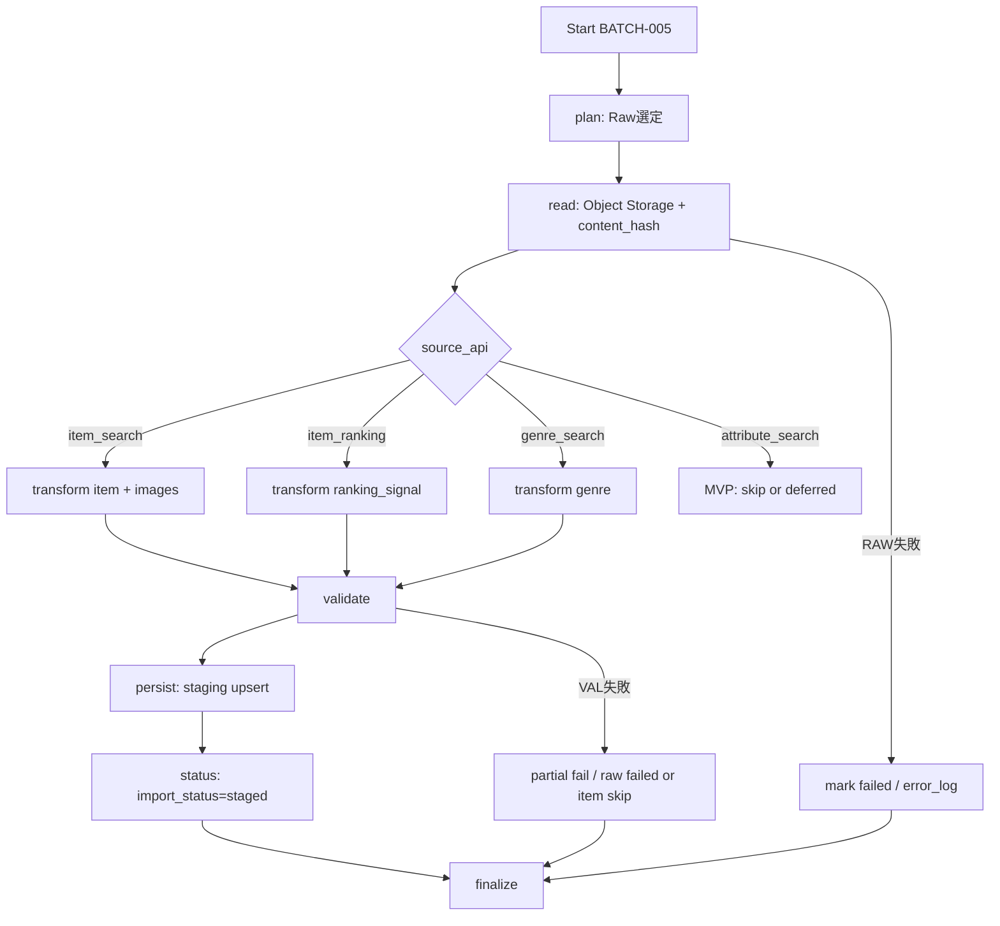

# BATCH-005 Raw取込・Staging変換バッチ仕様書

## 1. ドキュメント情報

| 項目           | 内容                                |
| -------------- | ----------------------------------- |
| ドキュメントID | `BATCH-005`                         |
| ドキュメント名 | Raw取込・Staging変換バッチ仕様書    |
| 対象システム   | Gift Recommendation Service / batch |
| MVP対象        | `○`                                 |
| 作成日         | 2026-07-15                          |
| 更新日         | 2026-07-15                          |

---

## 2. 概要

BATCH-005（Raw取込・Staging変換Batch）は、Object Storage 上の Raw JSON（`raw_product_json`）と `raw_product_metadata` を読み取り、内部取込形式の Staging（`staging_item` / `staging_item_image` / `staging_ranking_signal` / `staging_genre`）へ変換・検証する Batch である。

正本区分は **中間データ / 変換結果** である。本 Batch は **Item 正本**、**`product_diff_result`**、**`item.active_status`** を更新しない。差分判定は BATCH-006、Item 反映は BATCH-007、有効状態の本更新は BATCH-008 の責務である。

MVP の主経路は、BATCH-003 / BATCH-004 が保存した `source_api=item_search` Raw から `staging_item`（および `staging_item_image`）への変換である。`genre_search` / `item_ranking` については、BATCH-001 / BATCH-002 が Staging〜正本側まで本 Batch 内完結している経路がある。BATCH-005 は同系 Raw の **再処理・独立再実行経路**としても利用しうる（バッチ処理一覧の独立 Job 注記、各 Staging テーブル定義書）。

---

## 3. 目的

| No | 目的 |
| -: | ---- |
| 1 | `import_status=raw_saved` 等の処理対象となる Raw Metadata を選定し、Object Storage から Raw JSON を読む |
| 2 | `source_api` に応じて Staging 行へ変換し、Staging Validator で検証する |
| 3 | `normalized_hash` を **BATCH-005 内で算出して保存**し `staging_item` に書く（BATCH-006 は比較のみ。`staging_item` テーブル定義書 Human Review #517 No.5 **確定**） |
| 4 | 成功時に `raw_product_metadata.import_status` を `staged` に更新する |
| 5 | Item / `product_diff_result` / `item.active_status` 本更新を行わない境界を明示する |

---

## 4. バッチ基本情報

| 項目           | 内容 |
| -------------- | ---- |
| Batch ID       | `BATCH-005` |
| Batch名        | Raw取込・Staging変換Batch |
| 処理種別       | Raw読取 / Staging変換・検証 / Metadata状態更新 |
| 実行基盤       | GitHub Actions。**独立子 workflow `batch-rakuten-raw-staging.yml`**（§18.1 No.1 **確定**） |
| 実装言語       | Python（`apps/batch`） |
| 起動方式       | 先行 Batch 後続 / `workflow_dispatch`（独立 cron なし） |
| 実行頻度       | Raw 保存後に連続実行 |
| 想定実行時間   | 親 item-import / existing-item-recheck チェーン内の Staging 段（親全体の想定は 90〜120 分枠の一部）。単独再実行は対象 Raw 件数に依存 |
| 冪等キー       | Run 単位: `raw_metadata_id` 行単位: 各 Staging 表 UNIQUE（下表） |
| 先行Batch      | `BATCH-001` / `BATCH-002` / `BATCH-003` / `BATCH-004` |
| 後続Batch      | `BATCH-006` / `BATCH-017` |
| MVP対象        | `○` |

`Batch ID` は `BATCH-*` を使用する。処理構成上の分類IDである `BT-*`（例: `BT-EXT-005`）を Task / Issue / 成果物名の識別子として使用しない。

### 4.1 行単位冪等キー（テーブル定義書 Human 確定）

| テーブル | UNIQUE | 根拠 |
| -------- | ------ | ---- |
| `staging_item` | `(raw_metadata_id, external_item_code)` | Human Review #517 **確定** |
| `staging_item_image` | `(raw_metadata_id, external_item_code, image_url)` | Human Review #523 **確定** |
| `staging_ranking_signal` | `(raw_metadata_id, rank)` | Human Review #524 **確定** |
| `staging_genre` | `(raw_metadata_id, external_genre_id)` | Human Review #525 **確定** |

バッチ処理一覧の「`raw_metadata_id` / staging 対象ごとの source + external_id」は、上記 UNIQUE の要約表現として扱う。

---

## 5. 実行条件

### 5.1 トリガー

| トリガー | 利用有無 | 条件 | 備考 |
| -------- | -------- | ---- | ---- |
| schedule | `false` | — | 独立 cron は付けない（提案。BATCH-003/004 同型） |
| workflow_dispatch | `true` | 手動・再実行（`raw_metadata_id` / `batch_run_id` / `source_api` / 件数上限） | 失敗再実行・部分集合処理に利用 |
| 先行Batch完了 | `true`（運用上） | item-import / existing-item-recheck チェーン、または独立 YAML を親から `workflow_call` | 親全体改修は本 Epic 外（§18.1 No.1） |
| retry-failed | `false` | MVP では workflow_dispatch で失敗 `raw_metadata_id` を絞る | |

### 5.2 実行前提

- `raw_product_metadata` と Object Storage 上の Raw JSON が存在する（BATCH-001〜004 の成果）
- Staging テーブル（`staging_item` / `staging_item_image` / `staging_ranking_signal` / `staging_genre`）の DDL が利用可能であること。本 Epic での新規 migration 追加は Human 判断対象とする
- 本 Batch から楽天 API は呼び出さない（外部 API なし）
- Database / Object Storage へ接続可能であること
- 同時多重起動は `GRS-BAT-003` で拒否する

---

## 6. 入力

### 6.1 入力データ

| 入力 | 種別 | 取得元 | 必須 | 用途 | 備考 |
| ---- | ---- | ------ | ---- | ---- | ---- |
| `raw_product_metadata` | DB | database | `true` | 処理対象 Raw 選定・`object_key` / `content_hash` / `source_api` / `import_status` | |
| `raw_product_json` | Object Storage | `object_key` | `true`（body 保存済み行） | 変換元 JSON | |
| `staging_selection` / config | 設定 | Batch config / workflow input | `true` | import_status / source_api / 件数上限 | §18.1 No.2 **確定** |
| 明示 `raw_metadata_id` リスト | 入力 | workflow_dispatch | `false` | 失敗再実行・部分集合 | |

### 6.2 外部API

| API | 利用有無 | 用途 | Rate Limit / 制約 | 備考 |
| --- | -------- | ---- | ----------------- | ---- |
| - | `false` | なし | - | 本 Batch は楽天 API を呼ばない。`GRS-EXT-*` 対象外 |

### 6.3 環境変数

環境変数は名称のみ記載し、値は記載しない。

| 環境変数名 | 必須 | 用途 | secret区分 | 設定先 |
| ---------- | ---- | ---- | ---------- | ------ |
| `DATABASE_URL` | `true` | Staging / Metadata 更新 | secret | GitHub Secrets / local `.env`（commit 禁止） |
| `RAW_OBJECT_STORAGE_*`（実装命名に従う） | `true` | Raw 読取 | secret | GitHub Secrets / local `.env`（commit 禁止） |
| `BATCH_RAW_STAGING_MAX_RAW` 等 | `false` | 件数上限 | 非secret可 | config / workflow input（§18.1 No.2） |
| `BATCH_RAW_STAGING_SOURCE_API` 等 | `false` | source_api フィルタ | 非secret可 | config / workflow input（§18.1 No.2） |

---

## 7. 出力

### 7.1 出力データ

| 出力 | 種別 | 出力先 | 正本区分 | 用途 | 備考 |
| ---- | ---- | ------ | -------- | ---- | ---- |
| `staging_item` | DB | database | 中間 | BATCH-006 / BATCH-007 入力 | `diff_status` は **NULL**（Human Review #517 **確定**） |
| `staging_item_image` | DB | database | 中間 | 画像 URL 集合 | `source_api=item_search` 時 |
| `staging_ranking_signal` | DB | database | 中間 | ランキング中間 | `source_api=item_ranking` 時。Snapshot 本更新は本 Batch 外 |
| `staging_genre` | DB | database | 中間 | ジャンル中間 | `source_api=genre_search` 時。`external_genre` Upsert は本 Batch の out of scope（BATCH-001。§18.1 No.6 **確定**） |
| `raw_product_metadata`（状態） | DB | database | Raw 参照 | `import_status` / `staged_at` | 成功時 `staged` |
| `batch_run_log` / `phase_log` / `error_log` | DB | database | 運用 | Run / Phase / 失敗記録 | |
| `item` / `product_diff_result` / `item.active_status` | - | - | - | **出力・更新しない** | BATCH-006 / 007 / 008 |

### 7.2 後続への引き渡し

| 後続 | 引き渡し内容 | 条件 |
| ---- | ------------ | ---- |
| BATCH-006 | `staging_item`（`normalized_hash` 済み、`diff_status=NULL`） | Staging 成功・`import_status=staged` |
| BATCH-017 | Run 集計入力（件数・status） | Import Summary（親チェーン経由時） |

### 7.3 更新リソース

| リソース | 操作 | 更新条件 | 冪等性 | 備考 |
| -------- | ---- | -------- | ------ | ---- |
| `staging_item` | upsert | Validation 成功・item 系 | UNIQUE ON CONFLICT | Human Review #517 **確定** |
| `staging_item_image` | upsert（＋同一 Raw 内の同期 DELETE） | 同上 | UNIQUE | Human Review #523 **確定**。消えた URL 除去は定義書 §5.8 |
| `staging_ranking_signal` | upsert | ranking 系 | UNIQUE | Human Review #524 **確定** |
| `staging_genre` | upsert | genre 系 | UNIQUE | Human Review #525 **確定** |
| `raw_product_metadata` | update | Raw 単位成功 / 失敗 | `raw_metadata_id` | `staged` / `failed` 等 |
| `batch_run_log` / `phase_log` / `error_log` | insert / update | Run / Phase / 失敗時 | Run 単位 | |
| `item` / `product_diff_result` / `item.active_status` | - | - | - | **更新しない** |

---

## 8. 処理フロー

### 8.1 全体フロー

`attribute_search` は MVP out of scope（`staging_attribute` は別定義あり。§18.1 No.5 **確定**）。本仕様の MVP 必須は `item_search`。ranking / genre は同一コードパスの再処理オプションとする（§18.1 No.4 **確定**）。

### 8.2 処理ステップ

|  No | Phase | 処理 | 入力 | 出力 | 失敗時の扱い |
| --: | ----- | ---- | ---- | ---- | ------------ |
| 1 | `plan` | 対象 Raw キューを作成する（§18.1 No.2 既定） | config / `raw_product_metadata` | `raw_metadata_id` 一覧 | `GRS-BAT-*` |
| 2 | `read` | Object Storage GET、`content_hash` 検証 | `object_key` / metadata | Raw JSON bytes | `GRS-RAW-003` / `004` / `005`。当該 Raw 失敗 |
| 3 | `transform` | Staging Transformer + Normalized Payload / Hash | Raw JSON + metadata | Staging 行候補 | `GRS-BAT-004` |
| 4 | `validate` | Staging Validator | 候補行 | 合格行 / 不合格理由 | `GRS-VAL-*`。不合格は Staging 正本へ書かない |
| 5 | `persist` | Staging Repository upsert（画像は同期 DELETE 含む） | 合格行 | `staging_*` 行 | `GRS-DB-*` |
| 6 | `status` | `import_status=staged`、`staged_at` 更新 | `raw_metadata_id` | metadata 更新 | DB 失敗は `GRS-DB-*` |
| 7 | `finalize` | 集計・`batch_run_log` 更新 | 各 Phase 結果 | run_status / counts | 部分成功は `GRS-BAT-002` |

処理単位は **`raw_metadata_id` 単位**で成功 / 失敗を記録する（依存関係図の再実行単位と一致）。

---

## 9. データ変換・マッピング

列マッピングの物理正本は各 Staging テーブル定義書とする。外部商品データ連携設計書 §9.2 の論理名（例: `item_price` / `rakuten_genre_id`）で DDL 列を増やさない。

### 9.1 `item_search` → `staging_item`

| 入力項目 | 内部項目 | 出力項目（`staging_item`） | 変換内容 | 備考 |
| -------- | -------- | -------------------------- | -------- | ---- |
| metadata.`source` | `source` | `source` | copy | MVP `'rakuten'`（Human Review #517 **確定**） |
| `itemCode` | `external_item_code` | `external_item_code` | 文字列化 | 必須 |
| `itemName` | `item_name` | `item_name` | 文字列 | 必須 |
| `itemCaption` | `item_caption` | `item_caption` | 文字列 | optional |
| `catchcopy` | `catchcopy` | `catchcopy` | 文字列 | optional |
| `itemPrice` | `price` | `price` | int JPY | 物理列は `price`（`item_price` ではない） |
| `itemUrl` | `item_url` | `item_url` | URL | 必須 |
| `genreId` | `external_genre_id` | `external_genre_id` | bigint | 物理列は `external_genre_id` |
| `shopCode` | `shop_code` | `shop_code` | 文字列 | optional。`shopName` は非保持 |
| `availability` | `availability` | `availability` | 0/1 | optional |
| `reviewAverage` | `review_average` | `review_average` | numeric | optional |
| `reviewCount` | `review_count` | `review_count` | int | optional |
| （算出） | Normalized Payload | `normalized_hash` | Payload → hash | hash 入力は外部連携 §6.4 / 設計方針。`affiliateUrl` は任意・MVP 列なし |
| — | — | `diff_status` | **書かない / NULL** | BATCH-006（Human Review #517 **確定**） |
| — | — | `staged_at` | Run 完了時刻 | 必須 |
| — | — | `source_api` | **列なし** | `raw_product_metadata.source_api` 経由 trace |

同一 Raw 内の重複 `itemCode` は Validator で失敗 / 除外する。

### 9.2 `item_search` → `staging_item_image`

| 入力項目 | 出力項目 | 変換内容 | 備考 |
| -------- | -------- | -------- | ---- |
| `smallImageUrls[]` | `image_url` / `image_size_type=small` / `display_order` | 配列順で order 採番 | Human Review #523 **確定** |
| `mediumImageUrls[]` | `image_url` / `image_size_type=medium` / `display_order` | 同上 | |
| 配列先頭等 | `is_primary_candidate` | 商品あたり true は 1 件 | partial unique（#523 **確定**） |

同一 Raw・同一商品でレスポンスに含まれない既存 URL は、UPSERT 後に DELETE する（`staging_item_image` テーブル定義書 §5.8）。

### 9.3 `item_ranking` → `staging_ranking_signal`

| 入力項目 | 出力項目 | 備考 |
| -------- | -------- | ---- |
| `itemCode` | `external_item_code` | |
| `genreId` / リクエスト genre | `external_genre_id` | |
| `rank` | `rank` | UNIQUE 構成要素 |
| `period` | `period` | |
| `lastBuildDate` | `last_build_date` | |

`source` 列は本テーブルに持たない。`ranking_snapshot` / `item_popularity_signal` 本反映は行わない。

### 9.4 `genre_search` → `staging_genre`

| 入力項目 | 出力項目 | 備考 |
| -------- | -------- | ---- |
| metadata.`source` | `source` | |
| genreId | `external_genre_id` | UNIQUE 構成要素 |
| jaName / genreName | `genre_name` | |
| parent | `parent_external_genre_id` | |
| level | `genre_level` | |
| leaf | `is_leaf` | |

`external_genre` への Upsert は本 Batch の out of scope（BATCH-001。§18.1 No.6 **確定**。テーブル定義書側の整合修正は別 Task）。

### 9.5 `normalized_hash` 算出

| 観点 | 方針 |
| ---- | ---- |
| 算出主体 | BATCH-005（Staging 変換完了時。`MOD-BATCH-012` / `MOD-BATCH-013`） |
| 保存先 | `staging_item.normalized_hash` |
| BATCH-006 | **比較のみ**（Human Review #517 No.5 **確定**） |
| hash 入力 | 外部商品データ連携設計書 §6.4（`item` テーブル定義書 §12.3 と同一体系） |
| 分離 | Feature / Embedding 再判定には使わない |

---

## 10. DB / Storage更新仕様

### 10.1 DB更新

| テーブル | 操作 | 主キー / 一意キー | 更新項目 | 競合時の扱い | 備考 |
| -------- | ---- | ----------------- | -------- | ------------ | ---- |
| `staging_item` | upsert | `(raw_metadata_id, external_item_code)` | 業務列 + `normalized_hash` + `staged_at`。`diff_status=NULL` | ON CONFLICT DO UPDATE（定義書疑似 SQL 準拠） | Human Review #517 **確定** |
| `staging_item_image` | upsert + 同期 DELETE | `(raw_metadata_id, external_item_code, image_url)` | size / order / primary / `staged_at` | 同上。集合外 URL は DELETE | Human Review #523 **確定** |
| `staging_ranking_signal` | upsert | `(raw_metadata_id, rank)` | 業務列 + `staged_at` | ON CONFLICT DO UPDATE | Human Review #524 **確定** |
| `staging_genre` | upsert | `(raw_metadata_id, external_genre_id)` | 業務列 + `staged_at` | ON CONFLICT DO UPDATE | Human Review #525 **確定** |
| `raw_product_metadata` | update | `raw_metadata_id` | `import_status`、`staged_at`、失敗時 error_* | 同一行更新 | 失敗再実行時は `raw_saved` リセット可（`raw_product_metadata` 定義書） |
| `batch_run_log` / `phase_log` / `error_log` | insert / update | Run / Phase 単位 | status / counts / code | 追記 / 更新 | |
| `item` / `product_diff_result` / `item.active_status` | - | - | - | - | **更新しない**（§2 境界。BATCH-006 / 007 / 008） |

### 10.2 Object Storage

| オブジェクト | 操作 | path / key 方針 | 保持方針 | 備考 |
| ------------ | ---- | --------------- | -------- | ---- |
| Raw JSON | **read only** | `object_key`（metadata） | 本 Batch は put / delete しない | |

---

## 11. 冪等性・再実行性

| 観点 | 方針 |
| ---- | ---- |
| 冪等キー | `raw_metadata_id` + 各 Staging UNIQUE |
| 重複実行時の扱い | 同一キーは upsert 上書き。再ステージ時 `diff_status` は NULL に戻す（`staging_item` 定義書疑似 SQL） |
| 部分失敗時の再実行 | 失敗 `raw_metadata_id` のみを workflow_dispatch で再実行。`failed` → `raw_saved` リセット方針に従う |
| 成功済みデータの skip 条件 | `import_status=staged` かつ明示 force なしなら skip 可（提案。§18.1 No.2）。再計算時は force upsert |
| rollback方針 | Staging Retention は成功後 DELETE（物理ER）。本 Batch は自動 rollback しない。失敗は `error_log` で追跡し再実行で収束 |

---

## 12. 状態管理

| 対象 | 状態値 | 遷移条件 | 記録先 | 備考 |
| ---- | ------ | -------- | ------ | ---- |
| Batch Run | `running` → `succeeded` / `partially_succeeded` / `failed` | finalize | `batch_run_log` | `GRS-BAT-001` / `GRS-BAT-002` |
| Phase | 各 Phase 成否 | Phase 境界 | `phase_log` | |
| Raw Metadata | `raw_saved` → `staged` | persist + status 成功 | `import_status` / `staged_at` | |
| Raw Metadata | → `failed` | read / transform / persist 失敗 | + error_* | |
| Staging `diff_status` | `NULL` | BATCH-005 完了時点 | `staging_item` | Human Review #517 **確定**。確定は BATCH-006 |

明細ごとに `processing` を逐次更新しない（バッチ設計方針書）。

---

## 13. エラー・リトライ仕様

対象分類は `GRS-RAW-*` / `GRS-BAT-*` / `GRS-DB-*` / `GRS-VAL-*`（バッチ処理一覧）。外部 API 系 `GRS-EXT-*` は本 Batch 非対象。`GRS-BAT-005`（Item 反映）は後続 Batch 用であり本 Batch では使用しない。

| エラー種別 | Error Code | 発生条件 | リトライ | 停止条件 | 備考 |
| ---------- | ---------- | -------- | -------- | -------- | ---- |
| Raw Object なし | `GRS-RAW-003` | `object_key` 欠落・オブジェクト不在 | 無（再 Fetch） | 当該 Raw 失敗 | |
| Raw 読取失敗 | `GRS-RAW-004` | Storage GET 失敗 | 有 | 上限超過で失敗 | |
| Hash 不一致 | `GRS-RAW-005` | `content_hash` 不一致 | **無**（自動再試行しない） | 当該 Raw 失敗 | Staging 非書込 |
| Staging 変換失敗 | `GRS-BAT-004` | transform 例外 | 有（一時障害時） | 上限超過で metadata failed | |
| Validation 失敗 | `GRS-VAL-*` | 必須欠落・型・URL 等 | **無** | 当該商品 skip または Raw 単位失敗 | コード細分化は実装 Task で可 |
| DB 失敗 | `GRS-DB-*` | upsert / update 失敗 | 有 | 上限超過 | |
| Batch 全体失敗 | `GRS-BAT-001` | 致命的失敗 | 手動再実行 | Run failed | |
| 部分成功 | `GRS-BAT-002` | 一部 Raw のみ失敗 | 失敗分再実行 | `partially_succeeded` | |
| 多重起動 | `GRS-BAT-003` | 同一 Batch 多重起動 | 無 | 起動拒否 | |

---

## 14. ログ・監視

| 種別 | 記録内容 | 出力タイミング | 保存先 | 備考 |
| ---- | -------- | -------------- | ------ | ---- |
| batch_run_log | 開始終了・件数・status | 開始 / 終了 | DB | |
| phase_log | Phase 名と成否 | Phase 境界 | DB | |
| error_log | code / message / `raw_metadata_id` | 失敗時 | DB | Raw 本文は出さない |
| raw_product_metadata | status 遷移 | status Phase | DB | |
| item_import_summary | 件数集計入力 | 後続 BATCH-017 | — | 本 Batch は集計専用にしない |

### 14.1 メトリクス

| Metric | 内容 | 集計単位 | 用途 |
| ------ | ---- | -------- | ---- |
| `raw_selected_count` | 選定件数 | batch_run | 監視 |
| `raw_staged_count` | staged 成功件数 | batch_run | 品質 |
| `raw_failed_count` | 失敗件数 | batch_run | アラート |
| `staging_item_upsert_count` | `staging_item` 行数 | batch_run | 進捗 |
| `validation_reject_count` | Validation 不合格件数 | batch_run | データ品質 |

---

## 15. セキュリティ・外部サービス利用

| 観点 | 方針 |
| ---- | ---- |
| secret取り扱い | DB / Storage 認証情報は GitHub Secrets / local `.env` のみ。docs・ログ・PR・fixture に実値を書かない |
| 外部API key | 本 Batch では楽天 API キー不要 |
| ログ出力制限 | Raw 本文・大量属性のフルダンプ禁止。接続文字列をログに出さない |
| 個人情報・機微情報 | 商品公開情報のみ扱う。不要フィールドは保存・ログしない |
| GitHub Actions permissions | contents / 必要最小の secrets 参照に限定。`write-all` 禁止 |
| コスト・Rate Limit | Storage 読取コストのみ。楽天 Rate Limit 非該当 |

---

## 16. テスト観点

|  No | 観点 | 確認内容 | 種別 |
| --: | ---- | -------- | ---- |
| 1 | 正常系（item_search） | `raw_saved` → `staging_item`（+ image）upsert → `import_status=staged`、`diff_status=NULL` | unit / integration |
| 2 | 物理列マッピング | `price` / `external_genre_id`。affiliate / shop_name / source_api 列を作らない | unit |
| 3 | normalized_hash | §6.4 相当の入力で安定 hash。同一 Payload 再実行で hash 同一 | unit |
| 4 | 冪等 upsert | 同一 `(raw_metadata_id, external_item_code)` 再実行が上書きのみ | unit / integration |
| 5 | Hash mismatch | `content_hash` 不一致で `GRS-RAW-005`、Staging 非書込 | unit |
| 6 | Raw 読取失敗 | `GRS-RAW-003` / `004`、metadata failed 方針 | integration（mock storage） |
| 7 | Validation | 必須欠落で `GRS-VAL-*`、正本非更新 | unit |
| 8 | ranking / genre 分岐 | `source_api` に応じ対象表のみ書き、他表汚染なし | unit |
| 9 | Item 非更新 | `item` / `product_diff_result` / `item.active_status` が変わらない | integration |
| 10 | 再実行 reset | `failed` → `raw_saved` リセット後に再ステージ可 | integration |
| 11 | 部分成功 | 一部 Raw 失敗で `GRS-BAT-002` | unit |
| 12 | 多重起動 | `GRS-BAT-003` | unit |
| 13 | secret 非含有 | ログ・fixture・docs に認証情報なし | review / unit |

---

## 17. 変更管理

### 17.1 変更履歴

| 日付 | 変更内容 | 関連Issue / PR |
| ---- | -------- | -------------- |
| 2026-07-15 | 初版作成 | Epic #1307 / Task #1317 |
| 2026-07-15 | §18.1 No.1〜2 / No.4〜6 を Human 確定（旧 §18.2 A〜D 推奨案採用）。§18.2 を解消 | Epic #1307 / Task #1317 |

---

## 18. 未決事項・決定事項

### 18.1 採用方針（Human 確定）

|  No | 論点 | 内容 | 判断者 | 状態 | 備考 |
| --: | ---- | ---- | ------ | ---- | ---- |
| 1 | 子 workflow 配置 | **独立 YAML `batch-rakuten-raw-staging.yml`（`batch-rakuten-raw-staging*.yml`）を正**とする。親 `batch-rakuten-item-import.yml` / `batch-rakuten-existing-item-recheck.yml` **全体改修は本 Epic 外**。将来親から `workflow_call` してよい | Human | **確定**（2026-07-15） | BATCH-003/004 同型。Epic `human_decision_points` / allowed_paths と整合。旧 §18.2 No.A |
| 2 | 処理対象 Raw 選定の既定 | **既定フィルタ:** (1) `import_status IN ('raw_saved')`（再実行でリセットした行含む）(2) `source_api` 既定は **`item_search` 優先**（config で `item_ranking` / `genre_search` 追加可）(3) 件数上限 `BATCH_RAW_STAGING_MAX_RAW`（未設定時は実装 config 既定）(4) 任意で `batch_run_id` / 明示 ID リスト。**`staged` / `imported` は既定 skip**（force で再ステージ） | Human | **確定**（2026-07-15） | `raw_product_metadata` Index / 状態遷移と整合。旧 §18.2 No.A |
| 3 | staging 既存行の冪等・上書き | **各表 UNIQUE で ON CONFLICT DO UPDATE**（各テーブル定義書疑似 SQL）。再ステージ時 `diff_status=NULL`。画像は URL キー upsert 後、同一 Raw 内で消えた URL を DELETE | Human（テーブル定義） | **確定**（#517 / #523 / #524 / #525） | Epic 第3点の答えはテーブル Human 確定を採用 |
| 4 | genre / ranking の MVP 位置づけ | **MVP 必須は `item_search` のみ**。`genre_search` / `item_ranking` は同一コードパスの **再処理オプション**（BATCH-001/002 が内完結済みのため必須委譲しない） | Human | **確定**（2026-07-15） | 旧 §18.2 No.B。§2 / §8.1 / §21.2 と整合 |
| 5 | `attribute_search` | **MVP out of scope**。Staging 主線（本 Batch）では扱わない | Human | **確定**（2026-07-15） | 旧 §18.2 No.C。§8.1 / §21.1 と整合 |
| 6 | `external_genre` Upsert の責務境界 | **正本優先**: `バッチ処理一覧` / 本 BATCH-005 仕様。BATCH-005 出力は Staging のみ。`external_genre` Upsert は **BATCH-001 責務**。本 Epic で Upsert を実装範囲に広げない。`staging_genre_テーブル定義書` §5.3–5.4 との記述差分の整合修正は **別 Task** | Human | **確定**（2026-07-15） | 旧 §18.2 No.D。§7.1 / §9.4 / §21.1 と整合 |

### 18.2 残未決事項（Human 判断）

本仕様書時点で、Human 判断待ちの残未決事項はない。`staging_genre_テーブル定義書` 側の `external_genre` 記述整合は別 Task とする（§18.1 No.6）。

---

## 19. 関連資料

| 種別 | パス / URL | 用途 |
| ---- | ---------- | ---- |
| 正本一覧 | `docs/05_アプリケーション設計/アプリ/batch/バッチ処理一覧.md` | BATCH-005 行・エラー分類 |
| 設計方針 | `docs/05_アプリケーション設計/アプリ/batch/バッチ設計方針書.md` | Raw / Staging / hash / validation |
| 依存 | `docs/05_アプリケーション設計/アプリ/batch/バッチ依存関係図.md` | 003/004 → 005 → 006 |
| スケジュール | `docs/05_アプリケーション設計/アプリ/batch/バッチ実行スケジュール設計書.md` | item-import / existing-item-recheck |
| 外部連携 | `docs/05_アプリケーション設計/アプリ/外部商品データ連携設計書.md` | Staging・hash（列名は物理定義優先） |
| テーブル | `docs/06_実装設計/database/staging_item_テーブル定義書.md` | 列・UNIQUE・upsert |
| テーブル | `docs/06_実装設計/database/staging_item_image_テーブル定義書.md` | 画像 Staging |
| テーブル | `docs/06_実装設計/database/staging_ranking_signal_テーブル定義書.md` | ランキング Staging |
| テーブル | `docs/06_実装設計/database/staging_genre_テーブル定義書.md` | ジャンル Staging |
| テーブル | `docs/06_実装設計/database/raw_product_metadata_テーブル定義書.md` | import_status |
| 先行仕様 | `docs/06_実装設計/batch/BATCH-003_楽天商品疑似差分取得バッチ仕様書.md` | 独立 YAML・境界 |
| 先行仕様 | `docs/06_実装設計/batch/BATCH-004_楽天既存商品再確認バッチ仕様書.md` | 章構成・境界 |
| エラー | `docs/05_アプリケーション設計/アプリ/エラーコード定義書.md` | GRS-RAW / BAT / DB / VAL |
| Epic / Task | `prompts/definitions/epics/batch-005-raw-staging/epic.yaml` 等 | scope |

---

## 20. レビュー観点

- バッチ処理一覧の BATCH-005 と ID・入出力・先行後続が一致している
- Item / `product_diff_result` / `item.active_status` 本更新が混入していない
- `staging_item` 物理列と外部設計 §9.2 の表記差分（`price` 等）を混同していない
- UNIQUE・`normalized_hash` タイミング・`diff_status=NULL` がテーブル定義書 Human 確定と一致している
- §18.1 No.1〜2 / No.4〜6 が Human **確定**として本文・境界と矛盾していない
- secret / `.env` 実値が含まれていない
- PR target が親 Epic Branch（`feature/epic-1307-batch-005-raw-staging`）である

---

## 21. 備考

### 21.1 Out of scope

| 対象 | 理由 |
| ---- | ---- |
| `item` / `item_image` / `item_review_summary` 更新 | BATCH-007 |
| `product_diff_result` / `diff_status` 確定 | BATCH-006 |
| `item.active_status` 本更新 | BATCH-008 |
| 楽天 API 呼び出し | BATCH-001〜004 |
| `ranking_snapshot` / `item_popularity_signal` / `external_genre` Upsert | BATCH-002 / BATCH-001（`external_genre` 境界は §18.1 No.6 **確定**） |
| `attribute_search` → Staging | MVP out of scope（§18.1 No.5 **確定**） |
| 親 item-import / existing-item-recheck **全体**改修 | Epic risk・BATCH-003/004 方針 |
| 新規 DB migration | Human 判断 |
| OpenAPI / generated | Contract Gate 不要 |

### 21.2 BATCH-001 / BATCH-002 との境界

- バッチ処理一覧は BATCH-005 の先行に 001〜004、出力に 4 Staging 表を列挙する
- BATCH-001 / BATCH-002 仕様は Staging〜正本側を **本 Batch 内完結**し、005 を必須委譲しない
- 本仕様の MVP 必須は `item_search` Raw の Staging。genre / ranking は再処理オプションとして同一コードパスで扱う（§18.1 No.4 **確定**）

### 21.3 実装・運用メモ

- 本仕様書は実装・単体テスト Task の入力正本とする
- 実装パス想定: `apps/batch/src/batch/application/raw_staging/**`
- 主要モジュール（一覧）: Raw Product Reader / Staging Transformer / Staging Validator / Staging Repository / Normalized Payload Builder / Normalized Hash Calculator
- 子 workflow は `workflow_call` / `workflow_dispatch` を基本とし、親チェーン全体の改修は本 Epic 外（§18.1 No.1）
- Contract Gate 不要（Batch は HTTP API 化しない）
