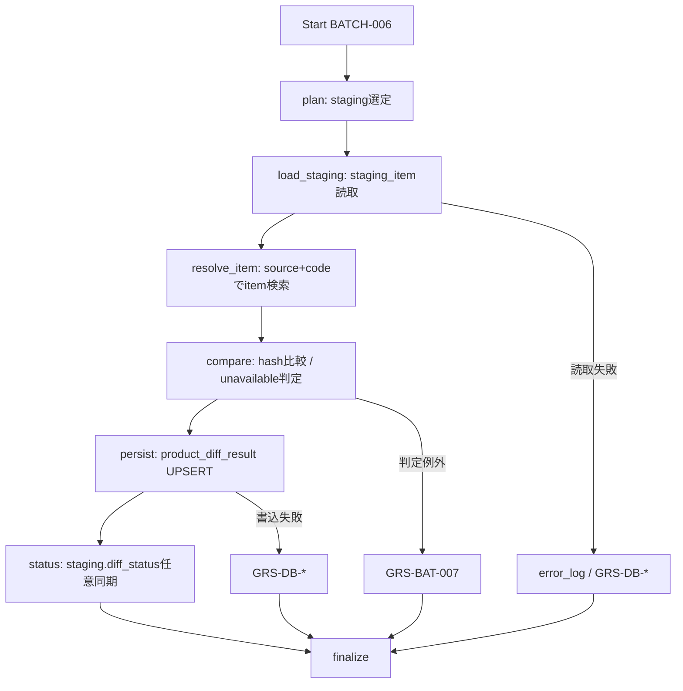

# BATCH-006 商品差分判定バッチ仕様書

## 1. ドキュメント情報

| 項目           | 内容                                |
| -------------- | ----------------------------------- |
| ドキュメントID | `BATCH-006`                         |
| ドキュメント名 | 商品差分判定バッチ仕様書            |
| 対象システム   | Gift Recommendation Service / batch |
| MVP対象        | `○`                                 |
| 作成日         | 2026-07-16                          |
| 更新日         | 2026-07-16                          |

---

## 2. 概要

BATCH-006（商品差分判定Batch）は、BATCH-005 完了済みの `staging_item`（`normalized_hash` 確定済み）と既存 `item` を突合し、`normalized_hash` の **比較のみ** により `new` / `updated` / `unchanged` / `unavailable` を確定する Batch である。

判定結果の **正本** は `product_diff_result` である（`product_diff_result` テーブル定義書 Human Review #526 **確定**）。`staging_item.diff_status` への同期 UPDATE は任意であり、読取正本は常に `product_diff_result` とする。

正本区分は **派生 / 判定結果** である。本 Batch は **`item` / `item_image` / `item_review_summary` / `item.active_status` を更新しない**。Item 反映は BATCH-007、有効状態の本更新は BATCH-008、意味生成キュー登録は BATCH-009 の責務である。

`normalized_hash` の **再算出は行わない**（算出は BATCH-005。`staging_item` テーブル定義書 Human Review #517 No.5 **確定**）。バッチ処理一覧に Normalized Payload Builder / Normalized Hash Calculator が列挙されていても、本 Batch での役割は **既存 hash の読取・比較**に限定する。

---

## 3. 目的

| No | 目的 |
| -: | ---- |
| 1 | BATCH-005 完了済みの `staging_item` を選定し、`source` + `external_item_code` で既存 `item` を解決する |
| 2 | `staging_item.normalized_hash` と `item.normalized_hash` を比較し、`diff_status` を確定する（hash 再算出なし） |
| 3 | `product_diff_result` に判定行を INSERT / UPSERT し、後続 BATCH-007 / 008 / 009 の分岐入力を提供する |
| 4 | 任意で `staging_item.diff_status` を同一値に同期する（正本は `product_diff_result`） |
| 5 | Item 正本・画像・有効状態を本更新しない境界を明示する |

---

## 4. バッチ基本情報

| 項目           | 内容 |
| -------------- | ---- |
| Batch ID       | `BATCH-006` |
| Batch名        | 商品差分判定Batch |
| 処理種別       | Staging ↔ Item hash 比較 / 差分判定結果永続化 |
| 実行基盤       | GitHub Actions。**独立子 workflow `batch-rakuten-product-diff.yml`（`batch-rakuten-product-diff*.yml`）を提案**（§18.2 No.1）。親 item-import 全体改修は本 Epic 外 |
| 実装言語       | Python（`apps/batch`） |
| 起動方式       | 先行 Batch（BATCH-005）後続 / `workflow_dispatch`（独立 cron なし） |
| 実行頻度       | Staging 変換後に連続実行 |
| 想定実行時間   | 親 item-import / existing-item-recheck チェーン内の差分判定段（親全体の想定は 90〜120 分枠の一部）。単独再実行は対象 `staging_item` 件数に依存 |
| 冪等キー       | Run 内: `(batch_run_id, external_item_code)`（§4.1） |
| 先行Batch      | `BATCH-005` |
| 後続Batch      | `BATCH-007` / `BATCH-008` / `BATCH-017`（Import Summary。条件により） |
| MVP対象        | `○` |

`Batch ID` は `BATCH-*` を使用する。処理構成上の分類IDである `BT-*`（例: `BT-EXT-006` 系の旧表記）を Task / Issue / 成果物名の識別子として使用しない。

### 4.1 行単位冪等キー（テーブル定義書 Human 確定）

| テーブル | UNIQUE | 根拠 |
| -------- | ------ | ---- |
| `product_diff_result` | `(batch_run_id, external_item_code)` | Human Review #526 **確定** |

バッチ設計方針書 §17.1 および `product_diff_result` テーブル定義書 §7 / §12.2 の ON CONFLICT と一致する。

---

## 5. 実行条件

### 5.1 トリガー

| トリガー | 利用有無 | 条件 | 備考 |
| -------- | -------- | ---- | ---- |
| schedule | `false` | — | 独立 cron は付けない（提案。BATCH-005 同型） |
| workflow_dispatch | `true` | 手動・再実行（`batch_run_id` / 明示 `staging_item_id` / `external_item_code` / 件数上限） | 失敗再実行・部分集合処理に利用 |
| 先行Batch完了 | `true`（運用上） | BATCH-005 後続、または独立 YAML を親から `workflow_call` | 親全体改修は本 Epic 外（§18.2 No.1） |
| retry-failed | `false` | MVP では workflow_dispatch で失敗キーを絞る | 依存関係図: `batch_run_id` + `external_item_code` 単位 |

### 5.2 実行前提

- 対象 `staging_item` が存在する（BATCH-005 完了・`normalized_hash` NOT NULL）
- 比較先の `item` テーブルが参照可能であること（未存在は `new` 判定）
- `product_diff_result` の DDL が利用可能であること。本 Epic での新規 migration 追加は Human 判断対象とする
- 本 Batch から楽天 API / Object Storage は呼び出さない（外部 API なし・Raw 再読取なし）
- Database へ接続可能であること
- 同時多重起動は `GRS-BAT-003` で拒否する

---

## 6. 入力

### 6.1 入力データ

| 入力 | 種別 | 取得元 | 必須 | 用途 | 備考 |
| ---- | ---- | ------ | ---- | ---- | ---- |
| `staging_item` | DB | database | `true` | 判定対象行・`normalized_hash` / `source` / `external_item_code` / `availability` 等 | BATCH-005 完了済み |
| `item` | DB | database | `false`（行単位） | 既存 hash 読取・突合 | 未存在 → `new` |
| `staging_selection` / config | 設定 | Batch config / workflow input | `true` | 選定フィルタ / 件数上限 | §18.2 No.2 **提案** |
| 明示 `staging_item_id` / `external_item_code` リスト | 入力 | workflow_dispatch | `false` | 失敗再実行・部分集合 | |

### 6.2 外部API

| API | 利用有無 | 用途 | Rate Limit / 制約 | 備考 |
| --- | -------- | ---- | ----------------- | ---- |
| - | `false` | なし | - | 本 Batch は楽天 API を呼ばない。`GRS-EXT-*` 対象外 |

### 6.3 環境変数

環境変数は名称のみ記載し、値は記載しない。

| 環境変数名 | 必須 | 用途 | secret区分 | 設定先 |
| ---------- | ---- | ---- | ---------- | ------ |
| `DATABASE_URL` | `true` | Staging / Item 読取・`product_diff_result` 更新 | secret | GitHub Secrets / local `.env`（commit 禁止） |
| `BATCH_PRODUCT_DIFF_MAX_ITEMS` 等 | `false` | 件数上限 | 非secret可 | config / workflow input（§18.2 No.2） |
| `BATCH_PRODUCT_DIFF_SOURCE` 等 | `false` | `source` フィルタ（MVP 既定 `rakuten`） | 非secret可 | config / workflow input |

---

## 7. 出力

### 7.1 出力データ

| 出力 | 種別 | 出力先 | 正本区分 | 用途 | 備考 |
| ---- | ---- | ------ | -------- | ---- | ---- |
| `product_diff_result` | DB | database | 派生 / 判定正本 | BATCH-007 / 008 / 009 分岐入力 | Human Review #526 **確定** |
| `staging_item.diff_status`（任意） | DB | database | 中間（二重保持） | 可読性・抽出補助 | 正本ではない（#517 / #526） |
| `batch_run_log` / `phase_log` / `error_log` | DB | database | 運用 | Run / Phase / 失敗記録 | |
| `item` / `item_image` / `item_review_summary` / `item.active_status` | - | - | - | **出力・更新しない** | BATCH-007 / 008 |
| `normalized_hash`（再算出） | - | - | - | **算出しない** | BATCH-005 責務 |

### 7.2 後続への引き渡し

| 後続 | 引き渡し内容 | 条件 |
| ---- | ------------ | ---- |
| BATCH-007 | `product_diff_result`（`diff_status IN ('new','updated','unchanged')`）+ 対応 `staging_item` | 判定成功 |
| BATCH-008 | `product_diff_result`（主に `diff_status='unavailable'`） | 判定成功 |
| BATCH-009 | `product_diff_result`（`new` / 意味影響 `updated`） | 判定成功・後続で消費 |
| BATCH-017 | Run 集計入力（件数・status） | Import Summary（親チェーン経由時） |

### 7.3 更新リソース

| リソース | 操作 | 更新条件 | 冪等性 | 備考 |
| -------- | ---- | -------- | ------ | ---- |
| `product_diff_result` | upsert | 判定完了 | UNIQUE ON CONFLICT | Human Review #526 **確定** |
| `staging_item` | update（任意） | 判定完了時に `diff_status` 同期 | `staging_item_id` | #517 No.4 / #526 No.2 |
| `batch_run_log` / `phase_log` / `error_log` | insert / update | Run / Phase / 失敗時 | Run 単位 | |
| `item` / `item_image` / `item_review_summary` / `item.active_status` | - | - | - | **更新しない** |

---

## 8. 処理フロー

### 8.1 全体フロー



### 8.2 処理ステップ

|  No | Phase | 処理 | 入力 | 出力 | 失敗時の扱い |
| --: | ----- | ---- | ---- | ---- | ------------ |
| 1 | `plan` | 対象 `staging_item` キューを作成する（§18.2 No.2 選定既定） | config / `staging_item` | `staging_item_id` 一覧 | `GRS-BAT-*` |
| 2 | `load_staging` | Staging 行を読み、`normalized_hash` 必須を確認する | `staging_item_id` | Staging 行 | `GRS-DB-*`。hash NULL は当該行失敗（再 Staging 要） |
| 3 | `resolve_item` | `source` + `external_item_code` で `item` を検索する | Staging 突合キー | 既存 Item または未存在 | `GRS-DB-*`（読取失敗）。未存在はエラーではない |
| 4 | `compare` | hash 比較および `unavailable` 条件を適用し `diff_status` / `old_hash` / `new_hash` を決める | Staging + Item | 判定候補 | `GRS-BAT-007`。条件詳細は §9.2 / §18.2 No.3 |
| 5 | `persist` | Product Diff Result Repository で UPSERT | 判定候補 | `product_diff_result` 行 | `GRS-DB-*` |
| 6 | `status` | 任意で `staging_item.diff_status` を同一値 UPDATE | `staging_item_id` + `diff_status` | Staging 同期 | DB 失敗は `GRS-DB-*`。正本は既に persist 済み |
| 7 | `finalize` | 集計・`batch_run_log` 更新 | 各 Phase 結果 | run_status / counts | 部分成功は `GRS-BAT-002` |

処理単位は **`batch_run_id` + `external_item_code`（= Staging 行）単位**で成功 / 失敗を記録する（依存関係図の再実行単位と一致）。

---

## 9. データ変換・マッピング

本 Batch は外部 API レスポンスからの列変換を行わない。入力は DB 上の Staging / Item、出力は判定結果行である。

### 9.1 `product_diff_result` 行マッピング

| 入力項目 | 内部項目 | 出力項目（`product_diff_result`） | 変換内容 | 備考 |
| -------- | -------- | --------------------------------- | -------- | ---- |
| Run コンテキスト | `batch_run_id` | `batch_run_id` | copy | LOGICAL → `batch_run_log` |
| `staging_item.staging_item_id` | `staging_item_id` | `staging_item_id` | copy | judged_as。NOT NULL（#526 **確定**） |
| `staging_item.external_item_code` | `external_item_code` | `external_item_code` | copy | 冪等キー構成要素 |
| `item.normalized_hash`（存在時） | `old_hash` | `old_hash` | copy / NULL | `new` 時は NULL（#526 **確定**） |
| `staging_item.normalized_hash` | `new_hash` | `new_hash` | copy | NOT NULL。**再算出しない** |
| （判定ロジック） | `diff_status` | `diff_status` | §9.2 | 判定正本 |
| Run 時刻 | `judged_at` | `judged_at` | UTC now | 必須 |
| — | — | `source` / `item_id` | **持たない** | #526 No.3 / No.5 **確定** |

Item 突合は **`staging_item.source` + `staging_item.external_item_code`** を用い、`product_diff_result` には `source` 列を持たない（#526 **確定**）。

### 9.2 `diff_status` 判定ロジック

| `diff_status` | 判定条件（概要） | `old_hash` | `new_hash` | 後続（参照） |
| ------------- | ---------------- | ---------- | ---------- | ------------ |
| `new` | `item` が `source` + `external_item_code` で **未存在** | NULL | Staging hash | BATCH-007 Insert / BATCH-009 |
| `updated` | Item 存在 & `old_hash <> new_hash` | Item hash（NOT NULL） | Staging hash | BATCH-007 Update / BATCH-009（意味影響時） |
| `unchanged` | Item 存在 & `old_hash = new_hash` | Item hash（NOT NULL） | Staging hash | BATCH-007 は業務列 no-op（`last_checked_at` のみ） |
| `unavailable` | 取得不能・必須欠落・販売不可等（§18.2 No.3） | 状況に応じ NULL 可 | Staging hash（NOT NULL） | BATCH-008 検討。原則 BATCH-007 Upsert しない |

判定順序の推奨（実装 Task への入力。最終細部は §18.2 No.3）:

```text
1. staging_item.normalized_hash が NULL / 不正長 → 当該行失敗（再 Staging）。判定行を書かない
2. unavailable 条件に該当 → unavailable（hash 比較より優先しうる）
3. item 未存在 → new（old_hash = NULL）
4. item.normalized_hash <> staging_item.normalized_hash → updated
5. 同一 → unchanged
```

外部商品データ連携設計書 §6.3 の「新規 / 更新 / 変更なし / 販売不可」と対応する。物理上の状態名・正本は `product_diff_status`（enum定義書 §6.9）および本 Batch の `product_diff_result` とする。

### 9.3 `normalized_hash` 比較方針（再算出禁止）

| 観点 | 方針 |
| ---- | ---- |
| 算出主体 | **BATCH-005 のみ**（`MOD-BATCH-012` / `MOD-BATCH-013`） |
| 本 Batch | **比較のみ**（#517 No.5 / #526 §5.3 **確定**） |
| `new_hash` | `staging_item.normalized_hash` をコピー |
| `old_hash` | 既存 `item.normalized_hash` をコピー（未登録時 NULL） |
| hash 入力再構築 | **禁止**（Payload Builder を起動して再 hash しない） |

### 9.4 `staging_item.diff_status` 同期（任意）

| 観点 | 方針 |
| ---- | ---- |
| 正本 | **`product_diff_result.diff_status`**（#526 No.2 **確定**） |
| Staging | BATCH-005 直後は NULL。BATCH-006 で **任意 UPDATE**（#517 No.4 **確定**） |
| 実装既定（提案） | persist 成功後に同一値で UPDATE する（§18.2 No.4） |

---

## 10. DB / Storage更新仕様

### 10.1 DB更新

| テーブル | 操作 | 主キー / 一意キー | 更新項目 | 競合時の扱い | 備考 |
| -------- | ---- | ----------------- | -------- | ------------ | ---- |
| `product_diff_result` | upsert | `(batch_run_id, external_item_code)` | `staging_item_id`, `old_hash`, `new_hash`, `diff_status`, `judged_at`, `updated_at` | ON CONFLICT DO UPDATE（定義書疑似 SQL 準拠） | Human Review #526 **確定**。IF-DB-BATCH-006 |
| `staging_item` | update（任意） | `staging_item_id` | `diff_status`, `updated_at` | 行指定 UPDATE | 正本ではない |
| `batch_run_log` / `phase_log` / `error_log` | insert / update | Run / Phase 単位 | status / counts / code | 追記 / 更新 | |
| `item` / `item_image` / `item_review_summary` / `item.active_status` | - | - | - | - | **更新しない**（§2 境界） |

#### 10.1.1 UPSERT 疑似コード（テーブル定義書準拠）

```sql
INSERT INTO product_diff_result (
  batch_run_id,
  staging_item_id,
  external_item_code,
  old_hash,
  new_hash,
  diff_status,
  judged_at
) VALUES (
  :batch_run_id,
  :staging_item_id,
  :external_item_code,
  :old_hash,
  :new_hash,
  :diff_status,
  :judged_at
)
ON CONFLICT (batch_run_id, external_item_code) DO UPDATE SET
  staging_item_id = EXCLUDED.staging_item_id,
  old_hash = EXCLUDED.old_hash,
  new_hash = EXCLUDED.new_hash,
  diff_status = EXCLUDED.diff_status,
  judged_at = EXCLUDED.judged_at,
  updated_at = now();
```

### 10.2 Object Storage

| オブジェクト | 操作 | path / key 方針 | 保持方針 | 備考 |
| ------------ | ---- | --------------- | -------- | ---- |
| - | **なし** | - | - | Raw JSON は読まない |

---

## 11. 冪等性・再実行性

| 観点 | 方針 |
| ---- | ---- |
| 冪等キー | `(batch_run_id, external_item_code)` |
| 重複実行時の扱い | 同一キーは UPSERT で上書き（判定・hash・`staging_item_id`・`judged_at` を最新化） |
| 部分失敗時の再実行 | 失敗した `external_item_code`（または `staging_item_id`）のみを workflow_dispatch で再実行 |
| 成功済みデータの skip 条件 | 同一 Run で既に成功判定済みかつ force なしなら skip 可（提案）。force 時は UPSERT 再判定 |
| rollback方針 | `product_diff_result` Retention は成功後短期 DELETE（物理ER §13）。本 Batch は自動 rollback しない。失敗は `error_log` で追跡し再実行で収束 |

---

## 12. 状態管理

| 対象 | 状態値 | 遷移条件 | 記録先 | 備考 |
| ---- | ------ | -------- | ------ | ---- |
| Batch Run | `running` → `succeeded` / `partially_succeeded` / `failed` | finalize | `batch_run_log` | `GRS-BAT-001` / `GRS-BAT-002` |
| Phase | 各 Phase 成否 | Phase 境界 | `phase_log` | |
| Product Diff | `new` / `updated` / `unchanged` / `unavailable` | compare + persist | `product_diff_result.diff_status` | **判定正本** |
| Staging `diff_status` | 上記 4 値（任意） | status Phase | `staging_item` | NULL 可。正本ではない |
| Item 正本 | （変更なし） | - | - | BATCH-007 / 008 |

明細ごとに余計な中間状態を逐次更新しない（バッチ設計方針書）。

---

## 13. エラー・リトライ仕様

対象分類は `GRS-BAT-*` / `GRS-DB-*`（バッチ処理一覧・エラーコード定義書）。外部 API 系 `GRS-EXT-*`、Raw 系 `GRS-RAW-*`、Staging 変換 `GRS-BAT-004`、Item 反映 `GRS-BAT-005` は本 Batch の主対象外（後続または先行の責務）。

| エラー種別 | Error Code | 発生条件 | リトライ | 停止条件 | 備考 |
| ---------- | ---------- | -------- | -------- | -------- | ---- |
| 差分判定失敗 | `GRS-BAT-007` | compare / persist 例外・chunk 単位失敗 | 有（一時障害時） | 上限超過で当該キー失敗 | エラーコード定義書 |
| DB 失敗 | `GRS-DB-*` | 読取 / UPSERT / Staging 同期失敗 | 有 | 上限超過 | |
| Batch 全体失敗 | `GRS-BAT-001` | 致命的失敗 | 手動再実行 | Run failed | |
| 部分成功 | `GRS-BAT-002` | 一部商品のみ失敗 | 失敗分再実行 | `partially_succeeded` | |
| 多重起動 | `GRS-BAT-003` | 同一 Batch 多重起動 | 無 | 起動拒否 | |
| hash 未確定 | （実装で `GRS-BAT-007` または VAL 系に割当可） | `normalized_hash` NULL / 不正 | 無（再 Staging） | 当該行失敗 | BATCH-005 再実行が先 |

---

## 14. ログ・監視

| 種別 | 記録内容 | 出力タイミング | 保存先 | 備考 |
| ---- | -------- | -------------- | ------ | ---- |
| batch_run_log | 開始終了・件数・status | 開始 / 終了 | DB | |
| phase_log | Phase 名と成否 | Phase 境界 | DB | |
| error_log | code / message / `batch_run_id` / `external_item_code` | 失敗時 | DB | hash 全件ダンプ禁止 |
| product_diff_result | 判定結果 | persist | DB | |
| item_import_summary | 件数集計入力 | 後続 BATCH-017 | — | 本 Batch は集計専用にしない |

### 14.1 メトリクス

| Metric | 内容 | 集計単位 | 用途 |
| ------ | ---- | -------- | ---- |
| `staging_selected_count` | 選定件数 | batch_run | 監視 |
| `diff_new_count` | `new` 件数 | batch_run | 品質・後続見積 |
| `diff_updated_count` | `updated` 件数 | batch_run | 同上 |
| `diff_unchanged_count` | `unchanged` 件数 | batch_run | 同上 |
| `diff_unavailable_count` | `unavailable` 件数 | batch_run | BATCH-008 入力量 |
| `diff_failed_count` | 判定失敗件数 | batch_run | アラート |

---

## 15. セキュリティ・外部サービス利用

| 観点 | 方針 |
| ---- | ---- |
| secret取り扱い | DB 認証情報は GitHub Secrets / local `.env` のみ。docs・ログ・PR・fixture に実値を書かない |
| 外部API key | 本 Batch では楽天 API キー不要 |
| ログ出力制限 | hash・商品属性のフルダンプ禁止。接続文字列をログに出さない |
| 個人情報・機微情報 | 商品公開情報・hash・コードのみ。不要フィールドはログしない |
| GitHub Actions permissions | contents / 必要最小の secrets 参照に限定。`write-all` 禁止 |
| コスト・Rate Limit | DB 読取・書込のみ。楽天 Rate Limit 非該当 |

---

## 16. テスト観点

|  No | 観点 | 確認内容 | 種別 |
| --: | ---- | -------- | ---- |
| 1 | 正常系 `new` | Item 未存在で `diff_status=new`、`old_hash IS NULL`、`new_hash`=Staging | unit / integration |
| 2 | 正常系 `updated` | hash 不一致で `updated`、両 hash NOT NULL | unit / integration |
| 3 | 正常系 `unchanged` | hash 一致で `unchanged`。`item` 業務列が変わらない | unit / integration |
| 4 | `unavailable` | §9.2 / §18.2 No.3 の条件で `unavailable` | unit |
| 5 | hash 再算出なし | Payload Builder / Hash Calculator が呼ばれない／Staging hash を改変しない | unit |
| 6 | 冪等 UPSERT | 同一 `(batch_run_id, external_item_code)` 再実行が上書きのみ | unit / integration |
| 7 | 判定正本 | 後続読取は `product_diff_result`。Staging のみ更新しても正本扱いにしない | unit |
| 8 | Staging 任意同期 | sync ON 時に `staging_item.diff_status` が同一値。OFF でも正本行は存在する | unit |
| 9 | Item 非更新 | `item` / `item_image` / `item.active_status` が変わらない | integration |
| 10 | `source` 列なし | `product_diff_result` に `source` / `item_id` を書かない | unit |
| 11 | 部分成功 | 一部失敗で `GRS-BAT-002` | unit |
| 12 | 多重起動 | `GRS-BAT-003` | unit |
| 13 | secret 非含有 | ログ・fixture・docs に認証情報なし | review / unit |

---

## 17. 変更管理

### 17.1 変更履歴

| 日付 | 変更内容 | 関連Issue / PR |
| ---- | -------- | -------------- |
| 2026-07-16 | 初版作成 | Epic #1341 / Task #1342 |

---

## 18. 未決事項・決定事項

本節では、**テーブル定義書で Human 確定済みの事項**と、**本仕様書時点の提案（Human 判断待ち）**を区別する。

### 18.1 採用方針（テーブル定義書 Human 確定）

|  No | 論点 | 内容 | 判断者 | 状態 | 備考 |
| --: | ---- | ---- | ------ | ---- | ---- |
| 1 | BATCH-006 冪等 UNIQUE | **`(batch_run_id, external_item_code)`** | Human（#526） | **確定** | §4.1 / §10.1 / §11 |
| 2 | `diff_status` 正本 | **`product_diff_result` を正本**。`staging_item.diff_status` は NULL 可・任意 UPDATE | Human（#526 / #517） | **確定** | §2 / §9.4 / §12 |
| 3 | `staging_item_id` 列 | **採用・NOT NULL**（judged_as） | Human（#526） | **確定** | §9.1 |
| 4 | `old_hash` / `new_hash` | **`new_hash` = Staging hash**、**`old_hash` = 既存 Item hash**（`new` 時 NULL） | Human（#526） | **確定** | §9.1 / §9.2 |
| 5 | `source` 列 | **不採用**。突合は `staging_item.source` + `external_item_code` | Human（#526） | **確定** | §9.1 |
| 6 | hash 算出タイミング | **BATCH-005 内で確定。BATCH-006 は比較のみ** | Human（#517 No.5） | **確定** | §2 / §9.3 |

### 18.2 提案事項（Human 判断待ち）

|  No | 論点 | 提案内容 | 判断が必要な理由 | 判断者 | 備考 |
| --: | ---- | -------- | ---------------- | ------ | ---- |
| 1 | 子 workflow 配置 | **独立 YAML `batch-rakuten-product-diff.yml`（`batch-rakuten-product-diff*.yml`）を正とする**。親 `batch-rakuten-item-import.yml` / `batch-rakuten-existing-item-recheck.yml` **全体改修は本 Epic 外**。将来親から `workflow_call` してよい | Epic `human_decision_points` / `allowed_paths`。BATCH-005 同型を踏襲するか確認が必要 | Human | Epic #1341 |
| 2 | 処理対象 Staging 選定の既定 | **既定フィルタ:** (1) `normalized_hash IS NOT NULL` (2) `diff_status IS NULL`（未判定）を優先。再判定 force 時は NULL 以外も可 (3) 件数上限 `BATCH_PRODUCT_DIFF_MAX_ITEMS` (4) 任意で先行 Run / 明示 ID リスト。`source` 既定 `rakuten` | 運用上の既定が未確定。`import_status=staged` との結合条件（Raw 経由）も実装で確定要 | Human | Epic / Task `human_decision_points` |
| 3 | `unavailable` 判定条件の詳細 | **提案:** 少なくとも (a) Staging 必須項目欠落の再検知 (b) `availability=0`（販売不可） (c) 取得不能相当の Staging フラグ／Validator 不合格引き継ぎ、を `unavailable` 候補とする。厳密な優先順位・BATCH-004 経路との分担は BATCH-008 と整合を確認 | 外部連携 §6.3 と状態遷移の境界が複数あり、独断確定を避ける | Human | 実装前に確認 |
| 4 | Staging `diff_status` 同期の実装既定 | **提案:** persist 成功後に **常に** Staging へ同一値 UPDATE（任意の「採用」）。無効化フラグは config で持てる | #517/#526 は「任意」まで。既定 ON/OFF は運用判断 | Human | §9.4 |

#### 18.2.1 判断しない場合のリスク

|  No | リスク |
| --: | ------ |
| 1 | 親 workflow 全体改修に踏み込むと他 Batch Epic と競合する |
| 2 | Staging 選定が曖昧だと BATCH-005 直後の未判定行を取り逃す／再判定しすぎる |
| 3 | `unavailable` 条件が曖昧だと BATCH-007 / 008 の分岐が実装依存になる |
| 4 | Staging 同期有無がまちまちだと運用監視クエリが揺らぐ（読取正本は `product_diff_result` のため致命ではない） |

---

## 19. 関連資料

| 種別 | パス / URL | 用途 |
| ---- | ---------- | ---- |
| 正本一覧 | `docs/05_アプリケーション設計/アプリ/batch/バッチ処理一覧.md` | BATCH-006 行・モジュール・エラー分類 |
| 設計方針 | `docs/05_アプリケーション設計/アプリ/batch/バッチ設計方針書.md` | 差分判定・冪等・ログ方針 |
| 依存 | `docs/05_アプリケーション設計/アプリ/batch/バッチ依存関係図.md` | 005 → 006 → 007/008 |
| スケジュール | `docs/05_アプリケーション設計/アプリ/batch/バッチ実行スケジュール設計書.md` | item-import チェーン内の段 |
| 外部連携 | `docs/05_アプリケーション設計/アプリ/外部商品データ連携設計書.md` | §6.3 判定・§6.4 hash 入力 |
| テーブル | `docs/06_実装設計/database/product_diff_result_テーブル定義書.md` | 判定正本・UNIQUE・UPSERT |
| テーブル | `docs/06_実装設計/database/staging_item_テーブル定義書.md` | 比較入力・hash・任意 diff_status |
| テーブル | `docs/06_実装設計/database/item_テーブル定義書.md` | Upsert キー・hash（読取のみ） |
| 先行仕様 | `docs/06_実装設計/batch/BATCH-005_Raw取込・Staging変換バッチ仕様書.md` | 先行境界・hash 算出 |
| 後続参照 | `docs/06_実装設計/batch/BATCH-008_商品有効状態更新バッチ仕様書.md` | `unavailable` 消費側 |
| エラー | `docs/05_アプリケーション設計/アプリ/エラーコード定義書.md` | GRS-BAT-007 等 |
| Epic / Task | `prompts/definitions/epics/batch-006-product-diff/epic.yaml` 等 | scope |

---

## 20. レビュー観点

- バッチ処理一覧の BATCH-006 と ID・入出力・先行後続が一致している
- Item / `item_image` / `item.active_status` 本更新が混入していない
- `normalized_hash` 再算出が混入していない（比較のみ）
- `product_diff_result` が判定正本であり、Staging 二重保持の扱いが #517 / #526 と一致している
- UNIQUE `(batch_run_id, external_item_code)` が明記されている
- §18.1（Human **確定**）と §18.2（**提案**）が区別されている
- secret / `.env` 実値が含まれていない
- PR target が親 Epic Branch（`feature/epic-1341-batch-006-product-diff`）である

---

## 21. 備考

### 21.1 Out of scope

| 対象 | 理由 |
| ---- | ---- |
| `item` / `item_image` / `item_review_summary` 更新 | BATCH-007 |
| `item.active_status` 本更新 | BATCH-008 |
| `item_generation_queue` 登録 | BATCH-009 |
| `normalized_hash` 再算出・Payload 再構築 | BATCH-005 |
| 楽天 API / Raw Object Storage 読取 | BATCH-001〜005 |
| 親 item-import / existing-item-recheck **全体**改修 | Epic risk・BATCH-005 方針 |
| 新規 DB migration | Human 判断 |
| OpenAPI / generated | Contract Gate 不要 |
| BATCH-007 / 008 / 009 の詳細実装設計 | 各後続 Epic / 仕様 |

### 21.2 BATCH-005 / BATCH-007 との境界

| Batch | 責務 | 本 Batch との関係 |
| ----- | ---- | ----------------- |
| BATCH-005 | Raw → Staging、`normalized_hash` 算出、`diff_status=NULL` | 先行必須 |
| BATCH-006（本） | hash 比較、`product_diff_result` 記録 | 判定正本の作成 |
| BATCH-007 | `product_diff_result` に基づく Item Upsert | 後続。本 Batch は Item 非更新 |
| BATCH-008 | `unavailable` 等から `active_status` 本更新 | 後続 |

### 21.3 実装・運用メモ

- 本仕様書は実装・単体テスト Task の入力正本とする
- 実装パス想定: `apps/batch/src/batch/application/product_diff/**`
- 主要モジュール（一覧・責務整理）: Product Diff Detector / Product Diff Result Repository。Normalized Payload Builder / Normalized Hash Calculator は **本 Batch では再算出に使用しない**（読取比較のみ）
- 子 workflow は `workflow_call` / `workflow_dispatch` を基本とし、親チェーン全体の改修は本 Epic 外（§18.2 No.1 **提案**）
- Contract Gate 不要（Batch は HTTP API 化しない）
- Epic #1341 / Task #1342
