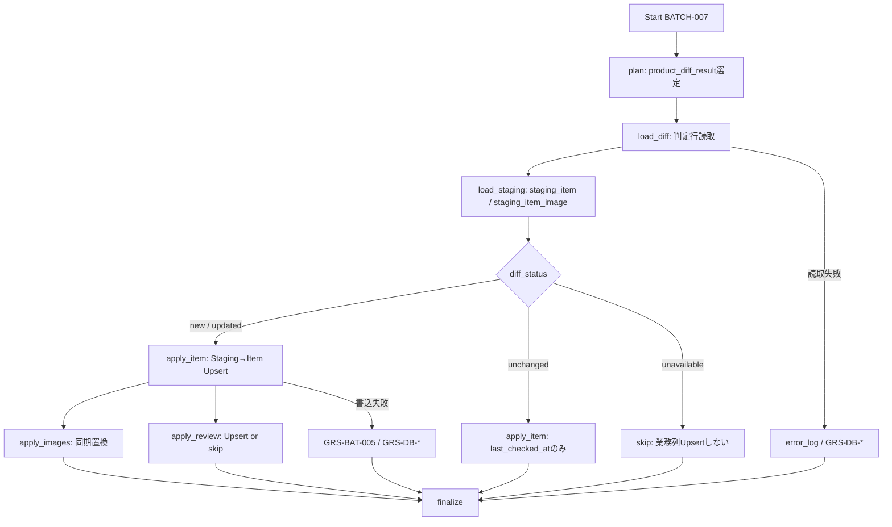

# BATCH-007 Item反映バッチ仕様書

## 1. ドキュメント情報

| 項目           | 内容                                |
| -------------- | ----------------------------------- |
| ドキュメントID | `BATCH-007`                         |
| ドキュメント名 | Item反映バッチ仕様書                |
| 対象システム   | Gift Recommendation Service / batch |
| MVP対象        | `○`                                 |
| 作成日         | 2026-07-16                          |
| 更新日         | 2026-07-16                          |

---

## 2. 概要

BATCH-007（Item反映Batch）は、BATCH-006 が確定した `product_diff_result` を消費し、対応する `staging_item` / `staging_item_image` を入力として、商品正本 `item`、商品画像 `item_image`、レビュー要約 `item_review_summary` を登録・更新する Batch である。

判定正本は **`product_diff_result`** である（`product_diff_result` テーブル定義書 Human Review #526 **確定**）。本 Batch は判定行を **読取専用**とし、差分判定・`normalized_hash` 再算出は行わない。

正本区分は **商品正本 / 商品画像参照 / レビュー要約** である。本 Batch は次を **更新しない**。

| 対象 | 理由 |
| ---- | ---- |
| `item.active_status` / `is_active` | **BATCH-008** の本更新責務 |
| `normalized_hash` の再算出 | **BATCH-005**。本 Batch は Staging 値を Item へ **コピー**するのみ |
| `item_popularity_signal` | BATCH-002 等。本 Batch 対象外 |
| `item_generation_queue` | **BATCH-009** |
| `product_diff_result` 行内容 | BATCH-006 が作成。本 Batch は読取のみ |

`diff_status` 別の反映方針概要は次のとおり（詳細は §9）。

| `diff_status` | Item 業務列 | `item_image` | `item_review_summary` |
| ------------- | ----------- | ------------ | --------------------- |
| `new` / `updated` | Staging → Upsert（hash コピー含む） | 同期置換 | Upsert（欠損時スキップ） |
| `unchanged` | 業務列 no-op。`last_checked_at`（と `updated_at`）のみ | 原則 no-op（§18.1 No.13） | 原則 no-op（§18.1 No.13） |
| `unavailable` | 原則業務列 Upsert **しない** | 原則しない | 原則しない |

---

## 3. 目的

| No | 目的 |
| -: | ---- |
| 1 | `product_diff_result` から反映対象行を選定し、`staging_item` / `staging_item_image` を解決する |
| 2 | `diff_status` に応じて `item` を Upsert、または `last_checked_at` のみ更新する |
| 3 | `new` / `updated` 時に `item_image` を item 単位同期置換し、`item_review_summary` を Upsert する |
| 4 | `active_status` / `is_active` 本更新・hash 再算出・人気シグナル・意味生成キュー登録を混入しない |
| 5 | 後続 BATCH-008 / BATCH-009 / BATCH-017 が利用できる Item 正本状態を提供する |

---

## 4. バッチ基本情報

| 項目           | 内容 |
| -------------- | ---- |
| Batch ID       | `BATCH-007` |
| Batch名        | Item反映Batch |
| 処理種別       | Staging → Item 正本 / 画像 / レビュー要約 Upsert |
| 実行基盤       | GitHub Actions。**独立子 workflow `batch-rakuten-item-apply.yml`（`batch-rakuten-item-apply*.yml`）を正**とする（§18.1 No.11）。親 item-import 全体改修は本 Epic 外 |
| 実装言語       | Python（`apps/batch`） |
| 起動方式       | 先行 Batch（BATCH-006）後続 / `workflow_dispatch`（独立 cron なし） |
| 実行頻度       | 差分判定後に連続実行 |
| 想定実行時間   | 親 item-import / existing-item-recheck チェーン内の Item 反映段（親全体の想定は 90〜120 分枠の一部）。単独再実行は対象 `product_diff_result` 件数に依存 |
| 冪等キー       | 行単位は §4.1（テーブル定義書 Human 確定を正とする） |
| 先行Batch      | `BATCH-006` |
| 後続Batch      | `BATCH-008` / `BATCH-009` / `BATCH-017`（Import Summary。条件により） |
| MVP対象        | `○` |

`Batch ID` は `BATCH-*` を使用する。処理構成上の分類IDである `BT-*`（例: `BT-EXT-006`）を Task / Issue / 成果物名の識別子として使用しない。

### 4.1 行単位冪等キー（テーブル定義書 Human 確定）

バッチ処理一覧の冪等キー欄には一覧要約がある。**物理 UNIQUE / ON CONFLICT の正本は各テーブル定義書**とする。

| テーブル | UNIQUE（正本） | バッチ処理一覧の表記 | 整合 |
| -------- | -------------- | -------------------- | ---- |
| `item` | `(source, external_item_code)` | `source + external_item_code` | **一致**（Human Review #495） |
| `item_image` | `(item_id, image_url)` | `item_id + image_url + display_order` | **テーブル定義を正**。`display_order` は更新列であり UNIQUE 構成要素ではない（Human Review #497） |
| `item_review_summary` | `(item_id)` | `item_id + source` | **テーブル定義を正**。本テーブルは `source` 列を持たない（Human Review #503）。マーケットは親 `item.source` |

---

## 5. 実行条件

### 5.1 トリガー

| トリガー | 利用有無 | 条件 | 備考 |
| -------- | -------- | ---- | ---- |
| schedule | `false` | — | 独立 cron は付けない（§18.1 No.11。BATCH-006 同型） |
| workflow_dispatch | `true` | 手動・再実行（`batch_run_id` / 明示 `external_item_code` / `staging_item_id` / 件数上限） | 失敗再実行・部分集合処理に利用 |
| 先行Batch完了 | `true`（運用上） | BATCH-006 後続、または独立 YAML を親から `workflow_call` | 親全体改修は本 Epic 外（§18.1 No.11） |
| retry-failed | `false` | MVP では workflow_dispatch で失敗キーを絞る | 再実行単位: `external_item_code`（+ 必要なら `batch_run_id`） |

### 5.2 実行前提

- 対象 `product_diff_result` が存在する（BATCH-006 完了）
- 対応する `staging_item` が `staging_item_id` で解決できること（judged_as）
- `new` / `updated` 時は `staging_item.normalized_hash` が NOT NULL であること（再 Staging 要の行は当該行失敗）
- `item` / `item_image` / `item_review_summary` の DDL が利用可能であること。本 Epic での新規 migration 追加は Human 判断対象とする
- 本 Batch から楽天 API / Object Storage は呼び出さない（外部 API なし・Raw 再読取なし）
- Database へ接続可能であること
- 同時多重起動は `GRS-BAT-003` で拒否する

---

## 6. 入力

### 6.1 入力データ

| 入力 | 種別 | 取得元 | 必須 | 用途 | 備考 |
| ---- | ---- | ------ | ---- | ---- | ---- |
| `product_diff_result` | DB | database | `true` | 反映分岐（`diff_status`）・`staging_item_id` / `external_item_code` | 判定正本。Human Review #526 **確定** |
| `staging_item` | DB | database | `true`（行単位） | Item Upsert 入力・hash コピー・レビュー列 | BATCH-005 完了済み |
| `staging_item_image` | DB | database | `false`（行単位） | `item_image` 同期置換入力 | 0 件可。Human Review #523 **確定** |
| `diff_selection` / config | 設定 | Batch config / workflow input | `true` | 選定フィルタ / 件数上限 | §18.1 No.12 |
| 明示 `external_item_code` / `staging_item_id` リスト | 入力 | workflow_dispatch | `false` | 失敗再実行・部分集合 | |

### 6.2 外部API

| API | 利用有無 | 用途 | Rate Limit / 制約 | 備考 |
| --- | -------- | ---- | ----------------- | ---- |
| - | `false` | なし | - | 本 Batch は楽天 API を呼ばない。`GRS-EXT-*` 対象外 |

### 6.3 環境変数

環境変数は名称のみ記載し、値は記載しない。

| 環境変数名 | 必須 | 用途 | secret区分 | 設定先 |
| ---------- | ---- | ---- | ---------- | ------ |
| `DATABASE_URL` | `true` | Diff / Staging 読取・Item 系更新 | secret | GitHub Secrets / local `.env`（commit 禁止） |
| `BATCH_ITEM_APPLY_MAX_ITEMS` 等 | `false` | 件数上限 | 非secret可 | config / workflow input（§18.1 No.12） |
| `BATCH_ITEM_APPLY_SOURCE` 等 | `false` | `source` フィルタ（MVP 既定 `rakuten`） | 非secret可 | config / workflow input |
| `BATCH_ITEM_APPLY_DIFF_BATCH_RUN_ID` 等 | `false` | 消費する判定 Run の絞り込み | 非secret可 | workflow input |

---

## 7. 出力

### 7.1 出力データ

| 出力 | 種別 | 出力先 | 正本区分 | 用途 | 備考 |
| ---- | ---- | ------ | -------- | ---- | ---- |
| `item` | DB | database | 商品正本 | Online / 後続 Batch 参照 | Upsert / `last_checked_at` 更新 |
| `item_image` | DB | database | 商品画像参照 | API-PUB-003 等 | 同期置換（#497 **確定**） |
| `item_review_summary` | DB | database | レビュー要約 | API-PUB-003 等 | Upsert / 欠損スキップ（#503 **確定**） |
| `batch_run_log` / `phase_log` / `error_log` | DB | database | 運用 | Run / Phase / 失敗記録 | |
| `product_diff_result` | - | - | - | **本 Batch では書込しない**（読取のみ） | BATCH-006 正本 |
| `item.active_status` / `is_active`（本更新） | - | - | - | **更新しない** | BATCH-008 |
| `normalized_hash`（再算出） | - | - | - | **算出しない** | BATCH-005。Staging → copy |
| `item_popularity_signal` / `item_generation_queue` | - | - | - | **更新しない** | BATCH-002 / BATCH-009 |

### 7.2 後続への引き渡し

| 後続 | 引き渡し内容 | 条件 |
| ---- | ------------ | ---- |
| BATCH-008 | 更新済み `item` + 未消費の `product_diff_result`（主に `unavailable`） | 有効状態本更新 |
| BATCH-009 | `item` + `product_diff_result`（`new` / 意味影響 `updated`） | キュー登録 |
| BATCH-017 | Run 集計入力（件数・status） | Import Summary（親チェーン経由時） |

### 7.3 更新リソース

| リソース | 操作 | 更新条件 | 冪等性 | 備考 |
| -------- | ---- | -------- | ------ | ---- |
| `item` | upsert / update | `new`/`updated`: 業務列 Upsert。`unchanged`: `last_checked_at`(+`updated_at`) のみ | `(source, external_item_code)` | #495 / item §12 |
| `item_image` | upsert + delete | `new`/`updated` 時の同期置換 | `(item_id, image_url)` | #497 / item_image §12 |
| `item_review_summary` | upsert（条件付き） | `new`/`updated` かつレビュー列有効時 | `(item_id)` | #503 / item_review_summary §12 |
| `batch_run_log` / `phase_log` / `error_log` | insert / update | Run / Phase / 失敗時 | Run 単位 | |
| `product_diff_result` | - | - | - | **更新しない** |
| `item.active_status` / `is_active` | - | - | - | **更新しない** |

---

## 8. 処理フロー

### 8.1 全体フロー



### 8.2 処理ステップ

|  No | Phase | 処理 | 入力 | 出力 | 失敗時の扱い |
| --: | ----- | ---- | ---- | ---- | ------------ |
| 1 | `plan` | 対象 `product_diff_result` キューを作成する（§18.1 No.12 選定既定） | config / Diff 行 | `product_diff_result_id` 一覧 | `GRS-BAT-*` |
| 2 | `load_diff` | 判定行を読み、`diff_status` / `staging_item_id` / `external_item_code` を確定する | Diff ID | Diff 行 | `GRS-DB-*` |
| 3 | `load_staging` | `staging_item` と兄弟 `staging_item_image` を読む | `staging_item_id` | Staging 行集合 | `GRS-DB-*`。Staging 欠落は当該行失敗 |
| 4 | `apply_item` | §9.2 に従い Item Upsert または `last_checked_at` のみ、または skip | Diff + Staging | `item_id`（確定時） | `GRS-BAT-005` / `GRS-DB-*` |
| 5 | `apply_images` | `new`/`updated` かつ Item 確定後、item 単位同期置換 | `item_id` + Staging 画像 | `item_image` | `GRS-BAT-005` / `GRS-DB-*` |
| 6 | `apply_review` | `new`/`updated` かつレビュー列有効時に Upsert。欠損はスキップ | `item_id` + Staging レビュー | `item_review_summary` | `GRS-BAT-005` / `GRS-DB-*` |
| 7 | `finalize` | 集計・`batch_run_log` 更新 | 各 Phase 結果 | run_status / counts | 部分成功は `GRS-BAT-002` |

処理単位は **`external_item_code`（+ 消費元 `batch_run_id`）単位**で成功 / 失敗を記録する。`item` Upsert 後に子テーブルを反映する順序は `item` テーブル定義書 §12.1 と一致させる。

実装パス想定: `apps/batch/src/batch/application/item_apply/**`。

---

## 9. データ変換・マッピング

本 Batch は外部 API レスポンスからの列変換を行わない。入力は DB 上の Diff / Staging、出力は Item 系正本である。

### 9.1 `diff_status` 別反映方針

| `diff_status` | `item` | `item_image` | `item_review_summary` | 備考 |
| ------------- | ------ | ------------ | --------------------- | ---- |
| `new` | INSERT（業務列 + `normalized_hash` + `first_fetched_at` + `last_checked_at`） | 同期置換 | Upsert（欠損スキップ） | `active_status`/`is_active` は DDL 既定のまま。本 Batch で明示更新しない |
| `updated` | UPDATE（業務列 + `normalized_hash` + `last_checked_at` + `updated_at`） | 同期置換 | Upsert（欠損スキップ） | `active_status`/`is_active` **は更新しない** |
| `unchanged` | `last_checked_at`, `updated_at` のみ | 原則 no-op（§18.1 No.13） | 原則 no-op（§18.1 No.13） | item §12 / 外部連携 §10.2（物理列名は `last_checked_at`） |
| `unavailable` | 原則業務列 Upsert **しない** | 原則しない | 原則しない | `active_status` 本更新は **BATCH-008**（§18.1 No.14） |

### 9.2 `staging_item` → `item` 列マッピング

`staging_item` テーブル定義書 §12.4（Human Review #517）を正とする。本 Batch 境界での適用可否を右列に明示する。

| staging_item 列 | item 列 | BATCH-007 での扱い | 備考 |
| --------------- | ------- | ------------------ | ---- |
| `source` | `source` | Upsert キー | #517 **確定** |
| `external_item_code` | `external_item_code` | Upsert キー | |
| `item_name` | `item_name` | `new`/`updated` で反映 | |
| `item_caption` | `item_caption` | 同上 | |
| `catchcopy` | `catchcopy` | 同上 | |
| `price` | `price` | 同上 | |
| `item_url` | `item_url` | 同上 | |
| `external_genre_id` | `external_genre_id` | 同上 | LOGICAL |
| `shop_code` | `shop_code` | 同上 | |
| `normalized_hash` | `normalized_hash` | Staging 値を **コピー**（再算出禁止） | BATCH-005 算出済み。#517 No.5 / #495 |
| `availability` | `active_status` / `is_active` | **本 Batch では写さない** | 状態遷移は BATCH-008。§12.4 の当該行は BATCH-008 入力側マッピングとして解釈 |
| `review_average` | — | 子テーブルへ | §9.4 |
| `review_count` | — | 子テーブルへ | §9.4 |

INSERT（`new`）時の追加列:

| item 列 | 設定方針 |
| ------- | -------- |
| `first_fetched_at` | Run 時刻（UTC）。以降不変 |
| `last_checked_at` | Run 時刻（UTC） |
| `active_status` / `is_active` | DDL 既定（`'active'` / `true`）を使用。本 Batch で `availability` から導出しない |

### 9.3 `staging_item_image` → `item_image`（同期置換）

`item_image` テーブル定義書 §5.4 / §12.1（Human Review #497）および `staging_item_image` テーブル定義書 #523 を正とする。

```text
1. item Upsert 完了（item_id 確定）
2. staging_item_image を raw_metadata_id + external_item_code で読取（集合 S）
3. S の各行を (item_id, image_url) で UPSERT（image_size_type / display_order / fetched_at 更新）
4. is_primary / display_order を item_image §5.3 で再計算し UPDATE
5. DELETE FROM item_image WHERE item_id = :id AND image_url NOT IN (S の URL 集合)
```

| staging / 内部 | item_image 列 | 備考 |
| -------------- | ------------- | ---- |
| 解決後 `item_id` | `item_id` | Upsert キー構成 |
| `image_url` | `image_url` | Upsert キー構成 |
| `image_size_type` | `image_size_type` | medium / small |
| `display_order` | `display_order` | 配列 index 由来。UNIQUE ではない |
| `is_primary_candidate` | `is_primary` | #523 No.4。最終は §5.3 再計算で確定してよい |
| Run 時刻 | `fetched_at` | |

S が空の場合: 同期置換の結果、既存 `item_image` は当該 `item_id` について **全 DELETE** になりうる（最新のみ方針）。運用上の例外が必要なら実装 Task で config 化する（本仕様の MVP 初期確定案は「空集合も同期置換を実行」）。

### 9.4 `staging_item` → `item_review_summary`

`item_review_summary` テーブル定義書 §12.1 / §12.2（Human Review #503）を正とする。

| 条件 | 処理 |
| ---- | ---- |
| `review_average` と `review_count` がともに有効 | `(item_id)` で UPSERT |
| いずれかが欠損・NULL | **Upsert をスキップ**し既存行を保持（DELETE しない） |
| 初回で行なし + 欠損 | 行を作成しない（1:0..1 の「0」） |

| staging_item 列 | item_review_summary 列 |
| --------------- | ---------------------- |
| （解決後）`item_id` | `item_id` |
| `review_average` | `review_average` |
| `review_count` | `review_count` |
| Run 時刻 | `fetched_at` |

本テーブルに `source` 列はない。冪等キーは **`item_id` のみ**。

### 9.5 `normalized_hash` 方針（再算出禁止）

| 観点 | 方針 |
| ---- | ---- |
| 算出主体 | **BATCH-005 のみ** |
| 本 Batch | Staging の hash を Item へ **コピー**するのみ（#517 No.5 / #495） |
| Payload 再構築 / Hash Calculator 起動 | **禁止** |

---

## 10. DB / Storage更新仕様

### 10.1 DB更新

| テーブル | 操作 | 主キー / 一意キー | 更新項目 | 競合時の扱い | 備考 |
| -------- | ---- | ----------------- | -------- | ------------ | ---- |
| `item` | upsert | `(source, external_item_code)` | §9.2 業務列 / hash / 時刻列 | ON CONFLICT DO UPDATE | IF-DB-BATCH-007。`active_status`/`is_active` は DO UPDATE 対象外 |
| `item` | update | `item_id` または Upsert キー | `last_checked_at`, `updated_at` | 行指定 UPDATE | `unchanged` 専用 |
| `item_image` | upsert + delete | `(item_id, image_url)` | size / order / primary / fetched_at | ON CONFLICT + 同期 DELETE | #497 |
| `item_review_summary` | upsert（条件付き） | `(item_id)` | average / count / fetched_at | ON CONFLICT DO UPDATE | #503。欠損時スキップ |
| `batch_run_log` / `phase_log` / `error_log` | insert / update | Run / Phase 単位 | status / counts / code | 追記 / 更新 | |
| `product_diff_result` | - | - | - | - | **更新しない** |

#### 10.1.1 Item UPSERT 疑似コード（`new` / `updated`）

```sql
INSERT INTO item (
  source,
  external_item_code,
  item_name,
  item_caption,
  catchcopy,
  price,
  item_url,
  external_genre_id,
  shop_code,
  normalized_hash,
  first_fetched_at,
  last_checked_at
) VALUES (
  :source,
  :external_item_code,
  :item_name,
  :item_caption,
  :catchcopy,
  :price,
  :item_url,
  :external_genre_id,
  :shop_code,
  :normalized_hash,
  :first_fetched_at,
  :last_checked_at
)
ON CONFLICT (source, external_item_code) DO UPDATE SET
  item_name = EXCLUDED.item_name,
  item_caption = EXCLUDED.item_caption,
  catchcopy = EXCLUDED.catchcopy,
  price = EXCLUDED.price,
  item_url = EXCLUDED.item_url,
  external_genre_id = EXCLUDED.external_genre_id,
  shop_code = EXCLUDED.shop_code,
  normalized_hash = EXCLUDED.normalized_hash,
  last_checked_at = EXCLUDED.last_checked_at,
  updated_at = now();
  -- active_status / is_active / first_fetched_at は更新しない
```

#### 10.1.2 `unchanged` 疑似コード

```sql
UPDATE item
SET last_checked_at = :checked_at,
    updated_at = now()
WHERE source = :source
  AND external_item_code = :external_item_code;
```

#### 10.1.3 item_image / item_review_summary

疑似 SQL はそれぞれ `item_image` テーブル定義書 §12.2、`item_review_summary` テーブル定義書 §12.3 に準拠する。

### 10.2 Object Storage

| オブジェクト | 操作 | path / key 方針 | 保持方針 | 備考 |
| ------------ | ---- | --------------- | -------- | ---- |
| - | **なし** | - | - | Raw JSON は読まない |

---

## 11. 冪等性・再実行性

| 観点 | 方針 |
| ---- | ---- |
| 冪等キー | `item`: `(source, external_item_code)` / `item_image`: `(item_id, image_url)` / `item_review_summary`: `(item_id)` |
| 重複実行時の扱い | 同一キーは UPSERT / 同期置換で収束。`unchanged` は時刻列のみ更新 |
| 部分失敗時の再実行 | 失敗した `external_item_code`（または `staging_item_id`）のみを workflow_dispatch で再実行 |
| 成功済みデータの skip 条件 | 同一 Run で既に成功反映済みかつ force なしなら skip 可（提案）。force 時は再 Upsert |
| rollback方針 | Item 正本の自動 rollback はしない。失敗は `error_log` で追跡し再実行で収束。Staging / Diff の Retention は物理ER §13 |

---

## 12. 状態管理

| 対象 | 状態値 | 遷移条件 | 記録先 | 備考 |
| ---- | ------ | -------- | ------ | ---- |
| Batch Run | `running` → `succeeded` / `partially_succeeded` / `failed` | finalize | `batch_run_log` | `GRS-BAT-001` / `GRS-BAT-002` |
| Phase | 各 Phase 成否 | Phase 境界 | `phase_log` | |
| Product Diff | （変更なし） | - | `product_diff_result` | 読取正本。本 Batch は書込しない |
| Item 業務列 | Upsert / no-op | `diff_status` | `item` | |
| Item 有効状態 | （変更なし） | - | - | BATCH-008 |

明細ごとに余計な中間状態を逐次更新しない（バッチ設計方針書）。

---

## 13. エラー・リトライ仕様

対象分類は `GRS-BAT-*` / `GRS-DB-*` / `GRS-VAL-*`（バッチ処理一覧・エラーコード定義書）。外部 API 系 `GRS-EXT-*`、差分判定 `GRS-BAT-007` は本 Batch の主対象外。

| エラー種別 | Error Code | 発生条件 | リトライ | 停止条件 | 備考 |
| ---------- | ---------- | -------- | -------- | -------- | ---- |
| Item 反映失敗 | `GRS-BAT-005` | Upsert / 同期置換 / レビュー反映例外 | 有（一時障害時） | 上限超過で当該キー失敗 | エラーコード定義書 |
| DB 失敗 | `GRS-DB-*` | 読取 / 書込失敗 | 有 | 上限超過 | |
| Batch 全体失敗 | `GRS-BAT-001` | 致命的失敗 | 手動再実行 | Run failed | |
| 部分成功 | `GRS-BAT-002` | 一部商品のみ失敗 | 失敗分再実行 | `partially_succeeded` | |
| 多重起動 | `GRS-BAT-003` | 同一 Batch 多重起動 | 無 | 起動拒否 | |
| Staging / Diff 不整合 | （実装で `GRS-BAT-005` または VAL 系に割当可） | judged_as Staging 欠落・hash NULL | 無（再 Staging / 再 Diff） | 当該行失敗 | |

---

## 14. ログ・監視

| 種別 | 記録内容 | 出力タイミング | 保存先 | 備考 |
| ---- | -------- | -------------- | ------ | ---- |
| batch_run_log | 開始終了・件数・status | 開始 / 終了 | DB | |
| phase_log | Phase 名と成否 | Phase 境界 | DB | |
| error_log | code / message / `batch_run_id` / `external_item_code` | 失敗時 | DB | 属性フルダンプ禁止 |
| item 更新結果 | Upsert / touch / skip 区分 | apply_* | 集計 | item_import_summary 入力 |
| item_import_summary | 件数集計入力 | 後続 BATCH-017 | — | 本 Batch は集計専用にしない |

### 14.1 メトリクス

| Metric | 内容 | 集計単位 | 用途 |
| ------ | ---- | -------- | ---- |
| `diff_selected_count` | 選定件数 | batch_run | 監視 |
| `item_inserted_count` | `new` Insert 件数 | batch_run | 品質 |
| `item_updated_count` | `updated` Upsert 件数 | batch_run | 同上 |
| `item_unchanged_touch_count` | `last_checked_at` のみ更新件数 | batch_run | 同上 |
| `item_unavailable_skip_count` | `unavailable` スキップ件数 | batch_run | BATCH-008 入力量確認 |
| `item_image_sync_count` | 画像同期した item 件数 | batch_run | 同上 |
| `item_review_upsert_count` | レビュー Upsert 件数 | batch_run | 同上 |
| `item_review_skip_count` | レビュー欠損スキップ件数 | batch_run | 同上 |
| `item_apply_failed_count` | 反映失敗件数 | batch_run | アラート |

---

## 15. セキュリティ・外部サービス利用

| 観点 | 方針 |
| ---- | ---- |
| secret取り扱い | DB 認証情報は GitHub Secrets / local `.env` のみ。docs・ログ・PR・fixture に実値を書かない |
| 外部API key | 本 Batch では楽天 API キー不要 |
| ログ出力制限 | 商品属性・画像 URL・hash のフルダンプ禁止。接続文字列をログに出さない |
| 個人情報・機微情報 | 商品公開情報・コードのみ。不要フィールドはログしない |
| GitHub Actions permissions | contents / 必要最小の secrets 参照に限定。`write-all` 禁止 |
| コスト・Rate Limit | DB 読取・書込のみ。楽天 Rate Limit 非該当 |

---

## 16. テスト観点

|  No | 観点 | 確認内容 | 種別 |
| --: | ---- | -------- | ---- |
| 1 | 正常系 `new` | Item Insert + 画像同期 + レビュー Upsert。`active_status` 既定のまま | unit / integration |
| 2 | 正常系 `updated` | 業務列 + hash 更新。`active_status`/`is_active` が変わらない | unit / integration |
| 3 | 正常系 `unchanged` | 業務列不変。`last_checked_at`（と `updated_at`）のみ更新 | unit / integration |
| 4 | `unavailable` スキップ | Item 業務列 / 画像 / レビューを更新しない | unit |
| 5 | hash 再算出なし | Hash Calculator 非起動。Staging hash を改変せず copy | unit |
| 6 | 画像同期置換 | 消えた URL が DELETE。Upsert キーは `(item_id, image_url)` | unit / integration |
| 7 | レビュー欠損 | Upsert スキップ・既存保持・DELETE なし | unit |
| 8 | レビュー冪等 | UNIQUE は `item_id` のみ（`source` 列なし） | unit |
| 9 | 冪等再実行 | 同一キー再実行で収束 | unit / integration |
| 10 | 部分成功 | 一部失敗で `GRS-BAT-002` | unit |
| 11 | 多重起動 | `GRS-BAT-003` | unit |
| 12 | 非更新境界 | `item_popularity_signal` / `item_generation_queue` / `product_diff_result` が変わらない | integration |
| 13 | secret 非含有 | ログ・fixture・docs に認証情報なし | review / unit |

---

## 17. 変更管理

### 17.1 変更履歴

| 日付 | 変更内容 | 関連Issue / PR |
| ---- | -------- | -------------- |
| 2026-07-16 | 初版作成 | Epic #1356 / Task #1357 |
| 2026-07-16 | §18.1 No.11〜16 を Human 確定（旧 §18.2 No.1〜6 推奨案を MVP 初期採用）。§18.2 を解消 | Epic #1356 / Task #1357 |
| 2026-08-05 | §18.1 No.12: 選定スキャン拡張と歴史的 new スキップの実装注記（#1855） | #1855 |

---

## 18. 未決事項・決定事項

### 18.1 採用方針（Human 確定）

以下は Human Review 済みテーブル定義および MVP 初期採用方針を正とし、本仕様書では **確定** として扱う。

|  No | 論点 | 内容 | 判断者 | 状態 | 備考 |
| --: | ---- | ---- | ------ | ---- | ---- |
| 1 | Item Upsert キー | **`(source, external_item_code)`** | Human（#495） | **確定** | item §7 / §12 |
| 2 | hash 算出タイミング | **BATCH-005 内で確定。BATCH-007 は Staging → Item へコピーのみ** | Human（#517 No.5 / #495） | **確定** | §9.5 |
| 3 | Staging → Item 列マッピング | `staging_item` §12.4（業務列） | Human（#517） | **確定** | §9.2。`availability`→有効状態は BATCH-008 |
| 4 | `item_image` 同期置換 | 最新のみ Upsert + item 単位 DELETE | Human（#497 / #523） | **確定** | §9.3 |
| 5 | `item_image` UNIQUE | **`(item_id, image_url)`**（`display_order` は UNIQUE 外） | Human（#497） | **確定** | §4.1 |
| 6 | `item_review_summary` UNIQUE | **`(item_id)` のみ**（`source` 列なし） | Human（#503） | **確定** | §4.1 / §9.4 |
| 7 | レビュー欠損時 | Upsert スキップ・前回値保持・DELETE しない | Human（#503） | **確定** | §9.4 |
| 8 | `diff_status` 正本 | **`product_diff_result`**。本 Batch は読取 | Human（#526） | **確定** | §2 / §6 |
| 9 | `unchanged` の Item 業務列 | **no-op**。`last_checked_at`（と `updated_at`）のみ | Human（item §12 / #526 後続分岐） | **確定** | §9.1 |
| 10 | `unavailable` の有効状態 | **BATCH-008** で `active_status` 本更新 | Human（バッチ処理一覧 / BATCH-008 仕様） | **確定** | §2 / §9.1 |
| 11 | 子 workflow 配置 | **独立 YAML `batch-rakuten-item-apply.yml`（`batch-rakuten-item-apply*.yml`）を正**とする。親 `batch-rakuten-item-import.yml` / `batch-rakuten-existing-item-recheck.yml` **全体改修は本 Epic 外**。将来親から `workflow_call` してよい | Human | **確定**（2026-07-16・MVP 初期） | BATCH-005 / BATCH-006 同型。Epic `human_decision_points`。旧 §18.2 No.1 |
| 12 | `product_diff_result` 選定既定 | **既定フィルタ:** (1) 対象 `batch_run_id`（先行 BATCH-006 Run または明示） (2) `diff_status IN ('new','updated','unchanged')` を主処理。`unavailable` は skip 集計のみ (3) 件数上限 `BATCH_ITEM_APPLY_MAX_ITEMS` (4) 任意で明示 `external_item_code` リスト。`source` は Staging 経由で既定 `rakuten`。**実装注記（#1855）:** DbReader 制約のため先頭読取窓で予算を満たせない場合は `limit` を拡張して再スキャン。歴史的 `new` で既に `item` がある行は選定スキップ（予算浪費防止）。`updated` / `unchanged` は対象のまま | Human | **確定**（2026-07-16・MVP 初期） | 旧 §18.2 No.2 |
| 13 | `unchanged` 時の画像 / レビュー | **原則 no-op**（item 業務列と同趣旨。hash 一致なら子も変更なし想定）。再同期が必要な運用は force フラグまたは別 Run で `updated` 扱いを検討 | Human | **確定**（2026-07-16・MVP 初期） | 旧 §18.2 No.3 |
| 14 | `unavailable` スキップ詳細 | **Item 業務列 / `item_image` / `item_review_summary` を一切更新しない**。`last_checked_at` も更新しない（存在確認・無効化は BATCH-008）。既存 Item が無い `unavailable` も Insert しない | Human | **確定**（2026-07-16・MVP 初期） | product_diff_result §12.3 と整合。旧 §18.2 No.4 |
| 15 | 画像空集合の同期置換 | Staging 画像 0 件でも同期置換を実行し、既存 URL を DELETE しうる | Human | **確定**（2026-07-16・MVP 初期） | §9.3。旧 §18.2 No.5 |
| 16 | `new` 時の初期 `active_status` | DDL 既定（`active` / `true`）を使用。`availability` から導出しない | Human | **確定**（2026-07-16・MVP 初期） | §9.2。BATCH-008 境界。旧 §18.2 No.6 |

### 18.2 残未決事項（Human 判断）

本仕様書時点で、Human 判断待ちの残未決事項はない（MVP 初期は旧 §18.2 推奨案をすべて採用）。

---

## 19. 関連資料

| 種別 | パス / URL | 用途 |
| ---- | ---------- | ---- |
| 正本一覧 | `docs/05_アプリケーション設計/アプリ/batch/バッチ処理一覧.md` | BATCH-007 行・モジュール・エラー分類 |
| 設計方針 | `docs/05_アプリケーション設計/アプリ/batch/バッチ設計方針書.md` | Item 反映・冪等・ログ方針 |
| 依存 | `docs/05_アプリケーション設計/アプリ/batch/バッチ依存関係図.md` | 006 → 007 → 008/009 |
| スケジュール | `docs/05_アプリケーション設計/アプリ/batch/バッチ実行スケジュール設計書.md` | item-import チェーン内の段 |
| 外部連携 | `docs/05_アプリケーション設計/アプリ/外部商品データ連携設計書.md` | §6.3 / §10.2–§10.3 / §11 |
| テーブル | `docs/06_実装設計/database/item_テーブル定義書.md` | Upsert・hash・`last_checked_at` |
| テーブル | `docs/06_実装設計/database/item_image_テーブル定義書.md` | 同期置換 |
| テーブル | `docs/06_実装設計/database/item_review_summary_テーブル定義書.md` | Upsert / 欠損スキップ |
| テーブル | `docs/06_実装設計/database/staging_item_テーブル定義書.md` | §12.4 列マッピング・#517 |
| テーブル | `docs/06_実装設計/database/staging_item_image_テーブル定義書.md` | 画像 Staging・#523 |
| テーブル | `docs/06_実装設計/database/product_diff_result_テーブル定義書.md` | 判定入力・#526 |
| 先行仕様 | `docs/06_実装設計/batch/BATCH-006_商品差分判定バッチ仕様書.md` | 先行境界 |
| 後続参照 | `docs/06_実装設計/batch/BATCH-008_商品有効状態更新バッチ仕様書.md` | `active_status` 本更新 |
| エラー | `docs/05_アプリケーション設計/アプリ/エラーコード定義書.md` | GRS-BAT-005 等 |
| Epic / Task | `prompts/definitions/epics/batch-007-item-apply/epic.yaml` 等 | scope |

---

## 20. レビュー観点

- バッチ処理一覧の BATCH-007 と ID・入出力・先行後続・モジュールが一致している
- `active_status` / `is_active` 本更新が混入していない（BATCH-008）
- `normalized_hash` 再算出が混入していない（Staging コピーのみ）
- `unavailable` 原則スキップと `unchanged` の `last_checked_at` のみ更新が明記されている
- 冪等キーがテーブル定義書 UNIQUE と一致し、一覧要約との差分（`item_image` / `item_review_summary`）が説明されている
- §18.1 の Human **確定**（テーブル定義 No.1〜10 / MVP 初期 No.11〜16）が本文・境界と矛盾していない
- `item_popularity_signal` / `item_generation_queue` 非更新が明記されている
- secret / `.env` 実値が含まれていない
- PR target が親 Epic Branch（`feature/epic-1356-batch-007-item-apply`）である

---

## 21. 備考

### 21.1 Out of scope

| 対象 | 理由 |
| ---- | ---- |
| `item.active_status` / `is_active` 本更新 | BATCH-008 |
| `item_generation_queue` 登録 | BATCH-009 |
| `normalized_hash` 再算出・Payload 再構築 | BATCH-005 |
| `product_diff_result` 作成・再判定 | BATCH-006 |
| `item_popularity_signal` 更新 | BATCH-002 等 |
| 楽天 API / Raw Object Storage 読取 | BATCH-001〜005 |
| 親 item-import / existing-item-recheck **全体**改修 | Epic risk・BATCH-006 方針 |
| 新規 DB migration | Human 判断 |
| OpenAPI / generated | Contract Gate 不要 |
| Python 実装・workflow YAML・UT | 後続 Task |
| BATCH-008 / 009 の詳細実装設計 | 各後続 Epic / 仕様 |

### 21.2 BATCH-006 / BATCH-008 との境界

| Batch | 責務 | 本 Batch との関係 |
| ----- | ---- | ----------------- |
| BATCH-006 | hash 比較、`product_diff_result` 記録 | 先行必須。本 Batch は判定行を読む |
| BATCH-007（本） | Staging → Item / 画像 / レビュー反映 | 有効状態は触らない |
| BATCH-008 | `unavailable` 等から `active_status` 本更新 | 後続 |
| BATCH-009 | 意味生成キュー登録 | 後続。本 Batch はキュー非更新 |

### 21.3 実装・運用メモ

- 本仕様書は実装・単体テスト Task の入力正本とする
- 実装パス想定: `apps/batch/src/batch/application/item_apply/**`
- 主要モジュール（バッチ処理一覧）: Item Updater / Item Image Updater / Item Review Summary Updater / Product Diff Result Reader / Batch Logger / Error Handler
- 子 workflow は `workflow_call` / `workflow_dispatch` を基本とし、親チェーン全体の改修は本 Epic 外（§18.1 No.11 **確定**）
- Contract Gate 不要（Batch は HTTP API 化しない）
- Epic #1356 / Task #1357
