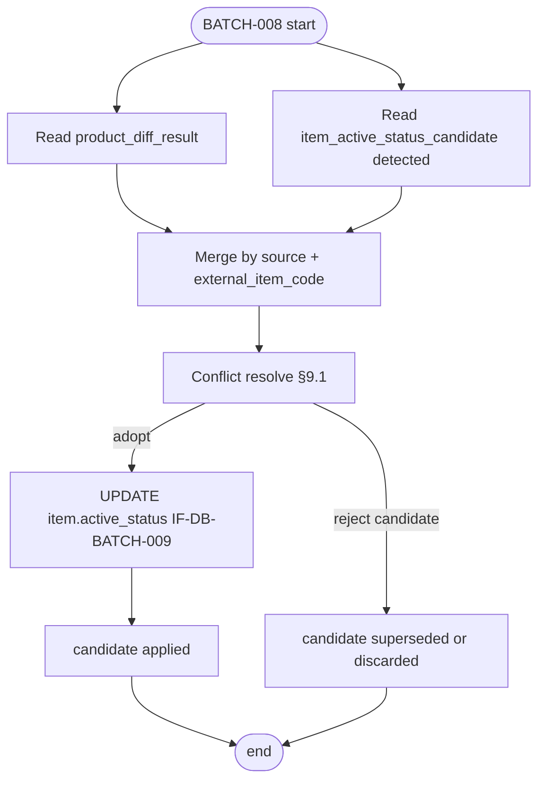

# BATCH-008 商品有効状態更新バッチ仕様書

## 1. ドキュメント情報

| 項目           | 内容                                 |
| -------------- | ------------------------------------ |
| ドキュメントID | `BATCH-008`                          |
| ドキュメント名 | 商品有効状態更新バッチ仕様書         |
| 対象システム   | Gift Recommendation Service / batch  |
| MVP対象        | `○`                                  |
| 作成日         | 2026-07-15                           |
| 更新日         | 2026-07-15                           |

---

## 2. 概要

BATCH-008（商品有効状態更新Batch）は、販売不可・取得不能・必須項目不足・除外対象などの判定入力を読み取り、`item.active_status`（および関連する推薦対象可否）を本更新する Batch である。

入力は次の **2 経路** を対象とする。

| 経路 | 入力 | 読み取り IF | 主な生産 Batch |
| ---- | ---- | ----------- | -------------- |
| A. Product Diff 経路 | `product_diff_result`（例: `diff_status=unavailable`） | IF-DB-BATCH-006 | BATCH-006 |
| B. Active Status Candidate 経路 | `item_active_status_candidate`（主に `candidate_status=detected`） | IF-DB-BATCH-021 | BATCH-004（Writer は IF-DB-BATCH-020） |

両経路を **両方読む**。同一 Item で結果が食い違う場合は §9.1（BATCH-004 §18.1.1 / テーブル定義書 §5.3）の競合解決を適用する。

`item.active_status` の本更新 I/F は **IF-DB-BATCH-009** である。候補テーブル自身への INSERT は行わない（Writer は BATCH-004）。Online / api / reco からの Direct 参照はしない。

本仕様書の作成契機は付随 Epic #1227（`item_active_status_candidate`）の T5（#1233）である。専用の `[Epic]BATCH-008:...` が未作成の時点では、候補 Reader / Applier と競合手順の正本を本ドキュメントに置く。BATCH-008 縦串（実装 Epic）の起票は Human / Orchestrator 判断とする（§18.2）。

---

## 3. 目的

| No | 目的 |
| -: | ---- |
| 1 | `product_diff_result` と `item_active_status_candidate` の両方から有効状態更新入力を収集する |
| 2 | 制限側優先・同時刻比較・復帰条件に従い、適用する `active_status` を一意に決める |
| 3 | `item.active_status`（IF-DB-BATCH-009）を本更新する |
| 4 | 採用 / 不採用に応じて候補 `candidate_status` を `applied` / `superseded` / `discarded` へ遷移する（IF-DB-BATCH-021） |
| 5 | 未適用候補（`detected`）を Retention で削除せず、再実行で再消費可能にする |

---

## 4. バッチ基本情報

| 項目           | 内容 |
| -------------- | ---- |
| Batch ID       | `BATCH-008` |
| Batch名        | 商品有効状態更新Batch |
| 処理種別       | Item 有効状態本更新 / 候補適用 |
| 実行基盤       | GitHub Actions（商品取込チェーン `batch-rakuten-item-import.yml` 内、または BATCH-004 後続の独立起動。詳細はスケジュール設計書） |
| 実装言語       | Python（`apps/batch`） |
| 起動方式       | 先行 Batch 完了後続 / `workflow_dispatch` |
| 実行頻度       | Item 反映後、または既存商品再確認（BATCH-004）後 |
| 冪等キー       | Item 更新: `source` + `external_item_code`（= item 突合）<br>候補更新: `item_active_status_candidate_id`（または UNIQUE `batch_run_id`+`source`+`external_item_code`） |
| 先行Batch      | `BATCH-006` / `BATCH-007` / `BATCH-004`（一覧正本。必須直列は運用・workflow 設計による） |
| 後続Batch      | `BATCH-017`（Import Summary）等。意味生成キュー（BATCH-009）とは並列になりうる |
| MVP対象        | `○` |

`Batch ID` は `BATCH-*` を使用する。処理構成上の分類 ID（`BT-*`）を Issue / 成果物名の識別子として使わない。

---

## 5. 実行条件

### 5.1 トリガー

| トリガー | 利用有無 | 条件 | 備考 |
| -------- | -------- | ---- | ---- |
| 先行Batch完了 | `true` | BATCH-006/007 後、または BATCH-004 後 | バッチ処理一覧の起動条件に整合 |
| workflow_dispatch | `true` | 手動再実行・部分集合適用 | 失敗 Item / 特定 `batch_run_id` を絞って再実行可 |
| schedule | `false`（直接） | 独立日次 schedule は正としない | 親オーケストレータ経由 |

### 5.2 実行前提

- `item` 正本および `active_status` カラムが利用可能であること
- 経路 A を使う場合: 対象 Run の `product_diff_result` が存在すること
- 経路 B を使う場合: `item_active_status_candidate` に `candidate_status=detected` 行が存在しうること（0 件でも Batch 自体は成功しうる）
- Phase4a `batch-foundation`（#734）のログ / エラー骨格が利用可能であること
- Online 経路から候補テーブルを読まないこと

---

## 6. 入力

### 6.1 入力データ

| 論理名 | 物理 / 区分 | 取得元 | 必須 | 用途 |
| ------ | ----------- | ------ | ---- | ---- |
| Product Diff 結果 | `product_diff_result` | BATCH-006 | 経路 A 利用時 | 制限候補（主に `unavailable`） |
| Active Status 候補 | `item_active_status_candidate` | BATCH-004 | 経路 B 利用時 | `detected` 行の読取・適用 |
| Item 正本 | `item` | DB | `true`（更新対象解決時） | 突合・現行 `active_status` 参照・本更新 |
| apply_plan（任意） | config / workflow input | 運用 | `false` | `batch_run_id` / `source` / 件数上限 / 特定コード指定 |

### 6.2 外部API

外部 API は呼び出さない。判定は DB 上の派生結果のみを用いる。

### 6.3 環境変数

| 種別 | 方針 |
| ---- | ---- |
| DB 接続 | 既存 batch 共通。実値は Secrets。本仕様書に実値を書かない |
| 外部 API Key | **不要** |

---

## 7. 出力

### 7.1 出力データ

| 論理名 | 物理 | 更新主体モジュール | 備考 |
| ------ | ---- | ------------------ | ---- |
| Item 有効状態 | `item.active_status` / `is_active`（方針に従う） | Item Active Status Updater | IF-DB-BATCH-009 |
| 候補 status | `item_active_status_candidate.candidate_status` 等 | Item Active Status Candidate Reader / Applier | IF-DB-BATCH-021 |
| Batch / Phase / Error Log | `batch_run_log` / `phase_log` / `error_log` | Batch Logger / Error Handler | 共通 |

### 7.2 後続への引き渡し

| 後続 | 引き渡し | 条件 |
| ---- | -------- | ---- |
| BATCH-017 | ログ・件数 | Run 集計 |
| Online / reco | 更新済み `item.active_status` | 次 Retrieval から反映（Direct 参照なし） |
| T7 Retention cleanup | `applied` / `superseded` / `discarded` 行 | 適用後 14 日。本 Batch では DELETE しない |

### 7.3 更新リソース

| リソース | 操作 | IF |
| -------- | ---- | -- |
| `item` | UPDATE（`active_status` 等） | IF-DB-BATCH-009 |
| `item_active_status_candidate` | SELECT / UPDATE | IF-DB-BATCH-021 |
| `product_diff_result` | SELECT（更新しない） | IF-DB-BATCH-006 |
| `raw_product_metadata` | **触れない** | — |

---

## 8. 処理フロー

### 8.1 概要フロー

```text
1. batch_run 開始・入力 scope 解決（apply_plan）
2. 経路 A: product_diff_result から更新候補を抽出
3. 経路 B: item_active_status_candidate（detected）を抽出
4. Item 単位（source + external_item_code）でマージ
5. 競合解決（§9.1）→ 適用 active_status を決定
6. item.active_status 本更新（IF-DB-BATCH-009）
7. 候補行の status 更新（applied / superseded / discarded）
8. メトリクス・ログ・Run 終了
```



### 8.2 処理ステップ

| # | phase | 処理 | 入力 | 出力 | 失敗時 |
| - | ----- | ---- | ---- | ---- | ------ |
| 1 | `plan` | apply_plan / Run 条件解決 | config / workflow | scope | Run 失敗 |
| 2 | `read_diff` | Product Diff 抽出 | `product_diff_result` | 経路 A 提案集合 | 当該件スキップまたは Run 失敗（運用方針） |
| 3 | `read_candidate` | 未適用候補抽出 | `item_active_status_candidate` | 経路 B 提案集合 | 同上 |
| 4 | `resolve` | 競合解決 | A ∪ B | Item ごとの採用提案 | 解決不能は `discarded` + ログ |
| 5 | `apply_item` | Item 本更新 | 採用提案 | `item.active_status` | 当該件失敗。候補は `detected` のまま残して再実行可 |
| 6 | `apply_candidate` | 候補 status 更新 | 解決結果 | `applied` / `superseded` / `discarded` | Item 更新成功済みなら補償または次回整合 |

### 8.3 モジュール対応（バッチ処理一覧）

| モジュール | 責務 |
| ---------- | ---- |
| Product Diff Result Reader | 経路 A 読取 |
| Item Active Status Candidate Reader | 経路 B 読取（IF-DB-BATCH-021 SELECT） |
| Item Active Status Updater | 競合解決・Item 本更新（IF-DB-BATCH-009）・候補 status 更新 |
| Staging Validator | 必須項目不足など追加判定が必要な場合（MVP は差分 / 候補根拠を優先） |
| Error Handler / Batch Logger | 失敗記録・再実行情報 |

---

## 9. 判定・競合解決

### 9.1 入力競合（Human 確定・BATCH-004 §18.1.1）

BATCH-008 は両経路を読む。同一 Item（`source` + `external_item_code`）で食い違う場合:

| 状況 | 方針 |
| ---- | ---- |
| 制限度が異なる | **制限側を優先**する。強い順: `excluded` > `unavailable` > `inactive` > `active` |
| 制限度が同じ | **新しい時刻を優先**する（候補の `detected_at` と `product_diff_result.judged_at` を比較） |
| 復帰（`active` 化） | **専用候補で「取得成功かつ販売可能」が明示された場合のみ**。`product_diff_result.unavailable` 単独では復帰しない |

根拠（推論・正本転記）: 初期は検知ノイズ・部分失敗が多い。誤って販売不可を推薦し続けるリスクより、誤除外の方が運用で再確認・復帰しやすい。

### 9.2 経路 A → 提案 `active_status`（MVP 初期）

| `product_diff_result.diff_status` | 提案 `active_status` | 備考 |
| --------------------------------- | -------------------- | ---- |
| `unavailable` | `unavailable` | 一覧・テーブル定義書の BATCH-008 入力想定 |
| `new` / `updated` / `unchanged` | （本経路では制限提案なし） | 有効状態をこれらの差分だけで上げない |

必須項目不足・明示除外など、差分以外のルールが必要な場合は Staging Validator / 運用ルールで `excluded` 等を提案しうる（詳細マッピングの拡張は §18.2）。

### 9.3 経路 B → 提案 `active_status`

| 条件 | 提案 |
| ---- | ---- |
| `candidate_status = detected` | `candidate_active_status` をそのまま提案値とする |
| `detection_basis` / `reason_code` | 監査用。競合の制限度比較には `candidate_active_status` を用いる |

復帰（現行が制限側で提案が `active`）は、§9.1 の復帰条件を満たす場合のみ採用する。典型例: `detection_basis` が取得成功かつ販売可能を示す候補（テーブル定義書 §6.1 の方針に整合）。

### 9.4 現行値との比較

| 比較結果 | 扱い |
| -------- | ---- |
| 採用提案 = 現行 `item.active_status` | Item UPDATE はスキップ可。対応候補は `applied`（実質適用済み）または `discarded`（変更なし）のいずれかでよい。MVP 推奨は **`applied`**（監査上「処理済み」） |
| 採用提案 ≠ 現行 | IF-DB-BATCH-009 で UPDATE |
| 提案なし | no-op |

### 9.5 候補 status 遷移（Applier）

| 遷移先 | 条件 |
| ------ | ---- |
| `applied` | 本 Run で当該候補の提案を採用し、Item 側を更新（または既に同一値で処理済み）した |
| `superseded` | 同一 Item で他の入力（新しい候補 / Diff）が制限側または新しい時刻で勝ち、本候補を不採用にした |
| `discarded` | 根拠不足・スコープ外・ルール上スキップ |
| （維持 `detected`） | Item 更新失敗など、再実行で再消費すべき場合。**Retention で削除しない** |

`applied` 時は `applied_at` を必須設定（テーブル CHECK と整合）。

---

## 10. DB 更新仕様

### 10.1 読取（IF-DB-BATCH-021）

```text
SELECT *
FROM item_active_status_candidate
WHERE candidate_status = 'detected'
  AND source = :source          -- MVP: rakuten
  AND (
    :batch_run_id IS NULL OR batch_run_id = :batch_run_id
  )
  -- 任意: external_item_code IN (...)
ORDER BY detected_at ASC;
```

Index 想定: `idx_item_active_status_candidate_status`（`candidate_status`, `detected_at`）。

### 10.2 Item 本更新（IF-DB-BATCH-009）

```text
UPDATE item
SET active_status = :adopted_active_status,
    -- is_active は active_status 方針に従って同期（既存 item 定義に従う）
    updated_at = now()
WHERE source = :source
  AND external_item_code = :external_item_code;
```

物理 FK は候補テーブルから張らない。突合は `source` + `external_item_code`（`item_id` があれば補助）。

### 10.3 候補 status 更新（IF-DB-BATCH-021）

```text
-- 採用
UPDATE item_active_status_candidate
SET candidate_status = 'applied',
    applied_at = now(),
    updated_at = now()
WHERE item_active_status_candidate_id = :id
  AND candidate_status = 'detected';

-- 不採用（競合負け）
UPDATE item_active_status_candidate
SET candidate_status = 'superseded',  -- または discarded
    updated_at = now()
WHERE item_active_status_candidate_id = :id
  AND candidate_status = 'detected';
```

### 10.4 Product Diff

`product_diff_result` は **SELECT のみ**。本 Batch で Diff 行を削除・更新しない（Retention は Diff 側定義に従う）。

### 10.5 禁止事項

- 候補を `raw_product_metadata` に書き戻さない
- Online テーブル以外への候補露出をしない
- `detected` 行を本 Batch 成功時に DELETE しない（即時削除禁止。§11）

---

## 11. 冪等性・再実行性・Retention

| 項目 | 方針 |
| ---- | ---- |
| Item 更新の冪等 | 同一提案値の再適用は no-op または同一値 UPDATE |
| 候補の再消費 | `detected` のみを主対象。`applied` 済みは再適用しない |
| 部分失敗 | 失敗 Item の候補は `detected` のまま残し、workflow_dispatch で再実行 |
| Retention（Human 確定） | `detected`: **削除しない**<br>`applied` / `superseded` / `discarded`: **`applied_at` または `updated_at` + 14 日** 後に cleanup（T7）。本 Batch では DELETE しない |

---

## 12. 状態管理

| 状態 | 正本 |
| ---- | ---- |
| `item.active_status` | enum定義書 §6.10 / `item_active_status.yaml`（`active` / `inactive` / `unavailable` / `excluded`） |
| `candidate_status` | enum定義書 §6.27 / `item_active_status_candidate_status.yaml` |
| `product_diff_status` | enum定義書 §6.9 |

遷移詳細はテーブル定義書 §11.1 / 本仕様 §9.5。

---

## 13. エラー・リトライ仕様

| 区分 | 方針 |
| ---- | ---- |
| 単件 DB 失敗 | 当該 Item を失敗記録。他 Item は継続（best-effort） |
| 競合解決不能 | `discarded` + `error_log` / phase 警告。Item は変更しない |
| Run 全体失敗 | 未処理 `detected` は残るため再実行で回復 |
| 外部 API | なし |

エラーコード体系はバッチ処理一覧の `GRS-DB-*` / `GRS-VAL-*` に従う。

---

## 14. ログ・監視

### 14.1 メトリクス（推奨）

| メトリクス | 意味 |
| ---------- | ---- |
| `diff_input_count` | 経路 A 入力件数 |
| `candidate_input_count` | 経路 B（`detected`）件数 |
| `item_status_updated_count` | Item 本更新件数 |
| `candidate_applied_count` | `applied` 件数 |
| `candidate_superseded_count` | `superseded` 件数 |
| `candidate_discarded_count` | `discarded` 件数 |
| `reactivation_count` | `active` 復帰採用件数 |

---

## 15. セキュリティ

- secret / 認証情報をログ・docs・fixture に出さない
- 候補テーブルは batch 内部データ。Public API に露出しない
- SQL は Repository 経由。動的 SQL 連結を避ける

---

## 16. テスト観点

| 観点 | 内容 |
| ---- | ---- |
| 競合・制限側優先 | Diff=`inactive` と候補=`unavailable` → `unavailable` を採用 |
| 競合・同時刻 | 制限度同一で新しい時刻側を採用 |
| 復帰 | 候補で販売可能明示のみ `active` 可。Diff `unavailable` 単独では復帰しない |
| 冪等 | 同一提案の再実行で二重副作用がない |
| 失敗再実行 | 失敗後も `detected` が残り再消費できる |
| IF 境界 | 候補 INSERT をしない / Raw 非更新 / Online 非参照 |
| unit | DB / Item は fixture・mock。production DB 禁止 |

実装・UT は T6（#1234）。本 Task（T5）は仕様書のみ。

---

## 17. 変更管理

### 17.1 変更履歴

| 日付 | 内容 | 関連 |
| ---- | ---- | ---- |
| 2026-07-15 | 初版。候補 Reader / Applier・競合・Retention（008 側手順）を定義 | #1233 / Epic #1227 / BATCH-004 §18.1.1 |

---

## 18. 未決事項・決定事項

### 18.1 決定事項（本仕様書での採用方針）

| No | 事項 | 方針 | 確定 | 日付 |
| -: | ---- | ---- | ---- | ---- |
| 1 | 入力経路 | `product_diff_result` と `item_active_status_candidate` を **両方読む** | Human（§18.1.1） | 2026-07-14 |
| 2 | 競合 | 制限側優先 → 同時刻は新しい時刻 → 復帰は候補明示時のみ | Human | 2026-07-14 |
| 3 | 本更新 IF | `item.active_status` は IF-DB-BATCH-009。候補 I/O は IF-DB-BATCH-021 | T4b | 2026-07-15 |
| 4 | Retention 手順（008） | 本 Batch は DELETE しない。T7 が 14 日 cleanup | Human | 2026-07-14 |
| 5 | Raw | 候補を raw に載せない / 008 も raw 非更新 | Human | 2026-07-14 |

### 18.2 残未決事項

| No | 事項 | 扱い |
| -: | ---- | ---- |
| 1 | 専用 `[Epic]BATCH-008:...` の起票と縦串（実装・UT）の親 | Human / Orchestrator。当面 T5/T6 は Epic #1227 配下 |
| 2 | Diff 以外の `excluded` 自動判定の完全表 | 必要になった時点で追記（Staging Validator） |
| 3 | `is_active` と `active_status` の同期式の実装詳細 | item テーブル定義書に従い T6 で確定 |
| 4 | workflow を item-import 内に置くか独立 YAML にするか | スケジュール / 実装 Epic 側 |

---

## 19. 関連資料

| 資料 | パス / 参照 | 関係 |
| ---- | ----------- | ---- |
| 制約正本（候補） | `docs/06_実装設計/batch/BATCH-004_楽天既存商品再確認バッチ仕様書.md` §18.1 No.7 / §18.1.1 | Writer 側制約・競合・Retention |
| テーブル定義書 | `docs/06_実装設計/database/item_active_status_candidate_テーブル定義書.md` | 物理・遷移・§12.3 Applier 概要 |
| Product Diff | `docs/06_実装設計/database/product_diff_result_テーブル定義書.md` | 経路 A |
| インターフェース一覧 | `docs/05_アプリケーション設計/アプリ/インターフェース一覧.md` | IF-DB-BATCH-006 / 009 / 020 / 021 |
| バッチ処理一覧 | `docs/05_アプリケーション設計/アプリ/batch/バッチ処理一覧.md` | BATCH-008 行 |
| バッチ設計方針書 | `docs/05_アプリケーション設計/アプリ/batch/バッチ設計方針書.md` | BATCH-008 概要 |
| Epic | #1227 | 候補テーブル付随整備（本仕様の作成親） |
| Task | #1233（T5） / #1234（T6） / #1235（T7） | Reader 仕様 / Applier 実装 / Retention |

---

## 20. 実装・運用メモ

- 実装・単体テスト Task の入力正本は本仕様書（T6）
- 想定モジュール配置: `apps/batch` 配下の Item Active Status Updater / Candidate Reader（パスは実装時に既存 batch 構成へ合わせる）
- Contract Gate 不要（HTTP API 化しない）
- unit は fixture / mock 正。production DB / 実 secret 禁止
- Retention cleanup（T7）と本 Batch の責務を混ぜない
- BATCH-004 Writer（T4a #1231）は `#1222` 縦串完了 + Epic #1227 への develop 再取込後に開始（Human 確定済み運用）
