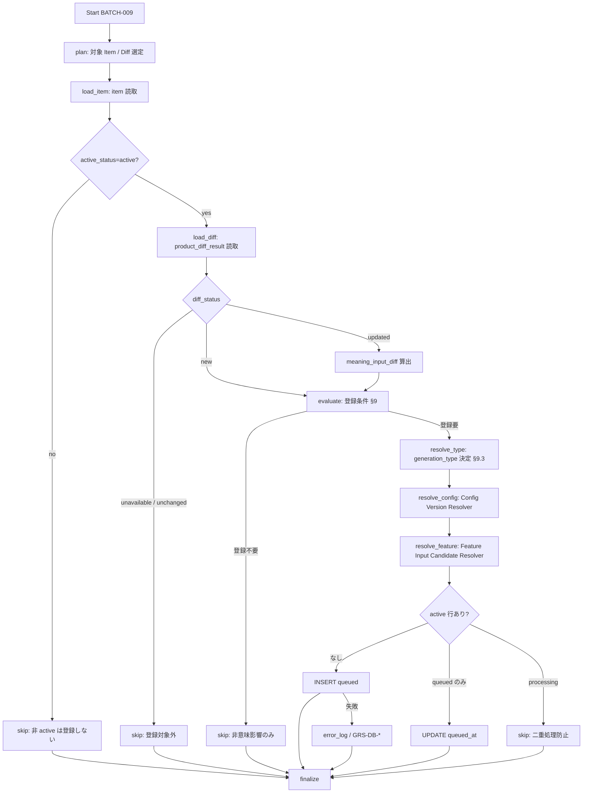

# BATCH-009 商品意味生成キュー登録バッチ仕様書

## 1. ドキュメント情報

| 項目           | 内容                                      |
| -------------- | ----------------------------------------- |
| ドキュメントID | `BATCH-009`                               |
| ドキュメント名 | 商品意味生成キュー登録バッチ仕様書        |
| 対象システム   | Gift Recommendation Service / batch       |
| MVP対象        | `○`                                       |
| 作成日         | 2026-07-17                                |
| 更新日         | 2026-07-17                                |

---

## 2. 概要

BATCH-009（商品意味生成キュー登録Batch）は、BATCH-007（Item反映）および BATCH-008（商品有効状態更新）完了後の `item` 正本と `product_diff_result` を読み取り、**商品意味に影響する変更**を持つ Item を `item_generation_queue` に `queue_status = queued` で登録する Batch である。

正本区分は **処理制御データ / Queue** である。本 Batch は次を **行わない**。

| 対象 | 理由 |
| ---- | ---- |
| Item Semantic / Feature / Embedding の生成本体 | **BATCH-010〜015** の責務 |
| `item` 業務列の Upsert | **BATCH-007** |
| `item.active_status` / `is_active` の本更新 | **IF-DB-BATCH-009**（BATCH-008） |
| `product_diff_result` 行の作成・更新 | **BATCH-006**（読取のみ） |
| LLM / Embedding API 呼び出し | **BATCH-010〜015** |
| `meaning_input_diff` の永続化 | MVP では **計算結果（非永続）**（§18.1 No.2 **確定**） |

Queue 登録 I/F は **IF-DB-BATCH-010** である。**IF-DB-BATCH-009 は `item.active_status` 本更新用**（BATCH-008）であり、本 Batch とは無関係である（Batch ID と IF 番号の対応に注意）。

識別子 Epic は **`[Epic]BATCH-009:商品意味生成キュー登録Batch`（#1406）** を親とし、本仕様書を BATCH-007 / BATCH-008 develop merge 後の **BATCH-009 縦串正本** とする。縦串方針は **仕様整備 → 実装 → UT → Epic PR（develop 統合）**（BATCH-007 / BATCH-008 同型）。

---

## 3. 目的

| No | 目的 |
| -: | ---- |
| 1 | BATCH-007 反映済み `item` と BATCH-006 判定済み `product_diff_result` から、意味生成対象 Item を選定する |
| 2 | 意味影響項目の変更・新規 Item・version / hash 変更を `item_generation_queue` に登録する（`item_generation_queue_テーブル定義書` §5.4〜5.6） |
| 3 | `generation_type`（`semantic` / `feature` / `embedding`）を登録条件に応じて決定し、初回デフォルトは `semantic` とする |
| 4 | active 行の partial UNIQUE（`item_id` + `generation_type`）に従い、二重 active 登録を防止する（§12.1 / Human Review #507） |
| 5 | 後続 BATCH-010 が `queue_status = queued` 行を消化できる状態を提供する |

---

## 4. バッチ基本情報

| 項目           | 内容 |
| -------------- | ---- |
| Batch ID       | `BATCH-009` |
| Batch名        | 商品意味生成キュー登録Batch |
| 処理種別       | 意味生成 Queue 登録（INSERT / active `queued` 行の `queued_at` UPDATE） |
| 実行基盤       | GitHub Actions。**独立子 workflow `batch-item-generation-queue.yml`（`batch-item-generation-queue*.yml`）を正**とする（§18.1 No.1 **確定**）。親 `batch-item-meaning-generation.yml` 全体改修は本 Epic 外 |
| 実装言語       | Python（`apps/batch`） |
| 起動方式       | BATCH-007 / BATCH-008 後続 / `workflow_dispatch` |
| 実行頻度       | Item 反映・有効状態更新後に連続実行（item-import / existing-item-recheck チェーン内） |
| 想定実行時間   | 親 meaning-generation チェーンの入口段。単独再実行は対象 Item 件数に依存 |
| 冪等キー       | **実装正本:** active 行 `(item_id, generation_type)` where `queue_status IN ('queued','processing')`（`item_generation_queue_テーブル定義書` §7 / #507）。一覧との差分は下表 |
| 先行Batch      | `BATCH-007` / `BATCH-008`（一覧正本。直列は運用・workflow 設計による） |
| 後続Batch      | `BATCH-010`（必須）/ BATCH-011〜015（パイプライン消化） |
| MVP対象        | `○` |
| Contract Gate  | **不要**（HTTP API 化しない） |

`Batch ID` は `BATCH-*` を使用する。処理構成上の分類 ID（`BT-*`）を Issue / 成果物名の識別子として使わない。

#### 冪等キーとバッチ処理一覧の差分（明示）

| 出典 | 冪等キー表記 | 本仕様での扱い |
| ---- | ------------ | -------------- |
| `バッチ処理一覧.md` BATCH-009 行 / §3.1 | `item_id + semantic_config_version_id + generation_target_type` | **旧表記**。一覧側の更新は別 Task 候補（本 Task out_of_scope） |
| 本仕様 §4 / §11・テーブル定義書 §7（#507） | active `(item_id, generation_type)` partial UNIQUE | **実装正本（確定）** |

補足:

- 一覧の `generation_target_type` は、現行物理列・enum の `generation_type`（`semantic` / `feature` / `embedding`）に相当する。
- Config Version Resolver で解決する `semantic_config_version_id` は **Queue 行に永続しない**（#507 No.4 **確定** / §18.1 No.12）。登録時のヒントおよび下位 Batch への受け渡しにのみ用いる（一覧 §3.1 の「Queue 行には保存せず」と整合）。
- 実装・UT・DDL はテーブル定義書の partial UNIQUE を正とする。一覧キー列の書き換えは本 PR では行わない。

### 4.1 IF 対応（Human 注意）

| IF ID | 名称 | 本 Batch での利用 |
| ----- | ---- | ----------------- |
| **IF-DB-BATCH-010** | 商品意味生成キュー登録 | **本 Batch の書込 I/F**（`item_generation_queue` INSERT / UPDATE） |
| IF-DB-BATCH-009 | Item 有効状態更新 | **利用しない**（BATCH-008 専用） |
| IF-DB-BATCH-006 | Product Diff 結果参照 | `product_diff_result` SELECT |
| IF-DB-BATCH-007 | Item 反映 | 本 Batch では Item を **更新しない**（SELECT のみ） |

---

## 5. 実行条件

### 5.1 トリガー

| トリガー | 利用有無 | 条件 | 備考 |
| -------- | -------- | ---- | ---- |
| schedule | `false` | — | 独立 cron は付けない（BATCH-007 同型。§18.1 No.1） |
| workflow_dispatch | `true` | 手動・再実行（`batch_run_id` / 明示 `external_item_code` / 件数上限） | 失敗再実行・部分集合処理に利用 |
| 先行Batch完了 | `true`（運用上） | BATCH-007 / BATCH-008 後続、または独立 YAML を親から `workflow_call` | 親 meaning-generation 全体改修は本 Epic 外 |
| retry-failed | `false` | MVP では workflow_dispatch で失敗キーを絞る | 再実行単位: `external_item_code`（+ 必要なら `batch_run_id`） |

### 5.2 実行前提

- 対象 `item` が BATCH-007 により Upsert 済みで `item_id` が確定していること（`item_テーブル定義書` §12.1）
- 対象 Run の `product_diff_result` が存在すること（BATCH-006 完了）
- BATCH-008 により `item.active_status` が最新化されていること（運用上。本 Batch は読取のみ）
- `item_generation_queue` の DDL が利用可能であること（#507 / #603 整備済み）。本 Epic での新規 migration 追加は out of scope
- 本 Batch から楽天 API / LLM / Embedding API は呼び出さない
- Database へ接続可能であること
- 同時多重起動は `GRS-BAT-003` で拒否する

---

## 6. 入力

### 6.1 入力データ

| 入力 | 種別 | 取得元 | 必須 | 用途 | 備考 |
| ---- | ---- | ------ | ---- | ---- | ---- |
| `item` | DB | database | `true`（行単位） | 突合・`item_id` 解決・`active_status` フィルタ・意味影響列参照 | BATCH-007 反映済み正本 |
| `product_diff_result` | DB | database | `true`（行単位） | `diff_status` 分岐・`staging_item_id` / hash 変更判定 | 読取のみ。Human Review #526 **確定** |
| `meaning_input_diff` | **計算** | Batch 内算出（非永続） | `false`（概念） | 意味影響項目のみの変更検知 | §18.1 No.2 **確定**。永続テーブルなし |
| `item_semantic` / `item_feature` / `item_embedding`（参照） | DB | database | `false` | version / hash 変更検知（部分再生成） | MVP import 経路では §18.1 No.4 **確定** に従い semantic 中心（部分再生成トリガーは後続） |
| `registration_plan` / config | 設定 | Batch config / workflow input | `true` | 選定フィルタ / 件数上限 | §18.1 No.5 |
| 明示 `external_item_code` リスト | 入力 | workflow_dispatch | `false` | 失敗再実行・部分集合 | |

### 6.2 外部API

| API | 利用有無 | 用途 | Rate Limit / 制約 | 備考 |
| --- | -------- | ---- | ----------------- | ---- |
| - | `false` | なし | - | 本 Batch は外部 API を呼ばない。`GRS-EXT-*` / `GRS-LLM-*` 対象外 |

### 6.3 環境変数

環境変数は名称のみ記載し、値は記載しない。

| 環境変数名 | 必須 | 用途 | secret区分 | 設定先 |
| ---------- | ---- | ---- | ---------- | ------ |
| `DATABASE_URL` | `true` | Item / Diff / Queue 読取・Queue 書込 | secret | GitHub Secrets / local `.env`（commit 禁止） |
| `BATCH_ITEM_GENERATION_QUEUE_MAX_ITEMS` | `false` | 件数上限 | 非secret可 | config / workflow input（§18.1 No.5） |
| `BATCH_ITEM_GENERATION_QUEUE_SOURCE` | `false` | `source` フィルタ（MVP 既定 `rakuten`） | 非secret可 | config / workflow input |
| `BATCH_ITEM_GENERATION_QUEUE_DIFF_BATCH_RUN_ID` | `false` | 消費する判定 Run の絞り込み | 非secret可 | workflow input |

---

## 7. 出力

### 7.1 出力データ

| 出力 | 種別 | 出力先 | 正本区分 | 用途 | 備考 |
| ---- | ---- | ------ | -------- | ---- | ---- |
| `item_generation_queue` | DB | database | 処理制御 / Queue | BATCH-010〜015 の消化対象 | IF-DB-BATCH-010。`queue_status=queued` |
| `batch_run_log` / `phase_log` / `error_log` | DB | database | 運用 | Run / Phase / 失敗記録 | |
| `item` | - | - | - | **本 Batch では書込しない**（読取のみ） | BATCH-007 正本 |
| `product_diff_result` | - | - | - | **更新しない**（読取のみ） | BATCH-006 正本 |
| `item_semantic` / `item_feature` / `item_embedding` | - | - | - | **生成・更新しない** | BATCH-010〜015 |

### 7.2 後続への引き渡し

| 後続 | 引き渡し内容 | 条件 |
| ---- | ------------ | ---- |
| BATCH-010 | `item_generation_queue`（`queued`, `generation_type=semantic` 等） | 登録成功 |
| BATCH-011〜015 | 同一 Queue 行（`generation_type` に応じた開始区間） | パイプライン消化 |
| BATCH-017 | ログ・件数 | Run 集計（親チェーン経由時） |

### 7.3 更新リソース

| リソース | 操作 | IF | 備考 |
| -------- | ---- | -- | ---- |
| `item_generation_queue` | INSERT / UPDATE（`queued_at`） | IF-DB-BATCH-010 | §10 |
| `item` | SELECT | — | `active_status` フィルタ・列参照 |
| `product_diff_result` | SELECT | IF-DB-BATCH-006 | 更新しない |
| `batch_run_log` / `phase_log` / `error_log` | INSERT / UPDATE | — | 共通 |

---

## 8. 処理フロー

### 8.1 全体フロー



### 8.2 処理ステップ

| No | Phase | 処理 | 入力 | 出力 | 失敗時の扱い |
| -: | ----- | ---- | ---- | ---- | ------------ |
| 1 | `plan` | 対象 `product_diff_result` / `item` キューを作成（§18.1 No.5） | config / Diff 行 | 評価対象一覧 | `GRS-BAT-*` |
| 2 | `load_item` | `item` を `source` + `external_item_code` で解決 | Diff / 明示コード | `item_id`, `active_status` | `GRS-DB-*`。Item 欠落は当該行失敗 |
| 3 | `filter_active` | `active_status = 'active'`（`is_active = true`）のみ通過 | `item` | 通過 / skip | skip 集計（§9.1 **確定**） |
| 4 | `load_diff` | 判定行を読み `diff_status` / hash を確定 | Diff ID | Diff 行 | `GRS-DB-*` |
| 5 | `evaluate` | §9.2 登録条件を評価。`meaning_input_diff` を算出（§18.1 No.2） | Item + Diff + 派生参照 | 登録要否 / `generation_type` 候補 | 評価不能は当該行失敗 |
| 6 | `resolve_config` | Config Version Resolver で現行 `semantic_config_version_id` 等を解決 | `BatchResolveContext` | version ヒント | `GRS-CFG-*` |
| 7 | `resolve_feature` | Feature Input Candidate Resolver で hash / version 変更を補助判定 | Item + 派生テーブル | feature / embedding トリガー判定 | `GRS-CFG-*` |
| 8 | `register` | IF-DB-BATCH-010 で INSERT または active `queued` の `queued_at` UPDATE | 登録パラメータ | `item_generation_queue_id` | `GRS-DB-*` / `GRS-BAT-005` |
| 9 | `finalize` | 集計・`batch_run_log` 更新 | 各 Phase 結果 | run_status / counts | 部分成功は `GRS-BAT-002` |

処理単位は **`item_id`（+ `generation_type`）単位**で成功 / 失敗 / skip を記録する。

実装パス想定: `apps/batch/src/batch/application/item_generation_queue/**`。

### 8.3 モジュール対応（バッチ処理一覧）

| モジュール | 責務 | 区分 |
| ---------- | ---- | ---- |
| Item Generation Queue Registrar | 登録条件評価・`generation_type` 決定・IF-DB-BATCH-010 実行 | 一覧モジュール |
| Config Version Resolver | 登録時の現行 `semantic_config_version_id` / `model_version_id` 解決（MOD-RECO-003 同一ルール） | 一覧モジュール |
| Feature Input Candidate Resolver | `feature_input_hash` / embedding 関連 version・hash 変更の補助判定 | 一覧モジュール |
| Product Diff Result Reader | `product_diff_result` SELECT（BATCH-006 出力の読取） | 一覧モジュール＋実装補助（BATCH-007/008 同型） |
| Batch Logger / Error Handler | 失敗記録・再実行情報 | 一覧モジュール＋実装補助（BATCH-007 同型。一覧 BATCH-009 行は Error Handler のみ明示） |

---

## 9. 判定・登録ロジック

正本は `item_generation_queue_テーブル定義書` §5.4〜5.6 / §12.1 および `product_diff_result_テーブル定義書` §12.3。

### 9.1 対象 Item フィルタ（active のみ）

| 条件 | 登録 |
| ---- | ---- |
| `item.active_status = 'active'` かつ `is_active = true` | 通過（§9.2 へ） |
| `inactive` / `unavailable` / `excluded` | **×**（登録しない） |

**根拠（確定）**: `バッチ依存関係図.md` §5（BATCH-008 → BATCH-009: active な Item のみ意味生成対象）、`item_テーブル定義書` §10 CHECK（`is_active = (active_status = 'active')`）。

`product_diff_result.diff_status = unavailable` の Item は BATCH-007 で Item 反映をスキップし、BATCH-008 で `active_status` を制限側へ更新する。本 Batch は **非 active Item をキュー登録しない**。

### 9.2 登録条件（意味影響 vs 非影響）

`item_generation_queue_テーブル定義書` §5.4 を正とする。

**優先順位（確定）:** 「非意味影響のみ」の除外は `normalized_hash` 変更より優先する。hash が変わっていても、変更が非意味影響列のみなら **登録しない**（詳細は §9.2.1）。

| 条件 | 登録 | 既定 `generation_type` |
| ---- | ---- | ---------------------- |
| 新規 Item（`diff_status = new`） | ○ | `semantic` |
| 意味影響項目変更（`itemName` / `catchcopy` / `itemCaption` / `genreId` / `attribute` / `tag` 等。`meaning_input_diff` 正本） | ○ | `semantic` |
| `normalized_hash` 変更（意味影響を含む Upsert 後） | ○ | 通常 `semantic` |
| `semantic_config_version_id` のみ変更（意味入力不変） | ○ | `feature`（§5.6 / #507 No.3 **確定**） |
| 意味影響 + config version 同時変更 | ○ | `semantic`（最上流優先） |
| `reviewAverage` / `reviewCount` / `price` / `rank` / `availability` / `itemUrl` **のみ**変更 | **×**（hash 変更有無を問わない） | — |
| `feature_input_hash` のみ変更 | ×（MVP import） / ○（後続拡張） | `feature`。§18.1 No.4 **確定**: MVP import では登録しない |
| Embedding 関連 version / hash のみ変更 | ×（MVP import） / ○（後続拡張） | `embedding`。§18.1 No.4 **確定**: MVP import では登録しない |
| `diff_status = unchanged` | **×** | — |
| `diff_status = unavailable` | **×** | — |
| 前回 `failed` 行の再キュー | 本 Batch では **新規登録しない** | `retry-failed-items` / BATCH-010〜015 側（§12.3） |

#### 9.2.1 `meaning_input_diff`（計算概念）

| 観点 | 方針 |
| ---- | ---- |
| 永続化 | MVP では **テーブルに保存しない**（§18.1 No.2 **確定**） |
| 算出タイミング | `diff_status = updated` 時、現行 `item` と BATCH-007 反映直前の意味影響列（または staging 由来の新旧比較）から **Batch 内で算出** |
| 意味影響列（正本方針） | 外部商品データ連携設計書 §6.4 のうち **意味抽出・Semantic に影響する列**に限定。代表: `itemName` / `catchcopy` / `itemCaption` / `genreId` / `attributeIds`（属性・タグ相当）。§6.4 の hash 対象でも price / URL / review / availability / 画像は **意味影響に含めない**（§9.2） |
| 正規化・比較順序 | **実装 Task** で §6.4・Item / Staging 物理列対応と整合させて確定（trim・空文字・配列順など）。本仕様書では列集合方針までを正とする |
| 非意味影響列 | `price`, `item_url`, `review_average`, `review_count`, `availability` 相当 |
| `normalized_hash` との関係 | hash 変更ありでも、非意味影響のみなら **登録しない**。hash 一致でも意味影響列が変われば登録しうる（稀。通常は hash 変更と連動） |

### 9.3 `generation_type` 選定

`item_generation_queue_テーブル定義書` §5.6 / §17.1 No.3（Human Review #507 **確定**）を正とする。

| 変更要因 | `generation_type` | 備考 |
| -------- | ----------------- | ---- |
| 新規 / 意味影響 / `normalized_hash`（意味含む）/ `meaning_input_diff` あり | `semantic` | BATCH-009 デフォルト |
| `semantic_config_version_id` のみ（Item 本文・意味入力不変） | `feature` | Semantic 再利用 |
| `feature_input_hash` のみ変更 | `feature` | §18.1 No.4 **確定**: MVP import では未使用（後続拡張） |
| `embedding_model_version_id` / `embedding_source_version` / `embedding_input_hash` | `embedding` | §18.1 No.4 **確定**: MVP import では未使用（後続拡張）。Feature 済み前提 |
| 複数要因同時 | **最上流優先**: hash / meaning_input あり → `semantic`、なければ `feature` | |
| 前回 `failed` の再実行 | **変更しない**（同一行を `queued` へ） | 初回登録値を保持 |

### 9.4 active 行の登録分岐（partial UNIQUE）

`item_generation_queue_テーブル定義書` §12.1 / §17.1 No.1（Human Review #507 **確定**）。

| active 行の状態 | 操作 |
| --------------- | ---- |
| 同一 `item_id` + `generation_type` で active 行 **なし** | **INSERT**（`queue_status=queued`, `retry_count=0`, `queued_at=now()`） |
| active 行が **`queued` のみ**存在 | **`queued_at` のみ UPDATE**（新規 INSERT しない） |
| active 行が **`processing`** 存在 | **登録スキップ**（二重処理防止） |
| 終端行（`succeeded` / `failed` / `skipped`）のみ | **INSERT**（履歴は複数保持可） |

---

## 10. DB更新

### 10.1 Queue 登録（IF-DB-BATCH-010）

| テーブル | 操作 | 主キー / 一意キー | 更新項目 | 競合時の扱い | 備考 |
| -------- | ---- | ----------------- | -------- | ------------ | ---- |
| `item_generation_queue` | INSERT | `item_generation_queue_id`（PK） | `item_id`, `generation_type`, `queue_status`, `retry_count`, `queued_at` | partial UNIQUE 違反時は §9.4 分岐 | Human #507 |
| `item_generation_queue` | UPDATE | active `queued` 行 | `queued_at` のみ | 行指定 UPDATE | §12.4 |
| `batch_run_log` / `phase_log` / `error_log` | insert / update | Run / Phase 単位 | status / counts / code | 追記 / 更新 | |
| `item` / `product_diff_result` | - | - | - | - | **更新しない** |

#### 10.1.1 新規 INSERT 疑似コード

```sql
INSERT INTO item_generation_queue (
  item_id, generation_type, queue_status, retry_count, queued_at
) VALUES (
  :item_id, :generation_type, 'queued', 0, now()
);
```

#### 10.1.2 active `queued` 行あり（`queued_at` のみ更新）

```sql
UPDATE item_generation_queue
SET queued_at = now()
WHERE item_id = :item_id
  AND generation_type = :generation_type
  AND queue_status = 'queued';
```

#### 10.1.3 禁止 UPDATE

- `queue_status = processing` の行を本 Batch で `queued` に戻さない（消化は BATCH-010〜015 / retry 系）
- `retry_count` を本 Batch の初回登録で `0` 以外にしない
- Queue 行に `semantic_config_version_id` 等の version snapshot 列を持たない（#507 No.4 **確定**）

### 10.2 Object Storage

| オブジェクト | 操作 | 備考 |
| ------------ | ---- | ---- |
| - | **なし** | Raw / Staging は読まない |

---

## 11. 冪等性・再実行性

| 観点 | 方針 |
| ---- | ---- |
| active 行冪等キー | `(item_id, generation_type)` where `queue_status IN ('queued','processing')`（partial UNIQUE）。一覧の旧表記との差分は §4 |
| 重複実行時の扱い | active `queued` は `queued_at` のみ更新。`processing` は skip。終端のみなら INSERT |
| 部分失敗時の再実行 | 失敗した `external_item_code`（または `item_id`）のみ workflow_dispatch で再実行 |
| 成功済みデータの skip 条件 | 登録条件を満たさない / 非 active / `unchanged` / 非意味影響のみ |
| rollback方針 | Queue の自動 rollback はしない。失敗は `error_log` で追跡し再実行で収束 |

---

## 12. 状態管理

### 12.1 本 Batch が操作する `queue_status`

| 操作 | 遷移 | 更新主体 |
| ---- | ---- | -------- |
| 初回登録 | （なし）→ `queued` | BATCH-009（本 Batch） |
| 再通知 | `queued` → `queued`（`queued_at` のみ更新） | BATCH-009（本 Batch） |
| 消化開始以降 | `processing` → 終端 | BATCH-010〜015（本 Batch は触れない） |

### 12.2 Batch Run 状態

| 対象 | 状態値 | 遷移条件 | 記録先 | 備考 |
| ---- | ------ | -------- | ------ | ---- |
| Batch Run | `running` → `succeeded` / `partially_succeeded` / `failed` | finalize | `batch_run_log` | `GRS-BAT-001` / `GRS-BAT-002` |
| Phase | 各 Phase 成否 | Phase 境界 | `phase_log` | |
| Product Diff | （変更なし） | - | `product_diff_result` | 読取正本 |
| Item 業務列 / active_status | （変更なし） | - | `item` | BATCH-007 / BATCH-008 正本 |

### 12.3 失敗再実行（本 Batch 対象外）

`failed` → `queued` への復帰は `retry-failed-items` または BATCH-010〜015 側（`item_generation_queue_テーブル定義書` §12.3）。本 Batch は **新規意味生成トリガーとしての再登録** に専念する。

---

## 13. エラー・リトライ仕様

対象分類は `GRS-BAT-*` / `GRS-DB-*` / `GRS-CFG-*` / `GRS-VAL-*`（バッチ処理一覧・エラーコード定義書）。外部 API 系 `GRS-EXT-*` / `GRS-LLM-*` は本 Batch の主対象外。

| エラー種別 | Error Code | 発生条件 | リトライ | 停止条件 | 備考 |
| ---------- | ---------- | -------- | -------- | -------- | ---- |
| Queue 登録失敗 | `GRS-BAT-005` | INSERT / UPDATE 例外 | 有（一時障害時） | 上限超過で当該 Item 失敗 | |
| DB 失敗 | `GRS-DB-*` | 読取 / 書込失敗 | 有 | 上限超過 | |
| Config 解決失敗 | `GRS-CFG-*` | Config Version Resolver 失敗 | 有 | 当該 Item 失敗 | |
| Batch 全体失敗 | `GRS-BAT-001` | 致命的失敗 | 手動再実行 | Run failed | |
| 部分成功 | `GRS-BAT-002` | 一部 Item のみ失敗 | 失敗分再実行 | `partially_succeeded` | |
| 多重起動 | `GRS-BAT-003` | 同一 Batch 多重起動 | 無 | 起動拒否 | |
| Item / Diff 不整合 | `GRS-BAT-005` または VAL 系 | Item 欠落・評価不能 | 無（再 Diff / 再反映） | 当該行失敗 | |

---

## 14. ログ・監視

| 種別 | 記録内容 | 出力タイミング | 保存先 | 備考 |
| ---- | -------- | -------------- | ------ | ---- |
| batch_run_log | 開始終了・件数・status | 開始 / 終了 | DB | |
| phase_log | Phase 名と成否 | Phase 境界 | DB | |
| error_log | code / message / `batch_run_id` / `item_id` / `external_item_code` | 失敗時 | DB | `owner_type=item_generation_queue` 連携可 |
| 登録結果 | insert / queued_at_touch / skip 区分 | register | 集計 | |

### 14.1 メトリクス

| Metric | 内容 | 集計単位 | 用途 |
| ------ | ---- | -------- | ---- |
| `diff_selected_count` | 選定件数 | batch_run | 監視 |
| `queue_inserted_count` | 新規 INSERT 件数 | batch_run | 品質 |
| `queue_queued_at_updated_count` | active `queued` の `queued_at` UPDATE 件数 | batch_run | 再通知監視 |
| `queue_processing_skip_count` | `processing` 存在により skip した件数 | batch_run | 競合監視 |
| `queue_inactive_skip_count` | 非 active により skip した件数 | batch_run | BATCH-008 連携確認 |
| `queue_non_meaning_skip_count` | 非意味影響のみで skip した件数 | batch_run | 品質 |
| `queue_semantic_count` | `generation_type=semantic` 登録件数 | batch_run | パイプライン入口 |
| `queue_feature_count` | `generation_type=feature` 登録件数 | batch_run | 部分再生成 |
| `queue_embedding_count` | `generation_type=embedding` 登録件数 | batch_run | 部分再生成 |
| `queue_register_failed_count` | 登録失敗件数 | batch_run | アラート |

`item_generation_queue_id` を trace キーとしてログ・Observability に伝播する（バッチ設計方針書 §15.2）。

---

## 15. セキュリティ・外部サービス利用

| 観点 | 方針 |
| ---- | ---- |
| secret取り扱い | DB 認証情報は GitHub Secrets / local `.env` のみ。docs・ログ・PR・fixture に実値を書かない |
| 外部API key | 本 Batch では不要（LLM / Embedding / 楽天 API 非呼び出し） |
| ログ出力制限 | 商品属性のフルダンプ禁止。接続文字列をログに出さない |
| 個人情報・機微情報 | 商品 ID・コード・エラー要約のみ |
| GitHub Actions permissions | contents / 必要最小の secrets 参照に限定 |
| Online 露出 | `item_generation_queue` は api / reco から Direct 参照しない（テーブル定義書 §5.1） |

---

## 16. テスト観点

| No | 観点 | 確認内容 | 種別 |
| --: | ---- | -------- | ---- |
| 1 | 正常系 `new` | active Item で `semantic` INSERT。`retry_count=0` | unit / integration |
| 2 | 意味影響 `updated` | `meaning_input_diff` ありで登録。非意味のみでは skip | unit |
| 3 | 非 active skip | `unavailable` / `inactive` / `excluded` は登録しない | unit |
| 4 | `unchanged` skip | 登録しない | unit |
| 5 | active `queued` 再通知 | 新規 INSERT せず `queued_at` のみ UPDATE | unit / integration |
| 6 | `processing` skip | active `processing` 存在時は登録しない | unit |
| 7 | `generation_type` 選定 | config version のみ → `feature`。意味影響あり → `semantic` | unit |
| 8 | partial UNIQUE | 同一 `item_id` + `generation_type` で active 二重 INSERT 不可 | integration |
| 9 | 非更新境界 | `item` 業務列 / `product_diff_result` / 派生生成結果が変わらない | integration |
| 10 | IF 境界 | IF-DB-BATCH-010 のみ書込。IF-DB-BATCH-009 は使わない | review |
| 11 | 冪等再実行 | 同一条件の再実行で収束 | unit / integration |
| 12 | 部分成功 | 一部失敗で `GRS-BAT-002` | unit |
| 13 | secret 非含有 | ログ・fixture・docs に認証情報なし | review / unit |

---

## 17. 変更管理

### 17.1 変更履歴

| 日付 | 変更内容 | 関連Issue / PR |
| ---- | -------- | -------------- |
| 2026-07-17 | 初版作成 | Epic #1406 / Task #1407 |
| 2026-07-16 | AI Review 対応: 一覧との冪等キー差分明示（§4 / §18.1 No.13）、§9.2 優先順位、§8.3 区分 | PR #1408 / Task #1407 |
| 2026-07-17 | §18.1 No.4 を Human 確定（MVP import は `semantic` 中心。feature / embedding 部分再生成トリガーは後続） | Task #1407 |
| 2026-07-17 | §18.1 No.1 / No.2 を Human 確定（独立 YAML・`meaning_input_diff` 非永続＋§6.4 整合。算出詳細は実装 Task） | Task #1407 |

---

## 18. 未決事項・決定事項

### 18.1 採用方針（確定 / 提案の区別）

| No | 論点 | 内容 | 判断者 | 状態 | 備考 |
| --: | ---- | ---- | ------ | ---- | ---- |
| 1 | 子 workflow 配置 | **独立 YAML `batch-item-generation-queue.yml`（`batch-item-generation-queue*.yml`）** を正とする。`workflow_call` / `workflow_dispatch` 対応。独立 cron なし。親からの `workflow_call` は **BATCH-007 / BATCH-008 後続**（item-import / existing-item-recheck チェーン内）。親 `batch-item-meaning-generation.yml` **全体改修は本 Epic 外** | Human | **確定** | 2026-07-17 Human。BATCH-007 / BATCH-008 同型 |
| 2 | `meaning_input_diff` | **Batch 内計算の非永続概念**。専用テーブル・migration は本 Epic 外。列集合は外部商品データ連携設計書 **§6.4 の意味影響列**に整合（§9.2.1）。正規化・比較順序の細部は **実装 Task** で確定 | Human | **確定** | 2026-07-17 Human。テーブル定義書 §5.1 out_of_scope と整合 |
| 3 | active フィルタ | **`active_status = 'active'`（`is_active = true`）のみ登録**。非 active は skip | Human（依存関係図） | **確定** | `バッチ依存関係図.md` §5 No.322 / `item_テーブル定義書` §10 |
| 4 | MVP import 経路の `generation_type` | item-import / existing-item-recheck 経路では **主に `semantic` を登録**。`feature_input_hash` のみ / Embedding 関連のみの **部分再生成トリガーは後続または別 Run**。`semantic` 行の消化は BATCH-010〜015 一連（フルパイプライン）。`semantic_config_version_id` のみ → `feature` は #507 **確定**のまま（import 経路外の運用で発火しうる） | Human | **確定** | 2026-07-17 Human。テーブル定義書 §5.4 の feature_input_hash / embedding 選定は後続拡張で有効化 |
| 5 | 選定既定（config） | **(1)** 対象 `batch_run_id`（先行 BATCH-006 Run または明示。local / GHA meaning 連鎖では import または existing の pipeline ID を `--diff-batch-run-id` で渡す） **(2)** `diff_status IN ('new','updated')` を主処理 **(3)** 件数上限 `BATCH_ITEM_GENERATION_QUEUE_MAX_ITEMS` / `--max-items` **(4)** 任意で明示 `external_item_code` リスト。`source` 既定 `rakuten`。**(5)** `--include-backlog` 時は対象 Run 優先後、残枠を横断バックログで埋める（Human #1878 選択肢 C / #1880） | Human | **確定** | 2026-08-25 Human（#1878）。実装 #1880 |
| 6 | Queue 登録 IF | **IF-DB-BATCH-010**（Batch ID BATCH-009 と IF 番号が異なる） | Human（#507 / 一覧） | **確定** | IF-DB-BATCH-009 は active_status（BATCH-008） |
| 7 | 登録条件・active 行分岐 | `item_generation_queue_テーブル定義書` §5.4〜5.6 / §12.1 / §17.1（#507） | Human | **確定** | §9 / §10 |
| 8 | 初回 `generation_type` デフォルト | 新規 / 意味影響時は **`semantic`** | Human（enum定義書 §6.17） | **確定** | テーブル定義書 §5.2 |
| 9 | 非意味影響のみ変更の除外 | price / review / availability / itemUrl 等のみでは **登録しない** | Human（§5.4） | **確定** | §9.2 |
| 10 | BATCH-007 / BATCH-008 境界 | Item 反映・active_status 本更新は本 Batch では行わない | Human（BATCH-007/008 仕様） | **確定** | §2 / §21.2 |
| 11 | Contract Gate | **不要** | Human（Epic #1406） | **確定** | HTTP API 化しない |
| 12 | version snapshot 列 | Queue 行に version 列を **持たない** | Human（#507 No.4） | **確定** | Config Resolver は実行時解決 |
| 13 | 冪等キー正本 | **実装正本は** `item_generation_queue_テーブル定義書` §7 / #507 の active `(item_id, generation_type)` partial UNIQUE。`バッチ処理一覧.md` BATCH-009 行・§3.1 の `item_id + semantic_config_version_id + generation_target_type` は **旧表記**（`generation_target_type` ≒ 現行 `generation_type`）。一覧キー列の更新は別 Task 候補 | Human（#507） / 本仕様 | **確定**（正本）／一覧更新は **提案**（別 Task） | §4 / §11。一覧本体の書き換えは本 Task out_of_scope |

### 18.2 残未決事項（Human 判断）

本仕様書スコープで今回確定した Human 残未決（workflow / meaning_input_diff / MVP semantic）は **解消済み**。残るのは一覧側の別 Task 候補のみ。

| No | 事項 | 扱い |
| -: | ---- | ---- |
| 1 | バッチ処理一覧 BATCH-009 冪等キー列・§3.1 の旧表記更新 | §18.1 No.13。別 Task で一覧をテーブル定義書 #507 に合わせて更新するか Human 判断 |

> **解消済み（2026-07-17）**
> - `feature_input_hash` / Embedding 関連のみの部分再生成を MVP import に含めるか → §18.1 No.4 **確定**
> - 独立 workflow ファイル名・親からの `workflow_call` タイミング → §18.1 No.1 **確定**
> - `meaning_input_diff` 算出詳細（列集合・正規化順序）→ §18.1 No.2 / §9.2.1 **確定**（列集合方針。正規化細部は実装 Task）
>
> **実装 Task で確定可（提案のまま）**: （該当なし。§18.1 No.5 は 2026-08-25 に確定）

---

## 19. 関連資料

| 種別 | パス / URL | 用途 |
| ---- | ---------- | ---- |
| 正本一覧 | `docs/05_アプリケーション設計/アプリ/batch/バッチ処理一覧.md` | BATCH-009 行・モジュール |
| 設計方針 | `docs/05_アプリケーション設計/アプリ/batch/バッチ設計方針書.md` | Queue 登録・§14.5・Config Resolver |
| 依存 | `docs/05_アプリケーション設計/アプリ/batch/バッチ依存関係図.md` | 007/008 → 009 → 010 |
| スケジュール | `docs/05_アプリケーション設計/アプリ/batch/バッチ実行スケジュール設計書.md` | meaning-generation チェーン |
| 外部連携 | `docs/05_アプリケーション設計/アプリ/外部商品データ連携設計書.md` | hash 対象・意味影響項目 |
| インターフェース | `docs/05_アプリケーション設計/アプリ/インターフェース一覧.md` | IF-DB-BATCH-010 |
| テーブル | `docs/06_実装設計/database/item_generation_queue_テーブル定義書.md` | 登録条件・§12.1・#507 |
| テーブル | `docs/06_実装設計/database/product_diff_result_テーブル定義書.md` | §12.3 後続分岐 |
| テーブル | `docs/06_実装設計/database/item_テーブル定義書.md` | active_status・hash |
| モジュール | `docs/06_実装設計/reco/MOD-RECO-003_Config Version Resolverモジュール仕様書.md` | BatchResolveContext |
| 先行仕様 | `docs/06_実装設計/batch/BATCH-007_Item反映バッチ仕様書.md` | Item 反映境界 |
| 先行仕様 | `docs/06_実装設計/batch/BATCH-008_商品有効状態更新バッチ仕様書.md` | active_status 本更新 |
| 先行仕様 | `docs/06_実装設計/batch/BATCH-006_商品差分判定バッチ仕様書.md` | Diff 正本 |
| code-definitions | `packages/code-definitions/state/item_generation_queue_status.yaml` | queue_status |
| code-definitions | `packages/code-definitions/batch/item_generation_type.yaml` | generation_type |
| Epic / Task | `prompts/definitions/epics/batch-009-item-generation-queue/epic.yaml` 等 | scope |

---

## 20. レビュー観点

- バッチ処理一覧の BATCH-009 と ID・入出力・先行後続・モジュールが一致している
- **IF-DB-BATCH-010** が Queue 登録 I/F として明記され、**IF-DB-BATCH-009**（active_status）と混同されていない
- `item_generation_queue_テーブル定義書` §5.4〜5.6 / §12.1 / §17.1（#507）と登録ロジックが整合している
- BATCH-007 / BATCH-008 境界（Item 反映・active_status 非更新）が明記されている
- 非意味影響のみ変更の除外・非 active 除外が明記されている
- §18.1 で Human **確定**（workflow / meaning_input_diff / MVP import `semantic` / #507 / 依存関係図 / 選定既定 config §18.1 No.5）が区別されている
- BATCH-010〜015 の消化・LLM / Embedding 生成が混入していない
- secret / `.env` 実値が含まれていない
- PR target が親 Epic Branch（`feature/epic-1406-batch-009-item-generation-queue`）である

---

## 21. 備考

### 21.1 Out of scope

| 対象 | 理由 |
| ---- | ---- |
| BATCH-010〜015 の Queue 消化・Semantic / Feature / Embedding 生成 | 後続 Epic |
| LLM / Embedding API 呼び出し | BATCH-010〜015 |
| `item` / `product_diff_result` の本更新 | BATCH-007 / BATCH-006 |
| `item.active_status` 本更新 | BATCH-008（IF-DB-BATCH-009） |
| `meaning_input_diff` テーブル DDL | Epic out_of_scope（§18.1 No.2） |
| 親 `batch-item-meaning-generation.yml` **全体**改修 | Epic risk・BATCH-007 方針 |
| 新規 DB migration | 既存定義参照。#507 / #603 整備済み |
| OpenAPI / generated | Contract Gate 不要 |
| Python 実装・workflow YAML・UT | 後続 Task |
| Digest 系（BATCH-010+ の詳細実装設計） | 後続 Task |

### 21.2 BATCH-007 / BATCH-008 / BATCH-009 境界

| Batch | 責務 | 本 Batch との関係 |
| ----- | ---- | ----------------- |
| BATCH-007 | Staging → Item / 画像 / レビュー反映 | 先行。`item_id` 確定を前提に読取 |
| BATCH-008 | `item.active_status` 本更新 | 先行（運用上）。非 active フィルタの根拠 |
| BATCH-009（本） | 意味生成 Queue 登録 | IF-DB-BATCH-010 のみ書込 |
| BATCH-010 | Item Semantic 生成 | 後続。`queued` 行を消化 |

データフロー（MVP）:

```text
BATCH-006 → product_diff_result
BATCH-007 → item 業務列更新
BATCH-008 → item.active_status 本更新
BATCH-009 → item_generation_queue（queued）
BATCH-010 → item_semantic（以降パイプライン）
```

### 21.3 実装・運用メモ

- 本仕様書は実装・単体テスト Task の入力正本とする
- 実装パス想定: `apps/batch/src/batch/application/item_generation_queue/**`
- 主要モジュール: Item Generation Queue Registrar / Config Version Resolver / Feature Input Candidate Resolver / Error Handler / Batch Logger
- 子 workflow は `workflow_call` / `workflow_dispatch` を基本とし、親 meaning-generation チェーン全体の改修は本 Epic 外（§18.1 No.1 **確定**）
- Contract Gate 不要（Batch は HTTP API 化しない）
- Epic #1406 / Task #1407。先行テーブル定義 #507 / #603。先行 Batch Epic #1356（BATCH-007）/ #1379（BATCH-008）
