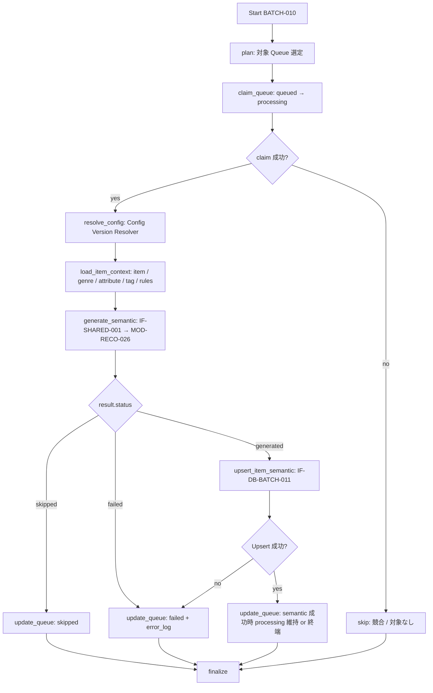

# BATCH-010 Item Semantic生成バッチ仕様書

## 1. ドキュメント情報

| 項目           | 内容                               |
| -------------- | ---------------------------------- |
| ドキュメントID | `BATCH-010`                        |
| ドキュメント名 | Item Semantic生成バッチ仕様書      |
| 対象システム   | Gift Recommendation Service / batch |
| MVP対象        | `○`                                |
| 作成日         | 2026-07-17                         |
| 更新日         | 2026-07-17                         |

---

## 2. 概要

BATCH-010（Item Semantic生成Batch）は、BATCH-009 が登録した `item_generation_queue`（`generation_type = semantic`, `queue_status = queued`）を消化し、商品情報（名称・説明・ジャンル・属性・タグ等）から **Semantic Concept** を抽出して `item_semantic` へ Upsert する Batch である。

正本区分は **推薦用派生データ / 意味抽出結果** である。Semantic 抽出ロジック本体は **`MOD-RECO-026` Item Semantic Generator**（`apps/reco`）に実装し、本 Batch（`apps/batch`）は Queue 制御・コンテキスト組み立て・DB 永続化・Queue 状態更新を担う。

本 Batch は次を **行わない**。

| 対象 | 理由 |
| ---- | ---- |
| `item_generation_queue` への **初回登録**（`queued` INSERT） | **BATCH-009** / **IF-DB-BATCH-010** |
| Feature / Embedding 生成本体 | **BATCH-011〜015** |
| `item` 業務列の Upsert | **BATCH-007** |
| `item.active_status` 本更新 | **IF-DB-BATCH-009**（BATCH-008） |
| Feature 入力 hash 算出 | **BATCH-011** |
| reco Online 推薦パイプライン起動 | **MOD-RECO-001** Orchestrator |

### 2.1 IF 対応（Human 注意：Batch ID と IF 番号）

| IF ID | 名称 | 担当 Batch | 本 Batch での利用 |
| ----- | ---- | ---------- | ----------------- |
| **IF-DB-BATCH-011** | Item Semantic保存 | **BATCH-010** | **本 Batch の書込 I/F**（`item_semantic` Upsert） |
| **IF-SHARED-001** | Item Semantic生成ロジック呼び出し | **BATCH-010** | **本 Batch から `MOD-RECO-026` を呼び出す** |
| IF-DB-BATCH-010 | 商品意味生成キュー登録 | **BATCH-009** | **利用しない**（Queue 登録専用。**混同禁止**） |
| IF-DB-BATCH-009 | Item 有効状態更新 | BATCH-008 | 利用しない |

> **警告**: `IF-DB-BATCH-010` は **Queue 登録**（BATCH-009）用である。本 Batch（BATCH-010）の DB 書込 I/F は **`IF-DB-BATCH-011`** である。Batch ID と IF 番号は一致しない。

識別子 Epic は **`[Epic]BATCH-010:Item Semantic生成Batch`（#1422）** を親とする。先行 BATCH-009 Epic（#1406 / PR #1421 develop merge 済み）および MOD-RECO-026 Epic（#1092 / PR #1102 merge 済み）、`item_semantic` テーブル定義（#513）を前提とする。縦串方針は **仕様整備 → 実装 → UT → Epic PR（develop 統合）**（BATCH-009 同型）。

---

## 3. 目的

| No | 目的 |
| -: | ---- |
| 1 | `item_generation_queue` から `generation_type = semantic` かつ `queue_status = queued` の行を取得し、`processing` へ遷移させる |
| 2 | Config Version Resolver で `semantic_config_version_id` を解決し、Item / ジャンル / 属性 / タグ / Semantic Rule / Concept を入力コンテキストに載せる |
| 3 | **IF-SHARED-001** 経由で **MOD-RECO-026** を呼び出し、Semantic Concept 抽出結果を得る |
| 4 | **IF-DB-BATCH-011** で `item_semantic` を Upsert する（冪等キー: `item_id` + `semantic_config_version_id`） |
| 5 | 入力不変かつ既存行ありの場合は生成を skip し、Queue を `skipped` へ遷移させる |
| 6 | 失敗時は Queue を `failed` とし、後続 BATCH-011 が `item_semantic` を参照できる状態を提供する |

---

## 4. バッチ基本情報

| 項目           | 内容 |
| -------------- | ---- |
| Batch ID       | `BATCH-010` |
| Batch名        | Item Semantic生成Batch |
| 処理種別       | Queue 消化 + Semantic Concept 抽出 + 派生データ Upsert |
| 実行基盤       | GitHub Actions。**独立子 workflow `batch-item-semantic.yml`（`batch-item-semantic*.yml`）を正**とする（§18.1 No.1 **確定**。BATCH-009 同型）。親 `batch-item-meaning-generation.yml` 全体改修は本 Epic 外 |
| 実装言語       | Python（`apps/batch` + `apps/reco` ライブラリ呼び出し） |
| 起動方式       | BATCH-009 後続 / `workflow_dispatch` / `retry-failed` |
| 実行頻度       | meaning-generation チェーン内（Queue 登録後連続） |
| 想定実行時間   | 対象 Item 件数 ×（Rule 評価 + 任意 LLM）。単独再実行は件数上限に依存 |
| 冪等キー       | `item_id` + `semantic_config_version_id`（`item_semantic` UNIQUE。一覧 BATCH-010 行と整合） |
| 先行Batch      | `BATCH-009`（必須） |
| 後続Batch      | `BATCH-011`（必須）/ BATCH-012〜015（パイプライン続行） |
| MVP対象        | `○` |
| Contract Gate  | **不要**（HTTP API 化しない） |

`Batch ID` は `BATCH-*` を使用する。処理構成上の分類 ID（`BT-*`）を Issue / 成果物名の識別子として使わない。

#### 冪等キーとバッチ処理一覧の整合

| 出典 | 冪等キー表記 | 本仕様での扱い |
| ---- | ------------ | -------------- |
| `バッチ処理一覧.md` BATCH-010 行 | `item_id + semantic_config_version_id + source_type + concept_code` | Upsert キーは **`item_id + semantic_config_version_id`**。concept 単位の行分割は **しない**（`semantic_json.concepts[]` に集約。`item_semantic_テーブル定義書` §7 **確定**） |
| 本仕様 §4 / §11 | `item_id` + `semantic_config_version_id` | **実装正本（確定）** |

skip 判定用 **`semantic_input_hash`** は MOD-RECO-026 §16.1 No.2 **確定**。`feature_input_hash`（BATCH-011）とは別算出・別保持。

### 4.1 モジュール対応（バッチ処理一覧）

| モジュール | 責務 | 区分 |
| ---------- | ---- | ---- |
| Item Semantic Generator | Semantic Concept 抽出（**IF-SHARED-001** → **MOD-RECO-026**） | 一覧モジュール（reco 実装・batch 呼出） |
| Semantic Rule Resolver | `semantic_rule` / `semantic_concept` 解決 | 一覧モジュール |
| Config Version Resolver | `semantic_config_version_id` 解決（MOD-RECO-003 同一ルール） | 一覧モジュール |
| Error Handler | 失敗記録・`GRS-BAT-008` 伝播 | 一覧モジュール |
| Batch Logger | Run / Phase / 集計ログ | 一覧モジュール |

---

## 5. 実行条件

### 5.1 トリガー

| トリガー | 利用有無 | 条件 | 備考 |
| -------- | -------- | ---- | ---- |
| schedule | `false` | — | 独立 cron は付けない（BATCH-009 同型。§18.1 No.1） |
| workflow_dispatch | `true` | 手動・再実行（`batch_run_id` / 明示 `item_id` / 件数上限） | 失敗再実行・部分集合処理 |
| 先行Batch完了 | `true`（運用上） | BATCH-009 後続、または独立 YAML を親から `workflow_call` | 親 meaning-generation 全体改修は本 Epic 外 |
| retry-failed | `true` | `queue_status = failed` 行の再実行 | `batch-retry-failed-items.yml` 経由（一覧正本） |

### 5.2 実行前提

- BATCH-009 により対象 `item_id` の `item_generation_queue` 行が `queued` で存在すること
- 対象行の `generation_type = semantic` であること（§18.1 No.8 **確定**）
- 対象 `item` が BATCH-007 反映済みで `item_id` が確定していること
- `item.active_status = active` であること（BATCH-009 登録済み前提。本 Batch は再フィルタ可）
- `item_semantic` / `semantic_rule` / `semantic_concept` / `semantic_config_version` の DDL が利用可能であること（#513 等整備済み）。本 Epic での新規 migration 追加は out of scope
- **IF-SHARED-001** 呼び出し先（`MOD-RECO-026`）が import / DI 可能であること（実装 Task。本 docs Task では `apps/reco` を変更しない）
- Database へ接続可能であること
- 同時多重起動は `GRS-BAT-003` で拒否する

---

## 6. 入力

### 6.1 入力データ

| 入力 | 種別 | 取得元 | 必須 | 用途 | 備考 |
| ---- | ---- | ------ | ---- | ---- | ---- |
| `item_generation_queue` | DB | database | `true`（行単位） | 消化対象・trace | **`generation_type = semantic`**, `queue_status = queued` のみ |
| `item` | DB | database | `true` | 名称・説明・`source` + `external_item_code` | BATCH-007 正本 |
| `external_genre` / genre 名称 | DB | database | `false` | `genre_name` 解決 | LOGICAL 参照 |
| `item_attribute` / attribute マスタ | DB | database | `false` | 属性テキスト | |
| `item_tag` / tag | DB | database | `false` | タグテキスト | |
| `semantic_config_version_id` | **解決** | Config Version Resolver | `true` | Upsert キー・Rule スコープ | Queue 行には **永続しない**（#507 No.4 **確定**） |
| `semantic_rule` / `semantic_concept` | DB | database | `true`（version 配下） | Rule-first 抽出 | `semantic_config_version_id` 配下 |
| `item_semantic`（参照） | DB | database | `false` | skip 判定・既存 `semantic_json` | 同一 `(item_id, semantic_config_version_id)` |
| `item_review` / review 要約 | DB | database | `false` | Semantic 補助入力 | hash 対象外（MOD-RECO-026 §16.1 No.2 **確定**） |
| 実行 plan / config | 設定 | Batch config / workflow input | `true` | 件数上限・`source` フィルタ | §18.1 No.5 |
| 明示 `item_id` / `item_generation_queue_id` リスト | 入力 | workflow_dispatch | `false` | 部分再実行 | |

### 6.2 外部API

| API | 利用有無 | 用途 | Rate Limit / 制約 | 備考 |
| --- | -------- | ---- | ----------------- | ---- |
| External AI API（LLM） | **条件付き** | Rule 不足時の on-demand 補助分類 | Client timeout・1 Item 最大 1 回 | MOD-RECO-026 §8.3.4。**MVP 初版は Scaffold（Rule-first / LLM スタブ）確定**（§18.1 No.3）。実呼出は後続 Human 判断 |

### 6.3 環境変数

環境変数は名称のみ記載し、値は記載しない。

| 環境変数名 | 必須 | 用途 | secret区分 | 設定先 |
| ---------- | ---- | ---- | ---------- | ------ |
| `DATABASE_URL` | `true` | Queue / Item / Semantic / Rule 読取・Upsert | secret | GitHub Secrets / local `.env`（commit 禁止） |
| `BATCH_ITEM_SEMANTIC_MAX_ITEMS` | `false` | 1 Run あたり消化件数上限 | 非secret可 | config / workflow input（§18.1 No.5 **提案**） |
| `BATCH_ITEM_SEMANTIC_SOURCE` | `false` | `item.source` フィルタ（MVP 既定 `rakuten`） | 非secret可 | config / workflow input（§18.1 No.5 **提案**） |
| `BATCH_ITEM_SEMANTIC_QUEUE_BATCH_SIZE` | `false` | claim 単位の取得件数 | 非secret可 | config（§18.1 No.5 **提案**） |
| `OPENAI_API_KEY` 等 LLM secret | LLM 実呼出時のみ | External AI API Client | secret | **Scaffold 時は不要**（§18.1 No.3） |

---

## 7. 出力

### 7.1 出力データ

| 出力 | 種別 | 出力先 | 正本区分 | 用途 | 備考 |
| ---- | ---- | ------ | -------- | ---- | ---- |
| `item_semantic` | DB | database | 派生 | BATCH-011 以降・reco SELECT 正本 | IF-DB-BATCH-011 |
| `item_generation_queue` | DB | database | 処理制御 / Queue | status / タイムスタンプ更新 | `processing` → 終端または `processing` 維持 |
| `batch_run_log` / `phase_log` / `error_log` | DB | database | 運用 | Run / Phase / 失敗記録 | Phase: `item_semantic_generated`（MOD-RECO-026 §16.1 No.4 **確定**） |
| `item` | - | - | - | **本 Batch では書込しない** | |
| `item_generation_queue` 初回 INSERT | - | - | - | **行わない** | BATCH-009 / IF-DB-BATCH-010 |

### 7.2 後続への引き渡し

| 後続 | 引き渡し内容 | 条件 |
| ---- | ------------ | ---- |
| BATCH-011 | `item_semantic`（`semantic_json`） | Semantic 生成成功または skip 前に既存行あり |
| BATCH-012〜015 | 同一 Queue 行（`generation_type = semantic` のパイプライン続行） | 親 workflow 連鎖時 |
| BATCH-017 | ログ・件数 | Run 集計 |

### 7.3 更新リソース

| リソース | 操作 | IF | 備考 |
| -------- | ---- | -- | ---- |
| `item_semantic` | UPSERT | IF-DB-BATCH-011 | §10 |
| `item_generation_queue` | UPDATE | — | §10 / §12 |
| `item` / genre / attribute / tag / rule | SELECT | — | 更新しない |
| `batch_run_log` / `phase_log` / `error_log` | INSERT / UPDATE | — | 共通 |

---

## 8. 処理フロー

### 8.1 全体フロー



### 8.2 処理ステップ（Phase）

| No | Phase | 処理 | 入力 | 出力 | 失敗時の扱い |
| -: | ----- | ---- | ---- | ---- | ------------ |
| 1 | `plan` | 対象 Queue 行一覧を作成（§18.1 No.5） | config / Queue | 消化対象一覧 | `GRS-BAT-*` |
| 2 | `claim_queue` | `queued` → `processing`（条件付き UPDATE） | Queue 行 | `started_at` | 競合時 skip。`GRS-DB-*` |
| 3 | `resolve_config` | Config Version Resolver で `semantic_config_version_id` 解決 | `BatchResolveContext` | version ID | `GRS-CFG-*` → 当該行 failed |
| 4 | `load_item_context` | Item / genre / attribute / tag / rule / concept 読取 | `item_id`, version | `item_semantic_generation_context` | Item 欠落 → failed |
| 5 | `generate_semantic` | **IF-SHARED-001** で MOD-RECO-026 呼び出し | context | `ItemSemanticGenerationResult` | `GRS-BAT-008` |
| 6 | `upsert_item_semantic` | IF-DB-BATCH-011 Upsert（`status = generated` 時） | result.semantic_json | `item_semantic_id` | `GRS-DB-*` |
| 7 | `update_queue` | Queue status 更新（§12） | result.status | `queue_status`, timestamps | `GRS-DB-*` |
| 8 | `finalize` | 集計・`batch_run_log` 更新 | 各 Phase 結果 | run_status / counts | 部分成功は `GRS-BAT-002` |

処理単位は **`item_generation_queue_id`（Queue 行）単位**で成功 / 失敗 / skip を記録する。

実装パス想定: `apps/batch/src/batch/application/item_semantic/**`。

### 8.3 MOD-RECO-026 呼び出し境界

| 観点 | 方針 |
| ---- | ---- |
| I/F | **IF-SHARED-001**（Python package / function call。**in-process import アダプタ確定**・§18.1 No.4） |
| 入力型 | `item_semantic_generation_context`（MOD-RECO-026 §6） |
| 出力型 | `item_semantic_generation_result`（`status`: `generated` / `skipped` / `failed`） |
| DB DML | **MOD-RECO-026 は `item_semantic` を直接更新しない**。Upsert は batch（本 Phase `upsert_item_semantic`） |
| Queue DML | **MOD-RECO-026 は Queue を更新しない**。`update_queue` Phase が result に基づき更新 |
| Phase Log | **Batch Logger** が Run 単位で `item_semantic_generated` を記録。`MOD-RECO-028` は **使用しない** |

---

## 9. 判定・生成ロジック

正本は `item_semantic_テーブル定義書` §5.3 / §12、`item_generation_queue_テーブル定義書` §5.5 / §12.2、`MOD-RECO-026` §8.3。

### 9.1 Queue 取得・claim（`generation_type = semantic` のみ）

| 条件 | 処理 |
| ---- | ---- |
| `queue_status = queued` かつ `generation_type = semantic` | claim 対象（§18.1 No.8 **確定**） |
| `generation_type IN (feature, embedding)` | **本 Batch では claim しない**（BATCH-011 / BATCH-014 入口） |
| 条件付き UPDATE 失敗（他 worker 先行） | 当該行 skip（競合） |
| `queue_status = processing` 既存 | 二重 claim 禁止（§5.7） |

```sql
UPDATE item_generation_queue
SET queue_status = 'processing',
    started_at = now()
WHERE item_generation_queue_id = :id
  AND queue_status = 'queued'
  AND generation_type = 'semantic';
```

### 9.2 skip 判定（同一キー + 入力不変）

| 条件 | 動作 |
| ---- | ---- |
| 同一 `item_id` + `semantic_config_version_id` の `item_semantic` 行が存在 | 比較へ |
| `semantic_input_hash` が既存生成時と一致（MOD-RECO-026 §8.3.6） | **`status = skipped`**。Queue → **`skipped`**。`item_semantic` **更新しない** |
| 入力変更・version 変更・既存行なし | 生成継続 |
| 全テキスト空 | **`concepts: []` で generated 可**（失敗にしない。MOD-RECO-026 §6） |

**`semantic_input_hash` 入力列（確定）**: `item_id`, `item_name`, `item_caption`, `item_description`, `genre_name`, `attributes[]`, `tags[]`, `semantic_config_version_id`。`item_review` は **hash 対象外**。

### 9.3 Semantic 生成（MOD-RECO-026）

| 観点 | 方針 |
| ---- | ---- |
| 抽出方式 | Rule-first + 条件付き LLM on-demand（MOD-RECO-026 §8.3.4 **確定**） |
| MVP 初版 LLM | **Scaffold（Rule のみ / LLM スタブ）確定**（§18.1 No.3）。実 LLM 呼出は後続 Human 判断 |
| LLM 上限 | 1 Item（1 Queue 行）あたり **最大 1 回** |
| 失敗 | `GRS-BAT-008`（内部 `GRS-LLM-*` / `GRS-CFG-*`）。Queue → `failed` |
| 成功 | `semantic_json` 組み立て → batch が Upsert |

### 9.4 Config Version 解決

| 観点 | 方針 |
| ---- | ---- |
| Resolver | MOD-RECO-003 Config Version Resolver（batch 経由 `BatchResolveContext`） |
| 解決タイミング | **各 Queue 行処理の `resolve_config` Phase** |
| 永続化 | 解決結果を **`item_semantic.semantic_config_version_id` 列**に固定。Queue 行には version 列なし |

---

## 10. DB更新

### 10.1 `item_semantic` Upsert（IF-DB-BATCH-011）

| テーブル | 操作 | 主キー / 一意キー | 更新項目 | 競合時の扱い | 備考 |
| -------- | ---- | ----------------- | -------- | ------------ | ---- |
| `item_semantic` | UPSERT | `item_id`, `semantic_config_version_id` | `semantic_json`, `generated_at` | ON CONFLICT UPDATE | #513 §12.2 |

```sql
INSERT INTO item_semantic (
  item_id,
  semantic_config_version_id,
  semantic_json,
  generated_at
) VALUES (
  :item_id,
  :semantic_config_version_id,
  :semantic_json::jsonb,
  now()
)
ON CONFLICT (item_id, semantic_config_version_id)
DO UPDATE SET
  semantic_json = EXCLUDED.semantic_json,
  generated_at = EXCLUDED.generated_at;
```

### 10.2 `item_generation_queue` 更新

| 結果 | `queue_status` | 更新主体 | 備考 |
| ---- | -------------- | -------- | ---- |
| claim 成功 | `processing` | BATCH-010 | `started_at = now()` |
| 生成 skip | `skipped` | BATCH-010 | `completed_at = now()` |
| 生成失敗 | `failed` | BATCH-010 | `error_message`, `completed_at`, `error_log` |
| 生成成功（`generation_type = semantic`） | **`processing` 維持** | BATCH-010 | BATCH-011〜015 完了後に `succeeded`（Queue §5.5 **確定**） |

> **注意**: `generation_type = semantic` の Queue 行は、パイプライン **全工程（BATCH-010〜015）完了後** に `succeeded` となる（`item_generation_queue_テーブル定義書` §5.5）。BATCH-010 単独成功時点では **`processing` を維持**し、BATCH-011 以降へ引き渡す。

#### 10.2.1 禁止操作

- **IF-DB-BATCH-010** 相当の Queue **INSERT**（BATCH-009 専用）
- `queue_status = queued` への戻し（retry 系 Batch 専用）
- `generation_type` の変更
- `item` 業務列 / `active_status` の更新

### 10.3 Object Storage

| オブジェクト | 操作 | 備考 |
| ------------ | ---- | ---- |
| - | **なし** | Raw / Staging は読まない |

---

## 11. 冪等性・再実行性

| 観点 | 方針 |
| ---- | ---- |
| Upsert 冪等キー | `(item_id, semantic_config_version_id)` on `item_semantic` |
| Queue claim | `UPDATE … WHERE queue_status = 'queued'` による楽観的 claim |
| 重複実行 | 同一 Queue 行の二重 `processing` 禁止。Upsert は同一 JSON で上書き収束 |
| skip | `semantic_input_hash` 一致時は DB 更新なし・Queue `skipped` |
| 部分失敗時の再実行 | `failed` 行を retry-failed / workflow_dispatch で再 claim |
| rollback方針 | 自動 rollback なし。失敗は `error_log` で追跡 |

---

## 12. 状態管理

### 12.1 本 Batch が操作する `queue_status`

| 操作 | 遷移 | 条件 |
| ---- | ---- | ---- |
| claim | `queued` → `processing` | claim 成功 |
| skip 完了 | `processing` → `skipped` | MOD-RECO-026 `status = skipped` |
| 失敗 | `processing` → `failed` | `GRS-BAT-008` 等 |
| 成功（semantic パイプライン） | **`processing` 維持** | BATCH-011 以降へ。終端 `succeeded` は BATCH-015 側 |

### 12.2 Batch Run 状態

| 対象 | 状態値 | 遷移条件 | 記録先 | 備考 |
| ---- | ------ | -------- | ------ | ---- |
| Batch Run | `running` → `succeeded` / `partially_succeeded` / `failed` | finalize | `batch_run_log` | `GRS-BAT-001` / `GRS-BAT-002` |
| Phase | 各 Phase 成否 | Phase 境界 | `phase_log` | `item_semantic_generated` |
| `item_semantic` | Upsert / 不変 | 生成 or skip | `item_semantic` | 派生正本 |

### 12.3 失敗再実行

`failed` → `queued` 復帰は `retry-failed-items`（`item_generation_queue_テーブル定義書` §12.3）。BATCH-010 は **`queued` 行を claim** して再処理する。

---

## 13. エラー・リトライ仕様

| エラー種別 | Error Code | 発生条件 | リトライ | 停止条件 | 備考 |
| ---------- | ---------- | -------- | -------- | -------- | ---- |
| Semantic 生成失敗 | `GRS-BAT-008` | Rule / LLM / 検証失敗 | 無（モジュール内） | Queue `failed` | MOD-RECO-026 §10 |
| LLM / 外部 API | `GRS-BAT-008`（内部 `GRS-LLM-*`） | timeout / 5xx | Batch retry workflow | 同上 | Scaffold 時は非発火 |
| Config 解決失敗 | `GRS-CFG-*` | Resolver 失敗 | 有（一時障害） | 当該行 failed | |
| DB 失敗 | `GRS-DB-*` | Upsert / Queue UPDATE 失敗 | 有 | 上限超過 | |
| Batch 全体失敗 | `GRS-BAT-001` | 致命的失敗 | 手動再実行 | Run failed | |
| 部分成功 | `GRS-BAT-002` | 一部 Item のみ失敗 | 失敗分再実行 | `partially_succeeded` | |
| 多重起動 | `GRS-BAT-003` | 同一 Batch 多重起動 | 無 | 起動拒否 | |

**リトライ**: MOD-RECO-026 内の自動リトライは MVP では **行わない**（§16.1 No.1 **確定**）。Batch の retry-failed workflow で Queue 再実行。

---

## 14. ログ・監視

| 種別 | 記録内容 | 出力タイミング | 保存先 | 備考 |
| ---- | -------- | -------------- | ------ | ---- |
| batch_run_log | 開始終了・件数・status | 開始 / 終了 | DB | |
| phase_log | `item_semantic_generated` 成否 | Phase 境界 | DB | Run 単位。`owner_type = batch_run` |
| error_log | code / message / `item_generation_queue_id` / `item_id` | 失敗時 | DB | `owner_type = item_generation_queue` 可 |
| 生成結果 | generated / skipped / failed 区分 | generate / update_queue | 集計 | |

### 14.1 メトリクス

| Metric | 内容 | 集計単位 | 用途 |
| ------ | ---- | -------- | ---- |
| `queue_claimed_count` | claim 成功件数 | batch_run | 消化監視 |
| `semantic_generated_count` | Upsert 件数 | batch_run | 品質 |
| `semantic_skipped_count` | skip 件数 | batch_run | 再生成抑制 |
| `semantic_failed_count` | 失敗件数 | batch_run | アラート |
| `semantic_llm_call_count` | LLM 呼び出し件数 | batch_run | コスト（Scaffold 時 0） |
| `semantic_concept_count_avg` | Concept 平均件数 | batch_run | 空抽出監視 |

`item_generation_queue_id` を trace キーとしてログ・Observability に伝播する（バッチ設計方針書 §15.2）。

---

## 15. セキュリティ・外部サービス利用

| 観点 | 方針 |
| ---- | ---- |
| secret取り扱い | DB / LLM 認証情報は GitHub Secrets / local `.env` のみ |
| LLM secret | Scaffold 初版では **不要**。実 LLM 採用時のみ Human 承認の上で設定 |
| ログ出力制限 | 商品全文ダンプ禁止。`semantic_json` は必要最小。接続文字列をログに出さない |
| 個人情報・機微情報 | 商品 ID・コード・エラー要約のみ |
| GitHub Actions permissions | contents / 必要最小の secrets 参照 |
| Online 露出 | `item_semantic` / Queue は api から Direct 参照しない |

---

## 16. テスト観点

| No | 観点 | 確認内容 | 種別 |
| --: | ---- | -------- | ---- |
| 1 | 正常系 claim + 生成 | `queued` → `processing` → Upsert → `processing` 維持 | unit / integration |
| 2 | skip | `semantic_input_hash` 一致で Upsert なし・Queue `skipped` | unit |
| 3 | IF 境界 | IF-DB-BATCH-011 のみ item_semantic 書込。IF-DB-BATCH-010（Queue INSERT）不使用 | review |
| 4 | MOD-RECO-026 呼出 | IF-SHARED-001 経由。Queue DML は batch 側 | unit / integration |
| 5 | `generation_type` フィルタ | `semantic` のみ claim。`feature` / `embedding` は対象外 | unit |
| 6 | 失敗 | `GRS-BAT-008` で Queue `failed`・Upsert なし | unit |
| 7 | 空入力 | 全テキスト空で `concepts: []` Upsert 可 | unit |
| 8 | Config 解決 | `semantic_config_version_id` が行に固定される | integration |
| 9 | 冪等 Upsert | 同一キー再実行で JSON 上書き収束 | unit / integration |
| 10 | 部分成功 | 一部 Item 失敗で `GRS-BAT-002` | unit |
| 11 | secret 非含有 | ログ・fixture・docs に認証情報なし | review / unit |
| 12 | BATCH-009 境界 | Queue 登録・IF-DB-BATCH-010 を本 Batch が実行しない | review |

---

## 17. 変更管理

### 17.1 変更履歴

| 日付 | 変更内容 | 関連Issue / PR |
| ---- | -------- | -------------- |
| 2026-07-17 | 初版作成 | Epic #1422 / Task #1423 |
| 2026-07-17 | §18.1 No.1 / No.3 を Human 確定（独立 YAML・MVP Scaffold）。親 `workflow_call` は独立 YAML 確定後の別 Task（§18.2 No.1） | Task #1423 |
| 2026-07-17 | §18.1 No.4 を Human 確定（IF-SHARED-001 = in-process。物理配置の Reco Hosting とは別） | Task #1423 / PR #1424 |

---

## 18. 未決事項・決定事項

### 18.1 採用方針（確定 / 提案の区別）

| No | 論点 | 内容 | 判断者 | 状態 | 備考 |
| --: | ---- | ---- | ------ | ---- | ---- |
| 1 | 子 workflow 配置 | **独立 YAML `batch-item-semantic.yml`（`batch-item-semantic*.yml`）** を正とする。`workflow_call` / `workflow_dispatch` 対応。独立 cron なし。親 `batch-item-meaning-generation.yml` **全体改修は本 Epic 外** | Human | **確定** | 2026-07-17 Human。BATCH-009 §18.1 No.1 同型 |
| 2 | Queue 登録 IF 混同防止 | **IF-DB-BATCH-010 = BATCH-009（Queue 登録）**。**IF-DB-BATCH-011 = BATCH-010（item_semantic Upsert）** | Human（一覧 / Epic #1422） | **確定** | §2.1 |
| 3 | MVP 初版 LLM | **Scaffold（Rule-first のみ / LLM スタブ）を MVP 初版のデフォルトとする**。MOD-RECO-026 の Rule-first + on-demand LLM 契約は維持し、実 LLM 呼出は **後続 Human 判断** | Human | **確定** | 2026-07-17 Human。Epic #1422 human_decision_points。MOD-RECO-026 §8.3.4 は **確定**（契約） |
| 4 | IF-SHARED-001 実装形態 | **in-process import アダプタ**（batch → reco/shared logic の Python package）。**Reco Hosting（Fly.io 等）への HTTP 呼び出しではない**。GHA 上の batch プロセスに `apps/reco` 共有ロジックを同梱して関数呼び出しする | Human | **確定** | 2026-07-17 Human。物理構成図 §6（batch→AI/DB）・IF 一覧（Python package / function call）と整合。別プロセス / HTTP は本 MVP 対象外 |
| 5 | 選定既定（config） | **(1)** 件数上限 `BATCH_ITEM_SEMANTIC_MAX_ITEMS` **(2)** `BATCH_ITEM_SEMANTIC_SOURCE` 既定 `rakuten` **(3)** claim サイズ `BATCH_ITEM_SEMANTIC_QUEUE_BATCH_SIZE` **(4)** 任意で明示 `item_id` / `item_generation_queue_id` | Human | **提案** | 実装 Task で確定可 |
| 6 | Upsert 冪等キー | `item_id` + `semantic_config_version_id`（#513 §7 **確定**） | Human（#513） | **確定** | §4 / §10 |
| 7 | skip hash | **`semantic_input_hash`**（MOD-RECO-026 §16.1 No.2 **確定**）。`feature_input_hash` とは別 | Human（#1093） | **確定** | §9.2 |
| 8 | 消化対象 Queue | **`generation_type = semantic` のみ** claim | Human（Queue §5.5 / Epic #1422） | **確定** | `feature` / `embedding` 行は BATCH-011 / 014 |
| 9 | semantic 成功時 Queue | **`processing` 維持**（BATCH-011〜015 完了後 `succeeded`） | Human（Queue §5.5） | **確定** | §10.2 / §12.1 |
| 10 | MOD-RECO-026 / apps/reco | 生成ロジック正本は reco。本 docs Task では **apps/reco 変更なし** | Human（Epic scope） | **確定** | 実装 Task でアダプタのみ |
| 11 | Contract Gate | **不要** | Human（Epic #1422） | **確定** | HTTP API 化しない |
| 12 | Phase Log | **`item_semantic_generated`** + Batch Logger（`MOD-RECO-028` 非使用） | Human（MOD-RECO-026 §16.1 No.4） | **確定** | §8.3 |
| 13 | BATCH-009 境界 | Queue 登録・IF-DB-BATCH-010 は **BATCH-009 専用** | Human（BATCH-009 仕様 / PR #1421） | **確定** | §2 / §21.2 |

### 18.2 残未決事項（Human 判断）

| No | 事項 | 扱い |
| -: | ---- | ---- |
| 1 | 親 `batch-item-meaning-generation.yml` からの `workflow_call` タイミング | 本 Epic 外。独立 YAML（§18.1 No.1）**確定**後に別 Task |

> **解消済み（正本 docs / 2026-07-17 Human）**
> - 独立 YAML `batch-item-semantic.yml` → §18.1 No.1 **確定**
> - MVP 初版 LLM は Scaffold（実呼出なし）→ §18.1 No.3 **確定**
> - IF-SHARED-001 = in-process（Reco Hosting HTTP ではない）→ §18.1 No.4 **確定**
> - IF-DB-BATCH-010 は BATCH-009（Queue 登録）→ §18.1 No.2 **確定**
> - `generation_type = semantic` のみ消化 → §18.1 No.8 **確定**
> - skip は `semantic_input_hash` → §18.1 No.7 **確定**
> - semantic 成功時 Queue は `processing` 維持 → §18.1 No.9 **確定**
>
> **実装 Task で確定可（提案のまま）**: §18.1 No.5 選定既定（config）。アダプタ実装詳細（import パス等）は実装 Task |

---

## 19. 関連資料

| 種別 | パス / URL | 用途 |
| ---- | ---------- | ---- |
| 正本一覧 | `docs/05_アプリケーション設計/アプリ/batch/バッチ処理一覧.md` | BATCH-010 行・モジュール |
| 設計方針 | `docs/05_アプリケーション設計/アプリ/batch/バッチ設計方針書.md` | §13.2 Semantic 生成・skip |
| 依存 | `docs/05_アプリケーション設計/アプリ/batch/バッチ依存関係図.md` | 009 → 010 → 011 |
| スケジュール | `docs/05_アプリケーション設計/アプリ/batch/バッチ実行スケジュール設計書.md` | meaning-generation チェーン |
| インターフェース | `docs/05_アプリケーション設計/アプリ/インターフェース一覧.md` | IF-DB-BATCH-011 / IF-SHARED-001 |
| テーブル | `docs/06_実装設計/database/item_semantic_テーブル定義書.md` | Upsert・JSON・skip |
| テーブル | `docs/06_実装設計/database/item_generation_queue_テーブル定義書.md` | 消化・status 遷移 |
| テーブル | `docs/06_実装設計/database/item_テーブル定義書.md` | Item 入力列 |
| モジュール | `docs/06_実装設計/reco/MOD-RECO-026_Item Semantic Generatorモジュール仕様書.md` | IF-SHARED-001 正本 |
| モジュール | `docs/06_実装設計/reco/MOD-RECO-003_Config Version Resolverモジュール仕様書.md` | BatchResolveContext |
| 先行仕様 | `docs/06_実装設計/batch/BATCH-009_商品意味生成キュー登録バッチ仕様書.md` | Queue 登録境界・IF-DB-BATCH-010 |
| code-definitions | `packages/code-definitions/state/item_generation_queue_status.yaml` | queue_status |
| code-definitions | `packages/code-definitions/batch/item_generation_type.yaml` | generation_type |
| Epic / Task | `prompts/definitions/epics/batch-010-item-semantic/epic.yaml` 等 | scope |

---

## 20. レビュー観点

- バッチ処理一覧の BATCH-010 と ID・入出力・先行後続・モジュールが一致している
- **IF-DB-BATCH-011** が item_semantic Upsert I/F として明記されている
- **IF-SHARED-001** / **MOD-RECO-026** 呼び出し境界が明記されている
- **IF-DB-BATCH-010**（BATCH-009 Queue 登録）と混同されていない
- `item_semantic_テーブル定義書` / `item_generation_queue_テーブル定義書` と整合している
- BATCH-009 境界（Queue INSERT 非実施）が明記されている
- BATCH-011〜015 の詳細実装が混入していない
- `generation_type = semantic` のみ claim が明記されている
- skip（`semantic_input_hash`）・semantic 成功時 `processing` 維持が明記されている
- §18.1 で Human **確定**と **提案**（config 選定既定）が区別されている
- IF-SHARED-001 が in-process（Reco Hosting HTTP ではない）と明記されている
- secret / `.env` 実値が含まれていない
- PR target が親 Epic Branch（`feature/epic-1422-batch-010-item-semantic`）である

---

## 21. 備考

### 21.1 Out of scope

| 対象 | 理由 |
| ---- | ---- |
| BATCH-011〜015（Feature / Embedding 生成） | 後続 Epic / Task |
| BATCH-009 Queue 登録 | 先行 Epic #1406 |
| `apps/reco` 本体変更 | 本 Task は docs のみ。実装 Task でアダプタ |
| Python 実装・workflow YAML・UT | 後続 Task |
| 親 `batch-item-meaning-generation.yml` **全体**改修 | Epic out_of_scope |
| 新規 DB migration | 既存定義参照（#513 / #507） |
| OpenAPI / generated | Contract Gate 不要 |

### 21.2 BATCH-009 / BATCH-010 境界

| Batch | 責務 | 本 Batch との関係 |
| ----- | ---- | ----------------- |
| BATCH-009 | 意味生成 Queue **登録** | 先行。`queued` 行を提供。**IF-DB-BATCH-010** |
| BATCH-010（本） | Item Semantic **生成** | **IF-DB-BATCH-011** + **IF-SHARED-001** |
| BATCH-011 | Feature 入力 hash | 後続。`item_semantic` SELECT |

データフロー（MVP）:

```text
BATCH-009 → item_generation_queue（queued, generation_type=semantic）
BATCH-010 → claim processing → MOD-RECO-026 → item_semantic Upsert
          → processing 維持（または skipped / failed）
BATCH-011 → feature_input_hash（item_semantic 参照）
```

### 21.3 実装・運用メモ

- 本仕様書は実装・単体テスト Task の入力正本とする
- 実装パス想定: `apps/batch/src/batch/application/item_semantic/**`
- 主要モジュール: Item Semantic Generator（IF-SHARED-001 / in-process）/ Semantic Rule Resolver / Config Version Resolver / Error Handler / Batch Logger
- IF-SHARED-001 は GHA batch プロセス内の Python package 呼び出し。Reco Hosting（Fly.io 等）への HTTP は行わない（§18.1 No.4 **確定**）
- 子 workflow は `workflow_call` / `workflow_dispatch` を基本とし、親 meaning-generation チェーン全体の改修は本 Epic 外（§18.1 No.1 **確定**）
- Contract Gate 不要（Batch は HTTP API 化しない）
- Epic #1422 / Task #1423。先行: BATCH-009 #1406 / PR #1421、MOD-RECO-026 #1092 / PR #1102、`item_semantic` #513
