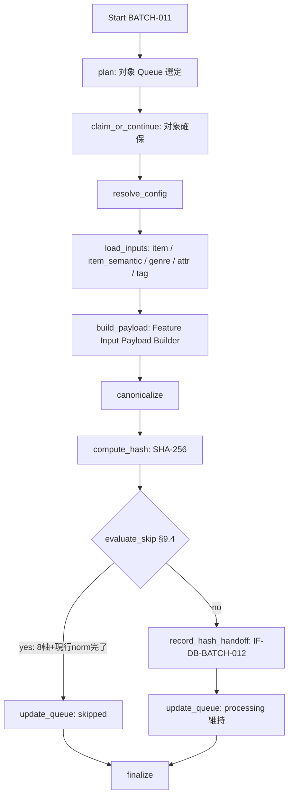

# BATCH-011 Feature入力hash算出バッチ仕様書

## 1. ドキュメント情報

| 項目           | 内容                                     |
| -------------- | ---------------------------------------- |
| ドキュメントID | `BATCH-011`                              |
| ドキュメント名 | Feature入力hash算出バッチ仕様書          |
| 対象システム   | Gift Recommendation Service / batch      |
| MVP対象        | `○`                                      |
| 作成日         | 2026-07-17                               |
| 更新日         | 2026-07-17                               |

---

## 2. 概要

BATCH-011（Feature入力hash算出Batch）は、BATCH-010 が生成した `item_semantic` および商品メタデータから **Feature 生成入力** を正規化し、`feature_input_payload` → canonicalize → **`feature_input_hash`**（SHA-256・64 hex）を算出する Batch である。

算出結果は後続 **BATCH-012（Item Feature生成）** の再生成判定・冪等キー構成要素となる。本 Batch は Feature raw 値の生成（MOD-RECO-027 / IF-SHARED-002）は行わない。

本 Batch は次を **行わない**。

| 対象 | 理由 |
| ---- | ---- |
| `item_semantic` の Upsert | **BATCH-010** / **IF-DB-BATCH-011** |
| `item_feature` 行の INSERT / UPSERT（raw / normalized） | **BATCH-012 / BATCH-013** / **IF-DB-BATCH-013** 等 |
| Item Feature 生成ロジック呼出 | **IF-SHARED-002** / **MOD-RECO-027**（BATCH-012） |
| Queue 初回 INSERT | **BATCH-009** / **IF-DB-BATCH-010** |
| Embedding 入力 hash | **BATCH-014** |

### 2.1 IF 対応（Human 注意：Batch ID と IF 番号）

| IF ID | 名称 | 担当 Batch | 本 Batch での利用 |
| ----- | ---- | ---------- | ----------------- |
| **IF-DB-BATCH-012** | Feature入力hash保存 | **BATCH-011** | **本 Batch の hash 算出・パイプライン確定 I/F** |
| IF-DB-BATCH-011 | Item Semantic保存 | **BATCH-010** | **利用しない**（**混同禁止**） |
| IF-DB-BATCH-013 | Item Feature保存 | BATCH-012 | 利用しない |
| IF-SHARED-002 | Item Feature生成ロジック呼び出し | BATCH-012 | 利用しない |

> **警告**: `IF-DB-BATCH-011` は **Item Semantic**（BATCH-010）用である。本 Batch（BATCH-011）の IF は **`IF-DB-BATCH-012`** である。Batch ID と IF 番号は一致しない。

### 2.2 IF-DB-BATCH-012 の物理書込解釈（確定）

| 観点 | 方針 |
| ---- | ---- |
| hash 算出主体 | **BATCH-011**（本仕様） |
| `item_feature.feature_input_hash` 列への書込 | **BATCH-012** が `item_feature` Upsert するときに同一値を載せる（`item_feature_テーブル定義書` §5.2 / §12） |
| 専用 `feature_input_hash` テーブル | **作らない**（テーブル定義書なし） |
| Queue 行への hash 列 | **持たない**（#507 / Queue 定義書） |
| 本 Batch の「保存」 | 算出した `feature_input_hash` / `feature_input_payload` を Run 単位で確定し、後続 BATCH-012 が参照可能な **handoff（実行結果・ログ・in-process 引き渡し）** として扱う。scaffold では in-memory 記録 |

識別子 Epic は **`[Epic]BATCH-011:Feature入力hash算出Batch`（#1434）** を親とする。先行 BATCH-010（#1422 / PR #1433）を前提とする。縦串は **仕様整備 → 実装 → UT → Epic PR（develop）**。

---

## 3. 目的

| No | 目的 |
| -: | ---- |
| 1 | BATCH-010 後続の Queue 行（主に `generation_type = semantic` かつ `processing`）を対象に Feature 入力を組み立てる |
| 2 | Config Version Resolver で `semantic_config_version_id` を解決する |
| 3 | `feature_input_payload` を構築し canonicalize する（§9） |
| 4 | SHA-256 で `feature_input_hash`（64 hex）を算出する（**IF-DB-BATCH-012**） |
| 5 | 入力不変かつ後続 skip 可能な場合は Queue を `skipped` とする（§9.4・案A） |
| 6 | 失敗時は Queue を `failed` とし、`GRS-BAT-007` 等を記録する |

---

## 4. バッチ基本情報

| 項目           | 内容 |
| -------------- | ---- |
| Batch ID       | `BATCH-011` |
| Batch名        | Feature入力hash算出Batch |
| 処理種別       | 入力正規化 + hash 算出 + Queue 状態更新 |
| 実行基盤       | GitHub Actions。**独立子 workflow `batch-feature-input-hash.yml`（`batch-feature-input-hash*.yml`）を正**とする（§18.1 No.1 **確定**。BATCH-010 同型）。親 `batch-item-meaning-generation.yml` 全体改修は本 Epic 外 |
| 実装言語       | Python（`apps/batch`） |
| 起動方式       | BATCH-010 後続 / `workflow_dispatch` / `retry-failed` |
| 実行頻度       | meaning-generation チェーン内 |
| 冪等キー（一覧） | `item_id` + `semantic_config_version_id` + `feature_input_hash` |
| 先行Batch      | `BATCH-010`（必須） |
| 後続Batch      | `BATCH-012`（必須） |
| MVP対象        | `○` |
| Contract Gate  | **不要** |

実装パス想定: `apps/batch/src/batch/application/feature_input_hash/**`。

### 4.1 モジュール対応

| モジュール | 責務 | 区分 |
| ---------- | ---- | ---- |
| Feature Input Payload Builder | `feature_input_payload` 構築 | 一覧モジュール（MOD-ID 未採番） |
| Feature Input Hash Calculator | canonicalize + SHA-256 | 一覧モジュール（MOD-ID 未採番） |
| Config Version Resolver | `semantic_config_version_id` 解決 | MOD-RECO-003 同一ルール |
| Error Handler / Batch Logger | 失敗・Run / Phase ログ | 共通 |

---

## 5. 実行条件

### 5.1 トリガー

| トリガー | 利用有無 | 条件 | 備考 |
| -------- | -------- | ---- | ---- |
| schedule | `false` | — | 独立 cron なし（§18.1 No.1） |
| workflow_dispatch | `true` | 手動・再実行 | |
| 先行Batch完了 | `true`（運用上） | BATCH-010 後続 / `workflow_call` | 親チェーン全体改修は外 |
| retry-failed | `true` | `failed` 行の再実行 | |

### 5.2 実行前提

- BATCH-010 により対象 `item_id` の `item_semantic` が利用可能であること（主経路）
- 対象 Queue が消化可能であること（§9.1）
- `item` / genre / attribute / tag が参照可能であること
- Database へ接続可能であること
- 同時多重起動は `GRS-BAT-003` で拒否する

---

## 6. 入力

### 6.1 入力データ

| 入力 | 種別 | 必須 | 用途 |
| ---- | ---- | ---- | ---- |
| `item_generation_queue` | DB | `true` | 消化対象・trace |
| `item` | DB | `true` | 名称・caption・catchcopy・genre 等 |
| `item_semantic` | DB | `true`（主経路） | `semantic_json` / concepts |
| genre / attribute / tag | DB | `false` | 名称・属性・タグ |
| `semantic_config_version_id` | 解決 | `true` | payload / 後続キー |
| 実行 plan / config | 設定 | `true` | 件数上限・source（§18.1 No.5） |

### 6.2 外部API

| API | 利用有無 |
| --- | -------- |
| External AI / LLM | **なし**（本 Batch は決定論的 hash） |

### 6.3 環境変数（名称のみ）

| 環境変数名 | 必須 | 用途 | secret区分 |
| ---------- | ---- | ---- | ---------- |
| `DATABASE_URL` | `true` | 読取・Queue 更新 | secret |
| `BATCH_FEATURE_INPUT_HASH_MAX_ITEMS` | `false` | 件数上限 | 非secret可 |
| `BATCH_FEATURE_INPUT_HASH_SOURCE` | `false` | `item.source`（既定 `rakuten`） | 非secret可 |
| `BATCH_FEATURE_INPUT_HASH_QUEUE_BATCH_SIZE` | `false` | claim / 処理単位 | 非secret可 |

---

## 7. 出力

### 7.1 出力データ

| 出力 | 正本区分 | 備考 |
| ---- | -------- | ---- |
| `feature_input_hash` | 生成入力管理 | SHA-256 64 hex。物理列書込は BATCH-012（§2.2） |
| `feature_input_payload` | 中間表現 | 専用テーブルなし。canonicalize 入力 |
| `item_generation_queue` | 処理制御 | status / タイムスタンプ更新 |
| `batch_run_log` / `phase_log` / `error_log` | 運用 | |
| `item` / `item_semantic` | — | **書込しない** |
| `item_feature` | — | **書込しない**（BATCH-012） |

### 7.2 後続への引き渡し

| 後続 | 引き渡し | 条件 |
| ---- | -------- | ---- |
| BATCH-012 | `feature_input_hash` + payload 要約 / `item_id` + `semantic_config_version_id` | hash 算出成功 |
| BATCH-017 | ログ・件数 | Run 集計 |

---

## 8. 処理フロー

### 8.1 全体フロー



### 8.2 処理ステップ（Phase）

| No | Phase | 処理 | 失敗時 |
| -: | ----- | ---- | ------ |
| 1 | `plan` | 対象 Queue 一覧 | `GRS-BAT-*` |
| 2 | `claim_or_continue` | queued→processing、または processing 継続 | 競合時 skip |
| 3 | `resolve_config` | `semantic_config_version_id` / 現行 `feature_normalization_version_id` | `GRS-CFG-*` → failed |
| 4 | `load_inputs` | item / semantic / 補助マスタ | `GRS-DB-*` / `GRS-VAL-*` → failed |
| 5 | `build_payload` | payload 構築 | `GRS-VAL-*` / `GRS-BAT-007` |
| 6 | `compute_hash` | canonicalize + SHA-256 | `GRS-BAT-007` |
| 7 | `evaluate_skip` | 今回 hash + 現行 normalization version で §9.4 判定 | `GRS-DB-*` / `GRS-CFG-*` |
| 8 | `record_hash_handoff` | IF-DB-BATCH-012（handoff 確定）。skip 時は省略可 | `GRS-DB-*` |
| 9 | `update_queue` | status 更新（skipped / processing 維持 / failed） | `GRS-DB-*` |
| 10 | `finalize` | 集計。部分成功は `GRS-BAT-002` | |

処理単位は **`item_generation_queue_id`**。

---

## 9. 判定・算出ロジック

### 9.1 Queue 対象

| 条件 | 処理 |
| ---- | ---- |
| `generation_type = semantic` かつ `queue_status = processing`（BATCH-010 成功後） | **主経路**（§18.1 No.8 **確定候補**） |
| `generation_type = feature` かつ `queue_status = queued` | **副経路**（BATCH-009 が feature 登録した場合） |
| `generation_type = embedding` | **対象外**（BATCH-014） |
| `queue_status = succeeded` / `skipped` / `failed` | 対象外（retry は failed→queued 後） |

### 9.2 Feature 入力に含める項目（確定：方針書 §13.3）

| 項目 | 含めるか |
| ---- | -------- |
| itemName / catchcopy / itemCaption | ○ |
| genreId / genreName | ○ |
| attribute / tag | ○ |
| item_semantic（concepts 等） | ○ |
| semantic_config_version_id | ○ |
| reviewAverage / reviewCount / price / rank / imageUrl / availability / itemUrl | × |

### 9.3 payload / canonicalize / hash

```text
feature_input_payload
  → canonicalize（キーソート・文字列 trim・配列ソート・null 正規化）
  → SHA-256（UTF-8）
  → feature_input_hash（小文字 hex 64 文字）
```

payload 例（方針書 §13.3 準拠）:

```json
{
  "item_id": "item_001",
  "item_name": "高級ハンドクリーム",
  "catchcopy": "上品で落ち着いた香り",
  "item_caption": "ギフトに適した保湿クリーム",
  "genre_id": "100371",
  "genre_name": "美容・コスメ",
  "attributes": ["hand_care", "fragrance"],
  "tags": [],
  "semantic_concepts": ["formal_refined", "safe_classic"],
  "semantic_config_version_id": "scv_001"
}
```

`semantic_concepts` は `item_semantic.semantic_json.concepts[]` から `concept_code` を安定ソートして載せる（実装 Task で確定可）。

### 9.4 skip（確定：案A）

hash 算出後に判定する。Queue を `skipped` にするのは **BATCH-011〜013 がすべて不要**な場合に限る（`item_feature_テーブル定義書` §12.5）。

| 条件 | 動作 |
| ---- | ---- |
| 同一 `item_id` + `semantic_config_version_id` + **今回算出** `feature_input_hash` + **現行** `feature_normalization_version_id` で、MVP 8 軸（`feature_code` 8 値）がすべて存在し、各行の `normalized_feature_value` が有効 | Queue → **`skipped`**（`completed_at`）。BATCH-012〜013 も不要。handoff は省略可 |
| 上記以外（raw のみ揃い・正規化未完了・normalization version 不一致・軸欠損を含む） | hash を handoff し、Queue は **`processing` 維持**（後続 BATCH-012 へ） |

#### 9.4.1 判定キー・参照

| 項目 | 方針 |
| ---- | ---- |
| 判定タイミング | `compute_hash` の**後**（今回 hash が必要） |
| 参照先 | `item_feature`（**SELECT のみ**。本 Batch は書込しない） |
| `feature_normalization_version_id` | 現行正規化 version を Config / Resolver で解決（BATCH-013 と同一ルール。実装 Task で具体キー確定可） |
| 成功定義 | `COUNT(DISTINCT feature_code) = 8` かつ対象行の `normalized_feature_value IS NOT NULL` |
| stub | **しない**（§18.1 No.9 **確定：不採用**） |

#### 9.4.2 BATCH 間の役割

| Batch | skip の意味 |
| ----- | ----------- |
| **BATCH-011（本節）** | 現行入力でも Feature パイプライン（raw + 正規化）が完了済み → Queue 終端 |
| **BATCH-012** | 同一 hash の raw 8 軸成功済み → Feature 生成のみ skip（方針書 §7.2 / §17.3） |
| **BATCH-013** | 正規化済みなら正規化のみ skip（BATCH-013 仕様） |

---

## 10. DB更新

| リソース | 操作 | IF | 備考 |
| -------- | ---- | -- | ---- |
| hash handoff | 算出確定 | **IF-DB-BATCH-012** | §2.2。専用テーブルなし。§9.4 skip 時は省略可 |
| `item_generation_queue` | UPDATE | — | claim / skip / failed / processing 維持 |
| `item_feature` | SELECT | — | §9.4 skip 判定のみ。**書込禁止**（BATCH-012 / 013） |
| `item_semantic` / `item` | SELECT | — | 更新しない |

#### 禁止操作

- IF-DB-BATCH-010 相当の Queue INSERT
- IF-DB-BATCH-011 相当の `item_semantic` Upsert
- IF-DB-BATCH-013 相当の `item_feature` Upsert
- `generation_type` の変更

---

## 11. 冪等性・再実行性

| 観点 | 方針 |
| ---- | ---- |
| hash 冪等 | 同一入力 → 同一 `feature_input_hash` |
| Queue | 楽観的 claim / processing 二重禁止 |
| 再実行 | `failed` → retry-failed で再処理 |
| rollback | 自動 rollback なし |

---

## 12. 状態管理

| 結果 | `queue_status` | 備考 |
| ---- | -------------- | ---- |
| claim | `processing` | started_at |
| skip | `skipped` | §9.4（8 軸 + 現行 normalization まで完了） |
| 失敗 | `failed` | `GRS-BAT-007` 等 |
| hash 成功（semantic パイプライン） | **`processing` 維持** | BATCH-012 以降へ |

---

## 13. エラー・リトライ

| エラー | Code | 備考 |
| ------ | ---- | ---- |
| Feature入力hash算出失敗 | `GRS-BAT-007` | 方針書 § |
| 入力検証 | `GRS-VAL-*` | |
| Config | `GRS-CFG-*` | |
| DB | `GRS-DB-*` | |
| 部分成功 | `GRS-BAT-002` | |
| 多重起動 | `GRS-BAT-003` | |

---

## 14. ログ・監視

| 種別 | 内容 |
| ---- | ---- |
| batch_run_log / phase_log | Run・Phase。Phase 例: `feature_input_hash_computed` |
| error_log | code / queue_id / item_id |
| メトリクス | planned / hashed / skipped / failed |

`feature_input_hash` はログに全文を出さず、先頭数文字 + 省略可（item_feature 定義書 §）。

---

## 15. セキュリティ

| 観点 | 方針 |
| ---- | ---- |
| secret | DB 認証情報は Secrets / `.env` のみ |
| ログ | 接続文字列・商品全文ダンプ禁止 |
| LLM secret | 不要 |

---

## 16. テスト観点

| No | 観点 | 種別 |
| --: | ---- | ---- |
| 1 | 正常系 payload→hash（64 hex） | unit |
| 2 | 入力同一 → hash 同一 | unit |
| 3 | 除外項目（price/review 等）変更でも hash 不変 | unit |
| 4 | IF 境界: item_feature / item_semantic 非更新、Queue INSERT なし | unit / review |
| 5 | IF-DB-BATCH-011 非使用 | review |
| 6 | Queue フィルタ（embedding 除外） | unit |
| 7 | 失敗 `GRS-BAT-007` → failed | unit |
| 8 | 部分成功 `GRS-BAT-002` | unit |
| 9 | secret 非含有 | review / unit |
| 10 | BATCH-010 / 012 境界 | review |
| 11 | skip: 8 軸 + 現行 normalization 完了 → Queue `skipped` | unit |
| 12 | skip 不成立（raw のみ / 軸欠損 / norm version 不一致）→ handoff + processing 維持 | unit |

---

## 17. 変更管理

| 日付 | 変更内容 | 関連 |
| ---- | -------- | ---- |
| 2026-07-17 | 初版作成 | Epic #1434 / Task #1435 |
| 2026-07-17 | §9.4 skip を案Aで確定（normalization version 含む）。No.9 stub 不採用 | Human 確認 |
| 2026-07-17 | §18.1 No.1（独立 YAML）・No.10（config キー）を確定 | Human 確認 |

---

## 18. 未決事項・決定事項

### 18.1 採用方針

| No | 論点 | 内容 | 状態 |
| --: | ---- | ---- | ---- |
| 1 | 子 workflow | 独立 YAML `batch-feature-input-hash.yml`。cron なし。親全体改修は外 | **確定** |
| 2 | IF 番号 | **IF-DB-BATCH-012 = BATCH-011**。IF-DB-BATCH-011 = BATCH-010（混同禁止） | **確定** |
| 3 | 入力項目 | 方針書 §13.3 の ○/× 表 | **確定** |
| 4 | hash アルゴリズム | SHA-256、小文字 hex 64 | **確定**（item_feature CHECK 想定） |
| 5 | 物理書込 | 算出=011、`item_feature` 列書込=012。専用テーブルなし。Queue に hash 列なし | **確定**（§2.2） |
| 6 | Contract Gate | 不要 | **確定** |
| 7 | apps/reco / IF-SHARED-002 | 本 Epic 外（BATCH-012） | **確定** |
| 8 | 主経路 Queue | semantic + processing（BATCH-010 後） | **確定候補**（実装で確定可） |
| 9 | skip 判定 | **本番実装（stub 不採用）**。キーに現行 `feature_normalization_version_id` を含む（案A）。詳細は §9.4 | **確定** |
| 10 | config キー | `BATCH_FEATURE_INPUT_HASH_*` | **確定** |

### 18.2 残未決（Human）

| No | 事項 |
| -: | ---- |
| 1 | 親 meaning-generation からの `workflow_call` タイミング（Epic 外） |

---

## 19. 関連資料

| 種別 | パス |
| ---- | ---- |
| 一覧 | `docs/05_アプリケーション設計/アプリ/batch/バッチ処理一覧.md` |
| 方針 | `docs/05_アプリケーション設計/アプリ/batch/バッチ設計方針書.md` §13.3 |
| 依存 | `docs/05_アプリケーション設計/アプリ/batch/バッチ依存関係図.md` |
| IF | `docs/05_アプリケーション設計/アプリ/インターフェース一覧.md` |
| DB | `item_feature` / `item_semantic` / `item_generation_queue` テーブル定義書 |
| 先行 | `BATCH-010_Item Semantic生成バッチ仕様書.md` |

---

## 20. レビュー観点

- BATCH-011 と IF-DB-BATCH-012 が対応している
- IF-DB-BATCH-011（BATCH-010）と混同していない
- §13.3 入力 ○/× と整合
- `item_feature` 書込が BATCH-012 側である
- BATCH-012 / apps/reco が混入していない
- §18 で確定 / 提案が区別されている
- §9.4 skip が案A（normalization version 含む）で、stub していない
- secret 非含有
- PR target が親 Epic Branch

---

## 21. 備考

### 21.1 Out of scope

| 対象 | 理由 |
| ---- | ---- |
| BATCH-012 Item Feature 生成 | 後続 Epic |
| BATCH-010 Semantic | 先行 |
| 実装・workflow・UT | 後続 Task |
| migration | 既存定義参照 |

### 21.2 データフロー（MVP）

```text
BATCH-010 → item_semantic + Queue processing（semantic）
BATCH-011 → feature_input_payload / feature_input_hash（handoff）
          → Queue processing 維持
BATCH-012 → item_feature Upsert（feature_input_hash 列に載せる）
```
