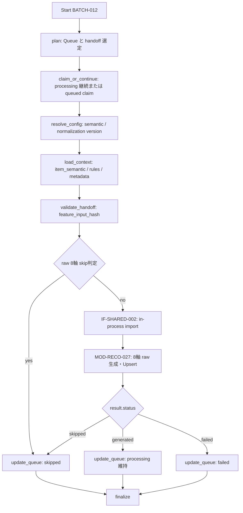

# BATCH-012 Item Feature生成バッチ仕様書

## 1. ドキュメント情報

| 項目 | 内容 |
| --- | --- |
| ドキュメントID | `BATCH-012` |
| ドキュメント名 | Item Feature生成バッチ仕様書 |
| 対象システム | Gift Recommendation Service / batch |
| MVP対象 | `○` |
| 作成日 | 2026-07-18 |
| 更新日 | 2026-07-18 |

---

## 2. 概要

BATCH-012（Item Feature生成Batch）は、BATCH-011 から引き渡された `feature_input_hash` と、`item_semantic`、商品メタデータ、Feature Rule を入力として、MVP の 8 軸 Feature raw 値を生成し、`item_feature` に Upsert する Batch である。

生成ロジックは `MOD-RECO-027` Item Feature Generator を利用する。本 Batch は Queue の選定・Config 解決・入力コンテキストの組み立て・結果に応じた Queue 更新・Batch Logger / Error Handler を担当する。

| 本 Batch が行う | 本 Batch が行わない |
| --- | --- |
| raw Feature 8 軸の生成と `item_feature` Upsert | `feature_input_hash` の再算出（BATCH-011） |
| `feature_normalization_version_id` の解決・記録 | `normalized_feature_value` の更新（BATCH-013） |
| Queue の成功・skip・失敗状態更新 | `item_semantic` の DML（BATCH-010） |
| IF-SHARED-002 での in-process 呼出 | Queue 初回 INSERT（BATCH-009） |

### 2.1 IF対応（警告: Batch IDとIF番号）

| IF ID | 名称 | 担当 Batch | 本 Batch での扱い |
| --- | --- | --- | --- |
| **IF-DB-BATCH-013** | Item Feature保存 | **BATCH-012** | **`item_feature` 8 軸 Upsert I/F** |
| **IF-SHARED-002** | Item Feature生成ロジック呼び出し | **BATCH-012** | **`MOD-RECO-027` を呼び出す I/F** |
| IF-DB-BATCH-012 | Feature入力hash保存 | BATCH-011 | 読取元。**本 Batch は hash を再算出しない** |
| IF-DB-BATCH-011 | Item Semantic保存 | BATCH-010 | 利用しない |

> **警告**: `IF-DB-BATCH-012` は **BATCH-011** の Feature入力hash保存である。本 Batch（BATCH-012）の物理書込 I/F は **`IF-DB-BATCH-013`** である。**Batch ID と IF 番号は一致しないため混同してはならない。**

親 Epic は **`[Epic]BATCH-012:Item Feature生成Batch`（#1446）**。先行 BATCH-011（#1434 / PR #1445）を前提とする。

---

## 3. 目的

| No | 目的 |
| --: | --- |
| 1 | BATCH-011 成功後の Feature 生成対象 Queue を消化する |
| 2 | `semantic_config_version_id` と `feature_normalization_version_id` を解決する |
| 3 | IF-SHARED-002 経由で MOD-RECO-027 を呼び出し、MVP 8 軸 raw 値を得る |
| 4 | IF-DB-BATCH-013 により `item_feature` へ 8 行を冪等 Upsert する |
| 5 | 同一入力で raw 8 軸が生成済みなら、Feature生成のみを skip する |
| 6 | 後続 BATCH-013 のため、成功時も Queue を `processing` に維持する |

---

## 4. バッチ基本情報

| 項目 | 内容 |
| --- | --- |
| Batch ID | `BATCH-012` |
| Batch名 | Item Feature生成Batch |
| 処理種別 | Queue 消化 + Feature raw 生成 + 派生データ Upsert |
| 実行基盤 | GitHub Actions。独立子 workflow **`batch-item-feature.yml`（`batch-item-feature*.yml`）を正**とする |
| 実装言語 | Python（`apps/batch`、`apps/reco` の共有ロジックを in-process 呼出） |
| 起動方式 | BATCH-011 後続 / `workflow_dispatch` / `retry-failed` |
| 先行Batch | BATCH-011 |
| 後続Batch | BATCH-013 / BATCH-017 |
| 冪等キー | `item_id` + `semantic_config_version_id` + `feature_code` + `feature_input_hash` + `feature_normalization_version_id` |
| Contract Gate | **不要**（HTTP API / OpenAPI を変更しない） |

親 `batch-item-meaning-generation.yml` の全体改修および接続タイミングの確定は本 Epic 外とする。

### 4.1 モジュール対応

| モジュール | 責務 |
| --- | --- |
| Item Feature Generator（MOD-RECO-027） | Concept を MVP 8 軸 raw 値へ変換し、`item_feature` を Upsert |
| Config Version Resolver（MOD-RECO-003） | `semantic_config_version_id` と normalization binding を解決 |
| Batch Logger / Error Handler | Run・Phase・エラー・集計の記録 |

---

## 5. 実行条件

### 5.1 トリガー

| トリガー | 利用有無 | 条件 |
| --- | --- | --- |
| schedule | `false` | 独立 cron は設けない |
| workflow_dispatch | `true` | 手動実行・対象 Item の部分再実行 |
| 先行Batch完了 | `true`（運用上） | BATCH-011 後続、または親 workflow から `workflow_call` |
| retry-failed | `true` | `failed` を retry workflow で `queued` に戻した後 |

### 5.2 実行前提

- BATCH-011 の handoff として、対象の `item_id`、`semantic_config_version_id`、`feature_input_hash` が利用可能であること。
- 主経路では BATCH-010 の `item_semantic` が同一 `semantic_config_version_id` で存在すること。
- `concept_feature_rule`、`feature_definition`、`normalization_rule` が参照可能であること。
- IF-SHARED-002 の import アダプタが batch プロセスから利用可能であること。
- 同一 Batch の多重起動および同一 Feature 冪等キーの二重処理は `GRS-BAT-003` で拒否すること。

---

## 6. 入力

### 6.1 入力データ

| 入力 | 種別 | 必須 | 用途 |
| --- | --- | --- | --- |
| `item_generation_queue` | DB | `true` | 対象選定・状態管理・trace |
| BATCH-011 handoff / `item_feature_input` | scaffold: in-process / 実行コンテキスト。本実装: DB（`item_feature_input`） | `true` | `feature_input_hash` の受渡し（§6.2） |
| `item_semantic` | DB | `true` | `semantic_json.concepts[]` |
| `item` / genre / attribute / tag | DB | 条件付き | 生成コンテキストの補助情報 |
| `concept_feature_rule` / `feature_definition` | DB | `true` | Rule 適用・8 軸検証 |
| `normalization_rule` | DB | `true` | `feature_normalization_version_id` 解決 |
| `semantic_config_version_id` | Resolver | `true` | Rule スコープ・冪等キー |

### 6.2 hash handoff（中間永続テーブル消費）

`feature_input_hash` は BATCH-011 が永続化した **`item_feature_input`**（IF-DB-BATCH-012）から読み取り、検証して `MOD-RECO-027` の context および `item_feature.feature_input_hash` にそのまま載せる。scaffold 段階の in-process handoff も許容するが、本実装では DB 参照を正とする（BATCH-011 §2.2 / Epic #1561）。

- 本 Batch および MOD-RECO-027 は hash を再算出しない。
- handoff 欠落・64 hex 形式不正・対象 Version との不整合は `GRS-BAT-008` として当該 Queue を `failed` にする。
- hash 再算出が必要な場合は **BATCH-011 の再実行**を行う。

### 6.3 外部 API / LLM

| 対象 | 利用有無 | 方針 |
| --- | --- | --- |
| Reco Hosting HTTP | **なし** | IF-SHARED-002 は HTTP ではない |
| External AI / LLM | **なし** | MVP はルールベース。LLM Scaffold も不要 |

### 6.4 環境変数（名称のみ）

| 環境変数名 | 必須 | 用途 | secret区分 |
| --- | --- | --- | --- |
| `DATABASE_URL` | `true` | DB 読取・Upsert・Queue 更新 | secret |
| `BATCH_ITEM_FEATURE_MAX_ITEMS` | `false` | 1 Run の件数上限 | 非secret |
| `BATCH_ITEM_FEATURE_SOURCE` | `false` | `item.source` フィルタ | 非secret |
| `BATCH_ITEM_FEATURE_QUEUE_BATCH_SIZE` | `false` | 処理 / claim 単位 | 非secret |

---

## 7. 出力

### 7.1 出力データ

| 出力 | 操作 | 内容 |
| --- | --- | --- |
| `item_feature` | UPSERT | MVP 8 軸の `raw_feature_value`、`feature_input_hash`、`feature_normalization_version_id`、`generated_at` |
| `item_feature.normalized_feature_value` | **更新しない** | **NULL のまま**。BATCH-013 責務 |
| `item_generation_queue` | UPDATE | `processing` 維持 / `skipped` / `failed` |
| `batch_run_log` / `phase_log` / `error_log` | INSERT / UPDATE | 実行記録・エラー・集計 |

### 7.2 後続への引き渡し

| 後続 | 引き渡し | 条件 |
| --- | --- | --- |
| BATCH-013 | 同一冪等キー組の `item_feature.raw_feature_value` 8 行 | raw 8 軸 Upsert 成功 |
| BATCH-017 | Run 件数・失敗件数 | Run 終了 |

---

## 8. 処理フロー

### 8.1 全体フロー



### 8.2 処理ステップ

| No | Phase | 処理 | 失敗時 |
| --: | --- | --- | --- |
| 1 | `plan` | Queue / BATCH-011 handoff の対象選定 | `GRS-BAT-*` |
| 2 | `claim_or_continue` | Queue を claim、または `processing` を継続 | 競合は処理しない |
| 3 | `resolve_config` | semantic / normalization version 解決 | `GRS-CFG-*` → failed |
| 4 | `load_context` | Semantic、Rule、Item、メタデータ読取 | `GRS-DB-*` / `GRS-VAL-*` → failed |
| 5 | `validate_handoff` | BATCH-011 hash を検証 | `GRS-BAT-008` → failed |
| 6 | `evaluate_skip` | §9.3 の raw 8 軸 skip 判定 | `GRS-DB-*` → failed |
| 7 | `generate_feature` | IF-SHARED-002 で MOD-RECO-027 を呼出 | `GRS-BAT-008` → failed |
| 8 | `update_queue` | 結果に応じ Queue を更新 | `GRS-DB-*` |
| 9 | `finalize` | Run / Phase / Error の集計 | 部分成功は `GRS-BAT-002` |

処理単位は `item_generation_queue_id` とする。

### 8.3 IF-SHARED-002 呼出境界（確定）

| 観点 | 方針 |
| --- | --- |
| I/F | **IF-SHARED-002** |
| 方式 | **in-process import アダプタ**（batch → reco/shared logic の Python package / function call） |
| 呼出先 | `MOD-RECO-027` Item Feature Generator |
| HTTP | **Reco Hosting HTTP ではない** |
| `apps/reco` | 本 Epic では本体を変更しない |
| Queue DML | batch 側のみが実施 |
| Phase Log | Batch Logger が `item_feature_generated` を記録。MOD-RECO-028 は使用しない |

---

## 9. 判定・生成ロジック

### 9.1 Queue 対象

| 条件 | 処理 |
| --- | --- |
| `generation_type = semantic` かつ `queue_status = processing` | **主経路**。BATCH-011 後の継続 |
| `generation_type = feature` かつ `queue_status = queued` | **副経路**。Feature 専用 Queue |
| `generation_type = embedding` | 対象外（BATCH-014 以降） |
| `succeeded` / `skipped` / `failed` | 対象外。retry は別 workflow が `queued` へ戻す |

### 9.2 MVP raw 生成

MOD-RECO-027 に従い、`item_semantic.semantic_json.concepts[]` と `concept_feature_rule` を使う**ルールベース**生成とする。LLM は利用しない。

```text
raw[axis]
  = clip(0.5 + Σ(concept_feature_delta × source_weight × confidence), 0.0, 1.0)
```

生成対象は `formality`、`safety`、`brand_appropriateness`、`emotion`、`novelty`、`intimacy`、`symbolic_identity`、`story_richness` の 8 軸である。Concept が 0 件の場合も、各軸 `0.5` として成功させる。

### 9.3 Feature生成 skip（確定）

バッチ設計方針書 §7.2 / §17.3 に従い、以下の同一キーで **raw 8 軸すべて**が揃っている場合は、Feature生成だけを skip する。

```text
item_id
+ semantic_config_version_id
+ feature_input_hash
+ feature_normalization_version_id
```

| 条件 | 動作 |
| --- | --- |
| 8 軸すべての `raw_feature_value` が存在 | MOD-RECO-027 は `skipped` を返却し、Queue → `skipped` |
| 軸欠損 / hash 不一致 / version 不一致 / raw NULL | 生成を実行 |
| `normalized_feature_value` が NULL | **本 Batch の skip を妨げない**。正規化は BATCH-013 の責務 |

> BATCH-011 §9.4 の「raw と正規化まで全て完了した場合の全体 skip」と、本節の「raw 8 軸が揃った場合の Feature生成 skip」は対象範囲が異なる。本 Batch は後者のみを扱う。

---

## 10. DB更新

### 10.1 `item_feature` Upsert（IF-DB-BATCH-013）

| テーブル | 操作 | 一意キー | 更新項目 |
| --- | --- | --- | --- |
| `item_feature` | UPSERT | 5 列冪等キー | `raw_feature_value`、`generated_at` |

挿入時に、`item_id`、`semantic_config_version_id`、`feature_code`、BATCH-011 の `feature_input_hash`、解決済み `feature_normalization_version_id`、`raw_feature_value`、`generated_at` を記録する。`normalized_feature_value` は指定せず **NULL のまま**とする。

### 10.2 Queue 更新

| 結果 | `queue_status` | 備考 |
| --- | --- | --- |
| `feature` + `queued` の claim | `processing` | 条件付き更新 |
| raw Feature生成 skip | `skipped` | Feature 生成のみ不要 |
| raw Feature生成成功 | **`processing` 維持** | BATCH-013 へ継続 |
| 失敗 | `failed` | error_log と `completed_at` |

### 10.3 禁止操作

- `item_semantic` の INSERT / UPDATE / DELETE
- `item_generation_queue` の初回 INSERT（BATCH-009 / IF-DB-BATCH-010）
- `normalized_feature_value` の更新（BATCH-013）
- `generation_type` の変更
- OpenAPI、migration、generated ファイルの変更

---

## 11. 冪等性・再実行性

| 観点 | 方針 |
| --- | --- |
| Upsert | 同一 5 列冪等キーは上書き収束する |
| 履歴 | hash または normalization version が変われば別行 INSERT |
| 排他 | 同一 Item・Version・hash の二重 `processing` を禁止 |
| retry | `failed` → retry workflow により `queued` へ戻して再実行 |
| rollback | 自動 rollback は行わない。error_log を基に再実行する |

---

## 12. 状態管理

| 操作 | 遷移 | 条件 |
| --- | --- | --- |
| claim | `queued` → `processing` | `generation_type = feature` の副経路 |
| 継続 | `processing` → `processing` | BATCH-011 後の主経路 |
| skip | `processing` → `skipped` | §9.3 の raw 8 軸生成済み |
| 生成成功 | `processing` → **`processing`** | BATCH-013 が後続 |
| 失敗 | `processing` → `failed` | `GRS-BAT-008` 等 |

`generation_type = semantic` の Queue は BATCH-013 以降を含むパイプライン完了まで `succeeded` にしない。

---

## 13. エラー・リトライ

| エラー種別 | Code | 方針 |
| --- | --- | --- |
| Item Feature生成失敗 | `GRS-BAT-008` | Queue `failed`、error_log 記録 |
| Config 解決失敗 | `GRS-CFG-*` | Queue `failed` |
| DB / Upsert 失敗 | `GRS-DB-*` | 一時障害のみ短時間リトライを検討 |
| 入力 / hash 検証失敗 | `GRS-VAL-*` / `GRS-BAT-008` | 自動リトライしない |
| 多重起動 | `GRS-BAT-003` | 起動拒否 |
| 部分成功 | `GRS-BAT-002` | 失敗 Item のみ再実行可能にする |

---

## 14. ログ・監視

| 種別 | 記録内容 |
| --- | --- |
| `batch_run_log` | 開始・終了・run status・件数 |
| `phase_log` | `item_feature_generated` の成否 |
| `error_log` | error code、queue ID、item ID、trace ID |
| 構造化ログ | `concept_count`、`rule_hit_count`、`raw_clip_count`、処理時間、結果 |
| メトリクス | planned / generated / skipped / failed / raw clip 件数 |

`feature_input_hash` はログに全文を出力せず、必要時のみ先頭数文字をマスク付きで扱う。商品本文・DB接続文字列・secret はログ出力しない。

---

## 15. セキュリティ・外部サービス利用

| 観点 | 方針 |
| --- | --- |
| DB 認証情報 | GitHub Secrets / local `.env` のみ。値を docs・ログへ記載しない |
| LLM secret | **不要**。MVP はルールベース |
| HTTP 公開 | なし。Batch は HTTP API 化しない |
| 権限 | `apps/batch` のみが `item_feature` を書き込む |
| ログ | hash 全文、商品全文、接続情報、認証情報を出力しない |

---

## 16. テスト観点

| No | 観点 | 確認内容 | 種別 |
| --: | --- | --- | --- |
| 1 | 主経路 | `semantic` + `processing` を継続処理できる | unit / integration |
| 2 | 副経路 | `feature` + `queued` を claim できる | unit |
| 3 | IF-SHARED-002 | in-process import で MOD-RECO-027 を呼ぶ。HTTP を使わない | unit / architecture |
| 4 | 8 軸完全性 | MVP 8 `feature_code` の raw 行を生成する | unit |
| 5 | ルールベース | LLM / Scaffold を呼ばず Concept Rule のみで生成する | unit |
| 6 | Concept 0 件 | 8 軸 raw = `0.5` で成功する | unit |
| 7 | hash handoff | BATCH-011 の hash をそのまま保存し、再算出しない | unit |
| 8 | Upsert | 5 列冪等キーで 8 行を Upsert し、同一キー再実行で収束する | integration |
| 9 | raw / normalized 分離 | raw のみ保存し、`normalized_feature_value IS NULL` を維持する | integration |
| 10 | skip | 同一キーで raw 8 軸ありなら Feature生成を skip する | unit |
| 11 | skip 不成立 | 軸欠損・hash / version 不一致なら再生成する | unit |
| 12 | Queue 状態 | 成功時 `processing` 維持、skip は `skipped`、失敗は `failed` | unit |
| 13 | DB 境界 | `item_semantic` DML、Queue INSERT、正規化更新を行わない | review / unit |
| 14 | 対象除外 | embedding Queue を対象にしない | unit |
| 15 | 失敗 | hash / Semantic / config 不整合で `GRS-BAT-008` 等を返す | unit |
| 16 | secret | docs、ログ、fixture に認証情報を含めない | review |

---

## 17. 変更管理

| 日付 | 変更内容 | 関連 |
| --- | --- | --- |
| 2026-07-18 | 初版作成 | Epic #1446 |
| 2026-07-19 | 残確認事項 2 件（子 workflow 呼び出しタイミング / `BATCH_ITEM_FEATURE_*` 既定値）を Human 承認により 18.1 確定事項へ反映 | Epic #1446 |

---

## 18. Human 確定事項・残確認事項

### 18.1 確定事項

| No | 論点 | 内容 | 状態 |
| --: | --- | --- | --- |
| 1 | 子 workflow | 独立 YAML **`batch-item-feature.yml`（`batch-item-feature*.yml`）** を正とする。親 meaning-generation 全体改修は本 Epic 外 | **確定** |
| 2 | DB IF | **IF-DB-BATCH-013 = BATCH-012 の Item Feature保存**。IF-DB-BATCH-012 は BATCH-011 の hash 保存 | **確定** |
| 3 | 共有ロジック IF | **IF-SHARED-002 は in-process import アダプタ**。Reco Hosting HTTP ではない | **確定** |
| 4 | `apps/reco` | 本 Epic で `apps/reco` 本体を変更しない | **確定** |
| 5 | MVP 生成方式 | **ルールベース / LLM 不使用 / Scaffold 不要** | **確定** |
| 6 | 物理書込 | `item_feature` に raw 8 軸、hash、normalization version、generated_at を Upsert。normalized は NULL | **確定** |
| 7 | hash | BATCH-011 handoff を使用し、BATCH-012 では再算出しない | **確定** |
| 8 | Queue | `semantic` + `processing` を主経路、`feature` + `queued` を副経路とし、成功時は `processing` を維持 | **確定** |
| 9 | skip | 同一 Item・semantic version・hash・normalization version の raw 8 軸が揃えば Feature生成を skip | **確定** |
| 10 | Contract Gate | 不要。OpenAPI / migration / generated は対象外 | **確定** |
| 11 | 子 workflow 呼び出しタイミング | 独立子 workflow の呼び出しタイミングは本仕様では規定せず、本 Epic 外として親 `batch-item-meaning-generation.yml` 改修 Task で決定する | **確定** |
| 12 | `BATCH_ITEM_FEATURE_*` 既定値 | 具体的な既定値は本仕様では規定せず、実装 / workflow Task で確定する | **確定** |

### 18.2 残確認事項（Human）

残確認事項なし。No.1・No.2 は Human 承認済みで、18.1 の No.11・No.12 として確定事項へ反映した。

---

## 関連資料

- `docs/06_実装設計/batch/BATCH-011_Feature入力hash算出バッチ仕様書.md`
- `docs/06_実装設計/batch/BATCH-010_Item Semantic生成バッチ仕様書.md`
- `docs/06_実装設計/database/item_feature_テーブル定義書.md`
- `docs/06_実装設計/reco/MOD-RECO-027_Item Feature Generatorモジュール仕様書.md`
- `docs/05_アプリケーション設計/アプリ/batch/バッチ処理一覧.md`
- `docs/05_アプリケーション設計/アプリ/batch/バッチ設計方針書.md`
- `docs/05_アプリケーション設計/アプリ/インターフェース一覧.md`
