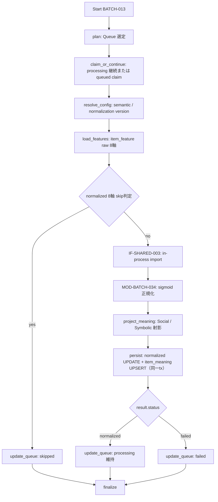

# BATCH-013 Feature正規化バッチ仕様書

## 1. ドキュメント情報

| 項目 | 内容 |
| --- | --- |
| ドキュメントID | `BATCH-013` |
| ドキュメント名 | Feature正規化バッチ仕様書 |
| 対象システム | Gift Recommendation Service / batch |
| MVP対象 | `○` |
| 作成日 | 2026-07-19 |
| 更新日 | 2026-07-19 |

---

## 2. 概要

BATCH-013（Feature正規化Batch）は、BATCH-012 が生成した `item_feature.raw_feature_value`（MVP 8 軸）を入力として、固定パラメータ sigmoid により `normalized_feature_value`（0.0〜1.0）へ正規化し、同一トランザクションで `item_meaning`（Social / Symbolic 座標）を UPSERT する Batch である。

正規化ロジックは `MOD-BATCH-034`（Feature Normalizer）を利用する。本 Batch は Queue の選定・Config / normalization version の解決・raw 入力の読取・正規化結果の反映・Meaning 射影・結果に応じた Queue 更新・Batch Logger / Error Handler を担当する。

| 本 Batch が行う | 本 Batch が行わない |
| --- | --- |
| raw 8 軸の sigmoid 正規化と `item_feature.normalized_feature_value` UPDATE | `raw_feature_value` の生成（BATCH-012） |
| `item_meaning`（Social / Symbolic）の UPSERT | `feature_input_hash` の算出（BATCH-011） |
| `feature_normalization_version_id` の解決・利用 | `normalization_distribution_metric` の書込（BATCH-016） |
| Queue の成功・skip・失敗状態更新 | Embedding 生成（BATCH-014 / BATCH-015） |

### 2.1 IF対応（警告: Batch IDとIF番号）

| IF ID | 名称 | 担当 Batch | 本 Batch での扱い |
| --- | --- | --- | --- |
| **IF-DB-BATCH-014** | Feature正規化結果保存 | **BATCH-013** | **`item_feature.normalized_feature_value` UPDATE + `item_meaning` UPSERT I/F** |
| **IF-SHARED-003** | Feature正規化ロジック呼び出し | **BATCH-013** | **`MOD-BATCH-034`（Feature Normalizer）を呼び出す I/F** |
| IF-DB-BATCH-013 | Item Feature保存 | BATCH-012 | 読取元（raw 8 軸）。**本 Batch は raw を生成・変更しない** |
| IF-DB-BATCH-012 | Feature入力hash保存 | BATCH-011 | 利用しない |
| IF-DB-BATCH-016 | 分布メトリクス保存 | BATCH-016 | **本 Batch は使用しない** |

> **警告**: `IF-DB-BATCH-013` は **BATCH-012** の Item Feature 保存である。本 Batch（BATCH-013）の物理書込 I/F は **`IF-DB-BATCH-014`** である。**Batch ID と IF 番号は一致しない（IF-DB-BATCH-{N+1} = BATCH-{N}）ため混同してはならない。**

親 Epic は **`[Epic]BATCH-013:Feature正規化Batch`（#1455）**。先行 BATCH-012（#1446 / PR #1453）を前提とする。

---

## 3. 目的

| No | 目的 |
| --: | --- |
| 1 | BATCH-012 成功後の正規化対象 Queue を消化する |
| 2 | `semantic_config_version_id` と `feature_normalization_version_id` を解決する |
| 3 | IF-SHARED-003 経由で MOD-BATCH-034 を呼び出し、raw 8 軸を sigmoid 正規化する |
| 4 | IF-DB-BATCH-014 により `item_feature.normalized_feature_value` を UPDATE する |
| 5 | 同一トランザクションで `item_meaning`（Social / Symbolic）を UPSERT する |
| 6 | 同一入力で normalized 8 軸が現行 version で揃っていれば、正規化のみを skip する |

---

## 4. バッチ基本情報

| 項目 | 内容 |
| --- | --- |
| Batch ID | `BATCH-013` |
| Batch名 | Feature正規化Batch |
| 処理種別 | Queue 消化 + Feature 正規化 + Meaning 射影 + 派生データ更新 |
| 実行基盤 | GitHub Actions。独立子 workflow **`batch-feature-normalization.yml`（`batch-feature-normalization*.yml`）を正**とする |
| 実装言語 | Python（`apps/batch`、`apps/reco` の共有ロジックを in-process 呼出） |
| 起動方式 | BATCH-012 後続 / `workflow_dispatch` / `semantic_config_version` 更新時 / `retry-failed` |
| 先行Batch | BATCH-012 |
| 後続Batch | BATCH-014 / BATCH-016 / BATCH-017 |
| 冪等キー | `item_id` + `semantic_config_version_id` + `feature_code` + `feature_input_hash` + `feature_normalization_version_id` |
| Contract Gate | **不要**（HTTP API / OpenAPI を変更しない） |

親 `batch-item-meaning-generation.yml` の全体改修および接続タイミングの確定は本 Epic 外とする。

### 4.1 モジュール対応

| モジュール | 責務 |
| --- | --- |
| Feature Normalizer（MOD-BATCH-034） | raw 値を sigmoid で 0.0〜1.0 の normalized 値へ変換 |
| Normalization Statistics Manager（MOD-BATCH-038） | 正規化統計量の管理（MVP は固定 sigmoid のため未使用。将来 z-score 拡張時に利用） |
| Meaning Projection | normalized 8 軸を Social / Symbolic へ射影（`item_meaning`） |
| Config Version Resolver | `semantic_config_version_id` と `feature_normalization_version_id`（`normalization_rule` binding）を解決 |
| Batch Logger / Error Handler | Run・Phase・エラー・集計の記録 |

---

## 5. 実行条件

### 5.1 トリガー

| トリガー | 利用有無 | 条件 |
| --- | --- | --- |
| schedule | `false` | 独立 cron は設けない（親チェーン側で管理） |
| workflow_dispatch | `true` | 手動実行・対象 Item の部分再実行 |
| 先行Batch完了 | `true`（運用上） | BATCH-012 後続、または親 workflow から `workflow_call` |
| semantic_config_version 更新 | `true`（運用上） | 正規化パラメータ version 更新時の再正規化 |
| retry-failed | `true` | `failed` を retry workflow で `queued` に戻した後 |

### 5.2 実行前提

- BATCH-012 の成果として、対象の `item_feature` raw 8 軸（同一冪等キー組）が存在すること。
- `normalization_rule`（binding）と `feature_normalization_version`（`is_current = true`）が参照可能であること。
- 主経路では `item_generation_queue`（`generation_type = feature` / `semantic`）が処理対象状態であること。
- IF-SHARED-003 の import アダプタが batch プロセスから利用可能であること。
- 同一 Batch の多重起動および同一冪等キーの二重処理は `GRS-BAT-003` で拒否すること。

---

## 6. 入力

### 6.1 入力データ

| 入力 | 種別 | 必須 | 用途 |
| --- | --- | --- | --- |
| `item_generation_queue` | DB | `true` | 対象選定・状態管理・trace |
| `item_feature` | DB | `true` | raw 8 軸（`raw_feature_value`）・冪等キー |
| `normalization_rule` | DB | `true` | `feature_normalization_version_id` の binding 解決 |
| `feature_normalization_version` | DB | `true` | 正規化パラメータ（`normalization_method` / `parameter_json`） |
| `semantic_config_version_id` | Resolver | `true` | Rule スコープ・冪等キー・重み解決 |
| `semantic_config_version` | DB | 条件付き | Social / Symbolic 射影の重み正本 |

### 6.2 raw 入力の選定

- 入力行は `item_feature_テーブル定義書` §17.1 No.5 に従い、**item 単位で最新 `generated_at` の冪等キー組 8 行**とする。
- 本 Batch は `raw_feature_value` を変更しない。`normalized_feature_value` のみ UPDATE する。
- MVP 8 軸のいずれかで raw が欠損している組は正規化対象にできず、当該 Queue を `failed`（`GRS-VAL-*`）とする。

### 6.3 外部 API / LLM

| 対象 | 利用有無 | 方針 |
| --- | --- | --- |
| Reco Hosting HTTP | **なし** | IF-SHARED-003 は HTTP ではない |
| External AI / LLM | **なし** | MVP は数式（sigmoid）処理。LLM Scaffold も不要 |

### 6.4 環境変数（名称のみ）

| 環境変数名 | 必須 | 用途 | secret区分 |
| --- | --- | --- | --- |
| `DATABASE_URL` | `true` | DB 読取・UPDATE・UPSERT・Queue 更新 | secret |
| `BATCH_FEATURE_NORMALIZATION_MAX_ITEMS` | `false` | 1 Run の件数上限 | 非secret |
| `BATCH_FEATURE_NORMALIZATION_SOURCE` | `false` | `item.source` フィルタ | 非secret |
| `BATCH_FEATURE_NORMALIZATION_QUEUE_BATCH_SIZE` | `false` | 処理 / claim 単位 | 非secret |

---

## 7. 出力

### 7.1 出力データ

| 出力 | 操作 | 内容 |
| --- | --- | --- |
| `item_feature.normalized_feature_value` | UPDATE | MVP 8 軸の 0.0〜1.0 正規化値。`raw_feature_value` は変更しない |
| `item_meaning` | UPSERT | `item_social` / `item_symbolic`（Social / Symbolic 射影） |
| `item_generation_queue` | UPDATE | `processing` 維持 / `skipped` / `failed` |
| `batch_run_log` / `phase_log` / `error_log` | INSERT / UPDATE | 実行記録・エラー・集計 |

`normalized_feature_value` の更新と `item_meaning` の UPSERT は **同一トランザクション**で行う（`item_meaning_テーブル定義書` §5.2）。

### 7.2 後続への引き渡し

| 後続 | 引き渡し | 条件 |
| --- | --- | --- |
| BATCH-014 | 正規化完了 Item | normalized 8 軸 + item_meaning 成功 |
| BATCH-016 | 分布集計対象（`item_feature` / `item_meaning`） | Run 終了後 |
| BATCH-017 | Run 件数・失敗件数 | Run 終了 |

---

## 8. 処理フロー

### 8.1 全体フロー



### 8.2 処理ステップ

| No | Phase | 処理 | 失敗時 |
| --: | --- | --- | --- |
| 1 | `plan` | Queue の対象選定 | `GRS-BAT-*` |
| 2 | `claim_or_continue` | Queue を claim、または `processing` を継続 | 競合は処理しない |
| 3 | `resolve_config` | semantic / normalization version 解決 | `GRS-CFG-*` → failed |
| 4 | `load_features` | raw 8 軸読取（最新冪等キー組） | `GRS-DB-*` / `GRS-VAL-*` → failed |
| 5 | `evaluate_skip` | §9.3 の normalized 8 軸 skip 判定 | `GRS-DB-*` → failed |
| 6 | `normalize_feature` | IF-SHARED-003 で MOD-BATCH-034 を呼出（sigmoid） | `GRS-BAT-008` → failed |
| 7 | `project_meaning` | Social / Symbolic 射影を算出 | `GRS-VAL-*` → failed |
| 8 | `persist` | normalized UPDATE + item_meaning UPSERT（同一 tx） | `GRS-DB-*` → failed |
| 9 | `update_queue` | 結果に応じ Queue を更新 | `GRS-DB-*` |
| 10 | `finalize` | Run / Phase / Error の集計 | 部分成功は `GRS-BAT-002` |

処理単位は `item_generation_queue_id` とする。

### 8.3 IF-SHARED-003 呼出境界（確定）

| 観点 | 方針 |
| --- | --- |
| I/F | **IF-SHARED-003** |
| 方式 | **in-process import アダプタ**（batch → reco/shared logic の Python package / function call） |
| 呼出先 | `MOD-BATCH-034` Feature Normalizer |
| HTTP | **Reco Hosting HTTP ではない** |
| `apps/reco` | 本 Epic では本体を変更しない |
| DB 反映 | batch 側（IF-DB-BATCH-014）のみが実施 |
| Phase Log | Batch Logger が `feature_normalized` / `item_meaning_projected` を記録 |

---

## 9. 判定・正規化ロジック

### 9.1 Queue 対象

| 条件 | 処理 |
| --- | --- |
| `generation_type = feature` かつ `queue_status = queued` | **副経路**。Feature 専用 Queue を claim |
| `generation_type = semantic` かつ `queue_status = processing` | **主経路**。BATCH-011〜012 後の継続 |
| `generation_type = embedding` | 対象外（BATCH-014 以降） |
| `succeeded` / `skipped` / `failed` | 対象外。retry は別 workflow が `queued` へ戻す |

### 9.2 MVP 正規化（確定）

`Featureルール定義書` §14 を正本とし、**固定パラメータ sigmoid** を採用する（LLM 不使用）。

```text
normalized_value = sigmoid(k_feature * (raw_value - center_feature))
sigmoid(x) = 1 / (1 + exp(-x))
```

| パラメータ | MVP 初期値 | 出典 |
| --- | --: | --- |
| `center_feature` | 0.5 | Featureルール定義書 §14.3 |
| `k_feature` | 4.0 | Featureルール定義書 §14.3 |

- パラメータ正本は `feature_normalization_version.parameter_json`（`normalization_method = 'sigmoid'`）とし、`is_current = true` の version を `normalization_rule` binding 経由で解決する。
- z-score + sigmoid（§14.7）は将来拡張であり、本 Batch の MVP では実装しない。
- 対象は `formality`・`safety`・`brand_appropriateness`・`emotion`・`novelty`・`intimacy`・`symbolic_identity`・`story_richness` の 8 軸。

### 9.3 正規化 skip（確定）

以下の同一キーで **normalized 8 軸すべて**が現行 `feature_normalization_version_id` で揃っている場合は、正規化と射影を skip する。

```text
item_id
+ semantic_config_version_id
+ feature_input_hash
+ feature_normalization_version_id
```

| 条件 | 動作 |
| --- | --- |
| 8 軸すべての `normalized_feature_value` が現行 version で存在 | MOD-BATCH-034 は `skipped` を返却し、Queue → `skipped` |
| 軸欠損 / version 不一致 / normalized NULL | 正規化を実行 |
| raw 8 軸のいずれかが NULL | 正規化不可。`GRS-VAL-*` で `failed` |

### 9.4 Meaning 射影（確定）

`item_meaning_テーブル定義書` §5.3 / `GiftMeaningSpace定義書` §5–§7 を正本とする。

| 座標 | 入力 Feature（`normalized_feature_value`） | MVP 集約 |
| --- | --- | --- |
| `item_social` | `formality`, `safety`, `brand_appropriateness` | `semantic_config_version` 内の加重平均。重み未設定時は単純平均 |
| `item_symbolic` | `emotion`, `novelty`, `intimacy`, `symbolic_identity`, `story_richness` | 同上 |

- 値域は 0.0〜1.0。重み正本は `semantic_config_version`（行に重み JSON を保持しない）。
- 8 軸のいずれかで `normalized_feature_value IS NULL` の場合、`item_meaning` を UPSERT しない。

---

## 10. DB更新

### 10.1 `item_feature.normalized_feature_value` UPDATE（IF-DB-BATCH-014）

| テーブル | 操作 | 一意キー | 更新項目 |
| --- | --- | --- | --- |
| `item_feature` | UPDATE | 5 列冪等キー | `normalized_feature_value` のみ |

`raw_feature_value` / `feature_input_hash` / `generated_at` は変更しない。

### 10.2 `item_meaning` UPSERT（IF-DB-BATCH-014）

| テーブル | 操作 | 一意キー | 更新項目 |
| --- | --- | --- | --- |
| `item_meaning` | UPSERT | `item_id` + `semantic_config_version_id` | `item_social` / `item_symbolic` |

10.1 と 10.2 は同一トランザクションで実施する。

### 10.3 Queue 更新

| 結果 | `queue_status` | 備考 |
| --- | --- | --- |
| `feature` + `queued` の claim | `processing` | 条件付き更新 |
| 正規化 skip | `skipped` | 正規化のみ不要 |
| 正規化 + 射影成功 | **`processing` 維持** | 後続（BATCH-014 等）へ継続 |
| 失敗 | `failed` | error_log と `completed_at` |

### 10.4 禁止操作

- `item_feature.raw_feature_value` の変更（BATCH-012）
- `feature_input_hash` の算出・変更（BATCH-011）
- `item_semantic` の DML（BATCH-010）
- `item_generation_queue` の初回 INSERT（BATCH-009）
- `normalization_distribution_metric` の書込（BATCH-016）
- `generation_type` の変更
- OpenAPI、migration、generated ファイルの変更

---

## 11. 冪等性・再実行性

| 観点 | 方針 |
| --- | --- |
| UPDATE / UPSERT | 同一 5 列冪等キー / `item_meaning` キーは上書き収束する |
| 履歴 | `feature_normalization_version_id` が変われば別 raw 行に対する normalized を更新（別冪等キー組） |
| 排他 | 同一 Item・Version の二重 `processing` を禁止 |
| retry | `failed` → retry workflow により `queued` へ戻して再実行 |
| rollback | 自動 rollback は行わない。error_log を基に再実行する |

---

## 12. 状態管理

| 操作 | 遷移 | 条件 |
| --- | --- | --- |
| claim | `queued` → `processing` | `generation_type = feature` の副経路 |
| 継続 | `processing` → `processing` | BATCH-012 後の主経路 |
| skip | `processing` → `skipped` | §9.3 の normalized 8 軸生成済み |
| 成功 | `processing` → **`processing`** | 後続 Batch が継続 |
| 失敗 | `processing` → `failed` | `GRS-BAT-008` / `GRS-VAL-*` 等 |

`generation_type = semantic` の Queue はパイプライン完了まで `succeeded` にしない。

---

## 13. エラー・リトライ

| エラー種別 | Code | 方針 |
| --- | --- | --- |
| 正規化失敗 | `GRS-BAT-008` | Queue `failed`、error_log 記録 |
| Config / version 解決失敗 | `GRS-CFG-*` | Queue `failed` |
| DB / UPDATE / UPSERT 失敗 | `GRS-DB-*` | 一時障害のみ短時間リトライを検討 |
| 入力検証失敗（raw 欠損等） | `GRS-VAL-*` | 自動リトライしない |
| 多重起動 | `GRS-BAT-003` | 起動拒否 |
| 部分成功 | `GRS-BAT-002` | 失敗 Item のみ再実行可能にする |

---

## 14. ログ・監視

| 種別 | 記録内容 |
| --- | --- |
| `batch_run_log` | 開始・終了・run status・件数 |
| `phase_log` | `feature_normalized` / `item_meaning_projected` の成否 |
| `error_log` | error code、queue ID、item ID、trace ID |
| 構造化ログ | `axis_count`、`clip_or_saturate_count`、`meaning_projected_count`、処理時間、結果 |
| メトリクス | planned / normalized / skipped / failed / meaning_upsert 件数 |

`feature_input_hash` はログに全文を出力せず、必要時のみ先頭数文字をマスク付きで扱う。商品本文・DB接続文字列・secret はログ出力しない。分布メトリクスの集計・保存は BATCH-016 の責務であり、本 Batch では行わない。

---

## 15. セキュリティ・外部サービス利用

| 観点 | 方針 |
| --- | --- |
| DB 認証情報 | GitHub Secrets / local `.env` のみ。値を docs・ログへ記載しない |
| LLM secret | **不要**。MVP は sigmoid の数式処理 |
| HTTP 公開 | なし。Batch は HTTP API 化しない |
| 権限 | `apps/batch` のみが `item_feature.normalized` / `item_meaning` を書き込む |
| ログ | hash 全文、商品全文、接続情報、認証情報を出力しない |

---

## 16. テスト観点

| No | 観点 | 確認内容 | 種別 |
| --: | --- | --- | --- |
| 1 | 主経路 | `semantic` + `processing` を継続処理できる | unit / integration |
| 2 | 副経路 | `feature` + `queued` を claim できる | unit |
| 3 | IF-SHARED-003 | in-process import で MOD-BATCH-034 を呼ぶ。HTTP を使わない | unit / architecture |
| 4 | sigmoid | `sigmoid(k*(raw-center))`（center=0.5 / k=4.0）で正規化する | unit |
| 5 | 8 軸完全性 | MVP 8 `feature_code` の normalized を更新する | unit |
| 6 | raw=0.5 → 0.5 | 中立点で normalized = 0.5 になる | unit |
| 7 | 値域 | normalized が 0.0〜1.0 に収まる | unit |
| 8 | raw 不変 | `raw_feature_value` を変更しない | unit / integration |
| 9 | Meaning 射影 | Social 3 軸 / Symbolic 5 軸を平均射影し `item_meaning` を UPSERT する | unit |
| 10 | 欠損射影 | normalized 8 軸のいずれかが NULL なら item_meaning を UPSERT しない | unit |
| 11 | 同一 tx | normalized UPDATE と item_meaning UPSERT を同一トランザクションで行う | integration |
| 12 | skip | 同一キーで normalized 8 軸が現行 version で揃えば skip する | unit |
| 13 | skip 不成立 | 軸欠損・version 不一致なら再正規化する | unit |
| 14 | Queue 状態 | 成功時 `processing` 維持、skip は `skipped`、失敗は `failed` | unit |
| 15 | DB 境界 | raw 変更・item_semantic DML・Queue INSERT・distribution_metric 書込を行わない | review / unit |
| 16 | 対象除外 | embedding Queue を対象にしない | unit |
| 17 | 失敗 | raw 欠損・config 不整合で `GRS-VAL-*` / `GRS-BAT-008` を返す | unit |
| 18 | secret | docs、ログ、fixture に認証情報を含めない | review |

---

## 17. 変更管理

| 日付 | 変更内容 | 関連 |
| --- | --- | --- |
| 2026-07-19 | 初版作成 | Epic #1455 |

---

## 18. Human 確定事項・残確認事項

### 18.1 確定事項（正本 docs 準拠）

| No | 論点 | 内容 | 状態 |
| --: | --- | --- | --- |
| 1 | DB IF | **IF-DB-BATCH-014 = BATCH-013 の Feature正規化結果保存**。IF-DB-BATCH-013 は BATCH-012 の Item Feature 保存 | **確定** |
| 2 | 共有ロジック IF | **IF-SHARED-003 は in-process import アダプタ**。Reco Hosting HTTP ではない。呼出先は MOD-BATCH-034 | **確定** |
| 3 | 正規化方式 | **MVP は固定 sigmoid（center=0.5 / k=4.0）**。LLM 不使用。z-score+sigmoid は将来拡張（Featureルール定義書 §14） | **確定** |
| 4 | 物理書込 | `item_feature.normalized_feature_value` UPDATE + `item_meaning` UPSERT を **同一トランザクション**で実施（item_meaning §5.2） | **確定** |
| 5 | Meaning 射影 | Social 3 軸 / Symbolic 5 軸を `semantic_config_version` 内の加重平均（重み未設定時は単純平均）。8 軸いずれか NULL なら UPSERT しない（#515 決定） | **確定** |
| 6 | 分布メトリクス | `normalization_distribution_metric` 書込は **BATCH-016** 担当。本 Batch は行わない | **確定** |
| 7 | raw 不変 | `raw_feature_value` / `feature_input_hash` は変更しない（BATCH-011 / 012 責務） | **確定** |
| 8 | Queue | `feature`+`queued` を副経路 / `semantic`+`processing` を主経路とし、成功時は `processing` を維持 | **確定** |
| 9 | Contract Gate | 不要。OpenAPI / migration / generated は対象外 | **確定** |
| 10 | 独立子 workflow | MVP 初期は独立子 workflow **`batch-feature-normalization.yml`** を新設・正とする（BATCH-010〜012 の前例に倣う）。親 `batch-item-meaning-generation.yml` チェーンへの接続タイミングは本 Epic 外 | **確定（Human 承認済み）** |
| 11 | 正規化統計版管理 | MVP は固定 sigmoid のため統計母集団（mean/std）不要。`normalization_stats_version_id` の新規列（DDL）は追加せず、正規化の再現性は `feature_normalization_version_id` で担保する。z-score+sigmoid 導入時に後続物理設計で改めて検討（方針書 §13.5） | **確定（Human 承認済み）** |
| 12 | `BATCH_FEATURE_NORMALIZATION_*` 既定値 | 具体的な既定値は本仕様書では確定せず、実装 / workflow Task で確定する | **確定（後続 Task で詳細化）** |

### 18.2 残確認事項（Human）

現時点で Human 確認待ちの残事項はない。§18.1 No.10〜12 として Human 承認済み・確定へ反映した（PR #1458）。

---

## 19. 関連資料

- `docs/06_実装設計/batch/BATCH-012_Item Feature生成バッチ仕様書.md`
- `docs/06_実装設計/batch/BATCH-011_Feature入力hash算出バッチ仕様書.md`
- `docs/06_実装設計/database/item_feature_テーブル定義書.md`
- `docs/06_実装設計/database/item_meaning_テーブル定義書.md`
- `docs/06_実装設計/database/feature_normalization_version_テーブル定義書.md`
- `docs/06_実装設計/database/normalization_rule_テーブル定義書.md`
- `docs/04_ドメインモデル設計/Featureルール定義書.md`
- `docs/05_アプリケーション設計/アプリ/モジュール一覧.md`
- `docs/05_アプリケーション設計/アプリ/batch/バッチ処理一覧.md`
- `docs/05_アプリケーション設計/アプリ/batch/バッチ設計方針書.md`
- `docs/05_アプリケーション設計/アプリ/インターフェース一覧.md`

---

## 20. レビュー観点

| No | 観点 |
| --: | --- |
| 1 | IF-DB-BATCH-014 / IF-SHARED-003 と IF-DB-BATCH-013（BATCH-012）を混同していないか |
| 2 | `raw_feature_value` を変更していないか（BATCH-012 責務） |
| 3 | `normalization_distribution_metric` を書いていないか（BATCH-016 責務） |
| 4 | Meaning 射影の Social / Symbolic 軸割当・欠損時 UPSERT 抑止が正本と整合するか |
| 5 | sigmoid パラメータ（center=0.5 / k=4.0）が Featureルール定義書と整合するか |
| 6 | §18.1 確定事項と §18.2 残確認事項（Human）が区別されているか |
| 7 | secret 非含有 |

---

## 21. 備考

### 21.1 Out of scope

- Python 実装・workflow YAML 本体・単体テスト（後続 Task）
- `normalization_distribution_metric` 集計（BATCH-016）
- Embedding 生成（BATCH-014 / BATCH-015）
- 親 `batch-item-meaning-generation.yml` / retry-failed チェーン全体改修
- `apps/reco` 本体変更・migration・OpenAPI・generated 変更

### 21.2 データフロー

```text
item_feature.raw_feature_value（BATCH-012）
  ↓  IF-SHARED-003 → MOD-BATCH-034（sigmoid）
item_feature.normalized_feature_value（本 Batch / IF-DB-BATCH-014）
  ↓  Meaning 射影（同一 tx）
item_meaning.item_social / item_symbolic（本 Batch / IF-DB-BATCH-014）
  ↓
Matching / normalization_distribution_metric（BATCH-016）
```
