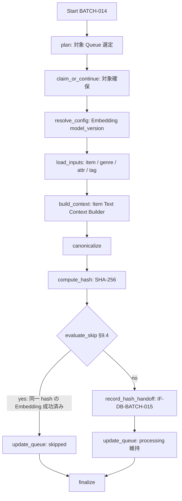

# BATCH-014 Embedding入力hash算出バッチ仕様書

## 1. ドキュメント情報

| 項目           | 内容                                     |
| -------------- | ---------------------------------------- |
| ドキュメントID | `BATCH-014`                              |
| ドキュメント名 | Embedding入力hash算出バッチ仕様書        |
| 対象システム   | Gift Recommendation Service / batch      |
| MVP対象        | `○`                                      |
| 作成日         | 2026-07-19                               |
| 更新日         | 2026-07-20                               |

---

## 2. 概要

BATCH-014（Embedding入力hash算出Batch）は、商品メタデータ（`item` / genre / attribute / tag）から **Embedding 生成入力テキスト文脈**（`item_text_context`）を構築し、canonicalize → **`embedding_input_hash`**（SHA-256・64 hex）を算出する Batch である。

算出結果は後続 **BATCH-015（Item Embedding生成）** の再生成判定・冪等キー構成要素となる。本 Batch は Embedding 生成（OpenAI Embedding 呼び出し）や `item_embedding` への物理書込は行わない。

本 Batch は次を **行わない**。

| 対象 | 理由 |
| ---- | ---- |
| `item_embedding` 行の INSERT / UPSERT（`embedding_input_hash` / `embedding_vector` 含む） | **BATCH-015** / **IF-VEC-BATCH-001**（`item_embedding_テーブル定義書` §5.8） |
| Embedding 生成ロジック呼出（OpenAI Embedding Client） | **BATCH-015** / MOD-BATCH-036 |
| Feature 正規化・`item_feature` 更新 | **BATCH-013** / **IF-DB-BATCH-014** |
| Queue 初回 INSERT | **BATCH-009** / **IF-DB-BATCH-010** |
| Feature 入力 hash | **BATCH-011** |

### 2.1 IF 対応（Human 注意：Batch ID と IF 番号）

| IF ID | 名称 | 担当 Batch | 本 Batch での利用 |
| ----- | ---- | ---------- | ----------------- |
| **IF-DB-BATCH-015** | Embedding入力hash保存 | **BATCH-014** | **本 Batch の hash 算出・パイプライン確定 I/F** |
| IF-DB-BATCH-014 | Feature正規化結果保存 | **BATCH-013** | **利用しない**（**混同禁止**） |
| IF-VEC-BATCH-001 | Item Embedding保存 | BATCH-015 | 利用しない（後続） |

> **警告**: `IF-DB-BATCH-014` は **Feature 正規化結果保存**（BATCH-013）用である。本 Batch（BATCH-014）の IF は **`IF-DB-BATCH-015`** である。Batch ID と IF 番号は一致しない（+1 ズレ）。

### 2.2 IF-DB-BATCH-015 の物理書込解釈（確定・E2 更新）

| 観点 | 方針 |
| ---- | ---- |
| hash 算出主体 | **BATCH-014**（本仕様） |
| 中間永続テーブル | **`item_embedding_input`**（`item_embedding_input_テーブル定義書` / migration D17）。本 Batch が Upsert する |
| `item_embedding.embedding_input_hash` 列への書込 | **BATCH-015** が `item_embedding` Upsert するときに同一値を載せる（`item_embedding_テーブル定義書` §5.2 / §5.8 / §12.2） |
| Queue 行への hash 列 | **持たない**（`item_generation_queue_テーブル定義書` §5.1。継承） |
| `item_text_context` | **canonicalize 済みテキストを `item_embedding_input.item_text_context` に永続化**（Embedding 入力に必須） |
| 本 Batch の「保存」 | 算出した `embedding_input_hash` / `item_text_context` を **`item_embedding_input` へ永続化**し、後続 BATCH-015 が DB 参照する。scaffold 段階は in-memory でもよいが、本実装では永続テーブルを正とする |

> **履歴:** 縦串確定時は「専用テーブルなし・handoff」だった。E2 Human 確定（Epic #1561 / Task #1568）により **中間永続化へ更新**した。最終派生列の書込主体（BATCH-015）と Queue 非保持は変更しない。

識別子 Epic は **`[Epic]BATCH-014:Embedding入力hash算出Batch`（#1467）** を親とする。先行 BATCH-013（#1455 / PR #1466）を前提とする。縦串は **仕様整備 → 実装 → UT → Epic PR（develop）**。

---

## 3. 目的

| No | 目的 |
| -: | ---- |
| 1 | BATCH-013 後続の Queue 行（`generation_type = embedding`、または semantic/feature パイプラインが正規化まで到達した継続行）を対象に Embedding 入力を組み立てる |
| 2 | Config Version Resolver（MOD-RECO-003）で Embedding `model_version_id`（`model_type = embedding` / `is_current`）を解決する |
| 3 | `item_text_context` を構築し canonicalize する（§9） |
| 4 | SHA-256 で `embedding_input_hash`（64 hex）を算出する（**IF-DB-BATCH-015**） |
| 5 | 入力不変かつ後続 skip 可能な場合は Queue を `skipped` とする（§9.4） |
| 6 | 失敗時は Queue を `failed` とし、`GRS-BAT-*` 等を記録する |

---

## 4. バッチ基本情報

| 項目           | 内容 |
| -------------- | ---- |
| Batch ID       | `BATCH-014` |
| Batch名        | Embedding入力hash算出Batch |
| 処理種別       | 入力文脈構築 + hash 算出 + Queue 状態更新 |
| 実行基盤       | GitHub Actions。**独立子 workflow `batch-embedding-input-hash.yml`（`batch-embedding-input-hash*.yml`）を正**とする（§18.1 No.7。BATCH-011 / 013 同型）。親 `batch-item-meaning-generation.yml` 全体改修は本 Epic 外 |
| 実装言語       | Python（`apps/batch`） |
| 起動方式       | BATCH-013 後続 / `workflow_dispatch` / `retry-failed` |
| 実行頻度       | meaning-generation チェーン内 |
| 冪等キー（物理） | `item_id` + `model_version_id`（Embedding）+ `embedding_input_hash`（`item_embedding_テーブル定義書` §7） |
| 先行Batch      | `BATCH-013`（必須） |
| 後続Batch      | `BATCH-015`（必須） |
| MVP対象        | `○` |
| Contract Gate  | **不要** |

実装パス想定: `apps/batch/src/batch/application/embedding_input_hash/**`。

### 4.1 モジュール対応

| モジュール | 責務 | 区分 |
| ---------- | ---- | ---- |
| Item Text Context Builder | `item_text_context` 構築（商品名・説明・genre・attribute・tag をテキスト統合） | **MOD-BATCH-035**（モジュール一覧） |
| Embedding Input Hash Calculator | canonicalize + SHA-256 | 一覧モジュール（MOD-ID 未採番。BATCH-011 同型） |
| Config Version Resolver | Embedding `model_version_id` 解決 | **MOD-RECO-003** |
| Error Handler / Batch Logger | 失敗・Run / Phase ログ | 共通 |

---

## 5. 実行条件

### 5.1 トリガー

| トリガー | 利用有無 | 条件 | 備考 |
| -------- | -------- | ---- | ---- |
| schedule | `false` | — | 独立 cron なし（§18.1 No.7） |
| workflow_dispatch | `true` | 手動・再実行 | |
| 先行Batch完了 | `true`（運用上） | BATCH-013 後続 / `workflow_call` | 親チェーン全体改修は外 |
| retry-failed | `true` | `failed` 行の再実行 | |

### 5.2 実行前提

- BATCH-013 により対象 `item_id` の Feature 正規化・`item_meaning` が到達可能であること（主経路）
- 対象 Queue が消化可能であること（§9.1）
- `item` / genre / attribute / tag が参照可能であること
- Embedding `model_version`（`model_type = embedding` / `is_current`）が解決可能であること
- Database へ接続可能であること
- 同時多重起動は `GRS-BAT-003` で拒否する

---

## 6. 入力

### 6.1 入力データ

| 入力 | 種別 | 必須 | 用途 |
| ---- | ---- | ---- | ---- |
| `item_generation_queue` | DB | `true` | 消化対象・trace |
| `item` | DB | `true` | 名称・caption・catchcopy・genre 等 |
| genre / attribute / tag | DB | `false` | 名称・属性・タグ |
| `model_version`（Embedding） | 解決 | `true` | `model_version_id` / 後続キー |
| `embedding_source_version` | 解決（batch 層） | `true` | 入力構築ルール version（DB 物理列なし。§18.1 No.5） |
| 実行 plan / config | 設定 | `true` | 件数上限・source（§6.3） |

### 6.2 外部API

| API | 利用有無 |
| --- | -------- |
| External AI / OpenAI Embedding | **なし**（本 Batch は決定論的 hash。Embedding 生成は BATCH-015） |

### 6.3 環境変数（名称のみ）

| 環境変数名 | 必須 | 用途 | secret区分 |
| ---------- | ---- | ---- | ---------- |
| `DATABASE_URL` | `true` | 読取・Queue 更新 | secret |
| `BATCH_EMBEDDING_INPUT_HASH_MAX_ITEMS` | `false` | 件数上限 | 非secret可 |
| `BATCH_EMBEDDING_INPUT_HASH_SOURCE` | `false` | `item.source`（既定 `rakuten`） | 非secret可 |
| `BATCH_EMBEDDING_INPUT_HASH_QUEUE_BATCH_SIZE` | `false` | claim / 処理単位 | 非secret可 |

---

## 7. 出力

### 7.1 出力データ

| 出力 | 正本区分 | 備考 |
| ---- | -------- | ---- |
| `embedding_input_hash` | 生成入力管理 | SHA-256 64 hex。物理列書込は BATCH-015（§2.2） |
| `item_text_context` | 中間表現 | `item_embedding_input.item_text_context` に永続化。canonicalize 入力 |
| `item_generation_queue` | 処理制御 | status / タイムスタンプ更新 |
| `batch_run_log` / `phase_log` / `error_log` | 運用 | |
| `item` / genre / attribute / tag | — | **書込しない** |
| `item_embedding` | — | **書込しない**（BATCH-015） |

### 7.2 後続への引き渡し

| 後続 | 引き渡し | 条件 |
| ---- | -------- | ---- |
| BATCH-015 | `embedding_input_hash` + `item_text_context` / `item_id` + `model_version_id` | hash 算出成功 |
| BATCH-017 | ログ・件数 | Run 集計 |

---

## 8. 処理フロー

### 8.1 全体フロー



### 8.2 処理ステップ（Phase）

| No | Phase | 処理 | 失敗時 |
| -: | ----- | ---- | ------ |
| 1 | `plan` | 対象 Queue 一覧 | `GRS-BAT-*` |
| 2 | `claim_or_continue` | queued→processing、または processing 継続 | 競合時 skip |
| 3 | `resolve_config` | Embedding `model_version_id`（`model_type = embedding` / `is_current`）/ `embedding_source_version` | `GRS-CFG-*` → failed |
| 4 | `load_inputs` | item / genre / attribute / tag | `GRS-DB-*` / `GRS-VAL-*` → failed |
| 5 | `build_context` | `item_text_context` 構築 | `GRS-VAL-*` / `GRS-BAT-*` |
| 6 | `compute_hash` | canonicalize + SHA-256 | `GRS-BAT-*` |
| 7 | `evaluate_skip` | 今回 hash + Embedding model version で §9.4 判定 | `GRS-DB-*` / `GRS-CFG-*` |
| 8 | `record_hash_handoff` | IF-DB-BATCH-015（`item_embedding_input` Upsert）。skip 時は省略可 | `GRS-DB-*` |
| 9 | `update_queue` | status 更新（skipped / processing 維持 / failed） | `GRS-DB-*` |
| 10 | `finalize` | 集計。部分成功は `GRS-BAT-002` | |

処理単位は **`item_generation_queue_id`**。

---

## 9. 判定・算出ロジック

### 9.1 Queue 対象

| 条件 | 処理 |
| ---- | ---- |
| `generation_type = embedding` かつ `queue_status = queued`（副経路） | **対象**（BATCH-009 が embedding 登録した場合） |
| `generation_type = semantic` / `feature` かつ Feature 正規化まで到達した継続行（`processing`） | **主経路**（§18.1 No.8。BATCH-013 後） |
| `queue_status = succeeded` / `skipped` / `failed` | 対象外（retry は failed→queued 後） |

> `item_generation_queue_テーブル定義書` §5.2 / §12.4 に基づき、`embedding` は「BATCH-014 → BATCH-015」で消化する。二重 processing は禁止（`GRS-BAT-003`）。

### 9.2 Embedding 入力に含める項目（MVP）

MVP の `embedding_source_type` は **`item_text_context` 固定**であり、Semantic Concept は文脈に含めない（`item_embedding_テーブル定義書` §5.5 / §11.1）。

| 項目 | 含めるか |
| ---- | -------- |
| itemName / catchcopy / itemCaption | ○ |
| genreId / genreName | ○ |
| attribute / tag | ○ |
| semantic concept | **×**（MVP。将来 `item_text_with_semantic` で拡張） |
| reviewAverage / reviewCount / price / rank / imageUrl / availability / itemUrl | ×（`バッチ処理一覧` §6.3 再生成除外） |

> 含める項目の最終的な範囲・整形（区切り・正規化）は実装 Task で確定する（§18.2 No.2）。以下 §9.2.1 は確定前の**実装 Task 向け推奨**であり、実装 Task で最終確定する。

#### 9.2.1 整形ルール推奨（実装 Task 確定前提）

hash 決定論性は §9.3 の構造化 JSON + canonicalize で担保済み。以下は「空文字 vs null」「Unicode 正規化形式」など環境差で hash が揺れうる細目の**推奨たたき台**であり、実装 Task の acceptance で確定する。

| 観点 | 推奨 |
| ---- | ---- |
| 含有項目 | §9.2 の ○ 項目に固定（`item_id` / `item_name` / `catchcopy` / `item_caption` / `genre_id` / `genre_name` / `attributes[]` / `tags[]` / `embedding_source_type` / `embedding_source_version`） |
| 文字列正規化 | `trim` + Unicode 正規化 `NFKC` + 連続空白の単一化 |
| null / 空 | `null` と空文字（trim 後空）は同一扱いで `null` に正規化 |
| 配列（attributes / tags） | 要素 trim → 重複除去 → 昇順ソート → 空配列は `[]` |
| キー順序 | canonical JSON でキー昇順（§9.3 準拠） |
| 除外項目 | price / review / rank / imageUrl 等は payload に載せない（§9.2 準拠） |

### 9.3 context / canonicalize / hash

```text
item_text_context（構造化された入力表現）
  → canonicalize（キーソート・文字列 trim・配列ソート・null 正規化）
  → SHA-256（UTF-8）
  → embedding_input_hash（小文字 hex 64 文字）
```

context 例（MVP・構造化表現）:

```json
{
  "item_id": "item_001",
  "item_name": "高級ハンドクリーム",
  "catchcopy": "上品で落ち着いた香り",
  "item_caption": "ギフトに適した保湿クリーム",
  "genre_id": "100371",
  "genre_name": "美容・コスメ",
  "attributes": ["hand_care", "fragrance"],
  "tags": [],
  "embedding_source_type": "item_text_context",
  "embedding_source_version": "v1"
}
```

`embedding_source_type` / `embedding_source_version` を hash 入力に含めることで、入力構築ルール変更時に hash が変わり再生成が起動する（`item_embedding_テーブル定義書` §8.4）。

### 9.4 skip

hash 算出後に判定する。Queue を `skipped` にするのは **同一入力の Embedding が生成済み**な場合に限る（`item_embedding_テーブル定義書` §12.5）。

| 条件 | 動作 |
| ---- | ---- |
| 同一 `item_id` + 現行 Embedding `model_version_id` + **今回算出** `embedding_input_hash` で、`item_embedding` の生成成功行が存在する | Queue → **`skipped`**（`completed_at`）。BATCH-015 も不要。handoff は省略可 |
| 上記以外（Embedding 未生成・model version 不一致・hash 変化） | hash / context を handoff し、Queue は **`processing` 維持**（後続 BATCH-015 へ） |

#### 9.4.1 判定キー・参照

| 項目 | 方針 |
| ---- | ---- |
| 判定タイミング | `compute_hash` の**後**（今回 hash が必要） |
| 参照先 | `item_embedding`（**SELECT のみ**。本 Batch は書込しない） |
| `model_version_id` | 現行 Embedding version を Config / Resolver（MOD-RECO-003）で解決（`model_type = embedding` / `is_current`） |
| 成功定義 | `item_id` + `model_version_id` + `embedding_input_hash` の一致行が存在し、`embedding_vector` が有効 |
| stub | **しない** |

#### 9.4.2 BATCH 間の役割

| Batch | skip の意味 |
| ----- | ----------- |
| **BATCH-014（本節）** | 現行入力でも Embedding 生成が完了済み → Queue 終端（`skipped`） |
| **BATCH-015** | 同一 3 列キーの Embedding 成功済み → Embedding 生成のみ skip（`item_embedding_テーブル定義書` §12.5） |

---

## 10. DB更新

| リソース | 操作 | IF | 備考 |
| -------- | ---- | -- | ---- |
| hash / context handoff | 算出確定 | **IF-DB-BATCH-015** | §2.2。`item_embedding_input` 永続化。§9.4 skip 時は省略可 |
| `item_generation_queue` | UPDATE | — | claim / skip / failed / processing 維持 |
| `item_embedding` | SELECT | — | §9.4 skip 判定のみ。**書込禁止**（BATCH-015） |
| `item` / genre / attribute / tag | SELECT | — | 更新しない |

#### 禁止操作

- IF-DB-BATCH-010 相当の Queue INSERT
- IF-DB-BATCH-014 相当の `item_feature` / `item_meaning` 更新（BATCH-013）
- IF-VEC-BATCH-001 相当の `item_embedding` Upsert（BATCH-015）
- `generation_type` の変更

---

## 11. 冪等性・再実行性

| 観点 | 方針 |
| ---- | ---- |
| hash 冪等 | 同一入力（同一 `item_text_context` / source version）→ 同一 `embedding_input_hash` |
| 物理冪等キー | `item_id` + `model_version_id` + `embedding_input_hash`（`item_embedding` UNIQUE。§18.1 No.4） |
| Queue | 楽観的 claim / processing 二重禁止 |
| 再実行 | `failed` → retry-failed で再処理 |
| rollback | 自動 rollback なし |

---

## 12. 状態管理

| 結果 | `queue_status` | 備考 |
| ---- | -------------- | ---- |
| claim | `processing` | started_at |
| skip | `skipped` | §9.4（同一 hash の Embedding 生成済み） |
| 失敗 | `failed` | `GRS-BAT-*` 等 |
| hash 成功（継続） | **`processing` 維持** | BATCH-015 へ |

---

## 13. エラー・リトライ

| エラー | Code | 備考 |
| ------ | ---- | ---- |
| Embedding入力hash算出失敗 | `GRS-BAT-*` | 方針書 § |
| 入力検証 | `GRS-VAL-*` | |
| Config / Model Version | `GRS-CFG-*` | |
| DB | `GRS-DB-*` | |
| 部分成功 | `GRS-BAT-002` | |
| 多重起動 | `GRS-BAT-003` | |

---

## 14. ログ・監視

| 種別 | 内容 |
| ---- | ---- |
| batch_run_log / phase_log | Run・Phase。Phase 例: `embedding_input_hash_computed` |
| error_log | code / queue_id / item_id |
| メトリクス | planned / hashed / skipped / failed |

`embedding_input_hash` はログに全文を出さず、先頭数文字 + 省略可。`item_text_context` の商品全文ダンプはログに出さない。

---

## 15. セキュリティ

| 観点 | 方針 |
| ---- | ---- |
| secret | DB 認証情報は Secrets / `.env` のみ |
| ログ | 接続文字列・商品全文ダンプ禁止 |
| LLM secret | 不要（Embedding 生成は BATCH-015） |

---

## 16. テスト観点

| No | 観点 | 種別 |
| --: | ---- | ---- |
| 1 | 正常系 context→hash（64 hex） | unit |
| 2 | 入力同一 → hash 同一 | unit |
| 3 | 除外項目（price/review 等）変更でも hash 不変 | unit |
| 4 | source version 変更で hash 変化 | unit |
| 5 | IF 境界: item_embedding / item_feature 非更新、Queue INSERT なし | unit / review |
| 6 | IF-DB-BATCH-014 非使用 | review |
| 7 | Queue フィルタ（embedding + 継続経路） | unit |
| 8 | 失敗 `GRS-BAT-*` → failed | unit |
| 9 | 部分成功 `GRS-BAT-002` | unit |
| 10 | secret 非含有 | review / unit |
| 11 | BATCH-013 / 015 境界 | review |
| 12 | skip: 同一 3 列キーの Embedding 生成済み → Queue `skipped` | unit |
| 13 | skip 不成立（未生成 / model version 不一致 / hash 変化）→ handoff + processing 維持 | unit |

---

## 17. 変更管理

| 日付 | 変更内容 | 関連 |
| ---- | -------- | ---- |
| 2026-07-19 | 初版作成 | Epic #1467 / Task #1468 |
| 2026-07-20 | §18.2 残未決の推奨案反映（No.1 独立 workflow 完結方針の明記 / No.2 整形ルール推奨 §9.2.1 追加） | Task #1468 |

---

## 18. 未決事項・決定事項

### 18.1 採用方針

| No | 論点 | 内容 | 状態 |
| --: | ---- | ---- | ---- |
| 1 | IF 番号 | **IF-DB-BATCH-015 = BATCH-014**。IF-DB-BATCH-014 = BATCH-013（混同禁止） | **確定** |
| 2 | 物理書込 | 算出=014、`item_embedding_input` 中間永続=014、`item_embedding.embedding_input_hash` 列書込=015。Queue に hash 列なし。BATCH-014 は `item_embedding` へ DML しない | **確定**（§2.2 / E2 #1568） |
| 3 | hash アルゴリズム | SHA-256、小文字 hex 64 | **確定**（`item_embedding` §10 CHECK） |
| 4 | 冪等キー | 物理 UNIQUE は `item_id` + `model_version_id` + `embedding_input_hash`（3 列）。`embedding_source_version` は Queue トリガー扱い（DB 物理列なし） | **確定**（`item_embedding` §8.4 / HR #516） |
| 5 | MVP 入力 | `embedding_source_type = item_text_context` 固定。Semantic Concept 非包含 | **確定**（`item_embedding` §5.5 / §11.1） |
| 6 | Contract Gate | 不要 | **確定** |
| 7 | 子 workflow | 独立 YAML `batch-embedding-input-hash.yml`。cron なし。親全体改修は外 | **確定**（BATCH-011 / 013 前例） |
| 8 | 主経路 Queue | embedding（副経路）+ semantic/feature 継続（主経路） | **確定候補**（実装で確定可） |
| 9 | skip 判定 | **本番実装（stub 不採用）**。同一 3 列キーの Embedding 生成済みで `skipped`（§9.4） | **確定** |
| 10 | config 解決 | MOD-RECO-003 で `model_type = embedding` / `is_current` を解決 | **確定** |
| 11 | config キー | `BATCH_EMBEDDING_INPUT_HASH_*` | **確定** |
| 12 | hash calculator MOD-ID | 未採番のまま §4.1 に記述（BATCH-011 同型運用） | **確定** |

### 18.2 残未決（Human）

| No | 事項 |
| -: | ---- |
| 1 | 親 meaning-generation からの `workflow_call` タイミング（Epic 外）。本 Epic は独立子 workflow（`workflow_dispatch` / `retry-failed` / BATCH-013 後続）で完結させ、接続確定は meaning-generation チェーン統合 Task に委ねる（BATCH-011 / 013 と同方針） |
| 2 | `item_text_context` に含める具体項目範囲・整形ルール（実装 Task で詳細化）。推奨たたき台は §9.2.1 参照 |

---

## 19. 関連資料

| 種別 | パス |
| ---- | ---- |
| 一覧 | `docs/05_アプリケーション設計/アプリ/batch/バッチ処理一覧.md` |
| 方針 | `docs/05_アプリケーション設計/アプリ/batch/バッチ設計方針書.md` |
| 依存 | `docs/05_アプリケーション設計/アプリ/batch/バッチ依存関係図.md` |
| IF | `docs/05_アプリケーション設計/アプリ/インターフェース一覧.md` |
| モジュール | `docs/05_アプリケーション設計/アプリ/モジュール一覧.md`（MOD-BATCH-035 / MOD-RECO-003） |
| DB | `item_embedding` / `item_generation_queue` / `model_version` テーブル定義書 |
| 先行 | `BATCH-011_Feature入力hash算出バッチ仕様書.md`（hash 算出枠組み踏襲元） / `BATCH-013_Feature正規化バッチ仕様書.md` |

---

## 20. レビュー観点

- BATCH-014 と IF-DB-BATCH-015 が対応している
- IF-DB-BATCH-014（BATCH-013）と混同していない
- `item_embedding` 書込が BATCH-015 側であり、本 Batch は SELECT のみ
- BATCH-015（OpenAI Embedding 生成）/ apps/reco が混入していない
- MVP は `embedding_source_type = item_text_context` 固定・Semantic Concept 非包含
- §18 で確定 / 残未決（Human）が区別されている
- §9.4 skip が本番実装（stub 不採用）である
- secret 非含有
- PR target が親 Epic Branch

---

## 21. 備考

### 21.1 Out of scope

| 対象 | 理由 |
| ---- | ---- |
| BATCH-015 Item Embedding 生成 | 後続 Epic |
| BATCH-013 Feature 正規化 | 先行 |
| 実装・workflow・UT | 後続 Task |
| migration | 既存定義参照 |

### 21.2 データフロー（MVP）

```text
BATCH-013 → item_feature.normalized + item_meaning + Queue processing（継続）
BATCH-014 → item_text_context / embedding_input_hash（item_embedding_input 永続）
          → Queue processing 維持
BATCH-015 → item_embedding Upsert（embedding_input_hash 列に載せる）
```
