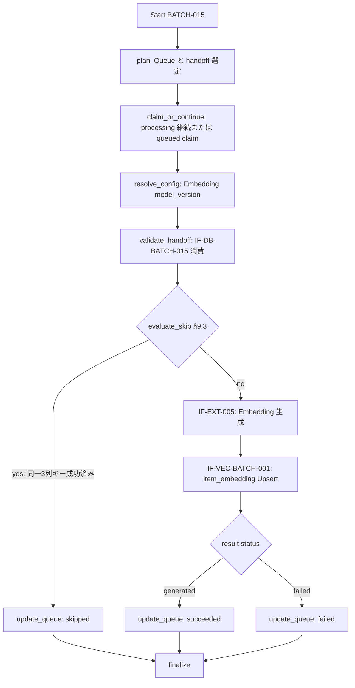

# BATCH-015 Item Embedding生成バッチ仕様書

## 1. ドキュメント情報

| 項目           | 内容                                     |
| -------------- | ---------------------------------------- |
| ドキュメントID | `BATCH-015`                              |
| ドキュメント名 | Item Embedding生成バッチ仕様書           |
| 対象システム   | Gift Recommendation Service / batch      |
| MVP対象        | `○`                                      |
| 作成日         | 2026-07-20                               |
| 更新日         | 2026-07-20                               |

---

## 2. 概要

BATCH-015（Item Embedding生成Batch）は、先行 **BATCH-014** が確定した **handoff**（`item_text_context` / `embedding_input_hash`）を受け取り、**IF-EXT-005**（Embedding API）で Embedding ベクトルを生成し、**IF-VEC-BATCH-001** で `item_embedding` へ Upsert する Batch である。

正本区分は **推薦用派生データ / Retrieval 用ベクトル** である。Online 推薦（reco）は本テーブルを **SELECT のみ**、更新は batch（本 Batch）のみが行う（`item_embedding_テーブル定義書` §5.8）。

本 Batch は次を **行わない**。

| 対象 | 理由 |
| ---- | ---- |
| `embedding_input_hash` / `item_text_context` の再算出 | **BATCH-014** / **IF-DB-BATCH-015**（handoff 消費のみ。**混同禁止**） |
| 分布メトリクス集計・保存 | **BATCH-016** / **IF-DB-BATCH-016**（対象外） |
| Queue 初回 INSERT | **BATCH-009** / **IF-DB-BATCH-010** |
| Feature / Semantic 生成・正規化 | **BATCH-010〜013** |
| `item` 業務列の Upsert | **BATCH-007** |
| reco Online 推薦パイプライン起動 | **MOD-RECO-001** |

### 2.1 IF 対応（Human 注意：Batch ID と IF 番号）

| IF ID | 名称 | 担当 Batch | 本 Batch での利用 |
| ----- | ---- | ---------- | ----------------- |
| **IF-VEC-BATCH-001** | Item Embedding保存 | **BATCH-015** | **本 Batch の物理書込 I/F**（`item_embedding` Upsert） |
| **IF-EXT-005** | Embedding API呼び出し | **BATCH-015** | **本 Batch の外部呼出 I/F**（OpenAI Embedding Client） |
| **IF-DB-BATCH-015** | Embedding入力hash保存 | **BATCH-014** | **読取・検証のみ**。hash を再算出しない（**混同禁止**） |
| IF-DB-BATCH-016 | 分布メトリクス保存 | BATCH-016 | **利用しない**（対象外） |

> **警告**: `IF-DB-BATCH-015` は **BATCH-014** の Embedding 入力 hash 算出・handoff 用である。本 Batch（BATCH-015）の物理書込 I/F は **`IF-VEC-BATCH-001`** である。Batch ID と IF 番号は一致しない。
>
> **警告**: `MOD-BATCH-015`（Existing Item Recheck Planner）と Batch ID **`BATCH-015`** を混同してはならない。本 Batch の実装モジュールは **MOD-BATCH-036** / **MOD-BATCH-037** である。

### 2.2 IF-DB-BATCH-015 handoff 消費方針（確定）

| 観点 | 方針 |
| ---- | ---- |
| hash / context 算出主体 | **BATCH-014**（`BATCH-014_Embedding入力hash算出バッチ仕様書` §2.2） |
| 本 Batch の扱い | handoff を **検証して消費**し、`item_embedding.embedding_input_hash` 列へ同一値を載せる |
| 再算出 | **禁止**。再算出が必要なら BATCH-014 を再実行する |
| 専用テーブル | なし（`item_text_context` は物理化しない中間表現） |
| Queue 行への hash 列 | 持たない（`item_generation_queue_テーブル定義書` §5.1） |

識別子 Epic は **`[Epic]BATCH-015:Item Embedding生成Batch`（#1479）** を親とする。先行 BATCH-014（#1467 / PR #1477 develop merge 済み）および `item_embedding` テーブル定義（#516）を前提とする。縦串は **仕様整備 → 実装 → UT → Epic PR（develop）**。

---

## 3. 目的

| No | 目的 |
| -: | ---- |
| 1 | BATCH-014 成功後の Embedding 生成対象 Queue を消化する |
| 2 | Config Version Resolver（MOD-RECO-003）で Embedding `model_version_id`（`model_type = embedding` / `is_current`）を解決する |
| 3 | BATCH-014 handoff（`item_text_context` / `embedding_input_hash`）を検証する（**IF-DB-BATCH-015 消費**） |
| 4 | **IF-EXT-005** 経由で Embedding を生成する（MVP 初版は **scaffold-first**。§18.1） |
| 5 | **IF-VEC-BATCH-001** で `item_embedding` へ冪等 Upsert する |
| 6 | 同一 3 列冪等キーの成功行がある場合は Embedding 生成のみ skip する |
| 7 | semantic 一連 / embedding 経路の **Queue 終端 `succeeded`** を担う（§9.1 / §12） |

---

## 4. バッチ基本情報

| 項目           | 内容 |
| -------------- | ---- |
| Batch ID       | `BATCH-015` |
| Batch名        | Item Embedding生成Batch |
| 処理種別       | Queue 消化 + Embedding 生成 + 派生データ Upsert + Queue 終端 |
| 実行基盤       | GitHub Actions。**独立子 workflow `batch-item-embedding.yml`（`batch-item-embedding*.yml`）を正**とする（§18.1）。親 `batch-item-meaning-generation.yml` 全体改修は本 Epic 外 |
| 実装言語       | Python（`apps/batch`） |
| 起動方式       | BATCH-014 後続 / `workflow_dispatch` / `retry-failed` |
| 実行頻度       | meaning-generation チェーン内 |
| 冪等キー（物理） | `item_id` + `model_version_id` + `embedding_input_hash`（`item_embedding` UNIQUE 3 列） |
| 先行Batch      | `BATCH-014`（必須） |
| 後続Batch      | `BATCH-016`（任意・別 Epic）/ `BATCH-017`（Run 集計） |
| MVP対象        | `○` |
| Contract Gate  | **不要**（HTTP API / OpenAPI を変更しない） |

実装パス想定: `apps/batch/src/batch/application/item_embedding/**`。

`Batch ID` は `BATCH-*` を使用する。処理構成上の分類 ID（`BT-*`）およびモジュール ID `MOD-BATCH-015`（Recheck）を本成果物の識別子と混同しない。

### 4.1 モジュール対応

| モジュール | 責務 | 区分 |
| ---------- | ---- | ---- |
| Item Embedding Generator | Embedding 生成オーケストレーション（入力検証・API 呼出・結果組立） | **MOD-BATCH-036** |
| Item Embedding Repository | `item_embedding` への Upsert / skip 判定 SELECT | **MOD-BATCH-037** |
| OpenAI Embedding Client | **IF-EXT-005** 実装（scaffold 時はスタブ） | 一覧モジュール（batch infrastructure） |
| External API Rate Limiter | Embedding API の rate / concurrency 制御 | 一覧モジュール |
| Config Version Resolver | Embedding `model_version_id` 解決 | **MOD-RECO-003** |
| Error Handler / Batch Logger | 失敗・Run / Phase / `api_call_log` | 共通 |

---

## 5. 実行条件

### 5.1 トリガー

| トリガー | 利用有無 | 条件 | 備考 |
| -------- | -------- | ---- | ---- |
| schedule | `false` | — | 独立 cron なし（§18.1） |
| workflow_dispatch | `true` | 手動・再実行 | |
| 先行Batch完了 | `true`（運用上） | BATCH-014 後続 / `workflow_call` | 親チェーン全体改修は外 |
| retry-failed | `true` | `failed` 行の再実行 | `batch-retry-failed-items.yml` |

### 5.2 実行前提

- BATCH-014 の handoff として、対象の `item_id`、`model_version_id`（Embedding）、`embedding_input_hash`、`item_text_context` が利用可能であること
- 対象 Queue が消化可能であること（§9.1）
- Embedding `model_version`（`model_type = embedding` / `is_current`）が解決可能であること
- `item_embedding` / `item_generation_queue` / `model_version` の DDL が利用可能であること（#516 等整備済み）。本 Epic での新規 migration 追加は out of scope
- Database へ接続可能であること
- 同時多重起動は `GRS-BAT-003` で拒否する
- MVP 初版 scaffold 時は `OPENAI_API_KEY` 実設定は不要（§18.1）。実 API 接続タイミング・本番設定値はフィジビリティ検証後に本仕様を更新（§18.2 No.2）

---

## 6. 入力

### 6.1 入力データ

| 入力 | 種別 | 必須 | 用途 |
| ---- | ---- | ---- | ---- |
| `item_generation_queue` | DB | `true` | 消化対象・trace・終端更新 |
| BATCH-014 handoff | in-process / 実行コンテキスト | `true` | `item_text_context` / `embedding_input_hash` |
| `item_embedding`（参照） | DB | `false` | skip 判定（同一 3 列キー） |
| `model_version`（Embedding） | 解決 | `true` | `model_version_id` / 次元・モデル名 |
| `embedding_source_type` | 固定 | `true` | MVP は `item_text_context` |
| `embedding_source_version` | 解決（batch 層） | `false` | **DB 物理列なし**。再生成トリガーは Queue / hash 側（§18.1） |
| 実行 plan / config | 設定 | `true` | 件数上限・source（§6.4） |

### 6.2 hash handoff（IF-DB-BATCH-015 消費）

`embedding_input_hash` / `item_text_context` は BATCH-014 の算出結果を読み取り、検証して Embedding 入力および `item_embedding.embedding_input_hash` にそのまま載せる。

- 本 Batch および MOD-BATCH-036 は hash を **再算出しない**
- handoff 欠落・64 hex 形式不正・対象 `model_version_id` との不整合は `GRS-BAT-008`（または `GRS-VAL-*`）として当該 Queue を `failed` にする
- hash 再算出が必要な場合は **BATCH-014 の再実行**を行う

### 6.3 外部API（IF-EXT-005）

| API | 利用有無 | 用途 | 備考 |
| --- | -------- | ---- | ---- |
| Embedding API（OpenAI 等） | **条件付き** | `item_text_context` → embedding vector | **IF-EXT-005**。MVP 初版は **scaffold-first**（スタブベクトル）。実呼出タイミング・本番設定値はフィジビリティ検証後に本仕様更新（§18.1 No.8 / §18.2 No.2） |

MVP 現行モデル（`item_embedding_テーブル定義書` §17.1 No.3 **確定**）:

| 項目 | 値 |
| ---- | -- |
| モデル名 | `text-embedding-3-small` |
| 次元 | `1536`（`vector(1536)`） |
| `embedding_source_type` | `item_text_context` 固定 |

### 6.4 環境変数（名称のみ）

| 環境変数名 | 必須 | 用途 | secret区分 |
| ---------- | ---- | ---- | ---------- |
| `DATABASE_URL` | `true` | 読取・Upsert・Queue 更新 | secret |
| `BATCH_ITEM_EMBEDDING_MAX_ITEMS` | `false` | 1 Run 件数上限 | 非secret可 |
| `BATCH_ITEM_EMBEDDING_SOURCE` | `false` | `item.source`（既定 `rakuten`） | 非secret可 |
| `BATCH_ITEM_EMBEDDING_QUEUE_BATCH_SIZE` | `false` | claim / 処理単位 | 非secret可 |
| `OPENAI_API_KEY` | 実 API 時のみ | Embedding API Client | secret。**Scaffold 時は不要** |

値・実キーは docs / ログ / fixture に記載しない。

---

## 7. 出力

### 7.1 出力データ

| 出力 | 正本区分 | 備考 |
| ---- | -------- | ---- |
| `item_embedding` | 派生 / Retrieval 正本 | **IF-VEC-BATCH-001** Upsert |
| `item_generation_queue` | 処理制御 | `succeeded` / `skipped` / `failed`（終端含む） |
| `batch_run_log` / `phase_log` / `error_log` / `api_call_log` | 運用 | Embedding 呼出監査は `api_call_log`（一覧 §） |
| `item` / genre / attribute / tag | — | **書込しない** |
| 分布メトリクス | — | **書込しない**（BATCH-016 / IF-DB-BATCH-016） |

### 7.2 後続への引き渡し

| 後続 | 引き渡し | 条件 |
| ---- | -------- | ---- |
| BATCH-016 | `item_embedding` SELECT（別 Epic） | Embedding 生成成功後（任意） |
| BATCH-017 | ログ・件数 | Run 集計 |
| reco Retrieval | `item_embedding` SELECT | Online は更新しない |

### 7.3 更新リソース

| リソース | 操作 | IF | 備考 |
| -------- | ---- | -- | ---- |
| `item_embedding` | UPSERT | **IF-VEC-BATCH-001** | §10 |
| `item_generation_queue` | UPDATE | — | §10 / §12 |
| `api_call_log` | INSERT | — | IF-EXT-005 呼出監査（scaffold 時も成否・latency 記録可） |
| `item` / hash 専用テーブル | — | — | 更新しない / 専用テーブルなし |

---

## 8. 処理フロー

### 8.1 全体フロー



### 8.2 処理ステップ（Phase）

| No | Phase | 処理 | 失敗時 |
| -: | ----- | ---- | ------ |
| 1 | `plan` | Queue / BATCH-014 handoff の対象選定 | `GRS-BAT-*` |
| 2 | `claim_or_continue` | queued→processing、または processing 継続 | 競合時 skip |
| 3 | `resolve_config` | Embedding `model_version_id`（`model_type = embedding` / `is_current`） | `GRS-CFG-*` → failed |
| 4 | `validate_handoff` | `embedding_input_hash` / `item_text_context` 検証（再算出禁止） | `GRS-BAT-008` / `GRS-VAL-*` → failed |
| 5 | `evaluate_skip` | §9.3 の 3 列キー skip 判定 | `GRS-DB-*` |
| 6 | `generate_embedding` | **IF-EXT-005**（scaffold または実 API）+ `api_call_log` | `GRS-EXT-*` / `GRS-LLM-*` → failed |
| 7 | `upsert_embedding` | **IF-VEC-BATCH-001** Upsert | `GRS-DB-*` → failed |
| 8 | `update_queue` | `succeeded` / `skipped` / `failed` | `GRS-DB-*` |
| 9 | `finalize` | Run / Phase / Error 集計。部分成功は `GRS-BAT-002` | |

処理単位は **`item_generation_queue_id`**。

### 8.3 IF-EXT-005 呼出境界（確定）

| 観点 | 方針 |
| ---- | ---- |
| I/F | **IF-EXT-005** |
| 実装 | OpenAI Embedding Client（batch infrastructure）。Rate Limiter 経由 |
| HTTP | Embedding Provider への HTTPS（実 API 時）。Reco Hosting HTTP ではない |
| MVP 初版 | **scaffold-first**: 決定論的スタブベクトル（次元 1536）を返し、契約・ログ・Upsert 経路を検証する |
| 実 API | フィジビリティ検証後の切替 Task（§18.2 No.2）。`OPENAI_API_KEY` は Secrets のみ |
| ログ | ベクトル全文・入力全文・API key を記録しない。`api_call_log` は status / latency / model 名等のメタのみ |

### 8.4 IF-VEC-BATCH-001 書込境界（確定）

| 観点 | 方針 |
| ---- | ---- |
| I/F | **IF-VEC-BATCH-001** |
| テーブル | `item_embedding` |
| 操作 | INSERT / UPSERT（`item_embedding_テーブル定義書` §12.2） |
| 実行主体 | batch（BATCH-015）のみ。reco / api は禁止 |
| 載せる列 | `item_id` / `model_version_id` / `embedding_source_type` / `embedding_input_hash` / `embedding_vector` / `generated_at` |
| `embedding_source_version` | **物理列なし**（batch 層運用概念のみ） |

---

## 9. 判定・生成ロジック

### 9.1 Queue 対象と終端責務

| 条件 | 処理 |
| ---- | ---- |
| `generation_type = embedding` かつ `queue_status = processing`（BATCH-014 後） | **副経路の継続**。本 Batch で Upsert 後 **`succeeded`** |
| `generation_type = embedding` かつ `queue_status = queued` | claim 後に処理（BATCH-014 が未実行の場合は handoff 欠落で failed。通常は 014 先行） |
| `generation_type = semantic` / `feature` かつ Feature〜hash まで到達した継続行（`processing`） | **主経路**。本 Batch 完了でパイプライン終端 **`succeeded`** |
| `succeeded` / `skipped` / `failed` | 対象外。retry は別 workflow が `queued` へ戻す |

> `item_generation_queue_テーブル定義書` §5.5:
>
> - `semantic` → BATCH-010〜015 **一連完了後**に `succeeded`
> - `embedding` → BATCH-014〜015 完了後に `succeeded`
>
> **本 Batch が semantic 一連 / embedding 経路の終端 `succeeded` を担う**（BATCH-010〜014 は成功時 `processing` 維持または hash 段の skip 終端）。

二重 processing は禁止（`GRS-BAT-003`）。

### 9.2 MVP Embedding 生成

| 観点 | 方針 |
| ---- | ---- |
| 入力テキスト | BATCH-014 の `item_text_context`（canonicalize 済み表現を Embedding 入力に変換。詳細は実装 Task） |
| `embedding_source_type` | **`item_text_context` 固定**。Semantic Concept 非包含 |
| モデル | `text-embedding-3-small` / 1536 次元 |
| scaffold | スタブは次元・型契約を満たす固定または決定論的疑似ベクトル。実 OpenAI レスポンス形式に合わせる |
| Public API | `embedding_vector` は **非公開**（内部 Retrieval 専用） |

### 9.3 Embedding 生成 skip（確定）

`item_embedding_テーブル定義書` §12.5 / バッチ処理一覧 §6.3 / バッチ設計方針書 §13.7 に従う。

```text
同一 item_id
かつ 同一 model_version_id（現行 Embedding）
かつ 同一 embedding_input_hash（BATCH-014 handoff）
の item_embedding 成功行が存在する
→ Embedding 生成のみ skip → Queue を skipped（completed_at）
```

| 条件 | 動作 |
| ---- | ---- |
| 上記 3 列キーの成功行あり（`embedding_vector` 有効） | API 呼出・Upsert 省略。Queue → **`skipped`** |
| 未生成 / model version 不一致 / hash 不一致 | 生成実行 → 成功時 Queue → **`succeeded`** |
| BATCH-014 が既に「Embedding 生成済み」で Queue `skipped` した場合 | 本 Batch 到達前に終端済み（本 Batch 対象外） |

> 一覧 §6.3 の `embedding_source_version` は **運用トリガー**であり、DB 物理列はない。MVP は `embedding_source_type = item_text_context` 固定のため、入力同一性は `embedding_input_hash` に内包される（`item_embedding` §8.4 / §12.5）。

### 9.4 再生成しない変更（一覧 §6.3）

以下のみの変更では Embedding を再生成しない（hash 入力から除外済み前提。BATCH-014 正本）:

- reviewAverage / reviewCount のみ
- itemPrice のみ
- ranking_snapshot / rank のみ
- imageUrl / availability / itemUrl のみ

---

## 10. DB更新

### 10.1 `item_embedding` Upsert（IF-VEC-BATCH-001）

| テーブル | 操作 | 一意キー | 更新項目 |
| -------- | ---- | -------- | -------- |
| `item_embedding` | UPSERT | `item_id` + `model_version_id` + `embedding_input_hash` | `embedding_vector` / `embedding_source_type` / `generated_at` |

疑似 SQL は `item_embedding_テーブル定義書` §12.2 を正とする。

### 10.2 Queue 更新

| 結果 | `queue_status` | 備考 |
| ---- | -------------- | ---- |
| claim | `processing` | started_at |
| Embedding 生成 skip | `skipped` | §9.3。`completed_at` |
| Embedding 生成成功 | **`succeeded`** | **終端**。`completed_at`。semantic 一連 / embedding 経路 |
| 失敗 | `failed` | error_log / `completed_at` |

### 10.3 禁止操作

- IF-DB-BATCH-015 相当の hash **再算出**・専用テーブルへの書込
- IF-DB-BATCH-016 相当の分布メトリクス DML
- IF-DB-BATCH-010 相当の Queue INSERT
- `item_semantic` / `item_feature` / `item_meaning` の DML
- `generation_type` の変更
- OpenAPI / migration / generated の変更
- `embedding_vector` の Public API 露出

---

## 11. 冪等性・再実行性

| 観点 | 方針 |
| ---- | ---- |
| 物理冪等キー | `item_id` + `model_version_id` + `embedding_input_hash`（UNIQUE） |
| Upsert | 同一 3 列は上書き収束 |
| 履歴 | hash または model version が変われば **別行 INSERT** |
| Queue | 楽観的 claim / processing 二重禁止 |
| 再実行 | `failed` → retry-failed で再処理 |
| rollback | 自動 rollback なし |

---

## 12. 状態管理

| 操作 | 遷移 | 条件 |
| ---- | ---- | ---- |
| claim | `queued` → `processing` | embedding 副経路 |
| 継続 | `processing` → `processing` | 014 後の主経路・副経路 |
| skip | `processing` → `skipped` | §9.3 |
| 生成成功 | `processing` → **`succeeded`** | **本 Batch が終端** |
| 失敗 | `processing` → `failed` | `GRS-BAT-008` / `GRS-EXT-*` / `GRS-LLM-*` 等 |

`generation_type = semantic` の Queue は、BATCH-010〜014 成功時点では `succeeded` にせず、**本 Batch 完了で初めて `succeeded`** とする（Queue §5.5）。

---

## 13. エラー・リトライ

| エラー | Code | 備考 |
| ------ | ---- | ---- |
| Embedding 生成失敗 | `GRS-BAT-008`（内部 `GRS-LLM-*` / `GRS-EXT-*`） | Queue `failed`。scaffold 時はスタブ失敗経路の UT 用 |
| handoff / 入力検証 | `GRS-VAL-*` / `GRS-BAT-008` | 自動リトライしない。014 再実行 |
| Config / Model Version | `GRS-CFG-*` | Queue `failed` |
| DB / Upsert | `GRS-DB-*` | 一時障害のみ短時間リトライ検討 |
| 外部 API | `GRS-EXT-*` | timeout / 5xx。Rate Limit は待機・再試行。scaffold 時は非発火可 |
| 部分成功 | `GRS-BAT-002` | 失敗 Item のみ再実行 |
| 多重起動 | `GRS-BAT-003` | 起動拒否 |

Client 内の無制限自動リトライは行わない。上限超過後は Queue `failed` とし、`batch-retry-failed-items.yml` で再実行する。

---

## 14. ログ・監視

| 種別 | 内容 |
| ---- | ---- |
| `batch_run_log` / `phase_log` | Run・Phase。Phase 例: `item_embedding_generated` |
| `api_call_log` | IF-EXT-005 呼出の status / latency / model。**secret・ベクトル全文禁止** |
| `error_log` | code / queue_id / item_id |
| メトリクス | planned / generated / skipped / failed / api_call_count |

禁止ログ:

- `OPENAI_API_KEY` / Authorization / DB 接続文字列
- `embedding_vector` 全文
- `item_text_context` の商品全文ダンプ
- `embedding_input_hash` 全文（必要時は先頭数文字 + 省略）

---

## 15. セキュリティ・外部サービス利用

| 観点 | 方針 |
| ---- | ---- |
| secret | DB / Embedding API 認証情報は GitHub Secrets / local `.env` のみ。値を docs・ログ・fixture に書かない |
| Scaffold | 初版は `OPENAI_API_KEY` **不要** |
| 実 API | フィジビリティ検証後に Secrets / 本番設定値を確定（§18.2 No.2）。client 側へ key を渡さない |
| ベクトル | Public API 非公開。ログ全文禁止 |
| 権限 | `apps/batch` のみが `item_embedding` を書き込む |
| HTTP 公開 | Batch は HTTP API 化しない（Contract Gate 不要） |

---

## 16. テスト観点

| No | 観点 | 種別 |
| -: | ---- | ---- |
| 1 | handoff 消費: hash 再算出しない | unit |
| 2 | handoff 欠落 / 形式不正 → failed | unit |
| 3 | IF-VEC-BATCH-001 Upsert（3 列冪等） | unit / integration |
| 4 | 同一 3 列再実行で収束 | unit |
| 5 | skip: 成功行あり → API なし・Queue `skipped` | unit |
| 6 | 成功時 Queue `succeeded`（終端） | unit |
| 7 | IF-EXT-005 scaffold: 1536 次元スタブ | unit |
| 8 | `embedding_source_type = item_text_context` 固定 | unit |
| 9 | IF-DB-BATCH-015 / IF-DB-BATCH-016 非書込 | review / unit |
| 10 | MOD-BATCH-015（Recheck）と混同しない（モジュールは 036/037） | review |
| 11 | `api_call_log` に secret / ベクトル全文なし | review / unit |
| 12 | 部分成功 `GRS-BAT-002` | unit |
| 13 | 多重起動 `GRS-BAT-003` | unit |
| 14 | secret 非含有（docs / fixture） | review |

---

## 17. 変更管理

| 日付 | 変更内容 | 関連 |
| ---- | -------- | ---- |
| 2026-07-20 | 初版作成 | Epic #1479 / Task #1480 |
| 2026-07-20 | §18.2 推奨案を Human 採用。実 OpenAI 接続タイミング・本番設定値はフィジビリティ検証後に本仕様を更新 | Task #1480 |

---

## 18. 未決事項・決定事項

### 18.1 採用方針（確定）

| No | 論点 | 内容 | 状態 |
| -: | ---- | ---- | ---- |
| 1 | 物理書込 IF | **IF-VEC-BATCH-001 = BATCH-015**（`item_embedding` Upsert） | **確定** |
| 2 | 外部呼出 IF | **IF-EXT-005 = Embedding API** | **確定** |
| 3 | hash IF | **IF-DB-BATCH-015 = BATCH-014 handoff**。本 Batch は消費のみ・再算出禁止 | **確定** |
| 4 | 分布メトリクス IF | **IF-DB-BATCH-016 = BATCH-016**。本 Batch 対象外 | **確定** |
| 5 | 冪等キー | 物理 UNIQUE 3 列: `item_id` + `model_version_id` + `embedding_input_hash` | **確定**（`item_embedding` §7 / HR #516） |
| 6 | MVP モデル | `text-embedding-3-small` / `vector(1536)` / `embedding_source_type = item_text_context` | **確定**（`item_embedding` §17.1） |
| 7 | `embedding_source_version` | **DB 物理列なし**。Queue トリガー / hash 内包 | **確定**（`item_embedding` §17.1 No.2） |
| 8 | scaffold-first | MVP 初版は Embedding API **スタブ**をデフォルトとする。実 OpenAI 呼出タイミング・本番設定値（Secrets / コスト / Rate Limit 等）は **別途フィジビリティ検証後に本仕様を更新** | **確定**（Epic #1479 human_decision_points。BATCH-010 同型。2026-07-20 Human） |
| 9 | Queue 終端 | semantic 一連 / embedding 経路の **`succeeded` は本 Batch** | **確定**（Queue §5.5 / BATCH-010 §18.1 No.9） |
| 10 | 子 workflow | 独立 YAML **`batch-item-embedding.yml`（`batch-item-embedding*.yml`）**。cron なし。親全体改修は外 | **確定**（BATCH-011/013/014 前例） |
| 11 | Contract Gate | **不要** | **確定** |
| 12 | モジュール | **MOD-BATCH-036** / **MOD-BATCH-037**。`MOD-BATCH-015`（Recheck）と混同禁止 | **確定** |
| 13 | config キー | `BATCH_ITEM_EMBEDDING_*` | **確定**（件数上限など数値既定は §18.2 No.3。本番 OpenAI 関連値は §18.2 No.2） |
| 14 | config 解決 | MOD-RECO-003 で `model_type = embedding` / `is_current` | **確定** |
| 15 | 親 workflow 接続 | 本 Epic は独立子 workflow で完結。親 `batch-item-meaning-generation.yml` からの `workflow_call` 接続は meaning-generation チェーン統合 Task（BATCH-011/013/014 と同方針） | **確定**（2026-07-20 Human。§18.2 推奨案採用） |

### 18.2 後続確定事項（推奨案採用済み）

> 2026-07-20 Human: §18.2 記載の推奨案をすべて採用。詳細値・接続時期の確定タイミングのみ後続に残す。

| No | 事項 | 扱い | 状態 |
| -: | ---- | ---- | ---- |
| 1 | 親 `batch-item-meaning-generation.yml` からの `workflow_call` タイミング | §18.1 No.15。接続確定は meaning-generation チェーン統合 Task | **方針確定**（接続時期は統合 Task） |
| 2 | 実 OpenAI Embedding API 接続タイミング、および本番の具体設定値（環境変数 / Secrets / コスト / Rate Limit 等） | scaffold-first（§18.1 No.8）を維持。切替 Task 前提は変えない。**接続タイミングと本番設定値は別途進めるフィジビリティ検証の結果を踏まえ、本仕様を更新して確定する** | **方針確定**（数値・切替時期は検証後に本仕様更新） |
| 3 | `BATCH_ITEM_EMBEDDING_MAX_ITEMS` 等の件数上限既定値 | 実装 / workflow Task で確定 | **方針確定**（数値は実装 Task） |
| 4 | scaffold スタブベクトルの具体アルゴリズム（固定ゼロ近似 / hash 由来決定論 等） | 実装 Task で確定（次元 1536・型契約は §18.1） | **方針確定**（アルゴリズムは実装 Task） |
| 5 | `item_text_context` → Embedding API 入力文字列への最終シリアライズ詳細 | BATCH-014 §9.2.1 と整合する範囲で実装 Task が確定 | **方針確定**（詳細は実装 Task） |

---

## 19. 関連資料

| 種別 | パス |
| ---- | ---- |
| 一覧 | `docs/05_アプリケーション設計/アプリ/batch/バッチ処理一覧.md`（BATCH-015 / §6.3） |
| 方針 | `docs/05_アプリケーション設計/アプリ/batch/バッチ設計方針書.md`（§13.7） |
| 依存 | `docs/05_アプリケーション設計/アプリ/batch/バッチ依存関係図.md` |
| IF | `docs/05_アプリケーション設計/アプリ/インターフェース一覧.md`（IF-VEC-BATCH-001 / IF-EXT-005 / IF-DB-BATCH-015） |
| モジュール | `docs/05_アプリケーション設計/アプリ/モジュール一覧.md`（MOD-BATCH-036 / 037。MOD-BATCH-015 は Recheck） |
| DB | `item_embedding` / `item_generation_queue` / `model_version` テーブル定義書 |
| 先行 | `BATCH-014_Embedding入力hash算出バッチ仕様書.md`（handoff・IF-DB-BATCH-015） |
| 踏襲 | `BATCH-010_Item Semantic生成バッチ仕様書.md`（scaffold / Queue） / `BATCH-012_Item Feature生成バッチ仕様書.md`（生成 Batch 章構成） |

---

## 20. レビュー観点

- **IF-VEC-BATCH-001** が本 Batch の物理書込 I/F として明記されている
- **IF-EXT-005** が Embedding API 呼出として明記されている
- **IF-DB-BATCH-015** が BATCH-014 handoff であり、本 Batch は再算出せず消費する
- **IF-DB-BATCH-016** を本 Batch に含めていない
- 冪等キーが `item_id` + `model_version_id` + `embedding_input_hash` である
- MVP が `item_text_context` / `text-embedding-3-small` / 1536 / scaffold-first である
- Queue 終端 `succeeded` が本 Batch 責務である
- `embedding_source_version` 物理列なしが明記されている
- `MOD-BATCH-015`（Recheck）と Batch ID `BATCH-015` を混同していない
- 独立子 workflow `batch-item-embedding.yml` / Contract Gate 不要が明記されている
- §18 で確定方針 / 後続確定事項（推奨案採用済み）が区別されている
- 実 OpenAI 接続タイミング・本番設定値がフィジビリティ検証後更新である旨が明記されている
- secret / ベクトル全文ログ禁止が明記されている
- PR target が親 Epic Branch（`feature/epic-1479-batch-015-item-embedding`）である

---

## 21. 備考

### 21.1 Out of scope

| 対象 | 理由 |
| ---- | ---- |
| BATCH-014 再実装 | 先行。handoff 契約の参照のみ |
| BATCH-016 分布メトリクス / IF-DB-BATCH-016 | 後続 Epic |
| Python 実装・workflow YAML 本体・UT | 後続 Task |
| 親 meaning-generation / retry-failed チェーン全体改修 | Epic out_of_scope（独立子追加は可） |
| 本番 OpenAI 実呼出の強制 | scaffold-first。接続タイミング・本番設定値はフィジビリティ検証後に本仕様更新 |
| apps/reco 破壊変更 / migration / OpenAPI | Epic forbidden |

### 21.2 データフロー（MVP）

```text
BATCH-014 → item_text_context / embedding_input_hash（IF-DB-BATCH-015 handoff）
          → Queue processing 維持
BATCH-015 → validate handoff（再算出なし）
          → IF-EXT-005（scaffold or real）→ embedding_vector
          → IF-VEC-BATCH-001 → item_embedding Upsert
          → Queue succeeded（semantic 一連 / embedding 経路の終端）
```

### 21.3 実装・運用メモ

- 本仕様書は実装・単体テスト Task の入力正本とする
- 実装パス想定: `apps/batch/src/batch/application/item_embedding/**`
- 子 workflow: `.github/workflows/batch-item-embedding*.yml`
- Epic #1479 / Task #1480。先行: BATCH-014 #1467 / PR #1477、`item_embedding` #516
