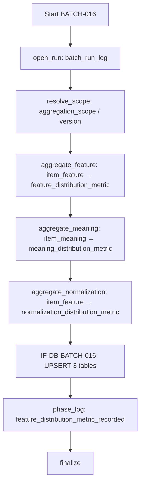

# BATCH-016 分布メトリクス集計バッチ仕様書

## 1. ドキュメント情報

| 項目           | 内容                                     |
| -------------- | ---------------------------------------- |
| ドキュメントID | `BATCH-016`                              |
| ドキュメント名 | 分布メトリクス集計バッチ仕様書           |
| 対象システム   | Gift Recommendation Service / batch      |
| MVP対象        | `○`                                      |
| 作成日         | 2026-07-21                               |
| 更新日         | 2026-07-21（§18.2 Human 承認反映）       |

---

## 2. 概要

BATCH-016（分布メトリクス集計Batch）は、先行 Batch が確定した **Item Feature / Item Meaning**（必要に応じ Embedding 監視入力）から分布統計量を集計し、**IF-DB-BATCH-016** により次の 3 Metric テーブルへ **INSERT / UPSERT** する Batch である。

| 出力テーブル | 集計対象（正本） | 主目的 |
| ------------ | ---------------- | ------ |
| `feature_distribution_metric` | `item_feature`（raw / normalized） | Feature 軸分布の Observability |
| `meaning_distribution_metric` | `item_meaning`（必須経路）。`user_meaning` は任意（§18.1 No.14 / §18.2 No.2） | Gift Meaning 座標分布の Observability |
| `normalization_distribution_metric` | `item_feature`（raw / sigmoid） | 正規化パイプライン正常性監視 |

正本区分は **派生集計 / 品質監視メトリクス** である。Public API では返却しない。Online 推薦（reco）は各 Metric テーブルを **SELECT のみ**、更新は batch（本 Batch）のみが行う。

本 Batch は次を **行わない**。

| 対象 | 理由 |
| ---- | ---- |
| `item_feature` / `item_meaning` の個別値再書込 | **BATCH-012 / BATCH-013** 責務 |
| `normalization_distribution_metric` 以外を含む正規化そのもの | **BATCH-013**（本 Batch は集計のみ） |
| Embedding ベクトル生成・`item_embedding` Upsert | **BATCH-015** / **IF-VEC-BATCH-001** |
| Embedding 入力 hash 算出 | **BATCH-014** / **IF-DB-BATCH-015** |
| Feature 正規化結果保存（normalized / meaning UPSERT） | **BATCH-013** / **IF-DB-BATCH-014** |
| `reco_score_distribution_metric` | Online / 評価系（apps/reco）。本 Epic out_of_scope |
| Public / Internal HTTP API 化 | Batch は HTTP 公開しない |

### 2.1 IF 対応（Human 注意：Batch ID と IF 番号）

| IF ID | 名称 | 担当 Batch | 本 Batch での利用 |
| ----- | ---- | ---------- | ----------------- |
| **IF-DB-BATCH-016** | 分布メトリクス保存 | **BATCH-016** | **本 Batch の物理書込 I/F**（3 Metric テーブル INSERT / UPSERT） |
| **IF-DB-BATCH-014** | Feature正規化結果保存 | **BATCH-013** | **利用しない**（読取元は `item_feature` / `item_meaning`。正規化書込は 013） |
| **IF-DB-BATCH-015** | Embedding入力hash保存 | **BATCH-014** | **利用しない**（混同禁止） |
| **IF-VEC-BATCH-001** | Item Embedding保存 | **BATCH-015** | **利用しない**（任意依存時も Embedding の **読取のみ**。Upsert しない） |

> **確定**: 本 Batch では **Batch ID と IF 番号が一致する**（`IF-DB-BATCH-016` = `BATCH-016`）。隣接 IF（014 / 015 / VEC-001）との混同を禁止する。
>
> **確定**: BATCH-013 は `normalization_distribution_metric` を **書かない**（`BATCH-013_Feature正規化バッチ仕様書` §18.1 No.6 / `normalization_distribution_metric_テーブル定義書` §5.6 / §17.1 No.6）。本テーブルへの保存正本は **本 Batch（IF-DB-BATCH-016）** である。

### 2.2 BATCH-013 境界（確定）

| 観点 | BATCH-013 | BATCH-016（本 Batch） |
| ---- | --------- | --------------------- |
| `item_feature.normalized_feature_value` | **UPDATE**（IF-DB-BATCH-014） | **読取のみ** |
| `item_meaning` | **UPSERT**（IF-DB-BATCH-014） | **読取のみ**（必須集計入力） |
| `normalization_distribution_metric` | **非書込** | **INSERT / UPSERT** |
| `feature_distribution_metric` / `meaning_distribution_metric` | 非書込 | **INSERT / UPSERT** |

識別子 Epic は **`[Epic]BATCH-016:分布メトリクス集計Batch`（#1489）** を親とする。先行 BATCH-013（#1455）は必須、BATCH-015（#1479）は任意依存（§5 / §18）。縦串は **仕様整備 → 実装 → UT → Epic PR（develop）**。

---

## 3. 目的

| No | 目的 |
| -: | ---- |
| 1 | `item_feature` から Feature 軸分布（raw / normalized）を集計し `feature_distribution_metric` へ保存する |
| 2 | `item_meaning` から Meaning 座標分布（social / symbolic）を集計し `meaning_distribution_metric` へ保存する |
| 3 | `item_feature` から正規化前後分布（raw / sigmoid）を集計し `normalization_distribution_metric` へ保存する |
| 4 | **IF-DB-BATCH-016** により 3 テーブルへ冪等 INSERT / UPSERT する |
| 5 | `phase_log.feature_distribution_metric_recorded` で全 Metric 記録完了を 1 フェーズ代表として記録する |
| 6 | Reco 品質監視・正規化異常検知の入力となる集計スナップショットを提供する（Online 推薦は変更しない） |

---

## 4. バッチ基本情報

| 項目           | 内容 |
| -------------- | ---- |
| Batch ID       | `BATCH-016` |
| Batch名        | 分布メトリクス集計Batch |
| 処理種別       | 派生集計 / Observability Metric 保存 |
| 実行基盤       | GitHub Actions。**独立子 workflow `batch-distribution-metrics.yml`（`batch-distribution-metrics*.yml`）を正**とする（§18.1）。親 meaning-generation / daily 親 workflow 全体改修は本 Epic 外 |
| 実装言語       | Python（`apps/batch`） |
| 起動方式       | BATCH-013 / BATCH-015 後続 / `schedule` / `workflow_dispatch` / `distribution_rebuild` |
| 実行頻度       | 日次 / 週次 / 手動（スケジュール設計書）。チェーン後続または独立 schedule |
| 冪等キー       | 各 Metric テーブル定義の UNIQUE / 部分 UNIQUE（§11）。`aggregation_scope` ∈ `batch_run` / `daily` / `semantic_config_version` |
| 先行Batch      | `BATCH-013`（必須） / `BATCH-015`（任意） |
| 後続Batch      | `BATCH-017`（Run 集計） / `BATCH-018`（評価依存・別 Epic） |
| MVP対象        | `○` |
| Contract Gate  | **不要**（HTTP API / OpenAPI を変更しない） |

実装パス想定: `apps/batch/src/batch/application/distribution_metrics/**`。

`Batch ID` は `BATCH-*` を使用する。処理構成上の分類 ID（`BT-*`）および隣接 Batch の IF 番号を本成果物の識別子と混同しない。

### 4.1 モジュール対応

| モジュール（論理名） | 責務 | 区分 |
| -------------------- | ---- | ---- |
| Normalization Statistics Manager | 正規化統計・分布集計オーケストレーションの主参照 | **MOD-BATCH-038** |
| Distribution Metric Collector | Run 単位の集計オーケストレーション（Collector） | 論理名（一覧）。初版は **MOD-BATCH-038 内包**（§18.2 No.3） |
| Feature Distribution Aggregator | `feature_distribution_metric` 集計 | 論理名（一覧）。初版は **MOD-BATCH-038 内包**（§18.2 No.3） |
| Meaning Distribution Aggregator | `meaning_distribution_metric` 集計 | 論理名（一覧）。初版は **MOD-BATCH-038 内包**（§18.2 No.3） |
| Normalization Distribution Aggregator | `normalization_distribution_metric` 集計 | 論理名（一覧）。初版は **MOD-BATCH-038 内包**（§18.2 No.3） |
| Batch Logger / Error Handler | Run / Phase / エラー | 共通 |

> MVP 初版の実装参照は **MOD-BATCH-038** を主とする。Aggregator 論理名は docs 上維持し、**追加採番せず 038 に内包**する（§18.1 No.11 / §18.2 No.3）。実装 Task は本仕様の論理責務境界を守ればよい。

---

## 5. 実行条件

### 5.1 トリガー

| トリガー | 利用有無 | 条件 | 備考 |
| -------- | -------- | ---- | ---- |
| schedule | `true` | 日次 / 週次 | 既定 `aggregation_scope=daily`（§18.2 No.4） |
| workflow_dispatch | `true` | 手動・再集計 | `distribution_rebuild` 含む |
| 先行Batch完了 | `true`（運用上） | BATCH-013 後続必須。BATCH-015 後続は任意 | 親チェーン全体改修は外 |
| workflow_call | `true`（運用上） | 独立子として親から呼び出し可 | 接続タイミングは Epic 外可 |

### 5.2 実行前提

- BATCH-013 の成果として、対象 `semantic_config_version_id` の `item_feature`（raw、および正規化済みは normalized）と `item_meaning` が参照可能であること。
- 3 Metric テーブルの DDL が適用済みであること（テーブル定義書 #556 / #557 / #563）。
- `batch_run_log` 行が本 Run 開始時に存在すること（`aggregation_scope=batch_run` 時は `batch_run_id` 必須）。
- 同一 Batch の多重起動は `GRS-BAT-003` で拒否すること。
- BATCH-015（`item_embedding`）は **任意**。必須経路は `item_feature` / `item_meaning` のみ（§6 / §18）。

---

## 6. 入力

### 6.1 入力データ

| 入力 | 種別 | 必須 | 用途 |
| ---- | ---- | ---- | ---- |
| `item_feature` | DB | `true` | Feature / Normalization 分布の集計入力 |
| `item_meaning` | DB | `true` | Meaning 分布（`entity_type=item`）の集計入力 |
| `semantic_config_version_id` | Resolver / 引数 | `true` | 集計 version スコープ |
| `feature_normalization_version_id` | DB（行から） | 条件付き | Meaning / Normalization 行分割・再現性。混在時は version ごとに分割 |
| `item_embedding` | DB | `false` | 任意（フラグ OFF 既定・§18.2 No.1）。Embedding 件数監視等に含める場合のみ。**3 Metric テーブルへの直接書込列はない** |
| `user_meaning` | DB | `false` | 任意（フラグ OFF 既定・§18.2 No.2）。Meaning 分布（`entity_type=user`）。テーブル定義は item+user MVP 対応済み |
| `batch_run_log` | DB | `true` | Run trace / `batch_run_id` |

### 6.2 集計入力ルール（正本テーブル定義準拠）

#### 6.2.1 `feature_distribution_metric`（`feature_distribution_metric_テーブル定義書` §5.2）

| `value_layer` | 入力列 | 選定 |
| ------------- | ------ | ---- |
| `raw` | `item_feature.raw_feature_value` | 同一 version + `feature_code` で raw が非 NULL |
| `normalized` | `item_feature.normalized_feature_value` | 同一 version + `feature_code` で normalized が非 NULL。`feature_normalization_version_id` 必須 |

- `entity_type` は MVP **`item` 固定**。
- 入力行の世代選定（最新 `generated_at` の冪等キー組等）は `item_feature` 定義と実装 Task の責務。

#### 6.2.2 `meaning_distribution_metric`（`meaning_distribution_metric_テーブル定義書` §5.2 / §5.8）

| `entity_type` | `value_layer` | 入力列 |
| ------------- | ------------- | ------ |
| `item`（必須経路） | `social` / `symbolic` | `item_meaning.item_social` / `item_symbolic` |
| `user`（任意・フラグ OFF 既定） | `social` / `symbolic` / `lambda_ctx` | `user_meaning` 各列。完了 Run フィルタは定義書 §5.3.2 |

- `feature_normalization_version_id` 混在時は **version ごとに行分割**（混在集約禁止）。
- `lambda_ctx` は `entity_type=user` のみ。

#### 6.2.3 `normalization_distribution_metric`（`normalization_distribution_metric_テーブル定義書` §5.2）

| `value_layer` | 入力列 | 選定 |
| ------------- | ------ | ---- |
| `raw` | `item_feature.raw_feature_value` | version + `feature_code` + `feature_normalization_version_id` |
| `sigmoid` | `item_feature.normalized_feature_value` | 同上。張り付き率は sigmoid 監視が主（raw は NULL 許容） |

- `entity_type` は MVP **`item` 固定**。
- BATCH-013 実行だけでは本テーブル行は増えない（非書込境界）。

### 6.3 外部 API / LLM

| 対象 | 利用有無 | 方針 |
| ---- | -------- | ---- |
| External AI / LLM / Embedding API | **なし** | 本 Batch は DB 集計のみ |
| Reco Hosting HTTP | **なし** | — |

### 6.4 環境変数（名称のみ）

| 環境変数名 | 必須 | 用途 | secret区分 |
| ---------- | ---- | ---- | ---------- |
| `DATABASE_URL` | `true` | DB 読取・Metric UPSERT・ログ | secret |
| `BATCH_DISTRIBUTION_METRICS_AGGREGATION_SCOPE` | `false` | 既定 `aggregation_scope`（未指定時は起動種別に従う・§18.2 No.4） | 非secret |
| `BATCH_DISTRIBUTION_METRICS_SEMANTIC_CONFIG_VERSION_ID` | `false` | 明示 version 指定 | 非secret |
| `BATCH_DISTRIBUTION_METRICS_INCLUDE_ITEM_EMBEDDING` | `false` | Embedding 監視入力の有効化（既定 OFF・§18.2 No.1） | 非secret |
| `BATCH_DISTRIBUTION_METRICS_INCLUDE_USER_MEANING` | `false` | user Meaning 集計の有効化（既定 OFF・§18.2 No.2） | 非secret |

secret 実値・接続文字列を docs / ログ / fixture に記載してはならない。

---

## 7. 出力

### 7.1 出力データ

| 出力 | 操作 | 内容 |
| ---- | ---- | ---- |
| `feature_distribution_metric` | INSERT / UPSERT | Feature 軸 × value_layer 統計量（§11.1） |
| `meaning_distribution_metric` | INSERT / UPSERT | entity_type × value_layer × normalization version 統計量（§11.2） |
| `normalization_distribution_metric` | INSERT / UPSERT | feature_code × raw/sigmoid × normalization version 統計量（§11.3） |
| `batch_run_log` / `phase_log` / `error_log` | INSERT / UPDATE | 実行記録。終端 Phase は `feature_distribution_metric_recorded` |

### 7.2 後続への引き渡し

| 後続 | 引き渡し | 条件 |
| ---- | -------- | ---- |
| BATCH-017 | Run 件数・失敗件数 | Run 終了 |
| BATCH-018 | 分布 Metric 参照（評価依存） | 別 Epic。本仕様は書込まで |

---

## 8. 処理フロー

### 8.1 全体フロー



### 8.2 処理ステップ

| No | Phase（論理） | 処理 | 失敗時 |
| -: | ------------- | ---- | ------ |
| 1 | `open_run` | `batch_run_log` 確保 | `GRS-BAT-*` / `GRS-DB-*` |
| 2 | `resolve_scope` | `aggregation_scope` / `aggregation_key` / `semantic_config_version_id` 解決 | `GRS-CFG-*` / `GRS-VAL-*` |
| 3 | `aggregate_feature` | Feature 分布算出 | `GRS-VAL-*` / `GRS-DB-*` |
| 4 | `aggregate_meaning` | Meaning 分布算出（必須: item。user はフラグ ON 時のみ） | 同上 |
| 5 | `aggregate_normalization` | 正規化前後分布算出 | 同上 |
| 6 | `persist_metrics` | **IF-DB-BATCH-016** UPSERT | `GRS-DB-*` |
| 7 | `record_phase` | `feature_distribution_metric_recorded` | `GRS-DB-*` |
| 8 | `finalize` | Run 終了・件数集計 | — |

> `phase_log` の物理 `phase_name` は、Feature / Meaning / Normalization 各記録完了を **`feature_distribution_metric_recorded` 1 フェーズで代表**する（専用 enum `meaning_distribution_metric_recorded` / `normalization_distribution_metric_recorded` は **追加しない**。#557 / #563 決定済み）。

---

## 9. 集計・統計量

### 9.1 共通統計列（各テーブル定義 §6）

| 列 | 方針 |
| -- | ---- |
| `sample_count` | 集計件数（必須） |
| `mean` | 平均（必須） |
| `stddev` | `sample_count < 2` 時は NULL 許容 |
| `min_value` / `max_value` / `p10` / `p50` / `p90` | NULL 許容 |
| `near_zero_rate` / `near_one_rate` / `mid_concentration_rate` | 0.0〜1.0 または NULL。normalization の raw 層は省略可 |
| `nan_count` / `out_of_range_count` | 非負。normalized / sigmoid は 0.0〜1.0 外をカウント |
| `sigma_zero_count` | **normalization テーブルのみ** |
| `calculated_at` | 集計完了 UTC |

Observability の `skewness` / `kurtosis` / `inf_count` 等は MVP 物理列に含めない（各テーブル §17.1）。

### 9.2 `feature_distribution_metric` と `normalization_distribution_metric` の value_layer

| テーブル | `value_layer` | 意味 |
| -------- | ------------- | ---- |
| feature | `raw` / `normalized` | Feature 汎用分布 |
| normalization | `raw` / `sigmoid` | 正規化パイプライン段階（sigmoid 監視特化） |

同一 `item_feature` 入力でも **責務分離**のため両テーブルに統計が存在しうる（normalization 定義書 §5.2.2）。

---

## 10. 禁止操作

- **IF-DB-BATCH-014** 相当の `item_feature.normalized_feature_value` / `item_meaning` DML
- **IF-DB-BATCH-015** 相当の Embedding hash 算出・専用テーブル書込
- **IF-VEC-BATCH-001** 相当の `item_embedding` Upsert
- `item_semantic` / Queue INSERT / `item` 業務列の更新
- `reco_score_distribution_metric` への書込
- OpenAPI / migration / generated の変更（本 Task）
- Public API への Metric 露出
- secret / DB URL / 個別商品 ID の過剰ログ

---

## 11. 冪等性・再実行性

### 11.1 `feature_distribution_metric`

| 観点 | 方針 |
| ---- | ---- |
| UNIQUE（batch_run） | `(batch_run_id, semantic_config_version_id, feature_code, value_layer, aggregation_scope, aggregation_key)` |
| 部分 UNIQUE（非 batch_run） | `(aggregation_scope, aggregation_key, semantic_config_version_id, feature_code, value_layer)` |
| `batch_run` 時 | `aggregation_key` は **NULL 固定** |
| 再実行 | 同一キーは UPSERT 上書き。新 Run は新 `batch_run_id` で INSERT |

### 11.2 `meaning_distribution_metric`

| 観点 | 方針 |
| ---- | ---- |
| UNIQUE（batch_run） | `(batch_run_id, semantic_config_version_id, entity_type, value_layer, feature_normalization_version_id, aggregation_scope, aggregation_key)` |
| 部分 UNIQUE（非 batch_run） | scope / key / version / entity / layer / normalization_version |
| version 混在 | **行分割**（混在集約禁止） |

### 11.3 `normalization_distribution_metric`

| 観点 | 方針 |
| ---- | ---- |
| UNIQUE（batch_run） | `(batch_run_id, semantic_config_version_id, feature_code, value_layer, feature_normalization_version_id, aggregation_scope, aggregation_key)` |
| 部分 UNIQUE（非 batch_run） | scope / key / version / feature_code / layer / normalization_version |
| BATCH-013 | 本テーブルへは書かない（再実行しても 013 単体では行が増えない） |

### 11.4 `aggregation_scope`

| 値 | 意味 | `batch_run_id` | `aggregation_key` 例 |
| -- | ---- | -------------- | -------------------- |
| `batch_run` | 1 回の BATCH-016 実行単位 | **必須** | `NULL` |
| `daily` | 日次スナップショット | 実行 Run ID 設定可 | `YYYY-MM-DD`（UTC） |
| `semantic_config_version` | version 単位再集計 | 任意 | `NULL` または version ラベル |

既定値: **dispatch / チェーン後続は `batch_run`、独立 schedule は `daily`**（§18.2 No.4）。テーブル Default は `'batch_run'`。数値系 env 既定は実装 Task。

### 11.5 Retention

各 Metric は **365 日以上**保持。`batch_run_log`（90 日）と **連動削除しない**。親 Run 削除後の `batch_run_id` dangling を許容（各定義書 §13）。

---

## 12. 状態管理

本 Batch は Queue 消化 Batch ではない。主状態は `batch_run_log` / `phase_log` である。

| 状態 | 条件 |
| ---- | ---- |
| Run 成功 | 3 Aggregator 完了 + IF-DB-BATCH-016 UPSERT + `feature_distribution_metric_recorded` |
| 部分成功 | `GRS-BAT-002`。失敗軸・失敗テーブルのみ再実行可能な設計とする（実装詳細は実装 Task） |
| 失敗 | Config / 入力欠落 / DB 障害。自動 rollback なし（再実行は UPSERT 収束） |

---

## 13. エラー・リトライ

| エラー | Code | 備考 |
| ------ | ---- | ---- |
| 入力欠落（必須 `item_feature` / `item_meaning`） | `GRS-VAL-*` | 先行 BATCH-013 再実行を検討 |
| Config / version 不整合 | `GRS-CFG-*` | |
| DB / UPSERT | `GRS-DB-*` | 一時障害のみ短時間リトライ検討 |
| 部分成功 | `GRS-BAT-002` | 失敗分のみ再集計 |
| 多重起動 | `GRS-BAT-003` | 起動拒否 |

Client / 外部 API リトライは不要（外部呼出なし）。

---

## 14. ログ・監視

| 種別 | 内容 |
| ---- | ---- |
| `batch_run_log` | Run 単位 |
| `phase_log` | **`feature_distribution_metric_recorded`**（3 Metric 完了代表） |
| `error_log` | code / scope / version |
| メトリクス | feature/meaning/normalization 行数、sample_count 合計、失敗件数 |

禁止ログ:

- `DATABASE_URL` / secret 実値
- 個別 `item_id` / `recommendation_run_id` の大量ダンプ（統計量のみを基本とする）
- Metric 全行の過剰ダンプ

---

## 15. セキュリティ・外部サービス利用

| 観点 | 方針 |
| ---- | ---- |
| secret | DB 認証情報は GitHub Secrets / local `.env` のみ。値を docs・ログ・fixture に書かない |
| Public API | 3 Metric **非公開** |
| 権限 | `apps/batch` のみが 3 Metric を書き込む。reco は SELECT のみ |
| 個人情報 | 統計量のみ。自由記述・個別ユーザー入力は保持しない |
| HTTP 公開 | Batch は HTTP API 化しない（**Contract Gate 不要**） |
| 外部サービス | 本 Batch は外部 AI / Embedding API を呼び出さない |

---

## 16. テスト観点

| No | 観点 | 種別 |
| -: | ---- | ---- |
| 1 | IF-DB-BATCH-016 で 3 テーブル UPSERT | unit / integration |
| 2 | IF-DB-BATCH-014 / 015 / VEC-001 を書かない | review / unit |
| 3 | BATCH-013 非書込: 013 実行だけでは `normalization_distribution_metric` が増えない | review / manual |
| 4 | feature: raw / normalized 入力切替・8 軸 | unit |
| 5 | meaning: item social / symbolic。version 混在行分割 | unit |
| 6 | normalization: raw / sigmoid。`sigma_zero_count` | unit |
| 7 | `aggregation_scope=batch_run` 冪等 UPSERT | unit |
| 8 | `daily` / `semantic_config_version` 部分 UNIQUE | unit |
| 9 | phase_log が `feature_distribution_metric_recorded` のみ（専用 phase 追加なし） | unit / review |
| 10 | `sample_count < 2` で stddev NULL | unit |
| 11 | Contract Gate 不要・OpenAPI 非変更 | review |
| 12 | secret 非含有 | review |
| 13 | item_embedding / user_meaning はフラグ OFF 時スキップ | unit（§18.2） |

---

## 17. 変更管理

| 日付 | 変更内容 | 関連 |
| ---- | -------- | ---- |
| 2026-07-21 | 初版作成 | Epic #1489 / Task #1490 |
| 2026-07-21 | §18.2 残確認事項を Human 承認（推奨案採用）として確定反映 | PR #1491 / Issue #1490 |

---

## 18. 未決事項・決定事項

### 18.1 採用方針（確定）

| No | 論点 | 内容 | 状態 |
| -: | ---- | ---- | ---- |
| 1 | 物理書込 IF | **IF-DB-BATCH-016 = BATCH-016**（3 Metric INSERT / UPSERT）。Batch ID と IF 番号が一致 | **確定** |
| 2 | 隣接 IF | **IF-DB-BATCH-014 = BATCH-013**、**IF-DB-BATCH-015 = BATCH-014**、**IF-VEC-BATCH-001 = BATCH-015**。本 Batch は書込に使わない | **確定** |
| 3 | BATCH-013 境界 | `normalization_distribution_metric` は **本 Batch のみ書込**。013 は非書込 | **確定**（013 §18.1 No.6 / NDM §17.1 No.6） |
| 4 | 必須入力 | **`item_feature` / `item_meaning`** | **確定**（依存関係図: 013→016 必須） |
| 5 | 任意入力（embedding） | **`item_embedding`** は任意依存（015→016）。フラグ OFF 既定。3 Metric への直接列はない | **確定**（§18.2 No.1 Human 承認） |
| 6 | 出力 | `feature_distribution_metric` / `meaning_distribution_metric` / `normalization_distribution_metric` | **確定** |
| 7 | 冪等 | 各テーブル UNIQUE / 部分 UNIQUE + `aggregation_scope` ∈ {batch_run, daily, semantic_config_version} | **確定**（#556/#557/#563） |
| 8 | phase_log | **`feature_distribution_metric_recorded` 1 フェーズ代表**。専用 phase enum 追加なし | **確定**（#557/#563） |
| 9 | Contract Gate | **不要** | **確定** |
| 10 | 子 workflow | 独立 YAML **`batch-distribution-metrics.yml`（`batch-distribution-metrics*.yml`）** を MVP 初期の正とする。親全体改修は外。親接続タイミングは Epic 外 | **確定**（§18.2 No.5） |
| 11 | モジュール主参照 | **MOD-BATCH-038**。Aggregator 論理名は docs 上維持し、**初版は追加採番せず 038 内包** | **確定**（§18.2 No.3 Human 承認） |
| 12 | Public API / secret | Metric 非公開。secret 実値禁止 | **確定** |
| 13 | 一覧の古い表記 | バッチ処理一覧の「BATCH-013 が `normalization_distribution_metric` 更新」は **本仕様では BATCH-016 を正**とする。一覧本文の一括修正は本 Task 対象外（別 docs Task） | **確定**（§18.2 No.6） |
| 14 | 任意入力（user meaning） | **`user_meaning`** 集計は任意。フラグ OFF 既定。必須経路は item のみ | **確定**（§18.2 No.2 Human 承認） |
| 15 | aggregation_scope 既定 | **dispatch / チェーン後続 = `batch_run`**、**独立 schedule = `daily`**。`BATCH_DISTRIBUTION_METRICS_*` の数値既定は実装 Task | **確定**（§18.2 No.4 Human 承認） |

### 18.2 Human 承認済み（推奨案採用） / 別 Task

Human Review にて §18.2 の推奨案をすべて採用した（2026-07-21）。残る作業は No.6 の別 docs Task 起票のみ。

| No | 事項 | 採用内容 | 状態 |
| -: | ---- | -------- | ---- |
| 1 | MVP 初版で `item_embedding` 監視入力を必須にするか | **任意（フラグ OFF 既定）**。必須経路は feature / meaning | **確定**（Human 承認・推奨採用） |
| 2 | MVP 初版で `user_meaning` 集計を必須にするか | **任意（フラグ OFF 既定）**。テーブル定義は item+user MVP 対応済み | **確定**（Human 承認・推奨採用） |
| 3 | Aggregator を MOD-BATCH-038 に内包するか、追加採番するか | **初版は 038 内包**（論理名は docs 上維持）。追加採番が必要ならモジュール一覧更新の別 Task | **確定**（Human 承認・推奨採用） |
| 4 | `aggregation_scope` 既定と `BATCH_DISTRIBUTION_METRICS_*` 数値既定 | **dispatch/チェーン後続 = `batch_run`、独立 schedule = `daily`**。数値既定は実装 Task | **確定**（Human 承認・推奨採用） |
| 5 | 独立子 workflow を MVP 初期の正とするか | **正とする**（§18.1 No.10）。親接続タイミングのみ Epic 外 | **確定** |
| 6 | バッチ処理一覧の古い「BATCH-013 更新リソースに `normalization_distribution_metric`」表記の修正 | **別 docs Task で対応**（Epic out_of_scope）。本仕様・テーブル定義・BATCH-013 仕様を正とする | **確定（別 Task）** |

---

## 19. 関連資料

| 種別 | パス |
| ---- | ---- |
| 一覧 | `docs/05_アプリケーション設計/アプリ/batch/バッチ処理一覧.md`（BATCH-016 / `batch-distribution-metrics.yml`） |
| 方針 | `docs/05_アプリケーション設計/アプリ/batch/バッチ設計方針書.md`（分布メトリクス・Observability） |
| スケジュール | `docs/05_アプリケーション設計/アプリ/batch/バッチ実行スケジュール設計書.md` |
| 依存 | `docs/05_アプリケーション設計/アプリ/batch/バッチ依存関係図.md`（013必須 / 015任意 → 016 → 017） |
| IF | `docs/05_アプリケーション設計/アプリ/インターフェース一覧.md`（IF-DB-BATCH-016） |
| モジュール | `docs/05_アプリケーション設計/アプリ/モジュール一覧.md`（MOD-BATCH-038） |
| DB | `feature_distribution_metric` / `meaning_distribution_metric` / `normalization_distribution_metric` テーブル定義書 |
| 先行 | `BATCH-013_Feature正規化バッチ仕様書.md`（非書込境界） |
| 任意先行 | `BATCH-015_Item Embedding生成バッチ仕様書.md`（任意依存・IF-VEC-BATCH-001） |
| 踏襲 | `BATCH-012_Item Feature生成バッチ仕様書.md` / `BATCH-015_Item Embedding生成バッチ仕様書.md`（章構成） |

---

## 20. レビュー観点

- **IF-DB-BATCH-016** が本 Batch の物理書込 I/F（3 テーブル）として明記されている
- **IF-DB-BATCH-014 / IF-DB-BATCH-015 / IF-VEC-BATCH-001** を混同していない
- BATCH-013 が `normalization_distribution_metric` を書かず、本 Batch が書く境界が明記されている
- 必須入力が `item_feature` / `item_meaning`、任意が `item_embedding` である
- 冪等が各テーブル UNIQUE / `aggregation_scope` に基づく
- phase_log が `feature_distribution_metric_recorded` 1 フェーズ代表である
- 独立子 workflow `batch-distribution-metrics.yml` / Contract Gate 不要が明記されている
- MOD-BATCH-038 主参照・Aggregator は初版 038 内包（追加採番なし）が明記されている
- Public API 非公開・secret 禁止が明記されている
- §18.2 推奨案が Human 承認済みとして §18.1 に反映されている
- 一覧の古い BATCH-013 表記は本仕様では BATCH-016 正とし、一覧修正は別 docs Task である
- PR target が親 Epic Branch（`feature/epic-1489-batch-016-distribution-metrics`）である

---

## 21. 備考

### 21.1 Out of scope

| 対象 | 理由 |
| ---- | ---- |
| Python 実装・workflow YAML 本体・UT | 後続 Task |
| BATCH-013 / 015 再実装 | 先行。境界参照のみ |
| BATCH-017 以降 | 後続 Epic |
| apps/reco / `reco_score_distribution_metric` | Epic out_of_scope |
| migration / OpenAPI / generated | Epic forbidden |
| 親 meaning-generation / daily 親 workflow 全体改修 | Epic out_of_scope（独立子追加は可） |
| バッチ処理一覧の古い表記一括修正 | 別 docs Task 候補（§18.2 No.6） |

### 21.2 データフロー（要約）

```text
BATCH-013: item_feature.normalized + item_meaning
    ↓（必須）
BATCH-015: item_embedding（任意・読取のみ）
    ↓
BATCH-016 / IF-DB-BATCH-016
    → feature_distribution_metric
    → meaning_distribution_metric
    → normalization_distribution_metric
    → phase_log: feature_distribution_metric_recorded
    ↓
BATCH-017 / BATCH-018（参照・集計）
```
