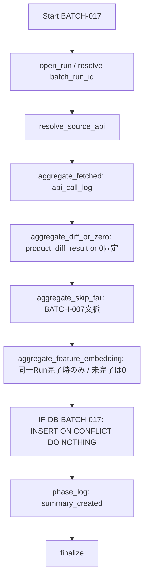

# BATCH-017 Import Summary作成バッチ仕様書

## 1. ドキュメント情報

| 項目           | 内容                                |
| -------------- | ----------------------------------- |
| ドキュメントID | `BATCH-017`                         |
| ドキュメント名 | Import Summary作成バッチ仕様書      |
| 対象システム   | Gift Recommendation Service / batch |
| MVP対象        | `○`                                 |
| 作成日         | 2026-07-21                          |
| 更新日         | 2026-07-21（§18.2 Human 確定反映）  |

---

## 2. 概要

BATCH-017（Import Summary作成Batch）は、同一 `batch_run_id` 内の取込・反映・Feature / Embedding 生成などの **件数を `source_api` 単位で要約**し、**IF-DB-BATCH-017** により `item_import_summary` へ **INSERT** する運用集計 Batch である。

| 出力テーブル | 集計単位 | 主目的 |
| ------------ | -------- | ------ |
| `item_import_summary` | `batch_run_id` + `source_api` | 取込・反映結果の件数サマリ正本（Log / 集計） |

正本区分は **運用集計 / 実行結果サマリ** である。商品明細・差分明細・分布メトリクス本体は保持しない。Public API では直接返却しない（Admin は `batch_run_log` / API-ADM-005 詳細経由の間接参照候補）。Online / reco から Direct 参照・更新しない。

本 Batch は次を **行わない**。

| 対象 | 理由 |
| ---- | ---- |
| `product_diff_result` / Staging / Item 業務列の書込 | **BATCH-005〜008** 等の責務。本 Batch は件数集計のみ |
| 分布メトリクス 3 テーブルへの INSERT / UPSERT | **BATCH-016** / **IF-DB-BATCH-016** |
| Feature / Embedding 本体の生成・Upsert | **BATCH-012〜015** |
| Observability ログ明細（phase / error / api_call）の代替 | **IF-OBS-001〜005**。本 Batch は件数サマリ行の作成 |
| Public / Internal HTTP API 化 | Batch は HTTP 公開しない |

### 2.1 IF 対応（Human 注意：Batch ID と IF 番号）

| IF ID | 名称 | 担当 / 役割 | 本 Batch での利用 |
| ----- | ---- | ----------- | ----------------- |
| **IF-DB-BATCH-017** | Import Summary保存 | **BATCH-017** | **本 Batch の物理書込 I/F**（`item_import_summary` INSERT） |
| **IF-DB-BATCH-016** | 分布メトリクス保存 | **BATCH-016** | **利用しない**（3 Metric テーブルは書かない・読まない） |
| **IF-OBS-006** | Import Summary記録 | Observability | **論理観測面**。物理 INSERT の実行主体は **IF-DB-BATCH-017 = BATCH-017**。OBS は監視・参照の位置づけであり、別 Batch が書く IF ではない |

> **確定**: 本 Batch では **Batch ID と IF 番号が一致する**（`IF-DB-BATCH-017` = `BATCH-017`）。
>
> **確定**: **IF-DB-BATCH-016**（分布メトリクス）および **IF-OBS-006**（Observability 上の Import Summary 記録）と混同しない。物理書込正本は **IF-DB-BATCH-017**。

### 2.2 BATCH-016 / Observability 境界（確定）

| 観点 | BATCH-016 | BATCH-017（本 Batch） | IF-OBS-006 |
| ---- | --------- | --------------------- | ---------- |
| 物理書込 IF | IF-DB-BATCH-016 | **IF-DB-BATCH-017** | 論理観測（物理は 017） |
| 出力 | 3 Metric テーブル | **`item_import_summary`** | 同テーブルを監視対象として参照 |
| 責務 | Feature / Meaning / 正規化分布 | **取込・反映件数サマリ** | Observability 一覧上の記録 IF |

識別子 Epic は **`[Epic]BATCH-017:Import Summary作成Batch`（#1499）** を親とする。先行 BATCH-016（#1489）は develop merge 済み。縦串は **仕様整備 → 実装 → UT → Epic PR（develop）**。後続 Batch なし。

---

## 3. 目的

| No | 目的 |
| -: | ---- |
| 1 | Batch Run × `source_api` 単位で取得・新規・更新・変更なし・取得不能・スキップ・失敗件数を集計する |
| 2 | 同一 Run で Feature / Embedding 系が完了している場合のみ生成件数を集計し、未完了時は **0 固定**とする |
| 3 | **IF-DB-BATCH-017** により `item_import_summary` へ冪等 INSERT（`ON CONFLICT DO NOTHING`）する |
| 4 | `phase_log.summary_created` で Import Summary 作成完了を記録する |
| 5 | 運用・Admin・Observability が把握できる粒度の件数サマリを提供する（Online 推薦は変更しない） |

---

## 4. バッチ基本情報

| 項目           | 内容 |
| -------------- | ---- |
| Batch ID       | `BATCH-017` |
| Batch名        | Import Summary作成Batch |
| 処理種別       | 運用集計 / 実行結果サマリ保存 |
| 実行基盤       | GitHub Actions。**独立 cron なし**。独立子 `batch-import-summary.yml`（`batch-import-summary*.yml`）＋ `batch-distribution-metrics.yml` 末尾 017 step（§18.1 No.16 **C 併用**） |
| 実装言語       | Python（`apps/batch`） |
| 起動方式       | 各 Batch 後続 / `workflow_dispatch` / `workflow_call`（親子からの呼び出し） |
| 実行頻度       | 各子 workflow 末尾または集計対象 Batch 完了後に連続実行（独立 schedule なし） |
| 冪等キー       | `(batch_run_id, source_api)`。MVP は **INSERT + ON CONFLICT DO NOTHING**（**UPDATE しない**） |
| 先行Batch      | 運用上: `BATCH-002` / `BATCH-005` / `BATCH-007` / `BATCH-008` / `BATCH-010` / `BATCH-012` / `BATCH-015` / `BATCH-016` 等（一覧）。必須は集計対象 Run のログ・差分・件数元が存在すること |
| 後続Batch      | **なし** |
| MVP対象        | `○` |
| Contract Gate  | **不要**（HTTP API / OpenAPI を変更しない） |

実装パス想定: `apps/batch/src/batch/application/import_summary/**`。

`Batch ID` は `BATCH-*` を使用する。処理構成上の分類 ID（`BT-*`）および隣接 Batch の IF 番号を本成果物の識別子と混同しない。

### 4.1 モジュール対応

| モジュール（論理名） | 責務 | 区分 |
| -------------------- | ---- | ---- |
| Item Import Summary Writer | `item_import_summary` への件数集計・INSERT | **MOD-BATCH-047**（正） |
| Import Summary Builder | バッチ処理一覧上の論理名 | **MOD-BATCH-047 と同義**（追加採番しない） |
| Batch Logger / Error Handler | Run / Phase / エラー | 共通 |

> **確定**: モジュール正本は **MOD-BATCH-047（Item Import Summary Writer）**。一覧の **Import Summary Builder** は同義論理名として扱う（Epic notes / モジュール一覧）。

---

## 5. 実行条件

### 5.1 トリガー

| トリガー | 利用有無 | 条件 | 備考 |
| -------- | -------- | ---- | ---- |
| schedule（独立 cron） | **`false`** | — | **独立 cron なし**（スケジュール設計書 BATCH-017） |
| workflow_dispatch | `true` | 手動・再集計 | 独立子または distribution-metrics 経由 |
| 先行Batch完了 / 子 workflow 末尾 | `true`（運用上） | 各子 workflow 末尾で Summary 作成 | 親チェーン全体改修は Epic 外（§18.1 No.17） |
| workflow_call | `true`（運用上） | 独立子または親からの呼び出し | §18.1 No.16 |

### 5.2 実行前提

- 集計対象の `batch_run_log` 行が存在すること（`batch_run_id` NOT NULL）。
- `item_import_summary` テーブルの DDL が適用済みであること（テーブル定義書）。
- `source_api` が enum 許容値（`item_search` / `item_ranking` / `genre_search` / `attribute_search`）であること。
- 同一 Batch の多重起動は `GRS-BAT-003` で拒否すること。
- Feature / Embedding 件数を非ゼロにする場合は、同一 `batch_run_id` 内で当該系 Batch が完了していること（未完了は 0・§9.3）。

---

## 6. 入力

### 6.1 入力データ

| 入力 | 種別 | 必須 | 用途 |
| ---- | ---- | ---- | ---- |
| `batch_run_log` | DB | `true` | 集計対象 Run / `batch_run_id` |
| `api_call_log` | DB | 条件付き | `fetched_count` 正本（`item_count` 合計） |
| `product_diff_result` | DB | 条件付き | `item_search` 時の diff_status 別件数 |
| `staging_item` | DB | `false` | `fetched_count` 補完（`api_call_log.item_count = 0` 時のみ） |
| `ranking_snapshot` / `item_popularity_signal` | DB | `false` | `item_ranking` 文脈（列は持たず件数は `fetched_count`） |
| `item_generation_queue` / `item_feature` / `item_embedding` | DB | `false` | Feature / Embedding 生成件数（同一 Run 完了時のみ） |
| `error_log` / `phase_log` | DB | `false` | 失敗件数・完了判定の補助 |
| `source_api` | 引数 / 解決 | `true` | 冪等キー構成・集計分岐 |

### 6.2 集計元と件数列の対応（テーブル定義準拠）

正本: `item_import_summary_テーブル定義書` §5 / §6 / §12。

| 件数列 | 集計元（概要） | 備考 |
| ------ | -------------- | ---- |
| `fetched_count` | 同一 `batch_run_id` + `source_api` の `api_call_log.item_count` **合計** | 正本。`item_count = 0` のみ `staging_item` 行数で補完可 |
| `new_count` | `product_diff_result` で `diff_status = 'new'` の COUNT | `item_ranking` / `genre_search` は **0 固定** |
| `updated_count` | `diff_status = 'updated'` | 同上 |
| `unchanged_count` | `diff_status = 'unchanged'` | 同上。`skipped_count` と二重計上しない |
| `unavailable_count` | `diff_status = 'unavailable'` | 同上 |
| `skipped_count` | BATCH-007 で意図的スキップ件数 | `unchanged` は `unchanged_count` のみ |
| `failed_count` | BATCH-007 失敗等（GRS-BAT-005）+ 部分失敗 | `partially_succeeded` 時 `failed_count > 0` 想定 |
| `feature_generated_count` | 同一 Run の Feature 系完了時の件数 | **未完了は 0**（§9.3） |
| `embedding_generated_count` | 同一 Run の Embedding 系完了時の件数 | **未完了は 0**（§9.3） |
| `summarized_at` | 集計完了 UTC | INSERT 時必須 |

### 6.3 `source_api` 種別と 0 固定ルール

| `source_api` | 典型 workflow | `new/updated/unchanged/unavailable` | その他 |
| ------------ | ------------- | ----------------------------------- | ------ |
| `item_search` | BATCH-003〜007 系（item-import） | `product_diff_result` から集計 | Feature / Embedding は同一 Run 完了時のみ |
| `item_ranking` | BATCH-002 系 | **0 固定**（差分判定なし） | `fetched_count` = ランキング API 取得件数。snapshot 専用列は持たない |
| `genre_search` | BATCH-001 系 | **0 固定** | `fetched_count` = ジャンル取得件数 |
| `attribute_search` | 将来拡張 | MVP 未使用時は行なし | — |

### 6.4 外部 API / LLM

| 対象 | 利用有無 | 方針 |
| ---- | -------- | ---- |
| External AI / LLM / Embedding API | **なし** | 本 Batch は DB 集計のみ |
| 楽天 API | **なし** | 取得は先行 Batch。本 Batch はログ・差分を読むのみ |
| Reco Hosting HTTP | **なし** | — |

### 6.5 環境変数（名称のみ）

| 環境変数名 | 必須 | 用途 | secret区分 |
| ---------- | ---- | ---- | ---------- |
| `DATABASE_URL` | `true` | DB 読取・Summary INSERT・ログ | secret |
| `BATCH_IMPORT_SUMMARY_SOURCE_API` | `false` | 明示 `source_api`（未指定時は Run 文脈から解決） | 非secret |
| `BATCH_IMPORT_SUMMARY_BATCH_RUN_ID` | `false` | 集計対象 `batch_run_id` 上書き | 非secret |

secret 実値・接続文字列を docs / ログ / fixture に記載してはならない。

---

## 7. 出力

### 7.1 出力データ

| 出力 | 操作 | 内容 |
| ---- | ---- | ---- |
| `item_import_summary` | **INSERT**（`ON CONFLICT DO NOTHING`） | Run × `source_api` 件数サマリ（§11） |
| `batch_run_log` / `phase_log` / `error_log` | INSERT / UPDATE | 実行記録。終端 Phase は `summary_created` |

### 7.2 後続への引き渡し

| 後続 | 引き渡し | 条件 |
| ---- | -------- | ---- |
| （なし） | — | 後続 Batch なし |
| Admin / Observability | `item_import_summary` 行の参照 | Admin API / IF-OBS-006（読取）。本 Batch は書込のみ |

---

## 8. 処理フロー

### 8.1 全体フロー



### 8.2 処理ステップ

| No | Phase（論理） | 処理 | 失敗時 |
| -: | ------------- | ---- | ------ |
| 1 | `open_run` | 集計対象 `batch_run_id` 解決・`batch_run_log` 確認 | `GRS-BAT-*` / `GRS-DB-*` |
| 2 | `resolve_source_api` | `source_api` 解決（enum 検証） | `GRS-VAL-*` / `GRS-CFG-*` |
| 3 | `aggregate_fetched` | `fetched_count` 算出（§6.2） | `GRS-DB-*` |
| 4 | `aggregate_diff` | diff 件数または ranking/genre **0 固定**（§6.3） | `GRS-VAL-*` / `GRS-DB-*` |
| 5 | `aggregate_skip_fail` | `skipped_count` / `failed_count` | 同上 |
| 6 | `aggregate_feature_embedding` | Feature / Embedding 件数（未完了は 0） | 同上 |
| 7 | `persist_summary` | **IF-DB-BATCH-017** INSERT + DO NOTHING | `GRS-DB-*` |
| 8 | `record_phase` | `summary_created` | `GRS-DB-*` |
| 9 | `finalize` | Run 終了 | — |

> `phase_log` の物理 `phase_name` は **`summary_created`**（`phase_log_テーブル定義書` / `batch_run_phase_name`）。専用 phase の新規追加は不要。

### 8.3 `item_search` 集計フロー（テーブル定義 §12.1）

```text
1. api_call_log（source_api = item_search）の item_count 合計 → fetched_count
2. product_diff_result を diff_status 別 COUNT
   → new_count / updated_count / unchanged_count / unavailable_count
3. BATCH-007 失敗件数 → failed_count
4. 意図的スキップ → skipped_count（unchanged は unchanged_count のみ）
5. 同一 Run で Feature / Embedding 完了済みなら件数集計、未完了は 0
6. summarized_at = 集計完了時刻
7. item_import_summary INSERT（IF-DB-BATCH-017）
8. batch_run_log 終端状態と整合（partially_succeeded 時 failed_count > 0 想定）
```

---

## 9. 集計ルール詳細

### 9.1 `skipped_count` と `unavailable_count` の境界

| 列 | 意味（MVP） | 集計元 |
| -- | ----------- | ------ |
| `unavailable_count` | 取得不能・対象外・Validator 不合格 | `product_diff_result.diff_status = 'unavailable'` |
| `skipped_count` | 意図的スキップ | BATCH-007 で反映を意図的にスキップした件数。`unchanged` は二重計上しない |
| `failed_count` | Item 反映失敗等 | BATCH-007 失敗 + 部分失敗 |

### 9.2 ranking / genre の 0 固定

`source_api ∈ {item_ranking, genre_search}` のとき、`new_count` / `updated_count` / `unchanged_count` / `unavailable_count` は **すべて 0**。取得件数は `fetched_count` のみに集約する（snapshot 専用列は持たない）。

### 9.3 Feature / Embedding 件数（同一 Run 完了時のみ）

| 列 | 方針 |
| -- | ---- |
| `feature_generated_count` | 同一 `batch_run_id` 内で Feature 系 Batch（BATCH-011〜013 等）が完了している場合のみ集計。**未完了・未実行は 0** |
| `embedding_generated_count` | 同一 `batch_run_id` 内で Embedding 系（BATCH-014〜015）が完了している場合のみ集計。**未完了・未実行は 0** |

> **確定（テーブル定義書 §5.6 / §12.1 準拠）**: 後続で Feature / Embedding が別 Run で完了しても、**既存 Summary 行を UPDATE して件数を埋め直さない**（MVP は INSERT 1 回 + DO NOTHING）。件数を含めたい場合は、当該系完了後の同一 Run 文脈で BATCH-017 を実行する。

---

## 10. 禁止操作

- **IF-DB-BATCH-016** 相当の 3 Metric テーブル DML
- `product_diff_result` / `staging_*` / `item` / Queue / Feature / Embedding 本体の DML
- `item_import_summary` への **UPDATE** / **DELETE+INSERT 再集計**（MVP）
- OpenAPI / migration / generated の変更（本 Task）
- Public API への Summary 直接露出
- secret / DB URL / 個別商品コードの過剰ログ

---

## 11. 冪等性・再実行性

### 11.1 UNIQUE / INSERT 方針

| 観点 | 方針 |
| ---- | ---- |
| UNIQUE | `(batch_run_id, source_api)`（`uq_item_import_summary_run_api`） |
| MVP 書込 | **INSERT 1 回** + **`ON CONFLICT (batch_run_id, source_api) DO NOTHING`** |
| UPDATE | **行わない**（テーブル定義書 §12 / §17.1 No.5） |
| 再実行 | 同一キーは no-op。新しい Run は新しい `batch_run_id` で INSERT |
| `summary_type` | 一覧表記。物理列は **`source_api` に対応** |

### 11.2 INSERT 疑似コード

```sql
INSERT INTO item_import_summary (
  batch_run_id,
  source,
  source_api,
  fetched_count,
  new_count,
  updated_count,
  unchanged_count,
  unavailable_count,
  skipped_count,
  failed_count,
  feature_generated_count,
  embedding_generated_count,
  summarized_at
) VALUES (
  :batch_run_id,
  'rakuten',
  :source_api,
  :fetched_count,
  :new_count,
  :updated_count,
  :unchanged_count,
  :unavailable_count,
  :skipped_count,
  :failed_count,
  :feature_generated_count,
  :embedding_generated_count,
  :summarized_at
)
ON CONFLICT (batch_run_id, source_api) DO NOTHING;
```

### 11.3 Retention

| 観点 | 方針 |
| ---- | ---- |
| 保持期間 | **90 日**（`summarized_at` 基準。Batch 系 Log 統一・テーブル定義書 §13 / #536） |
| 削除 | 物理 DELETE（Retention Job）。本 Batch 本体の責務外 |
| 履歴 | 再集計履歴は保持しない（INSERT 1 行が正本） |

---

## 12. 状態管理

本 Batch は Queue 消化 Batch ではない。主状態は `batch_run_log` / `phase_log` である。`item_import_summary` 自体に状態列はない（Log / 集計。INSERT 後の遷移なし）。

| 状態 | 条件 |
| ---- | ---- |
| Run 成功 | 集計完了 + IF-DB-BATCH-017 INSERT（または DO NOTHING）+ `summary_created` |
| 部分成功 | 入力欠落で件数 0 埋めが許容されるケースは実装 Task で明確化。致命的欠落は失敗 |
| 失敗 | Config / enum 不正 / DB 障害。自動 rollback なし（再実行は DO NOTHING 収束） |

---

## 13. エラー・リトライ

| エラー | Code | 備考 |
| ------ | ---- | ---- |
| `batch_run_id` / `source_api` 不正 | `GRS-VAL-*` / `GRS-CFG-*` | |
| 必須入力欠落（Run 不在等） | `GRS-VAL-*` | 先行 Batch / Run 再実行を検討 |
| DB / INSERT | `GRS-DB-*` | 一時障害のみ短時間リトライ検討 |
| 多重起動 | `GRS-BAT-003` | 起動拒否 |
| 部分成功 | `GRS-BAT-002` | 必要時のみ |

Client / 外部 API リトライは不要（外部呼出なし）。

---

## 14. ログ・監視

| 種別 | 内容 |
| ---- | ---- |
| `batch_run_log` | Run 単位 |
| `phase_log` | **`summary_created`** |
| `error_log` | code / `batch_run_id` / `source_api` |
| Observability | **IF-OBS-006** として `item_import_summary` を監視対象に含める（物理書込は IF-DB-BATCH-017） |
| メトリクス | 各件数列、INSERT 成否（conflict skip 含む） |

禁止ログ:

- `DATABASE_URL` / secret 実値
- 個別 `item_id` / `external_item_code` の大量ダンプ
- Summary 全行の過剰ダンプ

---

## 15. セキュリティ・外部サービス利用

| 観点 | 方針 |
| ---- | ---- |
| secret | DB 認証情報は GitHub Secrets / local `.env` のみ。値を docs・ログ・fixture に書かない |
| Public API | `item_import_summary` **非公開**（Admin 間接参照のみ） |
| 権限 | `apps/batch` のみが書込。web / reco からの Direct DB 書込禁止 |
| 個人情報 | 件数のみ。商品コード・secret 非含有 |
| HTTP 公開 | Batch は HTTP API 化しない（**Contract Gate 不要**） |
| 外部サービス | 本 Batch は外部 AI / 楽天 API を呼び出さない |

---

## 16. テスト観点

| No | 観点 | 種別 |
| -: | ---- | ---- |
| 1 | IF-DB-BATCH-017 で `item_import_summary` INSERT | unit / integration |
| 2 | IF-DB-BATCH-016 / IF-OBS-006 を物理書込 IF と混同しない | review |
| 3 | `(batch_run_id, source_api)` 再 INSERT が DO NOTHING | unit |
| 4 | UPDATE 経路が存在しない | review / unit |
| 5 | `item_search`: diff_status 別件数と整合 | unit |
| 6 | `item_ranking` / `genre_search`: diff 系 0 固定・`fetched_count` のみ | unit |
| 7 | `fetched_count` が `api_call_log.item_count` 合計と整合 | unit |
| 8 | Feature / Embedding: 同一 Run 未完了時 0、完了時のみ非ゼロ | unit |
| 9 | phase_log が `summary_created` | unit / review |
| 10 | Contract Gate 不要・OpenAPI 非変更 | review |
| 11 | secret 非含有・Public API 非公開 | review |
| 12 | Retention 90 日が仕様上明記されている | review |

---

## 17. 変更管理

| 日付 | 変更内容 | 関連 |
| ---- | -------- | ---- |
| 2026-07-21 | 初版作成 | Epic #1499 / Task #1500 |
| 2026-07-21 | §18.2 Human 推奨案をすべて確定（workflow C 併用・親末尾は後続・Feature/Embedding・パッケージ） | PR #1501 / Human |

---

## 18. 未決事項・決定事項

### 18.1 採用方針（確定）

| No | 論点 | 内容 | 状態 |
| -: | ---- | ---- | ---- |
| 1 | 物理書込 IF | **IF-DB-BATCH-017 = BATCH-017**（`item_import_summary` INSERT）。Batch ID と IF 番号が一致 | **確定** |
| 2 | 隣接 IF | **IF-DB-BATCH-016** = BATCH-016（分布メトリクス）。本 Batch は書込に使わない | **確定** |
| 3 | Observability | **IF-OBS-006** は監視・参照の論理 IF。物理 INSERT 主体は IF-DB-BATCH-017 | **確定** |
| 4 | 出力 | `item_import_summary` のみ（業務明細・分布 Metric は対象外） | **確定** |
| 5 | 冪等 | `(batch_run_id, source_api)` UNIQUE。MVP は **INSERT + ON CONFLICT DO NOTHING**（UPDATE しない） | **確定**（テーブル定義書 §17.1 No.1 / No.5） |
| 6 | 集計対応 | §6.2（`fetched_count` 正本 = `api_call_log`、diff 別 COUNT、skip/fail 境界） | **確定**（テーブル定義書 §5 / §17.1） |
| 7 | source_api 0 固定 | `item_ranking` / `genre_search` は diff 系 **0 固定** | **確定**（テーブル定義書 §5.6） |
| 8 | Feature / Embedding 件数 | **同一 Run 完了時のみ集計。未完了・未実行は 0**。既存行 UPDATE で埋め直さない | **確定**（テーブル定義書 §12.1 / 本仕様 §9.3） |
| 9 | 独立 cron | **なし** | **確定**（スケジュール設計書） |
| 10 | Contract Gate | **不要** | **確定** |
| 11 | モジュール | **MOD-BATCH-047** 正。Import Summary Builder は同義 | **確定** |
| 12 | Public API / secret | Summary 非公開。secret 実値禁止 | **確定** |
| 13 | Retention | **90 日**（`summarized_at`） | **確定**（テーブル定義書 §13 / #536） |
| 14 | phase_log | **`summary_created`** | **確定**（phase_log 定義） |
| 15 | 後続 Batch | **なし** | **確定** |
| 16 | MVP 初版の workflow 正 | **C（併用）**: 独立子 `batch-import-summary.yml` を dispatch / 再実行の正とし、`batch-distribution-metrics.yml` 末尾に 017 step 追加を許容（Epic `allowed_paths` に両 YAML）。017 step 追加は本 Epic 実装 Task で可 | **確定**（Human: 推奨案採用） |
| 17 | 親 import / meaning-generation 末尾への 017 追加 | **B（後続 Task）**: 親チェーン全体改修は Epic out_of_scope。本 Epic 実装には含めない | **確定**（Human: 推奨案採用） |
| 18 | Feature / Embedding 件数タイミング | テーブル定義どおり「同一 Run 完了時のみ / 未完了 0」。別 Run 後追い UPDATE は採用しない（§9.3 / No.8 と同旨） | **確定**（Human: 推奨案採用） |
| 19 | パッケージ名とモジュール表記 | 実装ディレクトリ `import_summary` + **MOD-BATCH-047**。一覧の Import Summary Builder は同義（追加採番なし） | **確定**（Human: 推奨案採用） |

### 18.2 Human 判断事項（残未決）

**残未決なし。** 旧 §18.2 No.1〜4 は Human により推奨案どおり確定し、§18.1 No.16〜19 へ移した（2026-07-21）。

---

## 19. 関連資料

| 種別 | パス |
| ---- | ---- |
| 一覧 | `docs/05_アプリケーション設計/アプリ/batch/バッチ処理一覧.md`（BATCH-017） |
| 方針 | `docs/05_アプリケーション設計/アプリ/batch/バッチ設計方針書.md` |
| スケジュール | `docs/05_アプリケーション設計/アプリ/batch/バッチ実行スケジュール設計書.md`（独立 cron なし・子末尾 Summary） |
| 依存 | `docs/05_アプリケーション設計/アプリ/batch/バッチ依存関係図.md`（各 Batch → 017 集計依存） |
| IF | `docs/05_アプリケーション設計/アプリ/インターフェース一覧.md`（IF-DB-BATCH-017 / IF-OBS-006 / IF-DB-BATCH-016） |
| モジュール | `docs/05_アプリケーション設計/アプリ/モジュール一覧.md`（MOD-BATCH-047） |
| DB | `docs/06_実装設計/database/item_import_summary_テーブル定義書.md` |
| 先行 | `docs/06_実装設計/batch/BATCH-016_分布メトリクス集計バッチ仕様書.md` |
| 章構成踏襲 | `BATCH-016_*` / `BATCH-015_*` |
| Epic | `prompts/definitions/epics/batch-017-import-summary/epic.yaml` |

---

## 20. レビュー観点

- **IF-DB-BATCH-017** が本 Batch の物理書込 I/F（`item_import_summary`）として明記されている
- **IF-DB-BATCH-016** / **IF-OBS-006** との区別が明記されている
- 冪等が `(batch_run_id, source_api)` + INSERT + **ON CONFLICT DO NOTHING**（UPDATE しない）である
- 集計元と件数列の対応がテーブル定義に従っている
- `item_ranking` / `genre_search` の 0 固定ルールがある
- Feature / Embedding が同一 Run 完了時のみ / 未完了 0 である
- 独立 cron なし。workflow は **C 併用**（独立子 + distribution-metrics 017 step。§18.1 No.16）
- MOD-BATCH-047 正・Builder 同義が明記されている
- Contract Gate 不要・Public API 非公開・secret 禁止・Retention 90 日が明記されている
- §18.2 残未決なし（旧 Human 推奨案は §18.1 No.16〜19 で確定）
- PR target が親 Epic Branch（`feature/epic-1499-batch-017-import-summary`）である

---

## 21. 備考

### 21.1 Out of scope

| 対象 | 理由 |
| ---- | ---- |
| Python 実装・workflow YAML 本体・UT | 後続 Task |
| BATCH-016 再実装 | 先行。境界参照のみ |
| BATCH-018 以降 | 後続 Epic |
| apps/reco / apps/web / apps/api 破壊変更 | Epic forbidden |
| migration / OpenAPI / generated | Epic forbidden |
| 親 daily / meaning-generation / rakuten-item-import チェーン全体改修 | Epic out_of_scope（§18.1 No.17。後続 Task） |

### 21.2 データフロー（要約）

```text
先行 Batch（import / meaning / distribution 等）
    → api_call_log / product_diff_result / queue / feature / embedding（読取）
    ↓
BATCH-017 / IF-DB-BATCH-017
    → item_import_summary INSERT（ON CONFLICT DO NOTHING）
    → phase_log: summary_created
    ↓
IF-OBS-006 / Admin（参照）
```

### 21.3 workflow 配置（設計上の想定）

| workflow | BATCH-017 の位置づけ | 備考 |
| -------- | -------------------- | ---- |
| `batch-import-summary.yml`（新設想定） | 独立子・dispatch / call | §18.1 No.16（C 併用の正） |
| `batch-distribution-metrics.yml` | 016 後の 017 step（追加許容） | §18.1 No.16。現行は 016 のみ |
| `batch-rakuten-item-import.yml` | 末尾 017（一覧想定） | 親改修は後続 Task（§18.1 No.17） |
| `batch-item-meaning-generation.yml` | 末尾 017（一覧想定） | 同上 |
