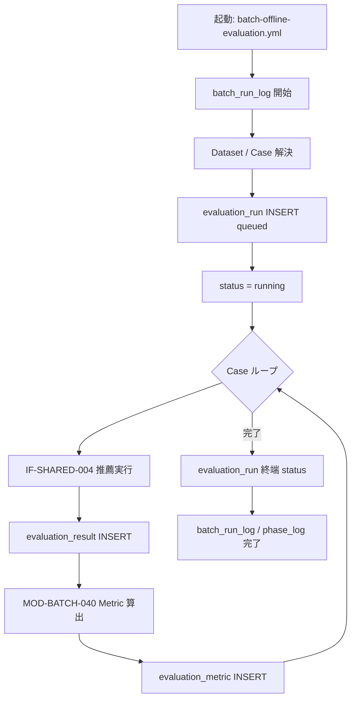

# BATCH-018 Offline Evaluationバッチ仕様書

## 1. ドキュメント情報

| 項目           | 内容                                |
| -------------- | ----------------------------------- |
| ドキュメントID | `BATCH-018`                         |
| ドキュメント名 | Offline Evaluationバッチ仕様書      |
| 対象システム   | Gift Recommendation Service / batch |
| MVP対象        | `△`（scaffold-first / Human 縦串着手承認済み） |
| 作成日         | 2026-07-21                          |
| 更新日         | 2026-07-21（§18.2 Human 承認反映） |

---

## 2. 概要

BATCH-018（Offline Evaluation Batch）は、評価データセット（`evaluation_dataset` / `evaluation_case`）を用いて推薦品質を評価し、**IF-SHARED-004** で evaluation mode 推薦を実行したうえで、メトリクスを算出し、**IF-DB-BATCH-018** により `evaluation_run` / `evaluation_result` / `evaluation_metric` へ **INSERT** する評価・改善系 Batch である。

| 出力テーブル | 単位 | 主目的 |
| ------------ | ---- | ------ |
| `evaluation_run` | Dataset × 評価実行 1 回 | 評価実行単位・version 固定・状態正本 |
| `evaluation_result` | Run × Case | ケース単位の実行結果正本 |
| `evaluation_metric` | Result × `metric_name` | Precision / Recall / NDCG / MRR 等の指標行（EAV） |

正本区分は **評価実行結果 / 指標（派生 Log）** である。Online 推薦本線の必須前提ではない（評価依存）。Public / Admin 評価画面は本仕様の対象外。Public API では Evaluation 系主キーを直接公開しない。

本 Batch は次を **行わない**。

| 対象 | 理由 |
| ---- | ---- |
| `evaluation_dataset` / `evaluation_case` の本番 seed・CRUD | 別 Task / 運用投入。本 Batch は読取のみ |
| `evaluation_run_log` 物理テーブルの新設 | **物理テーブルなし**。`evaluation_run` + `batch_run_log` / `phase_log` に読み替え（§2.3） |
| MOD-BATCH-042〜044（Feedback / Failure / Backlog）本格実装 | 将来・本仕様 out of scope |
| apps/reco 本体の破壊変更 / OpenAPI / migration | Epic forbidden。契約変更なしで消費可能な場合のみ API-INT-002 を参照 |
| Public / Admin 評価画面 | 画面系は別成果物 |
| BATCH-019 Feedback 分析の本格接続 | 任意評価依存。本 MVP scaffold では必須としない |

### 2.1 IF 対応

| IF ID | 名称 | 担当 / 役割 | 本 Batch での利用 |
| ----- | ---- | ----------- | ----------------- |
| **IF-DB-BATCH-018** | Evaluation保存 | **BATCH-018** | **本 Batch の物理書込 I/F**（`evaluation_run` / `evaluation_result` / `evaluation_metric` INSERT） |
| **IF-SHARED-004** | Offline Evaluation推薦実行 | batch → reco pipeline | **推薦実行 I/F**。MVP scaffold は **mock**（Human 確定）。実 HTTP / in-process は後続 |
| **IF-INT-002** / **API-INT-002** | Reco推薦実行 | Internal API | **契約変更なしで消費可能な場合のみ**。本 Epic では OpenAPI / 契約変更を行わない。Contract Gate **不要** |
| IF-OBS-001 / 002 / 003 | Phase / Error / Batch Run Log | Observability | `phase_log` / `error_log` / `batch_run_log` 記録（`owner_type=evaluation_run` 等） |

> **確定**: 物理書込正本は **IF-DB-BATCH-018**（Batch ID と IF 番号が一致）。
>
> **確定**: 推薦実行正本は **IF-SHARED-004**。API-INT-002 は IF-SHARED-004 の HTTP 実装候補であり、契約変更を伴う場合は別 Epic（本 Task では変更しない）。

### 2.2 IF-SHARED-004 / API-INT-002 境界（確定）

| 観点 | IF-SHARED-004 | API-INT-002（IF-INT-002） |
| ---- | ------------- | ------------------------- |
| 種別 | 共通ロジック IF（Python package / internal execution / internal API） | Internal HTTP API |
| 用途 | Offline Evaluation の推薦実行抽象 | reco への HTTP POST（`mode=evaluation`） |
| 本 Batch | **必須の論理 I/F** | HTTP 経路を採る場合のみ。**契約変更なし前提**で消費 |
| MVP scaffold | **mock**（実 reco / 実 HTTP なし。Human 確定） | 後続実装 Task で任意接続 |
| Contract Gate | — | **不要**（本 Epic で契約非変更） |

### 2.3 `evaluation_run_log` 読み替え（確定）

バッチ処理一覧の出力候補に `evaluation_run_log` とあるが、**物理テーブルは存在しない**。

| 一覧表記 | 正本の読み替え |
| -------- | -------------- |
| `evaluation_run_log` | **`evaluation_run`**（実行単位・状態） + **`batch_run_log`**（Batch 起動 trace） + **`phase_log`**（`owner_type=evaluation_run`） |

`evaluation_run_phase_log` 独立テーブルも MVP では作成しない（`evaluation_run` テーブル定義書 §5.6）。

識別子 Epic は **`[Epic]BATCH-018:Offline Evaluation Batch`（#1514）** を親とする。縦串は **仕様整備 → 実装 → UT → Epic PR（develop）**。MVP は △ だが Human により scaffold-first 縦串着手を明示承認済み。

---

## 3. 目的

| No | 目的 |
| -: | ---- |
| 1 | 有効 `evaluation_dataset` / `evaluation_case` を解決し、評価実行単位 `evaluation_run` を新規 INSERT する |
| 2 | **IF-SHARED-004** により Case 単位で evaluation mode 推薦を実行する（scaffold は mock 可） |
| 3 | Case 単位の `evaluation_result` と指標行 `evaluation_metric` を **IF-DB-BATCH-018** で INSERT する |
| 4 | Config / Model / Matching / Ranking version を Run に固定し、再現性を担保する |
| 5 | Online 推薦本線を変更せず、評価・改善の観測基盤（scaffold）を提供する |

---

## 4. バッチ基本情報

| 項目           | 内容 |
| -------------- | ---- |
| Batch ID       | `BATCH-018` |
| Batch名        | Offline Evaluation Batch |
| 処理種別       | 評価・改善 / Offline Evaluation |
| 実行基盤       | GitHub Actions。**独立子** `batch-offline-evaluation.yml`（`batch-offline-evaluation*.yml`）。週次親への接続は後続（§18.1 No.19） |
| 実装言語       | Python（`apps/batch`） |
| 起動方式       | `workflow_dispatch` / `workflow_call`（親から任意呼び出し）。独立 cron 本線必須ではない |
| 実行頻度       | 手動中心。リリース前 / 週次任意（スケジュール設計書）。MVP scaffold は手動 |
| 冪等性         | **Run は毎回新規 INSERT（非冪等）**。Result / Metric は Run 内 UNIQUE + INSERT のみ（§11） |
| 先行Batch      | 評価依存: `BATCH-013` / `BATCH-015` / `BATCH-016`（本番本線の必須先行ではない）。Dataset / Case 整備済みであること |
| 後続Batch      | **なし**（BATCH-019 は別系統。任意で 019→018 評価依存があり得るが本 MVP では必須としない） |
| MVP対象        | `△`（scaffold-first） |
| Contract Gate  | **不要**（HTTP API / OpenAPI を変更しない） |

実装パス想定: `apps/batch/src/batch/application/offline_evaluation/**`。  
reco 呼び出し抽象: `apps/batch/src/batch/infrastructure/reco_client/**`（IF-SHARED-004。scaffold は mock）。

`Batch ID` は `BATCH-*` を使用する。処理構成上の分類 ID（`BT-*`）および隣接 Batch の IF 番号を本成果物の識別子と混同しない。

### 4.1 モジュール対応

| モジュール（論理名） | 責務 | 区分 |
| -------------------- | ---- | ---- |
| Offline Evaluation Runner | Dataset / Case 解決、Run 作成、Case ループ、IF-SHARED-004 実行制御 | **MOD-BATCH-039**（正） |
| Evaluation Dataset Loader | Dataset / Case 読取 | **MOD-BATCH-039 の内部責務**（追加採番しない） |
| Reco Internal API Client / reco_client | IF-SHARED-004 実装（mock / HTTP / in-process） | インフラ。契約変更なし |
| Evaluation Metric Calculator | Precision / Recall / NDCG / MRR 等の算出 → Metric INSERT | **MOD-BATCH-040**（正） |
| Evaluation Result Writer | `evaluation_result` INSERT（および Writer 経由の Result 系書込） | **MOD-BATCH-041**（正） |
| Batch Logger / Error Handler | `batch_run_log` / `phase_log` / `error_log` | 共通（MOD-BATCH-045 / MOD-RECO-028/029 等） |

> **確定**: 本仕様の主モジュールは **MOD-BATCH-039 / 040 / 041**。
>
> **確定**: **MOD-BATCH-042〜044** は将来・本仕様 **out of scope**。

---

## 5. 実行条件

### 5.1 トリガー

| トリガー | 利用有無 | 条件 | 備考 |
| -------- | -------- | ---- | ---- |
| schedule（独立 cron） | **本線必須ではない** | — | 任意。MVP scaffold は手動中心 |
| workflow_dispatch | `true` | 手動・リリース前評価 | 独立子 `batch-offline-evaluation.yml` |
| workflow_call | `true`（設計上） | 週次親等からの任意呼び出し | **親接続は後続**（§18.1 No.19） |
| 先行Batch完了必須 | `false` | 評価依存のみ | 本番推薦の必須前提にしない |

### 5.2 実行前提

- `evaluation_dataset` / `evaluation_case` / `evaluation_run` / `evaluation_result` / `evaluation_metric` の DDL が適用済みであること。
- 対象 Dataset が存在し `is_active = true` であること（本番 seed は別 Task。UT は fixture 可）。
- 対象 Dataset に `is_active = true` の Case が 1 件以上あること（scaffold では fixture 最小件数で可）。
- version 4 列（`semantic_config_version_id` / `model_version_id` / `matching_config_id` / `ranking_config_id`）を解決できること（scaffold は固定 UUID / stub。§18.1 No.20）。
- IF-SHARED-004 実装（少なくとも mock）が利用可能であること。

### 5.3 起動パラメータ（想定）

| パラメータ | 必須 | 説明 |
| ---------- | ---- | ---- |
| `evaluation_dataset_id` | 推奨 | 対象 Dataset。未指定時は `dataset_name` + `dataset_version` で解決（実装 Task） |
| `dataset_name` / `dataset_version` | 任意 | ID 未指定時の解決キー |
| `max_cases` | 任意 | Case 件数上限（コスト制御）。scaffold 推奨 |
| `dry_run` | 任意 | DB 書込抑止フラグ（実装 Task。仕様上は任意） |

---

## 6. 入力

### 6.1 入力データ

| 入力 | 取得元 | 用途 |
| ---- | ------ | ---- |
| `evaluation_dataset` | DB SELECT | 対象 Dataset 解決・`is_active` 確認 |
| `evaluation_case` | DB SELECT（`is_active=true`） | Case 入力・`input_condition_json` / `expected_result_json` |
| Config / Model / Matching / Ranking version | Resolver / 起動入力 | Run INSERT 時に version 4 列を固定 |
| （任意）`batch_run_id` | `batch_run_log` | Evaluation Run と Batch 起動の LOGICAL 連携 |
| IF-SHARED-004 応答 | mock または reco | Case 単位の推薦結果（成功時 `recommendation_result_id`） |

### 6.2 Dataset / Case 読取ルール

| ルール | 内容 |
| ------ | ---- |
| Dataset | `is_active = true` のみ解決対象。無効は GRS-CFG / GRS-VAL 系で失敗またはスキップ（実装 Task） |
| Case | 親 Dataset 配下かつ `is_active = true` のみ実行 |
| seed | **本番 seed は別 Task**。本 Batch は読取のみ。UT fixture は許可 |
| `expected_result_json` | Metric 算出の期待。nullable の場合は当該 Case の一部 Metric をスキップし得る（§9） |

### 6.3 外部 API / LLM

| 種別 | MVP scaffold | 本格化時 |
| ---- | ------------ | -------- |
| IF-SHARED-004 | **mock**（外部 HTTP なし。Human 確定） | HTTP API-INT-002 消費、または in-process |
| Embedding / LLM 直接呼出 | **本 Batch からは行わない** | reco 側責務。batch は IF-SHARED-004 経由のみ |
| 楽天 API | 呼び出さない | — |

### 6.4 環境変数（名称のみ）

| 名称（例） | 用途 | 備考 |
| ---------- | ---- | ---- |
| `DATABASE_URL` 等 | DB 接続 | **実値を docs / コード / PR に書かない** |
| `RECO_INTERNAL_BASE_URL` 等 | HTTP 経路時の reco エンドポイント | scaffold mock では不要可 |
| 認証系 | Internal API 認証 | secret 実値禁止。GitHub Secrets 名のみ |

---

## 7. 出力

### 7.1 出力データ

| 出力 | 書込 IF | 操作 | 備考 |
| ---- | ------- | ---- | ---- |
| `evaluation_run` | **IF-DB-BATCH-018** | **INSERT**（毎回新規）＋状態 UPDATE（`queued`→`running`→終端） | 自然キー UNIQUE なし。再評価は新規 Run |
| `evaluation_result` | **IF-DB-BATCH-018** | **INSERT のみ**（UPDATE なし） | UNIQUE `(evaluation_run_id, evaluation_case_id)` |
| `evaluation_metric` | **IF-DB-BATCH-018** | **INSERT のみ**（UPDATE なし） | UNIQUE `(evaluation_result_id, metric_name)` |
| `batch_run_log` | IF-OBS-003 | INSERT / 更新 | Batch 起動単位 |
| `phase_log` | IF-OBS-001 | INSERT | `owner_type = evaluation_run` |
| `error_log` | IF-OBS-002 | INSERT | 失敗時。`owner_type = evaluation_run` |

### 7.2 後続への引き渡し

| 引き渡し先 | 内容 |
| ---------- | ---- |
| Observability / Admin（将来） | `evaluation_run_id` / Result / Metric 参照 |
| BATCH-019 | 本 MVP では必須接続なし |
| Online reco | **直接変更しない** |

---

## 8. 処理フロー

### 8.1 全体フロー



### 8.2 処理ステップ

| Step | 内容 | 主モジュール |
| ---- | ---- | ------------ |
| 1 | Batch Run 開始・入力 Validation | Logger / Runner |
| 2 | Dataset 解決・有効 Case 一覧取得 | MOD-BATCH-039 |
| 3 | version 4 列解決・`evaluation_run` INSERT（`queued`） | MOD-BATCH-039 |
| 4 | `evaluation_status = running`・`started_at` 設定 | MOD-BATCH-039 |
| 5 | Case ごとに IF-SHARED-004 実行（scaffold: mock） | MOD-BATCH-039 + reco_client |
| 6 | `evaluation_result` INSERT（失敗時も行可・`recommendation_result_id` nullable） | MOD-BATCH-041 |
| 7 | Metric 算出・`evaluation_metric` INSERT（算出失敗時は Metric 行なし + error_log） | MOD-BATCH-040 |
| 8 | Run 終端（`succeeded` / `failed` / `canceled`）・`completed_at` | MOD-BATCH-039 |
| 9 | phase_log / batch_run_log 完了 | Logger |

### 8.3 Case 単位シーケンス（要約）

```text
evaluation_case (is_active=true)
  → IF-SHARED-004 (mode=evaluation / evalCaseId)
  → recommendation_result（成功時）または失敗 trace
  → evaluation_result INSERT
  → expected_result_json と比較し metric 算出
  → evaluation_metric INSERT（指標ごと）
```

---

## 9. メトリクス算出ルール

### 9.1 MVP 初版メトリクス範囲（確定）

`evaluation_metric` テーブル定義書 §5.5 カタログを正とする。本仕様の **MVP scaffold 初版最小セット** は以下（§18.1 No.16）。

| `metric_name` | 採用 | 備考 |
| ------------- | ---- | ---- |
| `precision_at_10` | **初版採用** | K=10 |
| `recall_at_10` | **初版採用** | K=10 |
| `ndcg_at_10` | **初版採用** | K=10 |
| `mrr_at_10` | **初版採用** | K=10。一覧の「MMR」表記とは別概念（§9.3） |
| `hit_rate_at_10` | カタログあり・初版対象外 | 後続拡張 |
| `diversity_at_10` | カタログあり・初版対象外 | 後続拡張 |
| `risk_rate_at_10` | カタログあり・初版対象外 | 後続拡張 |
| `mmr_at_10` | カタログあり・初版対象外 | 一覧 BATCH-018 の MMR 関連。初版最小セット外 |

> **確定**（Human: 推奨案採用）: 初版は **`precision_at_10` / `recall_at_10` / `ndcg_at_10` / `mrr_at_10`** の最小 4 種。カタログ全部は過大約束を避け、後続で拡張する。

### 9.2 算出入力

| 入力 | 用途 |
| ---- | ---- |
| 推薦結果アイテム列（mock または `recommendation_result` 明細） | 予測リスト（上位 K） |
| `evaluation_case.expected_result_json` | 期待アイテム / 関連ラベル |
| `k=10` | MVP 既定（テーブル定義書 §5.5） |

`expected_result_json` が欠ける Case は、当該 Case の Metric INSERT をスキップし、Result 行と error / warning を残す方針を許容する（実装 Task でエラーコードと整合）。

### 9.3 一覧「MMR」と `mrr_at_10` / `mmr_at_10` の区別

| 表記 | 意味 | 本仕様 |
| ---- | ---- | ------ |
| `mrr_at_10` | Mean Reciprocal Rank | **初版最小セットに含む** |
| `mmr_at_10` | Maximal Marginal Relevance 系（カタログ） | 初版最小セット外 |
| 一覧の「MMR」 | 表記揺れの可能性 | 実装・Metric 名はカタログの `metric_name` を正とする |

### 9.4 INSERT 方針（Metric）

- 1 Result あたり、採用した各 `metric_name` を **別行** INSERT。
- UNIQUE `(evaluation_result_id, metric_name)`。二重 INSERT は制約で拒否。
- **UPDATE しない**。再評価は新規 Run → 新規 Result → 新規 Metric。
- 算出失敗（GRS-EVAL-004 等）時は Metric 行を作らず `error_log` に記録（Result 行は残してよい）。

---

## 10. 禁止操作

| 禁止 | 理由 |
| ---- | ---- |
| `evaluation_result` / `evaluation_metric` の UPDATE による上書き | テーブル定義・再評価は新規 Run |
| 同一 Run の再開 | 再評価は新規 Run INSERT |
| `evaluation_run_log` 物理テーブル新設 | 物理なし。§2.3 読み替え |
| Dataset / Case 本番 seed を本 Batch に混在 | 別 Task |
| OpenAPI / packages/contracts 変更 | Contract Gate 不要方針を崩す |
| apps/reco 破壊変更 | Epic forbidden |
| MOD-BATCH-042〜044 本格実装 | out of scope |
| secret / `.env` 実値の docs・PR・ログ出力 | security |
| Public / Admin 評価画面の本仕様への混入 | 画面非対象 |

---

## 11. 冪等性・再実行性

### 11.1 Run（非冪等）

| 観点 | 方針 |
| ---- | ---- |
| INSERT | **毎回新規** `evaluation_run` 行 |
| 自然キー UNIQUE | **なし**（同一 Dataset の複数 Run を許容） |
| 再実行 | 同一 Dataset に対する **新規 Run**。既存 Run は変更しない（状態遷移は当該 Run 内のみ） |

### 11.2 Result / Metric（Run 内 UNIQUE・INSERT のみ）

| テーブル | UNIQUE | 操作 |
| -------- | ------ | ---- |
| `evaluation_result` | `(evaluation_run_id, evaluation_case_id)` | **INSERT のみ・UPDATE なし** |
| `evaluation_metric` | `(evaluation_result_id, metric_name)` | **INSERT のみ・UPDATE なし** |

同一 Run 内の再 INSERT は UNIQUE 違反で失敗させる。部分再実行が必要な場合は **新規 Run** を起票する。

### 11.3 Run 状態 UPDATE（例外）

`evaluation_run.evaluation_status` / `started_at` / `completed_at` / `updated_at` の状態遷移 UPDATE は許可する（テーブル定義書）。これは Result/Metric の上書きとは別である。

### 11.4 Retention

| 対象 | 期間 | 備考 |
| ---- | ---- | ---- |
| `evaluation_run` / `evaluation_result` / `evaluation_metric` | **365 日**（`created_at`） | テーブル定義書。MVP 自動 DELETE なし |
| `phase_log` / `error_log` / `batch_run_log` | **90 日** Tier（Batch 系 Log 統一） | Run 本体より先に削除され得る |

---

## 12. 状態管理

| 状態 | 意味 |
| ---- | ---- |
| `queued` | Run INSERT 直後 |
| `running` | Case 評価実行中 |
| `succeeded` | 正常終了（Case 部分失敗方針は実装 Task。scaffold は全 Case 成功想定可） |
| `failed` | 実行失敗 |
| `canceled` | キャンセル |

フェーズ詳細は `phase_log`（`owner_type = evaluation_run`）。障害詳細は `error_log`。

想定 phase 例（アプリ validation。DB enum 未定義）:

| phase 例 | 内容 |
| -------- | ---- |
| `dataset_resolved` | Dataset / Case 解決完了 |
| `evaluation_started` | Run `running` |
| `case_evaluated` | Case 単位完了（集約でも可） |
| `metrics_written` | Metric INSERT 完了 |
| `evaluation_completed` | Run 終端 |

---

## 13. エラー・リトライ

| 区分 | 方針 |
| ---- | ---- |
| Dataset 不在 / 無効 | 起動失敗。新規 Run を作らない、または即 `failed`（実装 Task） |
| Case Validation 失敗 | GRS-EVAL-002 等。当該 Case 除外継続を許容（case 定義書） |
| IF-SHARED-004 / reco 失敗 | GRS-REC-*。Result 行は `recommendation_result_id=NULL` で残し得る |
| Metric 算出失敗 | GRS-EVAL-004。Metric 未作成 + error_log |
| Config 解決失敗 | GRS-CFG-* |
| リトライ | **同一 Run 再開禁止**。失敗後は新規 Run（必要なら `max_cases` 縮小） |
| workflow 再実行 | 独立子を手動再 dispatch |

---

## 14. ログ・監視

| ログ | 用途 |
| ---- | ---- |
| `batch_run_log` | BATCH-018 起動単位・件数・成否 |
| `phase_log` | Evaluation Run フェーズ（`owner_type=evaluation_run`） |
| `error_log` | 例外・Case / Metric 失敗 |
| `evaluation_run` | 評価実行状態正本（一覧の run_log 読み替え先） |

監視観点（scaffold）: 実行成否、Case 処理件数、Metric 行数、所要時間（子 workflow 想定 timeout 60 分）。

---

## 15. セキュリティ・外部サービス利用

| 観点 | 方針 |
| ---- | ---- |
| secret | API key / token / `.env` 実値をコード・docs・PR・ログに出さない |
| Public API | Evaluation 系を公開しない |
| Admin 評価画面 | **本仕様非対象** |
| PII | `metric_detail_json` に個人情報・過剰な商品明細を載せない |
| 外部呼出 | scaffold は mock。HTTP 経路時も Internal のみ・契約非変更 |

---

## 16. テスト観点

| No | 観点 | 種別 |
| -: | ---- | ---- |
| 1 | IF-DB-BATCH-018 で run / result / metric INSERT | unit / integration |
| 2 | IF-SHARED-004 が mock でも Case ループが完走する | unit |
| 3 | Run が毎回新規 INSERT（再実行で行が増える） | unit |
| 4 | Result UNIQUE `(run, case)`・UPDATE 経路なし | unit |
| 5 | Metric UNIQUE `(result, metric_name)`・UPDATE 経路なし | unit |
| 6 | `evaluation_run_log` 物理テーブルを作らない / 参照しない | review |
| 7 | 初版 Metric が §9.1 推奨セットに閉じる（過大約束なし） | review / unit |
| 8 | MOD-BATCH-042〜044 を実装・依存しない | review |
| 9 | Contract Gate 不要・OpenAPI 非変更 | review |
| 10 | Dataset/Case 本番 seed を本 Task に含めない。UT fixture 可 | review / unit |
| 11 | secret 非含有・Public / Admin 評価画面非対象 | review |
| 12 | 独立子 `batch-offline-evaluation.yml` 想定。週次親接続は後続 | review |
| 13 | Retention 365 日（Evaluation）/ Log 90 日が仕様上明記 | review |

---

## 17. 変更管理

| 日付 | 変更内容 | 関連 |
| ---- | -------- | ---- |
| 2026-07-21 | 初版作成 | Epic #1514 / Task #1515 |

---

## 18. 未決事項・決定事項

### 18.1 採用方針（確定）

| No | 論点 | 内容 | 状態 |
| -: | ---- | ---- | ---- |
| 1 | 物理書込 IF | **IF-DB-BATCH-018** = `evaluation_run` / `evaluation_result` / `evaluation_metric` INSERT | **確定** |
| 2 | 推薦実行 IF | **IF-SHARED-004** が論理正本。API-INT-002 は契約非変更で消費可能な場合のみ | **確定** |
| 3 | Contract Gate | **不要**（本 Epic で OpenAPI / 契約変更なし） | **確定** |
| 4 | `evaluation_run_log` | 物理なし。**`evaluation_run` + `batch_run_log` / `phase_log`** に読み替え | **確定** |
| 5 | Run 冪等 | **毎回新規 INSERT（非冪等）**。同一 Run 再開なし | **確定** |
| 6 | Result UNIQUE | `(evaluation_run_id, evaluation_case_id)`。**INSERT のみ・UPDATE なし** | **確定** |
| 7 | Metric UNIQUE | `(evaluation_result_id, metric_name)`。**INSERT のみ・UPDATE なし** | **確定** |
| 8 | モジュール | **MOD-BATCH-039 / 040 / 041**。042〜044 は out of scope | **確定** |
| 9 | MVP | **△ / scaffold-first**。Human 縦串着手承認済み | **確定** |
| 10 | workflow（本 Epic） | **独立子** `batch-offline-evaluation.yml` を正とする | **確定** |
| 11 | Dataset/Case seed | **本番 seed は別 Task**。UT fixture 可 | **確定** |
| 12 | Public / Admin 画面 | **非対象** | **確定** |
| 13 | secret | 実値禁止 | **確定** |
| 14 | Retention | Evaluation 系 **365 日**。Batch Log **90 日** | **確定**（テーブル定義） |
| 15 | 後続 Batch | 本線の必須後続なし。019 本格接続は別 | **確定** |
| 16 | 初版メトリクス | **最小 4 種** = `precision_at_10` / `recall_at_10` / `ndcg_at_10` / `mrr_at_10`。カタログ全部は後続 | **確定**（Human: 推奨案採用） |
| 17 | IF-SHARED-004 の MVP 実装形態 | scaffold は **mock**。実 HTTP API-INT-002 消費 / in-process は後続実装 Task | **確定**（Human: 推奨案採用） |
| 18 | Dataset/Case 本番 seed | **別 Task**（本 Epic / 本仕様どおり）。seed Task 起票タイミングは運用側 | **確定**（Human: 推奨案採用） |
| 19 | 週次親 workflow への任意接続 | **独立子のみ**。親 YAML 改修・接続は後続 | **確定**（Human: 推奨案採用） |
| 20 | version 4 列の scaffold 解決 | scaffold は **固定 stub UUID**。本格化で実 Resolver | **確定**（Human: 推奨案採用） |

### 18.2 Human 判断事項（残未決）

**残未決なし。** 旧 §18.2 No.1〜5 は Human により推奨案どおり確定し、§18.1 No.16〜20 へ移した（2026-07-21）。

---

## 19. 関連資料

| 種別 | パス |
| ---- | ---- |
| 一覧 | `docs/05_アプリケーション設計/アプリ/batch/バッチ処理一覧.md`（BATCH-018） |
| 方針 | `docs/05_アプリケーション設計/アプリ/batch/バッチ設計方針書.md` |
| スケジュール | `docs/05_アプリケーション設計/アプリ/batch/バッチ実行スケジュール設計書.md`（`batch-offline-evaluation.yml`） |
| 依存 | `docs/05_アプリケーション設計/アプリ/batch/バッチ依存関係図.md`（013/015/016 → 018 評価依存） |
| IF | `docs/05_アプリケーション設計/アプリ/インターフェース一覧.md`（IF-DB-BATCH-018 / IF-SHARED-004 / IF-INT-002） |
| モジュール | `docs/05_アプリケーション設計/アプリ/モジュール一覧.md`（MOD-BATCH-039 / 040 / 041） |
| DB | `evaluation_dataset` / `evaluation_case` / `evaluation_run` / `evaluation_result` / `evaluation_metric` 各テーブル定義書 |
| API（参照のみ） | `docs/06_実装設計/api/API-INT-002_Reco推薦実行API契約仕様書.md`（`mode=evaluation`。契約変更しない） |
| 章構成踏襲 | `docs/06_実装設計/batch/BATCH-017_Import Summary作成バッチ仕様書.md` |
| Epic | `prompts/definitions/epics/batch-018-offline-evaluation/epic.yaml` |

---

## 20. レビュー観点

- **IF-DB-BATCH-018** が本 Batch の物理書込 I/F（run / result / metric INSERT）として明記されている
- **IF-SHARED-004** が推薦実行 I/F であり、MVP scaffold は **mock**（Human 確定）と明記されている
- API-INT-002 は契約変更なし前提・**Contract Gate 不要**が明記されている
- 一覧の `evaluation_run_log` が物理なしとして **`evaluation_run` + `batch_run_log` / `phase_log`** に読み替えられている
- Run は毎回新規 INSERT（非冪等）。Result / Metric は UNIQUE + INSERT のみ・UPDATE なし
- **MOD-BATCH-039 / 040 / 041** が正。042〜044 が out of scope
- MVP △ / scaffold-first。初版メトリクス最小 4 種が §18.1 で確定されている
- 独立子 `batch-offline-evaluation.yml`。週次親接続は後続（§18.1 No.19）
- Dataset/Case 本番 seed は別 Task。UT fixture 可
- secret 禁止・Public / Admin 評価画面非対象
- §18.2 残未決なし（旧 No.1〜5 は §18.1 No.16〜20 へ移管済み）
- PR target が親 Epic Branch（`feature/epic-1514-batch-018-offline-evaluation`）である

---

## 21. 備考

### 21.1 Out of scope

| 対象 | 理由 |
| ---- | ---- |
| Python 実装・workflow YAML 本体・UT | 後続 Task |
| MOD-BATCH-042〜044 本格実装 | 将来 |
| Dataset/Case 本番 seed | 別 Task |
| 週次親 workflow 全体改修 | 後続（§18.1 No.19） |
| apps/reco / OpenAPI / migration | Epic forbidden |
| Public / Admin 評価画面 | 画面非対象 |
| BATCH-019 本格接続 | 別 Epic |

### 21.2 データフロー（要約）

```text
evaluation_dataset / evaluation_case（読取・seed は別 Task）
    ↓
BATCH-018 / MOD-BATCH-039
    → evaluation_run INSERT（毎回新規）
    → IF-SHARED-004（scaffold: mock）
    → evaluation_result INSERT（MOD-BATCH-041）
    → evaluation_metric INSERT（MOD-BATCH-040）
    ↓
Observability（batch_run_log / phase_log / error_log）
```

### 21.3 workflow 配置（設計上の想定）

| workflow | BATCH-018 の位置づけ | 備考 |
| -------- | -------------------- | ---- |
| `batch-offline-evaluation.yml`（新設想定） | **独立子**・dispatch / call | 本 Epic 実装の正 |
| 週次親 / 手動親 | 任意で `uses: batch-offline-evaluation.yml` | **接続は後続**（§18.1 No.19） |
| 日次本線 | 必須ステップにしない | 評価依存・本番非必須 |
