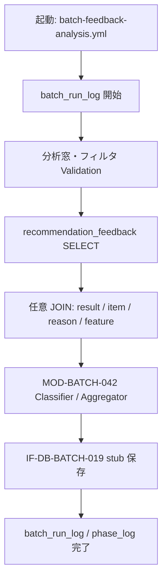

# BATCH-019 Feedback分析バッチ仕様書

## 1. ドキュメント情報

| 項目           | 内容                                |
| -------------- | ----------------------------------- |
| ドキュメントID | `BATCH-019`                         |
| ドキュメント名 | Feedback分析バッチ仕様書            |
| 対象システム   | Gift Recommendation Service / batch |
| MVP対象        | `△`（scaffold-first。出力テーブル物理未整備） |
| 作成日         | 2026-07-21                          |
| 更新日         | 2026-07-21（§18.2 Human 確定反映）  |

---

## 2. 概要

BATCH-019（Feedback分析Batch）は、Online 推薦フローで蓄積された `recommendation_feedback` を集計・分析し、Negative Feedback 傾向や改善候補を導出し、**IF-DB-BATCH-019** により `feedback_analysis_result` / `feedback_metric` 相当を保存する評価・改善系 Batch である。

| 出力（論理） | 単位（論理） | 主目的 |
| ------------ | ------------ | ------ |
| `feedback_analysis_result` | Feedback 単位または分析単位（論理ER） | 分析結果 JSON・`analysis_type`・`analyzed_at` |
| `feedback_metric` | 集計メトリクス単位（一覧・IF 上） | 傾向指標（件数・比率等）。**論理ER エンティティ未掲載** → scaffold・当面は `analysis_result_json` 内包（§18.1 No.17） |

正本区分は **分析派生 / 観測（派生 Log）** である。Online 推薦本線の必須前提ではない（分析系）。Public / Admin 分析画面は本仕様の対象外。Public API では Feedback 分析系主キーを直接公開しない。

### 2.1 出力テーブル物理未整備（確定）

| 観点 | 方針 |
| ---- | ---- |
| 論理 | `feedback_analysis_result` は論理ERに定義あり。`feedback_metric` はバッチ処理一覧・IF に登場するが論理ER §12 エンティティ表には未掲載 |
| 物理 ER | **MVP 62 テーブル対象外**（物理ER §2 No.7。`feedback_analysis_result` 優先度「低」） |
| テーブル定義書 / DDL | **未整備** |
| 本 Epic / 本仕様 | **scaffold-first**。**migration 禁止**（`supabase/migrations/**` 非変更） |
| 物理 DDL | **別 DB Task**（Human 確定。§18.1 No.18） |
| IF-DB-BATCH-019 | **論理契約**として確定。MVP scaffold の永続化は **in-memory / stub**（実 INSERT は物理整備後） |

### 2.2 IF 対応

| IF ID | 名称 | 担当 / 役割 | 本 Batch での利用 |
| ----- | ---- | ----------- | ----------------- |
| **IF-DB-BATCH-019** | Feedback分析結果保存 | **BATCH-019** | **本 Batch の分析結果保存 I/F（論理契約）**。対象: `feedback_analysis_result` / `feedback_metric`。物理未整備時は stub |
| **IF-DB-API-002** | Feedback保存 | api → `recommendation_feedback` | **入力の書込正本（api）**。本 Batch は **SELECT のみ**（更新しない） |
| IF-OBS-001 / 002 / 003 | Phase / Error / Batch Run Log | Observability | `phase_log` / `error_log` / `batch_run_log`（scaffold でも Logger 経路を想定） |
| IF-SHARED-* | 共通ロジック | — | **本 Batch では不使用**（DB 完結。IF-SHARED なし） |

> **確定**: 分析結果保存の論理正本は **IF-DB-BATCH-019**（Batch ID と IF 番号が一致）。
>
> **確定**: 入力 Feedback の書込正本は **IF-DB-API-002**（api）。本 Batch は読取のみ。
>
> **確定**: Contract Gate **不要**（OpenAPI / packages/contracts 非変更）。

### 2.3 `feedback_analysis_status` 読み替え（確定・§18.1 No.21）

バッチ処理一覧の状態候補に `feedback_analysis_status` とあるが、**専用物理テーブル / 専用 status 列は作らない**（Human 確定）。

| 一覧表記 | 読み替え（確定） |
| -------- | ---------------- |
| `feedback_analysis_status` | **`batch_run_log`**（Batch 起動単位の成否）+ **`phase_log`**（分析フェーズ。`owner_type` は実装 Task で確定。例: `batch_run`） |

### 2.4 識別子混同禁止（確定）

| 識別子 | 意味 | 本仕様での扱い |
| ------ | ---- | -------------- |
| **BATCH-019** | Feedback分析Batch（本 Batch） | **本成果物の識別子** |
| **MOD-BATCH-019** | Raw Product Reader（BATCH-005 系） | **別物。混同禁止** |
| **MOD-BATCH-042** | Feedback Analyzer | **本 Batch の主モジュール** |
| **MOD-BATCH-043 / 044** | Failure Analyzer / Improvement Backlog Generator | **本仕様 out of scope**（018 と同方針） |

識別子 Epic は **`[Epic]BATCH-019:Feedback分析Batch`（#1522）** を親とする。縦串は **仕様整備 → 実装 → UT → Epic PR（develop）**。MVP は △。出力物理未整備のため **scaffold-first・migration 非含有**。

本 Batch は次を **行わない**。

| 対象 | 理由 |
| ---- | ---- |
| `recommendation_feedback` の UPDATE / 分析結果の Feedback 行への書戻し | Feedback 定義書・テーブル定義書。分析は派生テーブル側 |
| `feedback_analysis_result` / `feedback_metric` の物理 DDL / migration | 別 DB Task。本 Epic forbidden |
| MOD-BATCH-043 / 044 本格実装・自動 Issue 起票 | out of scope |
| OpenAPI / apps/reco / apps/api / apps/web 破壊変更 | Epic forbidden |
| Public / Admin 分析画面 | 画面系は別成果物 |
| BATCH-018 への本格接続（必須） | 任意評価依存。本 MVP scaffold では必須としない |

---

## 3. 目的

| No | 目的 |
| -: | ---- |
| 1 | 蓄積済み `recommendation_feedback` を期間・種別等で解決し、集計・分類する |
| 2 | Negative Feedback 傾向（`feedback_type` / rating / target 等）を分析する |
| 3 | **IF-DB-BATCH-019** 論理契約に沿い、`feedback_analysis_result` / `feedback_metric` 相当を保存する（scaffold は in-memory / stub） |
| 4 | Observability（`batch_run_log` / `phase_log` / `error_log`）で実行を追跡する |
| 5 | Online 推薦本線を変更せず、改善・評価の観測基盤（scaffold）を提供する |

---

## 4. バッチ基本情報

| 項目           | 内容 |
| -------------- | ---- |
| Batch ID       | `BATCH-019` |
| Batch名        | Feedback分析Batch |
| 処理種別       | 評価・改善 / Feedback 分析 |
| 実行基盤       | GitHub Actions。**独立子** `batch-feedback-analysis.yml`（`batch-feedback-analysis*.yml`）。週次親への接続は後続（§18.1） |
| 実装言語       | Python（`apps/batch`） |
| 起動方式       | `workflow_dispatch` / `workflow_call`（親から任意呼び出し）。独立 cron は設計上可だが、MVP scaffold は手動中心 |
| 実行頻度       | Feedback 蓄積後に週次任意（スケジュール設計書）。MVP scaffold は手動 |
| 冪等性         | 一覧候補: `aggregation_scope + period + feedback_type + semantic_config_version_id`。scaffold 方針は §11 / §18 |
| 先行条件       | Feedback 蓄積（api / IF-DB-API-002）。本番推薦 Batch の必須後続ではない |
| 後続Batch      | **任意**: BATCH-018（評価依存）。必須後続なし。改善 Batch（043/044）は本仕様外 |
| MVP対象        | `△`（scaffold-first） |
| Contract Gate  | **不要**（HTTP API / OpenAPI を変更しない） |

実装パス想定: `apps/batch/src/batch/application/feedback_analysis/**`。

`Batch ID` は `BATCH-*` を使用する。処理構成上の分類 ID（`BT-*`）および **MOD-BATCH-019（Raw Product Reader）** を本成果物の識別子と混同しない。

### 4.1 モジュール対応

| モジュール（論理名） | 責務 | 区分 |
| -------------------- | ---- | ---- |
| Feedback Analyzer | Feedback 解決、集計・分析オーケストレーション、IF-DB-BATCH-019 呼び出し | **MOD-BATCH-042**（正） |
| Feedback Metric Aggregator | 件数・比率等のメトリクス集計 | **MOD-BATCH-042 の内部責務**（追加採番しない） |
| Negative Feedback Classifier | Negative 系 `feedback_type` / rating 等の分類 | **MOD-BATCH-042 の内部責務**（追加採番しない） |
| Batch Logger / Error Handler | `batch_run_log` / `phase_log` / `error_log` | 共通（MOD-BATCH-045 / MOD-RECO-028/029 等） |

> **確定**: 本仕様の主モジュールは **MOD-BATCH-042**。
>
> **確定**: Feedback Metric Aggregator / Negative Feedback Classifier は **042 内部責務**（043/044 への採番・分離はしない）。
>
> **確定**: **MOD-BATCH-043 / 044** は将来・本仕様 **out of scope**。

---

## 5. 実行条件

### 5.1 トリガー

| トリガー | 利用有無 | 条件 | 備考 |
| -------- | -------- | ---- | ---- |
| schedule（独立 cron） | 設計上可・**本線必須ではない** | Feedback 蓄積後 | MVP scaffold は手動中心 |
| workflow_dispatch | `true` | 手動・週次任意 | 独立子 `batch-feedback-analysis.yml` |
| workflow_call | `true`（設計上） | 週次親等からの任意呼び出し | **親接続は後続**（§18.1） |
| 先行Batch完了必須 | `false` | Feedback 蓄積のみ | 本番推薦の必須前提にしない |

### 5.2 実行前提

- `recommendation_feedback` の DDL が適用済みであること（入力正本。テーブル定義書あり）。
- 分析対象期間に Feedback が 0 件でも **起動自体は成功し得る**（空集計・スキップ方針は実装 Task。scaffold は fixture 可）。
- 出力テーブル物理 DDL は **不要**（scaffold は in-memory / stub）。物理書込本格化は別 DB Task 完了後。
- Observability 用 `batch_run_log` / `phase_log` / `error_log` の利用方針に従えること（既存共通）。

### 5.3 起動パラメータ（想定）

| パラメータ | 必須 | 説明 |
| ---------- | ---- | ---- |
| `period_start` / `period_end` | 推奨 | 分析窓（UTC またはアプリ規約。実装 Task） |
| `aggregation_scope` | 任意 | 一覧冪等キー要素。例: `weekly` / `manual`（§11） |
| `feedback_types` | 任意 | 対象 `feedback_type` フィルタ。未指定時は全 enabled 値 |
| `semantic_config_version_id` | 任意 | JOIN / 集計キー。未指定時は stub / NULL 方針（§18） |
| `dry_run` | 任意 | 永続化抑止（stub でもログのみ等。実装 Task） |
| `max_feedback_rows` | 任意 | 件数上限（コスト制御）。scaffold 推奨 |

---

## 6. 入力

### 6.1 入力データ

| 入力 | 取得元 | 用途 |
| ---- | ------ | ---- |
| `recommendation_feedback` | DB **SELECT**（IF-DB-API-002 書込済み） | 主入力。集計・分類 |
| `recommendation_result` | DB SELECT（任意） | Result 文脈の補足 JOIN |
| `recommendation_result_item` | DB SELECT（任意） | Item 対象 Feedback の補足 |
| `recommendation_reason` | DB SELECT（任意） | Reason 対象 Feedback の補足（一覧の reason） |
| `item_feature` | DB SELECT（任意） | Feature 傾向との突合（高度分析。scaffold は省略可） |
| （任意）`batch_run_id` | `batch_run_log` | 起動 trace |

> **確定**: 本 Batch は `recommendation_feedback` を **更新しない**（分析結果は派生側 / stub）。

### 6.2 Feedback 読取ルール

| ルール | 内容 |
| ------ | ---- |
| 期間 | `submitted_at`（または `created_at` 相当）が分析窓内 |
| 種別 | `feedback_type` は `packages/code-definitions/application/feedback_type.yaml` の enabled 値を正とする |
| Negative 判定（初版） | 例: `item_bad` / `item_not_match` / `item_ng_violation` / `item_avoid_match` / `reason_bad` / `result_bad`、および低 `feedback_rating`（閾値は実装 Task で仮置き可。本格化前に Human 確認。§18.1 No.22） |
| 個人情報 | `session_id` は分析キーに使ってよいが、ログ・stub 出力に過剰な原文コメントを載せない |
| 任意 JOIN | result / item / reason / feature は **SELECT 参照のみ**。欠落時は当該次元をスキップして集計継続を許容 |

### 6.3 外部 API / LLM

| 種別 | MVP scaffold | 本格化時 |
| ---- | ------------ | -------- |
| 外部 HTTP / LLM | **呼び出さない**（DB 完結） | 高度分類で LLM を使う場合は別 Task・別判断 |
| 楽天 API / Embedding API | 呼び出さない | — |
| reco Internal API | 呼び出さない | BATCH-018 側 |

### 6.4 環境変数（名称のみ）

| 名称（例） | 用途 | 備考 |
| ---------- | ---- | ---- |
| `DATABASE_URL` 等 | DB 接続（入力 SELECT） | **実値を docs / コード / PR に書かない** |
| 認証系 | DB / Hosting | secret 実値禁止。GitHub Secrets 名のみ |

---

## 7. 出力

### 7.1 出力データ（論理契約）

| 出力 | 書込 IF | 操作（論理） | MVP scaffold | 備考 |
| ---- | ------- | ------------ | ------------ | ---- |
| `feedback_analysis_result` | **IF-DB-BATCH-019** | INSERT（論理）。論理ER: `recommendation_feedback_id`, `analysis_type`, `analysis_result_json`, `analyzed_at` | **in-memory / stub** | 物理 DDL 未整備 |
| `feedback_metric` | **IF-DB-BATCH-019** | INSERT（論理） | **in-memory / stub** または `analysis_result_json` 内包（§18） | 論理ER 未掲載。物理方針は Human |
| `batch_run_log` | IF-OBS-003 | INSERT / 更新 | 実 DB（既存）可 | Batch 起動単位 |
| `phase_log` | IF-OBS-001 | INSERT | 実 DB（既存）可 | 分析フェーズ |
| `error_log` | IF-OBS-002 | INSERT | 実 DB（既存）可 | 失敗時 |

### 7.2 論理ER上の `feedback_analysis_result`

論理ER §12:

| 属性 | 意味 |
| ---- | ---- |
| `feedback_analysis_result_id` | 主キー |
| `recommendation_feedback_id` | 対象 Feedback（論理） |
| `analysis_type` | 分析種別 |
| `analysis_result_json` | 分析結果ペイロード |
| `analyzed_at` | 分析時刻 |

一覧の冪等キー（集計スコープ系）と、論理ERの **Feedback 単位行** は粒度が異なる。集計メトリクスは `feedback_metric`（または JSON 内包）側で表現する（§18）。

### 7.3 後続への引き渡し

| 引き渡し先 | 内容 |
| ---------- | ---- |
| Observability / 運用（将来） | 分析結果・メトリクス参照 |
| BATCH-018 | **任意**評価依存。本 MVP scaffold では必須接続なし |
| MOD-BATCH-043 / 044 | **本仕様外**。将来の Failure / Backlog |
| Online reco | **直接変更しない**（Ranking 即時反映なし） |

---

## 8. 処理フロー

### 8.1 全体フロー



### 8.2 処理ステップ

| Step | 内容 | 主モジュール |
| ---- | ---- | ------------ |
| 1 | Batch Run 開始・入力 Validation（期間・件数上限） | Logger / Analyzer |
| 2 | `recommendation_feedback` SELECT（分析窓） | MOD-BATCH-042 |
| 3 | 任意で result / item / reason / feature を SELECT 参照 | MOD-BATCH-042 |
| 4 | Negative Feedback 分類（Classifier 内部責務） | MOD-BATCH-042 |
| 5 | メトリクス集計（Aggregator 内部責務） | MOD-BATCH-042 |
| 6 | IF-DB-BATCH-019 へ結果保存（scaffold: in-memory / stub） | MOD-BATCH-042 |
| 7 | phase_log / batch_run_log 完了 | Logger |

### 8.3 データフロー（要約）

```text
recommendation_feedback（SELECT・api 書込正本）
  →（任意）recommendation_result / item / reason / item_feature SELECT
  → MOD-BATCH-042（分類・集計）
  → IF-DB-BATCH-019（論理）
       scaffold: in-memory / stub
       本格化: feedback_analysis_result / feedback_metric 物理 INSERT（別 DB Task 後）
  → Observability（batch_run_log / phase_log / error_log）
```

---

## 9. 分析・メトリクスルール（初版）

### 9.1 MVP scaffold 初版範囲（推奨）

過大約束を避け、scaffold では以下に閉じる。

| 観点 | 初版 | 備考 |
| ---- | ---- | ---- |
| 件数集計 | `feedback_type` 別件数 | `feedback_type.yaml` 正 |
| Negative 比率 | Negative 件数 / 総件数 | 分類ルールは §6.2 |
| target 別 | `feedback_target_type` 別件数 | result / item / reason |
| rating 分布 | `feedback_rating` 1〜5 ヒストグラム | 任意 |
| Feature 突合 | **初版対象外可** | `item_feature` JOIN は後続 |

### 9.2 `analysis_type`（論理・例）

物理 DDL 未整備のため、scaffold の論理値例のみ示す（確定は実装 / DB Task）。

| 例 | 意味 |
| -- | ---- |
| `negative_trend` | Negative 傾向サマリ |
| `type_breakdown` | `feedback_type` 内訳 |
| `period_aggregate` | 期間集計 |

### 9.3 `feedback_metric` の扱い

| 案 | 内容 | 利点 | 欠点 |
| -- | ---- | ---- | ---- |
| A | **独立テーブル** `feedback_metric`（evaluation_metric 類似の EAV） | IF・一覧と一致。クエリしやすい | 論理ER追記・DDL が増える |
| B | **`analysis_result_json` 内包**のみ（独立テーブルなし） | 物理対象を最小化 | IF 表記の `feedback_metric` と差分。一覧更新が必要になり得る |

**確定（Human: 推奨案採用）**: scaffold・当面は **B（JSON 内包）** で論理契約を満たす。本格化で A を採るなら別 DB Task で独立テーブル化する（§18.1 No.17）。

---

## 10. 禁止操作

| 禁止 | 理由 |
| ---- | ---- |
| `supabase/migrations/**` 変更・出力テーブル物理 DDL 本整備 | Epic forbidden。別 DB Task |
| `recommendation_feedback` への分析結果書戻し / 不要 UPDATE | Feedback 正本は api。分析は派生 |
| OpenAPI / packages/contracts 変更 | Contract Gate 不要方針を崩す |
| apps/reco / apps/api / apps/web 破壊変更 | Epic forbidden |
| MOD-BATCH-043 / 044 本格実装・自動 Issue 起票 | out of scope |
| MOD-BATCH-019（Raw Product Reader）実装の混入 | 識別子混同 |
| secret / `.env` 実値の docs・PR・ログ出力 | security |
| Public / Admin 分析画面の本仕様への混入 | 画面非対象 |
| 本番 Feedback への破壊的 DELETE | 危険操作 |

---

## 11. 冪等性・再実行性

### 11.1 一覧の冪等キー候補（正本からの引用）

バッチ処理一覧 BATCH-019:

```text
aggregation_scope + period + feedback_type + semantic_config_version_id
```

| 要素 | 意味（解釈） |
| ---- | ------------ |
| `aggregation_scope` | 集計スコープ（例: weekly / manual） |
| `period` | 分析窓（開始・終了の正規化表現） |
| `feedback_type` | メトリクス行の種別キー（集計次元） |
| `semantic_config_version_id` | 設定 version。JOIN しない初版では stub / NULL 方針可 |

### 11.2 scaffold 方針（確定・§18.1 No.20 / No.23）

| 観点 | 方針（Human 確定） |
| ---- | ------------------ |
| 物理 UNIQUE | **未整備**のため DB 制約に依存しない |
| stub 永続化 | 実行都度 **新規分析結果オブジェクト**を生成（都度新規 stub） |
| 本格化時 | 一覧キーでの **UPSERT** を第一候補 |
| 再実行 | workflow 再 dispatch。stub は上書きまたは履歴追加（実装 Task） |

> **確定（§18.1 No.23）**: 論理ERの Feedback 単位行（`recommendation_feedback_id`）と一覧の集計キーは粒度が異なる。本格 DDL 時は **結果行は Feedback 単位**、**メトリクスは集計キー**（案 B なら JSON 内包）とする。

### 11.3 Retention（参照）

| 対象 | 期間 | 備考 |
| ---- | ---- | ---- |
| `recommendation_feedback` | **365 日**（入力。保持方針書） | 本 Batch は削除しない |
| 出力テーブル | 物理未整備 | DDL Task で Evaluation 系に準ずる案（365 日）を推奨し得る |
| `phase_log` / `error_log` / `batch_run_log` | **90 日** Tier | 既存方針 |

---

## 12. 状態管理

| 状態の置き場 | 意味 |
| ------------ | ---- |
| `batch_run_log` | BATCH-019 起動単位の開始・終了・成否 |
| `phase_log` | 分析フェーズ（`feedback_analysis_status` 読み替え先候補） |
| `error_log` | 例外・Validation 失敗 |
| 専用 `feedback_analysis_status` | **物理なし**（新設しない。§18.1 No.21） |

想定 phase 例（アプリ validation。DB enum 未定義）:

| phase 例 | 内容 |
| -------- | ---- |
| `feedback_resolved` | SELECT・件数確定 |
| `classified` | Negative 分類完了 |
| `aggregated` | メトリクス集計完了 |
| `analysis_persisted` | IF-DB-BATCH-019 stub / 保存完了 |
| `analysis_completed` | Batch 終端 |

---

## 13. エラー・リトライ

| 区分 | 方針 |
| ---- | ---- |
| 入力 Validation 失敗（期間不正等） | GRS-VAL-*。起動失敗。stub 保存しない |
| DB SELECT 一時失敗 | GRS-DB-*。短時間リトライ可（実装 Task） |
| Feedback 0 件 | 空結果で成功、または skip（実装 Task。scaffold は成功 + 空 stub 可） |
| JOIN 欠落 | 当該次元スキップ継続。必要なら warning + error_log |
| stub 保存失敗 | GRS-BAT-* / GRS-DB-*。Run failed |
| リトライ | 同一起動の途中再開より、**workflow 再実行**を基本 |
| LLM / 外部 API | 本 Batch では対象外 |

---

## 14. ログ・監視

| ログ | 用途 |
| ---- | ---- |
| `batch_run_log` | BATCH-019 起動単位・件数・成否 |
| `phase_log` | 分析フェーズ（status 読み替え） |
| `error_log` | Validation / DB / stub 失敗 |
| stub 出力（アプリ内） | scaffold 検証用。secret / PII を載せない |

監視観点（scaffold）: 実行成否、読取 Feedback 件数、分類件数、所要時間（子 workflow 想定 timeout 30〜60 分）。

---

## 15. セキュリティ・外部サービス利用

| 観点 | 方針 |
| ---- | ---- |
| secret | API key / token / `.env` 実値をコード・docs・PR・ログに出さない |
| Public API | Feedback 分析系を公開しない |
| Admin 分析画面 | **本仕様非対象** |
| PII | `feedback_text` / `session_id` を stub・メトリクスに過剰転記しない。集計は集約値中心 |
| 外部呼出 | scaffold は **なし**（DB 完結） |

---

## 16. テスト観点

| No | 観点 | 種別 |
| -: | ---- | ---- |
| 1 | IF-DB-BATCH-019 が論理契約として定義され、scaffold が in-memory / stub である | unit / review |
| 2 | `recommendation_feedback` を UPDATE しない（SELECT のみ） | unit |
| 3 | migration / 出力物理 DDL を含まない | review |
| 4 | MOD-BATCH-042 が正。Aggregator / Classifier が内部責務 | review |
| 5 | MOD-BATCH-043 / 044 を実装・依存しない | review |
| 6 | MOD-BATCH-019（Raw Reader）と混同する記述・実装がない | review |
| 7 | 独立子 `batch-feedback-analysis.yml`。親接続は後続 | review |
| 8 | Contract Gate 不要・OpenAPI 非変更 | review |
| 9 | secret 非含有・Public / Admin 画面非対象 | review |
| 10 | §18.2 残未決なし（旧 Human 推奨案は §18.1 No.17〜23 で確定） | review |
| 11 | 冪等キー候補（一覧）と scaffold 方針（都度新規 stub / 本格化 UPSERT 第一候補）が明記されている | review |
| 12 | `feedback_analysis_status` 読み替え（`batch_run_log` / `phase_log`。専用なし）が明記されている | review |

---

## 17. 変更管理

| 日付 | 変更内容 | 関連 |
| ---- | -------- | ---- |
| 2026-07-21 | 初版作成 | Epic #1522 / Task #1523 |
| 2026-07-21 | §18.2 No.1〜7 を Human 確定（推奨案採用）。§18.1 No.17〜23 へ移管し §18.2 を解消 | Epic #1522 / Task #1523 |

---

## 18. 未決事項・決定事項

### 18.1 採用方針（確定）

| No | 論点 | 内容 | 状態 |
| -: | ---- | ---- | ---- |
| 1 | 分析結果保存 IF | **IF-DB-BATCH-019** = `feedback_analysis_result` / `feedback_metric` の**論理契約** | **確定** |
| 2 | 物理 DDL | **未整備**。本 Epic は **migration 禁止**。物理は **別 DB Task** | **確定** |
| 3 | scaffold 永続化 | IF-DB-BATCH-019 実装は **in-memory / stub** | **確定** |
| 4 | 入力 | **`recommendation_feedback` SELECT**（DDL あり）。書込は IF-DB-API-002（api） | **確定** |
| 5 | 任意参照 | result / item / reason / feature は SELECT 可。必須ではない | **確定** |
| 6 | Contract Gate | **不要**（OpenAPI 非変更） | **確定** |
| 7 | モジュール | **MOD-BATCH-042**。Aggregator / Classifier は内部責務 | **確定** |
| 8 | 043 / 044 | **out of scope** | **確定** |
| 9 | 識別子 | **MOD-BATCH-019 ≠ BATCH-019** | **確定** |
| 10 | MVP | **△ / scaffold-first** | **確定** |
| 11 | workflow（本 Epic） | **独立子** `batch-feedback-analysis.yml` を正とする | **確定** |
| 12 | 週次親接続 | **後続**（本仕様では独立子のみ） | **確定** |
| 13 | Public / Admin 画面 | **非対象** | **確定** |
| 14 | secret | 実値禁止 | **確定** |
| 15 | Feedback 行への書戻し | **禁止**（分析は派生 / stub） | **確定** |
| 16 | IF-SHARED | **本 Batch では不使用**（DB 完結） | **確定** |
| 17 | `feedback_metric` の物理化 | scaffold・当面は **B（`analysis_result_json` 内包のみ）**。本格化で A を採るなら別 DB Task | **確定**（Human: 推奨案採用） |
| 18 | 出力物理 DDL | **別 DB Task**（本 Epic 内 migration 禁止。Epic 方針どおり） | **確定**（Human: 推奨案採用） |
| 19 | MOD-BATCH-043 を本 Epic に含めるか | **外す**（out of scope。§18.1 No.8 と一致） | **確定**（Human: 推奨案採用） |
| 20 | 冪等 | scaffold は **都度新規 stub**。本格化は一覧キー **UPSERT** を第一候補 | **確定**（Human: 推奨案採用） |
| 21 | `feedback_analysis_status` 正本 | **`batch_run_log` + `phase_log` 読み替え**（専用列・テーブルは作らない） | **確定**（Human: 推奨案採用） |
| 22 | Negative 判定の rating 閾値 | 実装 Task で仮置き可。本格化前に Human 確認 | **確定**（Human: 推奨案採用） |
| 23 | 論理ER Feedback 単位 vs 一覧集計キー | 結果行は Feedback 単位、メトリクスは集計キー（案 B なら JSON） | **確定**（Human: 推奨案採用） |

### 18.2 Human 判断事項（残未決）

**残未決なし。** 旧 §18.2 No.1〜7 は Human により推奨案どおり確定し、§18.1 No.17〜23 へ移した（2026-07-21）。

---

## 19. 関連資料

| 種別 | パス |
| ---- | ---- |
| 一覧 | `docs/05_アプリケーション設計/アプリ/batch/バッチ処理一覧.md`（BATCH-019） |
| 方針 | `docs/05_アプリケーション設計/アプリ/batch/バッチ設計方針書.md` |
| スケジュール | `docs/05_アプリケーション設計/アプリ/batch/バッチ実行スケジュール設計書.md`（`batch-feedback-analysis.yml`） |
| 依存 | `docs/05_アプリケーション設計/アプリ/batch/バッチ依存関係図.md`（Feedback蓄積 → 019 → 任意 018） |
| IF | `docs/05_アプリケーション設計/アプリ/インターフェース一覧.md`（IF-DB-BATCH-019 / IF-DB-API-002） |
| モジュール | `docs/05_アプリケーション設計/アプリ/モジュール一覧.md`（MOD-BATCH-042 / 043 / 044。MOD-BATCH-019 注意） |
| 入力 DB | `docs/06_実装設計/database/recommendation_feedback_テーブル定義書.md` |
| 論理ER | `docs/05_アプリケーション設計/アプリ/database/論理ER.md`（`feedback_analysis_result`） |
| 物理ER | `docs/06_実装設計/database/物理ER.md`（出力 MVP 対象外） |
| code定義 | `packages/code-definitions/application/feedback_type.yaml` |
| 章構成踏襲 | `docs/06_実装設計/batch/BATCH-018_Offline Evaluationバッチ仕様書.md` |
| Epic | `prompts/definitions/epics/batch-019-feedback-analysis/epic.yaml` |

---

## 20. レビュー観点

- **IF-DB-BATCH-019** が分析結果保存の**論理契約**であり、物理未整備時は **in-memory / stub** と明記されている
- 入力は **`recommendation_feedback`（DDL あり）**。出力物理未整備・**migration 禁止**・**別 DB Task** が明記されている
- **`feedback_metric`** は scaffold・当面 **JSON 内包（案 B）** で確定している（§18.1 No.17）
- **MOD-BATCH-042** が正。Aggregator / Classifier は内部責務。**043 / 044 は out of scope**
- **MOD-BATCH-019 ≠ BATCH-019** が明記されている
- 冪等キー候補（一覧）と scaffold **都度新規 stub** / 本格化 **UPSERT 第一候補**が §11 / §18.1 No.20 にある
- **`feedback_analysis_status`** は専用なし・**`batch_run_log` / `phase_log` 読み替え**で確定（§18.1 No.21）
- 独立子 **`batch-feedback-analysis.yml`**。親接続は後続
- Contract Gate 不要・secret 禁止
- §18.2 残未決なし（旧 No.1〜7 は §18.1 No.17〜23 へ移管済み）
- PR target が親 Epic Branch（`feature/epic-1522-batch-019-feedback-analysis`）である

---

## 21. 備考

### 21.1 Out of scope

| 対象 | 理由 |
| ---- | ---- |
| Python 実装・workflow YAML 本体・UT | 後続 Task |
| 出力テーブル物理 DDL / migration | 別 DB Task |
| MOD-BATCH-043 / 044 本格実装 | 将来 |
| 週次親 workflow 全体改修 | 後続（§18.1 No.12） |
| apps/reco / apps/api / apps/web / OpenAPI | Epic forbidden |
| Public / Admin 分析画面 | 画面非対象 |
| BATCH-018 必須接続 | 任意依存のみ |

### 21.2 workflow 配置（設計上の想定）

| workflow | BATCH-019 の位置づけ | 備考 |
| -------- | -------------------- | ---- |
| `batch-feedback-analysis.yml`（新設想定） | **独立子**・dispatch / call | 本 Epic 実装の正 |
| 週次親 / 手動親 | 任意で `uses: batch-feedback-analysis.yml` | **接続は後続** |
| 日次本線 | 必須ステップにしない | 分析系・本番非必須 |

### 21.3 Epic allowed_paths（参照）

本 Task の成果物配置は Epic `epic_scope.allowed_paths` に従う。

- `docs/06_実装設計/batch/BATCH-019_*`
- `prompts/definitions/tasks/batch-019-feedback-analysis/**`
- `prompts/definitions/reviews/batch-019-feedback-analysis/**`
