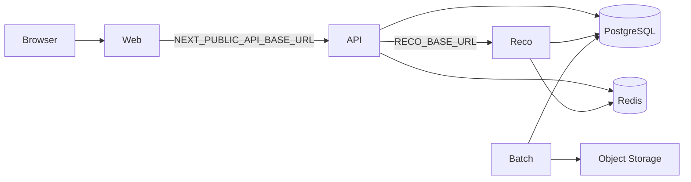

## 1. 目的

本ドキュメントは、Gift Recommendation Service の**ローカル開発環境**を構築・起動・疎通確認する手順の正本とする。

以下を開発者が迷わず実行できる状態を目指す。

- 初回セットアップ（リポジトリ取得、依存関係、`.env` 作成）
- 外部依存（PostgreSQL / Redis 等）の準備方針
- 環境変数の設定（§19.9 local 列）
- 各アプリの起動順序と疎通確認（MVP 実装進行中の計画手順を含む）

---

## 2. スコープ

| 対象           | 内容                                           |
| -------------- | ---------------------------------------------- |
| 実行環境       | 開発者マシン上の local（`APP_ENV=dev`）        |
| アプリ         | web / api / reco / batch                       |
| 設定           | リポジトリルート `.env`（`.env.example` 起点） |
| 補助スクリプト | `scripts/dev/`                                 |

| 対象外（別 Task / docs） | 内容                                      |
| ------------------------ | ----------------------------------------- |
| CI 実行                  | Task ⑤（CI 基盤）                         |
| 本番 deploy              | `infra/**` README 参照                    |
| DB 構築・migration 適用  | [DB構築手順書](../database/DB構築手順書.md) |
| DB migration DDL 詳細    | Phase2 Epic（`db-physical-design`）       |
| docker-compose 同梱      | Human 判断により MVP では行わない（§3.2） |

---

## 3. 前提

### 3.1 正本関係

| 情報                     | 正本                                                         | 本ドキュメントの役割           |
| ------------------------ | ------------------------------------------------------------ | ------------------------------ |
| 環境変数一覧・秘匿性     | [環境設計書 §19](./環境設計書.md)                            | local 列の設定手順           |
| 設定先マトリクス         | [環境設計書 §19.9](./環境設計書.md)                          | ローカルで設定する変数の整理 |
| 基盤配置・通信           | [基盤構成設計書](./基盤構成設計書.md)                        | 起動順・疎通の前提             |
| 開発技術・monorepo       | [利用技術スタック整理表 §15](../../05_アプリケーション設計/基盤/利用技術スタック整理表.md) | 必要ツール                     |
| Secret / `.env` 管理     | [認証・認可方針書 §10](../../05_アプリケーション設計/基盤/認証・認可方針書.md) | Git 管理禁止の参照             |
| 変数名・ダミー値         | リポジトリルート [`.env.example`](../../../.env.example)     | コピー元                       |

### 3.2 Human 判断（2026-06-07 確定）

| 項目              | 方針                                                                 |
| ----------------- | -------------------------------------------------------------------- |
| docker-compose    | **同梱しない**（Redis 限定 compose は Task A5）。PostgreSQL は **Supabase CLI + Docker Desktop** |
| ローカル PostgreSQL | **Supabase CLI**（Neon をローカル DB 正本としない — Human 判断 2026-06-18） |
| `.env`            | `.env.example` から作成。**Git 管理しない**                          |
| secret 実値       | docs / Issue / PR / ログに記載しない                                 |

---

## 4. 必要なツール

[利用技術スタック整理表 §15.1](../../05_アプリケーション設計/基盤/利用技術スタック整理表.md) に整合する。

| 項目            | 用途                          | 備考                                      |
| --------------- | ----------------------------- | ----------------------------------------- |
| Git             | リポジトリ取得                | worktree 運用時は [worktree運用ルール](../../00_共通/AIエージェント運用/worktree運用ルール.md) を参照 |
| Node.js         | web / api                     | `.nvmrc` / `.node-version` / `package.json#engines`（Node.js 24 LTS） |
| pnpm            | monorepo 依存管理             | ルート `package.json` 整備後に利用        |
| Python          | reco / batch                  | `.python-version`（3.14）                 |
| Docker Desktop  | Supabase CLI ローカル DB      | WSL2 Integration 必須（[DB構築手順書 §3](../database/DB構築手順書.md)） |
| Supabase CLI    | ローカル PostgreSQL 起動      | pin: [`supabase/.cli-version`](../../../supabase/.cli-version) |
| PostgreSQL クライアント | DB 疎通確認           | `psql` または GUI                         |
| Redis クライアント      | Cache 疎通確認（任意） | `redis-cli` 等                            |
| curl 等         | API 疎通確認                  | Postman 等でも可                          |

---

## 5. ローカル構成概要

MVP ローカルでは、以下のデフォルトポートを `.env.example` のダミー値と揃える（変更時は `.env` のみ更新する）。

| コンポーネント | デフォルト URL / ポート        | 技術（計画）        |
| -------------- | ------------------------------ | ------------------- |
| web            | `http://localhost:3000`        | Next.js             |
| api            | `http://localhost:3001`        | Express (TypeScript) |
| reco           | `http://localhost:8000`        | FastAPI (Python)    |
| PostgreSQL     | `127.0.0.1:54322`（Supabase CLI 既定） | Supabase CLI ローカル |
| Redis          | `localhost:6379`（例）         | ローカルまたは dev  |



Batch は通常 OL フローと独立して CLI / 手動実行する。詳細は各アプリ README とバッチ仕様書を正本とする。

---

## 6. 初回セットアップ

### 6.1 リポジトリ取得

```bash
git clone <repository-url>
cd GiftRecommendAPP_MVP_CYCLE_3
```

worktree で作業する場合は、プロジェクトの [worktree運用ルール](../../00_共通/AIエージェント運用/worktree運用ルール.md) に従う。

### 6.2 依存関係のインストール（計画）

monorepo の workspace / 各 `apps/**` の起動スクリプト整備は、Phase3 以降の実装 Task で行う。

現時点の目安:

```bash
# Node 系（web / api）— package.json scripts 整備後
pnpm install

# Python 系（reco / batch）— 仮想環境方針確定後
# python -m venv .venv && source .venv/bin/activate
# pip install -r apps/reco/requirements.txt  # ファイル整備後
```

Orval による API client 生成は、OpenAPI 正本更新 Task に従う（ルート `pnpm orval`）。

### 6.3 `.env` の作成

リポジトリルートで `scripts/dev` 補助を使う（[scripts/dev/README.md](../../../scripts/dev/README.md)）。

```bash
./scripts/dev/copy-env-example.sh
./scripts/dev/check-env-names.sh
```

1. `.env.example` が `.env` にコピーされる（既存 `.env` は上書きしない）
2. ローカル用の値を**手動で**設定する（secret 実値を docs やチャットに貼らない）
3. 必須変数名が揃ったか確認する

```bash
./scripts/dev/check-env-names.sh --strict
```

`check-env-names.sh` は**変数名のみ**を検査し、値は表示しない。

### 6.4 `.env` Git 管理禁止

| ファイル        | Git 管理 | 内容                         |
| --------------- | -------- | ---------------------------- |
| `.env.example`  | ○        | 変数名とダミー値のみ         |
| `.env`          | **不可** | 開発者ローカルの secret 含む |

- `.env` を commit / push しない
- PR 差分・スクリーンショット・ログに secret 実値を含めない
- 詳細ルール: [認証・認可方針書 §10.2](../../05_アプリケーション設計/基盤/認証・認可方針書.md)

---

## 7. 外部依存の準備

**docker-compose は PostgreSQL 用には提供しない**（Human 判断 2026-06-07 / 2026-06-18）。ローカル DB は **Supabase CLI + Docker Desktop** を正本とする（Neon 不採用）。

### 7.1 PostgreSQL（Supabase CLI）

手順の正本: [DB構築手順書](../database/DB構築手順書.md)

| 手順 | コマンド（例） |
| ---- | -------------- |
| CLI バージョン確認 | `./scripts/db/check-cli-version.sh` |
| ローカルスタック起動 | `./scripts/db/start-local.sh` |
| migration 適用 | `./scripts/db/migrate-up.sh` |
| 状態確認 | `./scripts/db/status.sh` |

- `supabase status` の DB URL を `.env` の `DATABASE_URL` に設定する（ポート **54322**、実値は Git 管理しない）
- prod DB 接続文字列をローカルで使わない（[環境設計書 §7.1](./環境設計書.md)）
- migration 適用正本は `supabase/migrations/`（[マイグレーション方針書](../database/マイグレーション方針書.md)）

### 7.2 Redis

| 方式         | 概要                         | `.env` 例（ダミー形式）   |
| ------------ | ---------------------------- | ------------------------- |
| ローカル起動 | 手元の Redis を起動          | `redis://localhost:6379/0` |
| クラウド dev | dev 用 Redis エンドポイント  | 各サービスの接続 URL      |

- prod cache を dev で共有しない（[環境設計書 §7.2](./環境設計書.md)）

### 7.3 その他（reco / batch）

| 変数カテゴリ     | ローカルでの扱い                                      |
| ---------------- | ----------------------------------------------------- |
| `OPENAI_API_KEY` | 開発用キーまたはモック方針（§19.6 注記）            |
| `RECO_INTERNAL_API_KEY` | api / reco で**同一値**を `.env` に設定     |
| Batch / Object Storage | batch 単体実行時のみ `.env` に設定（§19.7） |

---

## 8. 環境変数（local 列）

[環境設計書 §19.9](./環境設計書.md) の **local（開発者 `.env`）** 列が ○ のカテゴリを設定する。

| カテゴリ              | 主な変数（例）                                      | 参照 |
| --------------------- | --------------------------------------------------- | ---- |
| 共通                  | `APP_ENV`, `LOG_LEVEL`                              | §19.3 |
| web                   | `NEXT_PUBLIC_API_BASE_URL`, `API_BASE_URL`          | §19.4 |
| api                   | `DATABASE_URL`, `REDIS_URL`, `RECO_BASE_URL`, `CORS_ALLOWED_ORIGINS`, `RECO_INTERNAL_API_KEY` | §19.5 |
| reco                  | 上記 + `OPENAI_API_KEY`                             | §19.6 |
| batch                 | `RAKUTEN_APPLICATION_ID`, `OBJECT_STORAGE_*` 等     | §19.7 |

変数名の正本は [環境設計書 §19](./環境設計書.md) と [`.env.example`](../../../.env.example)。物理名は §19.7.1 に従う。

---

## 9. アプリの起動（計画手順）

各 `apps/**` の `package.json` / エントリポイント整備は実装 Task で行う。整備完了後、おおむね以下の順で起動する。

| 順序 | アプリ | 想定コマンド（整備後） | 待受確認 |
| ---- | ------ | ---------------------- | -------- |
| 1    | reco   | `apps/reco` で FastAPI 起動 | `http://localhost:8000`（health 等） |
| 2    | api    | `apps/api` で API 起動      | `http://localhost:3001`（health 等） |
| 3    | web    | `apps/web` で Next.js 起動  | `http://localhost:3000`              |
| —    | batch  | ジョブ単位 CLI 実行         | ログ / DB 反映で確認                 |

起動前チェック:

- [ ] `.env` が存在し、`check-env-names.sh --strict` が成功する
- [ ] PostgreSQL / Redis が到達可能である
- [ ] `RECO_INTERNAL_API_KEY` が api / reco で一致している

---

## 10. 疎通確認

### 10.1 環境変数

```bash
./scripts/dev/check-env-names.sh --strict
```

### 10.2 インフラ（例）

PostgreSQL（接続 URL は `.env` の `DATABASE_URL` を使用）:

```bash
psql "$DATABASE_URL" -c 'SELECT 1'
```

Redis:

```bash
redis-cli -u "$REDIS_URL" PING
```

### 10.3 アプリ（整備後）

| 確認対象 | 方法（例） |
| -------- | ---------- |
| reco health | `curl -sS "http://localhost:8000/..."`（OpenAPI 正本の path に従う） |
| api health  | `curl -sS "http://localhost:3001/..."` |
| web → api   | ブラウザで web を開き、Network タブで API 呼び出しを確認 |

Internal API 呼び出し時は `X-Internal-Api-Key` に `RECO_INTERNAL_API_KEY` を付与する（実値はログに出さない）。

---

## 11. トラブルシューティング

| 症状 | 確認事項 |
| ---- | -------- |
| `check-env-names.sh` が失敗 | `.env` 未作成、または必須キー欠落。`copy-env-example.sh` 後に `.env` を編集 |
| DB 接続エラー | `DATABASE_URL` のホスト / ポート、PostgreSQL 起動状態、dev DB であること |
| Redis 接続エラー | `REDIS_URL`、Redis 起動状態 |
| api → reco 401/403 | `RECO_INTERNAL_API_KEY` の api / reco 不一致 |
| CORS エラー | `CORS_ALLOWED_ORIGINS` に web の origin（例: `http://localhost:3000`）が含まれるか |

---

## 12. 関連 scripts / infra

| パス | 用途 |
| ---- | ---- |
| [scripts/dev/](../../../scripts/dev/README.md) | `.env` コピー・変数名チェック |
| [scripts/db/](../../../scripts/db/README.md) | Supabase CLI ローカル DB 起動・migration |
| [scripts/README.md](../../../scripts/README.md) | scripts 全体の索引 |
| [infra/README.md](../../../infra/README.md) | ホスティング別 README（deploy は別 Task） |

---

## 13. 後続 Task への引き渡し

| 後続 Task | 本ドキュメントから引き渡す内容 |
| --------- | ------------------------------ |
| ⑤ CI 基盤 | ローカルで検証した env 名・疎通観点（§19.8 は環境設計書を正本） |
| apps 実装 | 起動コマンド確定後、§9 の計画手順を各 apps README からリンク更新 |

---

## 14. 改訂履歴

| 日付       | 内容                         |
| ---------- | ---------------------------- |
| 2026-06-08 | Task ④ 初版（Issue #461）    |
| 2026-06-19 | §7 を Supabase CLI 前提へ更新、Neon 削除（Issue #658） |
