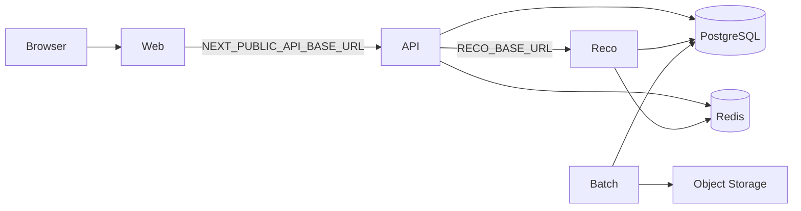

## 1. 目的

本ドキュメントは、Gift Recommendation Service の**ローカル開発環境**を構築・起動・疎通確認する手順の正本とする。

以下を開発者が迷わず実行できる状態を目指す。

- 初回セットアップ（リポジトリ取得、依存関係、`.env` 作成）
- 外部依存（PostgreSQL / Redis 等）の準備方針
- 環境変数の設定（§19.9 local 列）
- 各アプリの起動順序と疎通確認（§9 実行手順。api / reco health 成功は PUB-001 / INT-001 実装後）

---

## 2. スコープ

| 対象           | 内容                                           |
| -------------- | ---------------------------------------------- |
| 実行環境       | 開発者マシン上の local（`APP_ENV=dev`）        |
| アプリ         | web / api / reco / batch                       |
| 設定           | リポジトリルート `.env`（`.env.example` 起点） |
| 補助スクリプト | `scripts/dev/`                                 |

| 対象外（別 Task / docs） | 内容                                      |
| ------------------------ | ----------------------------------------- |
| CI 実行                  | Task ⑤（CI 基盤）                         |
| 本番 deploy              | `infra/**` README 参照                    |
| DB 構築・migration 適用  | [DB構築手順書](../database/DB構築手順書.md) |
| DB migration DDL 詳細    | Phase2 Epic（`db-physical-design`）       |
| Postgres 用 compose 同梱 | 行わない（§3.2）。Redis は限定 compose を同梱 |

---

## 3. 前提

### 3.1 正本関係

| 情報                     | 正本                                                         | 本ドキュメントの役割           |
| ------------------------ | ------------------------------------------------------------ | ------------------------------ |
| 環境変数一覧・秘匿性     | [環境設計書 §19](./環境設計書.md)                            | local 列の設定手順           |
| 設定先マトリクス         | [環境設計書 §19.9](./環境設計書.md)                          | ローカルで設定する変数の整理 |
| 基盤配置・通信           | [基盤構成設計書](./基盤構成設計書.md)                        | 起動順・疎通の前提             |
| 開発技術・monorepo       | [利用技術スタック整理表 §15](../../05_アプリケーション設計/基盤/利用技術スタック整理表.md) | 必要ツール                     |
| Secret / `.env` 管理     | [認証・認可方針書 §10](../../05_アプリケーション設計/基盤/認証・認可方針書.md) | Git 管理禁止の参照             |
| 変数名・ダミー値         | リポジトリルート [`.env.example`](../../../.env.example)     | コピー元                       |

### 3.2 Human 判断（2026-06-07 / 2026-06-18 確定）

| 項目              | 方針                                                                 |
| ----------------- | -------------------------------------------------------------------- |
| docker-compose    | **Redis 限定のみ同梱**（[`docker-compose.dev.yml`](../../../docker-compose.dev.yml)）。PostgreSQL は **Supabase CLI + Docker Desktop**（Postgres + Redis フル compose は不採用） |
| ローカル PostgreSQL | **Supabase CLI**（Neon をローカル DB 正本としない — Human 判断 2026-06-18） |
| ローカル Redis    | **Redis 限定 compose**（Human 判断 2026-06-18、Task A5）。デフォルト `redis://localhost:6379/0` |
| `.env`            | `.env.example` から作成。**Git 管理しない**                          |
| secret 実値       | docs / Issue / PR / ログに記載しない                                 |

Phase3a（2026-06-07）の「docker-compose 同梱なし」は **PostgreSQL 用 compose 不採用** を指す。Redis 部分は Phase3b Task A5 で compose 採用に更新する。

---

## 4. 必要なツール

[利用技術スタック整理表 §15.1](../../05_アプリケーション設計/基盤/利用技術スタック整理表.md) に整合する。

| 項目            | 用途                          | 備考                                      |
| --------------- | ----------------------------- | ----------------------------------------- |
| Git             | リポジトリ取得                | worktree 運用時は [worktree運用ルール](../../00_共通/AIエージェント運用/worktree運用ルール.md) を参照 |
| Node.js         | web / api                     | `.nvmrc` / `.node-version` / `package.json#engines`（Node.js 24 LTS） |
| pnpm            | monorepo 依存管理             | ルート `package.json` 整備後に利用        |
| Python          | reco / batch                  | `.python-version`（3.14）                 |
| uv              | Python 依存・venv 管理        | [§6.2](#62-依存関係のインストール)          |
| Docker Desktop  | Supabase CLI ローカル DB / Redis compose | WSL2 Integration 必須（[DB構築手順書 §3](../database/DB構築手順書.md)） |
| docker compose  | Redis ローカル起動            | `docker-compose.dev.yml`（Redis のみ）    |
| Supabase CLI    | ローカル PostgreSQL 起動      | pin: [`supabase/.cli-version`](../../../supabase/.cli-version) |
| PostgreSQL クライアント | DB 疎通確認           | `psql` または GUI                         |
| Redis クライアント      | Cache 疎通確認（任意） | `redis-cli` または `smoke-check.sh`（未インストール時は docker compose 経由） |
| curl 等         | API 疎通確認                  | Postman 等でも可                          |

---

## 5. ローカル構成概要

MVP ローカルでは、以下のデフォルトポートを `.env.example` のダミー値と揃える（変更時は `.env` のみ更新する）。

| コンポーネント | デフォルト URL / ポート        | 技術（計画）        |
| -------------- | ------------------------------ | ------------------- |
| web            | `http://localhost:3000`        | Next.js             |
| api            | `http://localhost:3001`        | Express (TypeScript) |
| reco           | `http://localhost:8000`        | FastAPI (Python)    |
| PostgreSQL     | `127.0.0.1:54322`（Supabase CLI 既定） | Supabase CLI ローカル |
| Redis          | `localhost:6379`（例）         | `docker-compose.dev.yml`（ローカル） |



Batch は通常 OL フローと独立して CLI / 手動実行する。詳細は各アプリ README とバッチ仕様書を正本とする。

---

## 6. 初回セットアップ

### 6.1 リポジトリ取得

```bash
git clone <repository-url>
cd GiftRecommendAPP_MVP_CYCLE_3
```

worktree で作業する場合は、プロジェクトの [worktree運用ルール](../../00_共通/AIエージェント運用/worktree運用ルール.md) に従う。

### 6.2 依存関係のインストール

#### Node 系

```bash
pnpm install
```

#### Python 系（uv workspace）

Python **3.14** と [uv](https://docs.astral.sh/uv/) を使用する。`.venv` は **worktree ごと**にリポジトリルート（および `apps/reco` / `apps/batch`）へ作成され、Git 管理しない（`.gitignore` 済み）。

**worktree 作成後（Python 作業時）:**

```bash
# 1. packages workspace（shared-logic / test-fixtures）
./scripts/dev/setup-python.sh
./scripts/dev/pytest-python.sh

# 2. apps/reco（reco-foundation 骨格 merge 後）
./scripts/dev/setup-python-reco.sh
./scripts/dev/pytest-reco.sh

# 3. apps/batch（batch-foundation 骨格 merge 後）
./scripts/dev/setup-python-batch.sh
./scripts/dev/pytest-batch.sh
```

monorepo script からも実行できる。

```bash
pnpm setup:python
pnpm test:python
pnpm setup:python:reco   # pyproject 未整備時は skip
pnpm test:reco             # tests 未整備時は skip
pnpm setup:python:batch  # pyproject 未整備時は skip
pnpm test:batch            # tests 未整備時は skip
```

| 項目 | 正本 |
| ---- | ---- |
| Python pin | `.python-version` |
| uv workspace | ルート `pyproject.toml` / `uv.lock` |
| reco 単体 | `apps/reco/pyproject.toml`（Phase4a reco-foundation） |
| batch 単体 | `apps/batch/pyproject.toml`（Phase4a batch-foundation） |

#### PR CI（Layer1 / `ci-reco.yml`）

Epic D（app-ci）管轄の reco Layer1 PR CI。`ci.yml` の `reco-check` から reusable workflow として呼び出す（正本: [CI・CD方針書 §13](../../05_アプリケーション設計/共通/CI・CD方針書.md)）。

| 項目 | 内容 |
| ---- | ---- |
| workflow | `.github/workflows/ci-reco.yml` |
| ローカル対応コマンド | `setup-python.sh` → `pytest-python.sh` → `pytest-reco.sh`（上記と同じ順） |
| path filter | `apps/reco/**`・`packages/*` Python workspace・`pyproject.toml` / `uv.lock`・`scripts/dev` pytest 系・`ci-reco.yml` / `ci.yml` 変更時のみ `reco-check` 実行 |
| 手動全実行 | `workflow_dispatch` で `ci.yml` を起動した場合は path filter を bypass し `reco-check` も実行 |

**skip 条件（ローカル script / CI 共通）:**

| 条件 | 挙動 |
| ---- | ---- |
| `apps/reco/tests/unit` または `apps/reco/pyproject.toml` 未整備 | `pytest-reco.sh` は `info: skip` で **exit 0**（reco-foundation merge 前） |
| PR が reco 無関係パスのみ変更 | `ci.yml` の `reco-check` job は **skipped**（summary は pass 扱い） |
| packages workspace 未セットアップ | CI 上は `setup-python.sh` が `.venv` を作成してから pytest 実行 |

system の `python3`（例: 3.12）には依存しない。`uv` が `.python-version` に従い 3.14 を取得する。

Orval による API client 生成は、OpenAPI 正本更新 Task に従う（ルート `pnpm orval`）。

### 6.3 `.env` の作成

リポジトリルートで `scripts/dev` 補助を使う（[scripts/dev/README.md](../../../scripts/dev/README.md)）。

```bash
./scripts/dev/copy-env-example.sh
./scripts/dev/check-env-names.sh
```

1. `.env.example` が `.env` にコピーされる（既存 `.env` は上書きしない）
2. ローカル用の値を**手動で**設定する（secret 実値を docs やチャットに貼らない）
3. 必須変数名が揃ったか確認する

```bash
./scripts/dev/check-env-names.sh --strict
```

`check-env-names.sh` は**変数名のみ**を検査し、値は表示しない。

### 6.4 `.env` Git 管理禁止

| ファイル        | Git 管理 | 内容                         |
| --------------- | -------- | ---------------------------- |
| `.env.example`  | ○        | 変数名とダミー値のみ         |
| `.env`          | **不可** | 開発者ローカルの secret 含む |

- `.env` を commit / push しない
- PR 差分・スクリーンショット・ログに secret 実値を含めない
- 詳細ルール: [認証・認可方針書 §10.2](../../05_アプリケーション設計/基盤/認証・認可方針書.md)

---

## 7. 外部依存の準備

**PostgreSQL 用 docker-compose は提供しない**（Human 判断 2026-06-07 / 2026-06-18）。ローカル DB は **Supabase CLI + Docker Desktop** を正本とする（Neon 不採用）。

**Redis は Redis 限定 `docker-compose.dev.yml` を同梱する**（Human 判断 2026-06-18、Task A5）。Postgres サービスは含めない。

### 7.1 PostgreSQL（Supabase CLI）

手順の正本: [DB構築手順書](../database/DB構築手順書.md)

| 手順 | コマンド（例） |
| ---- | -------------- |
| CLI バージョン確認 | `./scripts/db/check-cli-version.sh` |
| ローカルスタック起動 | `./scripts/db/start-local.sh` |
| migration 適用 | `./scripts/db/migrate-up.sh` |
| 状態確認 | `./scripts/db/status.sh` |

- `supabase status` の DB URL を `.env` の `DATABASE_URL` に設定する（ポート **54322**、実値は Git 管理しない）
- prod DB 接続文字列をローカルで使わない（[環境設計書 §7.1](./環境設計書.md)）
- migration 適用正本は `supabase/migrations/`（[マイグレーション方針書](../database/マイグレーション方針書.md)）

### 7.2 Redis

ローカルでは [`docker-compose.dev.yml`](../../../docker-compose.dev.yml)（**Redis サービスのみ**）を正本とする。

| 手順 | コマンド（例） |
| ---- | -------------- |
| 起動 | `./scripts/dev/start-redis.sh` |
| 停止 | `./scripts/dev/stop-redis.sh` |
| 直接 compose | `docker compose -f docker-compose.dev.yml up -d redis` |
| 疎通確認 | `redis-cli -u "$REDIS_URL" PING`（期待: `PONG`）。`redis-cli` 未インストール時は `./scripts/dev/smoke-check.sh --skip-env --skip-db --skip-apps` が docker compose 経由で PING する |

| 項目 | 内容 |
| ---- | ---- |
| デフォルト URL | `redis://localhost:6379/0`（[`.env.example`](../../../.env.example) と一致） |
| ポート | **6379**（compose でホストに公開） |
| Postgres 同梱 | **なし**（DB は §7.1 Supabase CLI） |

- `.env` の `REDIS_URL` を上記デフォルトに合わせる（変更時は `.env` のみ更新）
- prod cache を dev で共有しない（[環境設計書 §7.2](./環境設計書.md)）
- クラウド dev 環境では各ホスティングの Redis エンドポイントを `.env` に設定する

### 7.3 その他（reco / batch）

| 変数カテゴリ     | ローカルでの扱い                                      |
| ---------------- | ----------------------------------------------------- |
| `OPENAI_API_KEY` | 開発用キーまたはモック方針（§19.6 注記）            |
| `RECO_INTERNAL_API_KEY` | api / reco で**同一値**を `.env` に設定     |
| Batch / Object Storage | batch 単体実行時のみ `.env` に設定（§19.7） |

---

## 8. 環境変数（local 列）

[環境設計書 §19.9](./環境設計書.md) の **local（開発者 `.env`）** 列が ○ のカテゴリを設定する。

| カテゴリ              | 主な変数（例）                                      | 参照 |
| --------------------- | --------------------------------------------------- | ---- |
| 共通                  | `APP_ENV`, `LOG_LEVEL`                              | §19.3 |
| web                   | `NEXT_PUBLIC_API_BASE_URL`, `API_BASE_URL`          | §19.4 |
| api                   | `DATABASE_URL`, `REDIS_URL`, `RECO_BASE_URL`, `CORS_ALLOWED_ORIGINS`, `RECO_INTERNAL_API_KEY` | §19.5 |
| reco                  | 上記 + `OPENAI_API_KEY`                             | §19.6 |
| batch                 | `RAKUTEN_APPLICATION_ID`, `OBJECT_STORAGE_*` 等     | §19.7 |

変数名の正本は [環境設計書 §19](./環境設計書.md) と [`.env.example`](../../../.env.example)。物理名は §19.7.1 に従う。

---

## 9. アプリの起動

起動順は **reco → api → web**（[基盤構成設計書](./基盤構成設計書.md)・[環境設計書 §19](./環境設計書.md) 整合）。各 app は別ターミナルで起動する。

| 順序 | アプリ | 起動スクリプト | monorepo script | 待受（local） |
| ---- | ------ | -------------- | --------------- | ------------- |
| 1    | reco   | `./scripts/dev/start-reco.sh` | `pnpm dev:reco` | `http://localhost:8000` |
| 2    | api    | `./scripts/dev/start-api.sh`  | `pnpm dev:api`  | `http://localhost:3001` |
| 3    | web    | `./scripts/dev/start-web.sh`  | `pnpm dev:web`  | `http://localhost:3000` |
| —    | batch  | （ジョブ単位）                | `pnpm dev:batch` | ログ / DB 反映で確認（Phase4b 本格運用 defer） |

### 9.1 起動前チェック

- [ ] `.env` が存在し、`./scripts/dev/check-env-names.sh --strict` が成功する
- [ ] PostgreSQL（§7.1）と Redis（§7.2）が到達可能である
- [ ] `RECO_INTERNAL_API_KEY` が api / reco で同一値である（[`.env.example`](../../../.env.example) 参照）

### 9.2 実行例

インフラ起動後、リポジトリルートから **順に** 実行する。

```bash
# terminal 1
./scripts/dev/start-reco.sh

# terminal 2
./scripts/dev/start-api.sh

# terminal 3
./scripts/dev/start-web.sh
```

各 script はルート `package.json` の `dev:*` を呼び出す。`--help` で前提・ポートを確認できる。

```bash
./scripts/dev/start-reco.sh --help
```

### 9.3 停止

`start-*.sh` は前景で `pnpm dev:*` を実行する。**専用 stop script はない**。各ターミナルで **`Ctrl+C`** する（依存の逆順: **web → api → reco**）。

```bash
# terminal 3（web）
Ctrl+C

# terminal 2（api）
Ctrl+C

# terminal 1（reco）
Ctrl+C
```

| 対象 | 停止方法 |
| ---- | -------- |
| web / api / reco | 起動したターミナルで `Ctrl+C` |
| Redis | `./scripts/dev/stop-redis.sh`（§7.2） |
| プロセス残留時 | ポート **3000** / **3001** / **8000** を確認（例: `lsof -i :3000`）し、必要なら `kill <PID>` |

api / reco / batch が §9.4 の placeholder の場合、該当プロセスは即終了するため停止操作は不要。**web** は Next.js が待受するため、停止時は `Ctrl+C` が必要。

### 9.4 placeholder / skip 条件（app 別）

| app | `dev` script 現状（2026-07 / Issue #1133） | 挙動 |
| --- | ----------------------------------------- | ---- |
| web | **実装済み**（`next dev -p 3000`） | `./scripts/dev/start-web.sh` / `pnpm dev:web` で **http://localhost:3000** が待受。前提: `pnpm install` |
| api | **placeholder** | メッセージ出力後に即終了。`GET /api/v1/health` は PUB-001 実装後 |
| reco | **placeholder** | メッセージ出力後に即終了。FastAPI エントリは存在するが `pnpm dev:reco` はサーバ未起動。`GET /internal/reco/v1/health` は INT-001 実装後 |
| batch | **placeholder** | 骨格のみ。ジョブ CLI・定期実行は Phase4b |

| 共通条件 | 挙動 |
| -------- | ---- |
| `.env` 未作成 | script は warn を出して起動を試行する。初回は `copy-env-example.sh` を実行 |
| pnpm 未インストール | script は error で終了 |

api / reco の HTTP サーバ起動と health 200 は **別 Issue（PUB-001 / INT-001 実装）** で対応する。完了後に §10.3 を更新する。

---

## 10. 疎通確認

一括実行は `scripts/dev/smoke-check.sh` を使用する（段階チェック・`--skip-*` 対応）。api / reco health 成功は **PUB-001 / INT-001 実装前は必須としない**。

### 10.0 一括 smoke check（推奨）

```bash
# インフラのみ（env + DB + Redis）。api / reco が placeholder の間は --skip-apps 推奨
./scripts/dev/smoke-check.sh --skip-apps

# apps 起動後: web は起動可能。api / reco health は PUB-001 / INT-001 完了後に 200 を期待
./scripts/dev/smoke-check.sh
```

| オプション | 用途 |
| ---------- | ---- |
| `--skip-env` | 環境変数名チェックを省略 |
| `--skip-db` | PostgreSQL チェックを省略 |
| `--skip-redis` | Redis チェックを省略 |
| `--skip-apps` | reco / api / web 疎通を省略（api / reco placeholder 期間は推奨） |

app health は接続不可・非 200 の場合 **skip** とし、script 全体を fail させない（§9.4 整合）。

### 10.1 環境変数

```bash
./scripts/dev/check-env-names.sh --strict
```

### 10.2 インフラ（例）

PostgreSQL（接続 URL は `.env` の `DATABASE_URL` を使用）:

```bash
psql "$DATABASE_URL" -c 'SELECT 1'
```

Redis:

```bash
redis-cli -u "$REDIS_URL" PING
```

### 10.3 アプリ health / 疎通（app 別）

`smoke-check.sh` は接続不可・非 200 を **skip** とし、script 全体を fail させない。api / reco の health **200 成功**は PUB-001 / INT-001 実装前は **必須確認対象外**。

| 確認対象 | URL（OpenAPI 正本） | 現状（develop / Task #1133） |
| -------- | ------------------- | ---------------------------- |
| web トップ | `GET http://localhost:3000/` | **起動可能** — `pnpm install` 後に `./scripts/dev/start-web.sh`。smoke-check では起動済みなら HTTP 200、未起動なら skip |
| api health  | `GET http://localhost:3001/api/v1/health`（[public-api.yaml](../../../packages/contracts/openapi/public-api.yaml) / API-PUB-001） | **skip** — `dev:api` は placeholder。実装は **別 Issue（PUB-001）** |
| reco health | `GET http://localhost:8000/internal/reco/v1/health`（[internal-reco-api.yaml](../../../packages/contracts/openapi/internal-reco-api.yaml) / API-INT-001） | **skip** — `dev:reco` は placeholder（health route 未実装）。実装は **別 Issue（INT-001）** |

API-PUB-002（レコメンド実行）の **domain / infrastructure コード**は develop 上に存在するが、api / reco の HTTP サーバ起動と health 200 は **本 Issue（#1133）merge 後の別 Issue** で対応する。

Internal API 呼び出し時は `X-Internal-Api-Key` に `RECO_INTERNAL_API_KEY` を付与する（実値はログに出さない）。

---

## 11. トラブルシューティング

| 症状 | 確認事項 |
| ---- | -------- |
| `smoke-check.sh` が env で失敗 | `.env` 未作成、または必須キー欠落。`copy-env-example.sh` 後に `.env` を編集 |
| `smoke-check.sh` が DB で失敗 | Supabase ローカル DB 未起動、`DATABASE_URL` 不一致（[DB構築手順書](../database/DB構築手順書.md)） |
| `smoke-check.sh` が Redis で失敗 | Redis 未起動、`REDIS_URL` 不一致、または `redis-cli` 未インストールかつ Redis コンテナ未起動。§7.2 / `start-redis.sh`。`redis-cli` なしでも compose 起動済みなら smoke-check が docker 経由で PING する |
| web が起動しない | `pnpm install` 未実施、port 3000 競合、`.env` 未作成。`./scripts/dev/start-web.sh` と `apps/web/package.json` の `dev` を確認 |
| api / reco health が skip のみ | `dev:api` / `dev:reco` が placeholder、または未起動。PUB-001 / INT-001 実装後に再確認 |
| `check-env-names.sh` が失敗 | `.env` 未作成、または必須キー欠落。`copy-env-example.sh` 後に `.env` を編集 |
| DB 接続エラー | `DATABASE_URL` のホスト / ポート、PostgreSQL 起動状態、dev DB であること |
| Redis 接続エラー | `REDIS_URL`、Redis 起動状態 |
| api → reco 401/403 | `RECO_INTERNAL_API_KEY` の api / reco 不一致 |
| CORS エラー | `CORS_ALLOWED_ORIGINS` に web の origin（例: `http://localhost:3000`）が含まれるか |

---

## 12. 関連 scripts / infra

| パス | 用途 |
| ---- | ---- |
| [scripts/dev/](../../../scripts/dev/README.md) | `.env` コピー・変数名チェック・疎通 smoke check・Redis / web / api / reco 起動 |
| [docker-compose.dev.yml](../../../docker-compose.dev.yml) | ローカル Redis（Redis サービスのみ） |
| [scripts/db/](../../../scripts/db/README.md) | Supabase CLI ローカル DB 起動・migration |
| [scripts/README.md](../../../scripts/README.md) | scripts 全体の索引 |
| [infra/README.md](../../../infra/README.md) | ホスティング別 README（deploy は別 Task） |

---

## 13. 後続 Task への引き渡し

| 後続 Task | 本ドキュメントから引き渡す内容 |
| --------- | ------------------------------ |
| ⑤ CI 基盤 | ローカルで検証した env 名・疎通観点（§19.8 は環境設計書を正本） |
| web | §9 / §10.3 — 既に `next dev` で起動可能。`pnpm install` 前提を各 apps README からリンク |
| api / reco health | §9.4 / §10.3 — placeholder を実サーバ + health 200 へ差し替え（**#1133 merge 後の別 Issue** / PUB-001・INT-001） |

---

## 14. 改訂履歴

| 日付       | 内容                         |
| ---------- | ---------------------------- |
| 2026-06-08 | Task ④ 初版（Issue #461）    |
| 2026-06-19 | §7 を Supabase CLI 前提へ更新、Neon 削除（Issue #658） |
| 2026-06-19 | §9 を実行手順へ更新、`start-{web,api,reco}.sh` 追加（Issue #664） |
| 2026-06-19 | §9.3 に web / api / reco 停止手順（Ctrl+C）を追記（Issue #664） |
| 2026-06-19 | §3.2 / §7.2 を Redis 限定 compose 採用へ更新（Issue #662） |
| 2026-06-19 | §10 に `smoke-check.sh` 一括疎通手順を追加（Issue #666） |
| 2026-06-25 | §6.2 に `ci-reco.yml` Layer1 PR CI・path filter・skip 条件を追記（Issue #747） |
| 2026-07-10 | §10.3 に OpenAPI health path と placeholder 現状を追記、Redis 疎通の docker フォールバックを明記（Issue #1133） |
| 2026-07-10 | §9.4 / §10.3 を app 別に更新。web は起動可能、api / reco health は別 Issue と明記（Issue #1133） |
