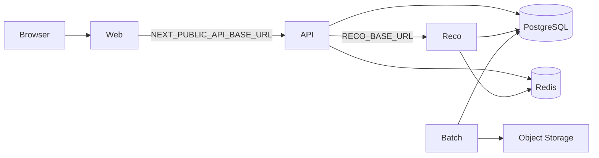

## 1. 目的

本ドキュメントは、Gift Recommendation Service の**ローカル開発環境**を構築・起動・疎通確認する手順の正本とする。

以下を開発者が迷わず実行できる状態を目指す。

- 初回セットアップ（リポジトリ取得、依存関係、`.env` 作成）
- 外部依存（PostgreSQL / Redis 等）の準備方針
- 環境変数の設定（§19.9 local 列）
- 各アプリの起動順序と疎通確認（§9 実行手順。api / reco health は local-dev follow-up #1135 で最小実装。API-PUB-002 縦串は §10.4 / #1137）

---

## 2. スコープ

| 対象           | 内容                                           |
| -------------- | ---------------------------------------------- |
| 実行環境       | 開発者マシン上の local（`APP_ENV=dev`）        |
| アプリ         | web / api / reco / batch                       |
| 設定           | リポジトリルート `.env`（`.env.example` 起点） |
| 補助スクリプト | `scripts/dev/`                                 |

| 対象外（別 Task / docs） | 内容                                      |
| ------------------------ | ----------------------------------------- |
| CI 実行                  | Task ⑤（CI 基盤）                         |
| 本番 deploy              | `infra/**` README 参照                    |
| DB 構築・migration 適用  | [DB構築手順書](../database/DB構築手順書.md) |
| DB migration DDL 詳細    | Phase2 Epic（`db-physical-design`）       |
| Postgres 用 compose 同梱 | 行わない（§3.2）。Redis は限定 compose を同梱 |

---

## 3. 前提

### 3.1 正本関係

| 情報                     | 正本                                                         | 本ドキュメントの役割           |
| ------------------------ | ------------------------------------------------------------ | ------------------------------ |
| 環境変数一覧・秘匿性     | [環境設計書 §19](./環境設計書.md)                            | local 列の設定手順           |
| 設定先マトリクス         | [環境設計書 §19.9](./環境設計書.md)                          | ローカルで設定する変数の整理 |
| 基盤配置・通信           | [基盤構成設計書](./基盤構成設計書.md)                        | 起動順・疎通の前提             |
| 開発技術・monorepo       | [利用技術スタック整理表 §15](../../05_アプリケーション設計/基盤/利用技術スタック整理表.md) | 必要ツール                     |
| Secret / `.env` 管理     | [認証・認可方針書 §10](../../05_アプリケーション設計/基盤/認証・認可方針書.md) | Git 管理禁止の参照             |
| 変数名・ダミー値         | リポジトリルート [`.env.example`](../../../.env.example)     | コピー元                       |

### 3.2 Human 判断（2026-06-07 / 2026-06-18 確定）

| 項目              | 方針                                                                 |
| ----------------- | -------------------------------------------------------------------- |
| docker-compose    | **Redis 限定のみ同梱**（[`docker-compose.dev.yml`](../../../docker-compose.dev.yml)）。PostgreSQL は **Supabase CLI + Docker Desktop**（Postgres + Redis フル compose は不採用） |
| ローカル PostgreSQL | **Supabase CLI**（Neon をローカル DB 正本としない — Human 判断 2026-06-18） |
| ローカル Redis    | **Redis 限定 compose**（Human 判断 2026-06-18、Task A5）。デフォルト `redis://localhost:6379/0` |
| `.env`            | `.env.example` から作成。**Git 管理しない**                          |
| secret 実値       | docs / Issue / PR / ログに記載しない                                 |

Phase3a（2026-06-07）の「docker-compose 同梱なし」は **PostgreSQL 用 compose 不採用** を指す。Redis 部分は Phase3b Task A5 で compose 採用に更新する。

---

## 4. 必要なツール

[利用技術スタック整理表 §15.1](../../05_アプリケーション設計/基盤/利用技術スタック整理表.md) に整合する。

| 項目            | 用途                          | 備考                                      |
| --------------- | ----------------------------- | ----------------------------------------- |
| Git             | リポジトリ取得                | worktree 運用時は [worktree運用ルール](../../00_共通/AIエージェント運用/worktree運用ルール.md) を参照 |
| Node.js         | web / api                     | `.nvmrc` / `.node-version` / `package.json#engines`（Node.js 24 LTS） |
| pnpm            | monorepo 依存管理             | ルート `package.json` 整備後に利用        |
| Python          | reco / batch                  | `.python-version`（3.14）                 |
| uv              | Python 依存・venv 管理        | [§6.2](#62-依存関係のインストール)          |
| Docker Desktop  | Supabase CLI ローカル DB / Redis compose | WSL2 Integration 必須（[DB構築手順書 §3](../database/DB構築手順書.md)） |
| docker compose  | Redis ローカル起動            | `docker-compose.dev.yml`（Redis のみ）    |
| Supabase CLI    | ローカル PostgreSQL 起動      | pin: [`supabase/.cli-version`](../../../supabase/.cli-version) |
| PostgreSQL クライアント | DB 疎通確認           | `psql` または GUI                         |
| Redis クライアント      | Cache 疎通確認（任意） | `redis-cli` または `smoke-check.sh`（未インストール時は docker compose 経由） |
| curl 等         | API 疎通確認                  | Postman 等でも可                          |

---

## 5. ローカル構成概要

MVP ローカルでは、以下のデフォルトポートを `.env.example` のダミー値と揃える（変更時は `.env` のみ更新する）。

| コンポーネント | デフォルト URL / ポート        | 技術（計画）        |
| -------------- | ------------------------------ | ------------------- |
| web            | `http://localhost:3000`        | Next.js             |
| api            | `http://localhost:3001`        | Express (TypeScript) |
| reco           | `http://localhost:8000`        | FastAPI (Python)    |
| PostgreSQL     | `127.0.0.1:54322`（Supabase CLI 既定） | Supabase CLI ローカル |
| Redis          | `localhost:6379`（例）         | `docker-compose.dev.yml`（ローカル） |



Batch は通常 OL フローと独立して CLI / 手動実行する。詳細は各アプリ README とバッチ仕様書を正本とする。

---

## 6. 初回セットアップ

### 6.1 リポジトリ取得

```bash
git clone <repository-url>
cd GiftRecommendAPP_MVP_CYCLE_3
```

worktree で作業する場合は、プロジェクトの [worktree運用ルール](../../00_共通/AIエージェント運用/worktree運用ルール.md) に従う。

### 6.2 依存関係のインストール

#### Node 系

```bash
pnpm install
```

#### Python 系（uv workspace）

Python **3.14** と [uv](https://docs.astral.sh/uv/) を使用する。`.venv` は **worktree ごと**にリポジトリルート（および `apps/reco` / `apps/batch`）へ作成され、Git 管理しない（`.gitignore` 済み）。

**worktree 作成後（Python 作業時）:**

```bash
# 1. packages workspace（shared-logic / test-fixtures）
./scripts/dev/setup-python.sh
./scripts/dev/pytest-python.sh

# 2. apps/reco（reco-foundation 骨格 merge 後）
./scripts/dev/setup-python-reco.sh
./scripts/dev/pytest-reco.sh

# 3. apps/batch（batch-foundation 骨格 merge 後）
./scripts/dev/setup-python-batch.sh
./scripts/dev/pytest-batch.sh
```

monorepo script からも実行できる。

```bash
pnpm setup:python
pnpm test:python
pnpm setup:python:reco   # pyproject 未整備時は skip
pnpm test:reco             # tests 未整備時は skip
pnpm setup:python:batch  # pyproject 未整備時は skip
pnpm test:batch            # tests 未整備時は skip
```

| 項目 | 正本 |
| ---- | ---- |
| Python pin | `.python-version` |
| uv workspace | ルート `pyproject.toml` / `uv.lock` |
| reco 単体 | `apps/reco/pyproject.toml`（Phase4a reco-foundation） |
| batch 単体 | `apps/batch/pyproject.toml`（Phase4a batch-foundation） |

#### PR CI（Layer1 / `ci-reco.yml`）

Epic D（app-ci）管轄の reco Layer1 PR CI。`ci.yml` の `reco-check` から reusable workflow として呼び出す（正本: [CI・CD方針書 §13](../../05_アプリケーション設計/共通/CI・CD方針書.md)）。

| 項目 | 内容 |
| ---- | ---- |
| workflow | `.github/workflows/ci-reco.yml` |
| ローカル対応コマンド | `setup-python.sh` → `pytest-python.sh` → `pytest-reco.sh`（上記と同じ順） |
| path filter | `apps/reco/**`・`packages/*` Python workspace・`pyproject.toml` / `uv.lock`・`scripts/dev` pytest 系・`ci-reco.yml` / `ci.yml` 変更時のみ `reco-check` 実行 |
| 手動全実行 | `workflow_dispatch` で `ci.yml` を起動した場合は path filter を bypass し `reco-check` も実行 |

**skip 条件（ローカル script / CI 共通）:**

| 条件 | 挙動 |
| ---- | ---- |
| `apps/reco/tests/unit` または `apps/reco/pyproject.toml` 未整備 | `pytest-reco.sh` は `info: skip` で **exit 0**（reco-foundation merge 前） |
| PR が reco 無関係パスのみ変更 | `ci.yml` の `reco-check` job は **skipped**（summary は pass 扱い） |
| packages workspace 未セットアップ | CI 上は `setup-python.sh` が `.venv` を作成してから pytest 実行 |

system の `python3`（例: 3.12）には依存しない。`uv` が `.python-version` に従い 3.14 を取得する。

Orval による API client 生成は、OpenAPI 正本更新 Task に従う（ルート `pnpm orval`）。

### 6.3 `.env` の作成

リポジトリルートで `scripts/dev` 補助を使う（[scripts/dev/README.md](../../../scripts/dev/README.md)）。

```bash
./scripts/dev/copy-env-example.sh
./scripts/dev/check-env-names.sh
```

1. `.env.example` が `.env` にコピーされる（既存 `.env` は上書きしない）
2. ローカル用の値を**手動で**設定する（secret 実値を docs やチャットに貼らない）
3. 必須変数名が揃ったか確認する

```bash
./scripts/dev/check-env-names.sh --strict
```

`check-env-names.sh` は**変数名のみ**を検査し、値は表示しない。

### 6.4 `.env` Git 管理禁止

| ファイル        | Git 管理 | 内容                         |
| --------------- | -------- | ---------------------------- |
| `.env.example`  | ○        | 変数名とダミー値のみ         |
| `.env`          | **不可** | 開発者ローカルの secret 含む |

- `.env` を commit / push しない
- PR 差分・スクリーンショット・ログに secret 実値を含めない
- 詳細ルール: [認証・認可方針書 §10.2](../../05_アプリケーション設計/基盤/認証・認可方針書.md)

---

## 7. 外部依存の準備

**PostgreSQL 用 docker-compose は提供しない**（Human 判断 2026-06-07 / 2026-06-18）。ローカル DB は **Supabase CLI + Docker Desktop** を正本とする（Neon 不採用）。

**Redis は Redis 限定 `docker-compose.dev.yml` を同梱する**（Human 判断 2026-06-18、Task A5）。Postgres サービスは含めない。

### 7.1 PostgreSQL（Supabase CLI）

手順の正本: [DB構築手順書](../database/DB構築手順書.md)

| 手順 | コマンド（例） |
| ---- | -------------- |
| CLI バージョン確認 | `./scripts/db/check-cli-version.sh` |
| ローカルスタック起動 | `./scripts/db/start-local.sh` |
| migration 適用 | `./scripts/db/migrate-up.sh` |
| 状態確認 | `./scripts/db/status.sh` |

- `supabase status` の DB URL を `.env` の `DATABASE_URL` に設定する（ポート **54322**、実値は Git 管理しない）
- prod DB 接続文字列をローカルで使わない（[環境設計書 §7.1](./環境設計書.md)）
- migration 適用正本は `supabase/migrations/`（[マイグレーション方針書](../database/マイグレーション方針書.md)）

### 7.2 Redis

ローカルでは [`docker-compose.dev.yml`](../../../docker-compose.dev.yml)（**Redis サービスのみ**）を正本とする。

| 手順 | コマンド（例） |
| ---- | -------------- |
| 起動 | `./scripts/dev/start-redis.sh` |
| 停止 | `./scripts/dev/stop-redis.sh` |
| 直接 compose | `docker compose -f docker-compose.dev.yml up -d redis` |
| 疎通確認 | `redis-cli -u "$REDIS_URL" PING`（期待: `PONG`）。`redis-cli` 未インストール時は `./scripts/dev/smoke-check.sh --skip-env --skip-db --skip-apps` が docker compose 経由で PING する |

| 項目 | 内容 |
| ---- | ---- |
| デフォルト URL | `redis://localhost:6379/0`（[`.env.example`](../../../.env.example) と一致） |
| ポート | **6379**（compose でホストに公開） |
| Postgres 同梱 | **なし**（DB は §7.1 Supabase CLI） |

- `.env` の `REDIS_URL` を上記デフォルトに合わせる（変更時は `.env` のみ更新）
- prod cache を dev で共有しない（[環境設計書 §7.2](./環境設計書.md)）
- クラウド dev 環境では各ホスティングの Redis エンドポイントを `.env` に設定する

### 7.3 その他（reco / batch）

| 変数カテゴリ     | ローカルでの扱い                                      |
| ---------------- | ----------------------------------------------------- |
| `OPENAI_API_KEY` | 開発用キーまたはモック方針（§19.6 注記）            |
| `RECO_INTERNAL_API_KEY` | api / reco で**同一値**を `.env` に設定     |
| Batch / Object Storage | batch 単体実行時のみ `.env` に設定（§19.7） |

---

## 8. 環境変数（local 列）

[環境設計書 §19.9](./環境設計書.md) の **local（開発者 `.env`）** 列が ○ のカテゴリを設定する。

| カテゴリ              | 主な変数（例）                                      | 参照 |
| --------------------- | --------------------------------------------------- | ---- |
| 共通                  | `APP_ENV`, `LOG_LEVEL`                              | §19.3 |
| web                   | `NEXT_PUBLIC_API_BASE_URL`, `API_BASE_URL`          | §19.4 |
| api                   | `DATABASE_URL`, `REDIS_URL`, `RECO_BASE_URL`, `CORS_ALLOWED_ORIGINS`, `RECO_INTERNAL_API_KEY` | §19.5 |
| reco                  | 上記 + `OPENAI_API_KEY`                             | §19.6 |
| batch                 | `RAKUTEN_APPLICATION_ID`, `OBJECT_STORAGE_*` 等     | §19.7 |

変数名の正本は [環境設計書 §19](./環境設計書.md) と [`.env.example`](../../../.env.example)。物理名は §19.7.1 に従う。

---

## 9. アプリの起動

起動順は **reco → api → web**（[基盤構成設計書](./基盤構成設計書.md)・[環境設計書 §19](./環境設計書.md) 整合）。各 app は別ターミナルで起動する。

| 順序 | アプリ | 起動スクリプト | monorepo script | 待受（local） |
| ---- | ------ | -------------- | --------------- | ------------- |
| 1    | reco   | `./scripts/dev/start-reco.sh` | `pnpm dev:reco` | `http://localhost:8000` |
| 2    | api    | `./scripts/dev/start-api.sh`  | `pnpm dev:api`  | `http://localhost:3001` |
| 3    | web    | `./scripts/dev/start-web.sh`  | `pnpm dev:web`  | `http://localhost:3000` |
| —    | batch  | （ジョブ単位）                | `pnpm dev:batch` | ログ / DB 反映で確認（Phase4b 本格運用 defer） |

### 9.1 起動前チェック

- [ ] `.env` が存在し、`./scripts/dev/check-env-names.sh --strict` が成功する
- [ ] PostgreSQL（§7.1）と Redis（§7.2）が到達可能である
- [ ] `RECO_INTERNAL_API_KEY` が api / reco で同一値である（[`.env.example`](../../../.env.example) 参照）

### 9.2 実行例

インフラ起動後、リポジトリルートから **順に** 実行する。

```bash
# terminal 1
./scripts/dev/start-reco.sh

# terminal 2
./scripts/dev/start-api.sh

# terminal 3
./scripts/dev/start-web.sh
```

各 script はルート `package.json` の `dev:*` を呼び出す。`--help` で前提・ポートを確認できる。

```bash
./scripts/dev/start-reco.sh --help
```

### 9.3 停止

`start-*.sh` は前景で `pnpm dev:*` を実行する。**専用 stop script はない**。各ターミナルで **`Ctrl+C`** する（依存の逆順: **web → api → reco**）。

```bash
# terminal 3（web）
Ctrl+C

# terminal 2（api）
Ctrl+C

# terminal 1（reco）
Ctrl+C
```

| 対象 | 停止方法 |
| ---- | -------- |
| web / api / reco | 起動したターミナルで `Ctrl+C` |
| Redis | `./scripts/dev/stop-redis.sh`（§7.2） |
| プロセス残留時 | ポート **3000** / **3001** / **8000** を確認（例: `lsof -i :3000`）し、必要なら `kill <PID>` |

**web / api / reco** は待受するため、停止時は各ターミナルで `Ctrl+C` が必要。batch が placeholder の場合は即終了のため停止操作不要。

### 9.4 app 別起動状況

| app | `dev` script 現状（2026-07 / Issue #1135） | 挙動 |
| --- | ----------------------------------------- | ---- |
| web | **実装済み**（`next dev -p 3000`） | `./scripts/dev/start-web.sh`。前提: `pnpm install` |
| api | **実装済み（health + PUB-002 Router マウント）** | `./scripts/dev/start-api.sh` / `pnpm dev:api` で **http://localhost:3001** 待受。前提: `pnpm install`。`GET /api/v1/health` と `POST /api/v1/recommendations`（API-PUB-002）は起動可（縦串の残ギャップは §10.4） |
| reco | **実装済み（health + INT-002）** | `./scripts/dev/start-reco.sh` / `pnpm dev:reco` で **http://localhost:8000** 待受。前提: `./scripts/dev/setup-python-reco.sh`、`.env`（`RECO_INTERNAL_API_KEY` / `DATABASE_URL`）。`GET /internal/reco/v1/health` と `POST /internal/reco/v1/recommendations/run` は起動可（縦串の既知ギャップは §10.4） |
| batch | **placeholder** | 骨格のみ。ジョブ CLI・定期実行は Phase4b |

| 共通条件 | 挙動 |
| -------- | ---- |
| `.env` 未作成 | script は warn を出して起動を試行する。初回は `copy-env-example.sh` を実行 |
| pnpm 未インストール | script は error で終了 |

api / reco の health は OpenAPI（API-PUB-001 / API-INT-001）準拠の **ローカル最小実装**（Issue #1135）。API-PUB-002 縦串スモークの手順・既知ギャップは §10.4（Issue #1137）。

---

## 10. 疎通確認

一括実行は `scripts/dev/smoke-check.sh` を使用する（段階チェック・`--skip-*` 対応）。

### 10.0 一括 smoke check（推奨）

```bash
# インフラのみ（env + DB + Redis）
./scripts/dev/smoke-check.sh --skip-apps

# apps 起動後（reco → api → 任意で web）: health / 疎通を確認
./scripts/dev/smoke-check.sh
```

| オプション | 用途 |
| ---------- | ---- |
| `--skip-env` | 環境変数名チェックを省略 |
| `--skip-db` | PostgreSQL チェックを省略 |
| `--skip-redis` | Redis チェックを省略 |
| `--skip-apps` | reco / api / web 疎通を省略 |

app が未起動・非 200 の場合は **skip** とし、script 全体を fail させない（インフラ必須チェックとは分離）。

### 10.1 環境変数

```bash
./scripts/dev/check-env-names.sh --strict
```

### 10.2 インフラ（例）

PostgreSQL（接続 URL は `.env` の `DATABASE_URL` を使用）:

```bash
psql "$DATABASE_URL" -c 'SELECT 1'
```

Redis:

```bash
redis-cli -u "$REDIS_URL" PING
```

### 10.3 アプリ health / 疎通（app 別）

`smoke-check.sh` は接続不可・非 200 を **skip** とする（未起動時にインフラ結果を fail にしない）。起動済みなら api / reco health は **HTTP 200** を期待する（Issue #1135）。

| 確認対象 | URL（OpenAPI 正本） | 現状（Issue #1135） |
| -------- | ------------------- | ------------------- |
| reco health | `GET http://localhost:8000/internal/reco/v1/health`（[internal-reco-api.yaml](../../../packages/contracts/openapi/internal-reco-api.yaml) / API-INT-001） | **起動可能** — `X-Internal-Api-Key` 必須。DB 到達時 `status: ok` |
| api health  | `GET http://localhost:3001/api/v1/health`（[public-api.yaml](../../../packages/contracts/openapi/public-api.yaml) / API-PUB-001） | **起動可能** — 非認証。`status: ok` / `service: okuri` |
| web トップ | `GET http://localhost:3000/` | **起動可能** — `pnpm install` 後に `./scripts/dev/start-web.sh` |

起動例（別ターミナル）:

```bash
./scripts/dev/start-reco.sh   # terminal 1
./scripts/dev/start-api.sh    # terminal 2
./scripts/dev/smoke-check.sh  # terminal 3（または別シェル）
```

Internal API 呼び出し時は `X-Internal-Api-Key` に `RECO_INTERNAL_API_KEY` を付与する（実値はログに出さない）。

### 10.4 API-PUB-002 Recommendation Run 縦串スモーク（Issue #1137）

master seed + test-data seed 適用後、api / reco 起動上で API-PUB-002（`POST /api/v1/recommendations`）をローカル再現する手順。**成功条件・既知失敗**を本節と PR 本文に記録する（レーン 0c）。

#### 10.4.1 前提

| 前提 | 確認 |
| ---- | ---- |
| `.env` | `./scripts/dev/copy-env-example.sh` 後、`./scripts/dev/check-env-names.sh --strict` が成功 |
| PostgreSQL | Supabase CLI ローカル起動済み（§7.1）。`DATABASE_URL` が port **54322** 等に一致 |
| Redis | `./scripts/dev/start-redis.sh` 済み（§7.2） |
| master seed | `./scripts/db/seed-masters.sh` または `./scripts/db/reset-local.sh` 済み |
| test-data seed | `./scripts/db/seed-test-data.sh` 済み（`item` 3 件 + `item_feature` 24 行） |
| 依存 | `pnpm install`、`./scripts/dev/setup-python-reco.sh` |
| 起動 | reco → api（§9.2）。health は §10.3 |

#### 10.4.2 実行手順（再現用）

```bash
# 1. env / seed
./scripts/dev/check-env-names.sh --strict
./scripts/db/seed-masters.sh          # 未適用時
./scripts/db/seed-test-data.sh

# 2. 起動（別ターミナル）
./scripts/dev/start-reco.sh           # :8000
./scripts/dev/start-api.sh            # :3001

# 3. health
curl -sS "http://localhost:3001/api/v1/health"
curl -sS -H "X-Internal-Api-Key: ${RECO_INTERNAL_API_KEY}" \
  "http://localhost:8000/internal/reco/v1/health"

# 4. API-PUB-002（契約仕様書 §6.5 Example）
curl -sS -w "\nHTTP %{http_code}\n" \
  -X POST "http://localhost:3001/api/v1/recommendations" \
  -H "Content-Type: application/json" \
  -H "Accept: application/json" \
  -d '{
  "relationship": {"relationshipCode": "boss", "relationshipLabel": "上司"},
  "occasion": {"occasionCode": "thanks", "occasionLabel": "お礼"},
  "budget": {"budgetMin": 3000, "budgetMax": 5000, "currency": "JPY", "taxIncluded": true},
  "preferredCondition": {"preferredText": "上品で、感謝が伝わるもの"},
  "nonPreferredCondition": {"nonPreferredText": "カジュアルすぎるものは避けたい"},
  "ngCondition": {"ngText": "アルコールはNG"},
  "freeText": "退職する上司に、お礼として失礼がなく、少し気の利いたものを贈りたい",
  "execution": {"mode": "ui", "topK": 10, "candidateLimit": 50, "includeReason": true, "includeDebugInfo": false}
}'
```

補助確認（reco 単体）: API-INT-002 は body が `recommendationRequestId` + `recommendationRequest` ネスト形（[internal-reco-api.yaml](../../../packages/contracts/openapi/internal-reco-api.yaml)）。`X-Trace-Id` / `X-Request-Id` / `X-Internal-Api-Key` 必須。実値はログ・docs に出さない。

#### 10.4.3 実行結果（2026-07-11 / Issue #1137）

| 確認 | 結果 | 備考 |
| ---- | ---- | ---- |
| `check-env-names.sh --strict` | OK | `.env` 作成後 |
| `seed-test-data.sh` | OK | items=3, item_feature=24 |
| api health | HTTP **200** | `status: ok` |
| reco health | HTTP **200** | `X-Internal-Api-Key` 付与 |
| `POST /api/v1/recommendations`（PUB-002） | HTTP **404**（#1137 時点） | `Cannot POST /api/v1/recommendations` → **#1138 で Router マウント済み**（下記） |
| `POST .../recommendations/run`（INT-002, boss/thanks） | HTTP **500** `GRS-REC-002`（残し得る） | #1141 後の典型残因は retrieval 以降の stub ports。config version 不整合は解消済み |
| INT-002（friend/birthday + request 行あり） | HTTP **500** `GRS-REC-002`（旧） | ~~`one or more config version ids do not exist`~~ → #1141 で production config_resolver が DB `is_current` を参照。再発時は seed の current 行欠落を確認 |

#### 10.4.3b Router マウント後（Issue #1138）

`createApp()` に `createRecommendationsRouter` を配線済み。`POST /api/v1/recommendations` は **404 にならない**（Validation / scaffold / reco 失敗時は 4xx/5xx）。health は従来どおり 200。

#### 10.4.4 既知ギャップと後続 Task 候補

本 Task（#1137）では **OpenAPI / migration / Batch / Epic C 全面整備は out of scope**。縦串成功に必要な最小ギャップは次のとおり（test-data の item fixture 不足が主因ではない）。

| No | ギャップ | 事実 | 後続候補 |
| --: | -------- | ---- | -------- |
| 1 | api Router 未マウント | ~~`createApp()` は health のみ~~ → **#1138 で解消**（`app.ts` に `POST /api/v1/recommendations` を配線） | （完了） |
| 2 | api Request 永続化が scaffold | ~~`ScaffoldDbSession` のみ~~ → **#1139 で解消**（`DATABASE_URL` があるとき `PostgresDbSession`。ローカル `.env` で実 INSERT） | （完了） |
| 3 | reco production pair_reader | ~~InMemory scaffold のみ~~ → **#1140 で解消**（`PostgresPairMasterReader` が `pair_master` の `is_active=true` 行を解決） | （完了） |
| 4 | reco config version / pipeline | ~~Run Recorder が config version 存在確認で失敗~~ → **#1141 で config version 整合**（production の `config_resolver` が DB `is_current` を参照）。候補取得以降の MVP stub ports は残存 | stub ports 全面 production 化は別 Issue / Epic |
| 5 | test-data | item / feature / meaning / embedding は縦串 item 側として充足。config version seed は #1141 で DB 読取整合。残る stub ports は seed では解消しない | stub ports 全面化は別 Issue |

**成功条件（#1137）:** 手順が再現可能に記載され、実行結果（404 / 既知 500 原因）と後続 Task 候補が PR・本節に残っていること。HTTP 200 の商品返却までは後続。
**#1138:** Router マウントにより PUB-002 の 404 は解消。
**#1139:** `DATABASE_URL` 経由で `recommendation_request` を実永続化。
**#1140:** production composition の `pair_reader` を `PostgresPairMasterReader` に置換。
**#1141:** production `config_resolver` が DB の `is_current` config version を参照。残ギャップは retrieval 以降の stub ports（別 Issue）。

#### 10.4.5 レーン1e 結果あり再確認（要約 / Issue #1264）

PUB-002 は request/run を Postgres に作成できるが、production の MOD-RECO-004 が InMemory RunValidation（空）のため `recommendation_run not found` → HTTP 500 `GRS-REC-004` となっていた（詳細は PR #1267）。seed / OpenAI 不足が主因ではない。

#### 10.4.6 RunValidation Postgres 配線後（2026-07-15 / Issue #1269）

`PostgresRunValidation` を `build_production_ports` へ注入（early pipeline 共有）。DEFAULT composition の InMemory は維持。

| 確認 | 結果 | 備考 |
| ---- | ---- | ---- |
| composition UT | 通過 | |
| reco / api health | HTTP **200** | |
| `POST /api/v1/recommendations` | HTTP **500** `GRS-REC-005` | 旧 GRS-REC-004（run not found）は **解消** |
| `error_log` | `user_semantic not found for run` | phase=`user_feature_generated` / `MOD-RECO-007` |
| items≥1 | **未達** | 次は UserSemantic 永続化（InMemory→Postgres）配線 |

後続候補: `PostgresUserSemanticRepository` 配線（別 Task）／D1 fixture 暫定。

#### 10.4.7 UserSemantic Postgres 配線後（2026-07-15 / Issue #1272）

`PostgresUserSemanticRepository` を production に注入し、MOD-RECO-007 の `has_user_semantic` は `user_semantic` テーブルを参照。DEFAULT composition の InMemory は維持。`user_feature` 行の Postgres INSERT は本 Task out of scope（memory のみ）。

| 確認 | 結果 | 備考 |
| ---- | ---- | ---- |
| composition / repo UT | 通過 | |
| reco / api health | HTTP **200** | |
| `POST /api/v1/recommendations` | HTTP **500** `GRS-REC-006` | 旧 GRS-REC-005（user_semantic not found）は **解消** |
| `user_semantic` | **INSERT 確認** | concepts 件数 > 0 の行が DB に存在 |
| `error_log` | `user_feature row count mismatch ...: 0` | 後続モジュールが DB 上の `user_feature` を期待 |
| items≥1 | **未達** | 次は UserFeature（必要なら Meaning）Postgres 永続配線 |

後続候補: `user_feature` Postgres INSERT 配線／D1 fixture 暫定。

#### 10.4.8 UserFeature Postgres 配線後（2026-07-15 / Issue #1274）

`PostgresAwareUserFeatureRepository` で `user_feature` INSERT / SELECT、MOD-RECO-008/009 共有参照。`PostgresNormalizationRuleRepository` で binding 解決（`normalization_rule` 未seed 時は `feature_normalization_version.is_current` へ fallback）。`PostgresRunValidation.get_embedding_model_version_id` を追加。DEFAULT InMemory 維持。

| 確認 | 結果 | 備考 |
| ---- | ---- | ---- |
| composition / repo UT | 通過 | |
| reco / api health | HTTP **200** | |
| `POST /api/v1/recommendations` | HTTP **500** `GRS-REC-012` | 旧 GRS-REC-006（user_feature row count）は **解消** |
| `user_feature` | **INSERT 確認** | Run あたり 8 行 |
| `error_log` | `ranked_items is required on execution_context` | retrieval / ranking stub 領域 |
| items≥1 | **未達** | 次は candidate retrieval / ranking 本番化または stub 緩和 |

後続候補: retrieval / ranking ports の production 化（別 Epic/Task）／`normalization_rule` master seed／D1 fixture。

#### 10.4.9 候補 Retrieval Postgres 配線後（2026-07-15 / Issue #1278）

`PostgresItemRepository` / `PostgresPostFilterItemRepository` / `PostgresItemFeatureRepository` / `PostgresFeatureNormalizationRepository` / `PostgresItemSnapshotReadRepository` を production に注入。`item_semantic` test-data seed を補完。DEFAULT InMemory 維持。`recommendation_result_item` INSERT は InMemory のまま（本 Task out of scope）。

| 確認 | 結果 | 備考 |
| ---- | ---- | ---- |
| composition / repo UT | 通過 | |
| reco / api health | HTTP **200** | |
| `POST /api/v1/recommendations` | HTTP **200** | 旧 GRS-REC-012（ranked_items / item not found）は **解消** |
| `resultItemCount` | **2**（items≥1 達成） | seed UUID の item_001 / item_003 |
| `recommendation_result_item` Postgres | **未永続** | InMemory INSERT。DB 一覧との突合は後続 |
| 残観測 | itemPrice が `0`、alcohol NG の item_003 が返却 | 応答マッピング / NG Post-Filter 精緻化は後続候補 |

後続候補: `recommendation_result_item` Postgres 永続／NG concept 除外の精査／itemPrice 応答マッピング確認／`normalization_rule` master seed。

#### 10.4.10 Result Item Postgres 配線後（2026-07-15 / Issue #1294）

`PostgresRecommendationResultRepository`（021 header）と `PostgresRecommendationResultItemRepository`（022 item）を production に注入。DEFAULT InMemory 維持。Reason 永続は out of scope。

| 確認 | 結果 | 備考 |
| ---- | ---- | ---- |
| composition / repo UT | 通過 | |
| reco / api health | HTTP **200** | |
| `POST /api/v1/recommendations` | HTTP **200** | |
| `recommendation_result` | **INSERT 確認** | `result_status=generated` |
| `recommendation_result_item` | **INSERT 確認** | 2 行。`item_price_snapshot` は seed 価格どおり（4320 / 4500） |
| 残観測 | API 応答 `itemPrice` が 0 のままの可能性 / alcohol NG の item_003 | 応答マッピング / PostFilter は別 Task |

後続候補: API 応答 itemPrice マッピング確認／NG concept 除外精査／Reason 永続。

#### 10.4.11 itemPrice 応答マッピング後（2026-07-15 / Issue #1301）

Snapshot executor が `version_info` に `item:{id}:item_price_snapshot` / `item_url_snapshot` を載せ、`response_mapper` が INT-002 応答へ反映。OpenAPI / api / web は変更なし。

| 確認 | 結果 | 備考 |
| ---- | ---- | ---- |
| response mapping / snapshot UT | **通過** | mapping 8 + smoke 6 |
| `POST /api/v1/recommendations` | HTTP **200** | `items[0].itemPrice=4320` / `items[1].itemPrice=4500`（seed 価格一致） |
| 残観測 | alcohol NG の item_003 が返却 | PostFilter 精緻化は別 Task |

後続候補: NG concept 除外精査／Reason 永続／親レーン Epic #1263 のクローズ判断。

#### 10.4.12 alcohol NG 除外後（2026-07-15 / Issue #1309）

Pre Hard Filter が `ngText`（例: `アルコールはNG`）から実効キーワード（`アルコール`）を抽出し ILIKE する。OpenAPI / api は未変更（現行契約は `ngText` のみ。MOD-RECO-012 の api 正本化は後続）。

| 確認 | 結果 | 備考 |
| ---- | ---- | ---- |
| pre_hard_filter UT | **通過** | ngText / attribute → 実効キーワード |
| `POST /api/v1/recommendations` | HTTP **200** | `resultItemCount=1`。item_003（ワイン）除外・item_001 のみ |
| 残観測 | OpenAPI `ngKeywords` 未契約 | api 正規化は後続 Task |

後続候補: OpenAPI/api での NG 正規化正本化／Reason 永続／親レーン Epic #1263 のクローズ判断。

#### 10.4.13 レーン1e 親 Epic 受け入れ充足（2026-07-15 / Issue #1263 wrap-up）

親 Epic #1263（ローカル結果あり縦串）の目的「PUB-002 で items≥1 を再現し手順を正本化」は、以下の develop 統合をもって **充足** と判断する（本節はクローズ根拠の要約。実装差分は各子 Epic）。

| 到達点 | 根拠（正本） | develop 統合 |
| ---- | ---- | ---- |
| items≥1 初達 | §10.4.9（#1278） | Epic #1288 |
| Result Item DB 永続 | §10.4.10（#1294） | Epic #1297 |
| itemPrice 応答 | §10.4.11（#1301） | Epic #1305 |
| alcohol NG 除外 | §10.4.12（#1309） | Epic #1311 |
| 前提 Postgres DI | §10.4.6〜§10.4.8 | Epic #1287 |

| 本 Epic out of scope（残しても Close 可） | 扱い |
| ---- | ---- |
| D1 手動 E2E 証跡 | 別 Task |
| OpenAPI `ngKeywords` / api NG 正本化 | 別 Task（§10.4.12） |
| Reason 永続 | 別 Task |
| SCR 画面実装本体 | 別 Epic |

後続候補: D1 手動 E2E／OpenAPI ngKeywords 正本化／Reason 永続。
---

## 11. トラブルシューティング

| 症状 | 確認事項 |
| ---- | -------- |
| `smoke-check.sh` が env で失敗 | `.env` 未作成、または必須キー欠落。`copy-env-example.sh` 後に `.env` を編集 |
| `smoke-check.sh` が DB で失敗 | Supabase ローカル DB 未起動、`DATABASE_URL` 不一致（[DB構築手順書](../database/DB構築手順書.md)） |
| `smoke-check.sh` が Redis で失敗 | Redis 未起動、`REDIS_URL` 不一致、または `redis-cli` 未インストールかつ Redis コンテナ未起動。§7.2 / `start-redis.sh`。`redis-cli` なしでも compose 起動済みなら smoke-check が docker 経由で PING する |
| web が起動しない | `pnpm install` 未実施、port 3000 競合、`.env` 未作成。`./scripts/dev/start-web.sh` と `apps/web/package.json` の `dev` を確認 |
| api health が skip / 失敗 | api 未起動、port 3001 競合、`pnpm install` 未実施。`./scripts/dev/start-api.sh` |
| reco health が skip / 401 | reco 未起動、`RECO_INTERNAL_API_KEY` 未設定・不一致、`setup-python-reco.sh` 未実施。`./scripts/dev/start-reco.sh` |
| `check-env-names.sh` が失敗 | `.env` 未作成、または必須キー欠落。`copy-env-example.sh` 後に `.env` を編集 |
| DB 接続エラー | `DATABASE_URL` のホスト / ポート、PostgreSQL 起動状態、dev DB であること |
| Redis 接続エラー | `REDIS_URL`、Redis 起動状態 |
| api → reco 401/403 | `RECO_INTERNAL_API_KEY` の api / reco 不一致 |
| CORS エラー | `CORS_ALLOWED_ORIGINS` に web の origin（例: `http://localhost:3000`）が含まれるか |
| PUB-002 が 404 | Router 未マウントの場合は `createApp()` を確認（#1138 で配線済み）。残る 4xx/5xx は retrieval stub 等（§10.4.4 No.4 残存） |
| PUB-002 が 500 `GRS-REC-004` かつ run not found | RunValidation が InMemory のままの可能性（§10.4.5）。#1269 配線後は本症状は解消想定 |
| PUB-002 が 500 `GRS-REC-005` かつ user_semantic not found | UserSemantic が InMemory のまま（§10.4.6）。#1272 配線後は本症状は解消想定 |
| PUB-002 が 500 `GRS-REC-006` かつ user_feature row count mismatch | UserFeature が InMemory のまま（§10.4.7）。#1274 配線後は本症状は解消想定 |
| PUB-002 が 500 `GRS-REC-012` かつ ranked_items is required | retrieval / ranking が stub のまま（§10.4.8）。#1278 配線後は items≥1 まで前進想定（残観測は §10.4.9） |
| PUB-002 が 500 `GRS-REC-012` かつ item not found | Snapshot の ItemSnapshotReadPort が InMemory のままの可能性（§10.4.9）。#1278 で Postgres 読取配線 |
| INT-002 が `recommendation_request not found` | api の `DATABASE_URL` 未設定（scaffold のまま）か、別 DB を見ている。#1139 後は `.env` の `DATABASE_URL` と reco 側が同一 DB か確認（§10.4.4 No.2 は解消済み） |
| INT-002 が `pair_id could not be resolved` | #1140 後は `pair_master` に該当 `relationship_code`×`occasion_code`（`is_active=true`）があるか確認。seed 不足や inactive の可能性（§10.4.4 No.3 は解消済み） |

---

## 12. 関連 scripts / infra

| パス | 用途 |
| ---- | ---- |
| [scripts/dev/](../../../scripts/dev/README.md) | `.env` コピー・変数名チェック・疎通 smoke check・Redis / web / api / reco 起動 |
| [docker-compose.dev.yml](../../../docker-compose.dev.yml) | ローカル Redis（Redis サービスのみ） |
| [scripts/db/](../../../scripts/db/README.md) | Supabase CLI ローカル DB 起動・migration |
| [scripts/README.md](../../../scripts/README.md) | scripts 全体の索引 |
| [infra/README.md](../../../infra/README.md) | ホスティング別 README（deploy は別 Task） |

---

## 13. 後続 Task への引き渡し

| 後続 Task | 本ドキュメントから引き渡す内容 |
| --------- | ------------------------------ |
| ⑤ CI 基盤 | ローカルで検証した env 名・疎通観点（§19.8 は環境設計書を正本） |
| web | §9 / §10.3 — `next dev` で起動可能 |
| api / reco health | §9.4 / §10.3 — Issue #1135 で最小 HTTP + health 実装済み |
| API-PUB-002 縦串 | §10.4〜§10.4.13 — レーン1e 親 Epic #1263 受け入れ充足（items≥1・itemPrice・alcohol NG）。D1 / ngKeywords / Reason は後続 |

---

## 14. 改訂履歴

| 日付       | 内容                         |
| ---------- | ---------------------------- |
| 2026-06-08 | Task ④ 初版（Issue #461）    |
| 2026-06-19 | §7 を Supabase CLI 前提へ更新、Neon 削除（Issue #658） |
| 2026-06-19 | §9 を実行手順へ更新、`start-{web,api,reco}.sh` 追加（Issue #664） |
| 2026-06-19 | §9.3 に web / api / reco 停止手順（Ctrl+C）を追記（Issue #664） |
| 2026-06-19 | §3.2 / §7.2 を Redis 限定 compose 採用へ更新（Issue #662） |
| 2026-06-19 | §10 に `smoke-check.sh` 一括疎通手順を追加（Issue #666） |
| 2026-06-25 | §6.2 に `ci-reco.yml` Layer1 PR CI・path filter・skip 条件を追記（Issue #747） |
| 2026-07-10 | §10.3 に OpenAPI health path と placeholder 現状を追記、Redis 疎通の docker フォールバックを明記（Issue #1133） |
| 2026-07-10 | §9.4 / §10.3 を app 別に更新。web は起動可能、api / reco health は別 Issue と明記（Issue #1133） |
| 2026-07-10 | §9.4 / §10.3 を更新。api / reco 最小 health 起動を反映（Issue #1135） |
| 2026-07-11 | §9.4 / §10.4 / §11 / §13 を更新。API-PUB-002 縦串スモーク手順・実行結果・既知ギャップを追記（Issue #1137） |
| 2026-07-11 | §9.4 / §10.4 / §11 / §13 を更新。`createApp()` に PUB-002 Router をマウント（Issue #1138） |
| 2026-07-15 | §10.4.5〜§10.4.6 / §11 / §13 を更新。RunValidation Postgres 配線と再スモーク（Issue #1269） |
| 2026-07-15 | §10.4.7 / §11 / §13 を更新。UserSemantic Postgres 配線と再スモーク（Issue #1272） |
| 2026-07-15 | §10.4.8 / §11 / §13 を更新。UserFeature Postgres 配線と再スモーク（Issue #1274） |
| 2026-07-15 | §10.4.9 / §11 / §13 を更新。候補 Retrieval / Snapshot 読取 Postgres 配線と再スモーク（Issue #1278） |
| 2026-07-15 | §10.4.10 / §11 / §13 を更新。Result Item Postgres 配線と再スモーク（Issue #1294） |
| 2026-07-15 | §10.4.11 / §13 を更新。itemPrice 応答マッピングと再スモーク（Issue #1301） |
| 2026-07-15 | §10.4.12 / §13 を更新。alcohol NG 除外と再スモーク（Issue #1309） |
| 2026-07-15 | §10.4.13 / §13 を更新。レーン1e 親 Epic #1263 受け入れ充足要約（wrap-up） |
