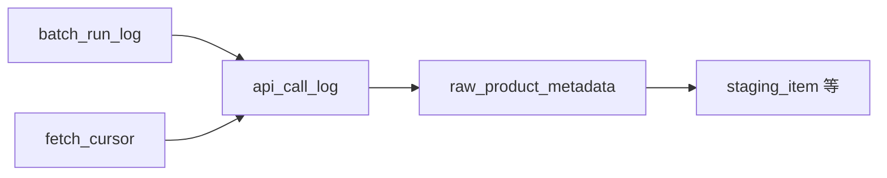
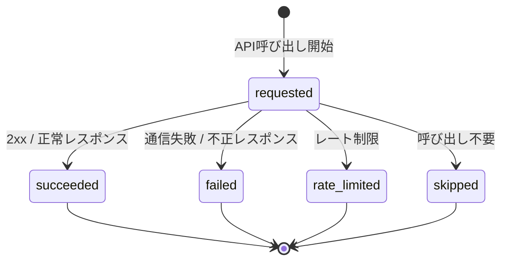

# API Call Log テーブル定義書

## 1. ドキュメント情報

| 項目           | 内容                            |
| -------------- | ------------------------------- |
| ドキュメントID | `DB-TBL-MVP-api_call_log`       |
| ドキュメント名 | API Call Log テーブル定義書       |
| 対象システム   | Gift Recommendation Service MVP |
| MVP対象        | `yes`                           |
| 作成日         | 2026-06-15                      |
| 更新日         | 2026-06-15（`ranking_supplement` / `fetch_cursor_id` 連携追記） |

---

## 2. 概要

`api_call_log` は、楽天 API 等 **外部 API 呼び出し 1 リクエスト単位** の監査・再実行・レート制御追跡を batch が記録する Log 系テーブルである。

`fetch_cursor`（任意）→ **`api_call_log`** → `raw_product_metadata` の外部商品データ連携系フローの中核であり、IF-DB-BATCH-002（API Call Log 保存）・IF-OBS-004（API Call Log 記録）の DB 正本となる。

商品 1 件ごとではなく **API リクエスト単位** で `call_status` を管理する（状態遷移設計書 §6.2.4）。Public API では返却しない（内部 Batch / 監査データ）。

---

## 3. 目的

- 外部 API 呼び出し条件（マスキング済み `request_params_json` / `request_params_hash`）と成否（`call_status` / `response_status`）を記録する
- `batch_run_log` / `fetch_cursor` との LOGICAL FK により Batch 実行・走査条件単位の trace を可能にする
- `raw_product_metadata` との produces 関係の参照元として、Raw 取込までの経路を追跡する
- `rate_limited` 終端時の Fetch Cursor `paused` 連動（fetch_cursor 定義書 §5.3）の判断材料を提供する
- 後続 DDL Task が migration を作成できる粒度まで設計を確定する

---

## 4. テーブル基本情報

| 項目 | 内容 |
| ---- | ---- |
| 物理テーブル名 | `api_call_log` |
| 論理テーブル名 | API Call Log |
| 分類 | 外部商品データ連携系 / Log |
| 正本区分 | Log |
| 主な更新主体 | batch（Rakuten API Client / `MOD-BATCH-002` Fetch Cursor Manager 連携） |
| 主な参照主体 | batch（Raw Product Metadata Writer / 監査・再実行分析） |
| MVP対象 | `yes` |
| 関連物理ER | `docs/06_実装設計/database/物理ER.md` §8–§11 |

---

## 5. 用途・責務

- **外部 API 1 呼び出し = 1 行** を INSERT し、`call_status` でライフサイクルを管理する（状態遷移設計書 §6.2）
- 呼び出し開始時に `requested`、終了時に `succeeded` / `failed` / `rate_limited` / `skipped` へ更新する（終端状態は再遷移しない）
- `request_params_json` には **マスキング済み** リクエスト条件のみ保存する（ログ・Observability設計書 §14.3）
- Raw レスポンス本文は **保存しない**（Object Storage の Raw JSON 正本。`raw_product_metadata` 責務）
- `batch_run_id` / `request_params_hash` / `response_status` / `api_version` 等、外部商品データ連携設計書 §8.4 で Raw Metadata 側に列挙されていた項目の **Log 側正本** を担う（raw_product_metadata 定義書 §5.4 と整合）
- **追記型 Log**。同一 `api_call_log_id` の履歴改変は行わず、再試行は **新規行 INSERT** とする（§12）

### 5.1 対象外

- Raw JSON 本体 / Object Storage 参照（`raw_product_object` / `raw_product_metadata` の責務）
- Fetch Cursor 走査状態本体（`fetch_cursor` の責務。本テーブルでは controls 関係のみ）
- Batch 実行ヘッダ（`batch_run_log` の責務。`batch_run_id` は LOGICAL 参照のみ）
- Staging / Item 正本 / 差分判定（`staging_*` / `item` / `product_diff_result` の責務）
- Public API 公開

### 5.2 `fetch_cursor` → `api_call_log` → `raw_product_metadata` 関係

論理ER §9.3・物理ER §9・`fetch_cursor_テーブル定義書` §5.2 / `raw_product_metadata_テーブル定義書` §5.2 に従う。

| 観点 | 方針 |
| ---- | ---- |
| データフロー | `fetch_cursor`（任意）→ **`api_call_log`（1 外部 API 呼び出し）** → `raw_product_metadata`（1 Raw レスポンス）→ `staging_*` |
| 物理ER 関係（上流） | `batch_run_log` → `api_call_log` : `has`（**LOGICAL** 1:N） |
| 物理ER 関係（上流） | `fetch_cursor` → `api_call_log` : `controls`（**LOGICAL** 1:N） |
| 物理ER 関係（下流） | `api_call_log` → `raw_product_metadata` : `produces`（**LOGICAL** 1:N。通常 1:1） |
| `fetch_cursor_id` | **nullable**。カーソル非経由の外部 API 呼び出しは `NULL`（例: BATCH-001 `genre_search`、BATCH-002 `item_ranking`） |
| BATCH-002 と fetch_cursor | BATCH-002（Ranking Unknown Item Collector）は未登録 `external_item_code` 向けに `fetch_cursor`（`cursor_type = ranking_supplement`）を **登録**するが、当該 Batch 内のランキング API `api_call_log` 行は `fetch_cursor_id = NULL` |
| BATCH-003 消費 | `ranking_supplement` / `genre` / `keyword` 等のカーソル経由 `item_search` 呼び出しでは `fetch_cursor_id` を **設定**（通常 NOT NULL） |
| `batch_run_id` | **NOT NULL**。所属 Batch 実行を必ず記録（trace キー） |
| Raw 未保存時 | `call_status` が `failed` / `rate_limited` / `skipped` 等で Raw を保存しない場合、**`raw_product_metadata` 行は作成しない**（raw_product_metadata 定義書 §5.2） |



### 5.3 `fetch_cursor.call_status` 連動（`rate_limited` → `paused`）

`fetch_cursor_テーブル定義書` §5.3・§17.1 No.3 と双方向整合とする。

| 観点 | 方針 |
| ---- | ---- |
| 責務分離 | `call_status` は **API 呼び出し単位** の終端結果。`cursor_status` は **走査条件単位** の継続可否 |
| `rate_limited` | `call_status = rate_limited` 終端かつ `fetch_cursor_id IS NOT NULL` の場合、Fetch Cursor Manager は **同一 Batch 処理内で `cursor_status = paused` へ UPDATE する（MVP 必須）** |
| 自動連動 | MVP では **DB トリガーは使わない**。Batch アプリが `api_call_log` 終端 UPDATE 直後に `fetch_cursor` を UPDATE する |
| `fetch_cursor_id IS NULL` | カーソル非経由呼び出しでは Fetch Cursor 連動は **行わない**（`rate_limited` 記録のみ） |
| `failed` | 個別 `failed` だけではカーソルは `active` のまま再試行可能な場合あり（fetch_cursor 定義書 §5.3） |

### 5.4 ログ・Observability設計書 §14 / 論理ER §9.2 との差分整理

| ログ・Observability設計書 §14.2 | 論理ER §9.2 | 本テーブル（MVP 物理 DDL） | 扱い |
| ------------------------------- | ----------- | -------------------------- | ---- |
| `started_at` | `requested_at` | **`requested_at`** | 論理ER を正とする。Observability の `started_at` は同一概念 |
| `completed_at` | `completed_at` | **`completed_at`** | 一致 |
| `response_status` | `response_status` | **`response_status`** | 一致（HTTP ステータスまたは外部 API ステータスコード） |
| `http_status`（§8.4） | — | **`response_status` に統合** | 外部商品データ連携設計書 §8.4 の `http_status` は本列に集約 |
| `trace_id` | 未列挙 | **`trace_id`** | Observability trace 連携のため **採用**（nullable） |
| `request_params_hash` | 未列挙 | **`request_params_hash`** | Object Storage Key・同一リクエスト識別のため **NOT NULL 採用** |
| `duration_ms` | 未列挙 | **`duration_ms`** | Observability 性能分析のため **採用**（nullable。`completed_at - requested_at` から算出可） |
| `error_code` | 未列挙 | **`error_code`** | 障害調査のため **採用**（nullable。例: `GRS-EXT-102`） |
| `api_version`（§8.4） | 未列挙 | **`api_version`** | 外部 API バージョン追跡のため **採用**（nullable） |
| `request_params_json` | `request_params_json` | **`request_params_json`** | 一致（`jsonb` 型で保持） |

### 5.5 保存禁止情報（マスキング方針）

ログ・Observability設計書 §14.3 を正とする。`request_params_json` および error 関連列に以下を **含めない**。

- 楽天 API キー / Application ID の平文
- Authorization Header
- 外部 API Secret
- Secret を含む完全 URL
- Raw レスポンス本文（過大データ）

Batch アプリ（Rakuten API Client）は INSERT 前に Adapter 層でマスキングする。

---

## 6. カラム定義

| No | カラム名 | 論理名 | 型 | 必須 | PK | FK | Unique | Default | 説明 |
| --: | -------- | ------ | -- | ---- | -- | -- | ------ | ------- | ---- |
| 1 | `api_call_log_id` | API Call Log ID | `uuid` | `yes` | `yes` | — | `yes` | `gen_random_uuid()` | サロゲート PK。trace キー（IF-OBS-004） |
| 2 | `batch_run_id` | Batch Run ID | `uuid` | `yes` | — | LOGICAL | — | — | 所属 Batch 実行。`batch_run_log.batch_run_id` 参照 |
| 3 | `fetch_cursor_id` | Fetch Cursor ID | `uuid` | `no` | — | LOGICAL | — | `NULL` | 走査条件起点の API 呼び出し時に設定。非経由は `NULL` |
| 4 | `trace_id` | Trace ID | `text` | `no` | — | — | — | `NULL` | 横断追跡 ID（Observability §14.2。batch 実行 trace と連携） |
| 5 | `source` | Data Source | `text` | `yes` | — | — | — | `'rakuten'` | 外部商品データ元。`item.source` と同一コード体系 |
| 6 | `source_api` | Source API | `varchar(32)` | `yes` | — | — | — | — | 呼び出し API 識別子（§11） |
| 7 | `request_params_hash` | Request Params Hash | `text` | `yes` | — | — | — | — | マスキング済み条件の hash。Object Storage Key・再実行識別 |
| 8 | `request_params_json` | Request Params JSON | `jsonb` | `yes` | — | — | — | `'{}'` | マスキング済みリクエスト条件（§5.5） |
| 9 | `api_version` | API Version | `varchar(32)` | `no` | — | — | — | `NULL` | 外部 API バージョン（例: 楽天 API version） |
| 10 | `response_status` | Response Status | `integer` | `no` | — | — | — | `NULL` | HTTP ステータスまたは外部 API ステータス。終端 UPDATE 時に設定 |
| 11 | `call_status` | Call Status | `varchar(32)` | `yes` | — | — | — | `'requested'` | API 呼び出し状態。`api_call_status` enum 準拠 |
| 12 | `item_count` | Item Count | `integer` | `yes` | — | — | — | `0` | レスポンス内商品件数（該当 API に商品列がない場合は 0） |
| 13 | `requested_at` | Requested At | `timestamptz` | `yes` | — | — | — | — | 外部 API 呼び出し開始日時（UTC） |
| 14 | `completed_at` | Completed At | `timestamptz` | `no` | — | — | — | `NULL` | 呼び出し完了日時。終端状態で設定 |
| 15 | `duration_ms` | Duration Ms | `integer` | `no` | — | — | — | `NULL` | 処理時間（ミリ秒）。Observability 分析用 |
| 16 | `error_code` | Error Code | `varchar(64)` | `no` | — | — | — | `NULL` | 失敗時のエラーコード（例: `GRS-EXT-102`） |
| 17 | `created_at` | Created At | `timestamptz` | `yes` | — | — | — | `now()` | 行作成日時（物理ER §5 timestamp 方針） |
| 18 | `updated_at` | Updated At | `timestamptz` | `yes` | — | — | — | `now()` | 行最終更新日時（`call_status` 終端 UPDATE 時） |

> **論理ER §9.2 との差分**: 論理ER表に未列挙の `trace_id` / `request_params_hash` / `duration_ms` / `error_code` / `api_version` / `created_at` / `updated_at` を物理 DDL で追加する（§5.4）。`request_params_json` は論理型未明示のため **`jsonb`** を採用する。

---

## 7. 主キー・一意キー

| 種別 | 対象カラム | 方針 | 備考 |
| ---- | ---------- | ---- | ---- |
| PRIMARY KEY | `api_call_log_id` | サロゲート UUID | `raw_product_metadata.api_call_log_id` の LOGICAL 参照先 |

> MVP では **自然キー UNIQUE は設けない**。同一条件の再試行・再取得は **新規 `api_call_log_id`** で追記する（§12）。

---

## 8. 外部キー・参照関係

### 8.1 参照先（論理）

| カラム | 参照先 | FK制約 | 参照整合性 | 備考 |
| ------ | ------ | ------ | ---------- | ---- |
| `batch_run_id` | `batch_run_log.batch_run_id` | `LOGICAL` | Batch INSERT 前に run 存在 | 物理ER §9 has |
| `fetch_cursor_id` | `fetch_cursor.fetch_cursor_id` | `LOGICAL` | 設定時は Batch で存在確認 | 物理ER §9 controls。nullable |

### 8.2 被参照（論理）

| 参照元 | 参照列 | 関係 | FK制約 | 備考 |
| ------ | ------ | ---- | ------ | ---- |
| `raw_product_metadata` | `api_call_log_id` | produces | `LOGICAL` | raw_product_metadata 定義書 §5.2。nullable 側は被参照元 |
| `ranking_snapshot` | `api_call_log_id` | — | `LOGICAL` | 追跡用 nullable（ranking_snapshot 定義書） |
| `error_log` | `owner_id`（`owner_type=api_call`） | — | `LOGICAL` | polymorphic。必要時のみ |

---

## 9. Index

| Index名 | 対象カラム | 種別 | 用途 | 備考 |
| ------- | ---------- | ---- | ---- | ---- |
| `api_call_log_pkey` | `api_call_log_id` | btree（PK） | 主キー | 自動生成 |
| `idx_api_call_log_batch` | `batch_run_id`, `requested_at` | btree | Batch 分析 | 物理ER §10 確定 |
| `idx_api_call_log_fetch_cursor` | `fetch_cursor_id`, `requested_at` | btree | 走査条件単位の呼び出し履歴 | `fetch_cursor_id` nullable |
| `idx_api_call_log_status` | `call_status`, `requested_at` | btree | 障害・レート制限監視 | |
| `idx_api_call_log_source_api` | `source_api`, `requested_at` | btree | API 種別別分析 | |
| `idx_api_call_log_trace` | `trace_id` | btree | 横断 trace 検索 | `trace_id` nullable |

---

## 10. 制約

| 制約名 | 種別 | 対象 | 内容 | 備考 |
| ------ | ---- | ---- | ---- | ---- |
| `api_call_log_pkey` | PRIMARY KEY | `api_call_log_id` | 主キー | — |
| `chk_api_call_log_source_mvp` | CHECK | `source` | `source = 'rakuten'` | MVP 固定 |
| `chk_api_call_log_source_api` | CHECK | `source_api` | `source_api` 許容値 | enum定義書 §6.24 |
| `chk_api_call_log_status` | CHECK | `call_status` | `api_call_status` 許容値 | enum定義書 §6.6 |
| `chk_api_call_log_item_count_nonneg` | CHECK | `item_count` | `item_count >= 0` | |
| `chk_api_call_log_duration_nonneg` | CHECK | `duration_ms` | `duration_ms IS NULL OR duration_ms >= 0` | |
| `chk_api_call_log_terminal_completed` | CHECK | `completed_at` | 終端状態では `completed_at IS NOT NULL` | §11.2 |

---

## 11. 状態・enum

| カラム | enum / code | 定義元 | 許容値 | 備考 |
| ------ | ----------- | ------ | ------ | ---- |
| `call_status` | `api_call_status` | `enum定義書.md` §6.6 / `packages/code-definitions/state/api_call_status.yaml` | `requested`, `succeeded`, `failed`, `rate_limited`, `skipped` | NOT NULL |
| `source_api` | `source_api` | `enum定義書.md` §6.24 / `packages/code-definitions/batch/source_api.yaml` | `item_search`, `item_ranking`, `genre_search`, `attribute_search` | NOT NULL |
| `source` | （code 未定義） | `item.source` 慣行 | MVP: `rakuten` | CHECK で固定 |

### 11.1 `call_status` 状態遷移

状態遷移設計書 §6.2 を正とする。

| 状態 | 意味 | 終端 |
| ---- | ---- | ---- |
| `requested` | 外部 API リクエスト開始 | × |
| `succeeded` | 外部 API レスポンス取得成功 | ○ |
| `failed` | 外部 API 取得失敗 | ○ |
| `rate_limited` | レート制限により取得失敗 | ○ |
| `skipped` | 取得条件により呼び出しをスキップ | ○ |



### 11.2 終端状態と `completed_at`

| `call_status` | `completed_at` | `response_status` | 備考 |
| ------------- | -------------- | ----------------- | ---- |
| `requested` | `NULL` | 任意 | 呼び出し中 |
| `succeeded` | **NOT NULL** | 推奨設定 | Raw Metadata 作成の前提になり得る |
| `failed` | **NOT NULL** | 推奨設定 | error_log 連携可 |
| `rate_limited` | **NOT NULL** | 429 等 | Fetch Cursor `paused` 連動対象（§5.3） |
| `skipped` | **NOT NULL** | — | 呼び出し省略記録 |

---

## 12. 更新仕様

| 操作 | 実行主体 | 条件 | 更新項目 | 冪等性 | 備考 |
| ---- | -------- | ---- | -------- | ------ | ---- |
| INSERT | batch | API 呼び出し開始 | 識別列 + `call_status=requested` + `requested_at` | 毎回新規 UUID | IF-DB-BATCH-002 / IF-OBS-004 |
| UPDATE | batch | 正常終了 | `call_status=succeeded`, `response_status`, `item_count`, `completed_at`, `duration_ms`, `updated_at` | 同一行 1 回 | 続けて raw_product_metadata 作成可 |
| UPDATE | batch | 失敗 | `call_status=failed`, `response_status`, `error_code`, `completed_at`, `duration_ms`, `updated_at` | 同一行 1 回 | Batch 継続可能なら partially_succeeded |
| UPDATE | batch | レート制限 | `call_status=rate_limited`, `response_status`, `error_code`, `completed_at`, `duration_ms`, `updated_at` | 同一行 1 回 | 直後に fetch_cursor `paused`（§5.3） |
| UPDATE | batch | スキップ | `call_status=skipped`, `completed_at`, `updated_at` | 同一行 1 回 | 呼び出し不要条件 |
| DELETE | — | MVP では原則禁止 | — | — | Retention Batch は後続 Task |

### 12.1 典型フロー（BATCH 通常経路）

```sql
-- 1) API 呼び出し開始
INSERT INTO api_call_log (
  batch_run_id, fetch_cursor_id, trace_id,
  source, source_api, request_params_hash, request_params_json,
  call_status, requested_at
) VALUES (
  :batch_run_id, :fetch_cursor_id, :trace_id,
  'rakuten', :source_api, :request_params_hash, :request_params_json,
  'requested', :requested_at
) RETURNING api_call_log_id;

-- 2) 外部 API 呼び出し（アプリ層）

-- 3) 終端 UPDATE
UPDATE api_call_log
SET call_status = :terminal_status,
    response_status = :response_status,
    item_count = :item_count,
    completed_at = :completed_at,
    duration_ms = :duration_ms,
    error_code = :error_code,
    updated_at = now()
WHERE api_call_log_id = :api_call_log_id
  AND call_status = 'requested';

-- 4) rate_limited かつ fetch_cursor_id IS NOT NULL → fetch_cursor UPDATE paused（§5.3）

-- 5) succeeded かつ Raw 保存対象 → raw_product_metadata INSERT（api_call_log_id 設定）
```

### 12.2 再実行方針

状態遷移設計書 §11.3: **同一 `api_call_log_id` を再開しない**。同条件再取得は **新規 INSERT** とする。

---

## 13. データ保持・削除

| 観点 | 方針 |
| ---- | ---- |
| 保持期間 | **90 日〜180 日**（ログ・Observability設計書 §20.2 推奨。MVP 初期は方針明記のみ） |
| 削除方式 | 後続 Retention Batch による **物理 DELETE** 候補 |
| 削除条件 | `requested_at < now() - interval '90 days'` 等（具体閾値は Human Review） |
| 論理削除 | 採用しない（Log 追記型） |
| partition | MVP **未適用**。物理ER §17 No.5 に従い本番前に range partition 検討 |
| アーカイブ | MVP 対象外 |

---

## 14. Migration / DDL

| 項目 | 内容 |
| ---- | ---- |
| DDL対象 | `api_call_log` |
| migration単位 | 1 テーブル = 1 migration（DDL Task） |
| 適用順序 | Log / 外部商品データ連携系。`batch_run_log` **後**（`batch_run_id` 参照）。`fetch_cursor` / `raw_product_metadata` と **並行または前**（LOGICAL FK のため strict 順序不要） |
| rollback方針 | forward migration 主体。DROP は Human Review 必須 |
| 破壊的変更有無 | `no`（初回 CREATE） |

---

## 15. セキュリティ・権限

| 観点 | 方針 |
| ---- | ---- |
| 読み取り権限 | batch（service role 経由）のみ |
| 書き込み権限 | batch のみ。Online / reco / web からの DML 禁止（認証・認可方針書） |
| service role利用 | Rakuten API Client / Raw Metadata Writer に限定 |
| 個人情報・機微情報 | `request_params_json` に API キー・Secret を含めない（§5.5） |
| ログ出力制限 | `request_params_json` 全文を error ログに過剰出力しない |

---

## 16. テスト観点

| No | 観点 | 確認内容 | 種別 |
| --: | ---- | -------- | ---- |
| 1 | DDL適用 | CREATE TABLE / Index / CHECK が定義どおり | migration |
| 2 | enum整合 | `call_status` / `source_api` が enum 定義と一致 | migration |
| 3 | 状態遷移 | `requested`→各終端が 1 回 UPDATE で完結 | integration |
| 4 | batch_run 連携 | `batch_run_id` が必須で trace 可能 | integration |
| 5 | fetch_cursor 連携 | `fetch_cursor_id` 設定時に controls 関係が trace 可能 | integration |
| 6 | rate_limited 連動 | `rate_limited` 後に同一処理内で fetch_cursor `paused` | integration |
| 7 | raw_metadata 連携 | `succeeded` 後に `raw_product_metadata.api_call_log_id` が設定される | integration |
| 8 | マスキング | `request_params_json` に API キーが含まれない | manual |
| 9 | 権限 | web client から Direct DB アクセス不可 | manual |

---

## 17. 未決事項

| No | 論点 | 判断が必要な理由 | 判断者 | 期限 | 備考 |
| --: | ---- | ---------------- | ------ | ---- | ---- |
| — | — | — | — | — | Human Review #527 にて No.1〜5 を決定（下記参照） |

### 17.1 Human Review 決定事項（Issue #527）

| No | 論点 | 決定内容 | 決定者 | 備考 |
| --: | ---- | -------- | ------ | ---- |
| 1 | 呼び出し開始・完了日時の物理列名 | **`requested_at` / `completed_at` を採用**（論理ER §9.2 正）。Observability `started_at` は同一概念 | Human | §5.4 |
| 2 | HTTP ステータス列名 | **`response_status`（integer）を採用**。外部商品データ連携設計書 §8.4 の `http_status` は本列に統合 | Human | §5.4 |
| 3 | Observability 追加列の採否 | **`trace_id`（nullable）・`request_params_hash`（NOT NULL）・`duration_ms`（nullable）・`error_code`（nullable）・`api_version`（nullable）を採用** | Human | §5.4・§6 |
| 4 | `fetch_cursor_id` nullable | **nullable 維持**。BATCH-001 / BATCH-002 の **外部 API 呼び出し Log**（`genre_search` / `item_ranking`）は `fetch_cursor_id = NULL`。BATCH-002 は `ranking_supplement` カーソルを `fetch_cursor` に **登録**するが、ランキング API の `api_call_log` には紐づけない。BATCH-003 が `ranking_supplement` を消費した `item_search` 呼び出しでは **NOT NULL**（通常） | Human | §5.2・`fetch_cursor` 定義書 §17.1 No.5 |
| 5 | Retention 具体日数 | **方針 90〜180 日を明記**。自動削除 Batch は MVP 外（後続 Task） | Human | §13 |

---

## 18. 関連資料

| 種別 | パス / URL | 用途 |
| ---- | ---------- | ---- |
| 物理ER | `docs/06_実装設計/database/物理ER.md` | Log 系・LOGICAL FK・Index |
| 論理ER | `docs/05_アプリケーション設計/アプリ/database/論理ER.md` | §9.2 / §9.3 |
| テーブル一覧 | `docs/05_アプリケーション設計/アプリ/database/テーブル一覧.md` | §6 No.18 |
| enum定義書 | `docs/06_実装設計/database/enum定義書.md` | §6.6 api_call_status・§6.24 source_api |
| 状態遷移設計書 | `docs/05_アプリケーション設計/アプリ/状態遷移設計書.md` | §6.2 / §11.2 / §11.3 |
| 外部商品データ連携 | `docs/05_アプリケーション設計/アプリ/外部商品データ連携設計書.md` | §8.4 責務境界 |
| ログ・Observability | `docs/05_アプリケーション設計/アプリ/ログ・Observability設計書.md` | §14 / §20.2 Retention |
| バッチ設計方針書 | `docs/05_アプリケーション設計/アプリ/batch/バッチ設計方針書.md` | Rate Limit 方針 |
| インターフェース一覧 | `docs/05_アプリケーション設計/アプリ/インターフェース一覧.md` | IF-DB-BATCH-002 / IF-OBS-004 |
| fetch_cursor 定義書 | `docs/06_実装設計/database/fetch_cursor_テーブル定義書.md` | §5.2 / §5.3 controls |
| raw_product_metadata 定義書 | `docs/06_実装設計/database/raw_product_metadata_テーブル定義書.md` | §5.2 produces |

---

## 19. レビュー観点

- 論理ER §9.2・物理ER §9 / §10・テーブル一覧 §6 No.18 と矛盾していない
- `call_status` 状態遷移が状態遷移設計書 §6.2・enum定義書 §6.6 と一致している
- `fetch_cursor` → `api_call_log` controls と `rate_limited` → `paused` 連動が §5.2 / §5.3 に明記されている
- BATCH-002 ランキング API（`fetch_cursor_id = NULL`）と BATCH-002 → BATCH-003 `ranking_supplement` 経路（BATCH-003 消費時は `fetch_cursor_id` 設定）が §5.2 に明記されている
- `api_call_log` → `raw_product_metadata` produces と trace キー方針が §5.2 に明記されている
- ログ・Observability設計書 §14 との差分が §5.4 で整理されている
- `request_params_json` マスキング方針（§5.5）が明記されている
- fetch_cursor / raw_product_metadata 本体定義を本 Task に混入していない
- DDL Task が CREATE TABLE を起こせる粒度である
- secret や `.env` 実値が含まれていない
