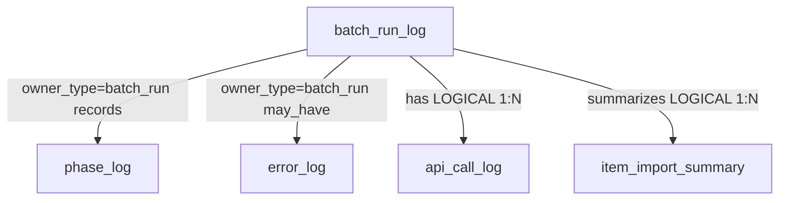
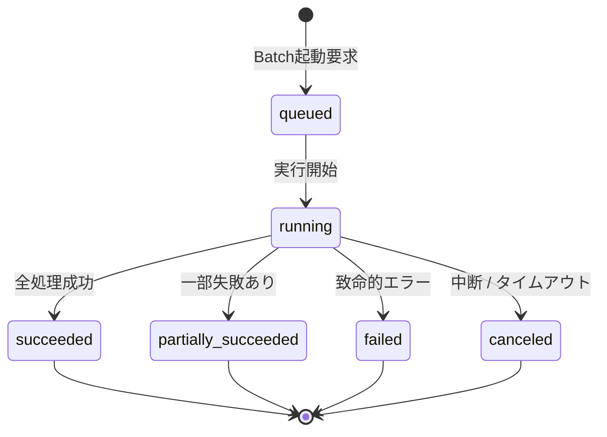

# Batch Run Log テーブル定義書

## 1. ドキュメント情報

| 項目           | 内容                            |
| -------------- | ------------------------------- |
| ドキュメントID | `DB-TBL-MVP-batch_run_log`      |
| ドキュメント名 | Batch Run Log テーブル定義書      |
| 対象システム   | Gift Recommendation Service MVP |
| MVP対象        | `yes`                           |
| 作成日         | 2026-06-15                      |
| 更新日         | 2026-06-15                      |

---

## 2. 概要

`batch_run_log` は、GitHub Actions 等により起動される **Batch 実行 1 回単位** の開始・終了・全体状態・集計サマリを batch が記録する Log 系テーブルである。

Batch 実行単位のログ正本であり、`phase_log` / `error_log` の親（`owner_type=batch_run`）。`api_call_log` / `item_import_summary` / `product_diff_result` 等の上流ヘッダとして IF-DB-BATCH-001（Batch Run Log 保存）・IF-OBS-003（Batch Run Log 記録）の DB 正本となる。

Public API では返却しない（内部 Batch / 監査データ）。

---

## 3. 目的

- Batch 実行のライフサイクル（`run_status`）を Batch 単位で管理する（状態遷移設計書 §6.1）
- `phase_log` / `error_log` の polymorphic owner 参照元として、フェーズ・障害 trace の親キーを提供する
- `api_call_log` 等下流 Log の `batch_run_id` LOGICAL 参照先として、外部 API 呼び出し・取込・差分判定を Batch 単位で束ねる
- GitHub Actions 実行結果と DB 状態を突合可能にする（インターフェース一覧 Workflow IF）
- 後続 DDL Task が migration を作成できる粒度まで設計を確定する

---

## 4. テーブル基本情報

| 項目 | 内容 |
| ---- | ---- |
| 物理テーブル名 | `batch_run_log` |
| 論理テーブル名 | Batch Run Log |
| 分類 | Log / Observability系 / Log |
| 正本区分 | Log |
| 主な更新主体 | batch（Batch Run Log Writer / `MOD-BATCH-045`） |
| 主な参照主体 | batch（監査・集計・再実行分析）、Admin API 将来参照（API-ADM-005 後続） |
| MVP対象 | `yes` |
| 関連物理ER | `docs/06_実装設計/database/物理ER.md` §8–§11・§13 |

---

## 5. 用途・責務

- **Batch 1 実行 = 1 行** を INSERT し、`run_status` でライフサイクルを管理する（状態遷移設計書 §6.1）
- Batch 起動時に `queued` → `running` へ遷移し、終了時に `succeeded` / `partially_succeeded` / `failed` / `canceled` へ更新する（終端状態は再遷移しない）
- 商品 1 件ごとの細かい処理状態は **本テーブルでは更新しない**（状態遷移設計書 §6.1.3）。詳細は `phase_log` / `api_call_log` / `item_import_summary` で追跡する
- `error_summary` には **マスキング済み概要** のみ保持する（Secret・個人情報・スタックトレース全文は `error_log` 側）
- **追記型 Log ヘッダ**。同一 `batch_run_id` の履歴改変は行わず、再実行は **新規行 INSERT** とする（§12）

### 5.1 対象外

- フェーズ単位の詳細ログ（`phase_log` の責務。本テーブルでは owner 親関係のみ）
- エラー詳細（`error_log` の責務。本テーブルでは owner 親関係と `error_summary` 概要のみ）
- 外部 API 呼び出し 1 件単位（`api_call_log` の責務）
- Import 内訳集計の正本（`item_import_summary` の責務。`fetched_count` / `new_count` 等）
- 商品差分判定 1 件単位（`product_diff_result` の責務）
- Public API 公開（MVP では Admin 参照は後続）

### 5.2 `phase_log` / `error_log` との親子関係

論理ER §13.1・物理ER §9・ログ・Observability設計書 §9.3 / §10.2 に従う。

| 観点 | 方針 |
| ---- | ---- |
| 親子モデル | **`batch_run_log` が親**。子 Log は polymorphic `owner_type` + `owner_id` で参照 |
| `phase_log` | `owner_type = 'batch_run'`、`owner_id = batch_run_id`（**LOGICAL** 1:N `records`） |
| `error_log` | `owner_type = 'batch_run'`、`owner_id = batch_run_id`（**LOGICAL** 0:N `may_have`） |
| フェーズ粒度 | Batch 内フェーズ（fetch / staging / import / feature_generation 等）は **`phase_log.phase_name`** で記録。`batch_run_log` 行自体に phase 列は持たない |
| エラー粒度 | 致命的 Batch 失敗・想定外例外は `error_log` に詳細記録。`batch_run_log.error_summary` は **運用向け短い概要** |
| 物理 FK | MVP では **polymorphic FK なし**（物理ER §9・論理ER §13.2 方針） |
| DDL 適用順 | **`batch_run_log` 先行作成** → `phase_log` / `error_log`（別 Task） |



### 5.3 下流テーブルとの LOGICAL FK（被参照）

物理ER §9・論理ER §14.4 を正とする。

| 参照元 | 参照列 | 関係 | FK制約 | 備考 |
| ------ | ------ | ---- | ------ | ---- |
| `api_call_log` | `batch_run_id` | has | `LOGICAL` | **NOT NULL**。api_call_log 定義書 §5.2 |
| `item_import_summary` | `batch_run_id` | summarizes | `LOGICAL` | BATCH-017 集計。別 Task |
| `product_diff_result` | `batch_run_id` | — | `LOGICAL` | BATCH-006 冪等キー構成要素 |
| `ranking_snapshot` | `batch_run_id` | — | `LOGICAL` | 追跡用 **nullable** |
| `phase_log` | `owner_id`（`owner_type=batch_run`） | records | `LOGICAL` | §5.2 |
| `error_log` | `owner_id`（`owner_type=batch_run`） | may_have | `LOGICAL` | §5.2 |

> **適用順序**: 下流テーブルはいずれも **`batch_run_log` 作成後** に INSERT 可能（LOGICAL FK のため migration 順序は Log 系内で `batch_run_log` を先に CREATE）。

### 5.4 論理ER / 状態遷移設計書 / Observability との差分整理

| 出典 | 列・概念 | 本テーブル（MVP 物理 DDL） | 扱い |
| ---- | -------- | -------------------------- | ---- |
| 論理ER §13.2 | `batch_name` | **`batch_name`** | 採用（NOT NULL） |
| 論理ER §13.2 | `success_count`, `failed_count`, `error_summary` | **採用** | Batch 全体サマリ |
| 論理ER §13.2 | `started_at`, `completed_at`, `run_status` | **採用** | 一致 |
| 状態遷移 §6.1.3 | `fetched_count`, `new_count`, `updated_count`, `unchanged_count`, `skipped_count`, `failed_count` | **本テーブルには持たない** | **`item_import_summary` 正本**（BATCH-017）。Run 全体 rollup が必要な場合は Import Summary Builder が集約 |
| Observability §13.2 | `batch_type` | **`batch_type`（nullable）** | 処理カテゴリ分類のため **採用**（§11.3） |
| Observability §13.2 | `trace_id`, `duration_ms` | **採用**（nullable） | 横断 trace / 性能分析 |
| Observability §13.2 | `skipped_count` | **採用**（default 0） | Run 全体スキップ件数サマリ |
| Observability §13.2 | `success_count`, `failed_count` | **採用** | 論理ER と一致 |
| — | `created_at`, `updated_at` | **採用** | 物理ER timestamp 方針 |

### 5.5 保存禁止情報（`error_summary` 方針）

ログ・Observability設計書 §14.3・§9.4 を正とする。`error_summary` および関連ログに以下を **含めない**。

- API キー / Application ID / Secret の平文
- Authorization Header
- `.env` 実値・DB 接続文字列
- Raw レスポンス本文
- 個人を特定できる自由記述（Recommendation Request 等）

詳細は `error_log.error_detail_json`（マスキング済み）へ委譲する。

---

## 6. カラム定義

| No | カラム名 | 論理名 | 型 | 必須 | PK | FK | Unique | Default | 説明 |
| --: | -------- | ------ | -- | ---- | -- | -- | ------ | ------- | ---- |
| 1 | `batch_run_id` | Batch Run ID | `uuid` | `yes` | `yes` | — | `yes` | `gen_random_uuid()` | サロゲート PK。trace キー（IF-OBS-003） |
| 2 | `trace_id` | Trace ID | `text` | `no` | — | — | — | `NULL` | 横断追跡 ID（Observability §13.2。GitHub Actions / api_call_log と連携） |
| 3 | `batch_name` | Batch Name | `text` | `yes` | — | — | — | — | 実行 Batch 識別子（例: `BATCH-001`、workflow 名 `batch-rakuten-genre-sync`） |
| 4 | `batch_type` | Batch Type | `varchar(32)` | `no` | — | — | — | `NULL` | 処理カテゴリ（§11.3）。未分類 Batch は `NULL` 可 |
| 5 | `run_status` | Run Status | `varchar(32)` | `yes` | — | — | — | `'queued'` | Batch 実行状態。`batch_run_status` enum 準拠 |
| 6 | `started_at` | Started At | `timestamptz` | `yes` | — | — | — | — | Batch 実行開始日時（UTC） |
| 7 | `completed_at` | Completed At | `timestamptz` | `no` | — | — | — | `NULL` | Batch 実行完了日時。終端状態で設定 |
| 8 | `duration_ms` | Duration Ms | `integer` | `no` | — | — | — | `NULL` | 処理時間（ミリ秒）。`completed_at - started_at` から算出可 |
| 9 | `success_count` | Success Count | `integer` | `yes` | — | — | — | `0` | 正常処理件数サマリ（Run 全体） |
| 10 | `failed_count` | Failed Count | `integer` | `yes` | — | — | — | `0` | 失敗件数サマリ（Run 全体） |
| 11 | `skipped_count` | Skipped Count | `integer` | `yes` | — | — | — | `0` | スキップ件数サマリ（Run 全体） |
| 12 | `error_summary` | Error Summary | `text` | `no` | — | — | — | `NULL` | マスキング済みエラー概要（`failed` / `partially_succeeded` 時） |
| 13 | `created_at` | Created At | `timestamptz` | `yes` | — | — | — | `now()` | 行作成日時 |
| 14 | `updated_at` | Updated At | `timestamptz` | `yes` | — | — | — | `now()` | 行最終更新日時（終端 UPDATE 時） |

> **論理ER §13.2 との差分**: 論理ER未列挙の `trace_id` / `batch_type` / `duration_ms` / `skipped_count` / `created_at` / `updated_at` を物理 DDL で追加する（§5.4）。状態遷移 §6.1.3 の詳細 Import 件数は `item_import_summary` へ委譲する。

---

## 7. 主キー・一意キー

| 種別 | 対象カラム | 方針 | 備考 |
| ---- | ---------- | ---- | ---- |
| PRIMARY KEY | `batch_run_id` | サロゲート UUID | 下流 LOGICAL FK の参照先 |

> MVP では **自然キー UNIQUE は設けない**。同一 Batch の再実行は **新規 `batch_run_id`** で追記する（§12）。

---

## 8. 外部キー・参照関係

### 8.1 参照先（論理）

なし（`batch_run_log` は Log 系ヘッダ。上流 FK なし）。

### 8.2 被参照（論理）

| 参照元 | 参照列 | 関係 | FK制約 | 備考 |
| ------ | ------ | ---- | ------ | ---- |
| `api_call_log` | `batch_run_id` | has | `LOGICAL` | api_call_log 定義書 §8.1 |
| `item_import_summary` | `batch_run_id` | summarizes | `LOGICAL` | BATCH-017 |
| `product_diff_result` | `batch_run_id` | — | `LOGICAL` | product_diff_result 定義書 §8.1 |
| `ranking_snapshot` | `batch_run_id` | — | `LOGICAL` | nullable 追跡 |
| `phase_log` | `owner_id` | records | `LOGICAL` | `owner_type = 'batch_run'` |
| `error_log` | `owner_id` | may_have | `LOGICAL` | `owner_type = 'batch_run'` |

---

## 9. Index

| Index名 | 対象カラム | 種別 | 用途 | 備考 |
| ------- | ---------- | ---- | ---- | ---- |
| `batch_run_log_pkey` | `batch_run_id` | btree（PK） | 主キー | 自動生成 |
| `idx_batch_run_log_status` | `run_status`, `started_at` DESC | btree | 状態監視・Admin 履歴 | recommendation_run 同型 |
| `idx_batch_run_log_name` | `batch_name`, `started_at` DESC | btree | Batch 種別別履歴 | IF-OBS-003 分析 |
| `idx_batch_run_log_trace` | `trace_id` | btree | 横断 trace 検索 | `trace_id` nullable |

---

## 10. 制約

| 制約名 | 種別 | 対象 | 内容 | 備考 |
| ------ | ---- | ---- | ---- | ---- |
| `batch_run_log_pkey` | PRIMARY KEY | `batch_run_id` | 主キー | — |
| `chk_batch_run_log_status` | CHECK | `run_status` | `batch_run_status` 許容値 | enum定義書 §6.5 |
| `chk_batch_run_log_counts_nonneg` | CHECK | `success_count`, `failed_count`, `skipped_count` | 各 count `>= 0` | |
| `chk_batch_run_log_duration_nonneg` | CHECK | `duration_ms` | `duration_ms IS NULL OR duration_ms >= 0` | |
| `chk_batch_run_log_terminal_completed` | CHECK | `completed_at` | 終端状態では `completed_at IS NOT NULL` | §11.2 |
| `chk_batch_run_log_batch_type` | CHECK | `batch_type` | `batch_type IS NULL OR batch_type IN (...)` | §11.3 許容値 |

---

## 11. 状態・enum

| カラム | enum / code | 定義元 | 許容値 | 備考 |
| ------ | ----------- | ------ | ------ | ---- |
| `run_status` | `batch_run_status` | `enum定義書.md` §6.5 / `packages/code-definitions/state/batch_run_status.yaml` | `queued`, `running`, `succeeded`, `partially_succeeded`, `failed`, `canceled` | NOT NULL |
| `batch_type` | （code 未定義） | Observability §13.2 | §11.3 参照 | MVP は CHECK で限定 |

### 11.1 `run_status` 状態遷移

状態遷移設計書 §6.1 を正とする。

| 状態 | 意味 | 終端 |
| ---- | ---- | ---- |
| `queued` | Batch 実行待ち | × |
| `running` | Batch 実行中 | × |
| `succeeded` | 全体が正常終了 | ○ |
| `partially_succeeded` | 一部失敗したが、処理可能分は完了 | ○ |
| `failed` | 致命的エラーにより Batch 全体が失敗 | ○ |
| `canceled` | 手動中断・タイムアウト | ○ |



### 11.2 終端状態と `completed_at` / 集計列

| `run_status` | `completed_at` | `success_count` / `failed_count` / `skipped_count` | `error_summary` | 備考 |
| ------------ | -------------- | --------------------------------------------------- | --------------- | ---- |
| `queued` | `NULL` | 0 初期値 | `NULL` | 起動前 |
| `running` | `NULL` | 処理中は更新可 | `NULL` | 中間集計 UPDATE 可（バッチ設計方針書） |
| `succeeded` | **NOT NULL** | 最終集計 | `NULL` | 全件成功 |
| `partially_succeeded` | **NOT NULL** | 最終集計 | 推奨設定 | `failed_count > 0` 想定 |
| `failed` | **NOT NULL** | 最終集計 | **推奨設定** | `error_log` 連携 |
| `canceled` | **NOT NULL** | 時点までの集計 | 任意 | タイムアウト等 |

### 11.3 `batch_type` 許容値（MVP）

Observability §13.2 を正とする。enum Task 未整備のため MVP は CHECK で限定する。

| 値 | 意味 | 例示 Batch |
| -- | ---- | ---------- |
| `external_fetch` | 外部 API 取得系 | BATCH-001〜004 |
| `staging` | Raw → Staging 変換 | BATCH-005 |
| `import` | 差分判定・Item 反映・状態更新 | BATCH-006〜008 |
| `feature_generation` | 意味 / Feature / Embedding 生成 | BATCH-009〜016 |
| `summary` | Import Summary 集計 | BATCH-017 |
| `maintenance` | 保守・Retention 等 | 後続 Batch |

> workflow 連鎖で複数カテゴリを跨ぐ場合、**起動 Batch の主目的** で 1 値を設定する（Human Review §17）。

---

## 12. 更新仕様

| 操作 | 実行主体 | 条件 | 更新項目 | 冪等性 | 備考 |
| ---- | -------- | ---- | -------- | ------ | ---- |
| INSERT | batch | GitHub Actions 起動 / Batch 開始 | 識別列 + `run_status=queued` + `started_at` | 毎回新規 UUID | IF-DB-BATCH-001 |
| UPDATE | batch | 実行開始 | `run_status=running`, `updated_at` | 同一行 1 回 | 直後に `phase_log` 開始可 |
| UPDATE | batch | 正常終了 | `run_status=succeeded`, 集計列, `completed_at`, `duration_ms`, `updated_at` | 終端 1 回 | |
| UPDATE | batch | 一部失敗 | `run_status=partially_succeeded`, 集計列, `error_summary`, 終端日時 | 終端 1 回 | GRS-BAT-002 |
| UPDATE | batch | 全体失敗 | `run_status=failed`, 集計列, `error_summary`, 終端日時 | 終端 1 回 | GRS-BAT-001 |
| UPDATE | batch | 中断 | `run_status=canceled`, 終端日時 | 終端 1 回 | タイムアウト / 手動停止 |
| DELETE | — | MVP では原則禁止 | — | — | Retention Batch は後続 Task |

### 12.1 典型フロー（バッチ設計方針書 §11 相当）

```sql
-- 1) Batch 起動（GitHub Actions job 開始）
INSERT INTO batch_run_log (
  trace_id, batch_name, batch_type,
  run_status, started_at
) VALUES (
  :trace_id, :batch_name, :batch_type,
  'queued', :started_at
) RETURNING batch_run_id;

-- 2) 実行開始
UPDATE batch_run_log
SET run_status = 'running',
    updated_at = now()
WHERE batch_run_id = :batch_run_id
  AND run_status = 'queued';

-- 3) フェーズ開始（phase_log — 別テーブル）
-- INSERT INTO phase_log (owner_type, owner_id, phase_name, ...) VALUES ('batch_run', :batch_run_id, ...);

-- 4) 下流処理（api_call_log / product_diff_result 等は batch_run_id を設定）

-- 5) 終端 UPDATE
UPDATE batch_run_log
SET run_status = :terminal_status,
    success_count = :success_count,
    failed_count = :failed_count,
    skipped_count = :skipped_count,
    error_summary = :error_summary,
    completed_at = :completed_at,
    duration_ms = :duration_ms,
    updated_at = now()
WHERE batch_run_id = :batch_run_id
  AND run_status = 'running';

-- 6) 致命的失敗時 error_log（owner_type=batch_run）
-- INSERT INTO error_log (owner_type, owner_id, error_code, ...) VALUES ('batch_run', :batch_run_id, ...);
```

### 12.2 再実行方針

同一 `batch_run_id` を再開しない。Workflow 再実行・手動リトライは **新規 INSERT** とする（api_call_log §12.2 と同型）。

### 12.3 `partially_succeeded` 判定方針

| 観点 | 方針 |
| ---- | ---- |
| トリガ | 処理継続可能な部分失敗（Item 一部 Import 失敗、API 一部失敗等） |
| 終端 | Batch ワークフロー自体は完走 |
| 集計 | `failed_count > 0` かつ致命エラーで全体停止していない |
| エラーコード | `GRS-BAT-002`（エラーコード定義書） |

---

## 13. データ保持・削除

| 観点 | 方針 |
| ---- | ---- |
| 保持期間 | **180 日〜365 日**（ログ・Observability設計書 §20.2 / 物理ER §13 Log 系） |
| 削除方式 | 後続 Retention Batch による **物理 DELETE** 候補 |
| 削除条件 | `started_at < now() - interval '180 days'` 等（具体閾値は Human Review） |
| 論理削除 | 採用しない（Log 追記型） |
| partition | MVP **未適用**。物理ER §17 No.5 に従い本番前に range partition 検討 |
| 下流連動 | Retention 削除時は `api_call_log` / `phase_log` 等との **Batch 単位一括削除** を検討（別 Task） |
| アーカイブ | MVP 対象外 |

---

## 14. Migration / DDL

| 項目 | 内容 |
| ---- | ---- |
| DDL対象 | `batch_run_log` |
| migration単位 | 1 テーブル = 1 migration（DDL Task） |
| 適用順序 | Log 系 **先行**（`api_call_log` / `phase_log` / `error_log` / `product_diff_result` 等の LOGICAL 参照元）。enum #440 merge 済み前提 |
| rollback方針 | forward migration 主体。DROP は Human Review 必須 |
| 破壊的変更有無 | `no`（初回 CREATE） |

---

## 15. セキュリティ・権限

| 観点 | 方針 |
| ---- | ---- |
| 読み取り権限 | batch（service role 経由）のみ。Admin API（API-ADM-005）は api 経由で将来参照 |
| 書き込み権限 | batch のみ。Online / reco / web からの DML 禁止（認証・認可方針書） |
| service role利用 | Batch Run Log Writer（`MOD-BATCH-045`）に限定 |
| 個人情報・機微情報 | `error_summary` に Secret・個人情報を含めない（§5.5） |
| ログ出力制限 | `error_summary` 全文をアプリ標準ログに過剰出力しない |

---

## 16. テスト観点

| No | 観点 | 確認内容 | 種別 |
| --: | ---- | -------- | ---- |
| 1 | DDL適用 | CREATE TABLE / Index / CHECK が定義どおり | migration |
| 2 | enum整合 | `run_status` が batch_run_status と一致 | migration |
| 3 | 状態遷移 | `queued`→`running`→各終端が定義どおり | integration |
| 4 | phase_log 親子 | `owner_type=batch_run` / `owner_id=batch_run_id` で trace 可能 | integration |
| 5 | error_log 親子 | Batch 失敗時に `owner_type=batch_run` で記録可能 | integration |
| 6 | api_call_log 連携 | `api_call_log.batch_run_id` が NOT NULL で参照可能 | integration |
| 7 | partially_succeeded | 一部失敗で `partially_succeeded` 終端 | integration |
| 8 | マスキング | `error_summary` に Secret が含まれない | manual |
| 9 | 権限 | web client から Direct DB アクセス不可 | manual |

---

## 17. 未決事項

| No | 論点 | 判断が必要な理由 | 判断者 | 期限 | 備考 |
| --: | ---- | ---------------- | ------ | ---- | ---- |
| 1 | 状態遷移 §6.1.3 詳細件数の物理配置 | `fetched_count` 等を Run ヘッダに rollup するか Summary のみか | Human | Task PR Review | §5.4 で Summary 正本案 |
| 2 | `batch_type` enum 化 | CHECK 限定 vs `packages/code-definitions` 追加 | Human | 後続 enum Task | §11.3 |
| 3 | Retention 具体日数 | 180 vs 365 日 | Human | 運用 Task | §13 |
| 4 | `batch_name` 命名規約 | `BATCH-00N` vs workflow ファイル名の正本 | Human | Batch 実装 Task | IF-OBS-003 |
| 5 | Admin API 公開項目 | API-ADM-005 で返却する列範囲 | Human | API Contract Task | MVP 後続 |

---

## 18. 関連資料

| 種別 | パス / URL | 用途 |
| ---- | ---------- | ---- |
| 物理ER | `docs/06_実装設計/database/物理ER.md` | Log 系・LOGICAL FK・Retention |
| 論理ER | `docs/05_アプリケーション設計/アプリ/database/論理ER.md` | §13.2 / §14.4 / §15 |
| テーブル一覧 | `docs/05_アプリケーション設計/アプリ/database/テーブル一覧.md` | §6 No.56 |
| enum定義書 | `docs/06_実装設計/database/enum定義書.md` | §6.5 batch_run_status |
| 状態遷移設計書 | `docs/05_アプリケーション設計/アプリ/状態遷移設計書.md` | §6.1 / §6.1.3 |
| ログ・Observability | `docs/05_アプリケーション設計/アプリ/ログ・Observability設計書.md` | §9.3 / §10 / §13.2 / §20.2 |
| バッチ設計方針書 | `docs/05_アプリケーション設計/アプリ/batch/バッチ設計方針書.md` | Batch 起動・終了・Logger |
| バッチ処理一覧 | `docs/05_アプリケーション設計/アプリ/batch/バッチ処理一覧.md` | BATCH-001〜017 |
| インターフェース一覧 | `docs/05_アプリケーション設計/アプリ/インターフェース一覧.md` | IF-DB-BATCH-001 / IF-OBS-003 |
| 正本定義表 | `docs/05_アプリケーション設計/アプリ/database/正本定義表.md` | Batch Run Log 正本区分 |
| api_call_log 定義書 | `docs/06_実装設計/database/api_call_log_テーブル定義書.md` | §5.2 has 関係 |
| product_diff_result 定義書 | `docs/06_実装設計/database/product_diff_result_テーブル定義書.md` | batch_run_id 被参照 |

---

## 19. レビュー観点

- 論理ER §13.2・物理ER §9・テーブル一覧 §6 No.56 と矛盾していない
- `run_status` 状態遷移が状態遷移設計書 §6.1・enum定義書 §6.5 と一致している
- `phase_log` / `error_log` との親子関係（`owner_type=batch_run` / `owner_id=batch_run_id`）が §5.2 に明記されている
- `api_call_log` との has 1:N LOGICAL FK が §5.3 に明記されている
- 状態遷移 §6.1.3 詳細件数と Observability §13.2 の差分が §5.4 で整理されている
- `error_summary` マスキング方針（§5.5）が明記されている
- phase_log / error_log / item_import_summary 本体定義を本 Task に混入していない
- DDL Task が CREATE TABLE を起こせる粒度である
- secret や `.env` 実値が含まれていない
