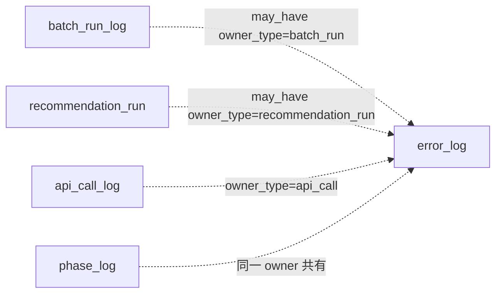

# Error Log テーブル定義書

## 1. ドキュメント情報

| 項目           | 内容                            |
| -------------- | ------------------------------- |
| ドキュメントID | `DB-TBL-MVP-error_log`          |
| ドキュメント名 | Error Log テーブル定義書        |
| 対象システム   | Gift Recommendation Service MVP |
| MVP対象        | `yes`                           |
| 作成日         | 2026-06-15                      |
| 更新日         | 2026-06-15（Batch 系 Log Retention 90 日統一・#536） |

---

## 2. 概要

`error_log` は、api / reco / batch / 外部 API / DB / Storage で発生した **エラー 1 件単位** の横断ログ正本である。

単なる文字列ログではなく、`error_code`・polymorphic owner（`owner_type` / `owner_id`）・`trace_id`・`severity`・`retryable` を持たせ、障害調査・集計・テストに利用できるようにする（ログ・Observability設計書 §9.1）。

IF-OBS-002（Error Log 記録）・IF-DB-API-008（API エラーログ保存）・IF-DB-RECO-009（Phase / Error Log 保存）の DB 正本となる。Public API では **内部詳細を返却しない**（バッチ設計方針書・エラーコード定義書）。

---

## 3. 目的

- Batch / Online 横断で発生したエラーを **追記型 Log** として記録する
- `batch_run_log` / `recommendation_run` / `phase_log` / `api_call_log` 等との **polymorphic owner 関係** を物理定義する
- `error_code` 形式 CHECK と `error_detail_json` マスキング方針を DDL Task へ展開可能にする
- Retention **90 日統一**（Batch 系 Log 一式 + BATCH-RET-001 アンカー）。後続 Retention Batch 実装 Task へ引き継ぐ
- 後続 DDL Task が migration を作成できる粒度まで設計を確定する

---

## 4. テーブル基本情報

| 項目 | 内容 |
| ---- | ---- |
| 物理テーブル名 | `error_log` |
| 論理テーブル名 | Error Log |
| 分類 | Log / Observability系 |
| 正本区分 | Log |
| 主な更新主体 | api / reco / batch（Error Handler / Repository 経由） |
| 主な参照主体 | api / reco / batch（障害調査・運用分析）。Online / web から Direct 参照しない |
| MVP対象 | `yes` |
| 関連物理ER | `docs/06_実装設計/database/物理ER.md` §7–§11 |

---

## 5. 用途・責務

- **エラー 1 件 = 1 行** を INSERT する（状態カラムなし。追跡は `error_code` / `occurred_at` / owner）
- Validation エラーは **原則記録しない**、または warn 集計のみ（ログ・Observability設計書 §9.4）
- Reco 失敗・Reason 生成失敗・DB 書込失敗・Raw 保存失敗・Secret 出力検知等は **必ず記録**（§9.4）
- 外部 API 失敗は `api_call_log` に加え、必要に応じて本テーブルへ記録（`owner_type = api_call` 可）
- `error_detail_json` には **マスキング済み** 詳細のみ保存する（§5.6）
- **追記型 Log**。同一 `error_log_id` の UPDATE は行わない（再発生は新規 INSERT）

### 5.1 対象外

- Batch 実行ヘッダ本体（`batch_run_log` の責務。owner 参照のみ）
- フェーズ進行本体（`phase_log` の責務。owner 共有のみ）
- 外部 API 呼び出しライフサイクル本体（`api_call_log` の責務）
- 取込件数サマリ（`item_import_summary` の責務）
- `error_code` 全件の packages YAML 正本化（Phase4a へ委譲）
- Public API への内部エラー詳細公開
- Validation エラーの個別行記録（原則 warn 集計のみ）

### 5.2 `batch_run_log` / `recommendation_run` → `error_log` 関係（may_have）

物理ER §9・論理ER §13.2・§14 に従う。

| 観点 | 方針 |
| ---- | ---- |
| 物理ER 関係 | `batch_run_log` → `error_log` : **`may_have`**（**LOGICAL** 1:N） |
| 物理ER 関係 | `recommendation_run` → `error_log` : **`may_have`**（**LOGICAL** 1:N） |
| 参照方式 | **`owner_type` + `owner_id`**（polymorphic）。専用 `batch_run_id` 列は **持たない** |
| Batch 側 owner | `owner_type = batch_run`、`owner_id = batch_run_id` |
| Online 側 owner | `owner_type = recommendation_run` 等（§5.3） |
| `batch_run_log` 定義書 | `batch_run_log_テーブル定義書` §5.2 と **双方向整合**（#534 / PR #539 merge 済み） |
| `error_summary` 境界 | Run 全体の短い概要は **`batch_run_log.error_summary`**。スタック・詳細 context は **本テーブル**（batch_run_log 定義書 §5.5） |
| DDL 適用順 | **`batch_run_log` 先行** → `error_log`（batch_run_log 定義書 §5.2） |
| 物理 FK | MVP **付与しない**（Log 系 polymorphic 方針。item_import_summary / api_call_log と同型） |



### 5.3 `phase_log` との責務境界

| 観点 | 方針 |
| ---- | ---- |
| 責務分離 | **`phase_log`** = フェーズ進行（`phase_status` あり）。**`error_log`** = エラー事象（状態カラムなし） |
| 関連 | 同一 `owner_type` / `owner_id` で phase と error が **並行して** 存在し得る |
| `phase_log_id` 列 | MVP **採用しない**。owner 経由 trace のみ（Human Review #536 No.3 **決定済み**） |
| `phase_log` 定義書 | `phase_log_テーブル定義書` §5.3 / §5.6 / §8.2 と **双方向整合**（#535 / PR #540 merge 済み） |
| owner 単位 | **`phase_log` 行 ID を `error_log.owner_id` にしない**。owner は Run / Batch / Evaluation 単位（phase_log 定義書 §8.2） |
| `error_code` 分担 | フェーズ失敗 **要約** は `phase_log.error_code`（nullable）。**詳細**は本テーブル `error_code`（NOT NULL）+ `error_detail_json`（phase_log 定義書 §5.6） |
| フェーズ失敗 | `phase_log.phase_status = failed` 終端 UPDATE と **`error_log` INSERT** を Error Handler が連携（IF-DB-RECO-009） |
| `trace_id` | 同一 Run / Batch の `phase_log.trace_id` と **同一値を推奨**（横断検索。phase_log 定義書 §16 No.9） |
| `recommendation_run_phase_log` | 物理テーブルなし。`phase_log` に統合（テーブル一覧 §11 補足） |

### 5.4 `api_call_log` との関係

`api_call_log_テーブル定義書` §8.2 に従う。

| 観点 | 方針 |
| ---- | ---- |
| 参照方式 | `owner_type = api_call`、`owner_id = api_call_log_id` |
| 責務分離 | API 呼び出し条件・HTTP 成否は **`api_call_log`**。障害調査用詳細・横断 `error_code` は **`error_log`** |
| 併用 | 外部 API 失敗時、`api_call_log` 終端 UPDATE（`call_status=failed` 等）に加え、必要に応じて本テーブルへ INSERT |
| 物理 FK | **なし**（LOGICAL） |

### 5.5 ログ・Observability設計書 §9.2 / 論理ER §13.2 との差分整理

| ログ・Observability設計書 §9.2 | 論理ER §13.2 | 本テーブル（MVP 物理 DDL） | 扱い |
| ------------------------------- | ------------ | -------------------------- | ---- |
| `error_log_id` | `error_log_id` | **`error_log_id`** | 一致 |
| `trace_id` | 未列挙 | **`trace_id`** | Observability trace 連携のため **採用**（nullable） |
| `request_id` | 未列挙 | **`request_id`** | Public API リクエスト trace のため **採用**（nullable） |
| `owner_type` | `owner_type` | **`owner_type`** | 一致（enum §6.15） |
| `owner_id` | `owner_id` | **`owner_id`** | 一致（`system` 時 nullable） |
| `service` | 未列挙 | **`service`** | api / reco / batch 識別のため **採用**（NOT NULL） |
| `error_code` | `error_code` | **`error_code`** | 一致 |
| `error_message` | `error_message` | **`error_message`** | 一致 |
| `severity` | 未列挙 | **`severity`** | warn / error / critical のため **採用**（NOT NULL） |
| `retryable` | 未列挙 | **`retryable`** | 再試行可否のため **採用**（NOT NULL） |
| `error_detail_json` | `error_detail_json` | **`error_detail_json`** | 一致（`jsonb`） |
| `occurred_at` | `occurred_at` | **`occurred_at`** | 一致 |
| IF-OBS-002 `component` | — | **`service` に対応** | IF 一覧の component は service 列へマッピング |
| IF-OBS-002 `target_id` | — | **`owner_id` に対応** | polymorphic owner 設計を正とする |

### 5.6 保存禁止情報（マスキング方針）

物理ER §12・ログ・Observability設計書 §9・エラーコード定義書に従う。`error_detail_json` / `error_message` に以下を **含めない**。

- API キー / Application ID / Secret の平文
- Authorization Header / Cookie / Session token
- 外部 API Secret
- Secret を含む完全 URL
- Raw レスポンス本文（過大データ）
- 個人を特定できる情報（不要な場合）

Secret 出力検知は **`severity = critical`** で記録する（§9.4）。

---

## 6. カラム定義

| No | カラム名 | 論理名 | 型 | 必須 | PK | FK | Unique | Default | 説明 |
| --: | -------- | ------ | -- | ---- | -- | -- | ------ | ------- | ---- |
| 1 | `error_log_id` | Error Log ID | `uuid` | `yes` | `yes` | — | `yes` | `gen_random_uuid()` | サロゲート PK |
| 2 | `trace_id` | Trace ID | `text` | `no` | — | — | — | `NULL` | 横断追跡 ID（Observability §9.2） |
| 3 | `request_id` | Request ID | `text` | `no` | — | — | — | `NULL` | Public API リクエスト ID（api 主体時） |
| 4 | `owner_type` | Owner Type | `varchar(64)` | `yes` | — | — | — | — | エラー発生主体種別（§11.1） |
| 5 | `owner_id` | Owner ID | `uuid` | `no` | — | LOGICAL | — | `NULL` | owner_type に対応する ID。`system` 時は NULL 可 |
| 6 | `service` | Service | `varchar(16)` | `yes` | — | — | — | — | 記録主体サービス: `api` / `reco` / `batch` |
| 7 | `error_code` | Error Code | `varchar(64)` | `yes` | — | — | — | — | GRS エラーコード（§10.2 形式 CHECK） |
| 8 | `error_message` | Error Message | `text` | `yes` | — | — | — | — | 内部向け概要（Public 非公開） |
| 9 | `severity` | Severity | `varchar(16)` | `yes` | — | — | — | `'error'` | 重要度: `warn` / `error` / `critical` |
| 10 | `retryable` | Retryable | `boolean` | `yes` | — | — | — | `false` | 同条件再試行可否（エラーコード定義書参照） |
| 11 | `error_detail_json` | Error Detail JSON | `jsonb` | `yes` | — | — | — | `'{}'` | マスキング済み詳細（§5.6） |
| 12 | `occurred_at` | Occurred At | `timestamptz` | `yes` | — | — | — | — | エラー発生日時（UTC） |
| 13 | `created_at` | Created At | `timestamptz` | `yes` | — | — | — | `now()` | 行作成日時（物理ER §5 timestamp 方針） |

> **論理ER §13.2 との差分**: 論理ER表に未列挙の `trace_id` / `request_id` / `service` / `severity` / `retryable` / `created_at` を物理 DDL で追加する（§5.5）。`error_detail_json` は **`jsonb`** を採用する。

---

## 7. 主キー・一意キー

| 種別 | 対象カラム | 方針 | 備考 |
| ---- | ---------- | ---- | ---- |
| PRIMARY KEY | `error_log_id` | サロゲート UUID | — |

> MVP では **自然キー UNIQUE は設けない**。同一 owner・同一 error_code の再発は **新規 `error_log_id`** で追記する（§12）。

---

## 8. 外部キー・参照関係

### 8.1 参照先（論理・polymorphic）

| `owner_type` | `owner_id` 参照先 | FK制約 | 備考 |
| ------------ | ----------------- | ------ | ---- |
| `recommendation_request` | `recommendation_request.recommendation_request_id` | `LOGICAL` | Online api / reco |
| `recommendation_run` | `recommendation_run.recommendation_run_id` | `LOGICAL` | 物理ER may_have |
| `recommendation_result` | `recommendation_result.recommendation_result_id` | `LOGICAL` | error log のみ |
| `recommendation_feedback` | `recommendation_feedback.recommendation_feedback_id` | `LOGICAL` | error log のみ |
| `batch_run` | `batch_run_log.batch_run_id` | `LOGICAL` | 物理ER may_have。batch_run_log 定義書 §5.2 / §8.2 |
| `api_call` | `api_call_log.api_call_log_id` | `LOGICAL` | api_call_log 定義書 §8.2 |
| `raw_product_metadata` | `raw_product_metadata.raw_metadata_id` | `LOGICAL` | Raw 保存失敗等 |
| `item_generation_queue` | `item_generation_queue.item_generation_queue_id` | `LOGICAL` | 生成キュー失敗 |
| `evaluation_run` | `evaluation_run.evaluation_run_id` | `LOGICAL` | Evaluation 系 |
| `system` | — | — | **`owner_id` NULL 可**（Observability §9.3） |

> Observability §9.3 の `feature_distribution_metric` / `normalization_distribution_metric` は enum定義書 §6.15 MVP 範囲外のため、本テーブル CHECK には **含めない**（必要時は enum Task 拡張）。

### 8.2 被参照

| 参照元 | 関係 | 備考 |
| ------ | ---- | ---- |
| — | — | MVP では他テーブルからの物理 FK なし |

---

## 9. Index

| Index名 | 対象カラム | 種別 | 用途 | 備考 |
| ------- | ---------- | ---- | ---- | ---- |
| `error_log_pkey` | `error_log_id` | btree（PK） | 主キー | 自動生成 |
| `idx_error_log_owner` | `owner_type`, `owner_id`, `occurred_at` | btree | 障害調査（owner 単位） | 物理ER §10 確定 |
| `idx_error_log_trace` | `trace_id` | btree | 横断 trace 検索 | `trace_id` nullable |
| `idx_error_log_code` | `error_code`, `occurred_at` | btree | エラーコード別集計 | Observability §21.2 |
| `idx_error_log_occurred` | `occurred_at` | btree | Retention DELETE / 期間検索 | §13 |
| `idx_error_log_service` | `service`, `occurred_at` | btree | api / reco / batch 別分析 | |

---

## 10. 制約

| 制約名 | 種別 | 対象 | 内容 | 備考 |
| ------ | ---- | ---- | ---- | ---- |
| `error_log_pkey` | PRIMARY KEY | `error_log_id` | 主キー | — |
| `chk_error_log_owner_type` | CHECK | `owner_type` | `owner_type` 許容値 | enum定義書 §6.15 |
| `chk_error_log_owner_id_system` | CHECK | `owner_id` | `owner_type <> 'system' OR owner_id IS NULL` | system 時 NULL 可 |
| `chk_error_log_owner_id_required` | CHECK | `owner_id` | `owner_type = 'system' OR owner_id IS NOT NULL` | system 以外は NOT NULL |
| `chk_error_log_service` | CHECK | `service` | `service IN ('api', 'reco', 'batch')` | Observability §9.2 |
| `chk_error_log_severity` | CHECK | `severity` | `severity IN ('warn', 'error', 'critical')` | §9.2 |
| `chk_error_log_error_code_format` | CHECK | `error_code` | `error_code ~ '^GRS-[A-Z]{2,4}-[0-9]{3}$'` | enum定義書 §10.2・`error_code_format.yaml` |

---

## 11. 状態・enum

`error_log` は **状態カラムを持たない**（状態遷移設計書 §5 Log 系整理）。

| カラム | enum / code | 定義元 | 許容値 | 備考 |
| ------ | ----------- | ------ | ------ | ---- |
| `owner_type` | `owner_type` | `enum定義書.md` §6.15 | §11.1 参照 | NOT NULL |
| `service` | （code 未定義） | ログ・Observability設計書 §9.2 | `api`, `reco`, `batch` | CHECK |
| `severity` | （code 未定義） | ログ・Observability設計書 §9.2 / エラーコード定義書 | `warn`, `error`, `critical` | CHECK |
| `error_code` | GRS 形式 | `enum定義書.md` §10.2 / `error_code_format.yaml` | `^GRS-[A-Z]{2,4}-[0-9]{3}$` | 全件列挙 CHECK は **行わない**。DOMAIN 長 2〜4 |
| `retryable` | — | エラーコード定義書 | `true` / `false` | boolean |

### 11.1 `owner_type` 許容値（MVP）

enum定義書 §6.15 を正とする。

| 値 | owner_id | phase / error | 備考 |
| -- | -------- | ------------- | ---- |
| `recommendation_request` | `recommendation_request_id` | both | |
| `recommendation_run` | `recommendation_run_id` | both | Online reco |
| `recommendation_result` | `recommendation_result_id` | error only | |
| `recommendation_feedback` | `recommendation_feedback_id` | error only | |
| `batch_run` | `batch_run_id` | both | Batch 横断 |
| `api_call` | `api_call_log_id` | error only | 外部 API 連携 |
| `raw_product_metadata` | `raw_metadata_id` | error only | Raw 保存失敗 |
| `item_generation_queue` | `item_generation_queue_id` | error only | |
| `evaluation_run` | `evaluation_run_id` | both | |
| `system` | **NULL 可** | error only | システム全体 |

---

## 12. 更新仕様

| 操作 | 実行主体 | 条件 | 更新項目 | 冪等性 | 備考 |
| ---- | -------- | ---- | -------- | ------ | ---- |
| INSERT | api / reco / batch | 記録対象エラー発生 | 全列（§6） | 毎回新規 UUID | IF-OBS-002 / IF-DB-API-008 / IF-DB-RECO-009 |
| UPDATE | — | MVP **原則禁止** | — | — | 追記型 Log |
| DELETE | — | MVP では原則禁止 | — | — | Retention Batch は後続 Task |

### 12.1 典型フロー（Batch Error Handler）

```sql
INSERT INTO error_log (
  trace_id, owner_type, owner_id, service,
  error_code, error_message, severity, retryable,
  error_detail_json, occurred_at
) VALUES (
  :trace_id, 'batch_run', :batch_run_id, 'batch',
  :error_code, :error_message, :severity, :retryable,
  :error_detail_json, :occurred_at
) RETURNING error_log_id;
```

### 12.2 典型フロー（Online reco 失敗）

```sql
INSERT INTO error_log (
  trace_id, request_id, owner_type, owner_id, service,
  error_code, error_message, severity, retryable,
  error_detail_json, occurred_at
) VALUES (
  :trace_id, :request_id, 'recommendation_run', :recommendation_run_id, 'reco',
  :error_code, :error_message, 'error', :retryable,
  :error_detail_json, :occurred_at
);
```

### 12.3 記録対象の MVP 境界（Observability §9.4）

| 事象 | 記録 |
| ---- | ---- |
| Validation エラー | 原則 **記録しない**（warn 集計のみ） |
| Rate Limit | 必要に応じて `severity=warn` |
| Reco / Reason / DB / Raw 失敗 | **必ず記録** |
| Batch 一部失敗 | 集計 + 必要に応じて記録 |
| Secret 出力検知 | **`severity=critical` で必ず記録** |

---

## 13. データ保持・削除

MVP では **二層 Retention** を採用する（Human Review #536 No.9 **決定済み**）。

| 層 | 名称 | 実行主体（後続） | 本テーブルへの効果 |
| -- | ---- | ---------------- | ------------------ |
| Tier 1 | **Standalone 削除** | BATCH-RET-002（定期） | `occurred_at` 基準で **90 日超** を個別 DELETE |
| Tier 2 | **Batch Run アンカー一括パージ** | BATCH-RET-001（保守） | 対象 `batch_run_id` に紐づく Batch 系 Log を **90 日到達時に一括 DELETE**（同時パージ） |

| 観点 | 方針 |
| ---- | ---- |
| 保持期間（Standalone） | **90 日**（Human Review #536 No.5 決定） |
| 削除方式 | 物理 DELETE（論理削除なし） |
| 削除列 | **`occurred_at`**（`idx_error_log_occurred` 利用） |
| 論理削除 | 採用しない（Log 追記型） |
| partition | MVP **未適用**。物理ER §17 / Observability §21.2 に従い本番前に range partition 検討 |
| アーカイブ | MVP 対象外 |
| 実装 Batch | **MVP 外**（DDL 後の BATCH-RET-001 / BATCH-RET-002。本節は **運用方針の正本**） |

### 13.1 Tier 1 — Standalone 削除（全 `error_log` 行）

| 項目 | 内容 |
| ---- | ---- |
| 条件 | `occurred_at < now() - interval '90 days'` |
| 対象 | **owner_type を問わず全行** |
| 頻度 | 日次または週次（運用 Task で確定） |
| 備考 | Online（`recommendation_run` 等）も本 Tier のみ。Run 本体が 180 日残っても **error 詳細は 90 日で消える** |

```sql
-- BATCH-RET-002（方針例）
DELETE FROM error_log
WHERE occurred_at < now() - interval '90 days';
```

### 13.2 Tier 2 — Batch Run アンカー一括パージ（Batch 系 trace 整合）

`batch_run_log` の Retention **90 日**（`batch_run_log_テーブル定義書` §13）を **アンカー** とし、同一 Batch Run に紐づく Log を **子 → 親** の順でまとめて除去する。

| 項目 | 内容 |
| ---- | ---- |
| トリガー | `batch_run_log.started_at < now() - interval '90 days'` の Run |
| 目的 | **90 日統一**により Batch 単位の trace を同時に除去し、孤立行・ヘッダ残存を防ぐ |
| 正本分担 | 一括パージの **全体手順・削除順序** は `batch_run_log_テーブル定義書` §13.1。**本テーブルの削除対象定義** は下表 |

#### `error_log` 削除対象（当該 `batch_run_id = :batch_run_id`）

| 優先 | 条件 | 備考 |
| --: | ---- | ---- |
| 1 | `owner_type = 'batch_run'` AND `owner_id = :batch_run_id` | 直接紐づけ |
| 2 | `owner_type = 'api_call'` AND `owner_id IN (SELECT api_call_log_id FROM api_call_log WHERE batch_run_id = :batch_run_id)` | api_call_log 定義書 §5.2 経由 |
| 3 | `owner_type = 'raw_product_metadata'` AND `owner_id IN (SELECT raw_metadata_id FROM raw_product_metadata WHERE api_call_log_id IN (SELECT api_call_log_id FROM api_call_log WHERE batch_run_id = :batch_run_id))` | Raw 失敗 trace |
| 4 | `owner_type = 'item_generation_queue'` AND 当該 Run 内 Item 生成キューに限定（Batch アプリが `batch_run_id` で解決） | キュー失敗 trace |

> Tier 1 と Tier 2 は **同一 90 日しきい値**。Tier 2 は Standalone 実行順のズレや取りこぼしを防ぐ **同時パージ** が主目的。

```sql
-- BATCH-RET-001 内の error_log 削除（方針例・:batch_run_id 単位）
DELETE FROM error_log
WHERE (owner_type = 'batch_run' AND owner_id = :batch_run_id)
   OR (owner_type = 'api_call' AND owner_id IN (
         SELECT api_call_log_id FROM api_call_log WHERE batch_run_id = :batch_run_id
       ));
-- raw_product_metadata / item_generation_queue は上表に従い同等のサブクエリで拡張
```

#### Batch Run 一括パージ時の削除順序（Log 系抜粋）

`batch_run_log_テーブル定義書` §13.1 と整合。`error_log` は **`phase_log` より前**（同一 owner のフェーズ要約より詳細を先に消す必要はないが、**ヘッダ削除前**に実施）。

| 順序 | テーブル | 備考 |
| --: | -------- | ---- |
| 1 | `api_call_log` | 外部 API 明細 |
| 2 | `product_diff_result` 等 | 差分明細（該当 workflow） |
| 3 | `item_import_summary` | 集計 |
| 4 | **`error_log`** | **本テーブル**（§13.2 条件） |
| 5 | `phase_log` | `owner_type=batch_run` |
| 6 | `batch_run_log` | アンカー（最後） |

### 13.3 関連 Log 系との Retention 関係（MVP 確定・90 日統一）

Human Review #536 No.10 **決定済み**。Batch 系 Log は **Standalone 90 日 + BATCH-RET-001 アンカー 90 日** で統一する。

| テーブル | Standalone 保持 | 削除基準列 | Batch アンカー連動 |
| -------- | --------------- | ---------- | ------------------ |
| `api_call_log` | **90 日** | `requested_at` | ○（`batch_run_id`） |
| `phase_log` | **90 日** | `created_at` | ○（`owner_type=batch_run`） |
| **`error_log`** | **90 日** | `occurred_at` | ○（§13.2） |
| `item_import_summary` | **90 日** | `summarized_at` | ○（`batch_run_id`） |
| `batch_run_log` | **90 日** | `started_at` | アンカー本体 |

#### 障害調査で参照できる情報（Batch 系）

| 経過日数 | 参照可能な情報 |
| -------- | -------------- |
| 0〜90 日 | `phase_log` + `error_log` + `batch_run_log` + `api_call_log` + `item_import_summary`（フル trace） |
| 90 日超 | 一括パージにより **Batch 単位で痕跡なし** |

> Observability §20.2 の長期レンジ（例: `batch_run_log` 180〜365 日、`item_import_summary` 365 日）は **MVP では 90 日に短縮**。長期トレンドは後続 Metric / BI Task へ委譲。

### 13.4 Online 系 `error_log`（Batch アンカー対象外）

| owner_type | 連動 |
| ---------- | ---- |
| `recommendation_run` / `recommendation_request` / `recommendation_result` / `recommendation_feedback` | **Tier 1 のみ**（90 日）。`recommendation_run` 本体 Retention（180〜365 日）とは独立 |
| `evaluation_run` | Tier 1 のみ（Evaluation Run Retention Task へ委譲） |
| `system` | Tier 1 のみ |

---

## 14. Migration / DDL

| 項目 | 内容 |
| ---- | ---- |
| DDL対象 | `error_log` |
| migration単位 | 1 テーブル = 1 migration（DDL Task） |
| 適用順序 | Log 系。`batch_run_log` / `recommendation_run` 等 owner 正本テーブルと **並行または後**（LOGICAL FK のため strict 順序不要） |
| rollback方針 | forward migration 主体。DROP は Human Review 必須 |
| 破壊的変更有無 | `no`（初回 CREATE） |

---

## 15. セキュリティ・権限

| 観点 | 方針 |
| ---- | ---- |
| 読み取り権限 | api / reco / batch（service role 経由）のみ |
| 書き込み権限 | Error Handler / Repository 経由。web client から Direct DML 禁止 |
| service role利用 | 各サービス backend / batch worker に限定 |
| 個人情報・機微情報 | `error_detail_json` に secret・個人情報を含めない（§5.6） |
| ログ出力制限 | 物理ER §12。`error_detail_json` 全文をアプリログへ過剰出力しない |
| Public 応答 | 内部 `error_message` / `error_detail_json` は Public API へ返却しない |

---

## 16. テスト観点

| No | 観点 | 確認内容 | 種別 |
| --: | ---- | -------- | ---- |
| 1 | DDL適用 | CREATE TABLE / Index / CHECK が定義どおり | migration |
| 2 | owner_type CHECK | §11.1 許容値のみ INSERT 可 | migration |
| 3 | error_code 形式 | 不正形式 GRS コードが拒否される | migration |
| 4 | system owner | `owner_type=system` かつ `owner_id IS NULL` が許可 | integration |
| 5 | batch_run owner | `owner_type=batch_run` で trace 可能 | integration |
| 6 | reco owner | `owner_type=recommendation_run` で trace 可能 | integration |
| 7 | api_call owner | `owner_type=api_call` と api_call_log 整合 | integration |
| 8 | マスキング | `error_detail_json` に API キーが含まれない | manual |
| 9 | 権限 | web client から Direct DB アクセス不可 | manual |

---

## 17. 未決事項

| No | 論点 | 判断が必要な理由 | 判断者 | 期限 | 備考 |
| --: | ---- | ---------------- | ------ | ---- | ---- |
| — | — | — | — | — | Human Review #536 で §17.1 No.1〜6 を確定。双方向整合は #534 / #535 merge 済み（§5.2 / §5.3） |

### 17.1 Human Review 決定事項（Issue #536）

| No | 論点 | 決定内容 | 決定者 | 備考 |
| --: | ---- | -------- | ------ | ---- |
| 1 | Observability §9.2 拡張列 | **`trace_id` / `request_id` / `service` / `severity` / `retryable` を MVP 物理 DDL に採用** | Human | §5.5・§6 |
| 2 | `owner_type=system` | **`owner_id` NULL 可**（CHECK で明示） | Human | §8.1・§10 |
| 3 | `phase_log_id` 列 | **採用しない**。owner polymorphic のみ | Human | §5.3 |
| 4 | `error_code` CHECK | **形式 CHECK のみ**（§10.2）。regex `^GRS-[A-Z]{2,4}-[0-9]{3}$`（DOMAIN 長 2〜4。Issue #689 HR 確定）。全件列挙は Phase4a YAML | Human | §10 |
| 5 | Retention 具体日数 | **90 日**（Standalone）。削除 Batch 実装は MVP 外 | Human | §13.1 |
| 9 | Retention 連動方針 | **二層 Retention**（§13.1 Standalone 90 日 + §13.2 Batch Run アンカー **90 日**一括パージ）。正本は本定義書 §13、`batch_run_log` §13.1 と整合 | Human | §13.2〜§13.3 |
| 10 | Batch 系 Log Retention 統一 | **`api_call_log` / `phase_log` / `error_log` / `item_import_summary` / `batch_run_log` を 90 日に統一**（#534 / #535 / #533 cross-cutting） | Human | §13.3 |
| 6 | IF-OBS-002 命名 | **`component` → `service`、`target_id` → `owner_id`** で DB 正本化 | Human | §5.5 |
| 7 | batch_run_log 双方向整合 | `batch_run_log_テーブル定義書` §5.2（may_have / owner_type=batch_run）と一致 | Human | §5.2 |
| 8 | phase_log 双方向整合 | `phase_log_テーブル定義書` §5.6 / §8.2（責務境界・owner 単位）と一致 | Human | §5.3 |

---

## 18. 関連資料

| 種別 | パス / URL | 用途 |
| ---- | ---------- | ---- |
| 物理ER | `docs/06_実装設計/database/物理ER.md` | Log 系・may_have・Index |
| 論理ER | `docs/05_アプリケーション設計/アプリ/database/論理ER.md` | §13.2 / §14 |
| テーブル一覧 | `docs/05_アプリケーション設計/アプリ/database/テーブル一覧.md` | §6 No.58 |
| enum定義書 | `docs/06_実装設計/database/enum定義書.md` | §6.15 owner_type・§10.2 error_code |
| ログ・Observability | `docs/05_アプリケーション設計/アプリ/ログ・Observability設計書.md` | §9 / §20.2 |
| エラーコード定義書 | `docs/05_アプリケーション設計/アプリ/エラーコード定義書.md` | GRS 体系・retryable |
| 状態遷移設計書 | `docs/05_アプリケーション設計/アプリ/状態遷移設計書.md` | §5 Log 系 |
| バッチ設計方針書 | `docs/05_アプリケーション設計/アプリ/batch/バッチ設計方針書.md` | Error Handler |
| インターフェース一覧 | `docs/05_アプリケーション設計/アプリ/インターフェース一覧.md` | IF-OBS-002 / IF-DB-API-008 / IF-DB-RECO-009 |
| api_call_log 定義書 | `docs/06_実装設計/database/api_call_log_テーブル定義書.md` | owner_type=api_call |
| batch_run_log 定義書 | `docs/06_実装設計/database/batch_run_log_テーブル定義書.md` | §5.2 may_have 親・error_summary 境界 |
| phase_log 定義書 | `docs/06_実装設計/database/phase_log_テーブル定義書.md` | §5.6 責務境界・owner 設計 |
| item_import_summary 定義書 | `docs/06_実装設計/database/item_import_summary_テーブル定義書.md` | Log 系章構成参考 |

---

## 19. レビュー観点

- 論理ER §13.2・物理ER §9 / §10・テーブル一覧 §6 No.58 と矛盾していない
- `batch_run_log` / `recommendation_run` との may_have 関係が §5.2 に明記され、`batch_run_log_テーブル定義書` §5.2 と双方向整合している
- `phase_log` との責務境界（`phase_log_id` 非採用・error_code 分担）が §5.3 に明記され、`phase_log_テーブル定義書` §5.6 / §8.2 と双方向整合している
- Retention **90 日統一**（Batch 系 Log 一式）が §13 / §17.1 No.5・No.9・No.10 で確定している
- `owner_type` / enum定義書 §6.15 が §11.1 で一致している
- ログ・Observability設計書 §9.2 との差分が §5.5 で整理されている
- `error_detail_json` マスキング方針（§5.6）が明記されている
- batch_run_log / phase_log 本体定義を本 Task に混入していない
- DDL Task が CREATE TABLE を起こせる粒度である
- secret や `.env` 実値が含まれていない
