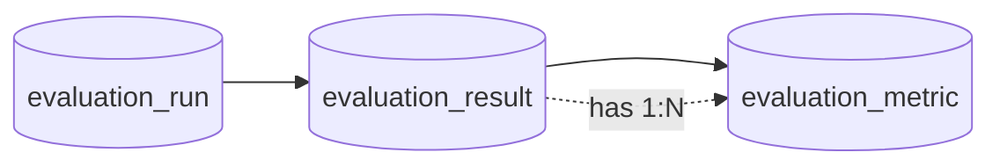

# Evaluation Metric テーブル定義書

## 1. ドキュメント情報

| 項目           | 内容                               |
| -------------- | ---------------------------------- |
| ドキュメントID | `DB-TBL-MVP-evaluation_metric`     |
| ドキュメント名 | Evaluation Metric テーブル定義書   |
| 対象システム   | Gift Recommendation Service MVP    |
| MVP対象        | `partial`                          |
| 作成日         | 2026-06-16                         |
| 更新日         | 2026-06-16（Human Review §17.1 No.1〜No.8 確定済み） |

---

## 2. 概要

`evaluation_metric` は、オフライン評価（BATCH-018）における **ケース単位評価結果（`evaluation_result`）に紐づく指標行** を保持する Evaluation系テーブルである。

親 `evaluation_result` に属し、Precision / Recall / NDCG / MRR / HitRate / Diversity / RiskRate 等の自動評価指標を **1 指標 1 行**（EAV 行モデル）で保存する。IF-DB-BATCH-018（Evaluation 保存）の INSERT 対象のひとつであり、MOD-BATCH-040 Evaluation Metric Calculator の書込先。

`evaluation_run` への直接 FK は持たず、**`evaluation_result_id` 経由** で Run / Case / Dataset 文脈に間接参照する（evaluation_run §8.2・evaluation_result §5.2）。

---

## 3. 目的

- オフライン評価フロー **Dataset → Run → Result → Metric** の **指標正本** として、ケース単位の自動メトリクスを永続化する
- `evaluation_result` との has 1:N 関係（物理 FK ON）を確定する
- Evaluation評価定義書 §14.4 のインライン metric 列を **物理化せず**、論理ER §12.2 の EAV 行モデルへ正規化する（evaluation_result §17.1 No.4 踏襲）
- `metric_name` / `metric_value` / `metric_detail_json` の責務分離と BATCH-018 冪等 INSERT 方針を確定する
- 後続 DDL Task が migration を作成できる粒度まで設計を確定する

---

## 4. テーブル基本情報

| 項目 | 内容 |
| ---- | ---- |
| 物理テーブル名 | `evaluation_metric` |
| 論理テーブル名 | Evaluation Metric |
| 分類 | Evaluation系 |
| 正本区分 | 派生 / Metric |
| 主な更新主体 | batch（BATCH-018 / MOD-BATCH-040） |
| 主な参照主体 | batch、Observability / Admin 将来参照 |
| MVP対象 | `partial` |
| 関連物理ER | `docs/06_実装設計/database/物理ER.md` §7・§9・§12 |

---

## 5. 用途・責務

- batch が BATCH-018 実行中、MOD-BATCH-041 が `evaluation_result` 行を INSERT したあと、MOD-BATCH-040 が **同一 `evaluation_result_id` に対し複数指標行** を INSERT する
- 1 Result あたり、算出された各指標（例: `precision_at_10`, `ndcg_at_10`）を **別行** で保持する
- 指標算出失敗（GRS-EVAL-004）時は **行を INSERT しない**（`error_log` 記録。evaluation_result 行は残る）
- 同一 Result に対する同一 `metric_name` の二重 INSERT は **UNIQUE 制約で拒否**（冪等）
- 再評価は **新規 `evaluation_run` → 新規 `evaluation_result` → 新規 Metric 行** の追記のみ（上書きなし）

### 5.1 対象外

- 評価データセット / ケース / Run / Result 本体（各親テーブルの責務）
- `evaluation_run_id` 物理列（MVP は Result 経由間接参照のみ。§17.1 No.2）
- Run 単位集計 `summary_metrics`（Evaluation評価定義書 §14.3 論理項目。MVP 未物理化）
- 人手評価スコア（`human_eval_result`。MVP 未物理化）
- Log / Observability 系分布 Metric（`feature_distribution_metric` 等。別テーブル）
- `evaluation_metric_name` enum / packages 正本（MVP はドキュメント化カタログ + アプリ層 Validation）
- 指標算出アルゴリズム詳細（MOD-BATCH-040 実装 / バッチ仕様書の責務）

### 5.2 Offline Evaluation フロー上の位置づけ（Result → Metric）

論理ER §12.1・evaluation_result §5.2 を正とする。**本テーブルはケース単位の指標正本**。



| 観点 | 方針 |
| ---- | ---- |
| 直接親 | `evaluation_result_id` → **`evaluation_result`**（**物理 FK ON**。has 1:N） |
| 間接 Run | **`evaluation_result.evaluation_run_id`** 経由。本テーブルに Run 列なし |
| 間接 Case | **`evaluation_result.evaluation_case_id`** 経由 |
| 間接 Dataset | **`evaluation_result.evaluation_dataset_id`** 経由（冗長列） |
| 再評価 | 新規 Run / Result 追記。既存 Metric 行は **UPDATE しない** |

> **双方向整合**: `evaluation_result_テーブル定義書` §8.2 has / `evaluation_run_テーブル定義書` §8.2（Result 経由）と整合する。

### 5.3 BATCH-018 / I/F との関係

| 観点 | 方針 |
| ---- | ---- |
| 前提 | MOD-BATCH-041 が `evaluation_result` 行を INSERT 済みであること |
| 算出 | **MOD-BATCH-040** Evaluation Metric Calculator が `recommendation_result` + `evaluation_case.expected_result_json` 等から指標算出 |
| 書込 I/F | **IF-DB-BATCH-018** の INSERT 対象（`evaluation_run` / `evaluation_result` / **本テーブル**） |
| 失敗時 | GRS-EVAL-004。Metric 行は原則 INSERT せず `error_log`（`owner_type=evaluation_run`） |
| 成功時 | 算出された指標ごとに 1 行 INSERT（`(evaluation_result_id, metric_name)` UNIQUE） |

### 5.4 Evaluation評価定義書 §10.3 / §14.4 との差分整理

| 出典 | 論理項目 | 本テーブル（MVP 物理 DDL） | 扱い |
| ---- | -------- | ---------------------------- | ---- |
| 論理ER §12.2 | `evaluation_metric_id`, `evaluation_result_id`, `metric_name`, `metric_value`, `metric_detail_json` | **採用** | 一致 |
| Evaluation §14.4 | `precision_at_k`, `ndcg_at_k` 等の **列** | **物理列なし** | `metric_name` + `metric_value` 行へ正規化（evaluation_result §17.1 No.4） |
| Evaluation §14.4 | `metric_detail` | **`metric_detail_json`** | JSONB 列名を論理ER §12.2 に合わせる |
| Evaluation §10.3 | Precision@K 等 | **`{base}_at_{k}`** 形式の `metric_name` | §5.5 カタログ |
| Evaluation §10.5 | MVP 既定 K=10 | **`_at_10` サフィックス** | 例: `precision_at_10` |
| 物理ER timestamp 方針 | `created_at` / `updated_at` | **採用** | evaluation_result 同型（論理ER 差分は §5.4 注記） |

### 5.5 MVP `metric_name` カタログ（アプリ層 Validation 正本）

MVP では DB enum を設けず、以下を **推奨カタログ** とする（拡張時は Human Review）。

| `metric_name` | Evaluation §10.3 対応 | MVP 既定 | 備考 |
| ------------- | --------------------- | -------- | ---- |
| `precision_at_10` | Precision@K | K=10 | §10.5 目標 0.50 以上 |
| `recall_at_10` | Recall@K | K=10 | — |
| `ndcg_at_10` | NDCG@K | K=10 | 継続改善指標 |
| `mrr_at_10` | MRR@K | K=10 | — |
| `hit_rate_at_10` | HitRate@K | K=10 | §10.5 目標 0.80 以上 |
| `diversity_at_10` | Diversity@K | K=10 | BATCH-018 MMR 関連 |
| `risk_rate_at_10` | RiskRate@K | K=10 | §10.5 目標 0.10 以下 |
| `mmr_at_10` | MMR 適用結果（§10.2） | K=10 | バッチ処理一覧 BATCH-018 記載 |

> **K 変更時**: `metric_name` に k を埋め込む（例: `precision_at_5`）。`metric_detail_json.k` に冗長保持してもよい（§17.1 No.6）。

### 5.6 `metric_value` / `metric_detail_json` 責務境界

| 観点 | `metric_value` | `metric_detail_json` |
| ---- | -------------- | -------------------- |
| 粒度 | **スカラー指標値 1 件** | 補助・内訳・パラメータ |
| 例 | `0.62`（precision） | `{"k":10,"numerator":6,"denominator":10}` |
| 必須性 | **NOT NULL**（行が存在する場合） | **nullable** |
| NDCG / MMR | 最終スコアを `metric_value` に保持 | 中間リスト・λ 等は JSONB |
| PII | 保持しない | 商品 ID 等の UUID リストは最小限。ログ出力制限 |

### 5.7 evaluation_result 定義書との双方向整合（#573）

| 項目 | `evaluation_result_テーブル定義書` | 本テーブル | 状態 |
| ---- | ---------------------------------- | ---------- | ---- |
| has FK | §8.2 `evaluation_metric.evaluation_result_id` ON | §8.1 `evaluation_result_id` ON | 整合 |
| インライン metric | §17.1 No.4: 物理化しない | 本テーブルのみ | 整合 |
| Result 冪等 | §17.1 No.2: Run×Case UNIQUE | Metric は Result 内で name UNIQUE | 整合 |
| 失敗 trace | §17.1 No.3: `recommendation_result_id` nullable | Metric 未算出時は行なし | 整合 |
| Retention | §17.1 No.6: 365 日 | §13 同値 | 整合 |

### 5.8 evaluation_run 定義書との双方向整合（#567）

| 項目 | `evaluation_run_テーブル定義書` | 本テーブル | 状態 |
| ---- | ------------------------------- | ---------- | ---- |
| 間接参照 | §8.2 Result 経由 has | `evaluation_run_id` 列なし | 整合 |
| 再評価 | §17.1 No.6: 新規 Run INSERT | 新規 Metric 追記 | 整合 |
| IF-DB-BATCH-018 | §5.3 共通 I/F | 本テーブル INSERT 対象 | 整合 |

### 5.9 MOD-BATCH-040 Evaluation Metric Calculator（入出力）

機能×モジュール対応表を正とする。

| 方向 | 内容 |
| ---- | ---- |
| 入力 | `evaluation_result_id`, `recommendation_result_id`, `evaluation_case.expected_result_json`, Ranking 結果明細等 |
| 出力 | 本テーブルへの複数行 INSERT（指標ごと） |
| 前提 | `evaluation_result` 行が存在すること |
| 失敗 | GRS-EVAL-004 → `error_log`。Metric 行は原則未作成 |

---

## 6. カラム定義

| No | カラム名 | 論理名 | 型 | 必須 | PK | FK | Unique | Default | 説明 |
| --: | -------- | ------ | -- | ---- | -- | -- | ------ | ------- | ---- |
| 1 | `evaluation_metric_id` | Evaluation Metric ID | `uuid` | `yes` | `yes` | — | `yes` | `gen_random_uuid()` | サロゲート PK |
| 2 | `evaluation_result_id` | Evaluation Result ID | `uuid` | `yes` | — | `ON` | — | — | 親 Result。has 関係 |
| 3 | `metric_name` | Metric Name | `varchar(64)` | `yes` | — | — | — | — | 指標識別子（§5.5 カタログ） |
| 4 | `metric_value` | Metric Value | `numeric(12,6)` | `yes` | — | — | — | — | 指標スカラー値 |
| 5 | `metric_detail_json` | Metric Detail JSON | `jsonb` | `no` | — | — | — | `NULL` | 内訳・パラメータ（§5.6） |
| 6 | `created_at` | Created At | `timestamptz` | `yes` | — | — | — | `now()` | 行 INSERT 日時（監査・Retention） |
| 7 | `updated_at` | Updated At | `timestamptz` | `yes` | — | — | — | `now()` | 最終更新日時。MVP は INSERT 時のみ設定 |

> **論理ER §12.2 差分**: 論理ERは `created_at` / `updated_at` を列挙しないが、evaluation_result / 物理ER timestamp 方針に合わせ **監査列を追加**（§5.4）。

> **MVP で採用しない列**: `evaluation_run_id`（間接参照）、`evaluation_case_id`（間接参照）、`calculated_at`（`created_at` で代替）

---

## 7. 主キー・一意キー

| 種別 | 対象カラム | 方針 | 備考 |
| ---- | ---------- | ---- | ---- |
| PRIMARY KEY | `evaluation_metric_id` | サロゲート UUID | — |
| UNIQUE | `evaluation_result_id`, `metric_name` | Result 内指標名一意 | §17.1 No.4（`uq_evaluation_metric_result_name`） |

---

## 8. 外部キー・参照関係

### 8.1 参照先

| カラム | 参照先 | FK制約 | 参照整合性 | 備考 |
| ------ | ------ | ------ | ---------- | ---- |
| `evaluation_result_id` | `evaluation_result.evaluation_result_id` | `ON` | `ON DELETE RESTRICT` | 物理ER §9 has。evaluation_result §8.2 |

### 8.2 被参照（子テーブル）

| 参照元 | 参照列 | 関係 | FK制約 | 備考 |
| ------ | ------ | ---- | ------ | ---- |
| — | — | — | — | MVP では子テーブルなし |

### 8.3 間接参照（非 FK 列）

| 参照概念 | 経路 | 用途 |
| -------- | ---- | ---- |
| `evaluation_run` | `evaluation_result.evaluation_run_id` | Run 単位集計・trace |
| `evaluation_case` | `evaluation_result.evaluation_case_id` | Case 単位分析 |
| `evaluation_dataset` | `evaluation_result.evaluation_dataset_id` | Dataset 単位比較 |
| `recommendation_result` | `evaluation_result.recommendation_result_id` | 推薦結果との突合 |

---

## 9. Index

| Index名 | 対象カラム | 種別 | 用途 | 備考 |
| ------- | ---------- | ---- | ---- | ---- |
| `evaluation_metric_pkey` | `evaluation_metric_id` | btree（PK） | 主キー | 自動生成 |
| `uq_evaluation_metric_result_name` | `evaluation_result_id`, `metric_name` | btree（unique） | Result 内指標冪等 | §17.1 No.4 |
| `idx_evaluation_metric_result_id` | `evaluation_result_id` | btree | 親 Result 単位一覧 | has 逆引き |
| `idx_evaluation_metric_name` | `metric_name` | btree | 指標種別横断分析 | 運用・品質監視 |
| `idx_evaluation_metric_created_at` | `created_at` DESC | btree | Retention DELETE / 監査 | 365 日（§17.1 No.7） |

---

## 10. 制約

| 制約名 | 種別 | 対象 | 内容 | 備考 |
| ------ | ---- | ---- | ---- | ---- |
| `evaluation_metric_pkey` | PRIMARY KEY | `evaluation_metric_id` | 主キー | — |
| `uq_evaluation_metric_result_name` | UNIQUE | `evaluation_result_id`, `metric_name` | Result 内指標一意 | §7 |
| `fk_evaluation_metric_result` | FOREIGN KEY | `evaluation_result_id` | `evaluation_result` 参照 ON DELETE RESTRICT | DDL Task |
| `chk_metric_name_not_empty` | CHECK | `metric_name` | `length(trim(metric_name)) > 0` | 空文字拒否 |

> **metric_value 範囲 CHECK**: MVP では **DB 上で 0〜1 固定しない**（NDCG 等の取り得る値域をアプリ層に委譲。§17.1 No.5）

---

## 11. 状態・enum

| カラム | enum / code | 定義元 | 許容値 | 備考 |
| ------ | ----------- | ------ | ------ | ---- |
| `metric_name` | （カタログ） | 本定義書 §5.5 | §5.5 推奨値 | MVP は DB enum なし。packages 正本は後続 Task |

---

## 12. 更新仕様

| 操作 | 実行主体 | 条件 | 更新項目 | 冪等性 | 備考 |
| ---- | -------- | ---- | -------- | ------ | ---- |
| INSERT | batch（MOD-BATCH-040） | 親 `evaluation_result` 存在・指標算出成功 | 全列 | `(evaluation_result_id, metric_name)` UNIQUE | IF-DB-BATCH-018 |
| SELECT | batch / Observability | 分析・品質監視 | — | — | Run / Result JOIN で間接参照 |
| UPDATE | — | **MVP では行わない** | — | — | 指標不変。再評価は新規 Run |
| DELETE | — | **MVP では行わない** | — | — | §13 Retention |

### 12.1 BATCH-018 Case ごとの Metric 生成手順

`evaluation_result_テーブル定義書` §12.1 を正とする。

1. MOD-BATCH-041 が `evaluation_result` 行を INSERT
2. `recommendation_result_id` が NULL の場合（推薦失敗）は **Metric INSERT をスキップ**（trace は Result 行のみ）
3. 成功時、MOD-BATCH-040 が期待ラベルと Ranking 結果から指標算出
4. 算出された各指標について本テーブルへ INSERT:
   - `evaluation_result_id` = 手順 1 の ID
   - `metric_name` = §5.5 カタログ値
   - `metric_value` = スカラー
   - `metric_detail_json` = 必要に応じ内訳
5. 同一 `(evaluation_result_id, metric_name)` の再 INSERT は UNIQUE で拒否

### 12.2 再評価・上書き禁止方針

| 観点 | 方針 |
| ---- | ---- |
| 同一 Result 内再算出 | **禁止**。UNIQUE で二重 INSERT を拒否 |
| 同一 Dataset 再評価 | **新規 Run → 新規 Result → 新規 Metric** 追記 |
| Result 行 UPDATE | 親 Result は不変（evaluation_result §12.2） |

---

## 13. データ保持・削除

| 観点 | 方針 |
| ---- | ---- |
| 保持期間 | **365 日**（`created_at` 基準）。`evaluation_result` / `evaluation_run` / `evaluation_dataset` と同値（§17.1 No.7） |
| 削除方式 | MVP では **DELETE なし** |
| 削除条件 | — |
| 論理削除 | MVP 対象外 |
| アーカイブ | Phase2 ⑥ データ保持方針 Task で Evaluation 系全体と一括確定可 |

> **Observability**: モデル比較・改善履歴の **長期保持候補**。親 Result と同ライフサイクルで JOIN 分析する。

---

## 14. Migration / DDL

| 項目 | 内容 |
| ---- | ---- |
| DDL対象 | `evaluation_metric` |
| migration単位 | 1 テーブル = 1 migration（DDL Task） |
| 適用順序 | **`evaluation_result` merge 済み**（#573）の **直後** |
| rollback方針 | forward migration 主体。DROP は Human Review 必須 |
| 破壊的変更有無 | `no`（初回 CREATE） |

**DDL 概要（参考・DDL Task で確定）**

```sql
-- 参考。制約名・Index は DDL Task で最終確定。
CREATE TABLE evaluation_metric (
  evaluation_metric_id uuid PRIMARY KEY DEFAULT gen_random_uuid(),
  evaluation_result_id uuid NOT NULL REFERENCES evaluation_result(evaluation_result_id) ON DELETE RESTRICT,
  metric_name varchar(64) NOT NULL,
  metric_value numeric(12,6) NOT NULL,
  metric_detail_json jsonb,
  created_at timestamptz NOT NULL DEFAULT now(),
  updated_at timestamptz NOT NULL DEFAULT now(),
  CONSTRAINT uq_evaluation_metric_result_name UNIQUE (evaluation_result_id, metric_name),
  CONSTRAINT chk_metric_name_not_empty CHECK (length(trim(metric_name)) > 0)
);
```

---

## 15. セキュリティ・権限

| 観点 | 方針 |
| ---- | ---- |
| 読み取り権限 | batch（service role 経由）、将来 Admin 分析 |
| 書き込み権限 | **batch のみ**（MOD-BATCH-040）。web / reco から Direct DB 書き込み禁止 |
| service role利用 | batch の server 側のみ |
| 個人情報・機微情報 | 本テーブル列に PII を保持しない。`metric_detail_json` に個人特定情報を入れない |
| ログ出力制限 | UUID / 指標名 / 数値のみ。`metric_detail_json` 全文をログに過剰出力しない |

---

## 16. テスト観点

| No | 観点 | 確認内容 | 種別 |
| --: | ---- | -------- | ---- |
| 1 | DDL適用 | CREATE TABLE / Index / FK / UNIQUE が定義どおり | migration |
| 2 | FK Result | 存在しない `evaluation_result_id` INSERT が拒否される | migration |
| 3 | UNIQUE | 同一 `(evaluation_result_id, metric_name)` の二重 INSERT が拒否される | integration |
| 4 | 1:N has | 同一 Result に複数 `metric_name` INSERT 可能 | integration |
| 5 | 間接 Run | Result JOIN で Run 単位に Metric 集計可能 | integration |
| 6 | 失敗 Case | `recommendation_result_id = NULL` の Result に Metric 0 件でも整合 | integration |
| 7 | 再評価 | 新 Run / 新 Result への Metric 追記が可能 | integration |
| 8 | metric_name | 空文字 INSERT が CHECK で拒否される | migration |
| 9 | Retention Index | `idx_evaluation_metric_created_at` が定義どおり | manual |
| 10 | 分離 | evaluation_result にインライン metric 列が存在しない | manual |

---

## 17. 決定事項

| No | 論点 | 判断が必要な理由 | 判断者 | 期限 | 備考 |
| --: | ---- | ---------------- | ------ | ---- | ---- |
| — | — | — | — | — | Human Review 確定事項は §17.1 に整理（2026-06-16 確定済み） |

### 17.1 Human Review 決定事項（Issue #574）

| No | 論点 | 決定内容 | 決定者 | 備考 |
| --: | ---- | -------- | ------ | ---- |
| 1 | `evaluation_result_id` の物理 FK | **物理 FK ON** / **ON DELETE RESTRICT** | Human | evaluation_result §8.2 has。#573 No.4 踏襲 |
| 2 | `evaluation_run_id` 物理列 | **MVP は物理列なし**。Result 経由間接参照 | Human | evaluation_run §8.2・#567 No.1 |
| 3 | `metric_name` 命名 | **snake_case `{base}_at_{k}`**（例: `precision_at_10`） | Human | Evaluation §10.3 / §10.5 既定 K=10 |
| 4 | 冪等キー | **`uq_evaluation_metric_result_name`**（Result × metric_name UNIQUE） | Human | INSERT のみ。UPSERT なし |
| 5 | `metric_value` 型 | **`numeric(12,6) NOT NULL`**。DB 0〜1 CHECK なし | Human | 指標ごと値域はアプリ層 |
| 6 | `metric_detail_json` | **nullable JSONB**。k・分子分母・MMR パラメータ等 | Human | §5.6 |
| 7 | Retention | **365 日**（`created_at`）。MVP 自動 DELETE なし | Human | evaluation_result §17.1 No.6 同値 |
| 8 | 再評価上書き | **Metric 行は追記のみ**。新規 Run / Result 経由 | Human | evaluation_dataset §12.2 踏襲 |

---

## 18. 関連資料

| 種別 | パス / URL | 用途 |
| ---- | ---------- | ---- |
| 物理ER | `docs/06_実装設計/database/物理ER.md` | §7 Evaluation系・§9 has FK |
| 論理ER | `docs/05_アプリケーション設計/アプリ/database/論理ER.md` | §12.1 / §12.2 Evaluation系 |
| テーブル一覧 | `docs/05_アプリケーション設計/アプリ/database/テーブル一覧.md` | §10 No.55 |
| Evaluation評価定義書 | `docs/04_ドメインモデル設計/Evaluation評価定義書.md` | §10.3 指標・§14.4 参考 |
| 親 Result 定義 | `docs/06_実装設計/database/evaluation_result_テーブル定義書.md` | has / §8.2 / §17.1 |
| 親 Run 定義 | `docs/06_実装設計/database/evaluation_run_テーブル定義書.md` | 間接参照 / §8.2 |
| 状態遷移設計書 | `docs/05_アプリケーション設計/アプリ/状態遷移設計書.md` | 追記中心方針 |
| I/F | `docs/05_アプリケーション設計/アプリ/インターフェース一覧.md` | IF-DB-BATCH-018 |
| エラーコード | `docs/05_アプリケーション設計/アプリ/エラーコード定義書.md` | GRS-EVAL-004 |
| 機能×モジュール | `docs/05_アプリケーション設計/アプリ/機能×モジュール対応表.md` | MOD-BATCH-040 / MOD-BATCH-041 |

---

## 19. レビュー観点

- 論理ER §12.2・物理ER Mermaid ER・テーブル一覧 §10 No.55 と矛盾していない
- `evaluation_result` との has（物理 FK ON・1:N）が明記されている
- `evaluation_run` との間接関係（Run 直接 FK なし）が明記されている
- Evaluation評価定義書 §10.3 / §14.4 と EAV 行モデルの差分が整理されている
- `metric_name` / `metric_value` / `metric_detail_json` の責務が明記されている
- BATCH-018 / IF-DB-BATCH-018 / MOD-BATCH-040 との I/F が一貫している
- 再評価追記（Metric 上書きなし）が evaluation_result / evaluation_run と整合している
- Human Review §17.1 No.1〜No.8 が反映されている
- Retention 365 日が evaluation_result と整合している
- DDL Task が CREATE TABLE を起こせる粒度である
- secret や `.env` 実値が含まれていない
