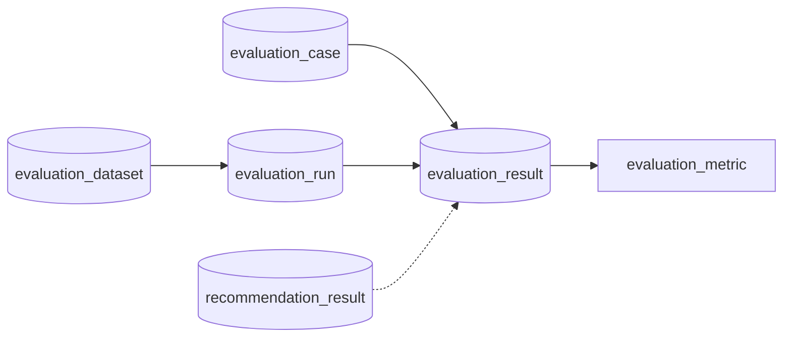

# Evaluation Result テーブル定義書

## 1. ドキュメント情報

| 項目           | 内容                               |
| -------------- | ---------------------------------- |
| ドキュメントID | `DB-TBL-MVP-evaluation_result`     |
| ドキュメント名 | Evaluation Result テーブル定義書   |
| 対象システム   | Gift Recommendation Service MVP    |
| MVP対象        | `partial`                          |
| 作成日         | 2026-06-16                         |
| 更新日         | 2026-06-16（Human Review §17.1 確定） |

---

## 2. 概要

`evaluation_result` は、オフライン評価（BATCH-018）における **ケース × 評価実行（Run）単位の結果正本** を保持する Evaluation系テーブルである。

親 `evaluation_run` に属し、入力正本 `evaluation_case` と IF-SHARED-004 / `mode=evaluation` で生成した `recommendation_result` を紐づける。IF-DB-BATCH-018（Evaluation 保存）の INSERT 対象のひとつであり、MOD-BATCH-041 Evaluation Result Writer の書込先。

評価指標（Precision / NDCG 等）の本体は子テーブル `evaluation_metric` に分離する（Evaluation評価定義書 §14.4 の論理項目参考・物理 DDL は論理ER §12.2 準拠）。

---

## 3. 目的

- オフライン評価フロー **Dataset → Run → Result** の **結果正本** として、ケース単位の実行結果を永続化する
- `evaluation_run`（produces）・`evaluation_case`（executed_as）・`recommendation_result`（may_reference）との参照関係を確定する
- 冗長 `evaluation_dataset_id` により、Run 削除前の分析・再現性 trace を補強する
- `evaluation_metric` の **親 Result** として has 1:N 関係を確定する
- 後続 DDL Task が migration を作成できる粒度まで設計を確定する

---

## 4. テーブル基本情報

| 項目 | 内容 |
| ---- | ---- |
| 物理テーブル名 | `evaluation_result` |
| 論理テーブル名 | Evaluation Result |
| 分類 | Evaluation系 |
| 正本区分 | 派生 / Log |
| 主な更新主体 | batch（BATCH-018 / MOD-BATCH-041） |
| 主な参照主体 | batch、Observability / Admin 将来参照、evaluation_metric 子テーブル |
| MVP対象 | `partial` |
| 関連物理ER | `docs/06_実装設計/database/物理ER.md` §7・§9・§12 |

---

## 5. 用途・責務

- batch が BATCH-018 実行中、有効 `evaluation_case` ごとに IF-SHARED-004 で reco を evaluation mode 実行したあと、**1 Case あたり 1 行** を INSERT する（MOD-BATCH-041）
- `evaluation_run_id` / `evaluation_case_id` で Run × Case の実行結果を特定する
- 推薦成功時は `recommendation_result_id` に evaluation mode で生成した Result を紐づける（#567 §17.1 No.1）
- 推薦失敗時も **Result 行は INSERT 可能**（`recommendation_result_id = NULL`）。失敗 trace と子 `evaluation_metric`（エラー系 metric）を残す（§17.1 No.3）
- 同一 Run 内で **同一 Case の Result 行は上書きしない**（UNIQUE 制約 + INSERT のみ）
- 再評価は **新規 `evaluation_run` を追記**し、既存 Result 行は変更しない（状態遷移設計書 §8.1.3・evaluation_dataset §12.2）

### 5.1 対象外

- 評価データセット定義（`evaluation_dataset` の責務）
- 評価ケース定義（`evaluation_case` の責務）
- 評価実行状態・Config version 固定（`evaluation_run` の責務）
- 評価指標本体（`evaluation_metric` の責務。本テーブルに metric 列は持たない）
- `recommendation_run_id` 物理列（MVP は `recommendation_result_id` 経由の間接連携。evaluation_run §17.1 No.1）
- 人手評価（`human_eval_task` / `human_eval_result`。MVP 未物理化）
- Online 推薦 Result 正本（`recommendation_result` の責務。参照のみ）

### 5.2 Offline Evaluation フロー上の位置づけ（Dataset → Run → Result）

論理ER §12.1・処理構成定義書 §13 を正とする。**本テーブルはケース単位の結果正本**。



| 観点 | 方針 |
| ---- | ---- |
| 親 Run | `evaluation_run_id` → **`evaluation_run`**（**物理 FK ON**。1:N produces） |
| 入力 Case | `evaluation_case_id` → **`evaluation_case`**（**物理 FK ON**。1:N executed_as） |
| 冗長 Dataset | `evaluation_dataset_id` → **`evaluation_dataset`**（**物理 FK ON**。再現性 denormalization） |
| 推薦 Result | `recommendation_result_id` → **`recommendation_result`**（**LOGICAL FK**。nullable may_reference） |
| 子 Metric | **`evaluation_metric.evaluation_result_id`** → 本テーブル（has 1:N。後続 Task #574） |
| 再評価 | 同一 Dataset に **新規 Run** を INSERT。既存 Result 行は **UPDATE しない** |

> **双方向整合**: `evaluation_run_テーブル定義書` §8.2 produces / `evaluation_case_テーブル定義書` §8.1 executed_as / `recommendation_result_テーブル定義書` §8.2 references と整合する。

### 5.3 BATCH-018 / I/F との関係

| 観点 | 方針 |
| ---- | ---- |
| 起動 | MOD-BATCH-039 が Run 作成後、有効 Case を順次 IF-SHARED-004 へ投入 |
| 推薦実行 | **IF-SHARED-004**: `evaluation_case` + `mode=evaluation` → reco → `recommendation_result` |
| 書込 I/F | **IF-DB-BATCH-018** の INSERT 対象（`evaluation_run` / **本テーブル** / `evaluation_metric`） |
| 書込モジュール | **MOD-BATCH-041** Evaluation Result Writer が本テーブルへ INSERT |
| Metric 算出 | MOD-BATCH-040 Evaluation Metric Calculator が子 `evaluation_metric` へ INSERT（本 Task の out_of_scope） |
| workflow 入力 | 親 `evaluation_dataset_id` は Run 作成時に確定。本テーブルは Run + Case から導出 |

### 5.4 論理ER / テーブル一覧 / Evaluation評価定義書との差分整理

| 出典 | 列・概念 | 本テーブル（MVP 物理 DDL） | 扱い |
| ---- | -------- | ---------------------------- | ---- |
| 論理ER §12.2 | `evaluation_result_id`, `evaluation_run_id`, `evaluation_dataset_id`, `evaluation_case_id`, `recommendation_result_id`, `executed_at` | **採用** | 一致 |
| 論理ER §12.2 | 状態カラムなし | **状態列なし** | 一致 |
| テーブル一覧 §10 補足 | Recommendation Run 連携 | **`recommendation_result_id` nullable LOGICAL FK** | evaluation_run に `recommendation_run_id` なし（#567 No.1） |
| Evaluation評価定義書 §14.4 | `offline_eval_result` の `precision_at_k` 等 | **物理列なし** | `evaluation_metric` に分離（§17.1 No.4） |
| Evaluation評価定義書 §14.4 | `recommendation_run_id` | **物理列なし** | `recommendation_result_id` 経由（#567 No.1） |
| 物理ER timestamp 方針 | `created_at` / `updated_at` | **採用** | `executed_at`（業務）と分離（§17.1 No.5） |
| Observability | 長期保持候補 | **365 日 Retention** | `ログ・Observability設計書` §13 |

### 5.5 evaluation_run 定義書との双方向整合（#567）

| 項目 | `evaluation_run_テーブル定義書` | 本テーブル | 状態 |
| ---- | ------------------------------- | ---------- | ---- |
| produces FK | §8.2 `evaluation_result.evaluation_run_id` ON | §8.1 `evaluation_run_id` ON | 整合 |
| カーディナリティ | §17.1 No.9: **1 Run : N Result**（Case 単位） | §7 UNIQUE `(run, case)` | 整合 |
| recommendation 連携 | §17.1 No.1: Run 側 `recommendation_run_id` なし | `recommendation_result_id` nullable | 整合 |
| 再評価 | §17.1 No.6: 新規 Run INSERT | Result 上書きなし | 整合 |

### 5.6 evaluation_case 定義書との双方向整合（#566）

| 項目 | `evaluation_case_テーブル定義書` | 本テーブル | 状態 |
| ---- | -------------------------------- | ---------- | ---- |
| executed_as FK | §8.1 `evaluation_result.evaluation_case_id` ON | §8.1 `evaluation_case_id` ON | 整合 |
| 入力正本 | `input_condition_json` は Case 側 | 本テーブルは結果のみ | 責務分離 |
| Case 無効化 | `is_active=false` は BATCH-018 読取除外 | Result 行は生成されない | 整合 |

### 5.7 evaluation_dataset 定義書との双方向整合（#565）

| 項目 | `evaluation_dataset_テーブル定義書` | 本テーブル | 状態 |
| ---- | ----------------------------------- | ---------- | ---- |
| 冗長 `evaluation_dataset_id` | §5.4: `#573 以降で確定` | **物理 FK ON**（§17.1 No.1） | 本 Task で確定 |
| 再評価追記 | §12.2: Result 上書きなし | INSERT のみ | 整合 |
| Retention | §13: 365 日 | §13 同値 | 整合 |

### 5.8 recommendation_result 定義書との双方向整合（#544）

| 項目 | `recommendation_result_テーブル定義書` | 本テーブル | 状態 |
| ---- | -------------------------------------- | ---------- | ---- |
| 被参照 | §8.2 `evaluation_result.recommendation_result_id` references LOGICAL | §8.1 LOGICAL FK nullable | 整合 |
| evaluation mode | `request_mode=evaluation` Result | 成功時に ID を保存 | API-INT-002 整合 |
| 1 Run 1 Result | `uq_result_per_run`（Online Run） | Evaluation は **Case 単位**で複数 Result 可 | ドメイン差分 |

### 5.9 MOD-BATCH-041 Evaluation Result Writer（入出力）

機能×モジュール対応表を正とする。

| 方向 | 内容 |
| ---- | ---- |
| 入力 | `evaluation_run_id`, `evaluation_case_id`, `evaluation_dataset_id`（Run から導出可）, （任意）`recommendation_result_id`, `executed_at` |
| 出力 | `evaluation_result_id` |
| 前提 | IF-SHARED-004 完了（成功 / 失敗いずれも trace 行を残す方針） |
| 後続 | MOD-BATCH-040 が同一 `evaluation_result_id` に metric を INSERT |

---

## 6. カラム定義

| No | カラム名 | 論理名 | 型 | 必須 | PK | FK | Unique | Default | 説明 |
| --: | -------- | ------ | -- | ---- | -- | -- | ------ | ------- | ---- |
| 1 | `evaluation_result_id` | Evaluation Result ID | `uuid` | `yes` | `yes` | — | `yes` | `gen_random_uuid()` | サロゲート PK。子 `evaluation_metric` の参照先 |
| 2 | `evaluation_run_id` | Evaluation Run ID | `uuid` | `yes` | — | `ON` | — | — | 親 Run。produces 関係 |
| 3 | `evaluation_case_id` | Evaluation Case ID | `uuid` | `yes` | — | `ON` | — | — | 実行対象 Case。executed_as 関係 |
| 4 | `evaluation_dataset_id` | Evaluation Dataset ID | `uuid` | `yes` | — | `ON` | — | — | 冗長保持。Run からコピー。再現性 trace |
| 5 | `recommendation_result_id` | Recommendation Result ID | `uuid` | `no` | — | LOGICAL | — | `NULL` | evaluation mode 推薦 Result。失敗時 NULL 可 |
| 6 | `executed_at` | Executed At | `timestamptz` | `yes` | — | — | — | — | ケース評価実行完了日時（業務時刻） |
| 7 | `created_at` | Created At | `timestamptz` | `yes` | — | — | — | `now()` | 行 INSERT 日時（監査） |
| 8 | `updated_at` | Updated At | `timestamptz` | `yes` | — | — | — | `now()` | 最終更新日時。MVP は INSERT 時のみ設定 |

> **MVP で採用しない列**: `recommendation_run_id`（間接連携）、インライン metric 列（`precision_at_k` 等。§17.1 No.4）、`trace_id`（Run / Result 側 trace は Log 設計に委譲）

---

## 7. 主キー・一意キー

| 種別 | 対象カラム | 方針 | 備考 |
| ---- | ---------- | ---- | ---- |
| PRIMARY KEY | `evaluation_result_id` | サロゲート UUID | 子 `evaluation_metric` FK の参照先 |
| UNIQUE | `evaluation_run_id`, `evaluation_case_id` | Run × Case 単位で 1 行 | §17.1 No.2（`uq_evaluation_result_run_case`） |

---

## 8. 外部キー・参照関係

### 8.1 参照先

| カラム | 参照先 | FK制約 | 参照整合性 | 備考 |
| ------ | ------ | ------ | ---------- | ---- |
| `evaluation_run_id` | `evaluation_run.evaluation_run_id` | `ON` | `ON DELETE RESTRICT` | 物理ER §9 produces。evaluation_run §8.2 |
| `evaluation_case_id` | `evaluation_case.evaluation_case_id` | `ON` | `ON DELETE RESTRICT` | 物理ER executed_as。evaluation_case §8.1 |
| `evaluation_dataset_id` | `evaluation_dataset.evaluation_dataset_id` | `ON` | `ON DELETE RESTRICT` | 冗長 denormalization。evaluation_dataset §5.4 |
| `recommendation_result_id` | `recommendation_result.recommendation_result_id` | `LOGICAL` | batch INSERT 前に存在確認（nullable） | recommendation_result §8.2 may_reference |

### 8.2 被参照（子テーブル）

| 参照元 | 参照列 | 関係 | FK制約 | 備考 |
| ------ | ------ | ---- | ------ | ---- |
| `evaluation_metric` | `evaluation_result_id` | has | `ON`（#574 以降で確定） | 1:N。物理ER §9 |

### 8.3 親子関係サマリ（論理ER §12.1）

| 親 | 関係名 | カーディナリティ | FK |
| -- | ------ | ---------------- | -- |
| `evaluation_run` | produces | 1:N | ON |
| `evaluation_case` | executed_as | 1:N | ON |
| `evaluation_dataset` | 冗長保持 | N:1 | ON |
| `recommendation_result` | may_reference | 0..1:N | LOGICAL |

---

## 9. Index

| Index名 | 対象カラム | 種別 | 用途 | 備考 |
| ------- | ---------- | ---- | ---- | ---- |
| `evaluation_result_pkey` | `evaluation_result_id` | btree（PK） | 主キー | 自動生成 |
| `uq_evaluation_result_run_case` | `evaluation_run_id`, `evaluation_case_id` | btree（unique） | Run × Case 冪等 | §17.1 No.2 |
| `idx_evaluation_result_run_id` | `evaluation_run_id` | btree | 親 Run 単位一覧 | produces 逆引き |
| `idx_evaluation_result_case_id` | `evaluation_case_id` | btree | Case 単位履歴 | executed_as 逆引き |
| `idx_evaluation_result_dataset_id` | `evaluation_dataset_id` | btree | Dataset 単位分析 | 冗長列の検索補助 |
| `idx_evaluation_result_recommendation_result_id` | `recommendation_result_id` | btree | Recommendation Result 逆引き | LOGICAL FK 補助。nullable |
| `idx_evaluation_result_executed_at` | `executed_at` DESC | btree | 時系列分析・Retention 候補 | 業務時刻 |
| `idx_evaluation_result_created_at` | `created_at` DESC | btree | 監査・Retention | evaluation_run 同型 |

---

## 10. 制約

| 制約名 | 種別 | 対象 | 内容 | 備考 |
| ------ | ---- | ---- | ---- | ---- |
| `evaluation_result_pkey` | PRIMARY KEY | `evaluation_result_id` | 主キー | — |
| `uq_evaluation_result_run_case` | UNIQUE | `evaluation_run_id`, `evaluation_case_id` | Run 内 Case 一意 | §7 |
| `fk_evaluation_result_run` | FOREIGN KEY | `evaluation_run_id` | `evaluation_run` 参照 ON DELETE RESTRICT | DDL Task |
| `fk_evaluation_result_case` | FOREIGN KEY | `evaluation_case_id` | `evaluation_case` 参照 ON DELETE RESTRICT | DDL Task |
| `fk_evaluation_result_dataset` | FOREIGN KEY | `evaluation_dataset_id` | `evaluation_dataset` 参照 ON DELETE RESTRICT | DDL Task |
| `chk_executed_at_not_future` | CHECK | `executed_at` | `executed_at <= now() + interval '5 minutes'` | クロックスキュー許容 |

> **recommendation_result_id**: MVP では **DB CHECK で NOT NULL 条件を設けない**（失敗時 NULL 許容。§17.1 No.3）

---

## 11. 状態・enum

| カラム | enum / code | 定義元 | 許容値 | 備考 |
| ------ | ----------- | ------ | ------ | ---- |
| — | — | なし | — | 状態カラムなし（論理ER §12.2 準拠） |

成功 / 失敗の判定は `recommendation_result_id` の有無および子 `evaluation_metric`（後続 Task）で表現する。

---

## 12. 更新仕様

| 操作 | 実行主体 | 条件 | 更新項目 | 冪等性 | 備考 |
| ---- | -------- | ---- | -------- | ------ | ---- |
| INSERT | batch（MOD-BATCH-041） | Run が `running`、Case が有効、IF-SHARED-004 完了 | 全列 | `(evaluation_run_id, evaluation_case_id)` UNIQUE で冪等 | IF-DB-BATCH-018 |
| SELECT | batch / Observability | 分析・trace | — | — | Dataset / Run / Case 単位 |
| UPDATE | — | **MVP では行わない** | — | — | 結果不変。再評価は新規 Run |
| DELETE | — | **MVP では行わない** | — | — | §13 Retention |

### 12.1 BATCH-018 Case ごとの Result 生成手順

`evaluation_dataset_テーブル定義書` §12.1・evaluation_case §12.1 を正とする。

1. 親 `evaluation_run` が `running` であること
2. `evaluation_case` を `evaluation_dataset_id` + `is_active = true` で SELECT
3. 各行について Validation（GRS-EVAL-002 除外）
4. IF-SHARED-004 で reco evaluation mode 実行
5. MOD-BATCH-041 が本テーブルへ INSERT:
   - `evaluation_run_id` / `evaluation_case_id` / `evaluation_dataset_id`（Run からコピー）
   - 成功時: `recommendation_result_id` を設定
   - 失敗時: `recommendation_result_id = NULL`
   - `executed_at` = ケース実行完了時刻
6. MOD-BATCH-040 が子 `evaluation_metric` へ INSERT（#574）

### 12.2 再評価・上書き禁止方針

| 観点 | 方針 |
| ---- | ---- |
| 同一 Run 内再実行 | **禁止**。UNIQUE `(evaluation_run_id, evaluation_case_id)` で二重 INSERT を拒否 |
| 同一 Dataset 再評価 | **新規 `evaluation_run` INSERT**。既存 Result 行は変更しない |
| Case 改訂後の再評価 | 新 Run で新 Result 行を追記。過去 Result は履歴として保持 |

---

## 13. データ保持・削除

| 観点 | 方針 |
| ---- | ---- |
| 保持期間 | **365 日**（`created_at` 基準）。`evaluation_dataset` / `evaluation_run` と同値（§17.1 No.6） |
| 削除方式 | MVP では **DELETE なし** |
| 削除条件 | — |
| 論理削除 | MVP 対象外 |
| アーカイブ | Phase2 ⑥ データ保持方針 Task で Evaluation 系全体と一括確定可 |

> **Observability**: `ログ・Observability設計書` において **長期保持候補**（モデル比較・改善履歴）。MVP では自動パージなし。

---

## 14. Migration / DDL

| 項目 | 内容 |
| ---- | ---- |
| DDL対象 | `evaluation_result` |
| migration単位 | 1 テーブル = 1 migration（DDL Task） |
| 適用順序 | **`evaluation_run` / `evaluation_case` / `evaluation_dataset` merge 済み**、`recommendation_result` merge 済み、**`evaluation_metric` より前** |
| rollback方針 | forward migration 主体。DROP は Human Review 必須 |
| 破壊的変更有無 | `no`（初回 CREATE） |

**DDL 概要（参考・DDL Task で確定）**

```sql
-- 参考。制約名・Index は DDL Task で最終確定。
CREATE TABLE evaluation_result (
  evaluation_result_id uuid PRIMARY KEY DEFAULT gen_random_uuid(),
  evaluation_run_id uuid NOT NULL REFERENCES evaluation_run(evaluation_run_id) ON DELETE RESTRICT,
  evaluation_case_id uuid NOT NULL REFERENCES evaluation_case(evaluation_case_id) ON DELETE RESTRICT,
  evaluation_dataset_id uuid NOT NULL REFERENCES evaluation_dataset(evaluation_dataset_id) ON DELETE RESTRICT,
  recommendation_result_id uuid,
  executed_at timestamptz NOT NULL,
  created_at timestamptz NOT NULL DEFAULT now(),
  updated_at timestamptz NOT NULL DEFAULT now(),
  CONSTRAINT uq_evaluation_result_run_case UNIQUE (evaluation_run_id, evaluation_case_id)
);
```

---

## 15. セキュリティ・権限

| 観点 | 方針 |
| ---- | ---- |
| 読み取り権限 | batch（service role 経由）、将来 Admin 分析 |
| 書き込み権限 | **batch のみ**（MOD-BATCH-041）。web / reco から Direct DB 書き込み禁止 |
| service role利用 | batch の server 側のみ |
| 個人情報・機微情報 | 本テーブル列に PII を保持しない。入力 JSON は `evaluation_case` 参照 |
| ログ出力制限 | UUID / 時刻のみ。Case JSON / Result payload をログに過剰出力しない |

---

## 16. テスト観点

| No | 観点 | 確認内容 | 種別 |
| --: | ---- | -------- | ---- |
| 1 | DDL適用 | CREATE TABLE / Index / FK / UNIQUE が定義どおり | migration |
| 2 | FK Run | 存在しない `evaluation_run_id` INSERT が拒否される | migration |
| 3 | FK Case | 存在しない `evaluation_case_id` INSERT が拒否される | migration |
| 4 | FK Dataset | 存在しない `evaluation_dataset_id` INSERT が拒否される | migration |
| 5 | UNIQUE | 同一 `(evaluation_run_id, evaluation_case_id)` の二重 INSERT が拒否される | integration |
| 6 | nullable Result | `recommendation_result_id = NULL` で INSERT 可能 | integration |
| 7 | 1:N produces | 同一 Run に複数 Case 分の Result INSERT 可能 | integration |
| 8 | 再評価 | 新 Run への追記 INSERT が可能。既存行 UPDATE なし | integration |
| 9 | Dataset 冗長 | `evaluation_dataset_id` が Run の Dataset と一致すること（batch Validation） | integration |
| 10 | Metric 分離 | 本テーブルに metric 列が存在しない | manual |

---

## 17. 未決事項

| No | 論点 | 判断が必要な理由 | 判断者 | 期限 | 備考 |
| --: | ---- | ---------------- | ------ | ---- | ---- |
| — | — | — | — | — | Human Review 決定事項は §17.1 に整理 |

### 17.1 Human Review 決定事項（Issue #573）

| No | 論点 | 決定内容 | 決定者 | 備考 |
| --: | ---- | -------- | ------ | ---- |
| 1 | `evaluation_dataset_id` の物理 FK | **物理 FK ON** / **ON DELETE RESTRICT**（Run #567・Dataset #565 踏襲。冗長列だが整合性担保） | Human | evaluation_dataset §5.4 確定 |
| 2 | `(evaluation_run_id, evaluation_case_id)` UNIQUE | **UNIQUE 制約採用**（`uq_evaluation_result_run_case`）。Run × Case 冪等 INSERT | Human | evaluation_run §17.1 No.9 と整合 |
| 3 | `recommendation_result_id` 必須性 | **nullable 採用**。推薦失敗時も Result 行で trace。metric は子テーブル | Human | recommendation_result §8.2 LOGICAL FK |
| 4 | Evaluation §14.4 インライン metric 列 | **物理化しない**。`evaluation_metric` のみ（evaluation_case JSONB 分離方針踏襲） | Human | 論理ER §12.2 |
| 5 | `executed_at` と `created_at` | **併用**。`executed_at` = 業務完了時刻、`created_at` / `updated_at` = 監査 | Human | evaluation_run `started_at` / `created_at` 対称 |
| 6 | Evaluation Result Retention | **365 日**（`created_at` 基準）。MVP 自動 DELETE なし。Dataset / Run と同値 | Human | Observability 長期保持候補 |

---

## 18. 関連資料

| 種別 | パス / URL | 用途 |
| ---- | ---------- | ---- |
| 物理ER | `docs/06_実装設計/database/物理ER.md` | §7 Evaluation系・§9 FK |
| 論理ER | `docs/05_アプリケーション設計/アプリ/database/論理ER.md` | §12.1 / §12.2 Evaluation系 |
| テーブル一覧 | `docs/05_アプリケーション設計/アプリ/database/テーブル一覧.md` | §10 No.54 |
| Evaluation評価定義書 | `docs/04_ドメインモデル設計/Evaluation評価定義書.md` | §14.4 offline_eval_result 参考 |
| 親 Run 定義 | `docs/06_実装設計/database/evaluation_run_テーブル定義書.md` | produces / §17.1 |
| 親 Case 定義 | `docs/06_実装設計/database/evaluation_case_テーブル定義書.md` | executed_as / §8.1 |
| 親 Dataset 定義 | `docs/06_実装設計/database/evaluation_dataset_テーブル定義書.md` | §5.4 冗長 dataset_id |
| Recommendation Result | `docs/06_実装設計/database/recommendation_result_テーブル定義書.md` | §8.2 references |
| 状態遷移設計書 | `docs/05_アプリケーション設計/アプリ/状態遷移設計書.md` | §8.1.3 再評価追記 |
| I/F | `docs/05_アプリケーション設計/アプリ/インターフェース一覧.md` | IF-DB-BATCH-018 / IF-SHARED-004 |
| API 契約 | `docs/06_実装設計/api/API-INT-002_Reco推薦実行API契約仕様書.md` | evaluation mode |
| Observability | `docs/05_アプリケーション設計/アプリ/ログ・Observability設計書.md` | 長期保持候補 |
| 後続 Task | evaluation_metric（#574） | has 関係 |

---

## 19. レビュー観点

- 論理ER §12.2・物理ER Mermaid ER・テーブル一覧 §10 No.54 と矛盾していない
- `evaluation_run` との produces（物理 FK ON・1:N）が明記されている
- `evaluation_case` との executed_as（物理 FK ON・1:N）が明記されている
- `recommendation_result` との may_reference（LOGICAL FK・nullable）が明記されている
- `evaluation_dataset_id` 冗長保持と物理 FK ON が明記されている
- `evaluation_metric` との has 1:N（子テーブル・metric 列なし）が明記されている
- Evaluation評価定義書 §14.4 と evaluation_metric 分離の差分が整理されている
- BATCH-018 / IF-DB-BATCH-018 / MOD-BATCH-041 との I/F が一貫している
- 再評価追記（Result 上書きなし）が evaluation_run / evaluation_dataset と整合している
- Human Review §17.1 No.1〜No.6 が反映されている
- Retention 365 日が evaluation_dataset / evaluation_run と整合している
- DDL Task が CREATE TABLE を起こせる粒度である
- secret や `.env` 実値が含まれていない
