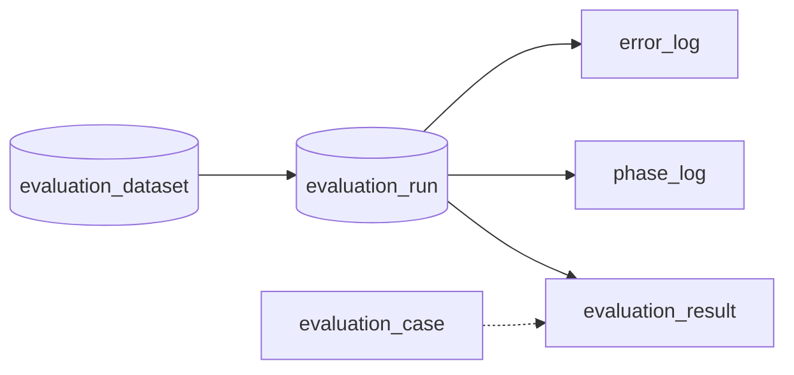
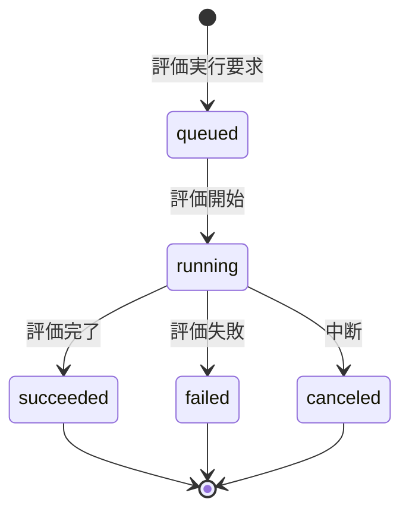

# Evaluation Run テーブル定義書

## 1. ドキュメント情報

| 項目           | 内容                          |
| -------------- | ----------------------------- |
| ドキュメントID | `DB-TBL-MVP-evaluation_run`   |
| ドキュメント名 | Evaluation Run テーブル定義書 |
| 対象システム   | Gift Recommendation Service MVP |
| MVP対象        | `partial`                     |
| 作成日         | 2026-06-16                    |
| 更新日         | 2026-06-16                    |

---

## 2. 概要

`evaluation_run` は、オフライン評価（BATCH-018）における **1 回分の評価実行単位** を保持する Evaluation系テーブルである。

`evaluation_dataset` に紐づき、実行時に使用した Config / Model / Ranking version を固定して **再現性** を担保する。IF-DB-BATCH-018（Evaluation 保存）の実行単位 DB 正本。

Observability では `evaluation_run_id` を trace キーとして利用する（ログ・Observability設計書 §10.2）。

---

## 3. 目的

- オフライン評価フロー **Dataset → Run → Result** の **実行正本** として、評価処理 1 回分の状態（`evaluation_status`）を管理する
- **`semantic_config_version_id` / `model_version_id` / `ranking_config_id`** を個別列で保持し、評価再現性を担保する
- `evaluation_result` / `evaluation_metric` の **親 Run** として参照される
- `phase_log` / `error_log` の **owner**（`owner_type = evaluation_run`）として Log 連携する
- 後続 DDL Task が migration を作成できる粒度まで設計を確定する

---

## 4. テーブル基本情報

| 項目 | 内容 |
| ---- | ---- |
| 物理テーブル名 | `evaluation_run` |
| 論理テーブル名 | Evaluation Run |
| 分類 | Evaluation系 |
| 正本区分 | 実行Log / 状態 |
| 主な更新主体 | batch（BATCH-018 / MOD-BATCH-039）、reco（evaluation mode 実行時の状態連携） |
| 主な参照主体 | batch、reco、Observability / Admin 将来参照 |
| MVP対象 | `partial` |
| 関連物理ER | `docs/06_実装設計/database/物理ER.md` §7・§9・§12・§17.7 |

---

## 5. 用途・責務

- batch が BATCH-018 開始時、対象 `evaluation_dataset` を解決したうえで Run 行を **INSERT**（初期 `evaluation_status = queued`）
- 評価実行開始時に `evaluation_status = running` および `started_at` を設定する（状態遷移設計書 §8.1.2）
- 終端状態（`succeeded` / `failed` / `canceled`）で `completed_at` を設定する
- 詳細なフェーズ進行は **`phase_log`**（`owner_type = evaluation_run`）に記録し、Run 本体の状態更新は最小限に留める
- 障害詳細は **`error_log`**（`owner_type = evaluation_run`）に記録する（error_log 定義書 §5.2）
- 同一 Run を **再開しない**。再評価は同一 Dataset に対する **新規 Run** として INSERT する（状態遷移設計書 §8.1.3・§11.3）

### 5.1 対象外

- 評価データセット定義（`evaluation_dataset` の責務）
- 評価ケース定義（`evaluation_case` の責務）
- 評価結果・メトリクス本体（`evaluation_result` / `evaluation_metric` の責務）
- `evaluation_run_phase_log` 独立テーブル（MVP では `phase_log` に統合。§5.6）
- Config / Master 正本（`semantic_config_version` / `model_version` / `ranking_config` 等の責務）
- Online 推薦の `pair_id` 解決（Evaluation Run には `pair_id` 列を持たない。Case 入力条件は `evaluation_case` 正本）

### 5.2 Offline Evaluation フロー上の位置づけ（Dataset → Run → Result）

論理ER §12.1・処理構成定義書 §13 を正とする。**本テーブルは評価実行単位の中核**。



| 観点 | 方針 |
| ---- | ---- |
| 親 Dataset | `evaluation_dataset_id` → **`evaluation_dataset`**（**物理 FK ON**。1:N executed_by） |
| 子 Result | **`evaluation_result.evaluation_run_id`** → 本テーブル（**物理 FK ON**。1:N produces） |
| 再評価 | 同一 Dataset に対し **複数 Run** が存在し得る（状態遷移設計書 §8.1.3） |
| 再現性 | Run 作成時に version 3 列を **固定**（§5.5） |

> **双方向整合**: `evaluation_result` テーブル定義書（後続 Task）で produces 側 FK ON を確定。Run 側は本 Task で **Run 列定義と被参照方針** を正本とする。

### 5.3 BATCH-018 / I/F との関係

| 観点 | 方針 |
| ---- | ---- |
| 起動 | BATCH-018 / MOD-BATCH-039 が `evaluation_dataset` 解決後、本テーブルへ Run を INSERT |
| 書込 I/F | **IF-DB-BATCH-018** の INSERT 対象のひとつ（`evaluation_run` / `evaluation_result` / `evaluation_metric`） |
| 推薦実行 | **IF-SHARED-004** で `evaluation_case` を入力に reco を evaluation mode 実行。Run 状態は batch / reco が更新 |
| workflow 入力 | `batch-offline-evaluation.yml` の `evaluation_dataset_id` 等で親 Dataset を指定（evaluation_dataset 定義書 §5.2） |

### 5.4 論理ER / テーブル一覧 / Observability との差分整理

| 出典 | 列・概念 | 本テーブル（MVP 物理 DDL） | 扱い |
| ---- | -------- | ---------------------------- | ---- |
| 論理ER §12.2 | `evaluation_run_id`, `evaluation_dataset_id`, version 3 列, `started_at`, `completed_at`, `evaluation_status` | **採用** | 一致 |
| テーブル一覧 §10 補足 | `mode = evaluation` の Recommendation Run 連携 | **`recommendation_run_id` 物理列なし** | MVP は `evaluation_result.recommendation_result_id` 経由で間接参照（§17.1 No.1） |
| BATCH-018 文脈 | Batch 実行単位 trace | **`batch_run_id` nullable 採用** | LOGICAL FK。BATCH-018 起動 Run の親 Batch 追跡（§17.1 No.2） |
| 物理ER timestamp 方針 | `created_at` / `updated_at` | **採用** | 行作成・`evaluation_status` 更新監査。`started_at` / `completed_at` とは別 |
| Observability §10.2 | trace キー | **`evaluation_run_id` を正** | `trace_id` 物理列は持たない（phase_log / error_log の `trace_id` で横断連携可） |

### 5.5 Config / Model / Ranking Version 責務

semantic_config_version / model_version / ranking_config 各定義書・Human Review #565 / recommendation_run 定義書 §5.5 を正とする。

| 観点 | 方針 |
| ---- | ---- |
| 正本列 | **`semantic_config_version_id` / `model_version_id` / `ranking_config_id`** を本テーブルに **個別列** で保持 |
| 解決 | batch / reco が BATCH-018 入力または evaluation mode payload から version を解決し、Run INSERT 時に **コピー** |
| FK | 3 列とも **LOGICAL FK**（物理 FK なし）。INSERT 前に存在確認 |
| 被参照 | semantic_config_version / model_version / ranking_config 各定義書 §8 と双方向整合（§17.1 No.3） |

### 5.6 Log 連携（`phase_log` / `error_log`）

| 観点 | 方針 |
| ---- | ---- |
| `evaluation_run_phase_log` | **物理テーブル作成しない**。`phase_log` に統合（phase_log 定義書 §5.2） |
| phase_log | `owner_type = evaluation_run`、`owner_id = evaluation_run_id`（**LOGICAL** records 関係） |
| error_log | `owner_type = evaluation_run`、`owner_id = evaluation_run_id`（**LOGICAL** may_have 関係） |
| `phase_name` | **`evaluation_run_phase_name` enum は MVP 未定義**。phase_log の DB CHECK は **省略**（アプリ validation のみ。phase_log 定義書 §11.3） |
| 責務分離 | Run 本体は **`evaluation_status` のみ** 更新。フェーズ詳細は phase_log、障害詳細は error_log |

### 5.7 MOD-BATCH-039 Offline Evaluation Runner（入出力）

機能×モジュール対応表を正とする。

| 方向 | 内容 |
| ---- | ---- |
| 入力 | `evaluation_dataset_id`、解決済み version 3 列、（任意）`batch_run_id` |
| 出力 | `evaluation_run_id`、更新後 `evaluation_status` / タイムスタンプ |
| 連携 | IF-SHARED-004 経由で reco pipeline 実行。Phase / Error Log Writer が同一 `evaluation_run_id` を owner として記録 |

### 5.8 evaluation_dataset 定義書との双方向整合（#565）

evaluation_dataset 定義書 §5.4 を正とする。

| 項目 | 本テーブル側の確定内容 |
| ---- | ---------------------- |
| FK | `evaluation_dataset_id` → `evaluation_dataset.evaluation_dataset_id`（**ON** / **ON DELETE RESTRICT**） |
| Index | **`idx_evaluation_run_dataset_id`**（`evaluation_dataset_id`） |
| 関係名 | executed_by（1 Dataset : N Run） |

---

## 6. カラム定義

| No | カラム名 | 論理名 | 型 | 必須 | PK | FK | Unique | Default | 説明 |
| --: | -------- | ------ | -- | ---- | -- | -- | ------ | ------- | ---- |
| 1 | `evaluation_run_id` | Evaluation Run ID | `uuid` | `yes` | `yes` | — | `yes` | `gen_random_uuid()` | サロゲート PK。Observability trace キー |
| 2 | `evaluation_dataset_id` | Evaluation Dataset ID | `uuid` | `yes` | — | `ON` | — | — | 親 Dataset。`evaluation_dataset` 物理 FK |
| 3 | `batch_run_id` | Batch Run ID | `uuid` | `no` | — | LOGICAL | — | `NULL` | BATCH-018 実行単位 trace。`batch_run_log` 論理参照（§5.4） |
| 4 | `semantic_config_version_id` | Semantic Config Version ID | `uuid` | `yes` | — | LOGICAL | — | — | 使用 Semantic Config Version。再現性固定 |
| 5 | `model_version_id` | Model Version ID | `uuid` | `yes` | — | LOGICAL | — | — | 使用 Model Version |
| 6 | `ranking_config_id` | Ranking Config ID | `uuid` | `yes` | — | LOGICAL | — | — | 使用 Ranking Config |
| 7 | `evaluation_status` | Evaluation Status | `varchar(32)` | `yes` | — | — | — | `'queued'` | `evaluation_run_status` enum |
| 8 | `started_at` | Started At | `timestamptz` | `no` | — | — | — | `NULL` | 評価実行開始日時。`running` 遷移時に設定 |
| 9 | `completed_at` | Completed At | `timestamptz` | `no` | — | — | — | `NULL` | 終端状態到達日時（`succeeded` / `failed` / `canceled`） |
| 10 | `created_at` | Created At | `timestamptz` | `yes` | — | — | — | `now()` | Run 行作成日時（`queued` INSERT 時） |
| 11 | `updated_at` | Updated At | `timestamptz` | `yes` | — | — | — | `now()` | 最終 `evaluation_status` 更新日時 |

> **MVP で採用しない列**: `recommendation_run_id`（§5.4・§17.1 No.1）、`trace_id`（Log 側で連携）、`pair_id`（Evaluation 系では Case 入力正本が `evaluation_case`）

---

## 7. 主キー・一意キー

| 種別 | 対象カラム | 方針 | 備考 |
| ---- | ---------- | ---- | ---- |
| PRIMARY KEY | `evaluation_run_id` | サロゲート UUID | Result / Metric / Log owner の参照先 |

> MVP では **自然キー UNIQUE は設けない**。同一 Dataset の再評価は **新規 Run 行** として INSERT する。

---

## 8. 外部キー・参照関係

### 8.1 参照先

| カラム | 参照先 | FK制約 | 参照整合性 | 備考 |
| ------ | ------ | ------ | ---------- | ---- |
| `evaluation_dataset_id` | `evaluation_dataset.evaluation_dataset_id` | `ON` | batch INSERT 前に Dataset 存在・`is_active=true` | 物理ER §9 executed_by。§17.7 No.4 |
| `batch_run_id` | `batch_run_log.batch_run_id` | `LOGICAL` | BATCH-018 起動時に存在確認 | nullable。§5.4 |
| `semantic_config_version_id` | `semantic_config_version.semantic_config_version_id` | `LOGICAL` | batch / reco 解決 + 存在確認 | semantic_config_version 定義書 §17.1 No.8 |
| `model_version_id` | `model_version.model_version_id` | `LOGICAL` | 同上 | model_version 定義書 §8 |
| `ranking_config_id` | `ranking_config.ranking_config_id` | `LOGICAL` | 同上 | ranking_config 定義書 §8 |

### 8.2 被参照（子テーブル）

| 参照元 | 参照列 | 関係 | FK制約 | 備考 |
| ------ | ------ | ---- | ------ | ---- |
| `evaluation_result` | `evaluation_run_id` | produces | `ON`（DDL Task） | 1:N。物理ER §9 |
| `evaluation_metric` | `evaluation_result_id` 経由 | has | — | Run 直接 FK なし（Result 経由） |
| `phase_log` | `owner_id`（`owner_type=evaluation_run`） | records | `LOGICAL` | phase_log 定義書 §5.2 |
| `error_log` | `owner_id`（`owner_type=evaluation_run`） | may_have | `LOGICAL` | error_log 定義書 §5.2 |

---

## 9. Index

| Index名 | 対象カラム | 種別 | 用途 | 備考 |
| ------- | ---------- | ---- | ---- | ---- |
| `evaluation_run_pkey` | `evaluation_run_id` | btree（PK） | 主キー | 自動生成 |
| `idx_evaluation_run_dataset_id` | `evaluation_dataset_id` | btree | FK / Dataset 単位履歴参照 | evaluation_dataset 定義書 §5.4 で引き継ぎ確定 |
| `idx_evaluation_run_status` | `evaluation_status`, `started_at` | btree | 状態監視・運用分析 | recommendation_run 同型 |
| `idx_evaluation_run_batch_run_id` | `batch_run_id` | btree | BATCH-018 実行単位 trace | nullable |
| `idx_evaluation_run_semantic_config_version` | `semantic_config_version_id` | btree | version 被参照・分析 | §17.1 No.3 |
| `idx_evaluation_run_model_version` | `model_version_id` | btree | version 被参照 | 同上 |
| `idx_evaluation_run_ranking_config` | `ranking_config_id` | btree | version 被参照 | 同上 |
| `idx_evaluation_run_created` | `created_at` DESC | btree | 時系列一覧・Retention 将来 | evaluation_dataset 365 日方針と整合 |

---

## 10. 制約

| 制約名 | 種別 | 対象 | 内容 | 備考 |
| ------ | ---- | ---- | ---- | ---- |
| `evaluation_run_pkey` | PRIMARY KEY | `evaluation_run_id` | 主キー | — |
| `fk_evaluation_run_dataset` | FOREIGN KEY | `evaluation_dataset_id` | `evaluation_dataset` 参照 | ON DELETE RESTRICT（DDL Task） |
| `chk_evaluation_status` | CHECK | `evaluation_status` | `evaluation_status IN ('queued','running','succeeded','failed','canceled')` | packages 正本と一致 |
| `chk_eval_started_before_completed` | CHECK | `started_at`, `completed_at` | `completed_at IS NULL OR started_at IS NULL OR started_at <= completed_at` | タイムライン整合 |
| `chk_eval_completed_terminal` | CHECK | `evaluation_status`, `completed_at` | 終端状態では `completed_at IS NOT NULL` | 終端 = succeeded / failed / canceled |
| `chk_eval_nonterminal_no_completed` | CHECK | `evaluation_status`, `completed_at` | 非終端（queued / running）では `completed_at IS NULL` | 状態遷移設計書 §8.1 |

> **CHECK 実装**: 終端 / 非終端 CHECK は DDL Task で PostgreSQL 式に展開する。上表は意図の要約。

---

## 11. 状態・enum

| カラム | enum / code | 定義元 | 許容値 | 備考 |
| ------ | ----------- | ------ | ------ | ---- |
| `evaluation_status` | `evaluation_run_status` | `enum定義書` §6.12 / `packages/code-definitions/state/evaluation_run_status.yaml` | `queued`, `running`, `succeeded`, `failed`, `canceled` | `recommendation_run_status` とは **別 enum** |
| — | `owner_type`（子 Log 参照用） | `enum定義書` §6.15 / `packages/code-definitions/application/owner_type.yaml` | `evaluation_run` | phase_log / error_log の owner |
| — | `evaluation_run_phase_name` | **MVP 未定義** | — | enum定義書 §6.19。本 Task では packages 正本を新規作成しない（§17.1 No.4） |

### 11.1 状態遷移（Run 本体）

状態遷移設計書 §8.1 を正とする。



| 現状態 | 次状態 | 更新主体 | 更新列 | 備考 |
| ------ | ------ | -------- | ------ | ---- |
| — | `queued` | batch | 全列（初回 INSERT） | version 解決後 |
| `queued` | `running` | batch / reco | `evaluation_status`, `started_at`, `updated_at` | IF-SHARED-004 実行開始 |
| `running` | `succeeded` | batch | `evaluation_status`, `completed_at`, `updated_at` | 全 Case 評価完了 |
| `running` | `failed` | batch / reco | `evaluation_status`, `completed_at`, `updated_at` | GRS-EVAL-003 連携。error_log 記録 |
| `running` | `canceled` | batch | `evaluation_status`, `completed_at`, `updated_at` | 手動中断・タイムアウト |

---

## 12. 更新仕様

| 操作 | 実行主体 | 条件 | 更新項目 | 冪等性 | 備考 |
| ---- | -------- | ---- | -------- | ------ | ---- |
| INSERT | batch | Dataset 解決成功・version 解決成功 | 全列（`evaluation_status=queued`） | 非冪等（新規 UUID） | IF-DB-BATCH-018 |
| UPDATE | batch / reco | 状態遷移 | `evaluation_status`, `started_at` / `completed_at`, `updated_at` | 終端後 UPDATE 禁止 | MOD-BATCH-039 |
| SELECT | batch / reco | 評価進捗・trace | — | — | Observability |
| DELETE | — | **MVP では行わない** | — | — | §13 Retention |

**INSERT 手順（batch / MOD-BATCH-039）**

1. `evaluation_dataset` を参照（`evaluation_dataset_id`、`is_active = true`）
2. BATCH-018 入力または workflow パラメータから version 3 列を解決
3. 同一 BATCH-018 実行の `batch_run_id` を設定（存在する場合）
4. `evaluation_status = queued` で INSERT（`created_at` / `updated_at` 設定）
5. `phase_log` に評価開始フェーズを記録（`owner_type=evaluation_run`）
6. Case ごとに IF-SHARED-004 実行。終了時に Run を終端状態へ UPDATE

---

## 13. データ保持・削除

| 観点 | 方針 |
| ---- | ---- |
| 保持期間 | **365 日**（`created_at` 基準）。`evaluation_dataset` と同値（evaluation_dataset 定義書 §17.1 No.5） |
| 削除方式 | MVP では **DELETE なし** |
| 削除条件 | — |
| 論理削除 | MVP 対象外 |
| アーカイブ | Phase2 ⑥ データ保持方針 Task で Evaluation 系全体と一括確定可 |

> **Log との関係**: `phase_log` / `error_log` は **90 日 Tier**（Batch 系 Log 統一）。Run 本体が 365 日保持されても **Log 詳細は先に削除** され得る。

---

## 14. Migration / DDL

| 項目 | 内容 |
| ---- | ---- |
| DDL対象 | `evaluation_run` |
| migration単位 | 1 テーブル = 1 migration（DDL Task） |
| 適用順序 | **`evaluation_dataset` の後**、Config 群（semantic_config_version / model_version / ranking_config）**merge 済み**、`evaluation_result` **より前**。`phase_log` / `error_log` **より前**（owner_id LOGICAL 参照） |
| rollback方針 | forward migration 主体。DROP は Human Review 必須 |
| 破壊的変更有無 | `no`（初回 CREATE） |

**DDL 概要（参考・DDL Task で確定）**

```sql
-- 参考。制約名・Index・CHECK は DDL Task で最終確定。
CREATE TABLE evaluation_run (
  evaluation_run_id uuid PRIMARY KEY DEFAULT gen_random_uuid(),
  evaluation_dataset_id uuid NOT NULL REFERENCES evaluation_dataset(evaluation_dataset_id),
  batch_run_id uuid,
  semantic_config_version_id uuid NOT NULL,
  model_version_id uuid NOT NULL,
  ranking_config_id uuid NOT NULL,
  evaluation_status varchar(32) NOT NULL DEFAULT 'queued',
  started_at timestamptz,
  completed_at timestamptz,
  created_at timestamptz NOT NULL DEFAULT now(),
  updated_at timestamptz NOT NULL DEFAULT now()
);
```

---

## 15. セキュリティ・権限

| 観点 | 方針 |
| ---- | ---- |
| 読み取り権限 | batch / reco（service role 経由） |
| 書き込み権限 | **batch 主**、reco は evaluation mode 実行に伴う状態更新のみ。web から Direct DB 書き込み禁止 |
| service role利用 | batch / reco の server 側のみ |
| 個人情報・機微情報 | Run 本体列には PII を保持しない。Case 入力の個人情報は `evaluation_case` 参照 |
| ログ出力制限 | version ID / evaluation_status のみ。Case JSON を Run ログに過剰出力しない |

---

## 16. テスト観点

| No | 観点 | 確認内容 | 種別 |
| --: | ---- | -------- | ---- |
| 1 | DDL適用 | CREATE TABLE / Index / FK / CHECK が定義どおり | migration |
| 2 | FK | 存在しない `evaluation_dataset_id` INSERT が拒否される | migration |
| 3 | CHECK | 不正 `evaluation_status` が拒否される | migration |
| 4 | 状態遷移 | queued → running → succeeded の UPDATE 列が設計どおり | integration |
| 5 | LOGICAL version | 存在しない version UUID INSERT が batch / reco 側で拒否される | integration |
| 6 | 1:N executed_by | 同一 Dataset に複数 Run INSERT 可能 | integration |
| 7 | 1:N produces | 同一 Run に複数 evaluation_result INSERT 可能（後続 Task と整合） | integration |
| 8 | Log 連携 | `phase_log` / `error_log` が `owner_type=evaluation_run` で記録可能 | integration |
| 9 | 再実行 | 同一 Run 行の再開 UPDATE が設計上発生しない | manual |
| 10 | Dataset 連携 | `idx_evaluation_run_dataset_id` が evaluation_dataset 定義書 §5.4 と一致 | manual |

---

## 17. 未決事項

| No | 論点 | 判断が必要な理由 | 判断者 | 期限 | 備考 |
| --: | ---- | ---------------- | ------ | ---- | ---- |
| — | — | — | — | — | Human Review 決定事項は §17.1 に整理 |

### 17.1 Human Review 決定事項（Issue #567）

| No | 論点 | 決定内容 | 決定者 | 備考 |
| --: | ---- | -------- | ------ | ---- |
| 1 | `recommendation_run_id` 物理列 | **MVP は物理列なし**。`evaluation_result.recommendation_result_id` 経由で Recommendation Result と間接連携。テーブル一覧 §10 補足の「関連づけ可能」は後続拡張余地 | Human | 論理ER §12.2 に列なし |
| 2 | `batch_run_id` 物理列 | **nullable 採用**（LOGICAL FK）。BATCH-018 実行 trace。未設定時は NULL 可 | Human | §5.4 |
| 3 | version 列の物理 FK | **LOGICAL FK 維持**（物理 FK なし）。semantic_config_version §17.1 No.8 / recommendation_run 踏襲 | Human | §5.5 |
| 4 | `evaluation_run_phase_name` enum | **本 Task では新規定義しない**。phase_log MVP DB CHECK 省略継続。packages 正本は Evaluation 系後続または enum Task へ | Human | enum定義書 §6.19 |
| 5 | Evaluation Run 再実行方針 | **同一 Run を再開せず新規 Run INSERT** | Human | 状態遷移設計書 §11.3 |
| 6 | Retention | **365 日**（`created_at` 基準）。MVP 自動 DELETE なし。evaluation_dataset と同値 | Human | evaluation_dataset §17.1 No.5 踏襲 |
| 7 | `evaluation_status` 列名 | 物理列名 **`evaluation_status`**。packages 正本 ID は **`evaluation_run_status`** | Human | enum定義書 §6.12 |
| 8 | produces カーディナリティ | **1 Run : N evaluation_result**（Case 単位） | Human | 物理ER §9 |

---

## 18. 関連資料

| 種別 | パス / URL | 用途 |
| ---- | ---------- | ---- |
| 物理ER | `docs/06_実装設計/database/物理ER.md` | §7 Evaluation系・§9 FK・§12 enum |
| 論理ER | `docs/05_アプリケーション設計/アプリ/database/論理ER.md` | §12.1 / §12.2 Evaluation系 |
| テーブル一覧 | `docs/05_アプリケーション設計/アプリ/database/テーブル一覧.md` | §10 No.53 |
| enum定義書 | `docs/06_実装設計/database/enum定義書.md` | §6.12 / §6.15 |
| 状態遷移設計書 | `docs/05_アプリケーション設計/アプリ/状態遷移設計書.md` | §8.1 / §11.3 |
| 親 Dataset 定義 | `docs/06_実装設計/database/evaluation_dataset_テーブル定義書.md` | §5.4 FK / Index 引き継ぎ |
| Config 定義 | `docs/06_実装設計/database/semantic_config_version_テーブル定義書.md` 等 | LOGICAL 被参照 |
| Log 定義 | `docs/06_実装設計/database/phase_log_テーブル定義書.md` / `error_log_テーブル定義書.md` | owner 連携 |
| Run 設計参考 | `docs/06_実装設計/database/recommendation_run_テーブル定義書.md` | Run 系章構成・version 方針 |
| I/F | `docs/05_アプリケーション設計/アプリ/インターフェース一覧.md` | IF-DB-BATCH-018 / IF-SHARED-004 |
| API 契約 | `docs/06_実装設計/api/API-INT-002_Reco推薦実行API契約仕様書.md` | evaluation mode |
| packages | `packages/code-definitions/state/evaluation_run_status.yaml` | status 正本 |
| 後続 Task | evaluation_result / evaluation_metric | produces / has 関係 |

---

## 19. レビュー観点

- 論理ER §12.2・物理ER Mermaid ER・テーブル一覧 §10 No.53 と矛盾していない
- `evaluation_dataset` との 1:N executed_by 関係（物理 FK ON）が明記されている
- `evaluation_result` との 1:N produces 関係が明記されている
- `evaluation_status` と状態遷移設計書 §8.1・enum定義書 §6.12 が一致している
- version 3 列の LOGICAL FK と Index 方針が Config 定義書と双方向整合している
- `idx_evaluation_run_dataset_id` が evaluation_dataset 定義書 §5.4 と一致している
- phase_log / error_log との `owner_type=evaluation_run` 連携が明記されている
- `evaluation_run_phase_log` が物理化しない方針が明記されている
- `evaluation_run_id` が Observability trace キーとして明記されている
- BATCH-018 / IF-DB-BATCH-018 / IF-SHARED-004 との I/F が一貫している
- Human Review §17.1 No.1〜No.8 が反映されている
- Retention 365 日が evaluation_dataset と整合している
- DDL Task が CREATE TABLE を起こせる粒度である
- secret や `.env` 実値が含まれていない
