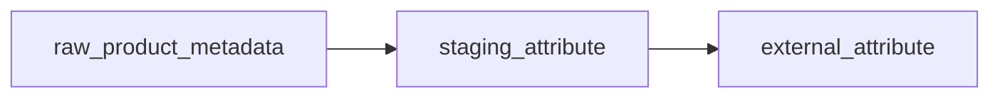

# External Attribute テーブル定義書

## 1. ドキュメント情報

| 項目           | 内容                             |
| -------------- | -------------------------------- |
| ドキュメントID | `DB-TBL-OPT-external_attribute`  |
| ドキュメント名 | External Attribute テーブル定義書 |
| 対象システム   | Gift Recommendation Service MVP  |
| MVP対象        | `optional（△）`                  |
| 作成日         | 2026-06-16                       |
| 更新日         | 2026-06-16（Human Review #575 反映） |

---

## 2. 概要

`external_attribute` は、楽天商品検索API・楽天ジャンル検索API・（任意）楽天属性検索API 由来の **属性参照マスタ** を内部正本として保持する Item系テーブルである。

保持する場合、商品の `attributeIds` シグナルを属性名・属性グループへ解決し、Feature 推定補助・Semantic 補助の候補情報として利用する。

**MVP では任意テーブル（△）** であり、物理ER §17 No.7 により **MVP DDL 作成対象 60 テーブルから除外** される。本定義書は採用判断・後続 DDL Task への引き継ぎ用として先行整備する。

**Public API では返却しない**（内部参照マスタ。Web / API 公開対象外）。

---

## 3. 目的

- 楽天属性ID・属性名・（任意）属性グループ・ジャンル文脈を DB 上で管理する
- `MOD-BATCH-031` External Attribute Updater による Upsert 正本として、属性辞書を提供する
- `item` の `attributeIds` シグナル（normalized_hash 入力）を将来マスタ参照で解決可能にする
- 後続 DDL Task が migration を作成できる粒度まで設計を確定する

---

## 4. テーブル基本情報

| 項目 | 内容 |
| ---- | ---- |
| 物理テーブル名 | `external_attribute` |
| 論理テーブル名 | External Attribute |
| 分類 | Item系 |
| 正本区分 | 外部参照 |
| 主な更新主体 | batch（`MOD-BATCH-031` / BATCH-005 反映フェーズ経由） |
| 主な参照主体 | batch（Feature 入力構築・属性解決）、reco（間接：item 経由） |
| MVP対象 | `optional（△）` — テーブル一覧 §5 補足 No.9。物理ER 上 MVP DDL は `no` |
| 関連物理ER | `docs/06_実装設計/database/物理ER.md` §8–§11・§17 No.7 |

---

## 5. 用途・責務

- 楽天 API レスポンスを Adapter で正規化した **属性参照データ** を保持する
- バッチ設計方針書 §8.2 どおり、ジャンルと同様 **マスタ / 参照データ** として **Upsert / 差分反映** 対象とする（ランキング Snapshot とは異なる）
- `staging_attribute` 経由で Upsert する（§5.2）
- 商品意味推定では、MVP では Feature へ強く反映せず **商品シグナルとして保持** する（外部商品データ連携設計書 §12.3）
- **履歴管理は行わない**。Batch Upsert により最新の属性定義を行単位で上書き保持する（`external_genre` と同型）

### 5.1 対象外

- 商品正本（`item` の責務）
- 商品×属性の中間テーブル（MVP では **作成しない**。§5.7 参照）
- Staging 中間データ（`staging_attribute` の責務。本体定義は別 Task）
- ジャンル階層（`external_genre` の責務）
- Public API 公開
- OpenAPI / generated 変更（Epic 終盤 Task #469 へ委譲）

### 5.2 `staging_attribute` → `external_attribute` Upsert 関係

| 観点 | 方針 |
| ---- | ---- |
| データフロー | `raw_product_metadata` → `staging_attribute`（BATCH-005 Staging 変換）→ `external_attribute`（属性反映） |
| 物理ER 関係 | `staging_attribute` → `external_attribute` : `upserts`（**LOGICAL**。Staging 系は物理 FK なし） |
| Upsert キー | **`source` + `external_genre_id` + `external_attribute_id`** |
| 更新列 | `attribute_name`, `attribute_group_name`, `fetched_at` |
| 冪等性 | 同一キーで INSERT ... ON CONFLICT UPDATE。Batch 再実行で同一結果 |
| 反映モジュール | `MOD-BATCH-031` External Attribute Updater（モジュール一覧） |
| 正本性 | **永続正本は `external_attribute`**。Staging 行は一時中間（`staging_attribute` 定義書は別 Task） |



> **注記**: `staging_attribute` の物理カラム・Retention は **別 Task** で定義する。本節は Upsert 関係とキー体系の参照方針を示す。

### 5.3 楽天API マッピング

| 入力経路（優先順） | 楽天API（正規化後） | 物理カラム | 備考 |
| ------------------ | ------------------- | ---------- | ---- |
| 1（MVP 優先） | 商品検索API `attributeIds[]` の ID | `external_attribute_id` | 商品シグナル。名称は別経路で補完 |
| 1 | 商品検索API `attributeFlag=1` 付帯属性 | `attribute_name` 等 | 外部商品データ連携設計書 §4.5.2「優先利用」 |
| 2 | ジャンル検索API `tagGroups` / `attributes` | `attribute_group_name`, `attribute_name` | §12.2 正規化 `external_attributes` |
| 3（任意） | 属性検索API レスポンス | 各列 | MVP 必須ではない（§4.5.2） |
| 共通 | `genreId` | `external_genre_id` | 属性はジャンル文脈でスコープ |
| — | — | `source` | MVP 固定 `rakuten` |
| — | — | `fetched_at` | 当該行の最終取得反映日時 |

### 5.4 正本モデル（履歴なし・最新状態 Upsert）

| 観点 | 方針 |
| ---- | ---- |
| 履歴管理 | **行わない**。属性名・グループの過去版を別行で保持しない |
| 更新方式 | Batch が `source` + `external_genre_id` + `external_attribute_id` 単位で Upsert |
| 正本性 | batch / reco は **最新 Upsert 結果** を属性参照の正本とする |
| 論理削除 | `is_active` 列は持たない（`external_genre` と同型） |
| MVP 採用 | テーブル未作成時は `attributeIds` を hash 入力のみで保持（`item_テーブル定義書` §12.3） |

### 5.5 `item` との参照・連携方針

`item_テーブル定義書` §12.3 / Human Review #495 §18.1 No.2 に従う。

| 観点 | 方針 |
| ---- | ---- |
| MVP `item` 列 | **`attributeIds` 列は持たない** |
| 商品シグナル | 楽天商品検索API `attributeIds` は **normalized_hash 入力** に含める |
| hash 変更 | `attributeIds` 変更は hash 変更 → 派生再生成キュー登録のトリガーになりうる |
| マスタ参照（採用時） | `(item.source, item.external_genre_id, attribute_id)` で `external_attribute` へ **LOGICAL JOIN** |
| 物理 FK | `item` → `external_attribute` の FK は **設けない**（配列シグナル。中間テーブルなし） |
| Feature 利用 | MVP では Feature へ強く反映しない。補助シグナルとして保持（§12.3） |

```text
楽天 item_search.attributeIds[]
  → normalized_hash 入力（MVP 常時）
  → （任意）external_attribute へ JOIN 解決
  → BATCH-010〜014 Feature / Semantic 入力の補助
```

### 5.6 外部商品データ連携設計書 §10.3 `item_attribute` 表記の整理

| 資料上の名称 | 物理テーブル正本 | 扱い |
| ------------ | ---------------- | ---- |
| `item_attribute`（§10.3 / 処理構成定義書） | **`external_attribute`**（属性マスタ） | 本定義書で物理名を **`external_attribute`** に統一 |
| `staging_item_attribute`（処理構成定義書） | **`staging_attribute`** | Staging 中間。別 Task で定義 |
| 商品×属性中間 | **MVP では未作成** | `attributeIds` は hash シグナルのみ。将来必要なら別 Task |

> **正本**: テーブル一覧 §5 No.14 / §6 No.24 の `external_attribute` / `staging_attribute` を物理名の正とする。外部商品データ連携設計書 §10.3 の `item_attribute` は **概念上の反映先** を示す旧称であり、MVP では独立テーブル `item_attribute` は作成しない。

### 5.7 論理ER との差分整理

論理ER に `external_attribute` 詳細属性が未掲載のため、本定義書は **テーブル一覧 §5 No.14**・**外部商品データ連携設計書 §12.3**・**正本定義表** を正として物理化する。

| 論点 | 本テーブル | 備考 |
| ---- | ---------- | ---- |
| エンティティ名 | External Attribute | テーブル一覧と一致 |
| 自然キー | `source` + `external_genre_id` + `external_attribute_id` | 楽天属性はジャンル文脈でスコープ |
| 状態カラム | なし | Upsert 正本モデル |

---

## 6. カラム定義

| No | カラム名 | 論理名 | 型 | 必須 | PK | FK | Unique | Default | 説明 |
| --: | -------- | ------ | -- | ---- | -- | -- | ------ | ------- | ---- |
| 1 | `source` | Data Source | `text` | `yes` | `yes` | — | — | `'rakuten'` | 外部商品データ元。MVP は `rakuten` 固定 |
| 2 | `external_genre_id` | External Genre ID | `bigint` | `yes` | `yes` | LOGICAL | — | — | 属性が属するジャンル文脈。`external_genre.external_genre_id` 参照 |
| 3 | `external_attribute_id` | External Attribute ID | `bigint` | `yes` | `yes` | — | — | — | 楽天属性ID（外部自然キー） |
| 4 | `attribute_name` | Attribute Name | `varchar(255)` | `yes` | — | — | — | — | 属性表示名。API 正規化後の名称正本 |
| 5 | `attribute_group_name` | Attribute Group Name | `varchar(255)` | `no` | — | — | — | `NULL` | 属性グループ名。ジャンルAPI `tagGroups` 正規化時に設定 |
| 6 | `fetched_at` | Fetched At | `timestamptz` | `yes` | — | — | — | — | 当該行の最終取得・反映日時（UTC） |

---

## 7. 主キー・一意キー

| 種別 | 対象カラム | 方針 | 備考 |
| ---- | ---------- | ---- | ---- |
| PRIMARY KEY | `source`, `external_genre_id`, `external_attribute_id` | 楽天属性はジャンル文脈付き自然キー | `external_genre` の単一 bigint PK とは異なり複合 PK |
| UNIQUE | （PK と同一） | Upsert キー | `ON CONFLICT (source, external_genre_id, external_attribute_id)` |

---

## 8. 外部キー・参照関係

### 8.1 Outgoing

| カラム | 参照先 | FK制約 | 参照整合性 | 備考 |
| ------ | ------ | ------ | ---------- | ---- |
| `external_genre_id` | `external_genre.external_genre_id` | `LOGICAL` | 参照時存在確認は Batch 責務 | Human Review #575 §17.1 No.2 決定済み（物理 FK OFF） |

### 8.2 被参照（論理）

| 参照元 | 参照列 / シグナル | 関係 | FK制約 | 備考 |
| ------ | ----------------- | ---- | ------ | ---- |
| `item` | `attributeIds`（hash 入力）+ `external_genre_id` | resolves | `LOGICAL` | 配列シグナル。`item` 列なし（§5.5） |
| `staging_attribute` | Upsert キー列 | upserts | `LOGICAL` | Staging 系物理 FK なし |

---

## 9. Index

| Index名 | 対象カラム | 種別 | 用途 | 備考 |
| ------- | ---------- | ---- | ---- | ---- |
| `external_attribute_pkey` | `source`, `external_genre_id`, `external_attribute_id` | btree（PK） | 主キー | 自動生成 |
| `idx_external_attribute_genre` | `external_genre_id` | btree | ジャンル単位の属性一覧 | Batch / Feature 入力 |
| `idx_external_attribute_name` | `attribute_name` | btree | 名称検索・補助 | 分析・デバッグ用 |

---

## 10. 制約

| 制約名 | 種別 | 対象 | 内容 | 備考 |
| ------ | ---- | ---- | ---- | ---- |
| `external_attribute_pkey` | PRIMARY KEY | `source`, `external_genre_id`, `external_attribute_id` | 複合主キー | — |
| `chk_external_attribute_source_mvp` | CHECK | `source` | `source = 'rakuten'` | MVP 固定 |
| `chk_external_attribute_name_length` | CHECK | `attribute_name` | `char_length(attribute_name) BETWEEN 1 AND 255` | — |
| `chk_external_attribute_group_length` | CHECK | `attribute_group_name` | `attribute_group_name IS NULL OR char_length(attribute_group_name) BETWEEN 1 AND 255` | — |
| `chk_external_attribute_id_positive` | CHECK | `external_attribute_id` | `external_attribute_id > 0` | 楽天属性IDは正の整数 |

---

## 11. 状態・enum

| カラム | enum / code | 定義元 | 許容値 | 備考 |
| ------ | ----------- | ------ | ------ | ---- |
| `source` | （code 未定義） | `item.source` / `external_genre.source` 慣行 | MVP: `rakuten` | enum定義書には未 YAML 化。CHECK で MVP 固定 |
| — | — | — | — | 状態カラムなし |

---

## 12. 更新仕様

| 操作 | 実行主体 | 条件 | 更新項目 | 冪等性 | 備考 |
| ---- | -------- | ---- | -------- | ------ | ---- |
| UPSERT | batch（`MOD-BATCH-031`） | `source` + `external_genre_id` + `external_attribute_id` 一致 | `attribute_name`, `attribute_group_name`, `fetched_at` | キー単位 Upsert | バッチ設計方針書 §8.2「属性: upsert / 差分反映」 |
| SELECT | batch | 属性解決・Feature 入力 | — | — | `item.external_genre_id` + `attributeIds` と組み合わせ |
| SELECT | reco | 間接（item 経由） | — | — | MVP では弱利用 |
| DELETE | — | MVP では原則禁止 | — | — | 未使用属性は行を残し Batch 側で参照しない |

### 12.1 Upsert 疑似コード

```sql
INSERT INTO external_attribute (
  source, external_genre_id, external_attribute_id,
  attribute_name, attribute_group_name, fetched_at
) VALUES (...)
ON CONFLICT (source, external_genre_id, external_attribute_id) DO UPDATE SET
  attribute_name = EXCLUDED.attribute_name,
  attribute_group_name = EXCLUDED.attribute_group_name,
  fetched_at = EXCLUDED.fetched_at;
```

### 12.2 入力 API 優先順位（MVP）

外部商品データ連携設計書 §4.5.2 に従う。**Human Review #575 §17.1 No.3 決定済み**。

| 優先 | 入力 | 用途 | MVP |
| --: | ---- | ---- | --- |
| 1 | 楽天商品検索API `attributeFlag=1` / `attributeIds` | 商品シグナルと名称補完 | **採用** |
| 2 | 楽天ジャンル検索API `tagGroups` / `attributes` | ジャンル別属性辞書の補完 | 採用（補完） |
| 3 | 楽天属性検索API | 属性辞書拡張 | **不採用**（後続または余力時） |

---

## 13. データ保持・削除

| 観点 | 方針 |
| ---- | ---- |
| 保持期間 | 長期（外部参照マスタ。採用時） |
| 削除方式 | 物理 DELETE 原則禁止 |
| 削除条件 | — |
| 論理削除 | `is_active` 列なし。最新状態 Upsert 正本モデル（§5.4） |
| 履歴 | 保持しない |
| アーカイブ | MVP 対象外 |

---

## 14. Migration / DDL

| 項目 | 内容 |
| ---- | ---- |
| DDL対象 | `external_attribute` |
| **MVP DDL** | **`no`** — 物理ER §17 No.7。MVP 60 テーブルに含めない |
| migration単位 | 1 テーブル = 1 migration（DDL Task。採用時） |
| 適用順序 | `external_genre` の **後**（`external_genre_id` LOGICAL 参照） |
| rollback方針 | forward migration 主体。DROP は Human Review 必須 |
| 破壊的変更有無 | `no`（初回 CREATE 時） |

> **Human Review #575 §17.1 No.1 決定済み**: MVP migration には **本テーブルを含めない**。本定義書は設計正本として先行整備し、物理 DDL 採用時に Task ④⑤ で migration を作成する。

---

## 15. セキュリティ・権限

| 観点 | 方針 |
| ---- | ---- |
| 読み取り権限 | batch（service role 経由） |
| 書き込み権限 | batch のみ。Online / reco 実行中の DML 更新なし |
| service role利用 | `MOD-BATCH-031` の Upsert に限定 |
| 個人情報・機微情報 | 含まない |
| ログ出力制限 | 属性名を error ログに過剰出力しない |

---

## 16. テスト観点

| No | 観点 | 確認内容 | 種別 |
| --: | ---- | -------- | ---- |
| 1 | DDL適用 | CREATE TABLE / Index / CHECK が定義どおり（採用時） | migration |
| 2 | Upsert 冪等 | 同一複合キーで再実行しても 1 行 | integration |
| 3 | ジャンル整合 | 存在しない `external_genre_id` 参照時の Batch 扱い | manual |
| 4 | item 連携 | `attributeIds` + `external_genre_id` で名称解決できる | manual |
| 5 | MVP 非作成 | MVP migration に本テーブルが含まれない | manual |
| 6 | 権限 | web client から Direct DB アクセス不可 | manual |

---

## 17. 未決事項

| No | 論点 | 判断が必要な理由 | 判断者 | 期限 | 備考 |
| --: | ---- | ---------------- | ------ | ---- | ---- |
| — | — | — | — | — | Human Review #575 にて No.1〜4 を決定済み（下記参照） |

### 17.1 Human Review 決定事項（Issue #575）

| No | 論点 | 決定内容 | 決定者 | 備考 |
| --: | ---- | -------- | ------ | ---- |
| 1 | MVP DDL 作成 | **MVP では作成しない**（物理ER §17 No.7 整合） | Human | 定義書のみ先行。採用時に Task ④⑤ |
| 2 | `external_genre_id` 物理 FK | **LOGICAL**（物理 FK OFF） | Human | Staging / MVP 任意テーブルと同型。採用時に ON を再検討可 |
| 3 | 楽天属性検索API MVP 採用 | **不採用**。商品検索API `attributeFlag` / `attributeIds` を優先 | Human | 外部商品データ連携設計書 §4.5.2 正本 |
| 4 | 商品×属性中間テーブル（`item_attribute`） | **MVP 不作成**。`attributeIds` は normalized_hash シグナルのみ | Human | §5.5・§5.6 |

---

## 18. 関連資料

| 種別 | パス / URL | 用途 |
| ---- | ---------- | ---- |
| 物理ER | `docs/06_実装設計/database/物理ER.md` | §17 No.7 MVP 対象外 |
| 論理ER | `docs/05_アプリケーション設計/アプリ/database/論理ER.md` | 商品系・外部連携系 |
| テーブル一覧 | `docs/05_アプリケーション設計/アプリ/database/テーブル一覧.md` | §5 No.14・§5 補足 No.9・§6 No.24 |
| 正本定義表 | `docs/05_アプリケーション設計/アプリ/database/正本定義表.md` | External Attribute 正本区分 |
| 外部商品データ連携 | `docs/05_アプリケーション設計/アプリ/外部商品データ連携設計書.md` | §4.5 / §6.4 / §10.3 / §12.2–§12.3 |
| バッチ設計方針書 | `docs/05_アプリケーション設計/アプリ/batch/バッチ設計方針書.md` | §8.2 属性 Upsert 方針 |
| モジュール一覧 | `docs/05_アプリケーション設計/アプリ/モジュール一覧.md` | MOD-BATCH-031 |
| item 定義書 | `docs/06_実装設計/database/item_テーブル定義書.md` | §12.3 attributeIds |
| staging_item 定義書 | `docs/06_実装設計/database/staging_item_テーブル定義書.md` | Staging 系章構成参考 |
| external_genre 定義書 | `docs/06_実装設計/database/external_genre_テーブル定義書.md` | 外部参照マスタ参考 |

---

## 19. レビュー観点

- テーブル一覧 §5 No.14・§5 補足 No.9（MVP任意）と矛盾していない
- 物理ER §17 No.7（MVP DDL 対象外）が §4・§14 で明記されている
- `item`（`attributeIds` シグナル）との参照関係が §5.5 に整理されている
- `staging_attribute` → `external_attribute` Upsert 関係が §5.2 に整理されている
- 外部商品データ連携設計書 §10.3 `item_attribute` 表記が §5.6 で解消されている
- `MOD-BATCH-031` との入出力整合が §5.2・§12 に記載されている
- DDL Task が CREATE TABLE を起こせる粒度である（採用時）
- secret や `.env` 実値が含まれていない
