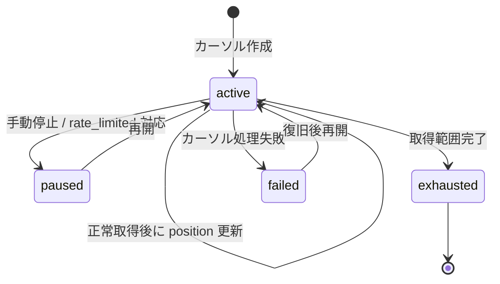

# Fetch Cursor テーブル定義書

## 1. ドキュメント情報

| 項目           | 内容                            |
| -------------- | ------------------------------- |
| ドキュメントID | `DB-TBL-MVP-fetch_cursor`       |
| ドキュメント名 | Fetch Cursor テーブル定義書       |
| 対象システム   | Gift Recommendation Service MVP |
| MVP対象        | `yes`                           |
| 作成日         | 2026-06-12                      |
| 更新日         | 2026-06-12（Human Review #505 反映） |

---

## 2. 概要

`fetch_cursor` は、楽天商品検索API（BATCH-003 / BATCH-004）における **疑似差分取得の走査状態** を batch が管理する外部商品データ連携系テーブルである。

楽天市場APIでは完全な更新日時ベースの差分取得ができない前提のため、取得条件単位（ジャンル・キーワード・更新順ソート・ランキング補完候補・既存商品再確認など）ごとに **カーソル位置** と **状態（`cursor_status`）** を保持し、次回 Batch 実行時の走査継続点とする。

`fetch_cursor` → `api_call_log` → `raw_product_metadata` の連携の起点となり、Public API では返却しない（内部 Batch 制御データ）。

---

## 3. 目的

- 疑似差分取得（論理ER §9.3・バッチ設計方針書 §11.1）の走査条件と進捗位置を DB 上で管理する
- `cursor_status` により active / paused / exhausted / failed を表現し、状態遷移設計書 §6.4 と整合させる
- `api_call_log` との 1:N 関係（controls）を整理し、外部 API 呼び出し単位の追跡を可能にする
- 後続 DDL Task が migration を作成できる粒度まで設計を確定する

---

## 4. テーブル基本情報

| 項目 | 内容 |
| ---- | ---- |
| 物理テーブル名 | `fetch_cursor` |
| 論理テーブル名 | Fetch Cursor |
| 分類 | 外部商品データ連携系 |
| 正本区分 | 状態 / 管理情報 |
| 主な更新主体 | batch（BATCH-003 / BATCH-004・`MOD-BATCH-002` Fetch Cursor Manager） |
| 主な参照主体 | batch（Product Fetch Planner / Rakuten Item Search API Client） |
| MVP対象 | `yes` |
| 関連物理ER | `docs/06_実装設計/database/物理ER.md` §8–§11 |

---

## 5. 用途・責務

- **取得条件単位** の走査状態を保持する（状態遷移設計書：取得条件単位で `cursor_status` を管理）
- BATCH-003（楽天商品疑似差分取得）の入力として、ジャンル別・キーワード・更新順・ランキング補完候補の走査位置を記録する
- BATCH-004（楽天既存商品再確認）の入力として、再確認対象の走査カーソルを記録する
- 正常取得後に `cursor_value` / `last_fetched_at` を更新し、走査を継続する（`active` 維持または `exhausted` 遷移）
- レート制限・手動停止時に `paused`、処理失敗時に `failed` へ遷移する
- **履歴管理は行わない**。同一取得条件に対しては **最新の走査状態を 1 行で上書き保持** する（Snapshot 系・Log 系とは異なる状態正本）

### 5.1 対象外

- 外部 API 呼び出しログ本体（`api_call_log` の責務。本テーブルでは関係整理のみ）
- Raw Metadata / Object Storage 参照（`raw_product_metadata` / Raw JSON の責務）
- 差分判定結果（`product_diff_result` の責務）
- Staging / Item 正本（`staging_item` / `item` の責務）
- Public API 公開

### 5.2 `fetch_cursor` → `api_call_log` → `raw_product_metadata` 関係

論理ER §9.3・物理ER §9 に従い、疑似差分取得の論理フローは以下とする。

| 観点 | 方針 |
| ---- | ---- |
| データフロー | `fetch_cursor`（走査条件・位置）→ `api_call_log`（外部 API 1 呼び出し単位）→ `raw_product_metadata`（Raw JSON 参照・取込状態） |
| 物理ER 関係 | `fetch_cursor` → `api_call_log` : `controls`（**LOGICAL** FK。Batch / Log 系は物理 FK なし） |
| カーディナリティ | 1 カーソル : N API 呼び出し（同一走査条件で複数ページ・再試行があり得る） |
| `api_call_log.fetch_cursor_id` | nullable。カーソル非経由の API 呼び出し（例: 一部ジャンル同期）は `NULL` 可 |
| 後続 | `api_call_log` 本体のカラム定義は **別 Task**（out_of_scope）。本定義書では参照関係のみ確定 |


### 5.3 `api_call_log.call_status` との連動方針

| 観点 | 方針 |
| ---- | ---- |
| 責務分離 | `call_status` は **API 呼び出し単位** の終端結果。`cursor_status` は **走査条件単位** の継続可否 |
| `rate_limited` | `api_call_log.call_status = rate_limited` 終端時、Fetch Cursor Manager は **同一 Batch 処理内で `cursor_status = paused` へ遷移する（MVP 必須）** | 状態遷移設計書 §11.2・GRS-EXT-102・バッチ設計方針書 §15 |
| 自動連動 | MVP では **DB トリガーは使わない**。Batch アプリ（`MOD-BATCH-002`）が `api_call_log` 記録直後に `fetch_cursor` を UPDATE する |
| `failed` | API 呼び出し失敗が走査継続不能な場合、`cursor_status = failed` を設定可能。個別 `api_call_log.failed` だけではカーソルは `active` のまま再試行可能な場合あり（§12） |
| 再開 | `failed` / `paused` から原因解消後に `active` へ戻して再開可能（状態遷移設計書 §6.4.2・§11.3） |

### 5.4 `cursor_type` / `cursor_value` の役割（MVP）

論理ER §9.2 の属性に従い、取得条件の **種別** と **走査位置** を分離して保持する。

| カラム | 役割 |
| ------ | ---- |
| `cursor_type` | 走査戦略の種別（例: ジャンル別ページング、キーワード検索、更新順ソート、ランキング補完、既存商品再確認） |
| `target_external_genre_id` | ジャンル起点の走査時の対象ジャンル（`external_genre.external_genre_id` への LOGICAL 参照）。非ジャンル走査時は `NULL` |
| `cursor_value` | 走査位置およびスコープ補助情報を格納する **JSON 文字列**（`jsonb` 相当。物理型は §6 参照） |
| `last_fetched_at` | 当該カーソルで最後に外部 API 取得に成功した日時（UTC） |

**`cursor_value` JSON 構造（MVP 案）**:

```json
{
  "scope": {
    "keyword": "ギフト",
    "sort": "-updateTimestamp",
    "external_item_code": "shop:item123"
  },
  "position": {
    "page": 3,
    "hits_per_page": 30
  }
}
```

| `cursor_type`（MVP） | 意味 | `target_external_genre_id` | `scope` 例 |
| -------------------- | ---- | -------------------------- | ---------- |
| `genre` | ジャンル別商品検索のページ走査 | 必須（bigint） | `{"sort":"-updateTimestamp"}` |
| `keyword` | キーワード検索のページ走査 | `NULL` | `{"keyword":"..."}` |
| `update_sort` | 更新順ソートによる棚卸し走査 | `NULL` または任意ジャンル | `{"sort":"-updateTimestamp"}` |
| `ranking_supplement` | BATCH-002 未登録 itemCode 補完候補の走査 | 任意 | `{"supplement_batch_run_id":"..."}` |
| `recheck` | 既存商品再確認（BATCH-004） | `NULL` | `{"external_item_code":"shop:123456"}`。**1 商品 = 1 カーソル**（§17.1 No.4） |

> `cursor_type` は `fetch_cursor_type` enum（enum定義書 §6.23 / `packages/code-definitions/batch/fetch_cursor_type.yaml`）を正とする。

### 5.5 `external_genre` との参照

| 観点 | 方針 |
| ---- | ---- |
| 参照列 | `target_external_genre_id` → `external_genre.external_genre_id` |
| FK制約 | **LOGICAL**（`external_genre_テーブル定義書` §8.2・物理ER §9） |
| 型 | `bigint`（`external_genre` PK と同一） |
| BATCH-003 | `fetch_plan` / 対象ジャンルから `target_external_genre_id` を解決し、ジャンル別カーソルを選択または作成 |

---

## 6. カラム定義

| No | カラム名 | 論理名 | 型 | 必須 | PK | FK | Unique | Default | 説明 |
| --: | -------- | ------ | -- | ---- | -- | -- | ------ | ------- | ---- |
| 1 | `fetch_cursor_id` | Fetch Cursor ID | `uuid` | `yes` | `yes` | — | `yes` | `gen_random_uuid()` | カーソル行 ID。`api_call_log.fetch_cursor_id` の参照元 |
| 2 | `source` | Data Source | `text` | `yes` | — | — | — | `'rakuten'` | 外部商品データ元。`item.source` / `external_genre.source` と同一コード体系 |
| 3 | `source_api` | Source API | `varchar(32)` | `yes` | — | — | — | `'item_search'` | 走査に用いる外部 API 識別子。BATCH-003 / BATCH-004 は MVP で `item_search` 固定 |
| 4 | `target_external_genre_id` | Target External Genre ID | `bigint` | `no` | — | LOGICAL | — | `NULL` | ジャンル起点走査の対象。`external_genre.external_genre_id` 参照 |
| 5 | `cursor_type` | Cursor Type | `varchar(32)` | `yes` | — | — | — | — | 走査戦略種別（§5.4） |
| 6 | `cursor_value` | Cursor Value | `jsonb` | `yes` | — | — | — | `'{}'` | スコープ（`scope`）と走査位置（`position`）の JSON |
| 7 | `last_fetched_at` | Last Fetched At | `timestamptz` | `no` | — | — | — | `NULL` | 最終成功取得日時。未走査作成時は `NULL` |
| 8 | `cursor_status` | Cursor Status | `varchar(32)` | `yes` | — | — | — | `'active'` | カーソル状態。`fetch_cursor_status` enum 準拠 |
| 9 | `created_at` | Created At | `timestamptz` | `yes` | — | — | — | `now()` | 行作成日時（物理ER §5 timestamp 方針） |
| 10 | `updated_at` | Updated At | `timestamptz` | `yes` | — | — | — | `now()` | 行最終更新日時 |
| 11 | `cursor_scope_fingerprint` | Cursor Scope Fingerprint | `text` | `yes` | — | — | — | generated | `scope` 単位の Upsert 自然キー（§7.1）。`position` は含めない |

> **論理ER §9.2 との差分**: 論理ERは `cursor_value` の型を明示しない。物理 DDL では検索・バリデーションのため **`jsonb`** を採用する。`created_at` / `updated_at` / `cursor_scope_fingerprint` は物理ER §5 の共通方針・Upsert キー要件に従い追加する。

---

## 7. 主キー・一意キー

| 種別 | 対象カラム | 方針 | 備考 |
| ---- | ---------- | ---- | ---- |
| PRIMARY KEY | `fetch_cursor_id` | サロゲート UUID | `api_call_log` からの LOGICAL 参照先 |
| UNIQUE | `source`, `source_api`, `cursor_type`, `target_external_genre_id`, `cursor_scope_fingerprint` | 同一走査条件の重複行を防止 | Human Review #505 確定（§17.1 No.1） |

### 7.1 `cursor_scope_fingerprint`（stored generated column）

`target_external_genre_id` だけではキーワード走査などを一意に識別できないため、MVP では **stored generated column を採用** する（Human Review #505 確定）。

| 項目 | 内容 |
| ---- | ---- |
| 列名 | `cursor_scope_fingerprint` |
| 型 | `text` |
| 生成式 | `md5(coalesce(target_external_genre_id::text, '') \|\| cursor_type \|\| coalesce(cursor_value->'scope'::text, ''))` |
| 用途 | Upsert 自然キーの一部。`position` は含めない（ページ更新で fingerprint が変わらない） |
| 採用理由 | DB 一意制約で並行 Batch の二重 INSERT を防止。アプリのみ get-or-create より整合性が高い |

---

## 8. 外部キー・参照関係

### 8.1 参照先（論理）

| カラム | 参照先 | FK制約 | 参照整合性 | 備考 |
| ------ | ------ | ------ | ---------- | ---- |
| `target_external_genre_id` | `external_genre.external_genre_id` | `LOGICAL` | アプリ / Batch で存在確認 | `external_genre_テーブル定義書` §8.2 |

### 8.2 被参照（論理）

| 参照元 | 参照列 | 関係 | FK制約 | 備考 |
| ------ | ------ | ---- | ------ | ---- |
| `api_call_log` | `fetch_cursor_id` | controls | `LOGICAL` | 物理ER §9。`api_call_log` 定義書は別 Task |

---

## 9. Index

| Index名 | 対象カラム | 種別 | 用途 | 備考 |
| ------- | ---------- | ---- | ---- | ---- |
| `fetch_cursor_pkey` | `fetch_cursor_id` | btree（PK） | 主キー | 自動生成 |
| `uq_fetch_cursor_scope` | `source`, `source_api`, `cursor_type`, `target_external_genre_id`, `cursor_scope_fingerprint` | unique | Upsert / get-or-create | §7.1 確定 |
| `idx_fetch_cursor_status` | `cursor_status`, `updated_at` | btree | active カーソル抽出・監視 | 物理ER §5 Index 方針（`*_status`） |
| `idx_fetch_cursor_genre` | `target_external_genre_id` | btree | ジャンル別カーソル一覧 | BATCH-003 計画用 |
| `idx_fetch_cursor_source_api` | `source`, `source_api`, `cursor_type` | btree | 走査種別ごとの一覧 | Product Fetch Planner |

---

## 10. 制約

| 制約名 | 種別 | 対象 | 内容 | 備考 |
| ------ | ---- | ---- | ---- | ---- |
| `fetch_cursor_pkey` | PRIMARY KEY | `fetch_cursor_id` | 主キー | — |
| `chk_fetch_cursor_source_mvp` | CHECK | `source` | `source = 'rakuten'` | MVP 固定 |
| `chk_fetch_cursor_source_api_mvp` | CHECK | `source_api` | `source_api = 'item_search'` | BATCH-003 / 004 MVP 固定 |
| `chk_fetch_cursor_type` | CHECK | `cursor_type` | `fetch_cursor_type` 許容値 | enum定義書 §6.23 |
| `chk_fetch_cursor_status` | CHECK | `cursor_status` | `fetch_cursor_status` 許容値 | enum定義書 §6.8 と一致 |
| `chk_fetch_cursor_genre_requires_target` | CHECK | `target_external_genre_id` | `cursor_type <> 'genre' OR target_external_genre_id IS NOT NULL` | ジャンル走査の整合 |

---

## 11. 状態・enum

| カラム | enum / code | 定義元 | 許容値 | 備考 |
| ------ | ----------- | ------ | ------ | ---- |
| `cursor_status` | `fetch_cursor_status` | `enum定義書.md` §6.8 / `packages/code-definitions/state/fetch_cursor_status.yaml` | `active`, `paused`, `exhausted`, `failed` | NOT NULL |
| `source` | （code 未定義） | `item.source` 慣行 | MVP: `rakuten` | CHECK で固定 |
| `source_api` | （code 未定義） | 外部商品データ連携設計書 §8.4 | MVP: `item_search` | BATCH-003 / 004 |
| `cursor_type` | `fetch_cursor_type` | `enum定義書.md` §6.23 / `packages/code-definitions/batch/fetch_cursor_type.yaml` | `genre`, `keyword`, `update_sort`, `ranking_supplement`, `recheck` | NOT NULL |

### 11.1 `cursor_status` 状態遷移

状態遷移設計書 §6.4 を正とする。

| 状態 | 意味 | 終端 |
| ---- | ---- | ---- |
| `active` | 取得対象として有効 | × |
| `paused` | 一時停止中（手動停止 / レート制限対応） | × |
| `exhausted` | 取得範囲を一通り走査済み | ○ |
| `failed` | カーソル更新や取得処理に失敗 | ○ |



---

## 12. 更新仕様

| 操作 | 実行主体 | 条件 | 更新項目 | 冪等性 | 備考 |
| ---- | -------- | ---- | -------- | ------ | ---- |
| INSERT | batch | 新規走査条件の初回登録 | 全列（`cursor_status=active`） | 自然キー重複時は get-or-create | Product Fetch Planner |
| SELECT | batch | `cursor_status IN ('active','paused')` 等 | — | — | IF-DB-BATCH-003 |
| UPDATE | batch | 正常取得後 | `cursor_value.position`, `last_fetched_at`, `updated_at` | 同一 `fetch_cursor_id` で上書き | `active` 維持 |
| UPDATE | batch | 走査範囲完了 | `cursor_status=exhausted`, `updated_at` | — | 次回 Batch はスキップ可 |
| UPDATE | batch | `api_call_log.call_status = rate_limited` | `cursor_status=paused` | — | **MVP 必須**（§5.3・§17.1 No.3） |
| UPDATE | batch | 復旧・再開 | `cursor_status=active` | — | `paused` / `failed` から |
| UPDATE | batch | 継続不能エラー | `cursor_status=failed` | — | GRS-BAT-006 等 |
| DELETE | — | MVP では原則禁止 | — | — | 状態は `exhausted` / `failed` で終端管理 |

### 12.1 排他・多重起動

バッチ設計方針書 §18.1 に従い、**同一 `fetch_cursor_id` に対する running 中の二重起動** は拒否または skip する。実装は Batch アプリ層（`GRS-BAT-003`）。

### 12.2 Upsert 疑似コード（get-or-create）

```sql
-- 1) 走査条件で既存行を取得（cursor_scope_fingerprint 採用時）
SELECT fetch_cursor_id, cursor_value, cursor_status
FROM fetch_cursor
WHERE source = 'rakuten'
  AND source_api = 'item_search'
  AND cursor_type = 'genre'
  AND target_external_genre_id = :genre_id
  AND cursor_scope_fingerprint = :fingerprint;

-- 2) なければ INSERT（cursor_status = 'active'）
-- 3) API 呼び出し後 api_call_log INSERT（fetch_cursor_id を設定）
-- 4) 成功時 cursor_value.position / last_fetched_at を UPDATE
```

---

## 13. データ保持・削除

| 観点 | 方針 |
| ---- | ---- |
| 保持期間 | 長期（走査計画の再開のため） |
| 削除方式 | 物理 DELETE 原則禁止 |
| 削除条件 | — |
| 論理削除 | `cursor_status` で終端（`exhausted` / `failed`）を表現 |
| 履歴 | `api_call_log` / `raw_product_metadata` 側で呼び出し・取込履歴を追跡 |
| アーカイブ | MVP 対象外 |

---

## 14. Migration / DDL

| 項目 | 内容 |
| ---- | ---- |
| DDL対象 | `fetch_cursor` |
| migration単位 | 1 テーブル = 1 migration（DDL Task） |
| 適用順序 | 外部商品データ連携系。`external_genre` **後**（`target_external_genre_id` LOGICAL 参照のため先行推奨）。`api_call_log` より **前または並行**（LOGICAL FK のため厳密順序不要） |
| rollback方針 | forward migration 主体。DROP は Human Review 必須 |
| 破壊的変更有無 | `no`（初回 CREATE） |

---

## 15. セキュリティ・権限

| 観点 | 方針 |
| ---- | ---- |
| 読み取り権限 | batch（service role 経由）のみ |
| 書き込み権限 | batch のみ。Online / reco / web からの DML 禁止（認証・認可方針書） |
| service role利用 | BATCH-003 / BATCH-004 の Fetch Cursor Manager に限定 |
| 個人情報・機微情報 | 含まない。`cursor_value` に API キーを格納しない |
| ログ出力制限 | `cursor_value` 全文を error ログに過剰出力しない |

---

## 16. テスト観点

| No | 観点 | 確認内容 | 種別 |
| --: | ---- | -------- | ---- |
| 1 | DDL適用 | CREATE TABLE / Index / CHECK が定義どおり | migration |
| 2 | enum整合 | `cursor_status` が `fetch_cursor_status` の 4 値のみ | migration |
| 3 | 状態遷移 | `active`→`paused`→`active`、`active`→`exhausted` がアプリで再現可能 | integration |
| 4 | api_call_log 連携 | `api_call_log.fetch_cursor_id` が設定され trace 可能 | integration |
| 5 | rate_limited 連動 | `rate_limited` 後に同一処理内で `paused` へ遷移する | integration |
| 6 | 排他 | 同一カーソル running 二重起動が拒否される | manual |
| 7 | 権限 | web client から Direct DB アクセス不可 | manual |

---

## 17. 未決事項

| No | 論点 | 判断が必要な理由 | 判断者 | 期限 | 備考 |
| --: | ---- | ---------------- | ------ | ---- | ---- |
| — | — | — | — | — | Human Review #505 にて No.1〜4 を決定済み（下記参照） |

### 17.1 Human Review 決定事項（Issue #505）

| No | 論点 | 決定内容 | 決定者 | 備考 |
| --: | ---- | -------- | ------ | ---- |
| 1 | `cursor_scope_fingerprint` generated column の採用 | **採用**（stored generated column）。Upsert 自然キーに含める | Human | §7.1。`position` 除外でページ更新と両立 |
| 2 | `cursor_type` の enum YAML 化 | **実施**。`fetch_cursor_type` を `packages/code-definitions/batch/fetch_cursor_type.yaml` に追加し enum定義書 §6.23 に反映 | Human | 本 Issue 内で対応済み |
| 3 | `rate_limited` → `paused` の自動連動 | **MVP 必須**。DB トリガーは使わず Batch アプリが `api_call_log` 記録直後に `paused` へ UPDATE | Human | §5.3。次回実行での API 再試行暴走を防止 |
| 4 | `recheck` 走査の `cursor_value.scope` 形式 | **1 商品（`external_item_code`）= 1 カーソル**。`scope.external_item_code` のみ必須。バッチ単位キューは MVP では持たない | Human | BATCH-004 は item 単位 API 呼び出しと整合 |

**`recheck` の `cursor_value` 例（確定）**:

```json
{
  "scope": {
    "external_item_code": "shop:123456"
  },
  "position": {
    "page": 1
  }
}
```

- 正常取得後は `exhausted` へ遷移（1 商品 1 回の再確認が基本）
- 同一 `external_item_code` の再実行は同一 fingerprint で get-or-create

---

## 18. 関連資料

| 種別 | パス / URL | 用途 |
| ---- | ---------- | ---- |
| 物理ER | `docs/06_実装設計/database/物理ER.md` | 外部商品データ連携系・LOGICAL FK |
| 論理ER | `docs/05_アプリケーション設計/アプリ/database/論理ER.md` | §9.2 / §9.3 |
| テーブル一覧 | `docs/05_アプリケーション設計/アプリ/database/テーブル一覧.md` | §6 No.17 |
| enum定義書 | `docs/06_実装設計/database/enum定義書.md` | §6.8 fetch_cursor_status・§6.23 fetch_cursor_type |
| 状態遷移設計書 | `docs/05_アプリケーション設計/アプリ/状態遷移設計書.md` | §6.4 / §11.2 / §11.3 |
| 外部商品データ連携 | `docs/05_アプリケーション設計/アプリ/外部商品データ連携設計書.md` | 疑似差分・Raw 経路 |
| バッチ設計方針書 | `docs/05_アプリケーション設計/アプリ/batch/バッチ設計方針書.md` | §11.1 / §18.1 |
| インターフェース一覧 | `docs/05_アプリケーション設計/アプリ/インターフェース一覧.md` | IF-DB-BATCH-003 |
| external_genre 定義書 | `docs/06_実装設計/database/external_genre_テーブル定義書.md` | §8.2 被参照 |
| ログ・Observability | `docs/05_アプリケーション設計/アプリ/ログ・Observability設計書.md` | §14 api_call_log |

---

## 19. レビュー観点

- 論理ER §9.2・物理ER 外部商品データ連携系・テーブル一覧 §6 No.17 と矛盾していない
- `cursor_status` 状態遷移が状態遷移設計書 §6.4・enum定義書 §6.8 と一致している
- `fetch_cursor` → `api_call_log` の 1:N controls（LOGICAL）と `rate_limited` → `paused` 検討方針が §5.2 / §5.3 に明記されている
- `target_external_genre_id` の LOGICAL 参照が `external_genre_テーブル定義書` §8.2 と整合している
- `api_call_log` / `raw_product_metadata` 本体定義を本 Task に混入していない
- DDL Task が CREATE TABLE を起こせる粒度である
- secret や `.env` 実値が含まれていない
