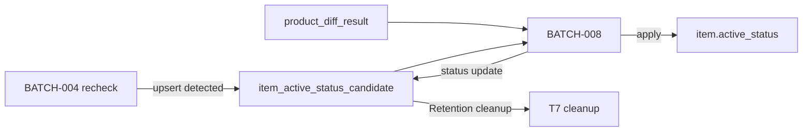
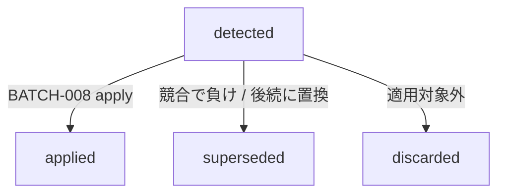

# Item Active Status Candidate テーブル定義書

## 1. ドキュメント情報

| 項目           | 内容                                              |
| -------------- | ------------------------------------------------- |
| ドキュメントID | `DB-TBL-MVP-item_active_status_candidate`         |
| ドキュメント名 | Item Active Status Candidate テーブル定義書       |
| 対象システム   | Gift Recommendation Service MVP                   |
| MVP対象        | `yes`                                             |
| 作成日         | 2026-07-15                                        |
| 更新日         | 2026-07-15                                        |

---

## 2. 概要

`item_active_status_candidate` は、外部商品データ連携系における **active_status 候補の派生 / 判定結果（一時）** である。`product_diff_result` と同型の正本区分とする。

BATCH-004（楽天既存商品再確認）の Item Active Status Candidate Resolver が、楽天商品検索APIの再確認結果から候補 `active_status` を解決して **Writer** として本テーブルへ upsert する。BATCH-008（商品有効状態更新）が **Reader / Applier** として未適用候補を読み、`item.active_status` を本更新したうえで候補 status を遷移する。

`raw_product_metadata` に候補カラム / JSON を追加しない（BATCH-004 仕様 §18.1.1）。Online / api / reco から Direct 参照しない。Staging 系と同様 **物理 FK なし（LOGICAL + Index）**。

---

## 3. 目的

- BATCH-004 再確認の **active_status 候補を再実行耐性のある専用テーブルへ永続化** する
- 冪等キー **`batch_run_id` + `source` + `external_item_code`** を UNIQUE として DDL へ展開可能にする
- 候補 status（`detected` / `applied` / `superseded` / `discarded`）と Retention（未適用保持・適用後 14 日）を物理定義する
- BATCH-008 が `product_diff_result` 経路と競合解決できる最小情報（候補値・理由・検知根拠・時刻）を保持する
- 後続 DDL Task（T3）が migration を作成できる粒度まで設計を確定する

---

## 4. テーブル基本情報

| 項目 | 内容 |
| ---- | ---- |
| 物理テーブル名 | `item_active_status_candidate` |
| 論理テーブル名 | Item Active Status Candidate |
| 分類 | 外部商品データ連携系 |
| 正本区分 | 派生 / 判定結果 |
| 主な更新主体 | batch（BATCH-004 Writer / BATCH-008 status 更新 / T7 cleanup DELETE） |
| 主な参照主体 | batch のみ（BATCH-008 Reader / Applier。Online / api / reco から Direct 参照しない） |
| MVP対象 | `yes` |
| 関連物理ER | `docs/06_実装設計/database/物理ER.md` |
| 制約正本 | `docs/06_実装設計/batch/BATCH-004_楽天既存商品再確認バッチ仕様書.md` §18.1 No.7 / §18.1.1 |

---

## 5. 用途・責務

- **Batch Run 単位・商品コード単位**で active_status 候補を 1 行記録する（冪等キー §7）
- BATCH-004 が候補を **検出・upsert** し、BATCH-008 が **適用・status 遷移**する
- `candidate_active_status` / `reason_code` / `detection_basis` / `detected_at` により適用根拠を監査可能にする
- Public API では返却しない（内部 Batch データ）

### 5.1 対象外

- `item.active_status` の本更新（BATCH-008 の責務。本テーブルは候補のみ）
- Raw Metadata / Raw JSON 本体（候補を `raw_product_metadata` へ載せない）
- Staging / Item Image / Ranking Snapshot
- `product_diff_result` 本体（別テーブル。BATCH-008 は両方読む）
- Public API 公開
- Online / OpenAPI / generated 変更

### 5.2 Writer / Reader 関係

| 主体 | Batch | 操作 | 備考 |
| ---- | ----- | ---- | ---- |
| Writer | BATCH-004 | INSERT / UPSERT（`candidate_status=detected`） | Item Active Status Candidate Resolver |
| Reader / Applier | BATCH-008 | SELECT（主に `detected`）→ `item.active_status` 更新 → UPDATE（`applied` / `superseded` / `discarded`） | Item Active Status Updater |
| Cleanup | T7（運用 / Batch） | DELETE（Retention 対象） | `detected` は削除しない |



### 5.3 BATCH-008 入力競合（§18.1.1 転記）

BATCH-008 は `product_diff_result` 経路と本候補テーブル経路を **両方読む**。同一 Item で結果が食い違う場合の優先は次とする。

| 状況 | 方針 |
| ---- | ---- |
| 制限度が異なる | **制限側を優先**する。強い順: `excluded` > `unavailable` > `inactive` > `active` |
| 制限度が同じ | **新しい時刻を優先**する（本テーブルの `detected_at` と `product_diff_result.judged_at` を比較） |
| 復帰（`active` 化） | **本候補で「取得成功かつ販売可能」が明示された場合のみ**。`product_diff_result.unavailable` 単独では復帰しない |

### 5.4 Item 突合

| 観点 | 方針 |
| ---- | ---- |
| 突合キー | **`source` + `external_item_code`**（= `item.uq_item_source_external_code`） |
| `item_id` | **任意**（LOGICAL）。MVP は **保持を推奨**（BATCH-004 が item 起点のため解決済み）。NULL 可とし、未解決時は `source` + `external_item_code` で解決 |
| MVP `source` | 既定 `'rakuten'`（`fetch_cursor` / `item` と同系統） |

---

## 6. カラム定義

| No | カラム名 | 論理名 | 型 | 必須 | PK | FK | Unique | Default | 説明 |
| --: | -------- | ------ | -- | ---- | -- | -- | ------ | ------- | ---- |
| 1 | `item_active_status_candidate_id` | Item Active Status Candidate ID | `uuid` | `yes` | `yes` | — | `yes` | `gen_random_uuid()` | サロゲート PK |
| 2 | `batch_run_id` | Batch Run ID | `uuid` | `yes` | — | LOGICAL | — | — | 候補を検出した Batch Run（BATCH-004）。`batch_run_log.batch_run_id` 参照 |
| 3 | `source` | Data Source | `text` | `yes` | — | — | — | `'rakuten'` | 外部商品データ元。冪等キー構成要素 |
| 4 | `external_item_code` | External Item Code | `text` | `yes` | — | — | — | — | 楽天 `itemCode`。冪等キー構成要素 |
| 5 | `item_id` | Item ID | `uuid` | `no` | — | LOGICAL | — | — | 対象 Item。`item.item_id` 参照（LOGICAL） |
| 6 | `candidate_active_status` | Candidate Active Status | `varchar(32)` | `yes` | — | — | — | — | 適用したい `item_active_status` 値 |
| 7 | `reason_code` | Reason Code | `varchar(64)` | `yes` | — | — | — | — | 候補理由コード（例: `availability_zero` / `empty_hit` / `available`） |
| 8 | `detection_basis` | Detection Basis | `varchar(32)` | `yes` | — | — | — | — | 検知根拠種別（例: `availability` / `empty_hit` / `api_success`） |
| 9 | `candidate_status` | Candidate Status | `varchar(32)` | `yes` | — | — | — | `'detected'` | 候補ライフサイクル（§11） |
| 10 | `detected_at` | Detected At | `timestamptz` | `yes` | — | — | — | — | BATCH-004 候補確定日時（UTC）。競合時の時刻比較に使用 |
| 11 | `applied_at` | Applied At | `timestamptz` | `no` | — | — | — | — | BATCH-008 適用完了日時。`applied` 時に設定 |
| 12 | `raw_metadata_id` | Raw Metadata ID | `uuid` | `no` | — | LOGICAL | — | — | 任意 trace。`raw_product_metadata.raw_metadata_id` |
| 13 | `api_call_log_id` | API Call Log ID | `uuid` | `no` | — | LOGICAL | — | — | 任意 trace。`api_call_log.api_call_log_id` |
| 14 | `created_at` | Created At | `timestamptz` | `yes` | — | — | — | `now()` | 行作成日時 |
| 15 | `updated_at` | Updated At | `timestamptz` | `yes` | — | — | — | `now()` | 行最終更新日時 |

### 6.1 理由コード / 検知根拠（MVP 初期値。拡張可）

| `detection_basis` | 典型 `reason_code` | 典型 `candidate_active_status` | 意味 |
| ----------------- | ------------------ | ------------------------------ | ---- |
| `availability` | `availability_zero` | `unavailable` | 楽天 `availability=0` |
| `empty_hit` | `empty_hit` | `unavailable` | itemCode 指定で 0 件 |
| `api_success` | `available` | `active` | 取得成功かつ販売可能（復帰候補） |
| `quality` | `excluded_quality` | `excluded` | 必須欠落等（実装で拡張） |

`reason_code` / `detection_basis` は MVP で CHECK 制約を **強く閉じなくてもよい**（自由テキスト + アプリ定数）。T3 で必要な場合のみ CHECK 化する。

---

## 7. 主キー・一意キー

| 種別 | 対象カラム | 方針 | 備考 |
| ---- | ---------- | ---- | ---- |
| PRIMARY KEY | `item_active_status_candidate_id` | サロゲート UUID | — |
| UNIQUE | `batch_run_id`, `source`, `external_item_code` | 同一 Run・同一商品は 1 候補行 | BATCH-004 §18.1.1 **Human 確定**。物理ER `uq_item_active_status_candidate_run_code` |

---

## 8. 外部キー・参照関係

### 8.1 参照先（論理）

| カラム | 参照先 | FK制約 | 参照整合性 | 備考 |
| ------ | ------ | ------ | ---------- | ---- |
| `batch_run_id` | `batch_run_log.batch_run_id` | `LOGICAL` | Batch で存在確認 | Writer Run |
| `item_id` | `item.item_id` | `LOGICAL` | 推奨・NULL 可 | 本更新対象 |
| `raw_metadata_id` | `raw_product_metadata.raw_metadata_id` | `LOGICAL` | 任意 | Raw 非載荷の trace のみ |
| `api_call_log_id` | `api_call_log.api_call_log_id` | `LOGICAL` | 任意 | 再確認 API 呼出 |

### 8.2 被参照（論理）

| 参照元 | 用途 | 備考 |
| ------ | ---- | ---- |
| BATCH-008 Item Active Status Candidate Reader | 未適用候補の読取・適用 | `candidate_status='detected'` を主対象 |
| T7 Retention cleanup | 適用済み行の削除 | `detected` は対象外 |

---

## 9. Index

| Index名 | 対象カラム | 種別 | 用途 | 備考 |
| ------- | ---------- | ---- | ---- | ---- |
| `item_active_status_candidate_pkey` | `item_active_status_candidate_id` | btree（PK） | 主キー | 自動生成 |
| `uq_item_active_status_candidate_run_code` | `batch_run_id`, `source`, `external_item_code` | unique btree | BATCH-004 冪等 | §7 |
| `idx_item_active_status_candidate_status` | `candidate_status`, `detected_at` | btree | BATCH-008 未適用抽出・Retention | `detected` 優先 |
| `idx_item_active_status_candidate_item` | `item_id` | btree | Item 単位の候補一覧 | NULL 行は Index 対象外でも可 |
| `idx_item_active_status_candidate_code` | `source`, `external_item_code`, `detected_at` DESC | btree | 商品コード別の最新候補 | 競合解決補助 |

---

## 10. 制約

| 制約名 | 種別 | 対象 | 内容 | 備考 |
| ------ | ---- | ---- | ---- | ---- |
| `item_active_status_candidate_pkey` | PRIMARY KEY | `item_active_status_candidate_id` | 主キー | — |
| `uq_item_active_status_candidate_run_code` | UNIQUE | `batch_run_id`, `source`, `external_item_code` | Writer 冪等 | §7 |
| `chk_item_active_status_candidate_source_mvp` | CHECK | `source` | `source = 'rakuten'` | MVP 固定 |
| `chk_item_active_status_candidate_active_status` | CHECK | `candidate_active_status` | `item_active_status` 許容値 | enum定義書 §6.10 |
| `chk_item_active_status_candidate_status` | CHECK | `candidate_status` | `detected` / `applied` / `superseded` / `discarded` | §11 |
| `chk_item_active_status_candidate_applied_at` | CHECK | `applied_at`, `candidate_status` | `candidate_status <> 'applied' OR applied_at IS NOT NULL` | 適用時は時刻必須 |

---

## 11. 状態・enum

| カラム | enum / code | 定義元 | 許容値 | 備考 |
| ------ | ----------- | ------ | ------ | ---- |
| `candidate_active_status` | `item_active_status` | enum定義書 §6.10 / `packages/code-definitions/state/item_active_status.yaml` | `active`, `inactive`, `unavailable`, `excluded` | Item 本更新時にそのまま適用候補となる |
| `candidate_status` | `item_active_status_candidate_status` | enum定義書 §6.27 / `packages/code-definitions/state/item_active_status_candidate_status.yaml` | `detected`, `applied`, `superseded`, `discarded` | 候補ライフサイクル |

### 11.1 `candidate_status` 遷移

| 状態 | 意味 | 遷移条件 | 終端 |
| ---- | ---- | -------- | ---- |
| `detected` | 未適用の候補 | BATCH-004 upsert 時の初期値 | 否（未適用保持） |
| `applied` | BATCH-008 が `item.active_status` に適用済み | Applier 成功 | はい（Retention 対象） |
| `superseded` | より新しい候補 / 競合解決で不採用 | BATCH-008 が別候補を優先した、または同一商品の後続 `detected` で置き換え | はい（Retention 対象） |
| `discarded` | 適用対象外として破棄 | 根拠不足・手動破棄・ルール上スキップ | はい（Retention 対象） |



---

## 12. 更新仕様

| 操作 | 実行主体 | 条件 | 更新項目 | 冪等性 | 備考 |
| ---- | -------- | ---- | -------- | ------ | ---- |
| INSERT / UPSERT | batch（BATCH-004） | Resolver 成功 | 業務列 + `candidate_status='detected'` + `detected_at` | UNIQUE ON CONFLICT | IF は T4b |
| UPDATE | batch（BATCH-008） | 適用・競合解決 | `candidate_status`, `applied_at`, `updated_at` | `item_active_status_candidate_id` 指定 | Item 本更新と同一 Run で実施推奨 |
| SELECT | batch（BATCH-008） | 未適用抽出 | — | — | 主に `candidate_status='detected'` |
| DELETE | batch / 運用（T7） | Retention 条件 | — | — | **`detected` は削除しない** |
| INSERT / UPDATE / DELETE | api / reco / web | — | — | **禁止** | Batch 専用 |

### 12.1 BATCH-004 Writer フロー

```text
1. recheck 対象 item / external_item_code を解決
2. 楽天商品検索API（itemCode）呼出 → Raw 保存
3. availability / empty_hit / 販売可能 から candidate_active_status と reason / basis を解決
4. item_active_status_candidate UPSERT
   - PK 自然キー: (batch_run_id, source, external_item_code)
   - candidate_status = detected
   - detected_at = 候補確定時刻
5. item.active_status は更新しない
```

### 12.2 INSERT / UPSERT 疑似コード

```sql
INSERT INTO item_active_status_candidate (
  batch_run_id,
  source,
  external_item_code,
  item_id,
  candidate_active_status,
  reason_code,
  detection_basis,
  candidate_status,
  detected_at,
  raw_metadata_id,
  api_call_log_id
) VALUES (
  :batch_run_id,
  :source,
  :external_item_code,
  :item_id,
  :candidate_active_status,
  :reason_code,
  :detection_basis,
  'detected',
  :detected_at,
  :raw_metadata_id,
  :api_call_log_id
)
ON CONFLICT (batch_run_id, source, external_item_code) DO UPDATE SET
  item_id = EXCLUDED.item_id,
  candidate_active_status = EXCLUDED.candidate_active_status,
  reason_code = EXCLUDED.reason_code,
  detection_basis = EXCLUDED.detection_basis,
  candidate_status = 'detected',
  detected_at = EXCLUDED.detected_at,
  applied_at = NULL,
  raw_metadata_id = EXCLUDED.raw_metadata_id,
  api_call_log_id = EXCLUDED.api_call_log_id,
  updated_at = now();
```

### 12.3 BATCH-008 Applier フロー（概要）

```text
1. candidate_status = detected の行を抽出（必要に応じ batch_run_id / item_id 絞り込み）
2. 同一 item について product_diff_result 経路と制限度・時刻で競合解決（§5.3）
3. 採用時: item.active_status を candidate_active_status へ更新し、candidate_status = applied、applied_at 設定
4. 不採用時: candidate_status = superseded または discarded
5. detected 行を Retention で削除しない
```

---

## 13. データ保持・削除

| 観点 | 方針 |
| ---- | ---- |
| `detected` | **削除しない**（BATCH-008 再実行・部分リカバリ） |
| `applied` | **`applied_at` 基準で 14 日間保持**後に cleanup（`applied_at` 必須） |
| `superseded` / `discarded` | **`updated_at` 基準で 14 日間保持**後に cleanup（当該 status へ遷移した時刻） |
| 削除方式 | 物理 DELETE（T7）。008 成功直後の即時削除はしない |
| 論理削除 | 列なし |
| アーカイブ | MVP 対象外 |
| 日数変更 | 運用実績を見て Human 再判断可（§18.1.1） |

---

## 14. Migration / DDL

| 項目 | 内容 |
| ---- | ---- |
| DDL対象 | `item_active_status_candidate` |
| migration単位 | 1 テーブル = 1 migration（T3） |
| 適用順序 | 外部商品データ連携系。**`batch_run_log` 作成後**（LOGICAL）。`item` / `raw_product_metadata` / `api_call_log` とは物理 FK なし |
| rollback方針 | forward migration 主体。DROP は Human Review 必須 |
| 破壊的変更有無 | `no`（初回 CREATE） |
| enum | T3 で CHECK または将来の enum type へ展開。値の正本は §11 / code-definitions |

---

## 15. セキュリティ・権限

| 観点 | 方針 |
| ---- | ---- |
| 読み取り権限 | batch（service role 経由）のみ |
| 書き込み権限 | batch のみ（BATCH-004 / BATCH-008 / T7） |
| Online 参照 | しない |
| 個人情報・機微情報 | 商品コード・状態のみ。secret 非含有 |
| ログ出力制限 | secret / 接続文字列を出さない |

---

## 16. テスト観点

| No | 観点 | 確認内容 | 種別 |
| --: | ---- | -------- | ---- |
| 1 | DDL適用 | CREATE TABLE / Index / CHECK / UNIQUE が定義どおり | migration |
| 2 | 冪等 Upsert | 同一 `(batch_run_id, source, external_item_code)` 再 INSERT が UPDATE になる | migration / unit |
| 3 | enum整合 | `candidate_active_status` / `candidate_status` CHECK | migration |
| 4 | Writer 境界 | BATCH-004 が候補を書き、`item.active_status` が変わらない | unit |
| 5 | Retention | `detected` が cleanup 対象外、`applied` が 14 日後削除可能 | integration / unit |
| 6 | 競合 | 制限側優先・時刻優先が Applier で再現できるデータが揃う | unit（008） |
| 7 | 権限 | web client から Direct DB アクセス不可 | manual |
| 8 | secret | docs / fixture に secret 実値なし | review |

---

## 17. 未決事項

| No | 論点 | 判断が必要な理由 | 判断者 | 期限 | 備考 |
| --: | ---- | ---------------- | ------ | ---- | ---- |
| — | なし | — | — | — | 制約は BATCH-004 §18.1.1 で Human 確定済み。本定義書で DDL 粒度まで確定 |

### 17.1 Human / 仕様 決定事項（転記）

| No | 論点 | 決定内容 | 決定者 | 備考 |
| --: | ---- | -------- | ------ | ---- |
| 1 | 物理名 | **`item_active_status_candidate`** | Human（BATCH-004） | §18.1 No.7 |
| 2 | 冪等 UNIQUE | **`(batch_run_id, source, external_item_code)`** | Human | §18.1.1 |
| 3 | 責務分離 | Raw metadata に候補を載せない | Human | §18.1.1 |
| 4 | Writer / Reader | BATCH-004 / BATCH-008 | Human | §18.1.1 |
| 5 | Retention | `detected` 保持、適用後 14 日 | Human | §18.1.1 |
| 6 | 競合 | 制限側優先 / 同時刻は新しい方 / 復帰は候補明示時のみ | Human | §18.1.1 |
| 7 | `item_id` | LOGICAL・NULL 可・Writer で可能な限り設定 | 本定義（推論→推奨） | Item 起点の BATCH-004 と整合 |
| 8 | `reason_code` CHECK | MVP は厳密 CHECK 必須としない | 本定義 | T3 で必要なら追加 |

---

## 18. 関連資料

| 種別 | パス / URL | 用途 |
| ---- | ---------- | ---- |
| 制約正本 | `docs/06_実装設計/batch/BATCH-004_楽天既存商品再確認バッチ仕様書.md` | §18.1 No.7 / §18.1.1 |
| 同型先例 | `docs/06_実装設計/database/product_diff_result_テーブル定義書.md` | 派生 / 判定結果（一時） |
| 物理ER | `docs/06_実装設計/database/物理ER.md` | 外部商品データ連携系・Retention |
| 論理ER | `docs/05_アプリケーション設計/アプリ/database/論理ER.md` | エンティティ追記（T1） |
| テーブル一覧 | `docs/05_アプリケーション設計/アプリ/database/テーブル一覧.md` | §6 No.26 |
| enum定義書 | `docs/06_実装設計/database/enum定義書.md` | §6.10 / §6.27 |
| item_active_status | `packages/code-definitions/state/item_active_status.yaml` | 候補値 |
| candidate_status | `packages/code-definitions/state/item_active_status_candidate_status.yaml` | ライフサイクル |
| バッチ処理一覧 | `docs/05_アプリケーション設計/アプリ/batch/バッチ処理一覧.md` | BATCH-004 / BATCH-008 |
| Epic | #1227 | 付随テーブル整備 |
| インターフェース一覧 | `docs/05_アプリケーション設計/アプリ/インターフェース一覧.md` | IF-DB-BATCH-020（Writer）/ IF-DB-BATCH-021（Reader） |

---

## 19. レビュー観点

- BATCH-004 §18.1 No.7 / §18.1.1 と矛盾していない
- UNIQUE / Retention / Writer·Reader / Raw 非載荷が明記されている
- `product_diff_result` 同型（派生 / 判定結果・一時・物理 FK なし）と整合している
- DDL Task が CREATE TABLE を起こせる粒度である
- apps/** / OpenAPI / generated / migration SQL を本 Task に混入していない
- secret や `.env` 実値が含まれていない
