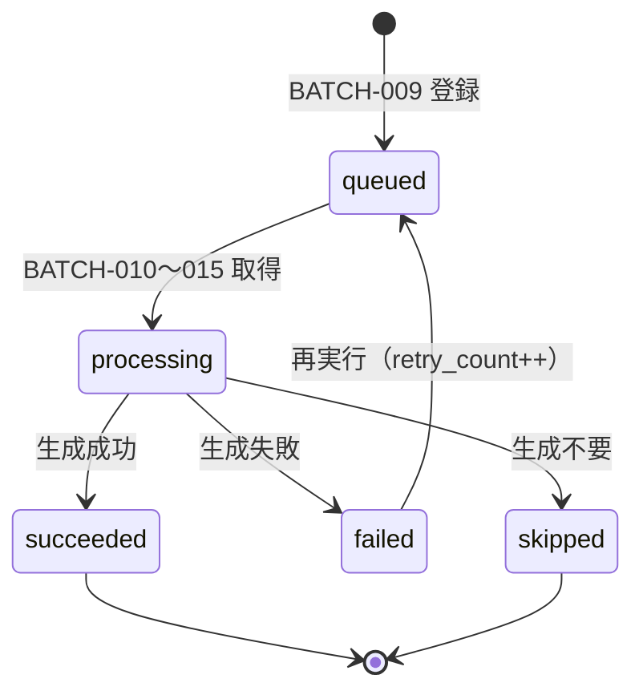

# Item Generation Queue テーブル定義書

## 1. ドキュメント情報

| 項目           | 内容                              |
| -------------- | --------------------------------- |
| ドキュメントID | `DB-TBL-MVP-item_generation_queue` |
| ドキュメント名 | Item Generation Queue テーブル定義書 |
| 対象システム   | Gift Recommendation Service MVP |
| MVP対象        | `yes`                             |
| 作成日         | 2026-06-12                        |
| 更新日         | 2026-06-12（Human Review #507 反映） |

---

## 2. 概要

`item_generation_queue` は、Item Semantic / Item Feature / Item Embedding の **再生成対象を管理する Queue テーブル** である。

BATCH-009（商品意味生成キュー登録）で登録され、BATCH-010〜015 が `queue_status` を更新しながらパイプラインを消化する。`generation_type` は **処理開始区間**（semantic / feature / embedding）を表し、`retry_count` は失敗後の再実行回数を記録する。

Online 推薦中は **更新しない**（論理ER §16.1）。batch のみが INSERT / UPDATE する。

---

## 3. 目的

- 商品意味に影響する Item 更新・version 変更・失敗リトライ時に、意味生成パイプラインの **作業単位** を DB 上で管理する
- `queue_status`（状態遷移設計書 §7.2）と `generation_type`（enum定義書 §6.17）を物理 DDL で確定し、後続 DDL Task が migration を作成できる粒度を提供する
- `item` との **1対多**（物理 FK ON）関係と、BATCH-009〜015・IF-DB-BATCH-010 の登録 / 消化方針を明記する
- `item_generation_queue_id` を trace キー（バッチ設計方針書 §15.2・ログ・Observability設計書 §9.3）として、再実行・障害調査に利用できるようにする

---

## 4. テーブル基本情報

| 項目 | 内容 |
| ---- | ---- |
| 物理テーブル名 | `item_generation_queue` |
| 論理テーブル名 | Item Generation Queue |
| 分類 | Item派生データ系 |
| 正本区分 | 状態 / Queue |
| 主な更新主体 | batch（BATCH-009 登録、BATCH-010〜015 消化、`retry-failed-items` 再実行） |
| 主な参照主体 | batch のみ（api / reco は直接参照しない） |
| MVP対象 | `yes` |
| 関連物理ER | `docs/06_実装設計/database/物理ER.md` §8–§12 |

---

## 5. 用途・責務

- **意味生成対象の Queue 制御**（テーブル一覧 §7 No.27・バッチ設計方針書 §14.1）
- BATCH-009 において、意味影響項目の変更・version 変更・新規 Item を `queue_status = queued` で登録する
- BATCH-010〜015 が対象行を `processing` → `succeeded` / `failed` / `skipped` へ遷移させる
- 失敗時は `failed` とし、`retry-failed-items` または手動再実行で `queued` へ戻して再処理する（状態遷移設計書 §7.2.3・§11.3）
- **中間状態の逐次更新は本テーブルに集約**するが、商品取得 Batch 全体の細粒度状態は持たない（状態遷移設計書 §7.2.4）

### 5.1 対象外

- Item Semantic / Item Feature / Item Meaning / Item Embedding の **生成結果本体**（別 Task / Batch R03）
- `feature_input_hash` / `embedding_input_hash` の永続化先テーブル（本 Task では IF 連携の参照整理のみ）
- `meaning_input_diff` の本体定義（BATCH-009 入力の参照整理のみ）。`product_diff_result` は `product_diff_result_テーブル定義書` #526 を正本とする
- `source` / `source_api` 列（外部 API 由来データではなく **制御 Queue** のため不要）
- api / reco からの直接 DML
- DDL / migration 本体（DDL Task へ委譲）
- OpenAPI / generated 変更（Epic 終盤 Task #469 へ委譲）

### 5.2 `generation_type` の意味（パイプライン開始区間）

enum定義書 §6.17・`packages/code-definitions/batch/item_generation_type.yaml` を正本とする。

| 値 | 表示名 | 開始 Batch（相当） | 意味 |
| -- | ------ | ------------------ | ---- |
| `semantic` | Semantic | BATCH-010 | フルパイプライン入口。Semantic → Feature → Embedding 一連を対象とする |
| `feature` | Feature | BATCH-011〜013 | Item Semantic 済み前提の部分再生成（Feature 入力 hash 変更・semantic_config_version 変更等） |
| `embedding` | Embedding | BATCH-014〜015 | Embedding 入力 hash / model_version / embedding_source_version 変更時の部分再生成 |

**BATCH-009 初回キュー登録時のデフォルト**は `semantic`（Human Review 確定済み・enum定義書 §6.17）。

### 5.3 `item` 紐づけ方針

| 観点 | 方針 |
| ---- | ---- |
| カーディナリティ | `item` 1 件に対し `item_generation_queue` は **1対多**（物理ER §9: `queued`・ON・1:N） |
| 物理 FK | `item_id` → `item.item_id`（`ON`・`item_テーブル定義書` §8.2 と一致） |
| 登録前提 | 対象 `item` が Upsert 済みで `item_id` が確定していること（`item_テーブル定義書` §12.1） |
| 再生成トリガー（代表） | `normalized_hash` 変更（意味影響項目）、`semantic_config_version_id` 変更、`feature_input_hash` 変更、`embedding_model_version_id` / `embedding_source_version` / `embedding_input_hash` 変更、前回生成失敗 |

### 5.4 BATCH-009 登録条件（意味影響 vs 非影響）

バッチ設計方針書 §7.2 補足・§7.3 フローに従う。

| 条件 | 登録 |
| ---- | ---- |
| 新規 Item（`product_diff_result.diff_status = new` 等） | ○（`generation_type = semantic`） |
| 意味影響項目変更（`itemName` / `catchcopy` / `itemCaption` / `genreId` / `attribute` / `tag` 等・`meaning_input_diff` 正本） | ○ |
| `normalized_hash` 変更（`item_テーブル定義書` §12.2・hash 変更あり Upsert 後） | ○（通常 `semantic`） |
| `semantic_config_version_id` 変更（`meaning_input_diff` なし） | ○（`generation_type = feature`。§5.6 / §17.1 No.3） |
| 意味影響項目 / `meaning_input_diff` あり（config version 同時変更含む） | ○（`generation_type = semantic`） |
| `reviewAverage` / `reviewCount` / `price` / `rank` / `availability` / `itemUrl` **のみ**変更 | **×**（登録しない） |
| Embedding 関連 version / hash のみ変更 | ○（`generation_type = embedding`） |
| Feature 入力 hash のみ変更 | ○（`generation_type = feature`） |

### 5.5 パイプライン消化と `generation_type`

| `generation_type` | 消化 Batch 範囲 | 成功時 `queue_status` |
| ----------------- | --------------- | --------------------- |
| `semantic` | BATCH-010 → BATCH-015（一連） | `succeeded`（全工程完了後） |
| `feature` | BATCH-011 → BATCH-013（必要に応じ BATCH-014〜015） | `succeeded` |
| `embedding` | BATCH-014 → BATCH-015 | `succeeded` |

skip 条件（同一 hash / version で生成済み）を満たした場合は、当該区間をスキップし、対象 Queue 行は `skipped` とする（バッチ設計方針書 §7.2 補足・§14.1）。

### 5.6 version 変更時の `generation_type` 選定（MVP 方針）

Human Review #507 §17.1 No.3 決定済み。

| 変更要因 | `generation_type` | 備考 |
| -------- | ----------------- | ---- |
| 新規 Item / 意味影響項目 / `normalized_hash` / `meaning_input_diff` あり | `semantic` | BATCH-009 デフォルト |
| **`semantic_config_version_id` のみ**（Item 本文・意味入力不変） | `feature` | Semantic 再利用。Semantic ルール変更を `meaning_input_diff` で検知できない場合は Batch 仕様 Task で `semantic` 昇格条件を補足 |
| `feature_input_hash` のみ変更 | `feature` | — |
| `embedding_model_version_id` / `embedding_source_version` / `embedding_input_hash` | `embedding` | Feature 済み前提。`embedding_source_version` は batch 層トリガー（DB 列なし。`item_embedding_テーブル定義書` §17.1 No.2） |
| 複数要因同時（例: hash + config version） | **最上流優先**: hash / meaning_input 変更あり → `semantic`、なければ `feature` | — |
| 前回 `failed` の再実行 | **変更しない**（同一行を `queued` へ） | 初回登録値を保持 |

> **Embedding 永続化との関係（Human Review #516）**: Queue / batch 層では `embedding_model_version_id`（＝`model_version_id`）・`embedding_source_version`・`embedding_input_hash` の変更を再生成トリガーとする。`item_embedding` テーブルが保持するのは **`model_version_id` + `embedding_input_hash` + `embedding_source_type`** のみ（`embedding_source_version` 物理列なし）。構築ルール version 変更で入力文脈が変われば `embedding_input_hash` も変わり得る。

### 5.7 二重処理禁止

バッチ設計方針書 §18.1: **同一 `item_generation_queue_id` の `processing` は二重処理禁止**。

| 観点 | 方針 |
| ---- | ---- |
| 排他単位 | `item_generation_queue_id`（行単位） |
| 取得 | `queue_status = queued` の行を `queued_at` 昇順で取得し、`processing` へ遷移（楽観的ロックまたは `UPDATE … WHERE queue_status = 'queued'`） |
| 競合 | 他ワーカーが先に `processing` へ遷移した行はスキップ |

---

## 6. カラム定義

| No | カラム名 | 論理名 | 型 | 必須 | PK | FK | Unique | Default | 説明 |
| --: | -------- | ------ | -- | ---- | -- | -- | ------ | ------- | ---- |
| 1 | `item_generation_queue_id` | Item Generation Queue ID | `uuid` | `yes` | `yes` | — | `yes` | `gen_random_uuid()` | Queue 行 ID。再実行・trace の単位キー |
| 2 | `item_id` | Item ID | `uuid` | `yes` | — | `ON` | — | — | 対象商品。`item.item_id` 参照 |
| 3 | `generation_type` | Generation Type | `text` | `yes` | — | — | — | `'semantic'` | パイプライン開始区間。`item_generation_type` enum |
| 4 | `queue_status` | Queue Status | `text` | `yes` | — | — | — | `'queued'` | 生成 Queue 状態。`item_generation_queue_status` enum |
| 5 | `retry_count` | Retry Count | `integer` | `yes` | — | — | — | `0` | 失敗後 `queued` へ戻した回数（初回登録は 0） |
| 6 | `queued_at` | Queued At | `timestamptz` | `yes` | — | — | — | — | キュー登録日時（UTC）。再 `queued` 時も更新 |
| 7 | `started_at` | Started At | `timestamptz` | `no` | — | — | — | — | `processing` 開始日時（UTC） |
| 8 | `completed_at` | Completed At | `timestamptz` | `no` | — | — | — | — | 終端状態（`succeeded` / `failed` / `skipped`）到達日時（UTC） |
| 9 | `error_message` | Error Message | `text` | `no` | — | — | — | — | 失敗時の要約メッセージ。詳細は `error_log` |

> `semantic_config_version_id` / `model_version_id` 等は **本テーブル行には持たない**（論理ER §8.2 準拠・Human Review #507 §17.1 No.4 決定済み）。version 解決は BATCH 実行時に Config Resolver が行い、結果は `item_semantic` / `item_feature` / `item_embedding` および `batch_run_log` / `phase_log`（`owner_type = batch_run`）/ `error_log`（`owner_type = item_generation_queue`）で追跡する（`phase_log_テーブル定義書` §11.3）。

---

## 7. 主キー・一意キー

| 種別 | 対象カラム | 方針 | 備考 |
| ---- | ---------- | ---- | ---- |
| PRIMARY KEY | `item_generation_queue_id` | サロゲート UUID | trace / 再実行単位 |
| UNIQUE（partial） | `item_id`, `generation_type` | `queue_status IN ('queued', 'processing')` のとき最大 1 行 | 二重 active 行防止（§17.1 No.1 決定済み） |

終端状態（`succeeded` / `failed` / `skipped`）の履歴行は **複数保持可**（物理ER 1:N と整合）。保持期間・DELETE は §13・§17.1 No.2。

---

## 8. 外部キー・参照関係

### 8.1 参照先（本テーブルから）

| カラム | 参照先 | FK制約 | 参照整合性 | 備考 |
| ------ | ------ | ------ | ---------- | ---- |
| `item_id` | `item.item_id` | `ON` | `ON DELETE RESTRICT` | `item_テーブル定義書` §8.2 と同型 |

### 8.2 被参照

| 参照元 | 参照列 | 関係 | FK制約 | 備考 |
| ------ | ------ | ---- | ------ | ---- |
| `error_log` | `owner_id`（`owner_type = item_generation_queue`） | owner | `LOGICAL` | enum定義書 §6.15 |
| BATCH-010〜015 | `item_generation_queue_id` | 消化対象 | アプリ層 | 物理 FK なし |

### 8.3 後続派生テーブル（参照整理のみ・本体は out_of_scope）

| 派生テーブル | 関係 | 備考 |
| ------------ | ---- | ---- |
| `item_semantic` | Queue 行の `item_id` 経由で生成 | BATCH-010 出力 |
| `item_feature` | 同上 | BATCH-012 出力 |
| `item_embedding` | 同上 | BATCH-015 出力 |

---

## 9. Index

| Index名 | 対象カラム | 種別 | 用途 | 備考 |
| ------- | ---------- | ---- | ---- | ---- |
| `item_generation_queue_pkey` | `item_generation_queue_id` | btree（PK） | 主キー | 自動生成 |
| `idx_item_gen_queue_status` | `queue_status`, `queued_at` | btree | 再生成処理の取得 | 物理ER §10 |
| `idx_item_generation_queue_item_id` | `item_id` | btree | FK / item 単位の参照 | JOIN・障害調査 |
| `uq_item_gen_queue_active_per_type` | `item_id`, `generation_type` | unique partial btree | active 行の重複防止 | `WHERE queue_status IN ('queued', 'processing')`（§7・§17.1 No.1） |

---

## 10. 制約

| 制約名 | 種別 | 対象 | 内容 | 備考 |
| ------ | ---- | ---- | ---- | ---- |
| `item_generation_queue_pkey` | PRIMARY KEY | `item_generation_queue_id` | 主キー | — |
| `fk_item_generation_queue_item_id` | FOREIGN KEY | `item_id` | `item(item_id)` ON DELETE RESTRICT | §8.1 |
| `chk_item_gen_queue_status` | CHECK | `queue_status` | `item_generation_queue_status` 許容値 | enum定義書 §6.11 |
| `chk_item_gen_generation_type` | CHECK | `generation_type` | `item_generation_type` 許容値 | enum定義書 §6.17 |
| `chk_item_gen_retry_count_nonneg` | CHECK | `retry_count` | `retry_count >= 0` | — |
| `chk_item_gen_retry_count_max` | CHECK | `retry_count` | `retry_count <= 5` | 自動再実行上限（3）より大きい手動運用余裕（§17.1 No.5） |
| `chk_item_gen_started_when_processing` | CHECK | `queue_status`, `started_at` | `queue_status NOT IN ('processing','succeeded','failed','skipped') OR started_at IS NOT NULL` | 処理開始後は開始時刻必須 |
| `chk_item_gen_completed_when_terminal` | CHECK | `queue_status`, `completed_at` | `queue_status IN ('queued','processing') OR completed_at IS NOT NULL` | 終端状態は完了時刻必須 |
| `uq_item_gen_queue_active_per_type` | UNIQUE（partial） | `item_id`, `generation_type` | active 時のみ一意 | §7 |

---

## 11. 状態・enum

| カラム | enum / code | 定義元 | 許容値 | 備考 |
| ------ | ----------- | ------ | ------ | ---- |
| `queue_status` | `item_generation_queue_status` | enum定義書 §6.11 / `packages/code-definitions/state/item_generation_queue_status.yaml` | `queued` / `processing` / `succeeded` / `failed` / `skipped` | 状態遷移設計書 §7.2 |
| `generation_type` | `item_generation_type` | enum定義書 §6.17 / `packages/code-definitions/batch/item_generation_type.yaml` | `semantic` / `feature` / `embedding` | Human Review 確定済み |

### 11.1 `queue_status` 状態遷移

状態遷移設計書 §7.2.3 を正本とする。



| 状態 | 終端 | 更新主体 | 備考 |
| ---- | ---- | -------- | ---- |
| `queued` | × | batch（BATCH-009 / 再実行） | 待機 |
| `processing` | × | batch（BATCH-010〜015） | 処理中。二重取得禁止 |
| `succeeded` | ○ | batch | 正常完了 |
| `failed` | ○ | batch | GRS-BAT-007〜009 等。`error_log` 連携 |
| `skipped` | ○ | batch | 再生成不要（hash / version 一致等） |

---

## 12. 更新仕様

| 操作 | 実行主体 | 条件 | 更新項目 | 冪等性 | 備考 |
| ---- | -------- | ---- | -------- | ------ | ---- |
| INSERT | batch（BATCH-009） | §5.4 登録条件を満たす | 全業務列（`queue_status=queued`） | active 行重複は §12.1 | IF-DB-BATCH-010 |
| UPDATE | batch（BATCH-010〜015） | `item_generation_queue_id` 指定 | `queue_status`, タイムスタンプ, `error_message` | 行単位 | 同一 id の二重 processing 禁止 |
| UPDATE | batch（retry） | `queue_status = failed` かつ §12.5 上限内 | `queue_status=queued`, `retry_count++`, `queued_at`, `error_message` クリア等 | 行単位 | §12.3 |
| DELETE | batch（メンテナンス） | §13 保持期間経過 | 終端行 | 定期実行 | §13.1 |
| SELECT | batch | `queue_status = queued` | — | — | `ORDER BY queued_at` |
| INSERT / UPDATE / DELETE | api / reco | — | — | **禁止** | Online 推薦中に更新しない |

### 12.1 BATCH-009 登録フロー

```text
1. BATCH-007 / BATCH-008 完了後、対象 item を評価
2. product_diff_result / meaning_input_diff / normalized_hash 変更を確認
3. 登録条件を満たす → generation_type を §5.6 で決定
4. 同一 item_id + generation_type で active 行がなければ INSERT
5. active 行が queued のみ存在 → queued_at のみ UPDATE（新規 INSERT しない）
6. active 行が processing → 登録スキップ（二重処理防止）
```

### 12.2 パイプライン消化フロー

```text
1. queue_status = queued の行を idx_item_gen_queue_status で取得
2. queue_status = processing, started_at = now()（条件付き UPDATE）
3. generation_type に応じ BATCH-010〜015 を実行
4. 成功 → queue_status = succeeded, completed_at = now()
5. 失敗 → queue_status = failed, error_message, completed_at = now(), error_log 記録
6. skip 判定 → queue_status = skipped, completed_at = now()
```

### 12.3 失敗再実行フロー

```text
1. retry-failed-items または運用再実行で failed 行を対象
2. retry_count < 3（自動）または retry_count < 5（手動運用）を満たすこと
3. queue_status = queued, retry_count = retry_count + 1, queued_at = now()
4. started_at / completed_at / error_message を NULL クリア
5. generation_type は初回登録値を維持
6. retry_count >= 3 かつ自動再実行 → failed のまま。error_log + 監視アラート
```

### 12.4 登録疑似コード

**新規 INSERT（active 行なし）**

```sql
INSERT INTO item_generation_queue (
  item_id, generation_type, queue_status, retry_count, queued_at
) VALUES (
  :item_id, :generation_type, 'queued', 0, now()
);
```

**active `queued` 行あり（§17.1 No.1）**

```sql
UPDATE item_generation_queue
SET queued_at = now()
WHERE item_id = :item_id
  AND generation_type = :generation_type
  AND queue_status = 'queued';
```

### 12.5 `retry_count` 方針

Human Review #507 §17.1 No.5 決定済み。

| 観点 | 方針 |
| ---- | ---- |
| 初回登録 | `0` |
| インクリメント | `failed` → `queued` 再実行時に `+1` |
| 自動再実行上限 | **`retry_count < 3`**（`retry-failed-items` 等）。3 回到達後は自動再キューしない |
| DB 上限 | **`retry_count <= 5`**（`chk_item_gen_retry_count_max`）。手動運用の余裕 |
| 上限到達後 | `queue_status = failed` のまま。`error_log` 記録 + 監視アラート |

---

## 13. データ保持・削除

Human Review #507 §17.1 No.2 決定済み。

| 観点 | 方針 |
| ---- | ---- |
| 保持期間 | active 行（`queued` / `processing`）は削除しない。終端行は下記 §13.1 |
| 削除方式 | Batch メンテナンス（定期 DELETE） |
| 削除条件 | 親 `item` 物理削除は RESTRICT で禁止 |
| 論理削除 | 列なし。`queue_status` で表現 |
| アーカイブ | MVP 対象外 |

### 13.1 終端行 DELETE 方針

| `queue_status` | 保持期間 | DELETE 条件 |
| -------------- | -------- | ----------- |
| `succeeded` / `skipped` | **`completed_at` から 14 日** | `completed_at < now() - interval '14 days'` |
| `failed` | **`completed_at` から 30 日** | `completed_at < now() - interval '30 days'`（`retry_count >= 3` 到達後を想定） |
| `queued` / `processing` | 削除しない | 滞留監視は別途アラート |

BATCH-017 は実行時点の集計を `item_import_summary` に取る。Queue 行の長期保持は不要（正本定義表: 一時 / 状態）。

---

## 14. Migration / DDL

| 項目 | 内容 |
| ---- | ---- |
| DDL対象 | `item_generation_queue` |
| migration単位 | 1 テーブル = 1 migration（DDL Task） |
| 適用順序 | 物理ER §15: **`item` 作成後**・Item 派生群。`item_semantic` 等より **先または並行可**（FK は `item` のみ） |
| rollback方針 | forward migration 主体。DROP は Human Review 必須 |
| 破壊的変更有無 | `no`（初回 CREATE） |

---

## 15. セキュリティ・権限

| 観点 | 方針 |
| ---- | ---- |
| 読み取り権限 | batch のみ（service role 経由） |
| 書き込み権限 | batch のみ。BATCH-009 登録・BATCH-010〜015 更新 |
| service role利用 | Batch DML に限定 |
| 個人情報・機微情報 | 商品 ID・エラー要約のみ。本文・embedding は保持しない |
| ログ出力制限 | `error_message` に secret・API キーを含めない |

---

## 16. テスト観点

| No | 観点 | 確認内容 | 種別 |
| --: | ---- | -------- | ---- |
| 1 | DDL適用 | CREATE TABLE / Index / FK / CHECK / partial UNIQUE が定義どおり | migration |
| 2 | enum CHECK | 不正 `queue_status` / `generation_type` が拒否される | migration |
| 3 | FK 整合 | 存在しない `item_id` への INSERT が拒否される | migration |
| 4 | active 一意 | 同一 `item_id` + `generation_type` で active 行が 2 件 INSERT できない | migration |
| 5 | 状態遷移 | `queued` → `processing` → `succeeded` の UPDATE が CHECK を満たす | integration |
| 6 | 再実行 | `failed` → `queued` で `retry_count` がインクリメントされる | integration |
| 7 | retry 上限 | `retry_count > 5` の INSERT / UPDATE が拒否される | migration |
| 8 | 終端 DELETE | §13.1 条件の行がメンテナンス DELETE 対象となる | integration |

---

## 17. 未決事項

| No | 論点 | 判断が必要な理由 | 判断者 | 期限 | 備考 |
| --: | ---- | ---------------- | ------ | ---- | ---- |
| — | — | — | — | — | Human Review #507 にて No.1〜5 を決定済み（下記参照） |

### 17.1 Human Review 決定事項（Issue #507）

| No | 論点 | 決定内容 | 決定者 | 備考 |
| --: | ---- | -------- | ------ | ---- |
| 1 | active 行重複 | **partial UNIQUE 採用**。active `queued` は **`queued_at` のみ UPDATE**、active `processing` は **登録スキップ**、終端のみなら **INSERT** | Human | §7 / §9 / §12.1 / §12.4 |
| 2 | 終端行 DELETE | **`succeeded` / `skipped` は 14 日**、**`failed` は 30 日**（`completed_at` 基準）でメンテナンス DELETE | Human | §13.1 |
| 3 | `generation_type` 選定 | **`semantic_config_version_id` のみ変更 → `feature`**。意味入力 / hash 変更あり → **`semantic`**。複数要因は最上流優先 | Human | §5.4 / §5.6 |
| 4 | version 列 | **MVP では Queue 行に version snapshot 列を持たない**（論理ER §8.2 準拠）。trace は log + 派生テーブル | Human | §6 注記 |
| 5 | `retry_count` 上限 | **自動再実行 3 回** / **DB CHECK 5 回**。超過後は `failed` 固定 + アラート | Human | §10 / §12.3 / §12.5 |

---

## 18. 関連資料

| 種別 | パス / URL | 用途 |
| ---- | ---------- | ---- |
| 物理ER | `docs/06_実装設計/database/物理ER.md` | §9 FK・§10 Index・§12 enum 連携 |
| 論理ER | `docs/05_アプリケーション設計/アプリ/database/論理ER.md` | §8.2 属性・§15 状態・§16 責務境界 |
| テーブル一覧 | `docs/05_アプリケーション設計/アプリ/database/テーブル一覧.md` | §7 No.27 |
| 正本定義表 | `docs/05_アプリケーション設計/アプリ/database/正本定義表.md` | 意味生成対象 Queue |
| 状態遷移 | `docs/05_アプリケーション設計/アプリ/状態遷移設計書.md` | §7.2 / §11.2 / §11.3 |
| enum定義書 | `docs/06_実装設計/database/enum定義書.md` | §6.11 / §6.17 |
| バッチ設計方針書 | `docs/05_アプリケーション設計/アプリ/batch/バッチ設計方針書.md` | BATCH-009〜015・§14.5・§18.1 |
| バッチ依存関係図 | `docs/05_アプリケーション設計/アプリ/batch/バッチ依存関係図.md` | BATCH-009 → BATCH-010 |
| バッチ処理一覧 | `docs/05_アプリケーション設計/アプリ/batch/バッチ処理一覧.md` | BATCH-009〜015 |
| インターフェース一覧 | `docs/05_アプリケーション設計/アプリ/インターフェース一覧.md` | IF-DB-BATCH-010 / IF-DB-BATCH-012 |
| ログ・Observability | `docs/05_アプリケーション設計/アプリ/ログ・Observability設計書.md` | `item_generation_queue_id` trace |
| エラーコード | `docs/05_アプリケーション設計/アプリ/エラーコード定義書.md` | GRS-BAT-007〜009 |
| item 定義書 | `docs/06_実装設計/database/item_テーブル定義書.md` | §8.2 / §12.1 |
| code-definitions | `packages/code-definitions/state/item_generation_queue_status.yaml` | queue_status 正本 |
| code-definitions | `packages/code-definitions/batch/item_generation_type.yaml` | generation_type 正本 |

---

## 19. レビュー観点

- 論理ER §8.2・§15・テーブル一覧 §7 No.27 と矛盾していない
- 物理ER §9（`item_id` ON・1:N）・§10 `idx_item_gen_queue_status` と整合している
- `queue_status` 状態遷移が状態遷移設計書 §7.2 と一致している
- `generation_type` が enum定義書 §6.17・packages 正本と一致している
- `item_テーブル定義書` §8.2 / §12.1 の item 紐づけ・hash 変更時登録と整合している
- BATCH-009 登録条件（意味影響のみ）が §5.4 で明示されている
- `retry_count` の更新主体・再実行フローが §12.3 / §12.5 で明示されている
- 二重 `processing` 禁止が §5.7 で明示されている
- partial UNIQUE・終端 DELETE・`generation_type` 選定・version 列不採用・`retry_count` 上限が §17.1 決定事項どおり本文に反映されている
- apps/** / OpenAPI / generated 変更が含まれていない
- secret や `.env` 実値が含まれていない
