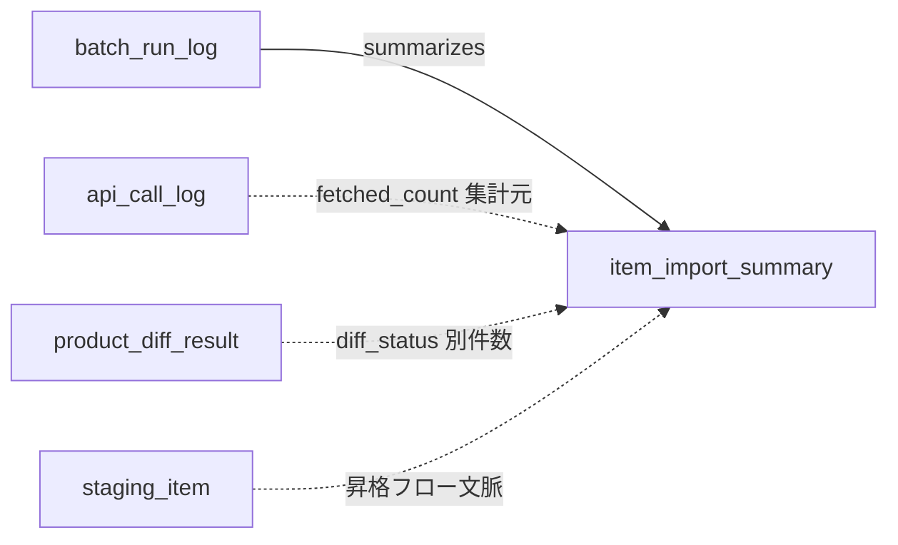
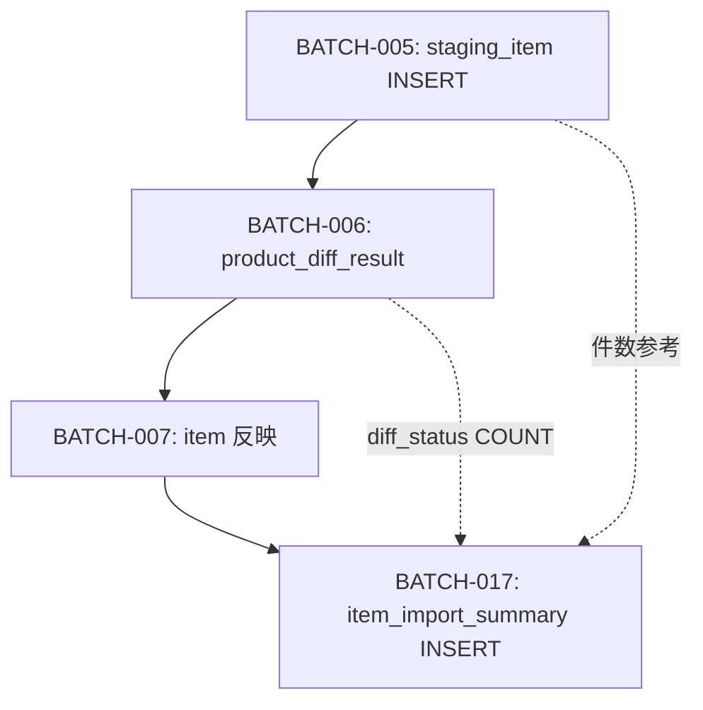

# Item Import Summary テーブル定義書

## 1. ドキュメント情報

| 項目           | 内容                               |
| -------------- | ---------------------------------- |
| ドキュメントID | `DB-TBL-MVP-item_import_summary`   |
| ドキュメント名 | Item Import Summary テーブル定義書 |
| 対象システム   | Gift Recommendation Service MVP    |
| MVP対象        | `yes`                              |
| 作成日         | 2026-06-15                         |
| 更新日         | 2026-06-15（Batch 系 Log Retention 90 日統一・#536 cross-cutting） |

---

## 2. 概要

`item_import_summary` は、外部商品データ連携系における **取込・反映結果の件数サマリ正本** である。

BATCH-017（Import Summary作成 / `MOD-BATCH-047` Item Import Summary Writer）が、同一 `batch_run_id` 内の `api_call_log`・`product_diff_result`・`staging_item` 昇格フロー・`ranking_snapshot` 等を集約し、運用・Observability（IF-OBS-006）で把握する **Log / 集計** 行を INSERT する。

商品 1 件ごとの詳細は保持せず、件数を本テーブルへ集約する（ログ・Observability設計書 §13.4）。**物理 FK なし（LOGICAL + Index）** の Log 系テーブルとする。

---

## 3. 目的

- Batch Run 単位（かつ `source_api` 単位）で取込・反映件数を **1 行に要約** し、大量処理の結果を運用可能な粒度で把握する
- `batch_run_log` との **summarizes** 関係（`batch_run_id`）を物理定義する
- `product_diff_result` の `diff_status` 別件数を **`new_count` / `updated_count` / `unchanged_count` / `unavailable_count`** へ集約する根拠を明記する
- `staging_item` 昇格フロー（BATCH-005〜007）の文脈と、本テーブルが **直接 FK を持たない** 集計関係を整理する
- バッチ処理一覧 BATCH-017 の冪等キー（`batch_run_id` + 集計識別子）を UNIQUE 制約として DDL へ展開可能にする
- 後続 DDL Task が migration を作成できる粒度まで設計を確定する

---

## 4. テーブル基本情報

| 項目 | 内容 |
| ---- | ---- |
| 物理テーブル名 | `item_import_summary` |
| 論理テーブル名 | Item Import Summary |
| 分類 | 外部商品データ連携系 |
| 正本区分 | Log / 集計 |
| 主な更新主体 | batch（BATCH-017 / `MOD-BATCH-047` Item Import Summary Writer） |
| 主な参照主体 | batch（監査・運用分析）、api（Admin Batch 実行履歴 API 経由の間接参照候補）。Online / reco から Direct 参照しない |
| MVP対象 | `yes` |
| 関連物理ER | `docs/06_実装設計/database/物理ER.md` §8–§11 |

---

## 5. 用途・責務

- **Batch Run + Source API 単位** で取込・反映結果の件数サマリを **1 行 INSERT** する（追記型。同一キーの再集計は **UPSERT しない** 前提。§12）
- `batch_run_log.run_status` が `partially_succeeded` のとき **`failed_count`** に Item 反映失敗等を記録する（状態遷移設計書 §6.6）
- 商品単位の過剰ログを避け、件数を本テーブルへ集約する（ログ・Observability設計書 §22・バッチ設計方針書 §21.1）
- Public API では直接返却しない（Admin API は `batch_run_log` 経由でサマリ参照。Import 内訳は API-ADM-005 詳細 API `importSummaries`。OpenAPI 変更は #469 委譲）

### 5.1 対象外

- 商品差分判定結果の明細（`product_diff_result` の責務）
- Staging 中間データ本体（`staging_item` / `staging_item_image` 等の責務）
- Batch 実行ヘッダ本体（`batch_run_log` の責務。`batch_run_id` は LOGICAL 参照のみ）
- 外部 API 呼び出し明細（`api_call_log` の責務）
- Phase / Error 明細（`phase_log` / `error_log` の責務）
- Feature / Embedding / 分布メトリクス本体（`item_feature` / `item_embedding` / `*_metric` の責務。件数のみ本テーブルへ要約可）
- Public API 公開（Epic 終盤 Task #469 へ委譲）

### 5.2 `batch_run_log` → `item_import_summary` 関係（summarizes）

物理ER §9・論理ER §14 に従う。

| 観点 | 方針 |
| ---- | ---- |
| 物理ER 関係 | `batch_run_log` → `item_import_summary` : **`summarizes`**（**LOGICAL** 1:N） |
| 参照列 | **`item_import_summary.batch_run_id`** → `batch_run_log.batch_run_id`（**NOT NULL**） |
| 作成 Batch | BATCH-017（各子 workflow 末尾または集計対象 Batch 完了後） |
| `batch_run_log` 定義書 | **`batch_run_log_テーブル定義書.md`**（#534 完了）。**LOGICAL FK + Index**（§17.1 No.6 確定）。物理 FK は付与しない |
| カーディナリティ | 1 Batch Run : **0..N** Item Import Summary（`source_api` 別に複数行可。§7） |



### 5.3 `product_diff_result` との集計関係

`product_diff_result_テーブル定義書` §5.1 に従い、**件数集計は本テーブルの責務**、差分判定明細は `product_diff_result` が正本。

| 観点 | 方針 |
| ---- | ---- |
| 物理 FK | **なし**（集計は Batch アプリが `batch_run_id` で COUNT） |
| 集計対象 | 同一 `batch_run_id` の `product_diff_result` 行 |
| `new_count` | `COUNT(*) WHERE diff_status = 'new'` |
| `updated_count` | `COUNT(*) WHERE diff_status = 'updated'` |
| `unchanged_count` | `COUNT(*) WHERE diff_status = 'unchanged'` |
| `unavailable_count` | `COUNT(*) WHERE diff_status = 'unavailable'` |
| 前提 Batch | BATCH-006 完了後（`product_diff_result` 行が存在） |
| 非対象 workflow | ランキング専用 workflow（`source_api = item_ranking`）では **0 固定**（§5.6） |

> `product_diff_result` は Retention で短期 DELETE されるが、BATCH-017 は **集計完了後に INSERT** するため、集計時点では行が存在する前提とする。

### 5.4 `staging_item` との関係（昇格フロー文脈）

`staging_item_テーブル定義書` を参照。本テーブルは **`staging_item_id` 列を持たない**。

| 観点 | 方針 |
| ---- | ---- |
| 物理 FK | **なし** |
| データフロー | `staging_item`（BATCH-005）→ BATCH-006 → `product_diff_result` → BATCH-007 Item 反映 → BATCH-017 集計 |
| `fetched_count` 正本 | **`api_call_log.item_count` 合計**（§5.5・§12.1）。`staging_item` 行数は整合確認用の参考のみ |
| 直接参照 | Staging 行単位の trace は `staging_item` / `product_diff_result` で行い、本テーブルは **件数のみ** |



### 5.5 `api_call_log` との関係（fetched_count）

`api_call_log_テーブル定義書` §5.2 に従う。

| 観点 | 方針 |
| ---- | ---- |
| 集計 | 同一 `batch_run_id` + **`source_api`** の `api_call_log.item_count` **合計** を `fetched_count` の主入力とする |
| 代替 | API 商品列がない呼び出し（`item_count = 0`）のみ、同一 `batch_run_id` + `source_api` の `staging_item` 行数で補完してよい（例外ケース。正本は `api_call_log`） |
| 物理 FK | **なし** |

### 5.6 workflow 別集計方針（`source_api`）

バッチ処理一覧 BATCH-017・バッチ設計方針書 §15.2 に従い、子 workflow 末尾で Summary を作成する。

| `source_api` | 典型 workflow | `new/updated/unchanged/unavailable` | その他カウント |
| ------------ | ------------- | ----------------------------------- | -------------- |
| `item_search` | BATCH-003〜007 系 | `product_diff_result` から集計 | `feature_generated_count` 等は同一 Run 内 Feature 系 Batch 完了後に設定（§6 No.12〜13） |
| `item_ranking` | BATCH-002 系 | **0 固定**（差分判定なし） | `fetched_count` = ランキング API 取得件数。**snapshot 専用列は持たない**（§17.1 No.4） |
| `genre_search` | BATCH-001 系 | **0 固定** | `fetched_count` = ジャンル取得件数 |
| `attribute_search` | 将来拡張 | MVP 未使用時は行なし | — |

### 5.7 `skipped_count` と `unavailable_count` の境界

| 列 | 意味（MVP） | 集計元（概要） |
| -- | ----------- | -------------- |
| `unavailable_count` | 取得不能・対象外・Validator 不合格 | `product_diff_result.diff_status = 'unavailable'` |
| `skipped_count` | 意図的スキップ（反映対象外・Bulk unchanged チャンク等） | BATCH-007 で `new`/`updated` 以外のうち **反映を意図的にスキップ** した件数。`unchanged` は **`unchanged_count` へ計上**（二重計上しない） |
| `failed_count` | Item 反映失敗等（GRS-BAT-005） | BATCH-007 失敗件数 + 致命的でない部分失敗（`partially_succeeded` 時） |

---

## 6. カラム定義

| No | カラム名 | 論理名 | 型 | 必須 | PK | FK | Unique | Default | 説明 |
| --: | -------- | ------ | -- | ---- | -- | -- | ------ | ------- | ---- |
| 1 | `item_import_summary_id` | Import Summary ID | `uuid` | `yes` | `yes` | — | `yes` | `gen_random_uuid()` | サロゲート PK |
| 2 | `batch_run_id` | Batch Run ID | `uuid` | `yes` | — | LOGICAL | — | — | 集計対象 Batch Run。`batch_run_log.batch_run_id` 参照 |
| 3 | `source` | Data Source | `text` | `yes` | — | — | — | `'rakuten'` | 外部商品データ元。`item.source` / `api_call_log.source` と同一コード体系 |
| 4 | `source_api` | Source API | `varchar(32)` | `yes` | — | — | — | — | 集計対象 API 種別（§11）。**冪等キー構成要素** |
| 5 | `fetched_count` | Fetched Count | `integer` | `yes` | — | — | — | `0` | API 取得件数（`api_call_log.item_count` 合計等） |
| 6 | `new_count` | New Count | `integer` | `yes` | — | — | — | `0` | 新規件数（`product_diff_result` `new`） |
| 7 | `updated_count` | Updated Count | `integer` | `yes` | — | — | — | `0` | 更新件数（`updated`） |
| 8 | `unchanged_count` | Unchanged Count | `integer` | `yes` | — | — | — | `0` | 差分なし件数（`unchanged`） |
| 9 | `unavailable_count` | Unavailable Count | `integer` | `yes` | — | — | — | `0` | 取得不能・対象外件数（`unavailable`） |
| 10 | `skipped_count` | Skipped Count | `integer` | `yes` | — | — | — | `0` | 意図的スキップ件数（§5.7） |
| 11 | `failed_count` | Failed Count | `integer` | `yes` | — | — | — | `0` | 失敗件数（GRS-BAT-005 等） |
| 12 | `feature_generated_count` | Feature Generated Count | `integer` | `yes` | — | — | — | `0` | Feature 生成件数（Observability §13.3。Feature 系 Batch 未実行時 0） |
| 13 | `embedding_generated_count` | Embedding Generated Count | `integer` | `yes` | — | — | — | `0` | Embedding 生成件数（同上） |
| 14 | `summarized_at` | Summarized At | `timestamptz` | `yes` | — | — | — | — | BATCH-017 集計完了日時（UTC） |
| 15 | `created_at` | Created At | `timestamptz` | `yes` | — | — | — | `now()` | 行作成日時（物理ER §5 timestamp 方針） |

> **論理ER 整合**: 論理ER §9.2・§13.2 を本定義書に合わせて更新済み（#533）。`unavailable_count` / `feature_generated_count` / `embedding_generated_count` はログ・Observability設計書 §13.3 を正として MVP 物理 DDL に採用する。

---

## 7. 主キー・一意キー

| 種別 | 対象カラム | 方針 | 備考 |
| ---- | ---------- | ---- | ---- |
| PRIMARY KEY | `item_import_summary_id` | サロゲート UUID | — |
| UNIQUE | `batch_run_id`, `source_api` | 同一 Batch Run・同一 API 種別は 1 サマリ行 | §17.1 No.1 確定。バッチ処理一覧 BATCH-017 の `summary_type` は **`source_api` に対応** |

---

## 8. 外部キー・参照関係

### 8.1 参照先（論理）

| カラム | 参照先 | FK制約 | 参照整合性 | 備考 |
| ------ | ------ | ------ | ---------- | ---- |
| `batch_run_id` | `batch_run_log.batch_run_id` | `LOGICAL` | BATCH-017 INSERT 前に run 存在 | 物理ER §9 summarizes。§17.1 No.6 確定 |

### 8.2 間接参照（列なし・集計元）

| 観点 | 経路 | 備考 |
| ---- | ---- | ---- |
| 差分件数 | `product_diff_result`（`batch_run_id` + `diff_status`） | §5.3 |
| Staging 昇格 | `staging_item` → `product_diff_result` → Item 反映 | §5.4。直接 FK なし |
| API 取得件数 | `api_call_log`（`batch_run_id` + `source_api`） | §5.5 |
| ランキング取込 | `ranking_snapshot` / `item_popularity_signal` | `source_api = item_ranking` 時。列は持たず件数のみ（§5.6） |

### 8.3 被参照（論理）

| 参照元 | 用途 | 備考 |
| ------ | ---- | ---- |
| Admin Batch 実行履歴 API（API-ADM-005） | 実行サマリ表示・Import 内訳（詳細 API） | 一覧は `batch_run_log` 正本（`batch_run_log_テーブル定義書` §5.6）。`importSummaries` は詳細 API §5.6.2。OpenAPI は #469 |
| Observability IF-OBS-006 | 取込件数監視 | インターフェース一覧 §14.1 |

---

## 9. Index

| Index名 | 対象カラム | 種別 | 用途 | 備考 |
| ------- | ---------- | ---- | ---- | ---- |
| `item_import_summary_pkey` | `item_import_summary_id` | btree（PK） | 主キー | 自動生成 |
| `uq_item_import_summary_run_api` | `batch_run_id`, `source_api` | unique btree | BATCH-017 冪等 INSERT | §7 |
| `idx_item_import_summary_run` | `batch_run_id`, `summarized_at` DESC | btree | Batch Run 単位のサマリ一覧 | Admin / 運用分析 |
| `idx_item_import_summary_source_api` | `source_api`, `summarized_at` DESC | btree | API 種別別の推移分析 | Observability |

---

## 10. 制約

| 制約名 | 種別 | 対象 | 内容 | 備考 |
| ------ | ---- | ---- | ---- | ---- |
| `item_import_summary_pkey` | PRIMARY KEY | `item_import_summary_id` | 主キー | — |
| `uq_item_import_summary_run_api` | UNIQUE | `batch_run_id`, `source_api` | 冪等キー | §7 |
| `chk_item_import_summary_source` | CHECK | `source` | `source = 'rakuten'` | MVP 単一ソース |
| `chk_item_import_summary_source_api` | CHECK | `source_api` | `source_api IN ('item_search','item_ranking','genre_search','attribute_search')` | enum定義書 §6.24 |
| `chk_item_import_summary_counts_nonneg` | CHECK | 各 `*_count` 列 | すべて `>= 0` | 集計列一括 CHECK（DDL Task で列挙） |

---

## 11. 状態・enum

| カラム | enum / code | 定義元 | 許容値 | 備考 |
| ------ | ----------- | ------ | ------ | ---- |
| `source_api` | `source_api` | `enum定義書.md` §6.24 / `packages/code-definitions/batch/source_api.yaml` | `item_search`, `item_ranking`, `genre_search`, `attribute_search` | **NOT NULL**。集計識別子 |

本テーブルは **状態列を持たない**（Log / 集計。INSERT 後の状態遷移なし）。

---

## 12. 更新仕様

| 操作 | 実行主体 | 条件 | 更新項目 | 冪等性 | 備考 |
| ---- | -------- | ---- | -------- | ------ | ---- |
| INSERT | batch | BATCH-017 集計完了 | 全業務列 + `summarized_at` | `(batch_run_id, source_api)` UNIQUE | IF-DB-BATCH-017 |
| SELECT | batch / api（Admin） | 運用分析・履歴表示 | — | — | Direct DB は batch のみ |
| DELETE | batch / 運用ジョブ | Retention 満了 | — | `summarized_at` 基準 | §13 |
| UPDATE | — | — | — | **MVP では行わない** | INSERT 1 回 + `ON CONFLICT DO NOTHING`（§17.1 No.5） |
| INSERT / UPDATE / DELETE | web / reco | — | — | **禁止** | Batch / Admin 経由のみ |

### 12.1 BATCH-017 集計フロー（item_search workflow）

```text
1. batch_run_id に紐づく api_call_log（source_api = item_search）の item_count を合計 → fetched_count
2. 同一 batch_run_id の product_diff_result を diff_status 別に COUNT
   → new_count / updated_count / unchanged_count / unavailable_count
3. BATCH-007 失敗件数を failed_count へ加算（GRS-BAT-005）
4. 意図的スキップ件数を skipped_count へ加算（unchanged は unchanged_count のみ。§5.7）
5. 同一 Run 内で Feature / Embedding Batch 完了済みなら item_generation_queue / item_feature / item_embedding から件数を集計
   → feature_generated_count / embedding_generated_count（未実行時 0）
6. summarized_at = 集計完了時刻
7. item_import_summary INSERT（IF-DB-BATCH-017）
8. batch_run_log 終端状態更新と整合（partially_succeeded 時 failed_count > 0 想定）
```

### 12.2 INSERT 疑似コード

```sql
INSERT INTO item_import_summary (
  batch_run_id,
  source,
  source_api,
  fetched_count,
  new_count,
  updated_count,
  unchanged_count,
  unavailable_count,
  skipped_count,
  failed_count,
  feature_generated_count,
  embedding_generated_count,
  summarized_at
) VALUES (
  :batch_run_id,
  'rakuten',
  :source_api,
  :fetched_count,
  :new_count,
  :updated_count,
  :unchanged_count,
  :unavailable_count,
  :skipped_count,
  :failed_count,
  :feature_generated_count,
  :embedding_generated_count,
  :summarized_at
);
-- ON CONFLICT (batch_run_id, source_api) DO NOTHING（§17.1 No.5）
```

### 12.3 `product_diff_result` 集計クエリ（参考）

```sql
SELECT
  diff_status,
  COUNT(*) AS cnt
FROM product_diff_result
WHERE batch_run_id = :batch_run_id
GROUP BY diff_status;
```

### 12.4 実行タイミング

| タイミング | 根拠 |
| ---------- | ---- |
| Item 反映（BATCH-007）完了後 | 処理構成定義書 §15.2 |
| 各子 workflow 末尾 | バッチ実行スケジュール設計書・バッチ依存関係図 |
| Feature / Embedding 系完了後（同一 Run） | バッチ処理一覧 BATCH-017 先行関係（BATCH-016 後続等） |

---

## 13. データ保持・削除

| 観点 | 方針 |
| ---- | ---- |
| 保持期間 | **90 日**（Human Review #536 No.10 cross-cutting 決定。旧 #533 の 365 日から短縮） |
| 削除方式 | 物理 DELETE（将来 partition 検討可。物理ER §17 No.5） |
| 削除条件 | `summarized_at < now() - interval '90 days'` |
| Batch アンカー | `batch_run_log_テーブル定義書` §13.1（`batch_run_id`） |
| 論理削除 | 列なし |
| 履歴 | **再集計履歴は保持しない**（INSERT 1 行が正本） |
| アーカイブ | MVP 対象外 |

> MVP では **Batch 系 Log 90 日統一**（`error_log_テーブル定義書` §13.3）。長期の商品取込トレンドは後続 Metric / BI Task へ委譲。

---

## 14. Migration / DDL

| 項目 | 内容 |
| ---- | ---- |
| DDL対象 | `item_import_summary` |
| migration単位 | 1 テーブル = 1 migration（DDL Task） |
| 適用順序 | 外部商品データ連携系 Log。**`batch_run_log` 作成後**（`batch_run_id` LOGICAL 参照。#534）。`product_diff_result` / `staging_item` とは **物理 FK なし** |
| rollback方針 | forward migration 主体。DROP は Human Review 必須 |
| 破壊的変更有無 | `no`（初回 CREATE） |

---

## 15. セキュリティ・権限

| 観点 | 方針 |
| ---- | ---- |
| 読み取り権限 | batch（service role 経由）。Admin API 経由の参照は api 層で制御 |
| 書き込み権限 | batch のみ。BATCH-017 Item Import Summary Writer |
| service role利用 | Import Summary Builder に限定 |
| 個人情報・機微情報 | 件数のみ。商品コード・secret 非含有 |
| ログ出力制限 | 集計値の過剰 debug 出力を避ける |

---

## 16. テスト観点

| No | 観点 | 確認内容 | 種別 |
| --: | ---- | -------- | ---- |
| 1 | DDL適用 | CREATE TABLE / Index / CHECK / UNIQUE が定義どおり | migration |
| 2 | 冪等 INSERT | 同一 `(batch_run_id, source_api)` 再 INSERT が拒否または no-op | integration |
| 3 | enum整合 | `source_api` 4 値 CHECK + NOT NULL | migration |
| 4 | 集計整合 | `new+updated+unchanged+unavailable` が `product_diff_result` COUNT と一致 | integration |
| 5 | fetched_count | `api_call_log.item_count` 合計と整合（正本 §5.5。`item_count = 0` 時のみ staging 補完可） | integration |
| 6 | partially_succeeded | Item 一部失敗時 `failed_count > 0` | integration |
| 7 | Retention | 90 日超過行の DELETE ジョブ対象 | integration |
| 8 | 権限 | web client から Direct DB 書き込み不可 | manual |

---

## 17. 未決事項

なし（§17.1 に Human Review 決定事項を記載）。

### 17.1 Human Review 決定事項（Issue #533）

| No | 論点 | 決定内容 | 決定者 | 備考 |
| --: | ---- | -------- | ------ | ---- |
| 1 | UNIQUE キー（`batch_run_id` + `source_api`） | **`(batch_run_id, source_api)` を冪等キーとする**。バッチ処理一覧 BATCH-017 の `summary_type` は **`source_api` に対応** | Human | §7・バッチ処理一覧 BATCH-017 冪等キー更新 |
| 2 | `skipped_count` と `unavailable_count` の定義境界 | **§5.7 を正とする**。`unavailable` = `product_diff_result` 集計、`skipped` = 意図的スキップ、`unchanged` は二重計上しない | Human | 機能×モジュール対応表・状態遷移設計書の「スキップ」語彙と整合 |
| 3 | `fetched_count` の正本（api_call_log vs staging_item） | **`api_call_log.item_count` 合計を正本**とする。`item_count = 0` の API 呼び出しのみ `staging_item` 行数で補完可 | Human | §5.5・§12.1 |
| 4 | `item_ranking` workflow の snapshot 件数列 | **MVP では専用列を持たない**。ランキング取得件数は **`fetched_count`** に集約 | Human | Observability §13.3 準拠。`ranking_snapshot` 明細は別テーブル正本 |
| 5 | 再集計時の UPDATE / DELETE+INSERT | **MVP は INSERT 1 回のみ**。再実行時は **`ON CONFLICT (batch_run_id, source_api) DO NOTHING`**。UPDATE / DELETE+INSERT は行わない | Human | §12 |
| 6 | `batch_run_log` 物理 FK | **MVP は LOGICAL FK + Index**（`api_call_log` 同型）。#534 完了後も物理 FK は付与しない | Human | `batch_run_log_テーブル定義書`（#534）と整合 |
| 7 | Retention 具体日数 | **90 日**（#536 No.10 で Batch 系 Log 統一。旧 365 日から短縮） | Human | §13 |

---

## 18. 関連資料

| 種別 | パス / URL | 用途 |
| ---- | ---------- | ---- |
| 物理ER | `docs/06_実装設計/database/物理ER.md` | summarizes 関係・Log 系分類 |
| 論理ER | `docs/05_アプリケーション設計/アプリ/database/論理ER.md` | §9.2 属性・Batch / chunk 集計 |
| テーブル一覧 | `docs/05_アプリケーション設計/アプリ/database/テーブル一覧.md` | §6 No.26 |
| ログ・Observability | `docs/05_アプリケーション設計/アプリ/ログ・Observability設計書.md` | §13.3 / §20.2 Retention |
| バッチ設計方針書 | `docs/05_アプリケーション設計/アプリ/batch/バッチ設計方針書.md` | BATCH-017・集計単位 |
| バッチ処理一覧 | `docs/05_アプリケーション設計/アプリ/batch/バッチ処理一覧.md` | BATCH-017 入出力・冪等キー |
| インターフェース一覧 | `docs/05_アプリケーション設計/アプリ/インターフェース一覧.md` | IF-DB-BATCH-017 / IF-OBS-006 |
| product_diff_result | `docs/06_実装設計/database/product_diff_result_テーブル定義書.md` | 件数集計元・責務境界 |
| staging_item | `docs/06_実装設計/database/staging_item_テーブル定義書.md` | 昇格フロー文脈 |
| api_call_log | `docs/06_実装設計/database/api_call_log_テーブル定義書.md` | fetched_count 参考 |
| batch_run_log | `docs/06_実装設計/database/batch_run_log_テーブル定義書.md` | §5.2 summarizes・API-ADM-005 §5.6.2 importSummaries |
| enum | `docs/06_実装設計/database/enum定義書.md` | §6.24 source_api |
| packages | `packages/code-definitions/batch/source_api.yaml` | source_api 正本 |

---

## 19. レビュー観点

- テーブル一覧 §6 No.26・論理ER §9.2・物理ER summarizes と矛盾していないか
- `batch_run_log` / `product_diff_result` / `staging_item` との関係が §5 で明記されているか
- カラム・型・制約・Index が DDL Task へ展開できる粒度か
- `source_api` enum と packages 正本が一致しているか
- Observability §13.3 の主要項目（`unavailable_count` / Feature / Embedding 件数）が反映されているか
- Retention **90 日** が §13 で明記されているか
- out_of_scope（DDL / apps / OpenAPI）に触れていないか
- secret や `.env` 実値が含まれていないか
