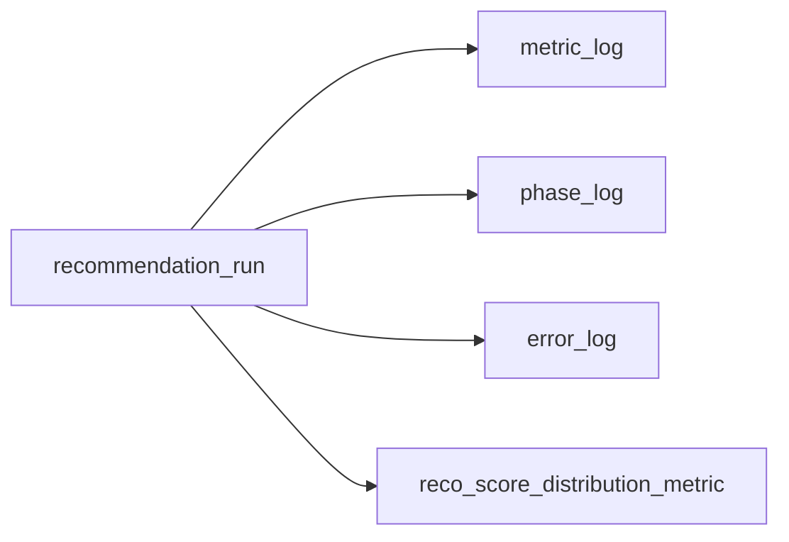

# Metric Log テーブル定義書

## 1. ドキュメント情報

| 項目           | 内容                            |
| -------------- | ------------------------------- |
| ドキュメントID | `DB-TBL-MVP-metric_log`         |
| ドキュメント名 | Metric Log テーブル定義書         |
| 対象システム   | Gift Recommendation Service MVP |
| MVP対象        | `yes`                           |
| 作成日         | 2026-07-08                      |
| 更新日         | 2026-07-08（Composition Epic #1076 工程 ①・Tier 1 Postgres 永続化 Human 判断反映） |

---

## 2. 概要

`metric_log` は、Online 推薦 **1 Run 成功終端** における **Run 集約 Metric（Tier 1 / Tier 1b）** を reco が記録する Log / Observability 系テーブルである。

MOD-RECO-025 Metric Logger が `ExecutionContext` から組み立てる `MetricRecord`（InMemory 正本）を Postgres へ永続化する物理正本となる。レイテンシ・候補件数ファネル・0 件フラグ・Reason fallback 件数等を **1 Run = 1 行** で保持する。

IF-OBS-005（Metric 記録）の Tier 1 系 DB 正本。Public API では返却しない（内部監視・性能分析データ）。

> **Human 判断（2026-07-08）**: Composition Epic #1076 において Tier 1（本テーブル）と Tier 2（§12 分布 Metric → `reco_score_distribution_metric`）の **両方** を Postgres 化する。本定義書は **Tier 1 / Tier 1b のみ** を扱う。

---

## 3. 目的

- MOD-RECO-025 §9.1 / §9.2（Tier 1 / Tier 1b）および `MetricRecord` 列を物理 DDL へ写像する
- `recommendation_run_id` / `trace_id` により `recommendation_run` / `phase_log` / `error_log` と横断 trace 可能にする
- §12 分布 Metric（Tier 2）と責務分離し、`reco_score_distribution_metric` へ委譲する
- 後続 DDL Task（Composition 工程 ②）が migration を作成できる粒度まで設計を確定する

---

## 4. テーブル基本情報

| 項目 | 内容 |
| ---- | ---- |
| 物理テーブル名 | `metric_log` |
| 論理テーブル名 | Metric Log / メトリクスログ |
| 分類 | Log / Observability系 / Metric |
| 正本区分 | Log / Metric（Run 集約スナップショット） |
| 主な更新主体 | **reco**（MOD-RECO-025 / Orchestrator 成功終端。IF-OBS-005） |
| 主な参照主体 | reco（性能分析）、batch（将来の日次集計・監視。MVP では読み取り中心） |
| MVP対象 | `yes` |
| 関連物理ER | `docs/06_実装設計/database/物理ER.md` §8–§11（Log 系。本 Task 時点では行未登録・追随 Task へ） |

> **schema 分割**: MVP 物理 DDL は **`public` 単一 schema**（Metric 系列先例 `reco_score_distribution_metric` と同型）。

---

## 5. 用途・責務

- reco が Recommendation Run **成功終端**（`MOD-RECO-025 MetricLoggerPort.record_metrics()`）で **1 行 INSERT** する
- Run 全体レイテンシ（`recommendation_latency_ms`）および候補件数ファネル（§11.3）を Run 単位で固定保存する
- `recommendation_empty` / `reason_fallback_count` により 0 件 Run・Reason fallback 発生を trace 可能にする
- Tier 1b（主要フェーズ latency 列）は **nullable 物理列** として保持し、未観測時は NULL とする
- **追記型 Log**。同一 `recommendation_run_id` への再 INSERT は **禁止**（1 Run 1 行。§12.1）
- Run 全体トランザクションには **参加しない**（MOD-RECO-025 §8.5）。独立 commit

### 5.1 対象外

- §12 **分布 Metric**（`final_score_distribution` / `social_match_distribution` 等）→ **`reco_score_distribution_metric`**（Tier 2 正本）
- Feature / Meaning / Normalization 分布（各 `*_distribution_metric` テーブル）
- サービス横断集計（`recommendation_run_count` 等）→ monitoring / 日次 batch
- フェーズ単位進行（`phase_log` の責務）
- 障害詳細（`error_log` の責務）
- Batch Run / Evaluation Run 向け Metric 行（MVP では **Online `recommendation_run` のみ**。拡張は別 Task）
- Public API 公開
- DDL / migration 本体（工程 ② Task へ委譲）

### 5.2 `reco_score_distribution_metric`（Tier 2）との責務境界

| 観点 | `metric_log`（本テーブル） | `reco_score_distribution_metric` |
| ---- | -------------------------- | -------------------------------- |
| Tier | **Tier 1 / Tier 1b**（Run 集約） | **Tier 2**（分布統計量） |
| 粒度 | **1 Run = 1 行** | **1 Run × score_type = 1 行**（MVP partial） |
| 典型列 | latency / candidate counts / empty flag | mean / stddev / 分位点 / sample_count |
| 入力 | `ExecutionContext`（Orchestrator 集約） | `recommendation_result_item` 集合から集計 |
| 更新主体 | MOD-RECO-025（成功終端 1 回） | reco（Ranking 完了・Result Item 保存後） |
| 正本 docs | 本定義書 | `reco_score_distribution_metric_テーブル定義書` |

### 5.3 `phase_log` / `error_log` との trace 連携

| 観点 | 方針 |
| ---- | ---- |
| Run キー | **`recommendation_run_id`** を必須保持（LOGICAL FK） |
| trace | **`trace_id`** を nullable で保持。`phase_log.trace_id` / `error_log.trace_id` と **同一値推奨** |
| 責務分離 | フェーズ進行は `phase_log`、障害は `error_log`、Run 集約 Metric は **本テーブル** |
| 記録タイミング | Orchestrator パイプライン **成功終端**（Result 返却前後。MOD-RECO-025 §8.1） |



### 5.4 MOD-RECO-025 `MetricRecord` / §9.1 写像

| `MetricRecord` / §9.1 | 物理カラム | 備考 |
| --------------------- | ---------- | ---- |
| `recommendation_run_id` | `recommendation_run_id` | NOT NULL。UNIQUE |
| `trace_id` | `trace_id` | nullable |
| `recommendation_latency_ms` | `recommendation_latency_ms` | NOT NULL |
| `pre_filter_candidate_count` | `pre_filter_candidate_count` | nullable |
| `retrieval_candidate_count` | `retrieval_candidate_count` | nullable |
| `post_filter_candidate_count` | `post_filter_candidate_count` | nullable |
| `final_result_count` | `final_result_count` | NOT NULL |
| `recommendation_empty` | `recommendation_empty` | NOT NULL |
| `reason_fallback_count` | `reason_fallback_count` | NOT NULL |
| `retrieval_phase_latency_ms` | `retrieval_phase_latency_ms` | Tier 1b。nullable |
| `matching_latency_ms` | `matching_latency_ms` | Tier 1b。nullable |
| `ranking_latency_ms` | `ranking_latency_ms` | Tier 1b。nullable |
| `reason_generation_latency_ms` | `reason_generation_latency_ms` | Tier 1b。nullable |
| `recorded_at` | `recorded_at` | NOT NULL |
| `metric_source` | `metric_source` | NOT NULL。既定 `'MOD-RECO-025'` |

### 5.5 ログ・Observability設計書 §11.2 との差分整理

| Observability §11.2 | 本テーブル（MVP Tier 1） | 扱い |
| ------------------- | ------------------------ | ---- |
| `recommendation_latency_ms` | **採用** | Run 集約 |
| `phase_duration_ms` | **物理列なし** | Tier 1b 個別 latency 列または `phase_log.duration_ms` で代替 |
| `pre_filter_candidate_count` 等ファネル | **採用** | §11.3 |
| `final_result_count` | **採用** | |
| `recommendation_empty_count` / `rate` | **`recommendation_empty` フラグのみ** | 率・横断 count は batch / monitoring |
| `recommendation_run_count` 等サービス横断 | **対象外** | §9.3 |
| `*_distribution` 系 | **対象外** | Tier 2 → `reco_score_distribution_metric` |

---

## 6. カラム定義

| No | カラム名 | 論理名 | 型 | 必須 | PK | FK | Unique | Default | 説明 |
| --: | -------- | ------ | -- | ---- | -- | -- | ------ | ------- | ---- |
| 1 | `metric_log_id` | Metric Log ID | `uuid` | `yes` | `yes` | — | `yes` | `gen_random_uuid()` | サロゲート PK |
| 2 | `trace_id` | Trace ID | `text` | `no` | — | — | — | `NULL` | 横断追跡 ID（§5.3） |
| 3 | `recommendation_run_id` | Recommendation Run ID | `uuid` | `yes` | — | LOGICAL | `yes` | — | Run 正本キー。1 Run 1 行 |
| 4 | `recommendation_latency_ms` | Recommendation Latency Ms | `integer` | `yes` | — | — | — | — | 推薦全体処理時間（ms） |
| 5 | `pre_filter_candidate_count` | Pre Filter Candidate Count | `integer` | `no` | — | — | — | `NULL` | Pre Hard Filter 後候補数 |
| 6 | `retrieval_candidate_count` | Retrieval Candidate Count | `integer` | `no` | — | — | — | `NULL` | Retrieval 後候補数 |
| 7 | `post_filter_candidate_count` | Post Filter Candidate Count | `integer` | `no` | — | — | — | `NULL` | Post Hard Filter 後候補数 |
| 8 | `final_result_count` | Final Result Count | `integer` | `yes` | — | — | — | — | 最終推薦件数（0 可） |
| 9 | `recommendation_empty` | Recommendation Empty | `boolean` | `yes` | — | — | — | `false` | 0 件 Result フラグ |
| 10 | `reason_fallback_count` | Reason Fallback Count | `integer` | `yes` | — | — | — | `0` | Reason 汎用文注入件数 |
| 11 | `retrieval_phase_latency_ms` | Retrieval Phase Latency Ms | `integer` | `no` | — | — | — | `NULL` | Tier 1b。Retrieval フェーズ latency |
| 12 | `matching_latency_ms` | Matching Latency Ms | `integer` | `no` | — | — | — | `NULL` | Tier 1b。Matching フェーズ latency |
| 13 | `ranking_latency_ms` | Ranking Latency Ms | `integer` | `no` | — | — | — | `NULL` | Tier 1b。Ranking フェーズ latency |
| 14 | `reason_generation_latency_ms` | Reason Generation Latency Ms | `integer` | `no` | — | — | — | `NULL` | Tier 1b。Reason 生成 latency |
| 15 | `recorded_at` | Recorded At | `timestamptz` | `yes` | — | — | — | — | Metric 記録日時（UTC。MOD-RECO-025 が設定） |
| 16 | `metric_source` | Metric Source | `varchar(32)` | `yes` | — | — | — | `'MOD-RECO-025'` | 記録モジュール識別子 |
| 17 | `created_at` | Created At | `timestamptz` | `yes` | — | — | — | `now()` | 行作成日時（Retention DELETE 用） |

---

## 7. 主キー・一意キー

| 種別 | 対象カラム | 方針 | 備考 |
| ---- | ---------- | ---- | ---- |
| PRIMARY KEY | `metric_log_id` | サロゲート UUID | — |
| UNIQUE | `recommendation_run_id` | **1 Run 1 行** | `uq_metric_log_recommendation_run`。MOD-RECO-025 §8.5 |

---

## 8. 外部キー・参照関係

### 8.1 参照先

| カラム | 参照先 | FK制約 | 備考 |
| ------ | ------ | ------ | ---- |
| `recommendation_run_id` | `recommendation_run.recommendation_run_id` | **LOGICAL**（MVP 物理 FK なし） | Log 系方針。INSERT 前にアプリで存在確認 |

### 8.2 被参照

| 参照元 | 関係 | 備考 |
| ------ | ---- | ---- |
| — | — | MVP では他テーブルからの物理 FK なし |

---

## 9. Index

| Index名 | 対象カラム | 種別 | 用途 | 備考 |
| ------- | ---------- | ---- | ---- | ---- |
| `metric_log_pkey` | `metric_log_id` | btree（PK） | 主キー | 自動生成 |
| `uq_metric_log_recommendation_run` | `recommendation_run_id` | btree（UNIQUE） | 1 Run 1 行保証 | §7 |
| `idx_metric_log_trace` | `trace_id` | btree | 横断 trace 検索 | nullable |
| `idx_metric_log_recorded` | `recorded_at` | btree | 期間検索・分析 | |
| `idx_metric_log_created` | `created_at` | btree | Retention DELETE | §13 |

---

## 10. 制約

| 制約名 | 種別 | 対象 | 内容 | 備考 |
| ------ | ---- | ---- | ---- | ---- |
| `metric_log_pkey` | PRIMARY KEY | `metric_log_id` | 主キー | — |
| `uq_metric_log_recommendation_run` | UNIQUE | `recommendation_run_id` | Run 単位 1 行 | §12.1 |
| `chk_metric_log_latency_nonneg` | CHECK | `recommendation_latency_ms` | `>= 0` | |
| `chk_metric_log_counts_nonneg` | CHECK | 件数列 | `IS NULL OR >= 0` | pre/retrieval/post filter, final_result, reason_fallback |
| `chk_metric_log_tier1b_latency_nonneg` | CHECK | Tier 1b latency 列 | `IS NULL OR >= 0` | §9.2 |
| `chk_metric_log_metric_source` | CHECK | `metric_source` | `metric_source = 'MOD-RECO-025'` | MVP 単一 writer |

---

## 11. 状態・enum

`metric_log` は **状態カラムを持たない**（Run 集約スナップショット 1 行）。

| カラム | enum / code | 定義元 | 許容値 | 備考 |
| ------ | ----------- | ------ | ------ | ---- |
| `metric_source` | 固定 code | MOD-RECO-025 §9.1 | `MOD-RECO-025` | MVP CHECK |

---

## 12. 更新仕様

| 操作 | 実行主体 | 条件 | 更新項目 | 冪等性 | 備考 |
| ---- | -------- | ---- | -------- | ------ | ---- |
| INSERT | reco（MOD-RECO-025） | Orchestrator 成功終端・`run_id` 非 NULL | 全列（§6） | **同一 Run 再 INSERT 禁止**（UNIQUE） | IF-OBS-005 |
| UPDATE | — | MVP **禁止** | — | — | 追記型 Log |
| DELETE | — | MVP 原則禁止 | — | — | Retention Batch は後続 Task |

### 12.1 典型フロー（Online Recommendation Run）

```sql
INSERT INTO metric_log (
  trace_id,
  recommendation_run_id,
  recommendation_latency_ms,
  pre_filter_candidate_count,
  retrieval_candidate_count,
  post_filter_candidate_count,
  final_result_count,
  recommendation_empty,
  reason_fallback_count,
  retrieval_phase_latency_ms,
  matching_latency_ms,
  ranking_latency_ms,
  reason_generation_latency_ms,
  recorded_at,
  metric_source
) VALUES (
  :trace_id,
  :recommendation_run_id,
  :recommendation_latency_ms,
  :pre_filter_candidate_count,
  :retrieval_candidate_count,
  :post_filter_candidate_count,
  :final_result_count,
  :recommendation_empty,
  :reason_fallback_count,
  :retrieval_phase_latency_ms,
  :matching_latency_ms,
  :ranking_latency_ms,
  :reason_generation_latency_ms,
  :recorded_at,
  'MOD-RECO-025'
);
```

### 12.2 記録スキップ条件（アプリ層）

MOD-RECO-025 §8.3 / §10.2 を正とする。

| 条件 | DB 操作 |
| ---- | ------- |
| `recommendation_run_id` が NULL | **INSERT しない**（warn のみ） |
| Repository 失敗 | **INSERT しない**（warn のみ。推薦返却継続） |
| Run 失敗終端 | **INSERT しない**（成功終端のみ） |

---

## 13. データ保持・削除

| 観点 | 方針 |
| ---- | ---- |
| 保持期間 | **90 日**（Log 系 cross-cutting。`phase_log` / `error_log` と整合。データ管理要件 §保持） |
| 削除方式 | 後続 Retention Batch による **物理 DELETE** 候補 |
| 削除条件 | `created_at < now() - interval '90 days'` |
| 論理削除 | 採用しない |
| partition | MVP **未適用**。`idx_metric_log_created` + retention DELETE |
| アーカイブ | MVP 対象外 |

---

## 14. Migration / DDL

| 項目 | 内容 |
| ---- | ---- |
| DDL対象 | `metric_log` |
| migration単位 | 1 テーブル = 1 migration（Composition 工程 ② Task） |
| 適用順序 | **`recommendation_run` 後**（`recommendation_run_id` LOGICAL 参照）。`phase_log` / `error_log` と **並行可** |
| rollback方針 | forward migration 主体。DROP は Human Review 必須 |
| 破壊的変更有無 | `no`（初回 CREATE） |

---

## 15. セキュリティ・権限

| 観点 | 方針 |
| ---- | ---- |
| 読み取り権限 | reco / batch（service role 経由）のみ |
| 書き込み権限 | **reco のみ**（MVP）。web client からの Direct DB DML 禁止 |
| service role利用 | Metric 記録に限定 |
| 個人情報・機微情報 | Request 自由記述・個人情報を **物理列に含めない** |
| ログ出力制限 | Metric 行全文をアプリ標準ログに過剰出力しない |

---

## 16. テスト観点

| No | 観点 | 確認内容 | 種別 |
| --: | ---- | -------- | ---- |
| 1 | DDL適用 | CREATE TABLE / Index / CHECK / UNIQUE が定義どおり | migration |
| 2 | MetricRecord 写像 | INSERT 列が `MetricRecord` と 1:1 | integration |
| 3 | 1 Run 1 行 | 同一 `recommendation_run_id` 再 INSERT が UNIQUE 違反 | integration |
| 4 | Tier 2 分離 | 分布統計が本テーブルに混入しない | manual |
| 5 | trace | `trace_id` で phase_log / error_log と横断検索可能 | integration |
| 6 | スキップ | `run_id` NULL 時に INSERT されない | unit / integration |
| 7 | 権限 | web client から Direct DB アクセス不可 | manual |

---

## 17. 未決事項

| No | 論点 | 判断が必要な理由 | 判断者 | 期限 | 備考 |
| --: | ---- | ---------------- | ------ | ---- | ---- |
| - | なし | Tier 1 / Tier 2 境界は Human 判断（2026-07-08）で確定 | — | — | Batch / Evaluation 向け `metric_log` 拡張は Batch 及び Evaluation の設計時に検討する |

---

## 18. 関連資料

| 種別 | パス / URL | 用途 |
| ---- | ---------- | ---- |
| モジュール仕様書 | `docs/06_実装設計/reco/MOD-RECO-025_Metric Loggerモジュール仕様書.md` | §9.1 / §16.2 Tier 1 |
| Tier 2 定義書 | `docs/06_実装設計/database/reco_score_distribution_metric_テーブル定義書.md` | 分布 Metric 正本 |
| Run 定義書 | `docs/06_実装設計/database/recommendation_run_テーブル定義書.md` | owner / trace |
| Phase Log 定義書 | `docs/06_実装設計/database/phase_log_テーブル定義書.md` | Log 系構成参考 |
| Observability 設計書 | `docs/05_アプリケーション設計/アプリ/ログ・Observability設計書.md` | §11.2 |
| MetricRecord 実装 | `apps/reco/src/reco/application/metric-logger/models.py` | 列写像正本 |
| Composition Epic | `prompts/definitions/epics/mod-reco-001-composition/epic.yaml` | Human 判断・工程順 |

---

## 19. レビュー観点

- テーブル一覧・物理ER・論理ER との矛盾がない（追随 Task で行追加予定）
- MOD-RECO-025 §9.1 / `MetricRecord` とカラムが 1:1 対応している
- Tier 2 分布 Metric が `reco_score_distribution_metric` に分離されている
- DDL / migration が工程 ② に委譲されている
- secret や `.env` 実値が含まれていない
