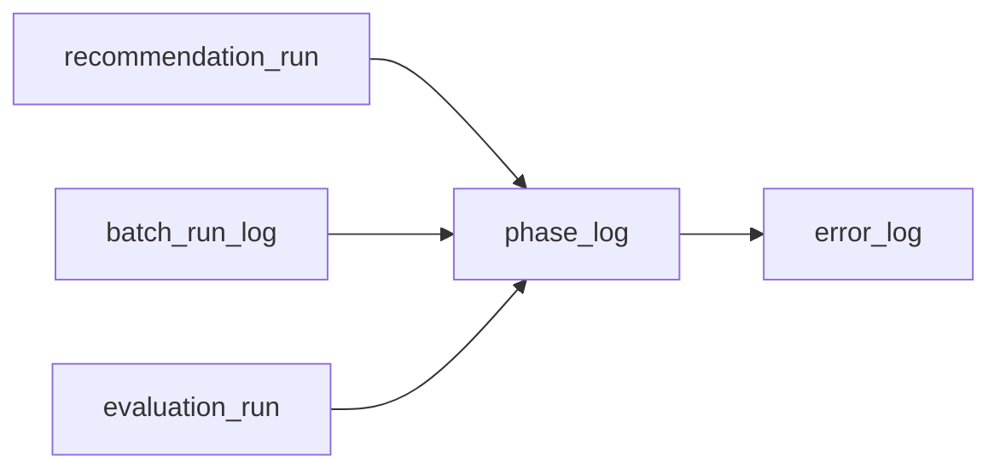
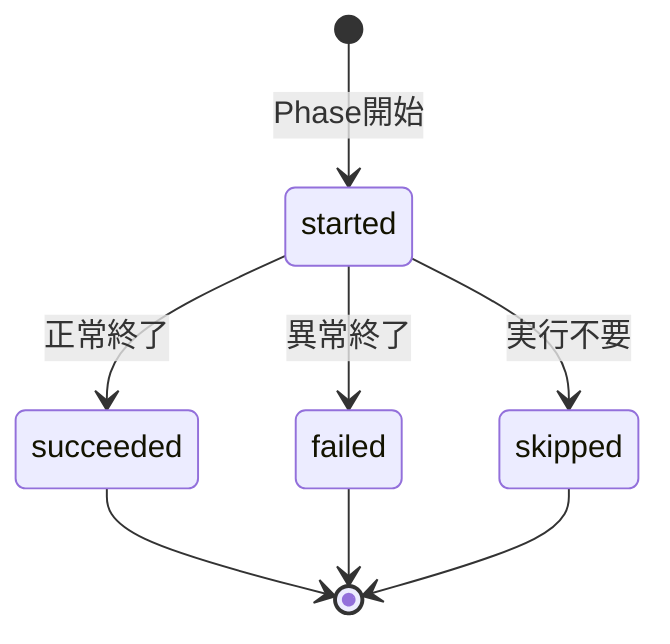

# Phase Log テーブル定義書

## 1. ドキュメント情報

| 項目           | 内容                            |
| -------------- | ------------------------------- |
| ドキュメントID | `DB-TBL-MVP-phase_log`          |
| ドキュメント名 | Phase Log テーブル定義書          |
| 対象システム   | Gift Recommendation Service MVP |
| MVP対象        | `yes`                           |
| 作成日         | 2026-06-15                      |
| 更新日         | 2026-06-15（Batch 系 Log Retention 90 日統一・#536 cross-cutting） |

---

## 2. 概要

`phase_log` は、Recommendation Run / Batch Run / Evaluation Run 等の **主要処理フェーズ単位** の開始・終了・成否を api / reco / batch が記録する Log 系テーブルである。

論理ER上の `recommendation_run_phase_log` は **物理化せず**、本テーブルへ統合する（テーブル一覧 §11 補足・物理ER §16）。Run 本体の `run_status` を細かく更新しすぎない方針の代替として、途中経過を Phase Log で追跡する（状態遷移設計書 §5.1.4・ログ・Observability設計書 §10.1）。

IF-DB-RECO-009（Phase / Error Log 保存）・IF-OBS-001（Phase Log 記録）の DB 正本となる。Public API では返却しない（内部監査・障害調査データ）。

---

## 3. 目的

- polymorphic `owner_type` / `owner_id` により、Online 推薦・Batch・Evaluation のフェーズ履歴を **1 テーブル** で統合記録する
- `phase_status`（`started` / `succeeded` / `failed` / `skipped`）でフェーズ単位の成否を追跡し、Run 本体状態と分離する
- `owner_type` に応じた `phase_name`（`recommendation_run_phase_name` / `batch_run_phase_name`）を CHECK で整合させる
- `trace_id` により api / reco / batch / error_log / metric との横断追跡を可能にする
- 後続 DDL Task が migration を作成できる粒度まで設計を確定する

---

## 4. テーブル基本情報

| 項目 | 内容 |
| ---- | ---- |
| 物理テーブル名 | `phase_log` |
| 論理テーブル名 | Phase Log |
| 分類 | Log / Observability系 |
| 正本区分 | Log |
| 主な更新主体 | api / reco / batch |
| 主な参照主体 | api / reco / batch（障害調査・性能分析） |
| MVP対象 | `yes` |
| 関連物理ER | `docs/06_実装設計/database/物理ER.md` §8–§11 |

---

## 5. 用途・責務

- **主要フェーズ 1 回 = 1 行** を INSERT し、`phase_status` でライフサイクルを管理する（状態遷移設計書 §5.1.5）
- フェーズ開始時に `started`、終了時に `succeeded` / `failed` / `skipped` へ UPDATE する（終端状態は再遷移しない）
- `detail_json` には **マスキング済み** のフェーズ補足情報のみ保存する（件数・分布サマリ等。§5.5）
- 詳細な障害情報は **`error_log` に分離** する。本テーブルの `error_code` はフェーズ失敗時の **要約コード**（§5.6）
- **追記型 Log**。同一 `phase_log_id` の履歴改変は行わず、フェーズ再実行は **新規行 INSERT** とする（§12）
- `recommendation_run_phase_log` 相当の記録は `owner_type = recommendation_run` / `owner_id = recommendation_run_id` で行う（§5.2）

### 5.1 対象外

- Run 本体の終端状態（`recommendation_run.run_status` / `batch_run_log.run_status` / `evaluation_run.evaluation_status` の責務）
- エラー詳細本文（`error_log` の責務。本テーブルはフェーズ成否と要約のみ）
- 外部 API 呼び出し単位ログ（`api_call_log` の責務）
- 商品取込件数集計（`item_import_summary` の責務）
- Metric 分布統計（各種 `*_metric` テーブルの責務）
- `recommendation_run_phase_log` 物理テーブル（作成しない）
- Public API 公開

### 5.2 `recommendation_run_phase_log` 統合方針

| 観点 | 方針 |
| ---- | ---- |
| 物理テーブル | **`recommendation_run_phase_log` は作成しない**（テーブル一覧 §11 補足・物理ER §16） |
| 論理ER 上の関係 | `recommendation_run` → `recommendation_run_phase_log` は、物理では `recommendation_run` → `phase_log`（`records`）に読み替える |
| owner 設計 | `owner_type = recommendation_run`、`owner_id = recommendation_run_id` |
| phase_name | `recommendation_run_phase_name` enum 準拠（enum定義書 §6.18） |
| 粒度 | Online 推薦の主要フェーズ単位（十数行 / Run オーダー） |

### 5.3 polymorphic `owner_type` / `owner_id` と records 関係

論理ER §13.1・物理ER §9・ログ・Observability設計書 §10.1 に従う。

| owner_type（MVP） | owner_id 参照先 | 関係 | FK制約 | 主な phase_name 定義元 |
| ----------------- | --------------- | ---- | ------ | ------------------------ |
| `recommendation_run` | `recommendation_run.recommendation_run_id` | records | `LOGICAL` | `recommendation_run_phase_name`（§6.18） |
| `batch_run` | `batch_run_log.batch_run_id` | records | `LOGICAL` | `batch_run_phase_name`（§6.19） |
| `evaluation_run` | `evaluation_run.evaluation_run_id` | records | `LOGICAL` | **MVP: アプリ validation のみ**（`evaluation_run_phase_name` 未定義。§11.3） |



| 観点 | 方針 |
| ---- | ---- |
| polymorphic 参照 | **`owner_type` + `owner_id` の組で owner を特定**。物理 FK は張らない（物理ER §17 No.3） |
| `owner_id` | **`owner_type` ごとに参照先テーブルが異なる**。INSERT 前にアプリで存在確認 |
| error_log との差分 | `error_log` は `api_call` / `raw_product_metadata` / `item_generation_queue` 等も owner に取り得る。**`phase_log` の MVP owner は上表 3 種に限定**（§11.3） |
| batch_run_log 定義書 | #534 Task で双方向整合。本 Task では records 関係の整理のみ |

### 5.4 ログ・Observability設計書 §10.2 / 論理ER §13.2 との差分整理

| ログ・Observability設計書 §10.2 | 論理ER §13.2 | 本テーブル（MVP 物理 DDL） | 扱い |
| ------------------------------- | ------------ | -------------------------- | ---- |
| `phase_log_id` | `phase_log_id` | **`phase_log_id`** | 一致 |
| `trace_id` | 未列挙 | **`trace_id`** | Observability trace 連携のため **採用**（nullable） |
| `owner_type` | `owner_type` | **`owner_type`** | 一致 |
| `owner_id` | `owner_id` | **`owner_id`** | 一致 |
| `phase_name` | `phase_name` | **`phase_name`** | 一致 |
| `phase_status` | `phase_status` | **`phase_status`** | 一致 |
| `started_at` | `started_at` | **`started_at`** | 一致 |
| `completed_at` | `completed_at` | **`completed_at`** | 一致 |
| `duration_ms` | 未列挙 | **`duration_ms`** | Observability 性能分析のため **採用**（nullable） |
| `error_code` | 未列挙 | **`error_code`** | フェーズ失敗要約のため **採用**（nullable。詳細は error_log） |
| `detail_json` | `detail_json` | **`detail_json`** | 一致（`jsonb` 型） |
| — | 未列挙 | **`created_at` / `updated_at`** | Retention DELETE・終端 UPDATE のため **採用**（物理ER §5 timestamp 方針） |

### 5.5 `detail_json` 保存方針（マスキング）

ログ・Observability設計書 §14.3 相当を正とする。`detail_json` に以下を **含めない**。

- API キー / Application ID / Authorization Header / Secret
- Recommendation Request / Feedback の自由記述全文（個人情報混入リスク）
- Raw レスポンス本文
- **LLM prompt 全文**（実行時に組み立てたプロンプト。テンプレート本文・ユーザー自由入力の埋め込みを含む）
- `error_detail_json` 相当のスタックトレース全文（詳細は `error_log`）

> **Human Review #535 決定**: `detail_json` に LLM prompt 全文は **含めない**（テーブル一覧 §12「LLM prompt全文: 原則非保存」と整合）。

**LLM プロンプト改善の参照先（MVP）**: 本番 Run の実行時 prompt を DB に残す設計は **ない**。改善・再現は以下を正本とする。

| 用途 | 参照先 | 内容 |
| ---- | ------ | ---- |
| プロンプト定義（版） | `reason_template`（`template_body`） | Reason 生成テンプレート正本 |
| プロンプト版 ID | `recommendation_reason.reason_basis` の `llm_prompt_version` | LLM 利用時の版識別子（全文ではない） |
| Semantic 側プロンプト版 | `semantic_config_version` 管理の `llm_prompt_version` | Semanticルール定義書 §16.1。実体は seed / YAML（semantic_rule 設計） |
| 抽出・生成結果 | `user_semantic` / `item_semantic` / `recommendation_reason` | LLM **出力** と reason 文面（入力 prompt ではない） |
| 版・再現性 | `recommendation_run` の `semantic_config_version_id` / `model_version_id` 等 | Run 時点の設定固定 |
| 品質改善入力 | `recommendation_feedback` / Evaluation 系（`evaluation_case` 等） | オフライン評価・フィードバック |

実行時 prompt のアーカイブ専用テーブルは MVP では作成しない。必要時マスク保存はテーブル一覧 §12 の例外方針に従い、別 Task で検討する。

**保存してよい例**（マスキング済み）:

- フェーズ別候補件数（`retrieval_candidate_count` 等）
- 処理時間サマリ
- Config Version ID（UUID）
- 軽量な分布サマリ（具体キーは実装 Task で Observability 設計書に整合）

### 5.6 `phase_log.error_code` と `error_log` の責務境界

| 観点 | `phase_log` | `error_log` |
| ---- | ----------- | ----------- |
| 目的 | フェーズ成否の要約 | 障害調査の詳細記録 |
| `error_code` | フェーズ失敗時の **代表コード**（nullable） | **必須**（`error_code`） |
| 詳細 | `detail_json`（軽量サマリ） | `error_message` / `error_detail_json` |
| 記録タイミング | フェーズ終端 UPDATE 時 | 障害発生時（failed 必須ではない） |
| 例 | `GRS-RECO-003` を phase 失敗要約として記録 | 同一事象の stack / context を error_log へ |

API-INT-002 の `SCORE_BREAKDOWN_MISSING` 相当は **phase_log / error_log の双方** に記録しうる（契約仕様書 §13.1）。本テーブルでは `phase_status = failed` または `succeeded`（警告付き成功）時の `error_code` / `detail_json` で要約する。

### 5.7 Observability §10.3 `reco_quality_metric_recorded` との差分

ログ・Observability設計書 §10.3 には `reco_quality_metric_recorded` が列挙されるが、enum定義書 §6.18 / `packages/code-definitions/batch/recommendation_run_phase_name.yaml` には **未収録**（14 値まで）。

| 観点 | MVP 方針 |
| ---- | -------- |
| DB CHECK | **`recommendation_run_phase_name` の 14 値のみ許可**（`reco_quality_metric_recorded` は CHECK 対象外） |
| 品質メトリクス記録 | `reco_score_distribution_metric` 等の **Metric テーブル** で記録。Phase 名としての追加は Human Review 後の enum 更新 Task へ委譲 |
| 実装 | Metric 記録完了を別フェーズとして扱う場合は、MVP では `detail_json` のサマリまたは Metric 行の存在で代替可能 |

---

## 6. カラム定義

| No | カラム名 | 論理名 | 型 | 必須 | PK | FK | Unique | Default | 説明 |
| --: | -------- | ------ | -- | ---- | -- | -- | ------ | ------- | ---- |
| 1 | `phase_log_id` | Phase Log ID | `uuid` | `yes` | `yes` | — | `yes` | `gen_random_uuid()` | サロゲート PK。trace キー（IF-OBS-001） |
| 2 | `trace_id` | Trace ID | `text` | `no` | — | — | — | `NULL` | 横断追跡 ID（Observability §10.2。Run / Batch trace と連携） |
| 3 | `owner_type` | Owner Type | `varchar(32)` | `yes` | — | — | — | — | polymorphic owner 種別（§11.3） |
| 4 | `owner_id` | Owner ID | `uuid` | `yes` | — | LOGICAL | — | — | owner 実体 ID。`owner_type` に応じた参照先（§5.3） |
| 5 | `phase_name` | Phase Name | `varchar(64)` | `yes` | — | — | — | — | フェーズ名。owner 別 enum CHECK（§11） |
| 6 | `phase_status` | Phase Status | `varchar(32)` | `yes` | — | — | — | `'started'` | フェーズ状態。`phase_status` enum 準拠 |
| 7 | `started_at` | Started At | `timestamptz` | `yes` | — | — | — | — | フェーズ開始日時（UTC） |
| 8 | `completed_at` | Completed At | `timestamptz` | `no` | — | — | — | `NULL` | フェーズ完了日時。終端状態で設定 |
| 9 | `duration_ms` | Duration Ms | `integer` | `no` | — | — | — | `NULL` | 処理時間（ミリ秒）。`completed_at - started_at` から算出可 |
| 10 | `error_code` | Error Code | `varchar(64)` | `no` | — | — | — | `NULL` | フェーズ失敗時の代表エラーコード（§5.6） |
| 11 | `detail_json` | Detail JSON | `jsonb` | `yes` | — | — | — | `'{}'` | マスキング済みフェーズ補足（§5.5） |
| 12 | `created_at` | Created At | `timestamptz` | `yes` | — | — | — | `now()` | 行作成日時（Retention DELETE 用 Index） |
| 13 | `updated_at` | Updated At | `timestamptz` | `yes` | — | — | — | `now()` | 行最終更新日時（`phase_status` 終端 UPDATE 時） |

> **論理ER §13.2 との差分**: 論理ER表に未列挙の `trace_id` / `duration_ms` / `error_code` / `created_at` / `updated_at` を物理 DDL で追加する（§5.4）。`detail_json` は論理型未明示のため **`jsonb`** を採用する。

---

## 7. 主キー・一意キー

| 種別 | 対象カラム | 方針 | 備考 |
| ---- | ---------- | ---- | ---- |
| PRIMARY KEY | `phase_log_id` | サロゲート UUID | IF-OBS-001 の記録単位 |

> MVP では **自然キー UNIQUE は設けない**。同一 owner・同一 phase の再実行は **新規 `phase_log_id`** で追記する（§12）。Run 内で同一 `phase_name` が複数回記録されうる（再試行・部分再実行）設計とする。

---

## 8. 外部キー・参照関係

### 8.1 参照先（polymorphic・論理）

| カラム | 参照先（owner_type 別） | FK制約 | 参照整合性 | 備考 |
| ------ | ---------------------- | ------ | ---------- | ---- |
| `owner_id` | `recommendation_run.recommendation_run_id` | `LOGICAL` | `owner_type=recommendation_run` 時に Run 存在 | 物理ER §9 records |
| `owner_id` | `batch_run_log.batch_run_id` | `LOGICAL` | `owner_type=batch_run` 時に Batch Run 存在 | 物理ER §9 records |
| `owner_id` | `evaluation_run.evaluation_run_id` | `LOGICAL` | `owner_type=evaluation_run` 時に Evaluation Run 存在 | Evaluation 系 |

### 8.2 被参照（論理）

| 参照元 | 参照列 | 関係 | FK制約 | 備考 |
| ------ | ------ | ---- | ------ | ---- |
| `error_log` | `owner_id`（`owner_type` 一致時） | — | `LOGICAL` | 同一 owner の障害詳細。phase_log 行 ID を owner にしない |

> `phase_log` 行そのものを `error_log.owner_type` にすることは **MVP では想定しない**（owner は Run / Batch / Evaluation 単位）。

---

## 9. Index

| Index名 | 対象カラム | 種別 | 用途 | 備考 |
| ------- | ---------- | ---- | ---- | ---- |
| `phase_log_pkey` | `phase_log_id` | btree（PK） | 主キー | 自動生成 |
| `idx_phase_log_owner` | `owner_type`, `owner_id`, `started_at` | btree | Run / Batch 追跡 | 物理ER §10 確定 |
| `idx_phase_log_trace` | `trace_id` | btree | 横断 trace 検索 | `trace_id` nullable |
| `idx_phase_log_status` | `phase_status`, `started_at` | btree | 失敗フェーズ監視 | |
| `idx_phase_log_phase_name` | `owner_type`, `phase_name`, `started_at` | btree | フェーズ別分析 | |
| `idx_phase_log_created` | `created_at` | btree | Retention DELETE | 物理ER §17 No.5（partition 代替） |

---

## 10. 制約

| 制約名 | 種別 | 対象 | 内容 | 備考 |
| ------ | ---- | ---- | ---- | ---- |
| `phase_log_pkey` | PRIMARY KEY | `phase_log_id` | 主キー | — |
| `chk_phase_log_owner_type` | CHECK | `owner_type` | MVP: `recommendation_run`, `batch_run`, `evaluation_run` | §11.3 |
| `chk_phase_log_status` | CHECK | `phase_status` | `phase_status` 許容値 | enum定義書 §6.4 |
| `chk_phase_log_phase_name_run` | CHECK | `phase_name` | `owner_type=recommendation_run` 時は §6.18 の 14 値 | §11.2 |
| `chk_phase_log_phase_name_batch` | CHECK | `phase_name` | `owner_type=batch_run` 時は §6.19 の 15 値 | §11.2 |
| `chk_phase_log_duration_nonneg` | CHECK | `duration_ms` | `duration_ms IS NULL OR duration_ms >= 0` | |
| `chk_phase_log_terminal_completed` | CHECK | `completed_at` | 終端 `phase_status` では `completed_at IS NOT NULL` | §11.4 |

> `owner_type=evaluation_run` の `phase_name` CHECK は **MVP では省略**（enum 未定義。§11.3）。アプリ validation で担保し、Evaluation 系 Task で DB CHECK を追加する。

---

## 11. 状態・enum

| カラム | enum / code | 定義元 | 許容値 | 備考 |
| ------ | ----------- | ------ | ------ | ---- |
| `phase_status` | `phase_status` | `enum定義書.md` §6.4 / `packages/code-definitions/state/phase_status.yaml` | `started`, `succeeded`, `failed`, `skipped` | NOT NULL |
| `owner_type` | `owner_type` | `enum定義書.md` §6.15 / `packages/code-definitions/application/owner_type.yaml` | MVP: §11.3 の 3 値 | NOT NULL |
| `phase_name` | `recommendation_run_phase_name` | `enum定義書.md` §6.18 / `packages/code-definitions/batch/recommendation_run_phase_name.yaml` | 14 値（§11.2） | `owner_type=recommendation_run` 時 |
| `phase_name` | `batch_run_phase_name` | `enum定義書.md` §6.19 / `packages/code-definitions/batch/batch_run_phase_name.yaml` | 15 値（§11.2） | `owner_type=batch_run` 時 |

### 11.1 `phase_status` 状態遷移

状態遷移設計書 §5.1.5 を正とする。

| 状態 | 意味 | 終端 |
| ---- | ---- | ---- |
| `started` | フェーズ開始 | × |
| `succeeded` | フェーズ正常終了 | ○ |
| `failed` | フェーズ失敗 | ○ |
| `skipped` | 条件により実行不要 | ○ |



### 11.2 `phase_name` 許容値（owner 別）

#### `owner_type = recommendation_run`（`recommendation_run_phase_name`）

| 値 | 内容 |
| -- | ---- |
| `request_received` | 推薦依頼受付 |
| `config_resolved` | Config / Version 解決 |
| `semantic_extracted` | Semantic 抽出 |
| `user_feature_generated` | User Feature 生成 |
| `user_meaning_projected` | User Meaning 射影 |
| `query_embedding_generated` | Query Embedding 生成 |
| `pre_hard_filter_completed` | Pre Hard Filter 完了 |
| `retrieval_completed` | 候補商品抽出完了 |
| `post_hard_filter_completed` | Post Hard Filter 完了 |
| `matching_completed` | Matching 完了 |
| `ranking_completed` | Ranking 完了 |
| `result_generated` | Recommendation Result 生成完了 |
| `reason_generated` | Reason 生成完了 |
| `response_built` | Response 生成完了 |

正本: ログ・Observability設計書 §10.3・状態遷移設計書 §5.1.4・enum定義書 §6.18。

> `reco_quality_metric_recorded` は Observability §10.3 にのみ存在し **MVP CHECK 対象外**（§5.7）。

#### `owner_type = batch_run`（`batch_run_phase_name`）

| 値 | 内容 |
| -- | ---- |
| `batch_started` | Batch 開始 |
| `cursor_loaded` | Fetch Cursor 読込 |
| `external_api_called` | 外部 API 呼び出し |
| `raw_saved` | Raw JSON 保存 |
| `raw_metadata_saved` | Raw Metadata 保存 |
| `staging_transformed` | Staging 変換 |
| `diff_judged` | 疑似差分判定 |
| `item_imported` | Item 反映 |
| `item_image_imported` | Item Image 反映 |
| `popularity_signal_imported` | Popularity Signal 反映 |
| `item_feature_generated` | Item Feature 生成 |
| `item_embedding_generated` | Item Embedding 生成 |
| `feature_distribution_metric_recorded` | Feature 分布メトリクス記録 |
| `summary_created` | Import Summary 作成 |
| `batch_completed` | Batch 完了 |

正本: ログ・Observability設計書 §10.4・enum定義書 §6.19。

### 11.3 MVP で許可する `owner_type` 集合

| `owner_type` | MVP | 備考 |
| ------------ | --- | ---- |
| `recommendation_run` | ○ | Online 推薦フェーズ（§5.2 統合先） |
| `batch_run` | ○ | Batch 主要フェーズ |
| `evaluation_run` | ○ | Evaluation 実行フェーズ。**`phase_name` DB CHECK は MVP 省略**（§17.1 No.4） |
| `recommendation_request` | × | error_log 中心。Phase は Run 単位で記録 |
| `recommendation_result` | × | error_log 用 owner |
| `recommendation_feedback` | × | error_log 用 owner |
| `api_call` | × | `api_call_log` / error_log で追跡 |
| `raw_product_metadata` | × | error_log 用 owner |
| `item_generation_queue` | × | error_log 用 owner（item_generation_queue 定義書） |
| `system` | × | error_log 用（`owner_id` NULL 可）。Phase Log では MVP 対象外 |

### 11.4 終端状態と `completed_at`

| `phase_status` | `completed_at` | `error_code` | 備考 |
| -------------- | -------------- | ------------ | ---- |
| `started` | `NULL` | 任意 | フェーズ実行中 |
| `succeeded` | **NOT NULL** | 通常 `NULL` | 正常終了 |
| `failed` | **NOT NULL** | **推奨設定** | error_log 併用可 |
| `skipped` | **NOT NULL** | 任意 | 実行不要記録 |

---

## 12. 更新仕様

| 操作 | 実行主体 | 条件 | 更新項目 | 冪等性 | 備考 |
| ---- | -------- | ---- | -------- | ------ | ---- |
| INSERT | api / reco / batch | フェーズ開始 | 識別列 + `phase_status=started` + `started_at` | 毎回新規 UUID | IF-DB-RECO-009 / IF-OBS-001 |
| UPDATE | api / reco / batch | 正常終了 | `phase_status=succeeded`, `completed_at`, `duration_ms`, `detail_json`, `updated_at` | 同一行 1 回 | |
| UPDATE | api / reco / batch | 失敗 | `phase_status=failed`, `completed_at`, `duration_ms`, `error_code`, `detail_json`, `updated_at` | 同一行 1 回 | error_log INSERT 可 |
| UPDATE | api / reco / batch | スキップ | `phase_status=skipped`, `completed_at`, `detail_json`, `updated_at` | 同一行 1 回 | |
| DELETE | — | MVP では原則禁止 | — | — | Retention Batch は後続 Task |

### 12.1 典型フロー（Recommendation Run）

```sql
-- 1) フェーズ開始
INSERT INTO phase_log (
  trace_id, owner_type, owner_id, phase_name,
  phase_status, started_at, detail_json
) VALUES (
  :trace_id, 'recommendation_run', :recommendation_run_id, :phase_name,
  'started', :started_at, :detail_json
) RETURNING phase_log_id;

-- 2) フェーズ処理（reco パイプライン）

-- 3) 終端 UPDATE
UPDATE phase_log
SET phase_status = :terminal_status,
    completed_at = :completed_at,
    duration_ms = :duration_ms,
    error_code = :error_code,
    detail_json = phase_log.detail_json || :detail_patch,
    updated_at = now()
WHERE phase_log_id = :phase_log_id
  AND phase_status = 'started';
```

### 12.2 典型フロー（Batch Run）

```sql
INSERT INTO phase_log (
  trace_id, owner_type, owner_id, phase_name,
  phase_status, started_at
) VALUES (
  :trace_id, 'batch_run', :batch_run_id, 'external_api_called',
  'started', :started_at
);
-- 終端 UPDATE（§12.1 同型）
```

### 12.3 再実行方針

- 同一 `phase_log_id` を **再開しない**（終端後の UPDATE 禁止）
- 同一 Run 内で同一 `phase_name` を再記録する場合は **新規 INSERT**
- Run 本体の再実行は `recommendation_run` 新規行＋ `phase_log` 新規行で追跡する

---

## 13. データ保持・削除

| 観点 | 方針 |
| ---- | ---- |
| 保持期間 | **90 日**（Human Review #536 No.10 cross-cutting 決定。旧 #535 の 60 日から統一） |
| 削除方式 | 後続 Retention Batch による **物理 DELETE** 候補 |
| 削除条件 | `created_at < now() - interval '90 days'` |
| Batch アンカー | `batch_run_log_テーブル定義書` §13.1（`owner_type=batch_run`） |
| 論理削除 | 採用しない（Log 追記型） |
| partition | MVP **未適用**。`idx_phase_log_created` + retention DELETE（物理ER §17 No.5） |
| アーカイブ | MVP 対象外 |

---

## 14. Migration / DDL

| 項目 | 内容 |
| ---- | ---- |
| DDL対象 | `phase_log` |
| migration単位 | 1 テーブル = 1 migration（DDL Task） |
| 適用順序 | Log 系。`recommendation_run` / `batch_run_log` / `evaluation_run` **後**（owner_id LOGICAL 参照）。`error_log` と **並行可** |
| rollback方針 | forward migration 主体。DROP は Human Review 必須 |
| 破壊的変更有無 | `no`（初回 CREATE） |

---

## 15. セキュリティ・権限

| 観点 | 方針 |
| ---- | ---- |
| 読み取り権限 | api / reco / batch（service role 経由）のみ |
| 書き込み権限 | api / reco / batch のみ。web client からの Direct DB DML 禁止 |
| service role利用 | Run 記録・Batch 実行ログ連携に限定 |
| 個人情報・機微情報 | `detail_json` に Request 自由記述・個人情報を含めない（§5.5） |
| ログ出力制限 | `detail_json` 全文をアプリ標準ログに過剰出力しない |

---

## 16. テスト観点

| No | 観点 | 確認内容 | 種別 |
| --: | ---- | -------- | ---- |
| 1 | DDL適用 | CREATE TABLE / Index / CHECK が定義どおり | migration |
| 2 | enum整合 | `phase_status` / owner 別 `phase_name` が enum 定義と一致 | migration |
| 3 | 状態遷移 | `started`→各終端が 1 回 UPDATE で完結 | integration |
| 4 | polymorphic owner | `owner_type` / `owner_id` で Run / Batch を trace 可能 | integration |
| 5 | recommendation_run 統合 | `owner_type=recommendation_run` で全 Phase が記録可能 | integration |
| 6 | batch_run 連携 | `owner_type=batch_run` で §11.2（`batch_run_phase_name` 15 値）の主要 Phase が記録可能 | integration |
| 7 | error_log 分離 | フェーズ失敗時に `error_code` 要約 + error_log 詳細が両立 | integration |
| 8 | マスキング | `detail_json` に Secret / API キーが含まれない | manual |
| 9 | trace | `trace_id` で api_call_log / error_log と横断検索可能 | integration |
| 10 | 権限 | web client から Direct DB アクセス不可 | manual |

---

## 17. 未決事項

| No | 論点 | 判断が必要な理由 | 判断者 | 期限 | 備考 |
| --: | ---- | ---------------- | ------ | ---- | ---- |
| — | — | — | — | — | Human Review #535 にて No.1〜6 を確定済み（下記参照） |

### 17.1 Human Review 決定事項（Issue #535）

| No | 論点 | 決定内容 | 決定者 | 備考 |
| --: | ---- | -------- | ------ | ---- |
| 1 | 論理ER 未列挙列の採否 | **`trace_id`（nullable）・`duration_ms`（nullable）・`error_code`（nullable）・`created_at` / `updated_at` を採用** | Human | §5.4・§6。api_call_log 定義書と同型 |
| 2 | `reco_quality_metric_recorded` | **MVP では `phase_name` に含めない**。Metric テーブルで記録し、enum 追加は後続 Task | Human | §5.7 |
| 3 | `owner_type` MVP 集合 | **`recommendation_run` / `batch_run` / `evaluation_run` の 3 値に限定**（DB CHECK） | Human | §11.3 |
| 4 | `evaluation_run` の `phase_name` | **MVP は DB CHECK 省略**。アプリ validation のみ。`evaluation_run_phase_name` は Evaluation Task で定義 | Human | §10・§11.3 |
| 5 | Retention 具体日数 | **90 日**（#536 No.10 で Batch 系 Log 統一。旧 60 日から変更） | Human | §13 |
| 6 | `detail_json` マスキング | **§5.5 を正とする**。LLM prompt 全文は含めない。実装 Task で Adapter 層マスキングを必須化 | Human | §5.5。プロンプト改善の参照先は同節表を正とする |

---

## 18. 関連資料

| 種別 | パス / URL | 用途 |
| ---- | ---------- | ---- |
| 物理ER | `docs/06_実装設計/database/物理ER.md` | Log 系・polymorphic records・Index |
| 論理ER | `docs/05_アプリケーション設計/アプリ/database/論理ER.md` | §13.1 / §13.2 |
| テーブル一覧 | `docs/05_アプリケーション設計/アプリ/database/テーブル一覧.md` | §11 No.57 |
| enum定義書 | `docs/06_実装設計/database/enum定義書.md` | §6.4 / §6.15 / §6.18 / §6.19 |
| 状態遷移設計書 | `docs/05_アプリケーション設計/アプリ/状態遷移設計書.md` | §5.1.4 / §5.1.5 / §12.2 |
| ログ・Observability | `docs/05_アプリケーション設計/アプリ/ログ・Observability設計書.md` | §9.3 / §10 / §20.2 |
| 正本定義表 | `docs/05_アプリケーション設計/アプリ/database/正本定義表.md` | Phase Log 正本区分 |
| インターフェース一覧 | `docs/05_アプリケーション設計/アプリ/インターフェース一覧.md` | IF-DB-RECO-009 / IF-OBS-001 |
| 処理構成定義書 | `docs/05_アプリケーション設計/アプリ/処理構成定義書.md` | 記録タイミング |
| エラーコード定義書 | `docs/05_アプリケーション設計/アプリ/エラーコード定義書.md` | error_code 責務境界 |
| api_call_log 定義書 | `docs/06_実装設計/database/api_call_log_テーブル定義書.md` | Log 系章構成参考 |

---

## 19. レビュー観点

- 論理ER §13.2・物理ER §9 / §10・テーブル一覧 §11 No.57 と矛盾していない
- `recommendation_run_phase_log` が物理化されない方針が §5.2 に明記されている
- `phase_status` 状態遷移が状態遷移設計書 §5.1.5・enum定義書 §6.4 と一致している
- owner 別 `phase_name` CHECK が §11.2 に明記されている
- polymorphic `owner_type` / `owner_id` の records 関係が §5.3 / §8 に明記されている
- ログ・Observability設計書 §10 との差分が §5.4 / §5.7 で整理されている
- `detail_json` マスキング方針（§5.5）と error_log 責務境界（§5.6）が明記されている
- batch_run_log / error_log 本体定義を本 Task に混入していない
- DDL Task が CREATE TABLE を起こせる粒度である
- secret や `.env` 実値が含まれていない
